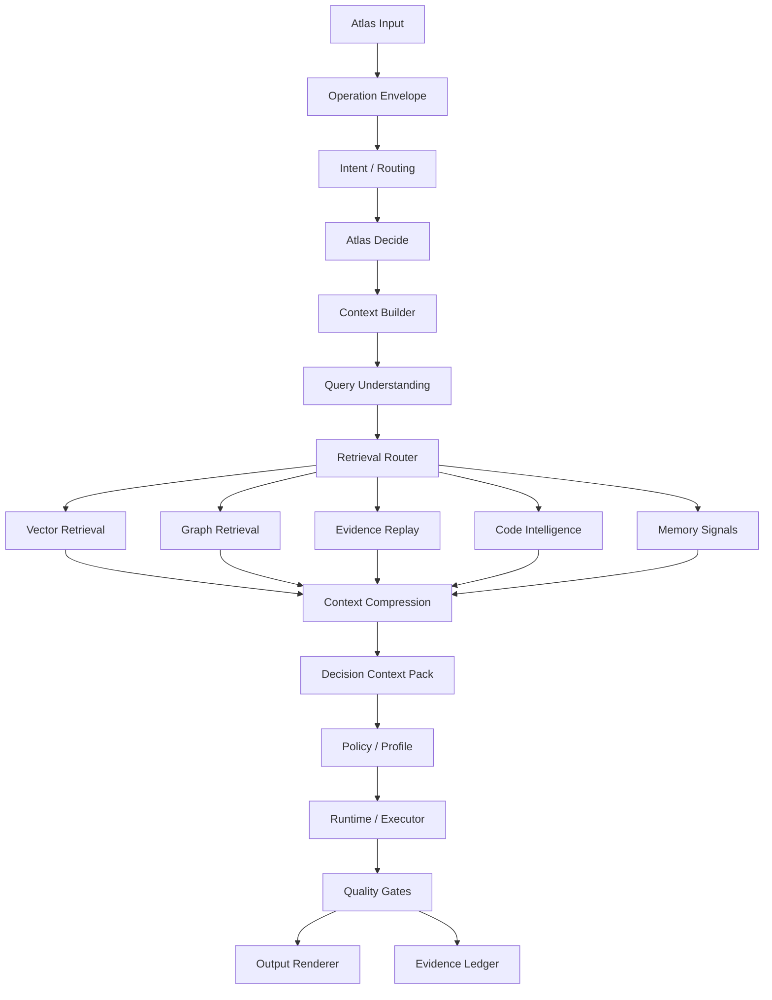

# Evolucao Atlas

> Documento promovido de `/Users/vitorepf/develop/blackink/docs/EVOLUCAO_ATLAS.md` para a Knowledge Base canonica do `atlas-server`.
> Ele deve ser lido como roadmap de evolucao governado pela arquitetura-mae, nao como uma arquitetura paralela.

Documento inicial para evoluir a arquitetura do Atlas a partir da ideia de recuperacao hibrida de contexto: Vector RAG, Graph RAG e Evidence Ledger trabalhando juntos dentro do Context Builder.

O Atlas deve ser entendido como um sistema operacional pessoal de IA, uma especie de Jarvis multi-dominio. Ele nao pertence a um produto especifico. Projetos de software, empresas, campanhas, financas, trades, desenvolvimento pessoal, rotina, conhecimento, automacoes e decisoes de vida sao dominios que o Atlas pode operar.

```text
Atlas Core
-> Domain Plane
   -> Programming
   -> Finance
   -> Trading
   -> Marketing
   -> Personal Development
   -> Self-Improvement
   -> Knowledge
   -> Operations
   -> Life OS
```

Qualquer exemplo de software, empresa, campanha ou produto neste documento deve ser lido apenas como exemplo de dominio, nao como centro da arquitetura.

## 0. Relacao com a arquitetura-mae atual

Este documento nao substitui a arquitetura canonica existente. Ele e um roadmap incremental que deve respeitar os contratos ja implementados em `atlas-server`.

Leitura obrigatoria antes de implementar:

```text
docs/engineering-knowledge-base/atlas-ai-canonical-architecture-index.md
docs/engineering-knowledge-base/atlas-ai-kernel-architecture.md
docs/engineering-knowledge-base/atlas-ai-telemetry-evidence-performance.md
docs/engineering-knowledge-base/atlas-ai-master-architecture.md
```

Mapa de equivalencia:

| Item deste roadmap | Status real no Atlas | Decisao |
| --- | --- | --- |
| Evidence Ledger minimo | Ja existe mais forte: `AtlasEvidenceLedger`, `AtlasLedgerEvent`, `atlas_ledger_events`, `LedgerEventType`, replay e reports | Nao reimplementar |
| Provider Strategy Matrix | Ja existe parcialmente: `AtlasCliProviderStrategyService`, `atlas:cli:providers`, `AiProviderHealthSnapshot`, budget/settings | Evoluir para matriz empirica |
| CLI Provider Usage Event | Parcial: `PROVIDER_CALLED`, `PROVIDER_RETURNED`, `PROVIDER_FALLBACK`, `ai_router_decisions`, telemetry/trace rollups | Formalizar contrato normalizado |
| CLI Provider Performance Ledger | Parcial: telemetry, `ai_router_decisions`, health snapshots e reports existem, mas falta performance contract dedicado por provider/domain/task | Implementar incrementalmente |
| Policy-as-Code minimo | Ja existe em profiles, budgets, settings, guards, gates e runtime checks | Consolidar como policy executavel, nao criar paralelo |
| Dynamic Execution Contract | Ja existe parcialmente via `DecisionReceipt`, `DecisionReceiptRuntimeGuard`, `KernelPipelineContract`, execution guards e pipeline plan | Consolidar/estender; nao criar contrato paralelo |
| Context Pack | Ja existe familia `context-pack`, Open Brain e docs de context injection | Evoluir como Local Context Pack Cache |
| Self-Improvement / Curator | Ja existe com `AtlasSelfImprovementRuntime`, schedule, flows, ledger reports e proposals | Usar como destino de reviews/performance |

Regra de implementacao:

```text
Se ja existe contrato executavel, estender.
Se ja existe tabela/evento, normalizar payload.
Se ja existe service, adicionar adapter/metricas.
Nao criar subsistema paralelo com nome novo para a mesma funcao.
```

Proximo AP recomendado:

```text
AP-99: CLI Provider Usage / Performance Contract

Objetivo:
toda execucao de provider CLI deve gerar evento normalizado que permita aprender empiricamente qual provider funciona melhor por dominio, tipo de tarefa, risco, latencia, gates e outcome.
```

Status no fluxo da arquitetura-mae:

- AP-99 foi implementado como read model operacional de provider performance.
- AP-100 foi implementado como `Context Pack Manifest / Self-Reflection Contract`.
- O proximo incremento natural do Context Builder e AP-101: Retrieval Router
  com decisao explicita entre Vector Retrieval, Graph Retrieval, Evidence Replay,
  Code Intelligence e Memory Signals, sem criar memoria paralela.

## 1. Tese central

O Atlas nao deve escolher entre RAG tradicional e Graph RAG.

Ele deve usar os dois, mais o Evidence Ledger, com roteamento por intencao:

```text
Vector RAG       -> encontra trechos parecidos e evidencias textuais rapidas
Graph RAG        -> percorre relacoes, causas, dependencias e decisoes
Evidence Ledger  -> prova o que aconteceu, quando aconteceu e sob qual recibo
Context Builder  -> mistura as fontes e entrega contexto limpo para decisao/execucao
```

Graph RAG e mais inteligente para raciocinio relacional, mas nao e sempre melhor. Para perguntas simples, factuais ou documentais, Vector RAG costuma ser mais barato, rapido e suficiente. Para perguntas historicas, causais ou estrategicas, Graph RAG e necessario. Para perguntas auditaveis, o Evidence Ledger e a fonte de verdade.

## 2. Onde isso entra no fluxo atual

No fluxograma do Atlas, a evolucao entra principalmente no bloco:

```text
Context Builder
Open Brain, memoria, code intelligence, KB
```

Esse bloco deve ser detalhado como:

```text
Context Builder
- Query Understanding
- Retrieval Router
- Vector Retrieval
- Graph Retrieval
- Evidence Replay
- Code Intelligence
- Memory Signals
- Context Compression
- Source Ranking
- Decision Context Pack
```

O Context Builder nao e apenas uma busca. Ele e o motor que decide qual tipo de memoria consultar, quanto contexto trazer, o que comprimir, o que descartar e o que precisa ser provado antes de chegar no Atlas Decide, Policy/Profile ou Runtime.

## 3. Provider Strategy Matrix como fundacao atual

Provider Strategy Matrix nao e uma evolucao opcional. Ela e parte basica do Atlas desde o fluxo atual.

O principio central continua:

```text
Provider nao decide.
Atlas decide qual provider/CLI usar, por que usar, com qual escopo e com qual limite.
```

Neste momento, a implementacao correta e CLI-first:

```text
Claude CLI
Gemini CLI
Codex CLI
outros CLIs futuros
```

O Atlas nao precisa assumir agora uma arquitetura de API direta ou modelo local. A prioridade imediata e metrificar o uso real via terminal para construir uma matriz empirica:

```text
qual CLI funciona melhor
para qual dominio
para qual tipo de tarefa
com qual latencia
com qual taxa de retrabalho
com qual qualidade percebida
com qual confiabilidade nos gates
```

### 3.1 Onde entra na arquitetura

```text
Atlas Input
-> Operation Envelope
-> Intent / Routing
-> Atlas Decide
-> Provider Strategy Matrix
-> Providers / Drivers
   -> Claude CLI
   -> Gemini CLI
   -> Codex CLI
-> Runtime / Executor
-> Quality Gates
-> Evidence Ledger
-> CLI Provider Performance Ledger
```

O Provider Strategy Matrix deve conversar com:

```text
Policy / Profile
-> limites de privacidade, dominio, autonomia e custo.

Context Builder
-> tamanho e tipo de contexto necessario.

Runtime / Executor
-> ferramenta/CLI que vai executar.

Quality Gates
-> resultado objetivo da escolha.

Adaptive Routing Memory
-> aprendizado posterior sobre rotas melhores.
```

### 3.2 Matriz inicial de estrategia

A matriz inicial pode partir de hipoteses, mas deve ser corrigida por metricas reais.

```text
Gemini CLI
-> contexto gigante
-> analise longa
-> PDFs/livros/repositorios grandes
-> comparacao extensa
-> memoria ampla

Claude CLI
-> raciocinio
-> arquitetura
-> escrita longa
-> revisao estrategica
-> analise de decisao
-> codigo complexo

Codex CLI
-> trabalho no repositorio
-> comandos de terminal
-> patches
-> testes
-> automacao
-> execucao local
```

Regra:

```text
Essa matriz inicial nao e verdade permanente.
Ela e uma hipotese operacional que o Atlas deve medir e ajustar.
```

### 3.3 O que metrificar agora

Schema inicial:

```text
CLI Provider Usage Event
- id
- timestamp
- provider_cli
- model_name_if_available
- domain
- task_type
- task_complexity
- input_context_size_estimate
- output_size_estimate
- started_at
- finished_at
- latency_seconds
- attempts
- repair_count
- quality_gate_result
- user_acceptance
- user_corrections
- failure_reason
- notes
- evidence_ref
```

Metricas agregadas:

```text
success_rate_by_domain
success_rate_by_task_type
average_latency
average_repair_count
user_acceptance_rate
quality_gate_pass_rate
best_provider_by_domain
best_provider_by_task_type
failure_patterns
```

### 3.4 Como o Atlas usa essa matriz

Exemplo:

```text
Tarefa:
"Analise este PDF enorme e conecte com minhas notas."

Provider Strategy Matrix:
-> Gemini CLI como primeira opcao.
-> Claude CLI como revisor se a decisao for estrategica.
-> Codex CLI nao e necessario.
```

```text
Tarefa:
"Implemente essa correcao no repositorio e rode testes."

Provider Strategy Matrix:
-> Codex CLI como executor principal.
-> Claude CLI opcional para revisao arquitetural.
-> Gemini CLI apenas se contexto gigante for necessario.
```

```text
Tarefa:
"Me ajude a decidir se entro nesse trade."

Provider Strategy Matrix:
-> Specialist Agent Council.
-> Finance/Trading/Risk specialists.
-> provider escolhido por desempenho historico nesse dominio.
-> Policy-as-Code e Formal Gates obrigatorios.
```

### 3.5 Privacidade e CLI

Mesmo usando CLI em vez de API direta, o Atlas ainda deve tratar o provider como externo quando houver envio de contexto para modelos de nuvem.

Fluxo recomendado:

```text
Privacy Vault
-> Sensitivity Classification
-> Context Minimization
-> Optional Redaction
-> CLI Provider
```

Regras:

```text
secrets nunca saem.
dado sensivel exige policy.
contexto deve ser minimo suficiente.
logs de uso devem ir para Evidence Ledger.
```

### 3.6 Evolucao futura

O Atlas deve permanecer agnostico:

```text
fase atual:
CLI-first + metricas.

fase futura:
API direta, modelos locais ou hibrido.

principio permanente:
Atlas decide, provider executa.
```

Futuro possivel:

```text
Local Model
-> tarefas simples, privadas ou de baixa latencia.

Cloud CLI/API
-> tarefas complexas que exigem QI alto ou contexto gigante.

Hybrid Router
-> decide com base em privacidade, qualidade, latencia, custo e historico.
```

### 3.7 Ganhos nitidos

- Atlas usa cada motor no seu melhor papel;
- reduz escolha manual de ferramenta;
- cria aprendizado real sobre providers;
- prepara Adaptive Routing Memory;
- melhora custo/latencia mesmo sem API direta;
- aumenta qualidade por dominio;
- preserva o principio "Provider nao decide".

### 3.8 Riscos

- matriz inicial virar dogma;
- medir pouco e concluir errado;
- ignorar privacidade por estar no terminal;
- usar modelo forte demais para tarefa simples;
- criar dependencia excessiva de um provider.

### 3.9 Gates obrigatorios

```text
usage_event_required
provider_choice_reason_required
privacy_check_before_external_provider
quality_gate_feedback_required
manual_override_allowed
periodic_matrix_review
```

### 3.10 Veredito

Provider Strategy Matrix deve funcionar desde o comeco do Atlas. Nesta fase, a melhor implementacao e registrar e medir o uso real das CLIs. Depois, com dados, o Atlas pode decidir se vale adicionar API direta, modelo local ou roteamento hibrido.

## 4. Papel de cada camada

### 4.1 Vector RAG

Vector RAG trabalha com similaridade semantica.

Ele pega documentos, notas, tickets, logs, trechos de codigo ou paginas de conhecimento, quebra em chunks, gera embeddings e busca os trechos mais parecidos com a pergunta.

Use quando a pergunta for:

- factual;
- direta;
- documental;
- baseada em sintaxe;
- baseada em um trecho especifico;
- parecida com algo que ja foi escrito.

Exemplos:

```text
"Onde esta a implementacao do webhook?"
"Qual documento fala sobre Service Worker no Vite?"
"Qual trecho explica como configurar o postback?"
"Mostre erros parecidos com esse log."
"Qual foi o CTR da campanha X ontem?"
```

Pontos fortes:

- simples de implementar;
- rapido para busca textual;
- bom para documentacao, codigo e logs;
- barato para perguntas diretas;
- tolera informacao nao estruturada.

Pontos fracos:

- nao entende bem causa e efeito;
- pode trazer chunks soltos sem historia;
- sofre em perguntas multi-hop;
- pode perder contexto global;
- pode confundir termos parecidos.

### 4.2 Graph RAG

Graph RAG trabalha com entidades e relacoes.

Em vez de buscar apenas trechos parecidos, ele percorre um grafo de conhecimento:

```text
Entidade -> Relacao -> Entidade -> Relacao -> Evidencia
```

Use quando a pergunta exigir:

- causa e efeito;
- historico de decisoes;
- dependencias;
- contradicoes;
- multi-hop reasoning;
- comparacao entre dominios;
- impacto de uma mudanca;
- padroes recorrentes;
- explicacao de "por que" algo aconteceu.

Exemplos:

```text
"Por que escolhemos ofertas de CPA nos EUA em vez de infoprodutos locais?"
"Qual decisao tecnica levou a essa estrategia de cache?"
"Essa queda de tracking tem relacao com a atualizacao do mes passado?"
"Quais politicas essa execucao pode violar?"
"Que bugs se repetiram em funis com esse padrao?"
```

Pontos fortes:

- entende caminhos logicos;
- conecta decisoes, eventos, codigo, metricas e fontes;
- ajuda a explicar causalidade;
- melhora analises estrategicas;
- reduz respostas baseadas em chunks soltos.

Pontos fracos:

- mais caro de construir;
- exige extracao de entidades e relacoes;
- depende da qualidade do grafo;
- pode esconder informacao se o grafo estiver incompleto;
- pode parecer muito convincente mesmo quando uma relacao foi inferida errado.

### 4.3 Evidence Ledger

Evidence Ledger nao e RAG. Ele e a camada auditavel.

Ele registra eventos append-only:

```text
input
decisao
receipt
runtime execution
tool call
gate result
repair loop
output
learning signal
proposal
review
```

Use quando a pergunta exigir prova:

```text
"O que aconteceu exatamente?"
"Quando essa decisao foi tomada?"
"Qual receipt autorizou essa execucao?"
"Qual gate falhou?"
"Qual reparo foi tentado?"
"Quem aprovou essa mudanca?"
```

Pontos fortes:

- auditabilidade;
- replay;
- rastreabilidade;
- confiabilidade operacional;
- separacao entre fato e interpretacao.

Pontos fracos:

- sozinho nao interpreta significado;
- pode ter muitos eventos de baixo nivel;
- precisa de indexacao e compressao para consulta eficiente.

## 5. Regra de ouro

```text
Vector RAG encontra pedacos.
Graph RAG encontra caminhos.
Evidence Ledger prova os fatos.
Context Builder decide a mistura.
```

Essa regra evita dois erros:

1. Usar Graph RAG para tudo e criar um sistema caro, lento e desnecessariamente complexo.
2. Usar apenas Vector RAG e perder historico, causalidade, dependencias e decisoes.

## 6. Roteamento por tipo de pergunta

O Atlas deve classificar a intencao antes de recuperar contexto.

| Tipo de pergunta | Exemplo | Motor principal | Motores auxiliares |
| --- | --- | --- | --- |
| Busca factual | "Qual e a sintaxe desse endpoint?" | Vector RAG | Code Search |
| Busca documental | "Onde esta o playbook de postback?" | Vector RAG | Graph RAG se houver relacoes |
| Busca de codigo | "Onde implementamos esse provider?" | Code Intelligence | Vector RAG |
| Historico de decisao | "Por que escolhemos X?" | Graph RAG | Evidence Ledger |
| Causa e efeito | "O que causou a queda?" | Graph RAG | Ledger + Vector |
| Auditoria | "O que aconteceu no dia 10?" | Evidence Ledger | Graph RAG |
| Risco/politica | "Essa acao viola alguma regra?" | Graph RAG + Policy | Ledger |
| Debug complexo | "Qual deploy gerou esse gap?" | Hybrid | Ledger + Code + Graph |
| Aprendizado | "Que padrao se repetiu?" | Graph RAG | Memory Signals |

## 7. Fluxo padrao do Context Builder



### Etapas

1. **Query Understanding**
   O Atlas identifica se a pergunta pede fato, documento, codigo, decisao, causa, auditoria, risco ou aprendizado.

2. **Retrieval Router**
   Decide quais motores consultar e com qual profundidade.

3. **Vector Retrieval**
   Busca chunks relevantes por similaridade.

4. **Graph Retrieval**
   Percorre entidades e relacoes relevantes.

5. **Evidence Replay**
   Recupera eventos auditaveis que sustentam ou contradizem a resposta.

6. **Code Intelligence**
   Consulta estrutura real do repositorio, simbolos, chamadas, testes e historico quando aplicavel.

7. **Memory Signals**
   Traz padroes, metricas e sinais de aprendizado, sem permitir autoalteracao critica.

8. **Context Compression**
   Remove ruido, junta duplicatas, preserva fontes e compacta o contexto.

9. **Decision Context Pack**
   Entrega um pacote rastreavel para Atlas Decide, Policy/Profile e Runtime.

## 8. Fluxos por caso de uso

### 8.1 Pergunta factual simples

Pergunta:

```text
"Qual e a configuracao correta do webhook?"
```

Fluxo:

```text
Input
-> Intent: factual/documental
-> Vector RAG em docs e KB
-> Code Intelligence se houver implementacao
-> Context Compression
-> Resposta com fonte
-> Evidence Ledger registra pergunta, fontes usadas e output
```

Nao precisa Graph RAG, exceto se a resposta depender de decisao historica.

### 8.2 Pergunta de decisao historica

Pergunta:

```text
"Por que mudamos a estrategia de cache?"
```

Fluxo:

```text
Input
-> Intent: historico/decisao
-> Graph RAG busca entidades: cache, performance, incidente, decisao, deploy
-> Evidence Ledger recupera receipts e eventos
-> Vector RAG busca docs complementares
-> Context Compression monta linha do tempo
-> Resposta diferencia fato, inferencia e decisao aprovada
```

Aqui Graph RAG e o motor principal.

### 8.3 Debug de impacto entre codigo e metrica

Pergunta:

```text
"Cruze as mudancas de codigo do mes passado com as quedas de tracking e diga qual atualizacao pode ter causado o gap."
```

Fluxo:

```text
Input
-> Intent: debug complexo/causal
-> Evidence Ledger recupera deploys, execucoes, gates e incidentes
-> Code Intelligence mapeia arquivos, commits, testes e superficies afetadas
-> Graph RAG conecta deploys, modulos, clientes, metricas e incidentes
-> Vector RAG busca logs, tickets e docs
-> Context Compression monta hipoteses ranqueadas
-> Atlas Decide separa evidencia forte de inferencia
-> Output recomenda verificacoes e proximos passos
```

Nesse caso o Atlas usa os tres: Graph, Vector e Ledger.

### 8.4 Risco e politica

Pergunta:

```text
"Essa execucao pode violar alguma politica de custo, privacidade ou autonomia?"
```

Fluxo:

```text
Input
-> Intent: risco/policy
-> Graph RAG busca relacoes entre tarefa, dominio, politicas e decisoes anteriores
-> Evidence Ledger consulta receipts e limites
-> Policy/Profile aplica permissoes, privacidade, autonomia e custo
-> Atlas Decide aprova, bloqueia ou pede review
```

Aqui o grafo ajuda a descobrir relacoes de risco que uma busca textual pode nao encontrar.

### 8.5 Aprendizado e melhoria

Pergunta:

```text
"Que padrao se repetiu nas ultimas falhas de qualidade?"
```

Fluxo:

```text
Input
-> Intent: aprendizado/padrao
-> Evidence Ledger recupera gates, repair loops e outputs
-> Memory Signals agregam recorrencia
-> Graph RAG conecta falhas, dominios, ferramentas e decisoes
-> Self-Improvement / Curator gera proposta
-> Policy/Review decide se a melhoria entra
```

Importante: aprendizado nao altera comportamento critico sozinho.

## 9. Modelo de grafo recomendado

O grafo deve ter tipos explicitos de nos e arestas.

### 9.1 Tipos de nos

Tipos iniciais:

```text
decision
receipt
policy
playbook
domain_context
source
fact
hypothesis
question
pattern
task
incident
learning_signal
metric
contact
reference
code_symbol
tool
provider
gate
output
```

### 9.2 Tipos de arestas

Tipos iniciais:

```text
supports
contradicts
depends_on
derived_from
part_of
caused_by
blocks
replaces
approved_by
violates_policy
evidenced_by
generated_from
improves
regressed_from
executed_by
failed_gate
repaired_by
observed_in
```

### 9.3 Confianca das relacoes

Toda relacao deve ter nivel de confianca:

```text
explicit    -> declarada por usuario, codigo, receipt ou documento formal
observed    -> observada em evento, metrica ou ledger
inferred    -> inferida por IA ou analise
approved    -> revisada e aceita como conhecimento confiavel
rejected    -> descartada apos revisao
```

Regra critica:

```text
Relacao inferida nao pode alterar comportamento critico sem review, policy ou evidencia suficiente.
```

## 10. Como construir sem fragilizar o Atlas

O grafo nao deve nascer apenas de extracao automatica de IA.

Ele deve ser construido em tres camadas:

### 10.1 Grafo explicito

Criado a partir do que o Atlas ja sabe:

```text
decision receipt
operation envelope
policy
task
runtime execution
tool call
quality gate
repair loop
output
```

Essa e a parte mais confiavel.

### 10.2 Grafo observado

Criado a partir de eventos, metricas e correlacoes:

```text
deploy -> incidente
gate failure -> repair loop
campanha -> queda de metrica
provider -> erro recorrente
dominio -> padrao de risco
```

Essa parte precisa preservar origem e timestamp.

### 10.3 Grafo inferido

Criado por analise de IA:

```text
"essa queda pode estar relacionada ao deploy X"
"essa decisao contradiz uma politica anterior"
"esse padrao apareceu em tres dominios diferentes"
```

Essa parte deve entrar como hipotese, nao como verdade.

### 10.4 Grafo aprovado

Depois de review, evidencia ou policy, uma relacao pode virar conhecimento confiavel:

```text
inferred -> reviewed -> approved
```

## 11. Decision Context Pack

O Context Builder deve produzir um pacote padrao para consumo do Atlas Decide e do Runtime.

Formato conceitual:

```text
Decision Context Pack
- user_intent
- domain
- task_type
- risk_level
- retrieved_chunks
- graph_paths
- ledger_events
- code_references
- policies
- memory_signals
- contradictions
- confidence
- missing_context
- recommended_next_action
```

Separacao importante:

```text
facts       -> sustentados por ledger, codigo, documento ou fonte
inferences  -> sugeridas por grafo, padrao ou modelo
decisions   -> escolhas feitas pelo Atlas Decide dentro de policy/receipt
```

## 12. Politicas de uso

### 12.1 Quando nao usar Graph RAG

Nao usar Graph RAG como caminho principal quando:

- a pergunta e simples e factual;
- a resposta esta em um unico documento;
- a tarefa e encontrar um trecho de codigo;
- a latencia importa mais que a explicacao;
- o grafo ainda nao tem cobertura confiavel daquele dominio;
- o custo de caminhar no grafo nao se justifica.

### 12.2 Quando exigir Graph RAG

Exigir Graph RAG quando:

- a pergunta contem "por que";
- a pergunta pede causa, consequencia ou dependencia;
- envolve historico de decisoes;
- envolve multiplos sistemas;
- envolve risco ou politica;
- envolve aprendizado recorrente;
- precisa conectar metricas, codigo, clientes e eventos.

### 12.3 Quando exigir Evidence Ledger

Exigir Evidence Ledger quando:

- a resposta precisa ser auditavel;
- ha disputa entre fontes;
- a decisao gera custo, risco ou mudanca critica;
- existe reparo, rollback, incidente ou compliance;
- o Atlas vai afirmar que algo aconteceu.

## 13. Falhas esperadas e mitigacoes

| Falha | Risco | Mitigacao |
| --- | --- | --- |
| Vector traz chunks soltos | resposta sem historia | acionar Graph RAG em perguntas causais |
| Grafo incompleto | omissao de contexto | fallback para Vector + Ledger |
| Relacao inferida errada | resposta convincente e falsa | marcar como inferencia e exigir review |
| Ledger volumoso | excesso de eventos | sumarizacao e replay por janela |
| Contexto grande demais | custo e confusao | Context Compression |
| Fonte contraditoria | decisao fragil | explicitar contradicoes e pedir gate/review |
| Autoaprendizado perigoso | mudanca critica indevida | Curator apenas propoe; Policy decide |

## 14. Evolucao incremental sugerida

### Fase 1: Recuperacao hibrida basica

- manter Vector RAG para docs, codigo e notas;
- registrar eventos importantes no Evidence Ledger;
- criar schema inicial de nos e arestas;
- montar Decision Context Pack simples.

### Fase 2: Grafo explicito

- gerar nos automaticamente a partir de decisions, receipts, tasks, gates e outputs;
- conectar eventos do Atlas sem depender de inferencia;
- permitir consultas de historico e auditoria por entidade.

### Fase 3: Grafo observado

- conectar deploys, metricas, incidentes, providers, clientes e dominios;
- criar caminhos de causa provavel;
- integrar Memory Signals com o grafo.

### Fase 4: Grafo inferido com review

- permitir que IA sugira relacoes;
- marcar relacoes como inferred;
- criar fila de review do Curator;
- promover relacoes confiaveis para approved.

### Fase 5: Context Engine maduro

- roteamento automatico por intencao;
- ranking de fontes;
- compressao adaptativa;
- resposta com fato/inferencia/decisao separados;
- replay auditavel para decisoes importantes.

## 15. Proxima evolucao: Agentic Context Engine

Vector RAG, Graph RAG e Evidence Ledger ainda sao motores de recuperacao. Eles respondem a pergunta: "onde esta o contexto certo?"

A proxima evolucao responde outra pergunta:

```text
Quem decide qual memoria consultar, quando buscar de novo, quando desconfiar do resultado e quando acionar ferramentas reais?
```

No Atlas, essa camada deve se chamar conceitualmente:

```text
Agentic Context Engine
```

Ela fica acima dos motores de recuperacao e abaixo do Atlas Decide/Runtime:

```text
Atlas Input
-> Intent / Routing
-> Atlas Decide
-> Agentic Context Engine
   -> Vector RAG
   -> Graph RAG
   -> Evidence Ledger
   -> Text-to-SQL / APIs (fase futura)
   -> Code Intelligence
   -> Tool Runtime
   -> Local Context Pack Cache
   -> Self-Reflection Gates
-> Policy / Profile
-> Runtime / Executor
-> Quality Gates
```

Essa evolucao nao elimina Graph RAG. Ela transforma Graph RAG em uma das ferramentas disponiveis para um agente de contexto.

### 15.1 Agentic RAG

Agentic RAG e RAG com decisao ativa.

Em vez de uma consulta fixa em uma unica base, o Atlas avalia a tarefa, escolhe ferramentas, compara resultados e pode fazer novas buscas antes de responder.

Exemplo:

```text
Pergunta:
"Qual atualizacao pode ter causado a queda de tracking nos clientes premium?"

Agente de contexto:
1. consulta Evidence Ledger para deploys e incidentes;
2. consulta SQL para metricas reais por cliente;
3. consulta Code Intelligence para arquivos alterados;
4. consulta Graph RAG para relacoes entre deploy, modulo, cliente e incidente;
5. consulta Vector RAG para tickets, logs e docs;
6. detecta lacuna;
7. refaz busca focando na janela temporal do problema;
8. entrega hipoteses ranqueadas com evidencia.
```

Casos em que Agentic RAG e melhor:

- investigacao de incidente;
- analise de performance;
- debugging entre codigo, banco e metricas;
- decisoes de produto com varias fontes;
- tarefas em que o Atlas precisa decidir a proxima consulta;
- perguntas em que a primeira recuperacao pode ser insuficiente.

Risco principal:

```text
O agente pode pesquisar demais, gastar demais ou acionar ferramentas sem necessidade.
```

Mitigacao no Atlas:

```text
Policy/Profile define budget, permissoes, autonomia, privacidade e limite de iteracoes.
Decision Receipt registra por que cada ferramenta foi usada.
Quality Gates verificam se a resposta esta sustentada por evidencia suficiente.
```

### 15.2 Memoria hierarquica e episodica

O Atlas nao deve tratar memoria como apenas documentos ou embeddings.

Ele deve separar memorias por funcao:

```text
Working Memory    -> contexto da operacao atual
Episodic Memory   -> eventos passados com tempo, sequencia e resultado
Semantic Memory   -> fatos, conceitos, preferencias, politicas e padroes consolidados
Procedural Memory -> playbooks, rotinas, receitas e modos de executar
```

Mapeamento dentro do Atlas:

| Tipo de memoria | Onde vive | Para que serve |
| --- | --- | --- |
| Working Memory | Operation Envelope + thread atual | manter foco da tarefa atual |
| Episodic Memory | Evidence Ledger | lembrar o que aconteceu, quando e com qual resultado |
| Semantic Memory | Knowledge Graph + AtlasVault | entender conceitos, fatos e relacoes |
| Procedural Memory | Playbooks + Tool Runtime | repetir execucoes confiaveis |
| Preference/Profile Memory | Policy/Profile | respeitar usuario, dominio, custo e autonomia |

Exemplo:

```text
"Na ultima vez que testamos esse pipeline, a conversao caiu."
```

Isso nao deve virar apenas uma nota textual. Deve virar:

```text
episodic event no Evidence Ledger
metric signal em Learning / Memory Signals
relacao no Knowledge Graph
possivel regra/proposta no Curator
```

Regra importante:

```text
Memoria nova nao vira comportamento automatico.
Memoria nova vira sinal.
Sinal vira proposta.
Proposta passa por policy/review.
So entao pode virar playbook, regra ou preferencia operacional.
```

### 15.3 Self-RAG e gates de reflexao

Self-RAG e a capacidade de avaliar criticamente o proprio contexto recuperado antes de responder.

No Atlas, isso deve virar uma etapa explicita:

```text
Self-Reflection Gate
```

Esse gate roda antes do output e, em tarefas de risco, antes do Runtime.

Perguntas que o gate deve fazer:

```text
O contexto recuperado responde a pergunta real?
As fontes sao atuais para este problema?
Existe contradicao entre fontes?
Existe evidencia ou apenas inferencia?
O grafo esta completo o bastante para essa conclusao?
O ledger confirma que isso aconteceu?
Preciso buscar de novo?
Preciso pedir review?
```

Fluxo:

```text
Context Builder
-> Retrieval Results
-> Self-Reflection Gate
   -> suficiente: monta Decision Context Pack
   -> insuficiente: nova busca direcionada
   -> contraditorio: explicita conflito
   -> arriscado: envia para Policy/Review
```

Casos em que Self-RAG e obrigatorio:

- resposta com impacto financeiro;
- execucao de ferramenta;
- alteracao de codigo;
- decisao de campanha;
- afirmacao historica;
- analise causal;
- output baseado em relacao inferida.

### 15.4 Local Context Pack Cache e Context Caching futuro

Na fase atual, CLI-first, o Atlas nao deve depender de API de cache de provider. A implementacao correta agora e um cache local de pacotes de contexto:

```text
Local Context Pack Cache
```

Context Caching de provider pode existir no futuro, se o Atlas adotar API direta ou roteamento hibrido. Por enquanto, o objetivo e manter pacotes locais de contexto estavel, versionados e reutilizaveis por Claude CLI, Gemini CLI, Codex CLI ou outro driver.

Use Local Context Pack Cache para:

- snapshot de um repositorio;
- documentacao canonica;
- especificacao de produto;
- politicas do Atlas;
- playbooks estaveis;
- contexto de um projeto durante uma sessao longa;
- analise concentrada de uma base pequena ou media.

Nao usar como unico caminho quando:

- os dados mudam em tempo real;
- ha necessidade de auditoria precisa por evento;
- a resposta depende de banco de dados vivo;
- o conjunto e grande demais ou muda toda hora;
- a tarefa exige causalidade historica e relacoes tipadas.

No Atlas, Local Context Pack Cache deve ser mais uma fonte do Context Builder:

```text
Local Context Pack Cache
- repo snapshot
- docs canonicas
- policies
- playbooks
- domain pack
- active project pack
```

Fluxo recomendado:

```text
Pergunta simples dentro de contexto carregado
-> Local Context Pack Cache
-> Self-Reflection Gate
-> resposta

Pergunta complexa ou auditavel
-> Local Context Pack Cache
-> Graph RAG
-> Evidence Ledger
-> Self-Reflection Gate
-> resposta com fontes
```

### 15.5 Comparativo operacional

| Arquitetura | Melhor para | Nao serve bem para | Papel no Atlas |
| --- | --- | --- | --- |
| Vector RAG | buscar trechos, docs, codigo e logs | causalidade e historia | Semantic Retrieval |
| Graph RAG | relacoes, decisoes, dependencias e causa | perguntas simples e dados incompletos | Relational Retrieval |
| Evidence Ledger | auditoria, replay e prova | interpretar significado sozinho | Audit Retrieval |
| Agentic RAG | escolher ferramentas e refazer busca | tarefas que exigem resposta deterministica simples | Retrieval Orchestration |
| Memoria episodica | lembrar eventos passados no tempo | substituir politicas | Operational Memory |
| Self-RAG | validar qualidade do contexto | garantir verdade sem fontes boas | Reflection Gate |
| Local Context Pack Cache | contexto grande, estavel e repetido em modo CLI-first | dados vivos e auditoria fina | Fast Global Context |
| Text-to-SQL / APIs futuras | metricas e dados relacionais vivos | conhecimento semantico e texto livre | Live Data Retrieval futuro |

### 15.6 Roteamento final recomendado

O roteador do Atlas deve seguir esta ordem conceitual:

```text
1. A pergunta e simples e esta no contexto carregado?
   -> Local Context Pack Cache

2. A pergunta pede documento, codigo ou trecho especifico?
   -> Vector RAG / Code Intelligence

3. A pergunta pede dado vivo, metrica ou estado atual de negocio?
   -> fase futura: Text-to-SQL / API Tool. Na fase CLI-first, usar fontes locais/exports aprovados.

4. A pergunta pede causa, dependencia, historico ou "por que"?
   -> Graph RAG

5. A pergunta pede prova, replay ou auditoria?
   -> Evidence Ledger

6. A resposta aciona ferramenta, custo, codigo ou decisao critica?
   -> Self-Reflection Gate + Policy/Profile

7. O contexto esta incompleto?
   -> Agentic RAG faz nova busca direcionada
```

### 15.7 O que essa parte trouxe de novo

Diferente do video anterior sobre conhecimento atomico, esta etapa traz uma evolucao real de comportamento:

```text
Antes:
Atlas recupera contexto bom.

Depois:
Atlas decide como recuperar, valida se recuperou bem, busca de novo se precisar, usa ferramentas vivas e registra o aprendizado.
```

Em resumo:

```text
Graph RAG da mapa.
Agentic RAG dirige.
Self-RAG confere.
Episodic Memory lembra.
Local Context Pack Cache acelera na fase CLI-first.
Evidence Ledger prova.
Policy decide o que pode virar acao.
```

## 16. As 6 evolucoes que valem para o Atlas

Depois da comparacao entre RAG tradicional, Graph RAG, Agentic RAG, memoria episodica, Self-RAG, Text-to-SQL e Context Caching, a decisao arquitetural e:

```text
Essas 6 evolucoes valem para o Atlas:

1. Agentic RAG
2. Self-RAG / Self-Reflection Gate
3. Memoria episodica via Evidence Ledger
4. Graph RAG profundo e incremental
5. Local Context Pack Cache por projeto e dominio
6. Text-to-SQL / APIs vivas como fase futura
```

Elas nao entram todas com o mesmo peso e nem ao mesmo tempo. O Atlas deve adotar essas capacidades em camadas, preservando os principios ja definidos no fluxo:

```text
Surface nao decide.
Provider nao decide.
Tool nao decide.
Runtime nao executa sem Decision Receipt.
Learning nao altera comportamento critico sem proposta/review.
Tudo relevante vira Evidence.
```

### 16.1 Agentic RAG

#### O que e

Agentic RAG e a camada que transforma recuperacao de contexto em uma decisao ativa.

Em vez de sempre buscar no mesmo indice, o Atlas decide qual fonte consultar:

```text
Vector RAG
Graph RAG
Evidence Ledger
Text-to-SQL / APIs futuras
Code Intelligence
Local Context Pack Cache
Tool Runtime
```

#### Como entra no Atlas

Agentic RAG entra dentro do Context Builder como o `Retrieval Router` evoluido:

```text
Context Builder
-> Query Understanding
-> Agentic Retrieval Router
   -> escolhe fontes
   -> define budget
   -> executa consultas
   -> compara resultados
   -> busca de novo se faltar contexto
-> Self-Reflection Gate
-> Decision Context Pack
```

Ele nao decide a acao final. Ele decide como recuperar contexto.

```text
Agentic RAG decide a busca.
Atlas Decide decide o plano.
Policy/Profile decide os limites.
Runtime executa apenas com receipt.
```

#### Como melhora o Atlas

- melhora debugging entre codigo, banco, metricas e historico;
- reduz respostas rasas baseadas em uma fonte unica;
- permite novas buscas quando a primeira recuperacao falha;
- combina contexto estatico com dados vivos;
- cria respostas mais fortes para perguntas operacionais complexas.

#### Casos ideais

```text
"O que causou a queda de tracking?"
"Cruze deploys, incidentes e metricas."
"Essa mudanca pode quebrar algum cliente?"
"Por que essa decisao foi tomada?"
"Qual fonte devo consultar para responder isso?"
```

#### Riscos

- buscar demais;
- gastar demais;
- consultar ferramenta desnecessaria;
- misturar fonte fraca com fonte forte;
- gerar uma cadeia longa de raciocinio sem evidencia suficiente.

#### Gates obrigatorios

```text
max_tool_calls
max_cost
max_latency
allowed_sources
read_only_by_default
evidence_required_for_claims
receipt_required_for_execution
```

#### Veredito

Vale muito. Deve ser uma das primeiras evolucoes, mas com limites fortes de custo, latencia e autonomia.

### 16.2 Self-RAG / Self-Reflection Gate

#### O que e

Self-RAG e a capacidade do Atlas avaliar se o proprio contexto recuperado e suficiente, atual, confiavel e relevante antes de responder ou executar.

No Atlas, isso entra como:

```text
Self-Reflection Gate
```

#### Como entra no Atlas

O gate fica depois da recuperacao e antes do Decision Context Pack:

```text
Retrieval Results
-> Self-Reflection Gate
   -> suficiente
   -> insuficiente
   -> contraditorio
   -> arriscado
   -> precisa de ledger
   -> precisa de review
-> Decision Context Pack
```

#### Perguntas do gate

```text
O contexto responde a pergunta real?
As fontes sao atuais?
Existe contradicao?
Existe evidencia ou so inferencia?
O Ledger confirma o evento?
O grafo esta completo?
Ha risco de custo, privacidade ou autonomia?
Preciso buscar de novo?
Preciso pedir review?
```

#### Como melhora o Atlas

- reduz alucinacao embasada em contexto ruim;
- evita execucao baseada em informacao incompleta;
- separa fato, hipotese e decisao;
- melhora qualidade de resposta;
- fortalece Quality Gates antes do output e do Runtime.

#### Casos obrigatorios

```text
alteracao de codigo
acao com custo
acao em producao
analise causal
decisao de campanha
afirmacao historica
uso de relacao inferida
disputa entre fontes
```

#### Riscos

- virar burocracia em tarefas simples;
- aumentar latencia;
- pedir review demais.

#### Gates obrigatorios

```text
skip_for_low_risk_fact_lookup
mandatory_for_high_risk_tasks
contradiction_detection
source_freshness_check
fact_vs_inference_labeling
```

#### Veredito

Vale muito. E uma evolucao de alto impacto e baixo risco. Deve entrar cedo.

### 16.3 Memoria episodica via Evidence Ledger

#### O que e

Memoria episodica e a capacidade de lembrar eventos como episodios no tempo:

```text
quando aconteceu
quem pediu
qual decisao foi tomada
qual receipt autorizou
qual ferramenta executou
qual gate passou/falhou
qual output saiu
qual resultado foi observado
```

No Atlas, a memoria episodica nao deve ser uma camada separada inventada do zero. Ela deve nascer do Evidence Ledger.

#### Como entra no Atlas

```text
Operation Envelope
-> Atlas Decide
-> Decision Receipt
-> Runtime / Executor
-> Quality Gates
-> Output
-> Evidence Ledger
-> Learning / Memory Signals
-> Curator
```

Cada episodio relevante vira uma sequencia auditavel.

#### Como melhora o Atlas

- permite replay;
- cria linha do tempo;
- evita repetir erros;
- conecta decisoes a resultados;
- sustenta aprendizado operacional;
- fornece base confiavel para Graph RAG;
- transforma memoria em evidencia, nao em impressao solta.

#### Exemplos de episodios

```text
"Testamos pipeline X em 2026-05-03."
"A conversao caiu apos deploy Y."
"Quality Gate falhou por timeout."
"Repair Loop tentou estrategia Z."
"Policy bloqueou execucao por custo."
"Curator sugeriu melhoria, mas review rejeitou."
```

#### Riscos

- ledger crescer rapido demais;
- registrar eventos irrelevantes;
- confundir evento com conclusao;
- transformar sinal em regra sem review.

#### Gates obrigatorios

```text
event_schema
append_only
timestamp_required
receipt_link_required_for_actions
source_required
event_importance_level
retention_policy
summary_without_losing_raw_event
```

#### Veredito

Vale muito. Na pratica, ja esta no coracao do Atlas. O salto aqui e tratar o Evidence Ledger explicitamente como memoria episodica operacional.

### 16.4 Graph RAG profundo e incremental

#### O que e

Graph RAG profundo e o uso de um grafo de conhecimento para responder perguntas que dependem de relacoes:

```text
decisao -> motivo -> evidencia -> impacto -> resultado -> aprendizado
```

Ele nao deve substituir Vector RAG. Ele deve ser usado quando existe relacao, causalidade, dependencia ou historico.

#### Como entra no Atlas

O grafo deve nascer primeiro de dados confiaveis:

```text
Evidence Ledger
-> decisions
-> receipts
-> policies
-> tasks
-> gates
-> incidents
-> outputs
-> metrics
-> Knowledge Graph
-> Graph Retrieval
-> Context Builder
```

Camadas do grafo:

```text
explicit  -> criado por receipt, policy, codigo, documento formal
observed  -> observado em evento, metrica ou ledger
inferred  -> sugerido por IA
approved  -> revisado e aceito
rejected  -> descartado
```

#### Como melhora o Atlas

- responde "por que";
- mostra dependencias;
- conecta codigo, metricas, clientes, campanhas e decisoes;
- identifica padroes recorrentes;
- ajuda o Atlas a nao tratar fatos soltos como contexto completo;
- melhora analise de impacto e risco.

#### Casos ideais

```text
"Por que mudamos essa estrategia?"
"Essa decisao contradiz alguma politica?"
"Qual deploy esta relacionado a esse incidente?"
"Que campanhas sofreram com o mesmo padrao?"
"Quais clientes dependem desse modulo?"
```

#### Riscos

- grafo incompleto;
- relacao inferida errada;
- excesso de complexidade;
- manutencao pesada;
- falsa sensacao de verdade.

#### Gates obrigatorios

```text
edge_confidence
source_required_for_edges
inferred_edges_cannot_drive_critical_behavior
fallback_to_vector_and_ledger
contradiction_tracking
review_queue_for_critical_edges
```

#### Veredito

Vale, mas deve ser incremental. Primeiro grafo explicito e observado; depois grafo inferido com review. Nao comecar por um grafo automatico gigante.

### 16.5 Text-to-SQL / APIs vivas como fase futura

#### O que e

Text-to-SQL e APIs vivas permitem que o Atlas consulte dados atuais, nao apenas documentos e memorias.

Importante: isto nao faz parte do escopo atual CLI-first. Deve ficar como fase futura, quando o Atlas tiver decisoes claras sobre conectores, permissao, seguranca, API direta ou integracoes locais.

Isso e essencial para:

```text
metricas
campanhas
clientes
tracking
financeiro
incidentes
estado atual de sistemas
```

#### Como entra no Atlas

No futuro, entra como ferramenta do Agentic Context Engine:

```text
Agentic Retrieval Router
-> identifica necessidade de dado vivo
-> seleciona SQL/API tool
-> aplica Policy/Profile
-> executa em modo permitido
-> resume resultado
-> registra consulta e resultado no Evidence Ledger
-> Self-Reflection Gate valida suficiencia
```

No inicio, deve ser:

```text
read-only
limitado por escopo
com allowlist de tabelas/endpoints
com limite de linhas
com logging completo
```

#### Como melhora o Atlas

- responde com dados reais e atuais;
- cruza metricas com decisoes e deploys;
- melhora analise de campanha;
- ajuda debugging de tracking;
- reduz dependencia de prints, relatos e conhecimento tribal;
- permite investigacao operacional profunda.

#### Casos ideais

```text
"Qual cliente teve queda apos o deploy?"
"Quais campanhas perderam ROI na ultima semana?"
"O tracking caiu em todos ou so em um segmento?"
"Qual provider esta com mais erro hoje?"
"Esse bug aparece em quais contas?"
```

#### Riscos

- query errada;
- vazamento de dados;
- custo alto;
- carga no banco;
- interpretacao errada de metrica;
- acao indevida se virar write cedo demais.

#### Gates obrigatorios

```text
read_only_default
table_allowlist
column_privacy_policy
row_limit
query_timeout
cost_guard
explain_before_execute_for_risky_queries
ledger_log_for_every_query
no_write_without_explicit_receipt
```

#### Veredito

Vale muito para o Atlas no futuro, especialmente por dados vivos. Nao faz parte da Fase 0/Fase 1 CLI-first. Quando entrar, deve comecar read-only, com allowlist, logging e policy forte.

### 16.6 Local Context Pack Cache por projeto e dominio

#### O que e

Local Context Pack Cache mantem um pacote grande e estavel de contexto carregado para uso repetido em modo CLI-first.

Ele e bom para contexto que muda pouco e e usado muitas vezes:

```text
arquitetura do Atlas
politicas
playbooks
docs canonicas
snapshot de repositorio
domain pack
project pack
```

#### Como entra no Atlas

Local Context Pack Cache entra como fonte rapida do Context Builder:

```text
Project Pack
Domain Pack
Policy Pack
Repo Snapshot
Playbook Pack
-> Local Context Pack Cache
-> Context Builder
-> Self-Reflection Gate
```

Ele deve acelerar o Atlas, nao substituir busca, grafo ou ledger.

#### Como melhora o Atlas

- reduz latencia em sessoes longas;
- reduz repeticao de contexto;
- melhora entendimento global de um projeto;
- ajuda refactors e investigacoes grandes;
- permite manter policies e playbooks sempre proximos do modelo;
- diminui necessidade de recuperar o mesmo documento varias vezes.

#### Casos ideais

```text
"Trabalhe neste repositorio por varias horas."
"Analise essa arquitetura inteira."
"Use sempre estas policies."
"Mantenha o contexto deste produto carregado."
"Compare mudancas contra o snapshot do projeto."
```

#### Riscos

- contexto velho;
- excesso de tokens;
- falsa sensacao de completude;
- substituir dados vivos por snapshot antigo;
- custo alto se o cache for mal escolhido.

#### Gates obrigatorios

```text
cache_version
cache_created_at
source_manifest
staleness_check
max_cache_scope
invalidate_on_major_change
ledger_or_live_data_required_for_audit_claims
```

#### Veredito

Vale, mas como acelerador. E excelente para repositorios, policies e playbooks. Nao deve ser fonte de verdade para eventos vivos ou decisoes auditaveis.

### 16.7 Ordem recomendada de adocao

A ordem deve equilibrar impacto, risco e complexidade.

```text
1. Self-Reflection Gate
2. Agentic Retrieval Router
3. Memoria episodica via Evidence Ledger
4. Local Context Pack Cache por projeto/dominio
5. Graph RAG explicito e observado
6. Text-to-SQL / APIs vivas como fase futura
7. Graph RAG inferido com review
8. Automacoes mais autonomas, sempre com policy e receipt
```

Por que essa ordem:

```text
Self-RAG melhora qualidade imediatamente.
Agentic RAG melhora escolha de fontes.
Evidence Ledger cria memoria confiavel.
Local Context Pack Cache acelera depois que os packs canonicos existem.
Graph RAG fica melhor quando ja existe evidencia estruturada.
Text-to-SQL traz dados vivos apenas em fase futura com conectores aprovados.
```

### 16.8 Resultado esperado no Atlas

Antes:

```text
Atlas busca contexto e responde.
```

Depois:

```text
Atlas entende a tarefa,
classifica risco,
escolhe fontes,
consulta ferramentas,
valida o contexto,
separa fato de inferencia,
busca de novo se faltar evidencia,
registra o que aconteceu,
e so entao decide, executa ou pede review.
```

Essa e a diferenca entre um assistente com busca e um sistema operacional de IA.

## 17. Capacidades inspiradas na fronteira de pesquisa

As pesquisas mais avancadas em IA apontam para uma direcao importante: o futuro nao e apenas recuperar contexto melhor. E construir sistemas capazes de representar o mundo, adaptar-se, explorar alternativas, ser auditaveis internamente, consumir menos energia e deliberar antes de agir.

Para o Atlas, essas pesquisas nao entram como implementacao literal de laboratorio. Elas entram como capacidades praticas de produto pessoal: implementaveis, auditaveis e multi-dominio.

```text
Objetivo desta secao:
transformar fronteira de pesquisa em capacidades concretas do Atlas.
```

Essas 6 capacidades devem entrar no roadmap de implementacao do Atlas junto das evolucoes anteriores:

```text
1. Operational World Model
2. Dynamic Runtime Adaptation
3. Diverse Candidate Generation
4. Behavioral Interpretability
5. Sparse Event-Driven Processing
6. Deliberative Planning Loop
```

### 17.1 Modelos de mundo e predicao abstrata

#### Ideia

Modelos de mundo tentam aprender representacoes abstratas do ambiente, em vez de apenas prever o proximo token, pixel ou detalhe superficial.

Exemplo conceitual:

```text
input visual: copo caindo
predicao pixel-level: prever cada fragmento, luz, textura, vidro
predicao abstrata: "o copo provavelmente vai quebrar"
```

Pesquisas como JEPA apontam para essa direcao: aprender representacoes latentes e prever propriedades abstratas do mundo.

#### Como isso se traduz para o Atlas

O Atlas nao precisa implementar JEPA. Mas deve incorporar a ideia de "modelo de mundo operacional":

```text
Operational World Model
- entidades do negocio
- sistemas
- campanhas
- clientes
- modulos de codigo
- policies
- metricas
- riscos
- dependencias
- estados esperados
- consequencias provaveis
```

Na pratica, isso nasce da combinacao:

```text
Knowledge Graph
Evidence Ledger
Memory Signals
Policy/Profile
Domain Plane
```

#### Como melhora o Atlas

- ajuda o Atlas a prever impacto antes de agir;
- melhora analise de risco;
- permite simular consequencias operacionais;
- reduz dependencia de resposta textual rasa;
- fortalece decisoes como "se eu mudar X, o que pode quebrar?"

#### Exemplo no Atlas

```text
"Se alterarmos o tracker.js, quais partes do sistema podem ser afetadas?"

Atlas consulta:
-> grafo de dependencias
-> historico de incidentes
-> gates antigos
-> clientes/modulos afetados
-> policies

Resposta:
-> impacto provavel
-> riscos
-> testes obrigatorios
-> rollback plan
```

#### Vale implementar no Atlas?

Sim, mas como modelo operacional simbolico, nao como JEPA neural.

```text
Implementar agora:
Operational World Model via grafo + ledger + policies.

Nao implementar agora:
treinar arquitetura JEPA propria.
```

### 17.2 Redes dinamicas e adaptacao em tempo real

#### Ideia

Arquiteturas como Liquid Neural Networks exploram redes que se adaptam durante a inferencia, especialmente em ambientes dinamicos como robotica, drones e sinais temporais.

#### Como isso se traduz para o Atlas

O Atlas nao deve tentar alterar pesos de modelo em tempo real. Isso seria caro, perigoso e fora do controle operacional.

A traducao correta e:

```text
Dynamic Runtime Adaptation
```

Ou seja: o Atlas adapta comportamento por contexto, policy, memoria e receipts, nao por mutacao interna do modelo.

```text
modelo base permanece estavel
policy/profile ajusta limites
memory signals informam risco
retrieval muda contexto
runtime escolhe ferramenta
curator propoe melhorias
review aprova mudancas criticas
```

#### Como melhora o Atlas

- permite comportamento adaptativo sem fine-tuning constante;
- evita repetir estrategias que falharam;
- ajusta nivel de autonomia por dominio;
- altera fluxo conforme risco, custo e historico;
- preserva auditabilidade.

#### Exemplo no Atlas

```text
Se um provider falhou 3 vezes em tarefas de deploy:
-> Memory Signal registra padrao
-> Policy reduz autonomia nesse provider
-> Runtime exige gate extra
-> Curator sugere playbook alternativo
```

#### Vale implementar no Atlas?

Sim, como adaptacao governada por memoria e policy.

```text
Implementar agora:
adaptacao por policy, receipts, memory signals e routing.

Nao implementar agora:
redes neurais liquidas treinadas/adaptadas dentro do Atlas.
```

### 17.3 GFlowNets e exploracao diversa

#### Ideia

GFlowNets sao focadas em gerar muitas solucoes diversas e promissoras, em vez de apenas uma resposta considerada "melhor".

Isso e poderoso para espacos de busca grandes:

```text
moleculas
materiais
designs
estrategias
arquiteturas
planos
hipoteses
```

#### Como isso se traduz para o Atlas

O Atlas nao precisa implementar GFlowNets. Mas deve adotar a ideia de exploracao diversa quando houver incerteza.

Nome operacional:

```text
Diverse Candidate Generation
```

Em vez de gerar uma unica solucao:

```text
Atlas gera 3-7 candidatos diferentes
-> avalia por score
-> testa contra constraints
-> passa por gates
-> escolhe ou recomenda
```

#### Como melhora o Atlas

- evita convergir cedo demais para uma solucao ruim;
- melhora brainstorming tecnico;
- melhora estrategias de campanha;
- ajuda arquitetura de software;
- permite comparar planos com risco/custo/impacto;
- aumenta chance de encontrar alternativas fora do caminho obvio.

#### Exemplo no Atlas

```text
"Como resolver a queda de tracking?"

Atlas gera candidatos:
1. rollback do deploy
2. hotfix no parser
3. feature flag por cliente
4. bypass temporario no provider
5. nova telemetria antes de mexer

Depois avalia:
-> evidencia
-> risco
-> custo
-> reversibilidade
-> tempo
-> policy
```

#### Vale implementar no Atlas?

Sim, como padrao de planejamento e geracao de alternativas.

```text
Implementar agora:
candidate generation + scoring + gates.

Nao implementar agora:
GFlowNet matematica/probabilistica propria.
```

### 17.4 Interpretabilidade mecanicista

#### Ideia

Interpretabilidade mecanicista tenta entender como os modelos representam conceitos internamente e como esses conceitos influenciam comportamento.

Essa linha e promissora para seguranca, mas ainda e cara e dificil de aplicar como controle de produto comum.

#### Como isso se traduz para o Atlas

O Atlas nao deve depender de acessar neuronios ou features internas dos modelos comerciais.

A traducao correta e:

```text
Behavioral Interpretability Layer
```

Ou seja, interpretar e auditar comportamento externamente:

```text
qual contexto foi usado
qual fonte sustentou a resposta
qual policy permitiu
qual ferramenta executou
qual gate passou
qual inferencia foi feita
qual evidence foi registrada
```

#### Como melhora o Atlas

- aumenta confianca sem depender da caixa-preta do modelo;
- permite auditoria de decisoes;
- ajuda a detectar comportamento indevido;
- sustenta compliance;
- facilita debug de respostas ruins;
- permite comparar modelos/providers.

#### Exemplo no Atlas

```text
Resposta do Atlas:
"O deploy X provavelmente causou o gap."

Behavioral Interpretability exige:
-> fontes usadas
-> eventos do ledger
-> caminho no grafo
-> metricas consultadas
-> nivel de inferencia
-> contradicoes encontradas
```

#### Vale implementar no Atlas?

Sim, como interpretabilidade comportamental e auditavel.

```text
Implementar agora:
trace de contexto, fontes, ferramentas, gates, receipts e inferencias.

Nao implementar agora:
feature steering ou mechanistic interpretability interna de modelos fechados.
```

### 17.5 Computacao neuromorfica e SNNs

#### Ideia

Spiking Neural Networks e computacao neuromorfica buscam eficiencia energetica usando processamento esparso, assincrono e inspirado em sinais biologicos.

Isso e relevante para robos, sensores, visao em tempo real, edge devices e hardware especializado.

#### Como isso se traduz para o Atlas

No curto prazo, isso nao entra como arquitetura de software do Atlas.

Mas a licao operacional entra:

```text
Sparse Event-Driven Computation
```

O Atlas deve evitar processar tudo o tempo todo. Deve reagir a eventos importantes.

```text
nao reindexar tudo sempre
nao reconstruir grafo inteiro sempre
nao chamar modelo caro para toda tarefa
nao abrir tool pesada sem necessidade
```

#### Como melhora o Atlas

- reduz custo;
- reduz latencia;
- melhora escalabilidade;
- permite pipelines incrementais;
- prioriza eventos relevantes;
- torna o Evidence Ledger mais eficiente.

#### Exemplo no Atlas

```text
Novo evento no Ledger:
-> se baixo impacto: armazenar e resumir depois
-> se medio impacto: atualizar indice/metric signal
-> se alto impacto: acionar curator/gate/review
```

#### Vale implementar no Atlas?

Sim, como arquitetura event-driven e sparse processing.

```text
Implementar agora:
event-driven indexing, incremental updates, selective model calls.

Nao implementar agora:
hardware neuromorfico ou SNNs como motor principal.
```

### 17.6 Raciocinio de Sistema 2 e busca em arvore

#### Ideia

Raciocinio de Sistema 2 usa mais computacao em tempo de resposta para pensar, simular alternativas, testar caminhos e escolher melhor antes de responder.

Isso aparece comercialmente em modelos de reasoning e, em pesquisa, em tecnicas de test-time compute e busca.

#### Como isso se traduz para o Atlas

Essa e a parte mais aplicavel ao Atlas.

Nome operacional:

```text
Deliberative Planning Loop
```

Fluxo:

```text
tarefa complexa
-> gerar planos candidatos
-> simular consequencias
-> avaliar risco/custo/impacto
-> consultar evidence
-> escolher plano
-> gerar receipt
-> executar em etapas
-> gates
-> repair loop se falhar
```

#### Como melhora o Atlas

- melhora tarefas complexas de codigo;
- melhora planejamento de campanha;
- reduz execucao impulsiva;
- permite comparar planos antes de agir;
- ajuda em incidentes;
- fortalece repair loops;
- aproxima o Atlas de um sistema que pensa antes de executar.

#### Exemplo no Atlas

```text
"Refatore o tracker sem quebrar clientes ativos."

Atlas:
1. gera 3 planos;
2. estima risco por modulo;
3. busca historico de bugs;
4. escolhe plano reversivel;
5. cria receipt;
6. executa em pequenos passos;
7. roda gates;
8. registra evidence;
9. faz repair se necessario.
```

#### Vale implementar no Atlas?

Sim. Deve entrar como camada de planejamento para tarefas de alto risco.

```text
Implementar agora:
multi-plan generation, simulation, scoring, staged execution, gates.

Nao implementar agora:
MCTS completo como dependencia central para qualquer tarefa.
```

### 17.7 Classificacao para o Atlas

| Pesquisa | Capacidade Atlas | Entra no roadmap? | Nao fazer agora |
| --- | --- | --- | --- |
| Modelos de mundo / JEPA | Operational World Model | Sim | Treinar JEPA proprio |
| Liquid Neural Networks | Dynamic Runtime Adaptation | Sim | Alterar pesos/modelos em tempo real |
| GFlowNets | Diverse Candidate Generation | Sim | Implementar GFlowNet matematica |
| Interpretabilidade mecanicista | Behavioral Interpretability Layer | Sim | Depender de neuronios/features internas |
| SNNs / neuromorfica | Sparse Event-Driven Processing | Sim | Hardware neuromorfico |
| Sistema 2 / MCTS | Deliberative Planning Loop | Sim | MCTS pesado para tudo |

### 17.8 O que realmente muda no Atlas

Essas pesquisas nao mudam os blocos principais do fluxograma. Elas refinam como o Atlas deve pensar por dentro.

```text
Antes:
Atlas recupera contexto, decide e executa.

Depois:
Atlas mantem um modelo operacional do mundo,
adapta comportamento por memoria e policy,
gera alternativas diversas,
explica externamente suas decisoes,
processa eventos de forma esparsa,
e usa deliberacao profunda quando a tarefa exige.
```

Em termos de arquitetura:

```text
Operational World Model
-> Dynamic Runtime Adaptation
-> Diverse Candidate Generation
-> Behavioral Interpretability
-> Sparse Event-Driven Processing
-> Deliberative Planning Loop
```

### 17.9 Ordem pratica de implementacao

Ordem recomendada:

```text
1. Behavioral Interpretability Layer
2. Sparse Event-Driven Processing
3. Deliberative Planning Loop
4. Diverse Candidate Generation
5. Operational World Model
6. Dynamic Runtime Adaptation
```

Por que essa ordem:

```text
Interpretabilidade externa melhora confianca imediatamente.
Processamento esparso reduz custo desde cedo.
Deliberacao melhora tarefas de alto risco.
Geracao diversa melhora planejamento e criatividade.
Modelo operacional do mundo depende de grafo/ledger maduros.
Adaptacao dinamica depende de policy e memoria bem governadas.
```

### 17.10 Como essas 6 se juntam as evolucoes anteriores

As capacidades desta secao nao substituem Agentic RAG, Self-RAG, Graph RAG, Evidence Ledger, Local Context Pack Cache ou Text-to-SQL futuro. Elas ficam acima e ao redor dessas camadas, dando comportamento operacional ao Atlas.

```text
Agentic RAG
-> escolhe fontes e ferramentas.

Self-RAG
-> verifica se o contexto presta.

Evidence Ledger
-> registra episodios e prova fatos.

Graph RAG
-> conecta relacoes.

Text-to-SQL / APIs futuras
-> traz dados vivos quando conectores forem aprovados.

Local Context Pack Cache
-> acelera contexto estavel.

Operational World Model
-> entende impacto e consequencia entre dominios.

Dynamic Runtime Adaptation
-> muda estrategia com base em historico real.

Diverse Candidate Generation
-> cria opcoes antes de escolher.

Behavioral Interpretability
-> explica por que o Atlas acredita no que acredita.

Sparse Event-Driven Processing
-> foca custo e atencao no que importa.

Deliberative Planning Loop
-> pensa, simula e planeja antes de agir.
```

Visao integrada:

```text
Atlas Input
-> Operation Envelope
-> Intent / Routing
-> Agentic Context Engine
   -> Local Context Pack Cache
   -> Vector RAG
   -> Graph RAG
   -> Evidence Ledger
   -> Text-to-SQL / APIs futuras
   -> Code / Tool Intelligence
-> Operational World Model
-> Diverse Candidate Generation
-> Deliberative Planning Loop
-> Self-Reflection Gate
-> Policy / Profile
-> Dynamic Runtime Adaptation
-> Runtime / Executor
-> Quality Gates
-> Behavioral Interpretability
-> Evidence Ledger
-> Sparse Event-Driven Updates
-> Curator / Self-Improvement
```

## 18. Tres capacidades adicionais que entram no roadmap

Alem das capacidades ja definidas, esta analise adiciona tres blocos muito importantes para transformar o Atlas em um sistema pessoal realmente forte:

```text
1. Candidate Sandbox / Branch Evaluator
2. Specialist Agent Council
3. Adaptive Routing Memory
```

Essas tres capacidades nao substituem Agentic RAG, Self-RAG, Evidence Ledger, Graph RAG ou Deliberative Planning Loop. Elas tornam essas camadas mais profissionais:

```text
Candidate Sandbox
-> testa alternativas antes de expor output ou executar.

Specialist Agent Council
-> faz o Atlas pensar com especialistas por dominio.

Adaptive Routing Memory
-> faz o Atlas aprender qual estrategia funciona melhor ao longo do tempo.
```

### 18.1 Candidate Sandbox / Branch Evaluator

#### O que e

Candidate Sandbox e a capacidade do Atlas gerar, testar e comparar multiplas alternativas em um ambiente controlado antes de entregar uma resposta, executar uma acao ou criar um Decision Receipt final.

Ele transforma o Repair Loop de reativo para proativo.

```text
Repair Loop reativo:
executa -> falha -> corrige -> tenta de novo

Candidate Sandbox:
gera opcoes -> testa/simula -> escolhe melhor -> executa com mais confianca
```

#### Por que isso importa para o Atlas

O Atlas nao deve agir como um assistente que responde a primeira solucao plausivel. Ele deve agir como um operador cuidadoso: criar alternativas, testar consequencias e escolher o caminho mais seguro.

Essa capacidade e especialmente importante porque o Atlas sera multi-dominio:

```text
programacao
financas
trades
marketing
rotina
desenvolvimento pessoal
decisoes estrategicas
automacoes
```

Em todos esses dominios, a primeira resposta plausivel pode estar errada, cara, arriscada ou desalinhada com seus objetivos.

#### Onde entra na arquitetura

Candidate Sandbox entra dentro do Deliberative Planning Loop e antes do Runtime/Executor:

```text
Atlas Decide
-> Deliberative Planning Loop
-> Diverse Candidate Generation
-> Candidate Sandbox / Branch Evaluator
   -> simula
   -> testa
   -> compara
   -> ranqueia
   -> rejeita branches fracas
-> Self-Reflection Gate
-> Policy / Profile
-> Decision Receipt
-> Runtime / Executor
```

Para tarefas apenas consultivas, ele pode rodar antes do Output Renderer:

```text
pergunta complexa
-> gerar alternativas de resposta/plano
-> avaliar riscos e evidencias
-> entregar melhor resposta com alternativas descartadas resumidas
```

#### Como implementar

Implementacao inicial:

```text
Candidate
- id
- description
- domain
- assumptions
- required_context
- expected_gain
- estimated_cost
- estimated_risk
- reversibility
- evidence_used
- policy_constraints
- test_plan
- simulation_result
- score
- rejection_reason
```

Pipeline:

```text
1. Gerar 3-7 candidatos.
2. Definir criterios de avaliacao.
3. Simular impacto de cada candidato.
4. Rodar testes quando houver ambiente executavel.
5. Consultar Evidence Ledger para historico parecido.
6. Consultar Policy/Profile para limites.
7. Ranqueiar por score.
8. Escolher candidato vencedor ou pedir review.
9. Registrar candidatos e decisao no Evidence Ledger.
```

Score sugerido:

```text
score =
  expected_gain
  - risk
  - cost
  + reversibility
  + evidence_strength
  + policy_fit
  - uncertainty
```

#### Exemplos multi-dominio

Programacao:

```text
Pedido:
"Refatore esse modulo sem quebrar o sistema."

Candidatos:
1. refactor total
2. extracao incremental
3. wrapper de compatibilidade
4. feature flag

Sandbox:
-> roda testes
-> checa dependencias
-> estima risco
-> escolhe caminho incremental
```

Trade:

```text
Pedido:
"Vale entrar nesse trade?"

Candidatos:
1. entrar posicao cheia
2. entrar posicao reduzida
3. esperar confirmacao
4. nao entrar

Sandbox:
-> calcula perda maxima
-> compara com plano
-> verifica estado emocional
-> checa calendario macro
-> escolhe esperar ou reduzir posicao
```

Financas:

```text
Pedido:
"Como reorganizar meu caixa este mes?"

Candidatos:
1. aumentar reserva
2. quitar divida
3. investir parcialmente
4. reduzir gastos variaveis

Sandbox:
-> simula caixa 30/60/90 dias
-> calcula risco de liquidez
-> compara com objetivos
```

Desenvolvimento pessoal:

```text
Pedido:
"Como ajustar minha rotina?"

Candidatos:
1. acordar mais cedo
2. reduzir carga de treino
3. bloquear horario de foco
4. cortar tarefa de baixo valor

Sandbox:
-> compara energia, sono, agenda e aderencia historica
-> escolhe mudanca menor e sustentavel
```

#### Ganhos nitidos

- reduz execucao impulsiva;
- reduz dependencia de repair reativo;
- melhora qualidade antes do output;
- aumenta reversibilidade das decisoes;
- diminui custo de erro;
- torna decisoes de trade/financas/programacao mais disciplinadas;
- gera evidencias sobre por que uma opcao foi escolhida.

#### Riscos

- latencia maior;
- custo maior em tarefas simples;
- excesso de alternativas;
- falsa sensacao de seguranca se a simulacao for fraca;
- paralisia por analise.

#### Gates obrigatorios

```text
use_only_for_medium_or_high_risk
max_candidates
max_simulation_cost
must_define_scoring_criteria
must_log_rejected_candidates_for_critical_tasks
policy_required_before_execution
ledger_required_for_final_choice
```

#### Veredito

Deve entrar cedo. E uma das capacidades com maior ganho pratico para o Atlas, porque melhora qualquer dominio onde decisao ruim custa caro.

### 18.2 Specialist Agent Council

#### O que e

Specialist Agent Council e uma mesa controlada de especialistas temporarios que o Atlas instancia para tarefas complexas, ambiguas ou multi-dominio.

Nao e um enxame livre. Nao e um grupo de agentes autonomos fazendo coisas soltas.

E um conselho estruturado:

```text
cada agente tem papel
cada agente recebe escopo limitado
cada agente produz uma analise curta
discordancias sao preservadas
um sintetizador consolida
Policy/Profile decide limites
Decision Receipt registra a escolha
```

#### Por que isso importa para o Atlas

Como o Atlas sera seu Jarvis multi-dominio, muitas decisoes nao pertencem a um unico campo.

Exemplo:

```text
"Devo entrar nesse trade hoje?"
```

Isso nao e apenas trading. Pode envolver:

```text
risco financeiro
estado emocional
plano semanal
historico de disciplina
liquidez
noticias
qualidade do setup
exposicao total
```

Um unico modelo pode misturar tudo e responder bonito. Um conselho estruturado separa perspectivas.

#### Onde entra na arquitetura

Specialist Agent Council entra depois do Intent/Routing e antes do Deliberative Planning Loop ou Atlas Decide final:

```text
Atlas Input
-> Operation Envelope
-> Intent / Routing
-> Agentic Context Engine
-> Specialist Agent Council
   -> Domain Specialists
   -> Risk / Devil's Advocate
   -> Evidence Auditor
   -> Policy Interpreter
   -> Decision Synthesizer
-> Consensus / Disagreement Pack
-> Deliberative Planning Loop
-> Candidate Sandbox
-> Policy / Profile
-> Decision Receipt
```

Ele deve ser acionado apenas quando a tarefa justificar:

```text
multi-dominio
alto risco
alta incerteza
decisao financeira
trade
mudanca importante de rotina
arquitetura de software relevante
estrategia de negocio
conflito entre objetivos
```

#### Agentes iniciais recomendados

```text
Programming Specialist
Finance Specialist
Trading Specialist
Marketing Specialist
Personal Development Specialist
Operations Specialist
Research Specialist
Risk / Devil's Advocate
Evidence Auditor
Policy Interpreter
Decision Synthesizer
```

Cada agente deve ter contrato fixo:

```text
Specialist Output
- role
- domain
- conclusion
- reasoning_summary
- evidence_used
- risks
- missing_context
- confidence
- recommendation
- disagreement_points
```

#### Como implementar

Etapa 1: conselho textual controlado.

```text
1. Atlas identifica dominios envolvidos.
2. Seleciona 2-5 especialistas.
3. Cada especialista recebe contexto filtrado.
4. Cada um produz parecer curto e estruturado.
5. Evidence Auditor verifica fontes e inferencias.
6. Risk Agent tenta derrubar a decisao.
7. Decision Synthesizer consolida.
8. Self-Reflection Gate valida.
9. Policy/Profile decide se pode agir.
```

Etapa 2: memoria por especialista.

```text
Programming Specialist
-> memoria de padroes tecnicos, bugs, repositorios, tools.

Finance Specialist
-> memoria de caixa, metas, risco, alocacao.

Trading Specialist
-> memoria de setups, erros, disciplina, mercado.

Personal Development Specialist
-> memoria de rotina, energia, sono, habitos, objetivos.
```

Etapa 3: conselho com disagreement tracking.

```text
Se especialistas discordam:
-> preservar discordancia
-> pedir evidencia extra
-> reduzir autonomia
-> acionar Candidate Sandbox
-> ou pedir decisao humana
```

#### Exemplos multi-dominio

Trade:

```text
Pedido:
"Vale entrar comprado agora?"

Trading Specialist:
setup e valido, mas precisa confirmacao.

Finance Specialist:
risco maximo permitido hoje ja esta perto do limite.

Personal Development Specialist:
historico mostra piora de decisao apos noite mal dormida.

Risk Agent:
stop esta mal definido e noticia macro sai em 20 minutos.

Synthesizer:
nao entrar agora; esperar confirmacao ou reduzir tamanho com stop claro.
```

Programacao:

```text
Pedido:
"Quero mudar a arquitetura desse modulo."

Programming Specialist:
plano tecnico possivel.

Operations Specialist:
risco de deploy alto na janela atual.

Evidence Auditor:
incidentes anteriores nessa area exigem teste extra.

Risk Agent:
rollback nao esta definido.

Synthesizer:
implementar atras de feature flag com plano de rollback.
```

Desenvolvimento pessoal:

```text
Pedido:
"Quero aumentar muito minha carga de trabalho essa semana."

Operations Specialist:
agenda permite parcialmente.

Personal Development Specialist:
risco de queda de energia e consistencia.

Finance Specialist:
ganho potencial existe, mas nao justifica quebrar rotina critica.

Synthesizer:
aumentar foco em 2 blocos, nao em 5; preservar sono e treino.
```

#### Ganhos nitidos

- melhora decisoes multi-dominio;
- reduz cegueira de um unico modelo;
- explicita conflitos;
- melhora gestao de risco;
- cria decisoes mais parecidas com uma mesa de especialistas;
- ajuda o Atlas a te proteger de decisoes impulsivas;
- melhora personalizacao por dominio.

#### Riscos

- custo e latencia;
- excesso de agentes;
- debate artificial sem ganho;
- agentes redundantes;
- consenso falso;
- especialistas inventando contexto.

#### Gates obrigatorios

```text
max_agents
max_rounds
specialist_scope_required
no_tool_execution_by_specialists_without_receipt
evidence_required_for_strong_claims
disagreement_must_be_preserved
synthesizer_cannot_hide_risk
policy_required_for_action
```

#### Veredito

Vale muito. Deve entrar depois de Self-Reflection Gate e Evidence Ledger basico, e antes de autonomia alta. O ganho e enorme para um Atlas pessoal multi-dominio.

### 18.3 Adaptive Routing Memory

#### O que e

Adaptive Routing Memory e a versao segura e governada da ideia de Test-Time Training.

O Atlas nao altera pesos neurais em tempo real. Em vez disso, ele aprende estatisticamente quais rotas, modelos, ferramentas, especialistas e estrategias funcionam melhor para cada dominio e tipo de tarefa.

```text
Nao:
modelo muda seus pesos sozinho.

Sim:
Atlas atualiza memoria de desempenho de rotas.
```

#### Por que isso importa para o Atlas

Com o tempo, o Atlas deve aprender como ajudar melhor voce:

```text
qual modelo e melhor para codigo
qual modelo e melhor para analise longa
qual especialista costuma acertar em trades
qual ferramenta e cara demais
qual rota falha mais em tarefas financeiras
qual tipo de decisao precisa de review
qual fluxo gera melhor resultado para rotina
```

Isso torna o Atlas mais personalizado, barato e preciso sem abrir mao de governanca.

#### Onde entra na arquitetura

Adaptive Routing Memory fica entre Learning/Memory Signals, Policy/Profile e Agentic Context Engine:

```text
Evidence Ledger
-> Quality Gates
-> Outcome Evaluation
-> Learning / Memory Signals
-> Routing Performance Store
-> Policy / Profile
-> Agentic Retrieval Router
-> Runtime / Executor
```

Ele influencia escolhas como:

```text
qual modelo usar
qual ferramenta consultar
quantos especialistas chamar
se precisa de Candidate Sandbox
se precisa de Self-Reflection Gate forte
se a tarefa pode ser automatizada
qual budget permitir
```

#### Como implementar

Schema inicial:

```text
Routing Performance Record
- route_id
- domain
- task_type
- model/provider
- tools_used
- specialists_used
- context_sources
- cost
- latency
- quality_gate_result
- user_feedback
- outcome_score
- failure_reason
- timestamp
```

Metricas:

```text
success_rate
average_cost
average_latency
repair_rate
user_override_rate
policy_block_rate
confidence_calibration
domain_fit_score
```

Uso:

```text
1. Registrar cada rota relevante.
2. Avaliar resultado por gates, feedback e outcomes.
3. Atualizar score da rota.
4. Sugerir melhor rota futura.
5. Aplicar apenas se policy permitir.
6. Enviar mudancas criticas para Curator/Review.
```

#### Exemplos multi-dominio

Programacao:

```text
Historico:
modelo A gera codigo mais rapido, mas falha mais nos testes.
modelo B e mais caro, mas passa nos gates.

Atlas aprende:
usar A para exploracao inicial;
usar B para patch final ou revisao critica.
```

Trading:

```text
Historico:
decisoes tomadas sem Risk Agent tiveram mais arrependimento.

Atlas aprende:
em trades com volatilidade alta, sempre chamar Risk Agent.
```

Financas:

```text
Historico:
analises com dados vivos reduziram erro de planejamento.

Atlas aprende:
para caixa e alocacao, sempre consultar dados atuais antes de recomendar.
```

Desenvolvimento pessoal:

```text
Historico:
planos agressivos demais tiveram baixa aderencia.

Atlas aprende:
para rotina, preferir mudancas menores e progressivas.
```

#### Ganhos nitidos

- Atlas melhora com uso real;
- reduz custo ao escolher rotas melhores;
- aumenta qualidade por dominio;
- reduz repeticao de falhas;
- personaliza comportamento sem fine-tuning;
- preserva controle e auditabilidade;
- transforma feedback em melhoria operacional.

#### Riscos

- aprender padroes errados;
- otimizar para custo e perder qualidade;
- reforcar vieses recentes;
- adaptar demais a poucos exemplos;
- mudar comportamento sem o usuario perceber.

#### Gates obrigatorios

```text
minimum_sample_size
decay_old_data
human_review_for_critical_policy_changes
no_autonomy_increase_without_review
separate_cost_score_from_quality_score
route_change_logging
rollback_routing_policy
```

#### Veredito

Vale muito, mas deve entrar depois que Evidence Ledger, Quality Gates e Outcome Evaluation existirem. Sem avaliacao de resultado, a memoria de roteamento aprende ruido.

### 18.4 Ordem correta de implementacao dessas 3

Ordem recomendada:

```text
1. Candidate Sandbox / Branch Evaluator
2. Specialist Agent Council
3. Adaptive Routing Memory
```

Por que:

```text
Candidate Sandbox melhora qualidade imediatamente e depende pouco de historico.
Specialist Agent Council melhora decisoes complexas depois que ha gates e contexto.
Adaptive Routing Memory depende de dados de resultado acumulados para aprender bem.
```

Ordem global:

```text
Usar somente a ordem canonica da secao "Implementation Handoff / Escopos Fechados".
Esta subsecao define apenas a ordem relativa dessas 3 capacidades.
```

Observacao:

```text
Diverse Candidate Generation gera as opcoes.
Candidate Sandbox testa e ranqueia as opcoes.
Deliberative Planning Loop coordena o processo completo.
Specialist Agent Council adiciona perspectivas por dominio.
Adaptive Routing Memory aprende quais rotas funcionam melhor.
```

## 19. Capacidades pessoais e longitudinais do Atlas

Esta etapa reforca que o Atlas nao e apenas um agente de execucao. Ele e um sistema pessoal multi-dominio, capaz de acompanhar continuidade, contexto de vida, energia, risco, trabalho, dinheiro, aprendizado e decisoes ao longo do tempo.

Do texto analisado, a maior parte ja estava coberta:

```text
Graph RAG
Memoria episodica/hierarquica
Local Context Pack Cache / Context Caching futuro
Specialist Agent Council
Candidate Sandbox / Sistema 2
Diverse Candidate Generation
Self-RAG
Dynamic Runtime Adaptation
Adaptive Routing Memory
```

O que esta etapa adiciona de bom ao roadmap:

```text
1. Personal Data Ingestion / Privacy Vault
2. Life Timeline / Body-Cognition Memory
3. Policy-as-Code / Hard Runtime Constraints
4. Proactive Curator Protocols
```

Esses quatro blocos tornam o Atlas mais pessoal, mais seguro e mais capaz de entender padroes reais da vida do usuario.

### 19.1 Personal Data Ingestion / Privacy Vault

#### O que e

Personal Data Ingestion e a capacidade do Atlas importar, indexar e usar dados pessoais selecionados:

```text
notas
PDFs
livros
repositorios
planilhas
calendarios
mensagens selecionadas
historico de decisoes
arquivos locais
logs de rotina
dados financeiros
dados de trades
registros de treino/sono/habitos
```

Privacy Vault e a camada que controla o que pode ser lido, lembrado, indexado, compartilhado, resumido ou usado em uma decisao.

O Atlas nao deve tratar "ler tudo do Mac/iPhone" como permissao implicita. O correto e:

```text
ingestao por escopo
permissao explicita
classificacao de sensibilidade
controle de retencao
uso auditavel
```

#### Onde entra na arquitetura

```text
Human Knowledge Surface
-> Personal Data Ingestion
-> Privacy Vault
-> Classification / Sensitivity Layer
-> Vector Index
-> Knowledge Graph
-> Evidence Ledger
-> Context Builder
```

O Privacy Vault tambem conversa com Policy/Profile:

```text
Policy / Profile
-> define permissoes de leitura
-> define permissoes de memoria
-> define o que pode sair do vault
-> define quais dominios podem usar quais dados
```

#### Como implementar

Schema inicial:

```text
Vault Item
- id
- source_type
- source_path_or_connector
- owner
- domain
- sensitivity_level
- allowed_uses
- retention_policy
- indexed_at
- last_seen_at
- summary
- embeddings_ref
- graph_nodes_ref
- ledger_events_ref
```

Niveis de sensibilidade:

```text
public
internal
personal
financial
health_related
credentials_or_secrets
restricted
never_export
```

Permissoes:

```text
can_read
can_index
can_summarize
can_remember
can_use_for_decision
can_send_to_provider
can_include_in_output
can_delete
```

#### Ganhos nitidos

- Atlas entende contexto real sem o usuario explicar tudo sempre;
- melhora memoria pessoal;
- permite pesquisa profunda em arquivos, livros, notas e projetos;
- conecta conhecimento pessoal com decisoes;
- reduz perda de contexto entre sessoes;
- cria base para Life Timeline e Graph RAG multi-dominio.

#### Riscos

- vazamento de dados;
- memoria indevida;
- uso de dado sensivel em contexto errado;
- indexar coisa demais;
- custo alto;
- respostas usando informacao antiga ou privada sem perceber.

#### Gates obrigatorios

```text
explicit_scope_required
sensitivity_classification_required
provider_export_policy
secrets_detection
right_to_forget
source_manifest
vault_access_logging
no_cross_domain_use_without_policy
```

#### Veredito

Vale muito. Deve ser implementado cedo, mas com escopo controlado. O Atlas so vira um Jarvis real se puder acessar o mundo pessoal do usuario com privacidade forte.

### 19.2 Life Timeline / Body-Cognition Memory

#### O que e

Life Timeline e a linha do tempo pessoal do Atlas.

Body-Cognition Memory e a capacidade de conectar sinais fisicos, emocionais, cognitivos e operacionais:

```text
sono
treino
alimentacao
energia
humor
foco
rotina
trabalho profundo
programacao
financas
trades
decisoes
erros
vitorias
estresse
descanso
```

A ideia central:

```text
o Atlas nao deve lembrar apenas o que aconteceu,
mas tambem em que estado o usuario estava quando decidiu ou executou.
```

#### Onde entra na arquitetura

```text
Evidence Ledger
-> Life Timeline
-> Memory Signals
-> Knowledge Graph
-> Personal Development Domain
-> Finance / Trading / Programming Domains
-> Curator
```

Ela e uma extensao da memoria episodica:

```text
evento
-> estado pessoal
-> decisao
-> acao
-> resultado
-> aprendizado
```

#### Como implementar

Schema inicial:

```text
Life Event
- id
- timestamp
- domain
- event_type
- description
- body_state
- cognitive_state
- emotional_state
- context
- decision
- action
- outcome
- confidence
- source
- privacy_level
```

Estados possiveis:

```text
body_state:
  sleep_hours
  training_load
  nutrition_quality
  fatigue
  recovery

cognitive_state:
  focus
  clarity
  impulsivity
  stress
  confidence

operational_state:
  workload
  deadlines
  financial_pressure
  market_volatility
  social_context
```

#### Ganhos nitidos

- Atlas identifica padroes pessoais invisiveis;
- melhora decisoes de trade e dinheiro;
- evita overwork;
- conecta rotina a performance;
- ajuda desenvolvimento pessoal com evidencia;
- entende quando uma decisao foi tecnicamente boa, mas tomada em estado ruim;
- permite recomendacoes mais humanas e personalizadas.

#### Exemplos

Trade:

```text
Padrao detectado:
trades apos noite ruim + estresse alto tiveram maior taxa de arrependimento.

Proposta:
em dias com sono baixo, exigir Risk Agent e reduzir tamanho ou bloquear trade impulsivo.
```

Programacao:

```text
Padrao detectado:
blocos de programacao profunda rendem mais depois de treino leve e cafe da manha completo.

Proposta:
priorizar codigo dificil nesse periodo.
```

Financas:

```text
Padrao detectado:
decisoes financeiras agressivas aparecem em semanas de pressao de caixa.

Proposta:
acionar Finance Specialist + Risk Agent antes de comprometer capital.
```

Rotina:

```text
Padrao detectado:
planos muito ambiciosos quebram apos 4 dias.

Proposta:
reduzir mudancas para incrementos menores.
```

#### Riscos

- inferir demais a partir de poucos dados;
- parecer invasivo;
- confundir correlacao com causa;
- usar dado de saude/estado pessoal de forma sensivel;
- criar culpa em vez de suporte.

#### Gates obrigatorios

```text
privacy_first
correlation_not_causation_label
minimum_evidence_before_pattern
user_can_correct_memory
no_medical_claims
no_critical_decision_from_body_signal_alone
```

#### Veredito

Vale muito para o Atlas pessoal. Deve entrar de forma gradual, primeiro como registro e reflexao, depois como sinais para rotina, trades, financas e performance.

### 19.3 Policy-as-Code / Hard Runtime Constraints

#### O que e

Mechanistic Interpretability literal nao deve ser base de seguranca do Atlas. O Atlas nao pode depender de controlar neuronios internos de modelos comerciais.

A alternativa implementavel e mais forte:

```text
Policy-as-Code / Hard Runtime Constraints
```

Ou seja: regras criticas viram controles executaveis fora do modelo.

```text
modelo pode sugerir
policy valida
runtime obedece
ledger registra
```

#### Onde entra na arquitetura

```text
Atlas Decide
-> Decision Receipt
-> Policy / Profile
-> Hard Runtime Constraints
-> Runtime / Executor
-> Quality Gates
-> Evidence Ledger
```

Policy-as-Code deve governar:

```text
autonomia
custo
risco financeiro
risco de trade
privacidade
acesso a dados
uso de ferramentas
execucao de codigo
alteracao de arquivos
acoes externas
memoria persistente
```

#### Como implementar

Schema inicial:

```text
Policy Rule
- id
- domain
- scope
- condition
- allowed_actions
- blocked_actions
- budget_limit
- autonomy_level
- required_gates
- required_receipt
- review_required
- severity
- created_at
- updated_at
```

Exemplos:

```text
Trading:
se sleep_hours < threshold e volatility = high
-> bloquear posicao cheia
-> exigir Risk Agent
-> exigir confirmacao do usuario

Finance:
se acao compromete caixa acima do limite
-> exigir Finance Specialist
-> exigir simulacao 30/60/90 dias

Programming:
se acao altera producao
-> exigir testes
-> exigir rollback plan
-> exigir Decision Receipt

Privacy:
se dado = financial ou health_related
-> nao enviar para provider externo sem permissao
```

#### Ganhos nitidos

- Atlas nao depende de prompt para obedecer limites;
- reduz risco de autonomia perigosa;
- transforma valores e regras em controles reais;
- permite auditoria;
- aumenta confianca;
- facilita evolucao para automacoes mais autonomas.

#### Riscos

- regras rigidas demais;
- bloquear boas acoes;
- policy desatualizada;
- complexidade de manutencao;
- falso senso de seguranca se as regras forem incompletas.

#### Gates obrigatorios

```text
policy_test_suite
dry_run_mode
policy_change_review
runtime_enforcement
deny_by_default_for_critical_actions
ledger_log_for_policy_decisions
explain_policy_block
```

#### Veredito

Essencial. Deve ser tratado como fundacao de seguranca do Atlas. E a traducao correta de "alinhamento" para um sistema pratico.

### 19.4 Proactive Curator Protocols

#### O que e

O Self-Improvement / Curator nao deve apenas revisar bugs ou gaps tecnicos. Ele deve observar padroes longitudinais e propor novos protocolos de operacao pessoal.

```text
Curator passivo:
recebe problema e sugere melhoria.

Curator proativo:
detecta padrao recorrente e propoe protocolo antes do problema piorar.
```

#### Onde entra na arquitetura

```text
Evidence Ledger
-> Life Timeline
-> Memory Signals
-> Pattern Detection
-> Curator
-> Proposal
-> Policy/Profile
-> Review
-> Approved Protocol
```

Protocolos podem afetar:

```text
rotina
trades
financas
programacao
estudos
sono
treino
marketing
decisoes estrategicas
uso de ferramentas
autonomia do Atlas
```

#### Como implementar

Schema inicial:

```text
Curator Proposal
- id
- detected_pattern
- evidence_window
- affected_domains
- proposed_protocol
- expected_gain
- risk
- required_policy_changes
- trial_period
- success_metric
- rollback_condition
- status
```

Fluxo:

```text
1. Detectar padrao recorrente.
2. Separar correlacao de causalidade.
3. Gerar proposta de protocolo.
4. Definir experimento pequeno.
5. Definir metrica de sucesso.
6. Pedir review quando afetar autonomia/risco.
7. Rodar por periodo limitado.
8. Avaliar resultado.
9. Aprovar, ajustar ou descartar.
```

#### Exemplos

Trade:

```text
Padrao:
perdas maiores em dias de sono ruim.

Protocolo proposto:
em dias com sono baixo, Atlas exige Risk Agent e reduz autonomia para sugestoes de entrada.
```

Programacao:

```text
Padrao:
bugs aumentam quando refactor e feito sem Candidate Sandbox.

Protocolo proposto:
qualquer refactor medio/alto risco passa por Branch Evaluator.
```

Financas:

```text
Padrao:
decisoes de gasto alto acontecem sem simulacao de caixa.

Protocolo proposto:
gasto acima de limite exige simulacao 30/60/90 dias.
```

Desenvolvimento pessoal:

```text
Padrao:
planos de rotina agressivos falham em menos de uma semana.

Protocolo proposto:
mudancas de rotina devem ser limitadas a um ajuste principal por semana.
```

#### Ganhos nitidos

- Atlas passa a melhorar processos, nao so respostas;
- transforma memoria em protocolos;
- reduz repeticao de erros;
- personaliza o sistema ao usuario;
- cria ciclos de melhoria continua;
- protege contra decisoes impulsivas;
- melhora performance de longo prazo.

#### Riscos

- Atlas ficar controlador;
- propor protocolo baseado em pouco dado;
- confundir preferencia momentanea com regra;
- excesso de sugestoes;
- reduzir flexibilidade.

#### Gates obrigatorios

```text
minimum_pattern_evidence
proposal_not_autoapply
trial_period_required
success_metric_required
user_review_for_life_protocols
rollback_condition_required
curator_rate_limit
```

#### Veredito

Vale muito. E uma das partes que mais aproxima o Atlas de um Jarvis pessoal: ele observa, aprende, propoe e melhora rotinas sem tomar controle indevido.

### 19.5 Ordem de implementacao dessas capacidades

Ordem recomendada:

```text
1. Policy-as-Code / Hard Runtime Constraints
2. Personal Data Ingestion / Privacy Vault
3. Life Timeline / Body-Cognition Memory
4. Proactive Curator Protocols
```

Por que:

```text
Policy-as-Code precisa vir antes para proteger o sistema.
Privacy Vault vem antes de ingerir contexto pessoal sensivel.
Life Timeline depende de eventos e dados pessoais classificados.
Curator proativo depende de padroes longitudinais confiaveis.
```

Ordem global:

```text
Usar somente a ordem canonica da secao "Implementation Handoff / Escopos Fechados".
Esta subsecao define apenas a ordem relativa dessas capacidades pessoais.
```

### 19.6 Ajustes importantes no texto analisado

Algumas ideias do texto sao validas, mas precisam ser traduzidas para uma versao segura:

```text
Mechanistic Interpretability literal
-> nao usar como dependencia.
-> traduzir para Policy-as-Code + Behavioral Interpretability.

Test-Time Training literal
-> nao permitir pesos mudando sozinhos.
-> traduzir para Adaptive Routing Memory.

"Carregar todo Mac/iPhone"
-> nao fazer de forma irrestrita.
-> traduzir para Personal Data Ingestion com Privacy Vault.

GFlowNets so em marketing/financas
-> ampliar para qualquer dominio com incerteza e necessidade de opcoes diversas.
```

## 20. Capacidades derivadas de pesquisas teoricas avancadas

Esta etapa analisa ideias ainda mais teoricas: IA neuro-simbolica, hypernetworks, active inference, lifelong learning/EWC e meta-learning. A regra continua a mesma:

```text
nao implementar literalmente pesquisa instavel.
traduzir para capacidades seguras, modulares e auditaveis do Atlas.
```

O que vale entrar no Atlas:

```text
1. Neuro-Symbolic Validation Layer
2. Formal Verification Gates
3. Expectation Monitor / Active Intervention Loop
4. Lifelong Skill Memory
5. Repair Heuristic Memory
6. Temporary Specialist Instance
```

O que nao deve entrar literalmente agora:

```text
Hypernetworks gerando pesos em tempo real.
EWC alterando pesos neurais do Atlas.
Free Energy Principle como motor matematico literal.
Meta-learning neural permanente sem governanca.
```

### 20.1 Neuro-Symbolic Validation Layer

#### O que e

IA neuro-simbolica combina dois mundos:

```text
neural
-> LLMs, reconhecimento de padrao, linguagem, criatividade, interpretacao.

simbolico
-> regras, logica, calculo, constraints, parsers, provas, validadores deterministas.
```

Para o Atlas, a ideia pratica e:

```text
LLM gera.
Sistema simbolico valida.
Policy decide.
Runtime executa.
Ledger registra.
```

#### Onde entra na arquitetura

Entra principalmente em:

```text
Quality Gates
Policy / Profile
Runtime / Executor
Finance Domain
Trading Domain
Programming Domain
Decision Receipt
```

Fluxo:

```text
Atlas Decide
-> Candidate / Plan / Output
-> Neuro-Symbolic Validation Layer
   -> regras
   -> calculos
   -> parsers
   -> type checks
   -> constraints
   -> policy-as-code
-> Quality Gates
-> Decision Receipt
-> Runtime / Executor
```

#### Como implementar

Criar validadores deterministas por dominio.

Programacao:

```text
syntax parser
type checker
test suite
lint
static analysis
dependency checker
security scanner
```

Financas:

```text
cashflow calculator
liquidity constraints
budget limits
allocation constraints
debt/risk ratios
scenario simulation
```

Trading:

```text
position sizing calculator
max loss validator
risk/reward constraints
exposure checker
stop-loss requirement
daily risk cap
```

Rotina / desenvolvimento pessoal:

```text
calendar constraints
sleep minimum constraints
workload limits
habit consistency rules
recovery windows
```

Contrato inicial:

```text
Symbolic Validation Result
- validator_id
- domain
- input_ref
- rules_applied
- passed
- violations
- computed_values
- uncertainty
- required_action
- evidence_ref
```

#### Ganhos nitidos

- reduz alucinacao em decisoes criticas;
- transforma sugestao do modelo em algo verificavel;
- aumenta confianca em trades, financas e codigo;
- cria barreiras reais fora do prompt;
- melhora Quality Gates;
- permite automacoes mais seguras no futuro.

#### Riscos

- regras incompletas;
- validadores mal configurados;
- falsa seguranca;
- rigidez excessiva;
- manutencao de regras por dominio.

#### Gates obrigatorios

```text
validator_versioning
test_suite_for_validators
ledger_log_for_validation
policy_link_required
manual_review_for_validator_changes
fallback_when_validator_missing
```

#### Veredito

Essencial. Deve ser uma das proximas fundacoes de confianca do Atlas.

### 20.2 Formal Verification Gates

#### O que e

Formal Verification Gates sao uma extensao mais rigorosa da camada neuro-simbolica.

Eles exigem prova, teste ou verificacao objetiva antes de permitir uma decisao ou execucao.

```text
Nao basta parecer correto.
Precisa passar por uma verificacao definida.
```

#### Onde entra na arquitetura

```text
Quality Gates
-> Formal Verification Gates
-> Decision Receipt
-> Runtime / Executor
```

Tambem podem entrar antes do Candidate Sandbox escolher uma branch:

```text
Candidate Sandbox
-> Formal Gate por candidato
-> ranking final
```

#### Como implementar

Tipos de gates:

```text
compile_gate
test_gate
type_gate
security_gate
privacy_gate
risk_gate
budget_gate
liquidity_gate
trade_risk_gate
schedule_feasibility_gate
policy_gate
```

Schema:

```text
Formal Gate
- id
- domain
- trigger_condition
- verification_method
- pass_condition
- fail_condition
- severity
- required_for_receipt
- can_be_overridden
- override_policy
```

Exemplos:

```text
Programming:
patch nao pode ir para output final sem testes relevantes quando altera fluxo critico.

Trading:
entrada nao pode ser recomendada sem stop definido e perda maxima calculada.

Finance:
decisao de gasto alto nao pode ser recomendada sem simulacao de caixa.

Privacy:
dado sensivel nao pode sair do vault sem permissao explicita.
```

#### Ganhos nitidos

- reduz erro operacional;
- cria padrao profissional de execucao;
- melhora seguranca;
- permite replay e auditoria;
- fortalece Decision Receipt;
- torna o Atlas mais confiavel que um assistente comum.

#### Riscos

- excesso de gates;
- lentidao;
- bloqueios falsos;
- burocracia em tarefas simples.

#### Gates dos gates

```text
gate_required_only_by_risk_level
low_risk_fast_path
override_requires_receipt
gate_failures_go_to_repair_or_review
gate_metrics_tracked
```

#### Veredito

Vale muito. Deve entrar junto da Neuro-Symbolic Validation Layer, principalmente para dominios de alto risco.

### 20.3 Expectation Monitor / Active Intervention Loop

#### O que e

Active Inference literal nao deve ser implementado como motor matematico do Atlas. Mas a ideia pratica e excelente:

```text
Atlas tem expectativas sobre estados futuros.
Atlas observa eventos reais.
Atlas mede desvio.
Atlas propoe intervencoes antes do problema piorar.
```

Isso transforma o Atlas de reativo para proativo.

#### Onde entra na arquitetura

```text
Operational World Model
-> Life Timeline
-> Memory Signals
-> Sparse Event-Driven Processing
-> Expectation Monitor
-> Active Intervention Loop
-> Curator Proposal
-> Policy / Profile
-> User Review or Automation
```

#### Como implementar

Criar expectativas por dominio.

Exemplos:

```text
Programming:
amanha ha bloco pesado de codigo.
esperado: contexto carregado, ambiente pronto, energia suficiente.

Trading:
dia de alta volatilidade.
esperado: risco reduzido, plano claro, sem trade impulsivo.

Finance:
fim do mes chegando.
esperado: caixa projetado, contas mapeadas, decisoes grandes simuladas.

Personal Development:
semana com alta carga.
esperado: sono protegido, treino ajustado, menos mudancas simultaneas.
```

Schema:

```text
Expectation
- id
- domain
- expected_state
- time_window
- signals_to_watch
- deviation_threshold
- intervention_options
- policy_constraints
- last_evaluated_at
```

Deviation event:

```text
Deviation
- expectation_id
- observed_state
- deviation_score
- evidence
- severity
- recommended_intervention
- requires_review
```

Fluxo:

```text
1. Atlas cria expectativa baseada em agenda, metas, historico e contexto.
2. Eventos chegam pelo Ledger/Life Timeline/APIs.
3. Sparse Processing filtra eventos relevantes.
4. Expectation Monitor calcula desvio.
5. Se desvio for relevante, Curator gera proposta.
6. Policy decide se pode notificar, preparar contexto ou agir.
```

#### Ganhos nitidos

- Atlas antecipa problemas;
- reduz falhas por falta de preparo;
- melhora rotina e energia;
- protege decisoes de trade/financas;
- pre-carrega contexto antes de tarefas importantes;
- torna o Atlas mais parecido com assistente continuo.

#### Exemplos

```text
Atlas sabe:
amanha tem sessao pesada de programacao.

Observa:
sono ruim + agenda lotada.

Intervencao:
preparar contexto hoje, reduzir escopo da tarefa e sugerir rotina de recuperacao.
```

```text
Atlas sabe:
semana de pressao financeira.

Observa:
proposta de gasto alto.

Intervencao:
exigir simulacao de caixa e Finance Specialist.
```

#### Riscos

- ficar invasivo;
- notificar demais;
- interpretar mal sinais pessoais;
- transformar previsao em controle;
- agir sem consentimento.

#### Gates obrigatorios

```text
intervention_rate_limit
user_controlled_preferences
proposal_not_autoapply_for_life_changes
clear_reason_for_intervention
privacy_respecting_signals
confidence_threshold
```

#### Veredito

Vale muito para o Atlas pessoal, mas deve vir depois de Life Timeline, Policy-as-Code e Curator Proposals. Primeiro observar bem, depois intervir com cuidado.

### 20.4 Lifelong Skill Memory

#### O que e

Lifelong Learning literal tenta alterar pesos do modelo sem esquecer competencias antigas. Para o Atlas, a versao implementavel e:

```text
Lifelong Skill Memory
```

O Atlas mantem memorias, playbooks, heuristicas e preferencias por dominio, sem sobrescrever habilidades antigas quando um dominio fica em foco por meses.

#### Onde entra na arquitetura

```text
Evidence Ledger
-> Domain Plane
-> Knowledge Graph
-> Playbooks
-> Memory Signals
-> Lifelong Skill Memory
-> Agentic Context Engine
-> Specialist Agent Council
```

#### Como implementar

Criar Skill Memory por dominio:

```text
Programming Skill Memory
Finance Skill Memory
Trading Skill Memory
Marketing Skill Memory
Personal Development Skill Memory
Operations Skill Memory
Research Skill Memory
```

Schema:

```text
Skill Memory
- domain
- playbooks
- successful_patterns
- failed_patterns
- user_preferences
- tools_that_work
- specialists_that_work
- common_errors
- verification_gates
- last_practiced_at
- confidence
- decay_policy
```

Regra importante:

```text
foco atual aumenta memoria ativa de um dominio,
mas nao apaga memoria consolidada de outros dominios.
```

#### Ganhos nitidos

- Atlas melhora por dominio;
- nao esquece programacao quando o foco vira trading;
- nao esquece financas quando o foco vira desenvolvimento pessoal;
- permite especialistas melhores;
- melhora roteamento e contexto;
- transforma experiencia acumulada em habilidade operacional.

#### Exemplos

```text
Depois de meses focado em trades:
Atlas aprende seus setups, erros e regras.
Mas quando voce volta para programacao:
ele ainda lembra playbooks de codigo, padroes de refactor e gates tecnicos.
```

```text
Depois de semanas ajustando rotina:
Atlas aprende que mudancas pequenas funcionam melhor.
Isso informa planos futuros sem virar regra absoluta.
```

#### Riscos

- memoria ficar obsoleta;
- reforcar preferencia antiga que nao serve mais;
- misturar dominios indevidamente;
- superpersonalizacao.

#### Gates obrigatorios

```text
domain_isolation
memory_versioning
staleness_check
user_correction
do_not_overwrite_without_evidence
periodic_review
```

#### Veredito

Vale muito. Deve entrar depois que Evidence Ledger, Domain Plane e Memory Signals estiverem maduros.

### 20.5 Repair Heuristic Memory

#### O que e

Meta-learning literal nao precisa ser implementado alterando pesos neurais. A versao util:

```text
Repair Heuristic Memory
```

Quando o Atlas falha, ele nao deve apenas corrigir aquela execucao. Ele deve identificar a classe do erro e criar uma heuristica para evitar falhas parecidas.

```text
erro individual
-> padrao de falha
-> estrategia de reparo
-> heuristica futura
-> gate ou playbook
```

#### Onde entra na arquitetura

```text
Quality Gates
-> Repair Loop
-> Failure Analysis
-> Repair Heuristic Memory
-> Curator Proposal
-> Policy / Review
-> Playbook or Gate Update
```

#### Como implementar

Schema:

```text
Repair Heuristic
- id
- domain
- failure_pattern
- root_cause
- detection_rule
- repair_strategy
- prevention_gate
- examples
- confidence
- status
- created_from_ledger_events
```

Fluxo:

```text
1. Quality Gate falha.
2. Repair Loop tenta corrigir.
3. Failure Analysis classifica o erro.
4. Se padrao recorrente, cria Repair Heuristic.
5. Curator propoe gate/playbook.
6. Policy/Review aprova.
7. Futuras tarefas consultam essa memoria.
```

#### Exemplos

Programacao:

```text
Falha:
testes quebram por migration gerada fora de ordem.

Heuristica:
antes de gerar migration, checar dependencias e constraints.
```

Trading:

```text
Falha:
entrada sem plano de saida gerou arrependimento.

Heuristica:
trade sem stop definido nao passa pelo gate.
```

Rotina:

```text
Falha:
plano com cinco mudancas simultaneas nao foi sustentado.

Heuristica:
limitar mudanca de rotina a uma principal por semana.
```

#### Ganhos nitidos

- Atlas para de repetir erro estrutural;
- Repair Loop vira fonte de aprendizado;
- melhora Quality Gates;
- gera playbooks mais inteligentes;
- aumenta confianca com uso real;
- fortalece Curator.

#### Riscos

- criar heuristica a partir de caso isolado;
- bloquear criatividade;
- diagnosticar causa errada;
- acumular regras demais.

#### Gates obrigatorios

```text
minimum_recurrence_or_severity
root_cause_required
curator_review_required
heuristic_status_draft_until_validated
rollback_heuristic
```

#### Veredito

Vale muito. Deve entrar cedo apos Quality Gates e Repair Loop basicos, porque transforma erro em melhoria acumulada.

### 20.6 Temporary Specialist Instance

#### O que e

Hypernetworks literais gerando pesos para micro-modelos nao sao praticas agora.

A traducao implementavel:

```text
Temporary Specialist Instance
```

O Atlas cria um especialista temporario, calibrado para uma tarefa especifica, usando:

```text
role
context pack
allowed tools
memory scope
policy limits
output contract
budget
expiration
```

Depois da tarefa, a instancia e descartada. O conhecimento relevante volta para o Ledger/Memory Signals, nao para um "personagem" solto.

#### Onde entra na arquitetura

```text
Specialist Agent Council
-> Temporary Specialist Instance
-> Specialist Output
-> Decision Synthesizer
-> Evidence Ledger
```

Tambem pode ser usada pelo Agentic Context Engine:

```text
Agentic Context Engine
-> precisa de especialista especifico
-> cria Temporary Specialist Instance
-> coleta parecer
-> encerra instancia
```

#### Como implementar

Schema:

```text
Temporary Specialist Instance
- id
- role
- task_scope
- domain
- context_pack_ref
- allowed_tools
- forbidden_tools
- memory_scope
- max_tokens
- max_tool_calls
- output_contract
- expires_at
```

Regras:

```text
sem execucao direta sem receipt
sem memoria permanente propria
sem acesso fora do escopo
sem alterar policy
```

#### Ganhos nitidos

- especialistas sob demanda;
- menor custo cognitivo;
- melhora qualidade por tarefa;
- reduz contexto desnecessario;
- evita agentes permanentes demais;
- encaixa com Specialist Agent Council.

#### Riscos

- criar especialistas demais;
- escopo mal definido;
- parecer com autoridade falsa;
- custo/latencia.

#### Gates obrigatorios

```text
scope_required
expiration_required
tool_allowlist
output_contract_required
max_instances
ledger_log_instance
```

#### Veredito

Vale como refinamento do Specialist Agent Council. Nao e uma fundacao separada, mas melhora muito a qualidade do conselho.

### 20.7 Ordem de implementacao dessas capacidades

Ordem recomendada:

```text
1. Neuro-Symbolic Validation Layer
2. Formal Verification Gates
3. Repair Heuristic Memory
4. Temporary Specialist Instance
5. Lifelong Skill Memory
6. Expectation Monitor / Active Intervention Loop
```

Por que:

```text
Neuro-Symbolic e Formal Gates aumentam confianca imediatamente.
Repair Heuristic Memory transforma falha em aprendizado.
Temporary Specialist Instance melhora o conselho de especialistas.
Lifelong Skill Memory depende de dominios e memoria mais maduros.
Expectation Monitor depende de Life Timeline, Curator e Policy bem definidos.
```

Ordem global:

```text
Usar somente a ordem canonica da secao "Implementation Handoff / Escopos Fechados".
Esta subsecao define apenas a ordem relativa dessas capacidades teoricas traduzidas.
```

### 20.8 Ajustes importantes no texto analisado

```text
IA Neuro-Simbolica
-> entra sim, como validacao deterministica e simbolica.

Hypernetworks
-> nao entram literalmente.
-> viram Temporary Specialist Instance.

Active Inference / Free Energy
-> nao entra literalmente.
-> vira Expectation Monitor + Active Intervention Loop.

Lifelong Learning / EWC
-> nao altera pesos do Atlas.
-> vira Lifelong Skill Memory por dominio.

Meta-Learning Dinamico
-> nao vira treino neural autonomo.
-> vira Repair Heuristic Memory.
```

## 21. Coordenacao operacional CLI-first

Esta etapa refina como o Atlas deve orquestrar Claude CLI, Gemini CLI e Codex CLI sem transformar o sistema em um enxame solto ou em chamadas improvisadas.

A maior contribuicao desta etapa nao e uma nova inteligencia. E coordenacao operacional:

```text
1. Dynamic Execution Contract
2. Predictive Context Warmup
3. Consensus / Disagreement Pack
4. Background Fanout
```

Essas capacidades tornam o uso do "triunvirato" CLI mais profissional, mensuravel e governado.

### 21.1 Dynamic Execution Contract

#### O que e

Dynamic Execution Contract e a evolucao do Decision Receipt para tarefas que exigem multiplos passos, providers, especialistas, ferramentas ou gates.

O Decision Receipt registra a decisao.

O Dynamic Execution Contract define a execucao:

```text
quem faz o que
qual CLI/provider usar
qual contexto cada parte recebe
quais ferramentas podem ser usadas
quais gates precisam passar
qual limite de tentativas
qual output esperado
qual criterio de sucesso
qual fallback
```

#### Onde entra na arquitetura

```text
Atlas Decide
-> Dynamic Execution Contract
-> Decision Receipt
-> Provider Strategy Matrix
-> Runtime / Executor
-> Quality Gates
-> Evidence Ledger
```

Ele tambem governa Specialist Agent Council, Candidate Sandbox e Background Fanout:

```text
Dynamic Execution Contract
-> define especialistas
-> define branches/candidatos
-> define fanout permitido
-> define criterio de convergencia
-> define gates finais
```

#### Como implementar

Schema inicial:

```text
Dynamic Execution Contract
- id
- task_id
- user_intent
- domain
- risk_level
- objective
- success_criteria
- providers_allowed
- provider_assignments
- context_packs
- specialists
- tools_allowed
- forbidden_actions
- max_parallel_branches
- max_attempts
- required_gates
- fallback_plan
- output_contract
- ledger_logging_level
```

Provider assignments:

```text
Codex CLI
-> repo edits, terminal commands, patches, tests.

Claude CLI
-> architecture review, reasoning, strategic critique, complex writing.

Gemini CLI
-> long context, PDFs, large logs, broad comparison.
```

#### Exemplo

```text
Tarefa:
"Corrigir bug complexo em um repositorio."

Contrato:
- Codex CLI aplica patch e roda testes.
- Claude CLI revisa arquitetura e risco.
- Gemini CLI le logs longos se necessario.
- Risk Agent tenta encontrar falhas.
- Gates: tests, lint, static analysis, review summary.
- Fallback: se testes falharem 2 vezes, parar e gerar repair plan.
```

#### Ganhos nitidos

- tira improviso da execucao;
- melhora auditoria;
- reduz uso confuso de multiplos modelos;
- permite paralelismo controlado;
- fortalece Decision Receipt;
- ajuda o Atlas a agir como sistema operacional, nao como chat.

#### Riscos

- burocracia em tarefas simples;
- contrato mal especificado;
- overhead alto;
- falsa sensacao de controle se gates forem fracos.

#### Gates obrigatorios

```text
required_for_medium_high_risk_tasks
provider_assignment_reason_required
success_criteria_required
fallback_required
max_attempts_required
ledger_log_required
```

#### Veredito

Essencial para qualquer tarefa multi-step ou multi-provider. Deve entrar antes de Background Fanout e antes de autonomia alta.

### 21.2 Predictive Context Warmup

#### O que e

Predictive Context Warmup e a capacidade do Atlas preparar contexto provavel antes de uma execucao completa.

Ele nao executa uma acao critica sozinho. Ele apenas reduz friccao:

```text
pre-carrega contexto
organiza arquivos relevantes
resume historico
separa logs
prepara context pack
```

#### Onde entra na arquitetura

```text
Expectation Monitor
-> Intent / Routing
-> Context Builder
-> Predictive Context Warmup
-> Context Pack
-> Provider Strategy Matrix
```

Tambem pode ser disparado por eventos:

```text
calendario
terminal error
arquivo aberto
repo atual
deadline
rotina planejada
trade window
bloco de foco
```

#### Como implementar

Schema:

```text
Context Warmup Job
- id
- trigger
- predicted_domain
- predicted_task_type
- context_sources
- files_or_items
- summaries
- risk_level
- freshness
- expires_at
- used_by_task_id
```

Fluxo:

```text
1. Atlas percebe sinal fraco.
2. Classifica dominio provavel.
3. Monta context pack minimo.
4. Marca validade/expiracao.
5. Quando o usuario pede algo, reutiliza o pack se ainda estiver fresco.
```

#### Exemplos

Programacao:

```text
Sinal:
erro aparece no terminal durante bloco de programacao.

Warmup:
repo atual, arquivos recentes, logs, testes, historico de erro parecido.
```

Financas:

```text
Sinal:
fim do mes chegando.

Warmup:
resumo de caixa, contas, gastos recentes, compromissos.
```

Trading:

```text
Sinal:
janela de mercado + setup recorrente.

Warmup:
plano do dia, risco permitido, historico recente, calendario macro.
```

#### Ganhos nitidos

- menos perguntas repetitivas;
- resposta mais rapida;
- menos atrito;
- melhor sensacao de Jarvis;
- prepara providers certos sem executar cedo demais.

#### Riscos

- preparar contexto errado;
- gastar processamento a toa;
- acessar dado sensivel sem necessidade;
- ficar invasivo.

#### Gates obrigatorios

```text
warmup_is_read_only
privacy_check_required
expiration_required
user_can_disable
no_external_provider_without_policy
low_cost_by_default
```

#### Veredito

Vale muito, mas deve ser read-only e governado por privacidade. E uma das pecas que faz o Atlas parecer continuo e inteligente.

### 21.3 Consensus / Disagreement Pack

#### O que e

Consensus / Disagreement Pack e o formato padrao para consolidar saidas de especialistas, providers ou branches.

O objetivo nao e forcar consenso. O objetivo e preservar clareza:

```text
onde todos concordam
onde discordam
quais evidencias sustentam cada lado
quais riscos permanecem
qual decisao e recomendada
o que precisa de decisao humana
```

#### Onde entra na arquitetura

```text
Specialist Agent Council
-> Temporary Specialist Instances
-> Candidate Sandbox
-> Consensus / Disagreement Pack
-> Decision Synthesizer
-> Self-Reflection Gate
-> Decision Receipt
```

#### Como implementar

Schema:

```text
Consensus / Disagreement Pack
- id
- task_id
- participants
- shared_conclusions
- disagreements
- evidence_by_claim
- risk_points
- confidence_by_participant
- unresolved_questions
- recommended_decision
- human_review_required
```

Disagreement item:

```text
Disagreement
- topic
- position_a
- position_b
- evidence_a
- evidence_b
- risk_if_a_wrong
- risk_if_b_wrong
- resolution_strategy
```

#### Exemplos

Trade:

```text
Trading Specialist:
setup e bom.

Finance Specialist:
risco do dia esta alto.

Personal Development Specialist:
estado cognitivo nao e ideal.

Risk Agent:
stop esta mal definido.

Pack:
consenso: nao entrar posicao cheia.
discordancia: esperar confirmacao vs entrar reduzido.
decisao recomendada: esperar ou entrar micro com stop claro.
```

Programacao:

```text
Codex CLI:
patch passa nos testes.

Claude CLI:
arquitetura ainda tem risco de acoplamento.

Risk Agent:
rollback nao esta claro.

Pack:
consenso: bug corrigido.
discordancia: pronto para merge ou precisa refactor menor.
decisao: aceitar patch com ticket de refactor e rollback documentado.
```

#### Ganhos nitidos

- impede consenso falso;
- deixa conflitos visiveis;
- melhora decisoes de alto risco;
- aumenta confianca;
- torna o conselho de especialistas auditavel;
- evita que o Synthesizer esconda riscos.

#### Riscos

- packs longos demais;
- excesso de discordancia em tarefas simples;
- parecer decisao coletiva quando a evidencia e fraca.

#### Gates obrigatorios

```text
required_for_specialist_council
required_for_high_risk_decisions
disagreement_must_not_be_dropped
evidence_required_for_strong_claims
synthesizer_must_label_uncertainty
```

#### Veredito

Essencial para o Specialist Agent Council. Sem isso, multi-agente vira teatro. Com isso, vira decisao auditavel.

### 21.4 Background Fanout

#### O que e

Background Fanout e a execucao paralela controlada de subtarefas por diferentes CLIs, especialistas ou branches.

Exemplo:

```text
Codex CLI trabalha no repo.
Claude CLI revisa arquitetura.
Gemini CLI analisa logs longos.
Risk Agent tenta quebrar o plano.
```

Mas isso so deve acontecer se o Dynamic Execution Contract permitir.

#### Onde entra na arquitetura

```text
Dynamic Execution Contract
-> Background Fanout
   -> Provider Task A
   -> Provider Task B
   -> Specialist Task C
-> Consensus / Disagreement Pack
-> Quality Gates
-> Evidence Ledger
```

#### Como implementar

Schema:

```text
Fanout Task
- id
- contract_id
- assigned_provider_or_specialist
- task_scope
- context_pack_ref
- allowed_tools
- expected_output
- timeout
- status
- result_ref
- failure_reason
```

Regras:

```text
fanout apenas para tarefas justificadas
cada branch recebe contexto minimo
nenhuma branch executa acao critica sem receipt
resultados sao consolidados antes do output
```

#### Ganhos nitidos

- acelera tarefas grandes;
- usa cada CLI no papel certo;
- melhora cobertura de revisao;
- reduz gargalos sequenciais;
- combina QI alto com organizacao.

#### Riscos

- custo/latencia acumulada;
- contexto divergente;
- outputs conflitantes;
- dificuldade de consolidar;
- complexidade operacional.

#### Gates obrigatorios

```text
dynamic_contract_required
max_parallel_tasks
timeout_required
context_scope_required
consolidation_required
ledger_log_each_branch
```

#### Veredito

Vale muito, mas deve vir depois do Dynamic Execution Contract e do Consensus / Disagreement Pack. Fanout sem contrato vira caos.

### 21.5 Ordem de implementacao

Ordem recomendada:

```text
1. Dynamic Execution Contract
2. Predictive Context Warmup
3. Consensus / Disagreement Pack
4. Background Fanout
```

Por que:

```text
Contrato governa a execucao.
Warmup melhora velocidade e friccao sem agir sozinho.
Consensus Pack organiza saidas de especialistas/providers.
Fanout so deve existir quando contrato e consolidacao estao prontos.
```

Ordem global:

```text
Usar somente a ordem canonica da secao "Implementation Handoff / Escopos Fechados".
Esta subsecao define apenas a ordem relativa da coordenacao operacional CLI-first.
```

### 21.6 Ajustes importantes no texto analisado

```text
"Context Caching via API de cache"
-> fase atual e CLI-first.
-> traduzir para Context Pack / Predictive Context Warmup.

"Swarm com consenso obrigatorio"
-> traduzir para Specialist Agent Council + Consensus/Disagreement Pack.

"Precisao absoluta"
-> nao prometer.
-> usar gates, testes, evidencia e incerteza explicita.

"Fanout paralelo"
-> permitido apenas com Dynamic Execution Contract.
```

## 22. Implementation Handoff / Escopos Fechados

Esta e a unica secao canonica para outro agente implementar. As secoes anteriores explicam a arquitetura e motivacao; esta secao define o escopo fechado de execucao.

Principio:

```text
Implementar pequeno, medido e auditavel.
Nao tentar construir o Atlas inteiro em uma passada.
```

### 22.1 Ordem canonica de implementacao

```text
Fase 0: AP-99 - CLI Provider Usage / Performance Contract
1. Formalizar payload de provider usage em eventos existentes do Ledger
2. Normalizar ProviderCalled / ProviderReturned / ProviderFallback
3. Conectar ai_router_decisions + ledger + telemetry em agregados de performance
4. Evoluir Provider Strategy Matrix para matriz empirica por dominio/tarefa

Fase 1: Contexto e validacao basica incremental
5. Local Context Pack Cache sobre Context Pack existente
6. Self-Reflection Gate simples
7. Agentic Context Engine minimo
8. Vector Retrieval simples
9. Neuro-Symbolic Validation Layer basico
10. Formal Verification Gates basicos

Fase 2: Qualidade operacional
11. Predictive Context Warmup read-only
12. Candidate Sandbox / Branch Evaluator
13. Specialist Agent Council controlado
14. Temporary Specialist Instance
15. Consensus / Disagreement Pack
16. Repair Heuristic Memory

Fase 3: Memoria pessoal e melhoria
17. Personal Data Ingestion / Privacy Vault
18. Life Timeline / Body-Cognition Memory
19. Behavioral Interpretability
20. Sparse Event-Driven Processing
21. Diverse Candidate Generation
22. Deliberative Planning Loop

Fase 4: Inteligencia relacional e adaptacao
23. Graph RAG explicito
24. Lifelong Skill Memory
25. Operational World Model
26. Dynamic Runtime Adaptation
27. Adaptive Routing Memory
28. Proactive Curator Protocols
29. Expectation Monitor / Active Intervention Loop
30. Graph RAG inferido com review

Fase futura fora do escopo atual
31. Text-to-SQL / APIs vivas read-only
32. API direta de providers
33. Modelos locais
34. Hybrid Router local/API/CLI
```

### 22.2 Fase 0: AP-99 - CLI Provider Usage / Performance Contract

Objetivo:

```text
Nao reimplementar o Kernel. Usar o que ja existe para formalizar a medicao de provider CLI.

Toda execucao de provider CLI deve gerar dados normalizados suficientes para o Atlas aprender empiricamente qual provider funciona melhor por dominio, tipo de tarefa, risco, latencia, gates e outcome.
```

Base existente que deve ser reutilizada:

```text
AtlasEvidenceLedger
AtlasLedgerEvent / atlas_ledger_events
LedgerEventType::ProviderCalled
LedgerEventType::ProviderReturned
LedgerEventType::ProviderFallback
ai_router_decisions
AtlasCliProviderStrategyService
AtlasDecideService
DecisionReceipt / DecisionReceiptRuntimeGuard
KernelPipelineContract
AiTraceMetricAggregator
AtlasSelfImprovementRuntime
```

Artefatos concretos:

```text
docs/engineering-knowledge-base/atlas-ai-evolution-phase-0-audit.md
docs/ap/AP-99-cli-provider-usage-performance-contract.md
ledger/provider_usage_payload_contract
telemetry/provider_performance_projection
tests/provider_usage_payload_contract_test
tests/provider_performance_projection_test
optional: artisan report/diagnostic para provider performance
```

Contrato normalizado do payload:

```text
CLI Provider Usage Event
- provider_cli
- model_name_if_available
- domain
- task_type
- flow
- risk
- trace_id
- envelope_id
- receipt_id
- started_at
- finished_at
- latency_seconds
- attempts
- input_context_size_estimate
- output_size_estimate
- exit_status
- quality_gate_result
- user_acceptance
- repair_count
- failure_reason
- router_decision_ref
- ledger_event_ref
```

Critérios de aceite:

```text
Nao criar nova tabela de ledger.
Nao criar novo DecisionReceipt paralelo.
ProviderCalled / ProviderReturned carregam payload compativel com CLI Provider Usage Event.
ai_router_decisions consegue ser correlacionado com eventos do Ledger por trace/envelope/receipt quando disponivel.
Existe projecao/agregado por provider_cli + domain + task_type.
AtlasCliProviderStrategyService pode consultar ou ser alimentado por esse agregado no futuro.
Self-Improvement consegue receber provider_performance_review como insumo.
Testes cobrem payload normalizado e agregacao minima.
```

Nao implementar na Fase 0:

```text
novo Evidence Ledger
novo receipt/contract paralelo
Text-to-SQL
API direta
modelo local
Graph RAG
Background Fanout
automacoes autonomas
ingestao ampla de dados pessoais
Life Timeline
Expectation Monitor
alteracao da estrategia default sem metricas suficientes
```

### 22.3 Fase 1: contexto e validacao basica

Objetivo:

```text
Dar ao Atlas contexto reutilizavel e uma primeira camada de validacao antes de respostas/execucoes.
```

Implementar:

```text
Local Context Pack Cache
Self-Reflection Gate simples
Agentic Context Engine minimo
Vector Retrieval simples
Neuro-Symbolic Validation Layer basico
Formal Verification Gates basicos
```

Critérios de aceite:

```text
Context Pack tem manifest, created_at, sources e expires_at.
Self-Reflection Gate classifica contexto como suficiente/insuficiente/contraditorio/arriscado.
Agentic Context Engine escolhe entre context pack, vector retrieval e ledger lookup.
Vector Retrieval funciona em docs/notes locais selecionados.
Formal Gates basicos rodam validadores deterministas por dominio.
Falha de gate envia para repair/review, nao para output final silencioso.
```

Nao implementar na Fase 1:

```text
Graph RAG inferido
fanout paralelo
especialistas com execucao propria
API cache de provider
conectores financeiros/trading reais
```

### 22.4 Fase 2: qualidade operacional

Objetivo:

```text
Melhorar decisoes complexas com alternativas, especialistas controlados e memoria de reparo.
```

Implementar:

```text
Predictive Context Warmup read-only
Candidate Sandbox / Branch Evaluator
Specialist Agent Council controlado
Temporary Specialist Instance
Consensus / Disagreement Pack
Repair Heuristic Memory
```

Critérios de aceite:

```text
Warmup nao executa acao critica e expira.
Candidate Sandbox gera, compara e ranqueia candidatos com criterios explicitos.
Specialist Agent Council tem max_agents, max_rounds e escopo claro.
Temporary Specialist Instance expira e nao tem memoria permanente propria.
Consensus / Disagreement Pack preserva discordancias.
Repair Heuristic Memory cria heuristicas apenas com root cause e evidencia.
```

Nao implementar na Fase 2:

```text
Background Fanout sem contrato completo
autonomia alta
autoaplicacao de protocolos
mudanca automatica de policy
```

### 22.5 Fase 3: memoria pessoal e melhoria

Objetivo:

```text
Tornar o Atlas pessoal, mas com privacidade e controles fortes.
```

Implementar:

```text
Personal Data Ingestion / Privacy Vault
Life Timeline / Body-Cognition Memory
Behavioral Interpretability
Sparse Event-Driven Processing
Diverse Candidate Generation
Deliberative Planning Loop
```

Critérios de aceite:

```text
Privacy Vault classifica sensibilidade antes de indexar/usar dados.
Usuario consegue corrigir ou apagar memoria pessoal.
Life Timeline separa fato, correlacao e inferencia.
Behavioral Trace mostra fontes, gates, tools, policies e incerteza.
Sparse Processing evita processar tudo sempre.
Deliberative Planning Loop e usado apenas em tarefas medium/high risk.
```

Nao implementar na Fase 3:

```text
claims medicos
decisao critica baseada so em estado corporal
envio irrestrito de dados pessoais a provider externo
protocolos de vida autoaplicados
```

### 22.6 Fase 4: relacoes, mundo operacional e adaptacao

Objetivo:

```text
Fazer o Atlas entender relacoes entre dominios, habilidades duradouras e adaptacao governada.
```

Implementar:

```text
Graph RAG explicito
Lifelong Skill Memory
Operational World Model
Dynamic Runtime Adaptation
Adaptive Routing Memory
Proactive Curator Protocols
Expectation Monitor / Active Intervention Loop
Graph RAG inferido com review
```

Critérios de aceite:

```text
Graph RAG explicito nasce de events, receipts, policies, gates e sources.
Graph RAG inferido sempre entra como draft/inferred, nunca como verdade critica.
Skill Memory fica isolada por dominio.
Adaptive Routing Memory tem minimum_sample_size e rollback.
Curator propoe, nao autoaplica.
Expectation Monitor notifica/propoe com rate limit e motivo claro.
```

### 22.7 Fase futura fora do escopo atual

Nao implementar agora:

```text
Text-to-SQL / APIs vivas
API direta para providers
modelo local
Hybrid Router local/API/CLI
provider API cache
automacoes financeiras/trading sem review
acesso irrestrito a Mac/iPhone
background fanout sem Dynamic Execution Contract
alteracao de pesos neurais / TTT literal / EWC literal
hypernetworks literais
mechanistic interpretability interna de modelos fechados
```

Esses itens podem ser revisitados depois que Fase 0 e Fase 1 estiverem funcionando com metricas reais.

### 22.8 Regras para o agente implementador

```text
1. Nao implementar tudo.
2. Comecar pela Fase 0.
3. Preservar CLI-first.
4. Tratar API/local/hibrido como futuro.
5. Toda decisao importante deve gerar Evidence Event.
6. Toda chamada CLI deve gerar Provider Usage Event.
7. Provider nao decide.
8. Runtime nao executa acao critica sem contract/receipt.
9. Learning nao altera comportamento critico sem proposal/review.
10. Dado sensivel nao sai sem policy.
```

## 23. Principio final

O Atlas nao precisa de uma memoria maior. Ele precisa de uma memoria melhor organizada para decisao.

```text
Mais chunks nao significam mais inteligencia.
Mais relacoes nao significam mais verdade.
Mais eventos nao significam mais contexto.

Inteligencia operacional vem da combinacao:
busca rapida + relacao logica + evidencia auditavel + politica de decisao.
```

Essa e a evolucao:

```text
AtlasVault / Obsidian
-> Atomic Knowledge
-> Vector Index
-> Knowledge Graph
-> Evidence Ledger
-> Context Builder
-> Atlas Decide
-> Policy / Runtime / Gates
-> Curator propoe melhorias
```
