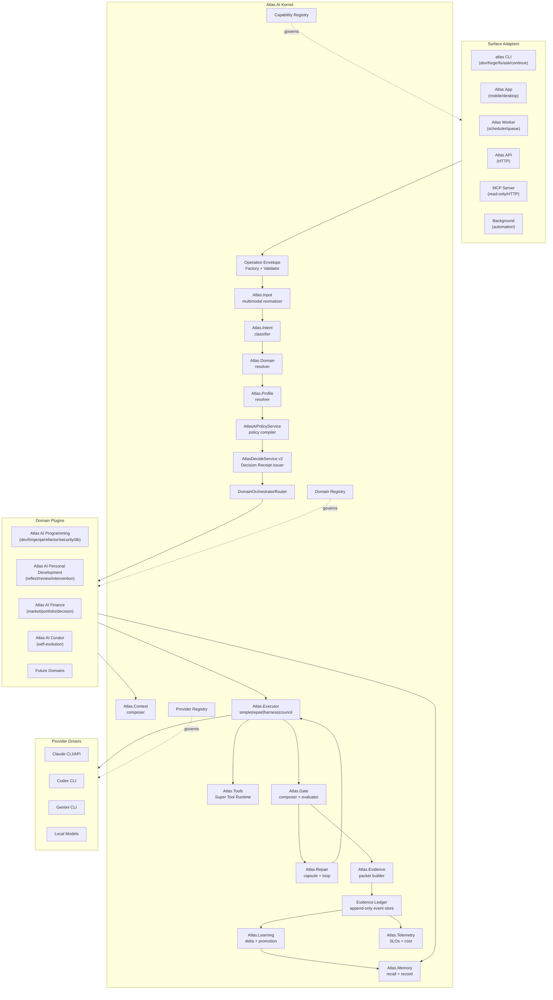
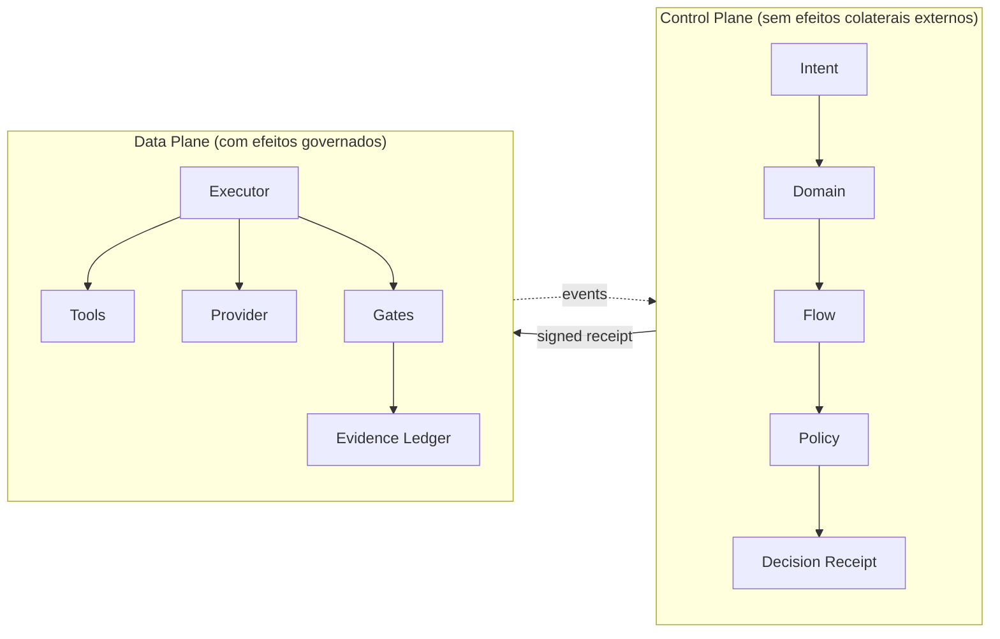
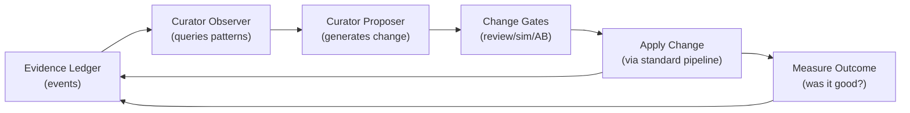

# Atlas AI Kernel Architecture - The Mother Specification

> Esta e a especificacao mae do Atlas AI. Documentos de topologia (`atlas-ai-vision.md`, `atlas-ai-pipeline.md`, `atlas-ai-core-vs-domain.md`, `atlas-ai-operating-system.md`, `atlas-ai-architecture-audit.md`, `atlas-ai-resolver-corpus-audit.md`) descrevem **o que existe e como flui**. Esta spec descreve **como o sistema opera fisicamente**: contratos tipados, maquinas de estado, eventos, SDKs, invariantes enforcados.
>
> Sem esta camada, Atlas AI vira documentacao prescritiva que ninguem garante. Com ela, doutrina vira lei de tipo.

## Sumario

- [0. Posicionamento](#0-posicionamento)
- [1. Axiomas](#1-axiomas)
- [2. Topologia Macro](#2-topologia-macro)
- [3. Control Plane vs Data Plane](#3-control-plane-vs-data-plane)
- [4. Operation Envelope](#4-operation-envelope)
- [5. Pipeline Como Funcoes Tipadas](#5-pipeline-como-funcoes-tipadas)
- [6. Maquinas De Estado](#6-maquinas-de-estado)
- [7. Decision Receipt v2](#7-decision-receipt-v2)
- [8. Evidence Ledger](#8-evidence-ledger)
- [9. Capability Registry Executavel](#9-capability-registry-executavel)
- [10. Domain Manifest E SDK](#10-domain-manifest-e-sdk)
- [11. Surface Adapter Contract](#11-surface-adapter-contract)
- [12. Provider Driver Contract](#12-provider-driver-contract)
- [13. Policy Engine Declarativo](#13-policy-engine-declarativo)
- [14. Memoria E Contexto Como Servicos Kernel](#14-memoria-e-contexto-como-servicos-kernel)
- [15. Tools Como Servico Kernel](#15-tools-como-servico-kernel)
- [16. Failure Domains](#16-failure-domains)
- [17. SLOs Operacionais](#17-slos-operacionais)
- [18. Cost Model](#18-cost-model)
- [19. Versionamento E Compatibilidade](#19-versionamento-e-compatibilidade)
- [20. Multi-Tenancy Foundation](#20-multi-tenancy-foundation)
- [21. Identidade E Continuidade](#21-identidade-e-continuidade)
- [22. Self-Evolution Loop](#22-self-evolution-loop)
- [23. Anti-Padroes Formais](#23-anti-padroes-formais)
- [24. Doutrina Como Teste Arquitetural](#24-doutrina-como-teste-arquitetural)
- [25. Roadmap De Implementacao](#25-roadmap-de-implementacao)
- [26. Definition Of Done Da Arquitetura](#26-definition-of-done-da-arquitetura)
- [27. Glossario Kernel](#27-glossario-kernel)

---

## 0. Posicionamento

A documentacao Atlas AI tem tres camadas:

```text
+------------------------------------------------------+
| Layer 3 - Domain Specs                               |
|   atlas-programming-architecture                     |
|   atlas-personal-development-domain                  |
|   atlas-finance-domain                               |
|   atlas-curator-domain (futuro)                      |
+------------------------------------------------------+
| Layer 2 - Topology                                   |
|   atlas-ai-vision                                    |
|   atlas-ai-pipeline                                  |
|   atlas-ai-core-vs-domain                            |
|   atlas-ai-operating-system                          |
|   atlas-ai-architecture-audit                        |
+------------------------------------------------------+
| Layer 1 - Kernel (este documento)                    |
|   atlas-ai-kernel-architecture                       |
+------------------------------------------------------+
| Layer 0 - Constitution                               |
|   atlas-ai-layer-0-glossary                          |
|   source material: Atlas_Documento_Mestre_v6         |
+------------------------------------------------------+
```

Esta spec ocupa **Layer 1**. Ela e mais profunda que topologia (que diz "X chama Y") e mais especifica que constituicao (que diz "Atlas AI e core cognitivo persistente"). Ela define **como o sistema realmente funciona em termos enforcaveis por compilador e teste**.

### Quem deve ler

- IA ou humano implementando qualquer fluxo Atlas AI
- IA ou humano adicionando dominio, surface ou provider novo
- IA ou humano alterando policy, decide, orchestrator, harness, runtime ou ledger
- IA ou humano respondendo "isso e duplicacao?" ou "isso pode ser feito em uma surface so?"

### Como ler

Em ordem. Cada secao depende das anteriores. Pulando, voce perde semantica.

---

## 1. Axiomas

A arquitetura mae obedece dez axiomas. Eles sao **invariantes de tipo**, nao slogans.

### Ax-1. Toda requisicao e uma Operation Envelope tipada e imutavel por estagio

Nenhum codigo Atlas AI pode tocar provider, tool, memory ou state sem antes estar dentro de uma `OperationEnvelope`. Surfaces criam o envelope. Estagios consomem e enriquecem campos especificos. Nenhum estagio pode reescrever campos de outro estagio.

**Implicacao**: comando CLI nao decide provider. Settings nao monta context. App nao escolhe orchestrator. Cada estagio escreve apenas seu slot.

### Ax-2. Toda decisao relevante emite Decision Receipt assinado e chainavel

Sem receipt, decisao nao existe. Receipt e hash determinista de inputs + outputs. Receipt referencia receipt anterior na mesma cadeia operacional. Receipt e replayavel: preview = mesmo codigo com `dry_run=true`.

**Implicacao**: nao existe "Atlas Decide foi pulado". Se nao tem receipt, foi bypass — bug.

### Ax-3. Evidence Ledger e fonte de verdade; tabelas sao projecoes

Toda mudanca de estado emite event para o Evidence Ledger. Tabelas operacionais (`ai_traces`, `atlas_engineering_runs`, `atlas_tool_runs`, `atlas_memory_entry_usages`) sao projecoes derivaveis do ledger. Ledger e append-only.

**Implicacao**: replay completo a partir do ledger e possivel. Auditoria nunca depende de log de aplicacao.

### Ax-4. Capacidades horizontais sao artefatos executaveis, nao prosa

Toda capability declarada como horizontal tem `CapabilityManifest` registrado. Surfaces que devem suporta-la passam por `CapabilityComplianceTest`. Falha de compliance e falha de merge.

**Implicacao**: paste-image so em `atlas ask` deixa de ser possivel. Test arquitetural acusa antes do PR mergir.

### Ax-5. Dominio e plugin via Domain Manifest declarativo

Adicionar um dominio (Programming, Personal Dev, Finance, Self-Improvement ou
um Curator dedicado futuro) e adicionar arquivo de manifesto + classes que
implementam `DomainOrchestrator`. Sem hardcode no kernel.

**Implicacao**: o kernel nao sabe sobre Programming. Programming e o dominio que mais usa o kernel.

### Ax-6. Provider e driver substituivel; identidade Atlas AI e invariante

`ProviderDriver` e contrato. Claude, Codex, Gemini, GPT, local sao implementacoes. Trocar provider nao muda comportamento Atlas AI; muda apenas o motor.

**Implicacao**: prompt fragments de identidade (`atlas-ai-master-prompt.md`) sao injetados pelo kernel, nao pelo provider. Provider que ignora identidade falha em compliance.

### Ax-7. Politica e declarativa, resolvida por camadas

`AtlasAiPolicyService` resolve `EffectivePolicy` mergeando: global runtime settings < domain profile < flow profile < surface policy < session override. Policy V2 receipt expoe origem de cada campo.

**Implicacao**: nenhum lugar do codigo tem `if (provider === 'codex') ... else ...`. Tudo decide via `policy.allowed_providers`.

### Ax-8. Falha e taxonomia fechada com handler nomeado

`FailureDomain` e enum. Cada valor tem `FailureHandler`. Falha sem handler nao compila.

**Implicacao**: "deu erro" deixa de existir. Erro sempre tem nome, classificacao e proxima acao.

### Ax-9. SLOs sao parte da spec; sem medida, doutrina e aspiracional

Cada estagio kernel tem latency target, success rate target e cost target. Telemetry mede continuamente. SLO violation alerta.

**Implicacao**: dizer "context pack pequeno" sem medir e nao-cumprir-spec.

### Ax-10. Self-evolution opera dentro de gates; Curator nao bypassa kernel

Atlas AI Curator detecta lacunas e propoe mudancas. Mudancas passam por mesmo pipeline (gates, evidence, review). Curator nao escreve direto em capability registry, domain manifest ou policy.

**Implicacao**: o sistema melhora a si mesmo, mas nao se modifica fora dos contratos.

---

## 2. Topologia Macro



**Tres registries** governam o que pode existir:

- `CapabilityRegistry` — capacidades horizontais e quais surfaces devem suporta-las
- `DomainRegistry` — dominios instalados e seus manifests
- `ProviderRegistry` — provider drivers disponiveis

Sem registro, surface/domain/provider e ilegal e nao executa.

---

## 3. Control Plane vs Data Plane

Separacao critica que Codex nao formaliza:

| Plane | Responsabilidade | Estado |
|---|---|---|
| **Control Plane** | classifica, decide, compila policy, escolhe executor, monta receipt | sem mutacao de mundo |
| **Data Plane** | executa, chama provider, roda tool, escreve arquivo, emite evidence | mutacao governada |



**Regra dura**: Data Plane recusa execucao se nao receber Decision Receipt valido (assinado, nao expirado, dentro do budget).

**Beneficios**:

- Preview = Control Plane com `dry_run=true`. Mesmo codigo, sem Data Plane.
- Replay = re-emitir eventos do Data Plane a partir do mesmo Decision Receipt.
- Multi-region = Control Plane local, Data Plane pode estar em sandbox/Docker/remoto.
- Testes = Control Plane testavel sem stub de provider.

---

## 4. Operation Envelope

Unidade canonica que flui pelo kernel.

### 4.1 Schema

```php
final class OperationEnvelope
{
    public string $envelope_id;          // ULID
    public ?string $parent_envelope_id;  // chain
    public string $schema_version;       // "atlas.envelope.v1"
    public OperatorContext $operator;
    public Provenance $origin;
    public Input $input;
    public Routing $routing;             // populated progressively
    public ?DecisionReceipt $decision;   // populated by Decide
    public Execution $execution;         // populated by Executor
    public ?Output $output;              // populated at finish
    public Audit $audit;
}

final class OperatorContext
{
    public string $operator_id;          // even if single-user, present
    public string $tenant_id;            // multi-tenancy ready
    public WorkspacePath $workspace;
    public array $preferences;
    public PrivacyClass $default_privacy;
}

final class Provenance
{
    public string $surface_id;           // "atlas_cli", "atlas_app", ...
    public string $surface_version;
    public string $session_id;
    public DateTimeImmutable $received_at;
    public ?string $upstream_envelope_id;
}

final class Input
{
    public InputContent $primary;        // text|audio|image|file|struct
    public Attachment[] $attachments;
    public OperatorHints $hints;         // optional explicit overrides
    public Locale $locale;
    public string $input_hash;           // determinism
}

final class Routing
{
    public ?IntentClassification $intent;
    public ?DomainId $domain;
    public ?FlowId $flow;
    public ?EffectiveProfile $profile;
}

final class Execution
{
    public ?ExecutorKind $executor_kind;
    public ?RuntimeGraph $runtime_graph;
    public ?DateTimeImmutable $started_at;
    public ?DateTimeImmutable $finished_at;
    public ExecutionStatus $status;
}

final class Output
{
    public OperationStatus $status;       // succeeded|partial|blocked|failed|needs_review
    public OperationResult $result;
    public EvidencePacket $evidence;
    public CostSummary $cost;
}

final class Audit
{
    public string $trace_id;
    public ?string $parent_trace_id;
    public string $chain_hash;            // chains envelope to ancestors
}
```

### 4.2 Invariantes

- `envelope_id` e ULID (lexicograficamente ordenavel, ~unique).
- `schema_version` muda apenas com migracao aditiva ou deprecation cycle de 6 meses.
- Apos `decision` ser assinada, ninguem pode altera-la — apenas adicionar nova decisao em `parent_envelope_id` filho.
- `chain_hash = sha256(parent_chain_hash || envelope_canonical_serialization)`.
- `operator.operator_id` e obrigatorio mesmo quando ha um operador unico.

### 4.3 Imutabilidade Por Estagio

Cada estagio recebe `OperationEnvelope`, le seus campos e devolve mutacao **apenas no slot proprio**. Mutacoes externas ao slot sao ilegais.

```php
interface KernelStage
{
    public function stage(): StageId;
    public function reads(): array;       // which slots it reads
    public function writes(): array;      // which slots it may write
    public function execute(OperationEnvelope $env, mixed $stageInput): mixed;
}
```

Compliance test:

```php
test("each stage writes only to its declared slots", function () {
    foreach (Kernel::stages() as $stage) {
        $allowed = $stage->writes();
        $actual  = StageMutationProbe::run($stage);
        expect($actual)->subsetOf($allowed);
    }
});
```

---

## 5. Pipeline Como Funcoes Tipadas

A pipeline nao e prosa. E composicao tipada.

### 5.1 Tipos Base

```php
interface KernelStage<In, Out>
{
    public function execute(OperationEnvelope $env, In $input): Out;
}

type IntentClassifier      = KernelStage<InputContent,            IntentClassification>;
type DomainResolver        = KernelStage<IntentClassification,    DomainId>;
type FlowResolver          = KernelStage<DomainId+IntentSignals,  FlowId>;
type ProfileResolver       = KernelStage<FlowId,                  EffectiveProfile>;
type PolicyCompiler        = KernelStage<EffectiveProfile,        Policy>;
type ContextComposer       = KernelStage<Policy+DomainHints,      ContextPack>;
type Decide                = KernelStage<Policy+ContextPack,      DecisionReceipt>;
type OrchestratorRouter    = KernelStage<DecisionReceipt,         DomainOrchestrator>;
type Orchestrator          = KernelStage<Envelope+Receipt,        ExecutionResult>;
type GateRunner            = KernelStage<ExecutionResult,         GateResult>;
type RepairLoop            = KernelStage<GateResult,              ExecutionResult|Escalation>;
type EvidencePacker        = KernelStage<ExecutionResult+Gates,   EvidencePacket>;
type LearningProposer      = KernelStage<EvidencePacket,          MemoryDelta[]>;
```

### 5.2 Composicao

```php
final class AtlasAiKernel
{
    public function run(InputContent $input, Provenance $origin): OperationEnvelope
    {
        $env = $this->envelopeFactory->create($input, $origin);

        // Control Plane (sem efeito colateral externo)
        $env->routing->intent   = $this->intentClassifier->execute($env, $env->input->primary);
        $env->routing->domain   = $this->domainResolver->execute($env, $env->routing->intent);
        $env->routing->flow     = $this->flowResolver->execute($env, $env->routing->domain);
        $env->routing->profile  = $this->profileResolver->execute($env, $env->routing->flow);
        $policy                 = $this->policyCompiler->execute($env, $env->routing->profile);
        $context                = $this->contextComposer->execute($env, $policy);
        $env->decision          = $this->decide->execute($env, [$policy, $context]);

        // Data Plane (com efeito governado)
        $orchestrator  = $this->router->execute($env, $env->decision);
        $execResult    = $orchestrator->execute($env, $env->decision);
        $gateResult    = $this->gateRunner->execute($env, $execResult);

        if ($gateResult->isRepairable() && $env->decision->permitsRepair()) {
            $execResult = $this->repairLoop->execute($env, $gateResult);
            $gateResult = $this->gateRunner->execute($env, $execResult);
        }

        $env->output = new Output(
            status:   $gateResult->finalStatus(),
            result:   $execResult->payload(),
            evidence: $this->evidencePacker->execute($env, [$execResult, $gateResult]),
            cost:     $this->costAggregator->aggregate($env),
        );

        $deltas = $this->learning->execute($env, $env->output->evidence);
        foreach ($deltas as $delta) {
            $this->memoryRegistry->propose($delta);
        }

        $this->ledger->seal($env);
        return $env;
    }
}
```

Observe:

- Cada estagio e injetavel — substituivel para teste.
- `dry_run=true` em `decision` faz Data Plane abortar antes de executar (preview).
- Composicao linear no caso simples; orquestradores complexos podem rodar grafo de execucao definido em `runtime_graph`.

### 5.3 Pipeline Kernel Scaffold Atual

Status atual: existe uma infraestrutura inicial em
`app/Services/Ai/Kernel/Pipeline/` para representar o pipeline unificado sem
migrar fluxos existentes. O contrato `AtlasKernelPipeline` expoe:

- `stages()`;
- `plan(PipelineInput $input)`;
- `execute(PipelineInput $input)`;
- `complianceReport()`.

A implementacao `ScaffoldAtlasKernelPipeline` roda apenas em modo scaffold/dry-run:

- aceita input normalizado por `PipelineInput`;
- declara a ordem canonica `Input -> OperationEnvelope -> Intent -> Decide ->
  DecisionReceipt -> Domain -> Context -> Policy -> Runtime -> Gate -> Repair
  -> Evidence -> Learning -> Output`;
- declara slots lidos/escritos por estagio;
- valida ordem, numeros sequenciais, nomes de slots, ausencia de duplicidade em
  stages/ordens/escritas e que cada stage so le slots iniciais ou escritos por
  estagios anteriores;
- gera plano auditavel, placeholders de evidence e trace;
- versiona o contrato como `atlas.kernel.pipeline.scaffold.v1`, expoe
  `canonical_flow`, `stage_count`, manifesto de slots, guards de execucao e
  `plan_hash` para consumidores CLI/API compararem payloads sem depender de
  prosa;
- centraliza constantes e guards scaffold em `KernelPipelineContract`, incluindo
  `canonical_flow_hash`, para reduzir drift entre plano, resultado, scanner e
  testes;
- o plano auditavel guarda hash do texto primario, hash de hints completos,
  valores apenas de hints operacionais allowlisted e nomes de metadata, sem
  copiar texto bruto ou valores sensiveis;
- `PipelineInput` normaliza hashes de hints de forma recursiva e ordena
  `metadata_keys`, evitando drift por ordem de payload ou valores nao escalares
  vindos de surface futura;
- `PipelineInput` publica `input_fingerprint` deterministico e o `pipeline_id`
  scaffold usa esse fingerprint como sufixo auditavel;
- retorna `provider_execution_allowed=false`,
  `runtime_execution_allowed=false` e `providerExecutionAttempted=false`;
- nao chama provider real, worker, gateway, surface concreta ou runtime amplo.
- pode ser inspecionado por `atlas:ai:pipeline --json`; com `--execute`, retorna
  resultados scaffold por stage, evidence refs e trace refs sem executar
  provider nem runtime real.
- `atlas:ai:pipeline --execute` tambem grava `KERNEL_PIPELINE_ACCEPTED` no
  Evidence Ledger por `KernelPipelineAuditService`, com
  `emitter_stage=atlas.ai_pipeline.scaffold`. O modo `plan` continua sem
  escrita, para nao poluir auditoria com mera inspecao; a execucao scaffold,
  por outro lado, vira evento replayavel e aparece nos reports de Kernel
  Pipeline.
- tambem esta exposto por `POST /ai/pipeline` com `atlas.token`, para App,
  dashboard, mobile e Curator inspecionarem a mesma ponte sem duplicar logica.
  A API aceita `text`, `surface_id`, `operator_id`, `hints`, `metadata` e
  `execute`; sempre forca `dry_run=true`. Quando `execute=true`, a API segue o
  mesmo `KernelPipelineAuditService` da CLI e devolve `ledger_event` com
  `event_id`, `event_type`, `envelope_id` e `payload_hash`.
- `atlas:cli:dev` agora anexa um `kernel_pipeline` compacto em todo
  `dev_execution_plan`, tanto no cockpit interativo quanto no one-shot com
  prompt. O binding fixa `surface=atlas_cli_dev`, `flow=programming.dev` ou
  `programming.forge`, `input_mode=interactive|one_shot`, stage order,
  `canonical_flow_hash`, slot manifest e guards de execucao. Essa montagem e
  feita por `KernelPipelineDevPlanBuilder`, nao pela surface; isso impede que
  `atlas dev` e `atlas:ai:chat --dev` mantenham shapes paralelos do mesmo
  contrato. Isso nao migra a execucao real ainda, mas remove a diferenca
  arquitetural invisivel entre `atlas dev` e `atlas dev "prompt"`: ambos
  carregam o mesmo contrato de pipeline antes de chamar `atlas:ai:chat`.
- `atlas:ai:chat --dev` preserva o `kernel_pipeline` recebido via
  `--dev-plan` e, quando recebe plano legado sem esse campo, completa o plano
  com binding `surface=atlas_ai_chat` usando o mesmo
  `KernelPipelineDevPlanBuilder`. Assim chamadas diretas ao chat em modo dev e
  chamadas vindas de `atlas:cli:dev` ficam auditaveis pelo mesmo contrato sem
  exigir runtime migration imediata.
- `KernelPipelinePlanGuard` valida contratos recebidos de surfaces antes de
  enfileirar job: schema, mode/status scaffold, `canonical_flow_hash`,
  `stage_order`, `stage_count`, surface/input mode allowlisted e guards que
  mantem `provider_execution_allowed=false` e `runtime_execution_allowed=false`.
  As allowlists de surfaces Programming (`atlas_cli_dev`, `atlas_ai_chat`),
  commands (`atlas:cli:dev`, `atlas:ai:chat`), flows (`programming.dev`,
  `programming.forge`, `programming.repair`) e input modes (`interactive`,
  `one_shot`, `declared_dev_plan`, `chat_dev_auto_plan`) vivem em
  `KernelPipelineContract`, nao dentro do guard. O builder valida o proprio
  plano gerado com `KernelPipelinePlanGuard` antes de entregar para a surface,
  falhando fechado se algum binding sair do contrato. O shape de
  `kernel_pipeline_contract` vem de `KernelPipelineContract::requiredSurfaceContract()`;
  o guard valida plano e contrato juntos por `assertValidPlanAndContract()`.
  Isso impede que uma surface envie um `kernel_pipeline` formalmente valido com
  metadado de contrato adulterado, origem desconhecida ou bloqueios de execucao
  desligados. Um `--dev-plan` adulterado falha fechado em preflight com
  `atlas_kernel_pipeline_contract_violation`.
- `AtlasEvidenceLedger` grava `KERNEL_PIPELINE_ACCEPTED` e
  `KERNEL_PIPELINE_REJECTED` com payload seguro: hashes, stage order, guards,
  surface binding, surface contract source e routing, sem prompt bruto.
  `KernelPipelineAuditService` e o ponto unico usado por `atlas:ai:pipeline`,
  `POST /ai/pipeline` e `atlas:ai:chat --dev` para registrar planos
  aceitos/rejeitados; surfaces nao chamam o ledger diretamente para esse
  contrato. `AtlasLedgerReplayService` projeta esses eventos por envelope
  (`kernelPipelineReportForEnvelope()`) e por janela
  (`kernelPipelineReportForWindow()`), agregando accepted/rejected, surface,
  contract source, emitter stage, flow, input mode, violations e eventos recentes. O operador pode
  consultar `atlas:ai:ledger <envelope> --kernel --json`,
  `GET /ai/ledger/{envelope}?kernel=1`,
  `atlas:ai:kernel-pipeline-report --hours=24 --contract-source=KernelPipelineDevPlanBuilder --json`
  ou `GET /ai/kernel-pipeline/report?hours=24&contract_source=KernelPipelineDevPlanBuilder`.
  O dashboard
  `GET /ai/observability` inclui `kernel_pipeline` junto de `kernel_slo` e
  `kernel_repair`. Assim drift de surface e adulteracao de contrato ficam
  visiveis no mesmo plano operacional do Atlas AI, tanto por envelope quanto
  por janela.
- `AiWorker` agora tem uma fronteira runtime conservadora via
  `KernelPipelineRuntimeGuard`: qualquer job que carregue `dev_execution_plan`
  ou `kernel_pipeline` precisa validar o mesmo plano+contrato antes de abrir
  provider. Contrato ausente, hash/stage order adulterado ou metadado de
  surface invalido bloqueia a tentativa com
  `kernel_pipeline_contract_violation`, registra
  `KERNEL_PIPELINE_REJECTED` por `KernelPipelineAuditService` e evita resolver
  provider. Contrato valido registra `KERNEL_PIPELINE_ACCEPTED` com
  `emitter_stage=atlas.ai_worker.kernel_pipeline_runtime_guard` antes do
  provider ser aberto, para diferenciar aceite de preflight e aceite real do
  Data Plane. O plano auditavel e o contexto de ledger (`tenant_id`,
  `operator_id`, `trace_id`, emitter e `surface_contract`) sao normalizados por
  `KernelPipelineRuntimeGuard`, nao montados manualmente no worker. Isso ainda
  nao migra a execucao real para o Kernel Pipeline; ele fecha a porta para fluxo
  dev/forge legado entrar no Data Plane sem contrato auditavel.
- o Repair Loop segue a mesma regra operacional: `atlas:ai:repair --json` e
  `POST /ai/repair` expoem plano/tentativa scaffold, sempre com `dry_run=true`
  nas surfaces CLI/API, sem executar provider, tool, harness ou patch real.

Esse scaffold e uma ponte de contrato. Ele permite testar ordem, slots,
compliance e auditabilidade antes de migrar a execucao real de `atlas dev`,
`atlas forge`, `atlas:ai:chat`, API ou worker para o pipeline real.

---

## 6. Maquinas De Estado

Codex nao definiu maquina de estado. Sem ela, "task pronta" e ambiguo.

### 6.1 Operation State Machine

```text
RECEIVED
   |
   v
ROUTING --(domain unknown)--> NEEDS_CLARIFICATION
   |
   v
DECIDING --(policy violation)--> BLOCKED
   |
   v
EXECUTING --(provider failure)--> RETRYING
   |              |
   |              +--(repeated failure)--> FAILED
   v
GATING --(gate failed, repairable)--> REPAIRING
   |              |
   |              +--(gate failed, terminal)--> FAILED
   |              +--(gate failed, needs review)--> NEEDS_REVIEW
   v
EVIDENCE_SEALED
   |
   v
LEARNING_PROPOSED
   |
   v
COMPLETED
```

Cada transicao emite event. Eventos sao append-only no Evidence Ledger.

### 6.2 Decision Receipt State

```text
DRAFT --(seal)--> ISSUED --(consume)--> CONSUMED
                    |
                    +--(expire)--> EXPIRED
                    +--(revoke)--> REVOKED
```

Receipt `EXPIRED` ou `REVOKED` nao autoriza Data Plane.

### 6.3 Tool Run State

```text
PLANNED --(approve)--> APPROVED --(start)--> RUNNING
                                                |
                                                v
                                            COMPLETED
                                                |
                                                v
                                          NORMALIZED
                                                |
                                                v
                                       EVIDENCE_RECORDED
                                                |
                                                v
                                          GATE_EVALUATED
```

Cada estado tem timeout, retry policy e failure handler explicitos.

---

## 7. Decision Receipt v2

### 7.1 Schema

```php
final class DecisionReceipt
{
    public string $receipt_id;              // ULID
    public string $envelope_id;
    public DateTimeImmutable $decided_at;
    public DateTimeImmutable $expires_at;   // hard expiry
    public string $decision_engine;         // "atlas.decide.v2"
    public string $inputs_hash;             // sha256(canonicalize(policy, context, input_summary))

    public Resolution $resolution;
    public Authority $authority;
    public Selection $selection;
    public Budgets $budgets;
    public RequiredGate[] $required_gates;
    public RequiredEvidence[] $required_evidence;
    public Constraint[] $constraints;
    public ?DryRun $dry_run;

    public Signature $signature;
}

final class Resolution
{
    public DomainId $domain;
    public FlowId $flow;
    public string $profile_id;
    public string $profile_version;
}

final class Authority
{
    public string $policy_profile_id;
    public string $policy_version;
    public ?OverrideSpec $operator_override;
    public ?OverrideSpec $session_override;
    public string $merge_receipt_id;
}

final class Selection
{
    public ExecutorKind $executor_kind;     // simple|repair|harness|council
    public RuntimeGraph $runtime_graph;
    public array $provider_assignments;     // map<NodeId, ProviderAssignment>
    public ProviderAssignment[] $fallback_chain;
    public string $context_strategy;
}

final class Budgets
{
    public CostBudget $cost;
    public LatencyBudget $latency;
    public AutonomyLevel $autonomy;         // A0..A5
    public int $max_repair_iterations;
    public int $max_concurrent_tool_runs;
}

final class Signature
{
    public string $receipt_hash;            // sha256(canonical_serialize(receipt without signature))
    public ?string $parent_receipt_id;
    public string $chain_hash;              // sha256(parent_chain_hash || receipt_hash)
    public string $signed_by;               // "atlas-decide-engine@v2"
}
```

### 7.2 Invariantes

- `inputs_hash` determinista: mesmos inputs, mesmo hash.
- Mesma `receipt_hash` em duas decisoes para `inputs_hash` igual implica decisao determinista (boa propriedade para regressao).
- `expires_at` impede execucao com receipt velho. Default 30s para Data Plane sincrono, 24h para background.
- `dry_run=true` impede Data Plane mesmo com receipt valido — usado para preview.
- `chain_hash` permite verificar integridade de cadeia de decisoes (multi-step operations).

### 7.3 Replay E Preview

```text
preview(input)  = atlas_decide.run(input, dry_run=true)
replay(receipt) = atlas_decide.run_from_receipt(receipt) -> deve produzir receipt determinista identico
```

Replay de receipt antigo permite:

- Verificar se decisao mudaria com nova policy.
- Reproduzir bug a partir de receipt persistido.
- A/B testar mudancas de policy (run em shadow mode com nova policy, comparar receipts).

---

## 8. Evidence Ledger

### 8.1 Por Que Event Sourcing

Codex propoe evidence como packet final. Mas packet final e projecao. A fonte de verdade deve ser o stream de eventos que o produziu. Beneficios:

- **Replay completo** sem depender de tabelas operacionais
- **Audit perfeita** sem confiar em log de aplicacao
- **Compaction segura** de tabelas operacionais (sao projecoes derivaveis)
- **Self-evolution** opera sobre eventos, nao sobre estado mutavel
- **Time travel** para debug

### 8.2 Esquema De Evento

```php
final class LedgerEvent
{
    public string $event_id;                // ULID
    public string $envelope_id;
    public ?string $trace_id;               // UUID ai_traces.id ou ULID operacional
    public ?string $causation_id;           // event que causou este
    public string $correlation_id;          // grupo logico
    public DateTimeImmutable $occurred_at;
    public string $event_type;              // discriminated union tag
    public string $emitter_stage;
    public string $emitter_version;
    public array $payload;                  // schema by event_type
    public string $payload_hash;
    public string $tenant_id;
    public string $operator_id;
}
```

### 8.3 Event Types (enum fechado)

```php
enum LedgerEventType
{
    case ENVELOPE_CREATED;
    case INPUT_NORMALIZED;
    case INTENT_CLASSIFIED;
    case DOMAIN_RESOLVED;
    case FLOW_RESOLVED;
    case PROFILE_RESOLVED;
    case POLICY_COMPILED;
    case CONTEXT_COMPOSED;
    case CONTEXT_INJECTED;            // Open Brain
    case DECISION_DRAFTED;
    case DECISION_ISSUED;
    case DECISION_CONSUMED;
    case DECISION_EXPIRED;
    case ORCHESTRATOR_SELECTED;
    case EXECUTION_STARTED;
    case PROVIDER_CALLED;
    case PROVIDER_RETURNED;
    case PROVIDER_FALLBACK;
    case TOOL_PLANNED;
    case TOOL_APPROVED;
    case TOOL_INVOKED;
    case TOOL_RETURNED;
    case TOOL_NORMALIZED;
    case TOOL_EVIDENCE_RECORDED;
    case GATE_EVALUATED;
    case GATE_PASSED;
    case GATE_BLOCKED;
    case REPAIR_INITIATED;
    case REPAIR_COMPLETED;
    case ESCALATION_REQUESTED;
    case EVIDENCE_PACKED;
    case LEARNING_PROPOSED;
    case MEMORY_DELTA_ACCEPTED;
    case OPERATION_COMPLETED;
    case OPERATION_FAILED;
    case OPERATION_BLOCKED;
    case OPERATION_NEEDS_REVIEW;
}
```

Adicionar event type novo exige migration aditiva. Nunca remover sem deprecation cycle.

### 8.4 Storage E Projecoes

| Camada | Funcao |
|---|---|
| `atlas_ledger_events` | tabela append-only, particionada por tenant_id e mes |
| `atlas_ledger_snapshots` | snapshot periodico por envelope_id (replay rapido) |
| `ai_traces` | projecao para UI/CLI |
| `atlas_engineering_runs` | projecao para Programming domain |
| `atlas_tool_runs` | projecao para Tool Runtime |
| `atlas_memory_entry_usages` | projecao para Memory Audit |

Reconstruir projecao = reler eventos. Tabelas operacionais podem ser truncadas e regeneradas.

`trace_id` no ledger e string, nao UUID estrito. Quando existe `ai_traces.id`,
ele pode carregar UUID; quando o Kernel cria envelope/receipt antes de uma
trace operacional, ele carrega ULID. Isso evita que preview, Decide, Kernel
Pipeline ou Curator dependam de uma tabela projetada para registrar evento.

---

## 9. Capability Registry Executavel

A regra "capacidade horizontal vive uma vez, surfaces herdam" so vale se for **enforcada por teste**. Codex documenta o principio. Esta secao formaliza o mecanismo.

### 9.1 Capability Manifest

Um arquivo `capabilities/<id>.yaml` por capacidade:

```yaml
# capabilities/atlas.input.image_paste.yaml
schema_version: atlas.capability.v1
id: atlas.input.image_paste
version: 1.0.0
title: Multimodal image paste
description: Permite ao operador colar imagem do clipboard como input.
contract:
  input:
    type: ImageBlob
    formats: [png, jpeg, webp, heic]
    max_size_mb: 25
  output:
    type: NormalizedImageRef
    fields: [hash, mime, dimensions, storage_path]
  errors:
    - clipboard_empty
    - format_unsupported
    - size_exceeds_budget
required_surfaces:
  - atlas_cli
  - atlas_app
  - atlas_api
optional_surfaces:
  - atlas_worker
  - atlas_background
not_supported:
  - surface: atlas_mcp_readonly
    reason: MCP read-only HTTP nao expoe binary upload nesta fase
test_suite:
  - tests/Capability/ImagePasteCliTest.php
  - tests/Capability/ImagePasteAppTest.php
  - tests/Capability/ImagePasteApiTest.php
introduced_at: atlas-server@2026-05-04
owner: atlas.input
```

### 9.2 Compliance Test

Test arquitetural que **falha o build** se uma surface obrigatoria nao implementa uma capability obrigatoria:

```php
class CapabilityComplianceTest extends TestCase
{
    public function test_every_required_surface_implements_every_required_capability(): void
    {
        $registry = $this->app->make(CapabilityRegistry::class);
        $surfaces = $this->app->make(SurfaceRegistry::class);

        foreach ($registry->all() as $capability) {
            foreach ($capability->required_surfaces as $surface_id) {
                $surface = $surfaces->get($surface_id);

                $this->assertTrue(
                    $surface->implements($capability->id),
                    sprintf(
                        "Surface %s must implement capability %s. Add implementation or declare not_supported with reason.",
                        $surface_id,
                        $capability->id,
                    ),
                );
            }
        }
    }

    public function test_every_capability_has_test_suite(): void
    {
        foreach (CapabilityRegistry::all() as $capability) {
            $this->assertNotEmpty($capability->test_suite,
                "Capability {$capability->id} must declare test_suite.");

            foreach ($capability->test_suite as $test_path) {
                $this->assertFileExists(base_path($test_path),
                    "Capability {$capability->id} declares test {$test_path} that does not exist.");
            }
        }
    }
}
```

Resultado: o paste-image so em `atlas ask` deixa de ser possivel. Quem mergir `atlas dev` sem suporte a image paste, sem `not_supported.reason` valido, quebra o test arquitetural.

Implementacao atual:

- `AtlasCapabilityRegistry::complianceReport()` valida manifests, surfaces
  obrigatorias, `not_supported.reason`, cobertura completa de surfaces e
  existencia dos testes declarados. Cada capability precisa classificar cada
  surface conhecida como `required`, `optional` ou `not_supported`; surface sem
  postura explicita quebra `capabilities.valid`.
- `SurfaceCapabilityParityService` cruza as capabilities horizontais de input,
  memoria, contexto, tools e Human Knowledge com os adapters operacionais (`atlas_cli_dev`,
  `atlas_cli_chat`, `atlas_cli_forge`, `atlas_app`,
  `atlas_api_interaction`, `atlas_worker`, `atlas_mcp_readonly`,
  `atlas_vault`).
- `atlas:ai:architecture-validate --json` publica
  `capabilities.surface_adapter_parity`, com contagem de checks, erros e skips.
  O estado esperado atual e `errors=[]` e `skipped=[]`; qualquer skip agora
  torna `capabilities.valid=false`, `kernel.static_scan.valid=false`,
  `kernel.valid=false` e o comando falha.
- O mesmo contrato tambem aparece como
  `kernel.static_scan.ap33_surface_capability_parity`, mantendo a familia AP
  completa no payload central de arquitetura.
- A cobertura completa aparece como
  `kernel.static_scan.ap34_capability_surface_coverage`; isso impede que uma
  capability nova deixe AtlasVault, MCP, Worker, App, API ou CLI em zona cinza.
- O mapa operacional de adapters aparece como
  `kernel.static_scan.ap35_surface_adapter_parity_map_coverage`; isso impede que
  um novo `SurfaceAdapter` registrado fique fora do Capability Registry por falta
  de mapeamento.
- O validador tambem publica `kernel.static_scan.summary`, derivado das chaves
  AP efetivamente expostas: `total_count`, `passed_count`, `failed_count`,
  `valid_keys`, `failed_keys` e `violation_count`. App, CI, dashboard e Curator
  devem consumir esse resumo para health geral, em vez de reimplementar a lista
  de APs em cada surface.
- O mesmo payload do CLI e exposto por `GET /ai/architecture/validate`
  autenticado por `atlas.token`. CLI e API consomem
  `AtlasAiArchitectureValidationService`, entao App, dashboard, automacao e
  Curator veem o mesmo `kernel.static_scan.summary` sem shellar comando e sem
  duplicar montagem de payload.
- A paridade entre service, CLI e API e bloqueio arquitetural proprio: o teste
  de API compara o endpoint contra `AtlasAiArchitectureValidationService` para
  campos operacionais estaveis, enquanto o CLI continua travando o mesmo summary.
  Essa e a fonte unica do contrato de validacao; surfaces podem renderizar, mas
  nao recompor o payload.
- `GET /ai/observability` tambem publica `architecture_validation`, um resumo
  compacto de arquitetura para dashboard/Curator: status, kernel/static scan
  summary, capabilities, domains, orchestrators e onboarding. Os read models de
  SLO/repair/pipeline sao capturados antes desse resumo para que a propria
  validacao arquitetural nao polua a janela de observability.
- Open Brain/MCP tambem expoe `atlas_architecture_validate`, read-only, usando o
  mesmo `AtlasAiArchitectureValidationService`. Isso permite que agentes e o
  Curator consultem health arquitetural sem shell, sem endpoint HTTP e sem
  remontar regras.
- `atlas_vault` e o adapter formal da Human Knowledge Surface: suporta texto,
  arquivos markdown/notas e projections gerenciadas, mas nao declara
  `memory_recall`, `context_compose` ou `tools_runtime`. Assim Obsidian fica
  poderoso como workspace humano sem virar fonte operacional crua.
- `CapabilityComplianceTest` tem caso negativo provando que uma capability
  declarada no registry, mas ausente do adapter real, falha o build.

### 9.3 Capability Token

Em runtime, surface declara capabilities suportadas em handshake:

```php
final class CapabilityToken
{
    public string $surface_id;
    public string[] $supports;
    public string $signature;
}
```

Kernel valida: `Capability X requested but surface_id Y did not declare support`. Falha imediata, com mensagem acionavel.

---

## 10. Domain Manifest E SDK

Adicionar dominio (Personal Dev, Finance, Self-Improvement ou Curator dedicado
futuro) deve ser **contrato declarativo**, nao alteracao do kernel.

### 10.1 Manifest

```yaml
# domains/personal_development.yaml
schema_version: atlas.domain.v1
id: personal_development
version: 0.1.0
title: Atlas AI Personal Development
description: Dominio de desenvolvimento pessoal, performance, comportamento e cognicao.

intent_classifiers:
  - class: PersonalDevelopment\HabitIntentClassifier
    matches: [habit, routine, foco, energia, sono, performance]
  - class: PersonalDevelopment\WeeklyReviewIntentClassifier
    matches: [revisao semanal, weekly review, retrospectiva]

flows:
  personal_development.reflect:
    title: Reflexao guiada
    orchestrator: PersonalDevelopment\ReflectOrchestrator
    runtime: PersonalDevelopment\PersonalDevelopmentRuntime
    autonomy_default: low
    background_allowed: false
    required_gates:
      - personal_development.privacy_gate
      - personal_development.medical_safety_gate
    evidence_schema_extensions:
      - cognitive_metrics
  personal_development.weekly_review:
    title: Revisao semanal estruturada
    orchestrator: PersonalDevelopment\WeeklyReviewOrchestrator
    runtime: PersonalDevelopment\PersonalDevelopmentRuntime
    autonomy_default: low
    background_allowed: false
    required_gates:
      - personal_development.privacy_gate
    evidence_schema_extensions:
      - decision_revisits
      - life_hypotheses
  personal_development.intervention:
    title: Plano de intervencao baseado em evidencia
    orchestrator: PersonalDevelopment\InterventionOrchestrator
    runtime: PersonalDevelopment\InterventionMeasurementHarness
    autonomy_default: A0           # observa, nao executa
    required_human_approval: true
    required_gates:
      - personal_development.privacy_gate
      - personal_development.medical_safety_gate
      - personal_development.intervention_n_of_1_gate

required_capabilities:
  - atlas.memory.recall
  - atlas.memory.private_classification
  - atlas.input.text
  - atlas.input.image_paste
  - atlas.context.composer

provided_capabilities:
  - personal_development.cognitive_metrics
  - personal_development.n_of_1_harness
  - personal_development.lifestyle_correlation_query

privacy:
  default_class: private
  classes_allowed: [private, sensitive]
  allowed_provider_classes: [provider_safe_only]
  forbidden_categories:
    - medical_diagnosis_claim
    - therapy_substitute_claim

memory_projection:
  scope: autobiographical
  retention: long
  redaction: aggressive

evidence_schema_extensions:
  cognitive_metrics:
    fields: [articulation, reasoning_depth, application_ratio, pattern_count, curation_rate]
    computed_by: PersonalDevelopment\CognitiveMetricsComputer
  decision_revisits:
    fields: [decision_id, original_at, revisit_due_at, revisit_status, learning]
  life_hypotheses:
    fields: [hypothesis, validation_period, metric, result, status]

slo_targets:
  intent_classification_p95_ms: 150
  decision_p95_ms: 300
  privacy_gate_p99_ms: 100

owner: personal_development
maintainer: vitor.epf
introduced_at: atlas-server@TBD
```

### 10.2 Domain SDK

Para implementar dominio, autor:

1. Cria o manifest acima.
2. Implementa `AtlasDomainOrchestrator` por orchestrator canonico:

```php
interface AtlasDomainOrchestrator
{
    public function orchestratorId(): string;
    public function supportedDomains(): array;
    public function supportedFlows(): array;
    public function maturity(): string; // implemented | scaffold | planned
}
```

3. Para dominios com runtime completo, implementa metodos especificos de
   planejamento/execucao no orchestrator concreto. Exemplo atual:
   `AtlasProgrammingOrchestrator::sessionPlan()`,
   `dispatchContract()`, `repairExecutionContract()` e
   `executeWithHarness()`.

4. Implementa gates novos como `Gate` plugavel:

```php
interface Gate
{
    public function id(): string;
    public function evaluate(OperationEnvelope $env, ExecutionResult $result): GateResult;
}
```

5. Registra em `domain_registry`:

```bash
atlas domain register --manifest=domains/personal_development.yaml
```

6. Roda compliance:

```bash
atlas ai architecture-validate
```

`validate` checa: manifest passa schema, todos orchestrators existem,
orchestrators implementam o SDK, cada flow ativo aponta para orchestrator que
declara suporte ao domain/flow, todos gates existem, capabilities listadas
estao no registry e evidence schema extensions sao validas.

Status implementado:

- `AtlasDomainOrchestrator` define o contrato minimo do SDK;
- `AtlasDomainOrchestratorRegistry` resolve nomes curtos de manifest para
  classes PHP reais e maturidade (`implemented`, `scaffold`, `planned`);
- `AtlasDomainManifestValidator` falha quando domain/flow aponta para
  orchestrator desconhecido, sem classe, sem interface ou sem suporte declarado;
- `AtlasProgrammingOrchestrator`, `AtlasSelfImprovementOrchestrator`,
  `AtlasFinanceOrchestrator` e `AtlasPersonalDevelopmentOrchestrator` sao os
  dominios implemented/ready atuais;
- Marketing, General, Research, Health, Learning, Writing, QA, Security,
  Operations e Background possuem scaffolds explicitos para que a divida seja
  visivel e testavel, nao texto solto.

### 10.3 Domain Registry Test

```php
public function test_every_registered_domain_passes_manifest_validation(): void
{
    foreach (DomainRegistry::all() as $domain) {
        $report = $this->validator->validate($domain->manifest);
        $this->assertTrue($report->valid, $report->errors());
    }
}

public function test_every_flow_has_orchestrator_class(): void
{
    foreach (DomainRegistry::flows() as $flow) {
        $definition = $orchestrators->get($flow->orchestrator);
        $this->assertNotNull($definition);
        $this->assertTrue(class_exists($definition['class']));
        $this->assertTrue(is_subclass_of($definition['class'], AtlasDomainOrchestrator::class));
        $this->assertContains($flow->id, app($definition['class'])->supportedFlows());
    }
}
```

---

## 11. Surface Adapter Contract

Surface (CLI, App, Worker, API, MCP, Background) e **plugin tambem**, governado por contrato.

### 11.1 Contrato

```php
interface SurfaceAdapter
{
    public function id(): SurfaceId;
    public function version(): string;

    /** Capabilities que esta surface declara suportar. */
    public function declaredCapabilities(): array;

    /** Cria envelope a partir de input bruto da surface. */
    public function buildEnvelope(SurfaceInput $input): OperationEnvelope;

    /** Renderiza output da operacao para a surface. */
    public function renderOutput(OperationEnvelope $env): SurfaceOutput;

    /** Hints opcionais (provider preference, override, etc.) — passados via envelope. */
    public function collectHints(): OperatorHints;

    /** Validacao pre-flight: surface tem ambiente para esta operacao? */
    public function preflight(OperationEnvelope $env): PreflightResult;
}
```

### 11.2 Proibicoes Formais

Surface NAO pode:

- chamar provider diretamente (precisa do executor do dominio)
- montar context pack proprio (precisa do `Atlas.Context`)
- escolher provider/modelo (e funcao do `AtlasDecide`)
- decidir gate (e funcao do `Gate`)
- ler/escrever Memory diretamente (precisa do `Atlas.Memory`)
- decidir repair (e funcao do `Atlas.Repair`)
- declarar `succeeded` sem evidence packet

Cada proibicao tem teste correspondente que escaneia codigo da surface por strings/imports proibidos.

### 11.3 Hints Vs Override Vs Bypass

| Mecanismo | Permitido | Como |
|---|---|---|
| **Hint** | Sim | Surface passa `OperatorHints` no envelope. Decide considera, nao obriga. |
| **Override** | Sim, com escopo | `--ai=codex --model=5.5` vira `session_override` no envelope. AtlasAiPolicyService merge respeitando precedencia. |
| **Bypass** | Nao | Surface ignorando policy/decide nao compila (test arquitetural). |

### 11.4 Domain/Flow Hints De Surface

Surface pode declarar preferencias de domain/flow, mas nao vira autoridade de catalogo.

- `surface_id` identifica a origem da coleta/renderizacao.
- `supportedCapabilities()` declara capacidades formais usando o vocabulario fechado de `SurfaceCapability`.
- `supportedDomainFlowHints()` usa o vocabulario fechado `SurfaceDomainFlowHintKey` e pode declarar `default_domain_id`, `default_flow_id`, `supported_domain_ids`, `supported_flow_ids`, `task_flow_map`, `prefer_default_flow` e flags de aceitacao.
- Compliance de surface falha para hint key desconhecida, lista malformada, boolean invalido, default fora de supported ids ou task flow fora dos flows suportados declarados.
- `DomainCatalogSurfaceSelectionService` valida qualquer hint, `domain_id` ou `flow_id` contra `AtlasAiDomainCatalogService`.
- `domain_catalog_selection` pode ser reenviado como envelope canonico entre surfaces; campos planos `domain_id` e `flow_id` continuam aceitos e tem precedencia sobre envelopes antigos.
- Surface registrada sem `domain_flow_selection` nao aceita `domain_id` ou `flow_id` explicitos; o selector retorna `surface_domain_flow_selection_not_supported`.
- `supported_domain_ids` e `supported_flow_ids`, quando declarados, limitam a exposicao da surface; escolhas canonicas fora desses limites retornam `surface_domain_not_supported` ou `surface_flow_not_supported`.
- O read model de selecao inclui `surface_hints.supported_capabilities` para renderizacao e diagnostico; capabilities de surface nao concedem autoridade para provider, memoria ou runtime.
- Aliases legados de surface devem ser canonizados antes da selecao: `atlas_cli` para `atlas_cli_dev` e `atlas_api` para `atlas_api_interaction`.
- Aliases humanos de CLI tambem sao canonicos no registry: `atlas ask`,
  `atlas chat` e `atlas_cli_ask` apontam para `atlas_cli_chat`;
  `atlas dev`, `atlas fix`, `atlas continue`, `atlas_cli_fix` e
  `atlas_cli_continue` apontam para `atlas_cli_dev`; `atlas forge` aponta
  para `atlas_cli_forge`. Alias nunca cria surface nova nem autoridade nova.
- `flow_id` ou `domain_id` explicito invalido retorna `status=unresolved` com `error.code`, sem fallback silencioso.
- Fallback seguro e permitido apenas quando a selecao veio de UX implicita e o catalogo tem `general.answer`.
- Surface continua proibida de escolher provider, montar contexto/memoria ou chamar runtime diretamente.

Exemplos atuais:

| Surface | Domain/flow behavior |
|---|---|
| `atlas_cli_dev` | `debug/repair -> programming.repair`, `review -> programming.review`, `dev/plan -> programming.dev` |
| `atlas_cli_forge` | `heavy/forge/build/plan -> programming.forge` |
| `atlas_app` e `atlas_api_interaction` | aceitam selecao explicita vinda do catalogo e preservam metadata para o kernel |

---

## 12. Provider Driver Contract

Provider (Claude, Codex, Gemini, council, GPT, local) e plugin governado.

### 12.1 Contrato

```php
interface ProviderDriver
{
    public function id(): ProviderId;
    public function version(): string;

    public function declaredModels(): array;          // ["claude-opus-4-7", "claude-sonnet-4-6"]
    public function declaredCapabilities(): array;    // ["text", "vision", "long_context", "tool_use"]
    public function declaredLimits(): ProviderLimits; // tokens, files, context, rate

    public function health(): ProviderHealth;

    /**
     * Executa request governado.
     * Receipt obriga model + provider; driver nao escolhe.
     * Identity prompt e injetado pelo kernel; driver nao reescreve.
     */
    public function execute(
        ProviderExecutionRequest $request,
        IdentityFragment $identity,
        DecisionReceipt $receipt,
    ): ProviderExecutionResult;
}
```

### 12.2 Identity Injection

Driver recebe `IdentityFragment` (texto Atlas AI canonico extraido de `atlas-ai-master-prompt.md`). Driver e obrigado a injeta-lo. Kernel verifica via `ProviderComplianceTest` que cada driver:

1. Inclui identity no prompt enviado ao motor.
2. Nao adultera identity.
3. Retorna `provider_safe` outputs (sem leak de internal IDs do driver).

### 12.2.1 Estado Atual Do Driver Wrapper

O contrato executavel atual vive em:

- `app/Services/Ai/Kernel/Provider/ProviderPreparedRequestValidator.php`
- `app/Services/Ai/Kernel/Provider/ProviderDriverExecutionPlan.php`
- `app/Services/Ai/Kernel/Provider/ProviderDriverExecutionResult.php`
- `app/Services/Ai/Kernel/Provider/ProviderExecutionAudit.php`
- `app/Services/Ai/Provider/Drivers/*ProviderDriver.php`

Nesta etapa os drivers Claude, Codex, Gemini e Council sao wrappers seguros e auditaveis. Eles preparam request, injetam `IdentityFragment`, calculam `audit.request_hash`, validam via `ProviderPreparedRequestValidator` e retornam `ProviderDriverExecutionResult`. Eles **nao chamam processo real** e mantem `provider_real_execution_called=false`.

`ProviderDriverRegistry::manifest()` publica um snapshot sem side effects para integracao futura: provider id, classe do driver, modelos suportados, identity id/hash, delegate legado, modo de policy, algoritmo/canonicalizacao do request hash, suporte a dry-run e resultado de validacao do prepared request.

Regras enforced antes de qualquer boundary de execucao:

- identity fragment precisa existir, bater id/hash e vir no payload e no audit;
- prepared request precisa estar em `status=prepared`;
- `schema_version`, `provider_driver` e `supported_models` precisam bater com o driver executando;
- `audit.request_hash` precisa existir, declarar `request_hash_algorithm=sha256`, declarar `request_hash_canonicalization=provider_prepared_request.v1` e bater com o envelope canonico preparado (`provider`, `status`, `execution_policy`, `model`, `prompt`, `payload` e audit de identity/hash metadata);
- `prompt` e um snapshot do input operacional sem `payload` e sem `execution_policy`; o payload auditavel fica em `payload` e a policy normalizada fica somente em `execution_policy`;
- `ProviderDriver::legacyProviderClass()` declara o boundary legado esperado, e `execution_policy.delegates_to_legacy_provider` precisa bater com esse contrato;
- `execution_policy.mode=prepare_only`, `provider_real_execution_allowed=false` e `execution_policy.dry_run` precisam estar claros;
- `dry_run=true` no request preparado ou no contexto de execucao retorna status `dry_run` e nunca chega ao boundary legado; contexto nao pode rebaixar um request preparado como dry-run;
- Council preserva identity dos subproviders (`claude_cli`, `codex_cli`) no payload antes do hash.

Execucao real ainda permanece no caminho legado. A troca Claude/Codex/Gemini passa a ter contrato seguro de driver, mas a chamada efetiva de provider so deve ser plugada em sessao futura quando `AiWorker`/gateway puderem ser alterados com guard de DecisionReceipt.

### 12.3 Provider Health & Fallback

`ProviderRegistry` mantem health por driver. Decide consulta health antes de selecionar. Fallback e parte do receipt:

```php
final class ProviderAssignment
{
    public ProviderId $provider;
    public string $model;
    public ?ProviderId $fallback_provider;
    public ?string $fallback_model;
    public string $reason;
}
```

Fallback e **registrado** quando usado: `LedgerEventType::PROVIDER_FALLBACK` com motivo (`rate_limited`, `auth_expired`, `quota_exhausted`, `model_unavailable`, `health_degraded`).

---

## 13. Policy Engine Declarativo

`AtlasAiPolicyService` resolve `EffectivePolicy` por camadas. Codex menciona; aqui formalizo o algoritmo.

### 13.1 Camadas (precedencia decrescente)

1. **Hard kernel invariants** (nao podem ser sobrescritas)
2. **Tenant policy** (multi-tenancy ready)
3. **Operator preferences**
4. **Domain profile** (domain manifest defaults)
5. **Flow profile**
6. **Surface policy** (e.g. background tem policy mais conservadora que app interativo)
7. **Session override** (CLI flag, app temporary toggle)
8. **Operator hint** (suggestion, only respeitada se nao conflita com 1-7)

### 13.2 Algoritmo De Merge

```php
final class PolicyMerger
{
    public function merge(MergeInputs $inputs): EffectivePolicy
    {
        $base = HardKernelInvariants::baseline();
        $merge_receipt = MergeReceipt::start();

        foreach ($this->layersInOrder($inputs) as $layer) {
            $delta = $base->diffWith($layer->policy);
            foreach ($delta as $field => $candidate) {
                if (HardKernelInvariants::locks($field)) {
                    $merge_receipt->reject($field, $layer->id, 'locked_by_kernel');
                    continue;
                }
                if ($base->isSet($field) && $layer->precedence < $base->precedenceOf($field)) {
                    $merge_receipt->reject($field, $layer->id, 'lower_precedence');
                    continue;
                }
                $base->set($field, $candidate, $layer->id);
                $merge_receipt->accept($field, $layer->id);
            }
        }

        return new EffectivePolicy($base, $merge_receipt);
    }
}
```

### 13.3 Receipt Operacional

`EffectivePolicy` carrega `PolicyMergeReceipt` que diz, para cada campo, **qual camada definiu o valor final**. Isso aparece no audit log e no `policy_contracts` que ja existe na implementacao Programming.

### 13.4 Hard Kernel Invariants

```yaml
# kernel/invariants.yaml
- privacy_class.secret implies provider_safe = false  # always
- background autonomy <= A3 unless explicit human approval per run
- destructive tool requires approval unless tier in [T0, T1] AND read_only
- council provider list is intersection of allowed_providers across nodes
- operation expires_at - decided_at <= 30s for synchronous data plane
```

Invariants sao testaveis via `KernelInvariantTest` que tenta forjar policy violando-os e espera bloqueio.

---

## 14. Memoria E Contexto Como Servicos Kernel

Memory Core L1-L13 ja implementado. Aqui formalizo como servico kernel.

### 14.1 Atlas.Memory Contract

```php
interface AtlasMemory
{
    public function recall(RecallQuery $query): MemoryRecallResult;
    public function record(MemoryDeltaProposal $delta): MemoryRecordResult;
    public function project(ProjectionTarget $target): ProjectionResult;
    public function quality(WorkspaceContext $ctx): MemoryQualityReport;
    public function maintain(MaintainOptions $options): MaintainReport;
}
```

Usado por **todos os dominios** atraves do mesmo contrato. Personal Dev nao tem `PersonalMemory` separado; tem `MemoryProjection` para escopo `autobiographical`.

### 14.2 Atlas.Context Contract

```php
interface AtlasContext
{
    public function compose(ContextRequest $request): ContextPack;
    public function inject(OperationEnvelope $env, ContextPack $pack): InjectionReceipt;
}
```

`ContextPack` carrega:

- `task_summary`
- `memory_refs[]`
- `knowledge_refs[]`
- `code_refs[]`
- `tool_evidence_refs[]`
- `historical_traces[]`
- `attachments_refs[]`
- `budget_summary`
- `pack_hash`

Hash determinista permite dedupe e replay.

### 14.3 Open Brain Como Modo De Atlas.Context

Open Brain Context Injection ja existe. Formalmente, Open Brain e `AtlasContext::compose` com policy `auto`/`required`/`off` aplicada por surface/mode.

---

## 15. Tools Como Servico Kernel

Super Tool Runtime ja implementado em Fase 0. Aqui formalizo como **Atlas.Tools** core.

### 15.1 Atlas.Tools Contract

```php
interface AtlasTools
{
    public function plan(ToolPlanRequest $request): ToolPlan;
    public function execute(ToolPlan $plan, ApprovalContext $approval): ToolExecutionResult;
    public function evidence(EvidenceQuery $query): ToolEvidenceResult;
    public function gate(GateRequest $request): GateResult;
    public function release(ReleaseGateRequest $request): ReleaseGateResult;
}
```

Cada dominio que usa tools (Programming, Personal Dev measurement, Finance data scrapers) consome **a mesma instancia de Atlas.Tools**.

### 15.2 Tier T0-T3 Como Atributo De Plan

```php
final class ToolPlan
{
    public ToolId $tool;
    public RecipeId $recipe;
    public ExecutionTier $tier;       // T0..T3
    public SandboxMode $sandbox;
    public PrivacyLevel $privacy;
    public TaskType $task_type;
    public bool $requires_provider_safe;
}
```

Kernel rejeita execucao se `tier > policy.max_execution_tier` ou `sandbox < policy.required_sandbox`.

### 15.3 Authority Matrix Como Mecanismo Anti-Duplicacao De Findings

Implementado. Formalmente, `AtlasToolFindingCorrelationService` agrupa findings por `authority_group` e suprime duplicatas no gate, preservando-as no Evidence Store. Spec confirma.

---

## 16. Failure Domains

Codex tem prosa. Aqui formalizo como enum fechado com handler explicito.

```php
enum FailureDomain: string
{
    // Provider
    case PROVIDER_UNAVAILABLE         = 'provider_unavailable';
    case PROVIDER_RATE_LIMITED        = 'provider_rate_limited';
    case PROVIDER_AUTH_EXPIRED        = 'provider_auth_expired';
    case PROVIDER_QUOTA_EXHAUSTED     = 'provider_quota_exhausted';
    case PROVIDER_MODEL_UNAVAILABLE   = 'provider_model_unavailable';
    case PROVIDER_OUTPUT_UNSAFE       = 'provider_output_unsafe';

    // Policy
    case POLICY_VIOLATION             = 'policy_violation';
    case POLICY_BUDGET_EXCEEDED       = 'policy_budget_exceeded';
    case POLICY_AUTONOMY_INSUFFICIENT = 'policy_autonomy_insufficient';

    // Context
    case CONTEXT_BUDGET_EXCEEDED      = 'context_budget_exceeded';
    case CONTEXT_REQUIRED_MISSING     = 'context_required_missing';
    case CONTEXT_PRIVACY_BLOCKED      = 'context_privacy_blocked';

    // Tool
    case TOOL_NOT_INSTALLED           = 'tool_not_installed';
    case TOOL_REQUIRES_APPROVAL       = 'tool_requires_approval';
    case TOOL_TIER_OVER_BUDGET        = 'tool_tier_over_budget';
    case TOOL_SANDBOX_INSUFFICIENT    = 'tool_sandbox_insufficient';

    // Gate
    case GATE_FAILED_REPAIRABLE       = 'gate_failed_repairable';
    case GATE_FAILED_TERMINAL         = 'gate_failed_terminal';
    case GATE_NEEDS_REVIEW            = 'gate_needs_review';

    // Evidence
    case EVIDENCE_INCOMPLETE          = 'evidence_incomplete';
    case EVIDENCE_DRIFT_DETECTED      = 'evidence_drift_detected';

    // Domain
    case DOMAIN_NOT_REGISTERED        = 'domain_not_registered';
    case DOMAIN_FLOW_UNKNOWN           = 'domain_flow_unknown';
    case DOMAIN_GATE_MISSING          = 'domain_gate_missing';

    // Surface
    case SURFACE_CAPABILITY_MISSING   = 'surface_capability_missing';
    case SURFACE_PREFLIGHT_FAILED     = 'surface_preflight_failed';
}

interface FailureHandler
{
    public function handles(): array;     // FailureDomain[]
    public function handle(OperationEnvelope $env, FailureContext $ctx): HandlerOutcome;
}
```

Compliance test:

```php
public function test_every_failure_domain_has_at_least_one_handler(): void
{
    foreach (FailureDomain::cases() as $domain) {
        $handlers = $this->failureRegistry->handlersFor($domain);
        $this->assertNotEmpty($handlers,
            "FailureDomain::{$domain->name} has no registered handler. Add one or remove the case.");
    }
}
```

---

## 17. SLOs Operacionais

Sem medida, doutrina e aspiracional. Cada estagio kernel tem SLO publicado.

### 17.1 SLO Targets

| Estagio | p50 | p95 | p99 | Success Rate | Notes |
|---|---:|---:|---:|---:|---|
| envelope.create | 5ms | 15ms | 30ms | 99.9% | apenas validacao + ULID |
| input.normalize (text) | 5ms | 20ms | 50ms | 99.9% | |
| input.normalize (image) | 100ms | 400ms | 1000ms | 99.5% | hash, validate, store |
| intent.classify | 30ms | 150ms | 400ms | 99% | local rules; LLM exception |
| domain.resolve | 5ms | 20ms | 50ms | 99.9% | |
| flow.resolve | 5ms | 20ms | 50ms | 99.9% | |
| profile.resolve | 10ms | 30ms | 80ms | 99.9% | |
| policy.compile | 10ms | 50ms | 150ms | 99.9% | merge layers |
| context.compose (light) | 50ms | 200ms | 600ms | 99% | |
| context.compose (heavy) | 200ms | 1500ms | 5000ms | 98% | Open Brain + Engineering Pack |
| decide.issue | 30ms | 200ms | 500ms | 99.5% | |
| ledger.append | 5ms | 25ms | 50ms | 99.99% | hot path |
| gate.evaluate (T0/T1) | 100ms | 500ms | 2000ms | 99% | local tools |
| gate.evaluate (T2) | 5s | 60s | 5min | 95% | PR/review tools |

Status implementado: `KernelSloTarget` e `KernelSloAssessment` sao contratos
versionados (`atlas.kernel.slo_target.v1`) usados por `KernelSloTargets`.
Cada stage canonico declara p50/p95/p99, success rate, severidade e nota
operacional. O avaliador deterministico classifica observacoes como `ok`,
`warning`, `breach` ou `unknown_stage`, com violacoes nomeadas
(`latency_above_p95`, `latency_above_p99`, `stage_failed`,
`slo_stage_not_declared`). `atlas:ai:architecture-validate --json` publica
`schema_version` e a lista de stages SLO ativos, permitindo que Curator,
dashboards e CI comparem runtime real contra o contrato sem reler prosa.

### 17.2 SLO Violation Handling

- Slack/email/inbox alerta quando p95 ultrapassa target por 10 minutos.
- SLO budget consumido > 50% no mes inicia review automatico (Curator).
- SLO budget esgotado pausa promocao de mudancas naquela area ate ser restaurado.

---

## 18. Cost Model

Codex nao trata custo como cidadao primario. Aqui sim.

### 18.1 Cost Object

```php
final class CostSummary
{
    public TokenCost $provider_tokens;
    public Money $provider_dollar_estimated;
    public Duration $compute_seconds;
    public ToolCost[] $tool_runs;
    public StorageCost $storage_writes;
    public AttentionCost $human_attention;     // intervention required count, time blocked
}
```

`Money` e tipo nominal (`USD` ou `BRL`) com 6 casas decimais.

### 18.2 Cost Budget

`DecisionReceipt.budgets.cost` define teto. Executor monitora cumulativo. Excesso aciona handler:

- `T0/T1`: degrada modelo (Sonnet -> Haiku) ou reduz contexto
- `T2`: pausa, pede aprovacao
- `Background`: bloqueia, escala para inbox

### 18.3 Cost Per Outcome

Telemetria publica:

```text
intervention_reduction = baseline_interventions_per_green / atlas_interventions_per_green
cost_per_green_case_usd
cost_per_green_case_brl
attention_minutes_per_green_case
```

Esses sao os indicadores para a meta 5x descrita em `atlas-cli-5x-claude-code-plan.md`.

---

## 19. Versionamento E Compatibilidade

### 19.1 Schema Versions

Cada contrato carrega `schema_version`:

- `atlas.envelope.v1`
- `atlas.decide.v2`
- `atlas.policy.v2`
- `atlas.capability.v1`
- `atlas.domain.v1`
- `atlas.surface.v1`
- `atlas.provider.v1`
- `atlas.ledger_event.v1`

Bump de versao:

- **Aditivo (campo opcional novo)**: bump minor (`v2.1.x`). Compatibilidade preservada.
- **Renomeio/remocao**: requer deprecation cycle de 6 meses, schema_version major bump (`v3.x.x`).
- **Mudanca semantica de campo**: tratar como remocao + adicao.

### 19.2 Deprecation Cycle

| Mes | Acao |
|---|---|
| 0 | Marca deprecated, log warning ao consumir |
| 0-3 | Documenta migracao, fornece adapter |
| 3-6 | Warning vira erro em ambiente nao-prod |
| 6 | Remove suporte; consumers obsoletos falham fechado |

### 19.3 Migration Aditiva De Schema De DB

Lei do projeto (ja em CLAUDE.md):

- `Schema::create` guarda com `if (! Schema::hasTable())`.
- `Schema::table` adicionando coluna guarda com `if (! Schema::hasColumn())`.
- `CREATE INDEX` usa `IF NOT EXISTS`.
- `ADD CONSTRAINT` checa `pg_constraint`.
- Migration nunca e carimbada manualmente.

---

## 20. Multi-Tenancy Foundation

Mesmo com Vitor unico operador hoje, kernel e desenhado para multi-tenant.

### 20.1 Tenant Em Todo Campo Auditavel

`OperationEnvelope.operator.tenant_id` e obrigatorio. Eventos no Ledger carregam `tenant_id`. Tabelas particionadas por tenant. Memory escope inclui `tenant`.

### 20.2 Tenant Policy

Cada tenant pode ter:

- Provider whitelist proprio
- Cost budget proprio
- Privacy class default proprio
- Domain enable/disable proprio

Hoje: `tenant_id = "vitor"` em tudo. Amanha: trivial adicionar segundo operador sem refactor.

### 20.3 Cross-Tenant Isolation

- Memory recall nunca cruza tenant.
- Evidence Ledger query exige `tenant_id`.
- MCP write tools escopam por tenant.
- Provider drivers podem isolar credenciais por tenant.

Architectural test: query sem `tenant_id` em tabelas particionadas falha.

---

## 21. Identidade E Continuidade

### 21.1 Identity Fragment

`atlas-ai-master-prompt.md` extrai-se em `IdentityFragment` injetado em todo provider call.

```php
final class IdentityFragment
{
    public string $version;
    public string $core;            // identity prompt fragment
    public string[] $invariants;    // rules every provider must obey
    public string $operator_brief;  // operator-specific brief (compact)
    public string $hash;
}
```

### 21.2 Continuity Across Surfaces

Operacao iniciada em CLI pode ser retomada em App via:

- `parent_envelope_id` chaining
- `Memory.session_state`
- `atlas continue` reusing context_pack_hash

Test de continuidade: operacao iniciada em surface A, retomada em B, evidence packet final referencia ambos os envelopes.

### 21.3 Provider Swap Mid-Operation

Permitido se policy permitir. Receipt registra `PROVIDER_FALLBACK` com motivo. Identity preservada via injection. Estado intermediario migra via Memory.

---

## 22. Self-Evolution Loop

Atlas AI Curator opera **dentro do mesmo kernel**.

### 22.1 Curator Como Domain

`atlas-curator-domain.md` (a criar) define:

- intents: `detect_duplication`, `propose_capability_promotion`, `audit_slo_drift`, etc.
- flows: `curator.continuous_audit`, `curator.proposal`, `curator.measurement`
- orchestrator: `CuratorOrchestrator`
- runtime: `CuratorRuntime`
- privacy: opera sobre Evidence Ledger e estado interno; nao toca dados de operador externamente

### 22.2 Loop



### 22.3 Mudancas Permitidas Por Curator

| Mudanca | Permitida automaticamente? |
|---|---|
| Promover memory delta `accepted` | Sim com confidence >= alta e gates |
| Atualizar threshold de tool authority policy | Sim em workspace; global exige operator |
| Propor flow profile | Nao; cria proposal + inbox |
| Promover capability de optional para required | Nao; cria proposal |
| Rotacionar default provider para flow X | Nao; cria proposal |
| Detectar e sinalizar SLO drift | Sim |
| Detectar surface sem capability obrigatoria | Sim, falha test arquitetural |
| Detectar decision drift | Sim, abre proposal |

Curator e o unico domain que pode propor mudancas em capability registry, domain registry, provider registry — mas todas passam por gates do mesmo kernel.

---

## 23. Anti-Padroes Formais

Cada anti-padrao tem teste arquitetural correspondente.

| ID | Anti-padrao | Teste |
|---|---|---|
| AP-1 | Surface chama provider direto | `KernelArchitectureStaticScanner` em `atlas:ai:architecture-validate` |
| AP-2 | Surface monta context proprio | `KernelArchitectureStaticScanner` em `atlas:ai:architecture-validate` |
| AP-3 | Comando decide provider | Static scan de selecao de provider em comandos sem ir via `AtlasDecide` |
| AP-4 | Capability presa a surface | `CapabilityComplianceTest` + `SurfaceCapabilityParityService` cruzando Capability Registry com adapters reais de surface |
| AP-5 | Domain reimplementa Memory | Static scan de classes que mantem cache/store de memoria fora de `AtlasMemory` |
| AP-6 | Decision sem receipt | `KernelArchitectureStaticScanner` em `atlas:ai:architecture-validate` + testes de gateway/scout verificando receipt valido em trace, payload e metadata |
| AP-7 | Policy hardcoded | Static scan de `if (provider === 'X')` em codigo fora de `ProviderRegistry` |
| AP-8 | Failure sem handler | `test_every_failure_domain_has_at_least_one_handler` |
| AP-9 | Schema break sem deprecation | Linter de schema diff em CI |
| AP-10 | Tabela como fonte de verdade em vez de Ledger | Code review checklist + lint sobre projecoes |
| AP-11 | Background com autonomia A4-A5 sem human approval | Policy invariant test |
| AP-12 | Provider driver ignora identity ou abre execucao sem validator | `ProviderComplianceTest` + `KernelArchitectureStaticScanner` em `atlas:ai:architecture-validate` |
| AP-13 | Receipt invalido consumido por Data Plane | `DecisionReceiptRuntimeGuard` valida receipt v2 no Data Plane; `AiWorker` bloqueia receipt com schema invalido, `dry_run`, expirado, provider divergente ou modelo divergente antes de lookup/execucao do provider; `KernelArchitectureStaticScanner` em `atlas:ai:architecture-validate` verifica o guard dedicado e a ordem antes do provider |
| AP-14 | Tool T2/T3 em hot path | Tool Runtime bloqueia `execution_tier_above_policy_budget`; `AiGatewayService` bloqueia `execution_tier_hot_path_blocked` e `execution_tier_above_contract`; `KernelArchitectureStaticScanner` publica AP-14 |
| AP-15 | Memory secret entrando em provider | `AtlasMemoryPrivacyService::providerDecision` recalcula privacy class e blocklist antes de provider projection/Open Brain; `KernelArchitectureStaticScanner` verifica filtros provider-safe, redacao e ledger de bloqueio |
| AP-16 | SLO declarado mas nao medido | `KernelSloProbe` mede estagios, `AtlasEvidenceLedger::recordSloObservation` persiste `SLO_OBSERVED`; `KernelArchitectureStaticScanner` publica AP-16 |
| AP-17 | Pipeline Kernel chama provider/runtime real antes da migracao | `AtlasKernelPipeline` e `ScaffoldAtlasKernelPipeline` declaram stages, slots, plano, evidence/trace placeholders e `provider_execution_allowed=false`; `KernelArchitectureStaticScanner` verifica contrato e ausencia de bypass para providers/gateway/worker |
| AP-18 | Repair Loop paralelo fora do kernel | `KernelArchitectureStaticScanner` verifica `AtlasRepairOrchestrator`, `RepairRequestFactory`, comando/API de repair dry-run e bridges em `AiWorker`, Programming e Harness |
| AP-19 | MCP/Open Brain perde paridade com Domain Catalog | `atlas_domain_catalog` deve expor `onboarding_status`, validar `ready`/`executable_incomplete`/`scaffold`, testar schema/filtro/erro e manter docs sincronizadas |
| AP-20 | `atlas fix` vira produto paralelo | `AtlasCliFixCommand` deve continuar fino, chamando `atlas:cli:dev` via `repairDevArguments`, com `--plan-only` auditavel e teste provando `programming.repair` no Kernel Pipeline |
| AP-21 | `atlas continue` retoma por caminho paralelo | `AtlasCliContinueCommand` deve continuar fino, chamando `resumeDevCommand`, expondo `resume_contract` com `canonical_surface=atlas_cli_dev` e preservando plan/profile/model/intent/Open Brain ao retomar via `atlas:cli:dev` |
| AP-22 | `atlas forge` vira produto paralelo ao Programming | `AtlasCliDevCommand --forge` deve continuar emitindo `forge_contract`, usar surface `atlas_cli_forge`, flow `programming.forge`, runtime `engineering_harness`, `AtlasProgrammingOrchestrator`, Kernel Pipeline e Engineering Harness |
| AP-23 | `atlas chat --dev` vira programacao paralela | `AiChatCommand --dev` deve continuar emitindo `programming_chat_contract`, preservar `kernel_pipeline`, apontar para `AtlasProgrammingOrchestrator` e provar flow/runtime/surface do Kernel Pipeline em testes de auto-plan e dev-plan legado |
| AP-24 | Alias humano vira surface/produto novo | `SurfaceAdapterRegistry` deve canonizar `atlas ask/chat` para `atlas_cli_chat`, `atlas dev/fix/continue` para `atlas_cli_dev`, `atlas forge` para `atlas_cli_forge`, publicar aliases no compliance report e validar que todo alias aponta para adapter existente |
| AP-25 | Modelo/provider escolhido fora do Decide | `AtlasDecideService` deve publicar `provider_selection.selection_mode`, `model_selection_authority=atlas_decide` e os modos `auto_best_allowed`, `auto_best_available`, `manual_override` no contrato operacional e no receipt v2 |
| AP-26 | `atlas dev` aplica provider/modelo sem contrato de decisao | `AtlasCliDevCommand` deve publicar `model_selection_contract` no preflight e no `dev_execution_plan`, com autoridade `atlas_decide`, modos fechados e override manual auditavel |
| AP-27 | `atlas chat --dev` aplica provider/modelo sem contrato de decisao | `AiChatCommand` deve publicar `model_selection_contract` no payload do job, com surface `atlas_ai_chat`, autoridade `atlas_decide`, modos fechados e override manual auditavel |
| AP-28 | Shape de selecao de modelo duplicado em surfaces | `ModelSelectionContractFactory` deve viver no Kernel/Decision, expor factories para `atlas_cli_dev` e `atlas_ai_chat`, manter modos fechados e impedir schema inline em comandos de surface |
| AP-29 | Shape do Forge contract duplicado em command | `ProgrammingSurfaceContractFactory` deve viver em Programming, gerar `forge_contract` com surface `atlas_cli_forge`, flow `programming.forge`, runtime `engineering_harness` e impedir schema inline no command |
| AP-30 | Shape do chat programming contract duplicado em command | `ProgrammingSurfaceContractFactory` deve gerar `programming_chat_contract` para `atlas_ai_chat`, preservando flow, executor, dispatch e Kernel Pipeline sem schema inline em `AiChatCommand` |
| AP-31 | Shape do resume contract duplicado em command | `ProgrammingSurfaceContractFactory` deve gerar `resume_contract` para `atlas_cli_continue`, preservando origem, `canonical_surface=atlas_cli_dev`, `target_surface=atlas_cli_dev`, plano, intent, modelo e Open Brain sem schema inline em `AtlasCliContinueCommand` |
| AP-32 | Shape do fix contract ausente ou duplicado fora de Programming | `ProgrammingSurfaceContractFactory` deve gerar `fix_contract` para `atlas_cli_fix`, preservando origem, `canonical_surface=atlas_cli_dev`, flow `programming.repair`, runtime `dev_repair_executor` e impedindo que `atlas fix` vire fluxo paralelo |
| AP-33 | Capability horizontal declarada mas adapter operacional nao suporta | `SurfaceCapabilityParityService` deve validar que capabilities de input, memoria, contexto, tools e Human Knowledge possuem equivalentes em `SurfaceCapability` para CLI/App/API/Worker/MCP read-only/AtlasVault, sem skips silenciosos |
| AP-34 | Capability sem postura para alguma surface | `AtlasCapabilityRegistry` deve exigir que toda capability classifique cada surface conhecida como `required`, `optional` ou `not_supported` com motivo, e `atlas:ai:architecture-validate` publica `ap34_capability_surface_coverage` |
| AP-35 | Surface adapter operacional fora do mapa de capabilities | `SurfaceCapabilityParityService` deve exigir que todo adapter registrado em `SurfaceAdapterRegistry` apareca no mapa de paridade e publicar `ap35_surface_adapter_parity_map_coverage` |
| AP-36 | Health do Kernel Pipeline vira heuristica paralela | `AtlasLedgerReplayService` deve publicar `health` deterministico no read model, e Ledger CLI, report dedicado, Observability e Self-Improvement devem consumir esse mesmo campo |
| AP-37 | Architecture validate preso ao CLI ou com payload duplicado | `AtlasAiArchitectureValidationService` deve ser a fonte unica do payload, com CLI e `GET /ai/architecture/validate` consumindo o mesmo contrato e testes de auth/summary |
| AP-38 | Observability sem health arquitetural ou poluindo ledger ao validar | `AiObservabilityController` deve expor `architecture_validation` compacto via service compartilhado e capturar SLO/repair/pipeline antes da validacao arquitetural |
| AP-39 | CLI/API/Curator divergem no contrato de validacao arquitetural | `AtlasAiArchitectureValidationService` deve ser fonte unica; teste de API compara endpoint contra service, teste de CLI trava o summary e docs canonicas declaram a fonte unica |
| AP-40 | Open Brain/Curator nao consegue consultar health arquitetural sem CLI/API | `atlas_architecture_validate` deve existir como tool MCP read-only, consumir `AtlasAiArchitectureValidationService`, provar summary em teste e declarar `writes=false` |
| AP-41 | Self-Improvement ignora regressao de architecture validation | `AtlasSelfImprovementRuntime` deve consumir `AtlasAiArchitectureValidationService` em `weekly_architecture_audit`/review default e transformar AP quebrado em finding/proposal revisavel, nunca em autoalteracao critica |
| AP-42 | Architecture audit existe mas fica fora do ciclo recorrente | `AtlasSelfImprovementScheduleService` e `ATLAS_AI_SELF_IMPROVEMENT_FLOWS` default devem incluir `weekly_architecture_audit`; CLI/API/Observability/testes devem mostrar o plano recorrente canonico |
| AP-43 | Flow semanal roda como job diario por falta de cadencia | `AtlasSelfImprovementScheduleService` deve declarar `cadence`/`week_day` por flow, marcar `weekly_architecture_audit` como weekly e `bootstrap/app.php` deve usar `weeklyOn` para jobs semanais |
| AP-44 | Curator/UI inferem proxima execucao por fora do contrato | Cada comando recorrente de `AtlasSelfImprovementScheduleService` deve expor per-command `next_run_at`, respeitar cadencia daily/weekly e manter `plan_hash` estavel ao ignorar `next_run_at` no hash |
| AP-45 | Open Brain/Curator nao consegue ler schedule sem API/CLI | MCP deve expor `atlas_self_improvement_schedule` read-only, com detalhes `health`/`plan`/`commands`, `writes=false`, inventory em `atlas_capabilities` e testes de sucesso/erro |
| AP-46 | Curator nao percebe que sua propria agenda esta quebrada | `AtlasSelfImprovementRuntime` deve consumir `AtlasSelfImprovementScheduleService::scheduleHealth()` no audit semanal e transformar schedule health warning/disabled/skipped em finding/proposal revisavel |
| AP-47 | Schedule health do Curator nao vira evidencia replayavel | Todo run de `AtlasSelfImprovementRuntime` deve registrar `SELF_IMPROVEMENT_SCHEDULE_OBSERVED` com snapshot compacto de schedule health, `plan_hash`, cadencia e scheduler registration |
| AP-48 | Evidencia de schedule nao tem read model operacional | `AtlasLedgerReplayService` deve publicar schedule replay para `SELF_IMPROVEMENT_SCHEDULE_OBSERVED`, e Observability deve expor `self_improvement_schedule_replay` com status, counts, warnings e eventos recentes |
| AP-49 | Schedule replay fica escondido dentro de Observability | CLI `atlas:ai:self-improvement-schedule-report` e API `GET /ai/self-improvement/schedule/report` devem expor o mesmo read model de schedule replay, com auth, teste de indisponibilidade e payload JSON |
| AP-50 | Open Brain nao consegue auditar schedule replay sem HTTP | MCP deve expor `atlas_self_improvement_schedule_report` read-only, consumindo `AtlasLedgerReplayService::selfImprovementScheduleReportForWindow()` e publicando o mesmo read model provider-safe |
| AP-51 | Curator observa schedule atual mas ignora drift historico | `AtlasSelfImprovementRuntime` deve consumir o schedule replay read model em audits recorrentes e transformar schedule replay drift em finding/proposal revisavel, sem autoalterar comportamento critico |
| AP-52 | Cada superficie interpreta replay warning do seu jeito | `AtlasLedgerReplayService` deve publicar `schedule replay review_signal` canonico e o Curator deve consumir esse sinal em vez de recalcular politica de review localmente |
| AP-53 | `review_signal` existe no replay mas some em superficies | CLI, API, Observability e MCP devem manter `review_signal surface parity`, expondo/testando status, severity e recommended_action do schedule replay |
| AP-54 | Kernel Pipeline health exige interpretacao manual por superficie | `AtlasLedgerReplayService` deve publicar `kernel pipeline review_signal` canonico; CLI, API, Observability e Self-Improvement devem expor/propagar status, severity e recommended_action |
| AP-55 | Repair Loop exige heuristica local para saber acao de review | `AtlasLedgerReplayService` deve publicar `repair loop review_signal` canonico; CLI, Ledger, API, Observability e Self-Improvement devem expor/propagar status, severity e recommended_action |
| AP-56 | SLO drift exige interpretacao local em CLI/API/Curator | `AtlasLedgerReplayService` deve publicar `slo review_signal` canonico; CLI, API, Observability e Self-Improvement devem expor/propagar status, severity, reasons e recommended_action |
| AP-57 | Open Brain nao consegue auditar SLO sem HTTP/CLI | MCP deve expor `atlas_kernel_slo_report` read-only, consumindo `AtlasLedgerReplayService::sloReportForWindow()` com filtros de dimensao e preservando `review_signal` |
| AP-58 | Open Brain nao consegue auditar Kernel Pipeline sem HTTP/CLI | MCP deve expor `atlas_kernel_pipeline_report` read-only, consumindo `AtlasLedgerReplayService::kernelPipelineReportForWindow()` com filtros e preservando health/review_signal |
| AP-59 | Open Brain nao consegue auditar Repair Loop sem HTTP/CLI | MCP deve expor `atlas_repair_loop_report` read-only, consumindo `AtlasLedgerReplayService::repairReportForWindow()` com filtros e preservando `review_signal` |
| AP-60 | Repair Loop perde contrato quando ledger esta indisponivel | `repairReportForWindow()` deve usar o mesmo resumo canonico no caminho unavailable, preservando `repair loop unavailable review_signal` em CLI/API |
| AP-61 | SLO perde contrato canonico quando ledger esta indisponivel | `sloReportForWindow()` deve usar `sloObservationSummary()` no caminho unavailable, preservando `slo unavailable review_signal` em CLI/API |
| AP-62 | Open Brain perde `review_signal` quando replay MCP fica indisponivel | Todas as tools MCP de replay (`atlas_self_improvement_schedule_report`, `atlas_kernel_slo_report`, `atlas_kernel_pipeline_report`, `atlas_repair_loop_report`) devem retornar `ok=false`, `writes=false` e `mcp replay unavailable review_signal` canonico |
| AP-63 | Schedule replay muda de shape quando ledger esta indisponivel | `selfImprovementScheduleReportForWindow()` deve manter `schedule replay unavailable shape parity`: preservar `review_signal`, devolver `recent_events=[]` e nunca expor `events` bruto no payload publico |
| AP-64 | Tools MCP de replay normalizam janela de tempo de formas diferentes | `AtlasOpenBrainMcpService` deve manter `mcp replay window contract` por um unico normalizador de `hours`, com clamp 1..720, fallback 24 e teste cobrindo schedule/SLO/pipeline/repair |
| AP-65 | Tools MCP de replay filtram dimensoes com regras locais | `AtlasOpenBrainMcpService` deve manter `mcp replay filter contract`: SLO, pipeline e repair usam o mesmo normalizador escalar, com trim, descarte de vazio/nao escalar e teste cobrindo os tres read models |
| AP-66 | CLI/API/MCP normalizam replay input por caminhos diferentes | `KernelReplayReportInput` deve ser o `replay report input contract` compartilhado por MCP, CLI e API, centralizando `hours`, filtros escalares e aliases de superficie |
| AP-67 | Observability normaliza janela de replay fora do contrato compartilhado | `AiObservabilityController` deve usar `KernelReplayReportInput` como `observability replay input contract`, mantendo a janela default de 24h coberta em teste |
| AP-68 | APIs de replay duplicam literal do limite de janela | Controllers de replay devem manter `replay report validation limit contract`, usando `KernelReplayReportInput::MAX_WINDOW_HOURS` em validacao HTTP em vez de repetir `720` |
| AP-69 | Self-Improvement usa limites autonomos como magic numbers | `AtlasSelfImprovementRuntime` deve manter `self-improvement runtime window contract` com constantes explicitas para janela default, janela autonoma maxima e limite maximo de findings |
| AP-70 | Schedule do Self-Improvement duplica limites do runtime | `AtlasSelfImprovementScheduleService` deve manter `self-improvement schedule window contract`, usando `AtlasSelfImprovementInput` para gerar comandos recorrentes com limites canonicos |
| AP-71 | Orquestrador do Self-Improvement duplica limites do runtime | `AtlasSelfImprovementOrchestrator` deve manter `self-improvement orchestrator window contract`, usando `AtlasSelfImprovementInput` para gerar planos de flow com limites canonicos |
| AP-72 | Telemetria normaliza janela temporal por controller/command | `AiTelemetryWindowInput` deve manter `telemetry window input contract` para APIs e comandos de telemetria, centralizando default, limite maximo e janela default de missing cost rates |
| AP-73 | Policy/Profile duplica janela de budget do runtime | `AtlasAiRuntimeSettings` deve manter `runtime budget window contract`, centralizando default e limite maximo de `budget.window_hours` para settings, budget payload e EffectivePolicy |
| AP-74 | Replay de envelope no Evidence Ledger limita eventos de formas diferentes | `KernelLedgerEnvelopeInput` deve manter `ledger envelope input contract`, centralizando default e limite maximo para `atlas:ai:ledger` e `GET /ai/ledger/{envelope}` |
| AP-75 | CLI/API do Evidence Ledger montam payload de replay em paralelo | `KernelLedgerEnvelopeReportService` deve manter `ledger envelope report contract`, projetando eventos, filtros, SLO, Repair e Kernel Pipeline para CLI e API por uma unica fonte |
| AP-76 | APIs de Telemetry listam recursos com limites duplicados | `AiTelemetryWindowInput` deve manter `telemetry list limit contract`, centralizando defaults e tetos para summaries, cost rates, missing cost rates e outcomes |
| AP-77 | Fluxos Programming/Dev/Forge normalizam iteracoes em pontos diferentes | `ProgrammingIterationPolicy` deve manter `programming iteration policy contract`, centralizando minimo, maximo e guardas de dev, complete, forge e repair para CLI, policy, orchestrator e worker |
| AP-78 | Ferramentas MCP/Open Brain normalizam limites com numeros magicos | `OpenBrainMcpInput` deve manter `open brain mcp input contract`, centralizando limites de code search, docs lookup, recent changes, decision query, module symbols e context-for |
| AP-79 | Memoria/Obsidian/Vault normaliza limites em servicos e comandos paralelos | `MemoryQueryInput` deve manter `memory query input contract`, centralizando limites de registry, verbatim, governance, privacy, promotion, review queue, quality history e relations tambem nas CLI surfaces para que AtlasVault/Open Brain continuem Core e nao logica solta por surface |
| AP-80 | Provider Projection Audit normaliza janelas e purge localmente | `ProviderProjectionAuditInput` deve manter `provider projection audit input contract`, centralizando limite de busca, janela de resumo e retencao de purge do audit que protege memoria antes de chegar aos providers |
| AP-81 | Conversation Context decide janela de turnos dentro do builder | `ConversationContextInput` deve manter `conversation context input contract`, centralizando limites de turnos recentes e turnos vindos do payload para a etapa `context.compose` |
| AP-82 | Session Search e runtime duplicam `top_n` de retrieval | `RetrievalRankInput` deve manter `retrieval rank input contract`, centralizando `top_n` de session search em service, prompt builder e runtime tool para que contexto recuperado tenha ranking consistente |
| AP-83 | AtlasVault CLI normaliza limite dentro da surface humana | `AtlasVaultCommandInput` deve manter `atlas vault command input contract`, centralizando limites de sync e conflicts para que `atlas_vault` permaneça adapter governado da Human Knowledge Surface |
| AP-84 | Hybrid Memory Recall calcula limites e budgets dentro do service | `MemoryRecallInput` deve manter `memory recall input contract`, centralizando limite final, candidatos por fonte, budget de caracteres, tamanho por item e excerpt de registry para registry, verbatim, semantic e context composer |
| AP-85 | Context Pack Builder calcula limites de memoria dentro do builder | `ContextPackMemoryInput` deve manter `context pack memory input contract`, centralizando limites de registry, verbatim recall, budget por recall e excerpt para que `context.compose` nao tenha policy numerica local |
| AP-86 | Context Pack Builder calcula limites de semantic notes dentro do builder | `SemanticContextInput` deve manter `semantic context input contract`, centralizando limite de notas semanticas e tamanho de excerpt para que vault/KB entrem no `context.compose` por contrato comum |
| AP-87 | Provider Projection calcula limites de linhas/memoria dentro do service | `ProviderProjectionInput` deve manter `provider projection input contract`, centralizando `max_lines`, `memory_limit` e tamanho por memoria para que a projecao provider-safe seja governada por contrato |
| AP-88 | Test Command Resolver valida memoria do comando dentro do resolver | `TestCommandInput` deve manter `test command input contract`, centralizando `test_memory_limit` para que Quality/Runtime executem testes com limite seguro e auditavel |
| AP-89 | Engineering Harness Runner normaliza tentativas dentro do runner | `EngineeringHarnessRunnerInput` deve manter `engineering harness runner input contract`, centralizando `max_attempts` para run, replay e autonomia do harness de programacao pesada |
| AP-90 | Engineering Harnessability calibra autonomia com limite local | `EngineeringHarnessabilityInput` deve manter `engineering harnessability input contract`, centralizando limite de amostra da calibracao que alimenta thresholds de autonomia do harness |
| AP-91 | Engineering Docker Harness normaliza limites e retencao localmente | `EngineeringDockerHarnessInput` deve manter `engineering docker harness input contract`, centralizando healthcheck timeout, limites de artifact e retencao de cleanup do runtime Docker |
| AP-92 | Engineering Test Matrix normaliza timeouts e artifact budgets localmente | `EngineeringTestMatrixInput` deve manter `engineering test matrix input contract`, centralizando timeout de quality scan, timeout de visual smoke e limites de artifacts capturados como evidencia |
| AP-93 | Claude Code Baseline normaliza timeouts dentro do runner | `EngineeringClaudeCodeBaselineInput` deve manter `engineering Claude Code baseline input contract`, centralizando timeout de execucao e timeout de validacao deterministica do baseline contra Claude Code |
| AP-94 | Engineering Benchmark normaliza limites de relatorio e calibracao | `EngineeringBenchmarkInput` deve manter `engineering benchmark input contract`, centralizando limites de promocao, trend, Fair Claude report, calibracao e comparacoes pareadas |
| AP-95 | Engineering Context Intelligence normaliza limites de KB, codigo e evidencia | `EngineeringContextIntelligenceInput` deve manter `engineering context intelligence input contract`, centralizando limites de Knowledge Base, Code Intelligence e historico de evidencia usados em context packs, artifacts e CLI de knowledge/code intelligence |
| AP-96 | CLI surfaces normalizam limites localmente em varios comandos | `AtlasCliLimitInput` deve manter `CLI limit input contract`, centralizando limites de listagem, inbox, trace, tools e benchmark commands para que surface nao replique policy numerica |
| AP-97 | Scheduler claim/preview normaliza limite dentro da surface e service | `AtlasSchedulerInput` deve manter `scheduler input contract`, centralizando limite de due tasks para `atlas:scheduler:tick`, `tick` e `previewDueTasks` para que autonomia agendada nao replique policy numerica |
| AP-98 | Self-Improvement CLI/runtime/orchestrator normalizam janela e findings em pontos diferentes | `AtlasSelfImprovementInput` deve manter `self-improvement input contract`, centralizando `hours` e `limit` para comando, runtime, orchestrator e schedule para que o Curator nao replique policy numerica |
| AP-99 | Provider Strategy Matrix ainda depende de health/policy sem performance empirica normalizada | `ProviderUsagePayload`, `ProviderPerformanceProjection`, `atlas:ai:provider-performance`, `GET /ai/provider-performance`, Observability e `atlas_provider_performance_report` devem manter o `CLI Provider Usage / Performance Contract`: `PROVIDER_CALLED`, `PROVIDER_RETURNED` e `PROVIDER_FALLBACK` carregam `atlas.provider_usage.v1`; Strategy Matrix expoe `empirical_performance`; Self-Improvement consome provider performance; CLI/API/MCP/Observability expoem read model com `review_signal`, sem criar ledger, receipt, router ou policy paralelos |
| AP-100 | Context Pack sem validade e sem reflexao previa vira prompt opaco | `AiContextPack` deve carregar `Context Pack Manifest` (`atlas.context_pack.manifest.v1`) com `created_at`, `expires_at`, `sources` e `context_ref_hash`; `ContextPackSelfReflectionGate` deve classificar contexto como `sufficient`, `insufficient`, `contradictory` ou `risky` antes de output/execucao critica |
| AP-101 | Context Builder decide fontes implicitamente e vira busca solta | `ContextRetrievalRouter` deve emitir `atlas.context.retrieval_plan.v1` com fontes explicitas (`vector_retrieval`, `graph_retrieval`, `evidence_replay`, `code_intelligence`, `memory_signals`), reasons, limites, required/unavailable_action e policy provider-safe; `AiContextPackBuilder` deve anexar esse plano ao Context Pack e o prompt deve expor `Retrieval Router Plan` |
| AP-102 | Open Brain consome retrieval plan sem resumo auditavel | `AtlasOpenBrainContextInjectionService` deve projetar `summary.retrieval_plan` com `mode`, `selected_sources`, `required_sources`, `provider_safe_only` e `max_context_refs`, alem de incluir uma linha `retrieval_plan` no cabecalho provider-safe para replay/auditoria |
| AP-103 | Fonte obrigatoria do retrieval plan pode faltar sem bloquear execucao critica | Open Brain deve projetar disponibilidade por fonte em `summary.retrieval_plan.availability`, preencher `available_sources`, `unavailable_sources` e `required_unavailable_sources`, emitir `retrieval_required_source_unavailable` e falhar fechado em `open_brain.mode=required` quando uma fonte obrigatoria como `evidence_replay` nao aparece |
| AP-104 | Falha de retrieval nao orienta reparo ou Curator | Open Brain deve publicar `summary.retrieval_plan.review_signal` com `status`, `severity`, `reason`, `sources` e `recommended_action`, e `next_actions` deve traduzir `refresh_evidence_replay_or_attach_trace_before_retry` e acoes equivalentes para instrucao operacional clara |
| AP-105 | Review signal de retrieval fica preso no Open Brain e nao vira melhoria | `AtlasSelfImprovementRuntime` deve consumir `atlas_open_brain_access_logs`, detectar `summary.retrieval_plan.review_signal.status=blocking` ou `retrieval_required_source_unavailable`, emitir finding `self-improvement:open-brain-retrieval:*` com `atlas.self_improvement.open_brain_retrieval.v1`, contagens por fonte/acao e proposta revisavel para Curator |
| AP-106 | `LEARNING_PROPOSED` perde schema/review_signal do finding rico | `ledgerFindingProjection` deve preservar `finding.schema_version`, `finding.review_signal` e `finding.source_types` ao gravar eventos `LEARNING_PROPOSED`, permitindo replay/auditoria do Curator sem reabrir payload completo nem recalcular heuristicas |
| AP-107 | Proposta no Inbox perde review_signal e refs do Curator | `ProposalInboxEmitter` deve preservar `proposal_contract.schema_version`, `proposal_contract.review_signal` e refs (`source_refs`, `trace_refs`, `job_refs`, `file_refs`, `diff_refs`) no payload do Inbox e no raw payload do Context Bundle, mantendo a proposta revisavel alinhada ao ledger |
| AP-108 | Ledger nao aponta para a proposta emitida no Inbox | `AtlasSelfImprovementRuntime` deve mapear finding por `dedupe_key` para o item retornado por `ProposalInboxEmitter` e gravar `emitted_to_inbox` + `emitted_inbox_item_id` em `LEARNING_PROPOSED`, permitindo replay direto do ledger para a proposta revisavel |
| AP-109 | Evento terminal do Self-Improvement perde refs de propostas emitidas | `OPERATION_COMPLETED` deve gravar `emitted_count` e `emitted_inbox_item_ids`, permitindo que replay do run completo encontre todas as propostas revisaveis sem reprocessar cada `LEARNING_PROPOSED` |
| AP-110 | Schedule replay nao expoe propostas emitidas por run | `selfImprovementScheduleReportForWindow` deve juntar `SELF_IMPROVEMENT_SCHEDULE_OBSERVED` com `OPERATION_COMPLETED` por `envelope_id`, expondo `completed_count`, `emitted_count`, `emitted_inbox_item_ids` e refs por `recent_events[]` |
| AP-111 | Superficies escondem refs do Inbox emitidos pelo schedule replay | CLI humano, CLI JSON, API, Observability e MCP devem preservar `completed_count`, `emitted_count`, `emitted_inbox_item_ids` e refs por `recent_events[]`; output humano deve mostrar `Completed runs`, `Emitted proposals` e `Emitted inbox refs` |
| AP-112 | Refs do Inbox exigem abrir outra tabela para serem acionaveis | Schedule replay deve hidratar `emitted_inbox_items` quando `ai_inbox_items` existir, preservando `id`, `status`, `title`, `severity`, `deep_link` e `review_signal` no summary e em cada `recent_events[]` |
| AP-113 | Observability/MCP podem perder a hidratacao acionavel do Inbox | Observability e MCP devem provar que `emitted_inbox_items` atravessa suas respostas, incluindo `title` e `review_signal.recommended_action` no summary e em `recent_events[]` |
| AP-114 | Falha de hidratacao do Inbox fica silenciosa | Schedule replay deve expor `emitted_inbox_item_hydration_available` e `emitted_inbox_item_missing_ids` no summary e em cada evento, e o CLI deve mostrar `Inbox hydration` e `Missing inbox refs` |
| AP-115 | Gap de hidratacao do Inbox nao vira proposta revisavel | `AtlasSelfImprovementRuntime` deve consumir `emitted_inbox_item_missing_ids` do schedule replay e gerar finding `atlas.self_improvement.schedule_replay_inbox_gap.v1` com recommended_action `restore_or_reemit_missing_self_improvement_inbox_items` |
| AP-116 | Finding de gap do Inbox pode nao entrar no fluxo revisavel padrao | Missing inbox refs finding deve usar `ProposalInboxEmitter`, gravar `LEARNING_PROPOSED.emitted_to_inbox`/`emitted_inbox_item_id` e preservar `emitted_inbox_item_ids` no `OPERATION_COMPLETED` |
| AP-117 | Proposta critica chega no Inbox como informativa | `ProposalInboxEmitter` deve mapear `review_signal.severity` para `ai_inbox_items.severity` e `priority_score`, preservando urgencia operacional sem depender de leitura manual do payload |
| AP-118 | `review_patch` obriga surfaces a parsear payload bruto | `InboxActionRegistry` deve expor `proposal_contract`, `review_signal`, `recommended_action` e refs diretamente no resultado de `review_patch`, mantendo App/CLI/API sem heuristica local |
| AP-119 | CLI descarta o resultado estruturado da action | `atlas:cli:inbox respond --json` deve retornar `result` junto de `item`, preservando `review_patch.recommended_action` e refs para paridade com API/App |
| AP-120 | Revisao humana do Inbox fica fora do Evidence Ledger | `InboxActionRegistry` deve gravar `INBOX_ACTION_RECORDED` com `atlas.inbox_action.v1`, action, item, actor, result, `proposal_contract`, `review_signal` e `recommended_action` quando uma action como `review_patch` for concluida |
| AP-121 | Evidencia de actions do Inbox fica gravada mas nao projetada | `AtlasLedgerReplayService::inboxActionReportForWindow` deve projetar `INBOX_ACTION_RECORDED`, filtros por action/actor/categoria/severidade, contagens e review signal `review_patch_action_without_diff_refs` |
| AP-122 | Agentes nao conseguem consultar actions humanas do Inbox sem banco | Open Brain MCP deve expor `atlas_inbox_action_report` read-only em cima de `inboxActionReportForWindow`, com filtros escalares e fallback `wait_for_inbox_action_evidence` |
| AP-123 | Curator nao aprende quando revisao humana perde contexto de patch | `AtlasSelfImprovementRuntime::inboxActionReplayFindings` deve consumir `inboxActionReportForWindow` e criar finding `atlas.self_improvement.inbox_action_replay_gap.v1` para `review_patch_action_without_diff_refs` |
| AP-124 | App/observability nao ve actions humanas do Inbox no mesmo payload operacional | `/ai/observability` deve expor `inbox_actions` vindo de `inboxActionReportForWindow`, incluindo review signal `open_reviewable_inbox_action_evidence_proposal` |
| AP-125 | Operador nao tem surface dedicada para auditar actions humanas do Inbox | `atlas:ai:inbox-action-report` e `/ai/inbox-actions/report` devem expor `inboxActionReportForWindow` com filtros canonicos, status `ledger_unavailable` e review signal `wait_for_inbox_action_evidence` |
| AP-126 | Output humano do architecture validate pode esconder violacoes novas | `AtlasAiArchitectureValidateCommand::renderPostAp98StaticScanViolations` deve imprimir qualquer violacao `ap99+` com label `kernel.static.<key>`, mantendo JSON e terminal com a mesma forca operacional |
| AP-127 | Operador nao descobre os comandos da arquitetura mae no help principal | `atlas:cli:help` deve expor secao `arquitetura_mae` com `architecture-operations`, `architecture-validate`, `slo`, `kernel-pipeline-report`, `repair-report`, `provider-performance`, `agent-behavior-report`, `dynamic-compute-market`, `self-improve --flow=provider_performance_review`, `self-improve --flow=agent_behavior_review`, `telemetry cost-rates --missing`, `telemetry cost-rates --provider/...`, `self-improvement-schedule-report` e `inbox-action-report` |
| AP-128 | Catalogo de operacoes da arquitetura mae pode duplicar entre CLI/App | `AtlasArchitectureOperationsCatalog` deve ser a fonte unica da secao `arquitetura_mae`, consumida por `atlas:cli:help` e `/ai/observability` em `architecture_operations`, incluindo `docs-health`, `sync --prune`, `index-code --prune`, agent behavior report, Dynamic Compute Market report, provider performance Curator review, agent behavior Curator review, provider cost-rate gaps e provider cost-rate upsert como operacoes canonicas de governanca documental/model selection |
| AP-129 | Agentes nao descobrem catalogo de operacoes da arquitetura mae sem CLI/App | Open Brain MCP deve expor `atlas_architecture_operations` read-only, consumindo `AtlasArchitectureOperationsCatalog::summary()`, entrando no inventory `atlas_capabilities` e publicando `ap129_architecture_operations_mcp_tool` |
| AP-130 | Catalogo operacional aparece apenas embutido em outras surfaces | `atlas:ai:architecture-operations` e `/ai/architecture/operations` devem expor diretamente `AtlasArchitectureOperationsCatalog::summary()`, com teste CLI/API e scanner `ap130_architecture_operations_direct_surfaces` |
| AP-131 | Curator nao percebe drift no catalogo operacional da arquitetura mae | `AtlasSelfImprovementRuntime::architectureOperationsFindings` deve consumir `AtlasArchitectureOperationsCatalog::summary()` no `weekly_architecture_audit`, detectar comandos criticos ausentes/contagem divergente e propor `restore_architecture_operations_catalog` |
| AP-132 | Catalogo operacional e legivel por humano mas fraco para automacao | `AtlasArchitectureOperationsCatalog::summary()` deve publicar schema `atlas.architecture_operations.v1`, `operation_ids` e metadados por comando (`id`, `surface`, `kind`, `output`) em CLI/API/Observability/MCP |
| AP-133 | Agentes precisam parsear o catalogo inteiro para achar uma operacao | `AtlasArchitectureOperationsCatalog::summary()` deve aceitar filtros `id/kind`, e CLI/API/MCP devem expor o mesmo filtro preservando `filters`, `operation_ids` e contagem filtrada |
| AP-134 | Receipt v2 podia ser adulterado depois de emitido sem checagem criptografica no runtime | `DecisionReceiptRuntimeGuard` deve usar `DecisionReceiptHash`, validar `inputs_hash`, `receipt_hash` e `chain_hash` quando presentes, bloquear `decision_receipt_hash_mismatch` antes de provider e publicar scanner `ap134_decision_receipt_hash_runtime_guard` |
| AP-135 | Determinismo do Decision Receipt estava espalhado em testes unitarios, sem prova arquitetural dedicada | `DecisionReceiptDeterminismTest` deve provar hash estavel para mesmo envelope/decisao, hash sensivel a provider/modelo autorizado e rejeicao de replay adulterado pelo runtime; scanner `ap135_decision_receipt_determinism_test` garante permanencia |
| AP-136 | Replay do ledger nao verificava cadeia de DecisionReceipt | `DECISION_ISSUED` deve preservar `parent_receipt_id` e `parent_chain_hash`; `AtlasLedgerReplayService::decisionReceiptReportForEnvelope()` deve recalcular `receipt_hash`/`chain_hash`, publicar `review_signal` e apontar `decision_receipt_chain_hash_mismatch`; scanner `ap136_decision_receipt_chain_replay` garante permanencia |
| AP-137 | Replay de DecisionReceipt existia como servico mas nao como operacao auditavel | `atlas:ai:decision-receipt-report`, `/ai/decision-receipts/report` e MCP `atlas_decision_receipt_report` devem expor o mesmo `decisionReceiptReportForEnvelope()`; `AtlasArchitectureOperationsCatalog` lista `decision_receipt_report`; scanner `ap137_decision_receipt_replay_surfaces` garante permanencia |
| AP-138 | Replay de DecisionReceipt nao fechava loop com Curator | `AtlasSelfImprovementRuntime::decisionReceiptReplayFindings()` deve consumir `decisionReceiptReportForEnvelope()`, gerar finding `atlas.self_improvement.decision_receipt_replay_gap.v1` e propagar `open_reviewable_decision_receipt_replay_proposal`; scanner `ap138_decision_receipt_replay_curator_review` garante permanencia |
| AP-139 | Finding de DecisionReceipt podia ficar sem proposta revisavel no Inbox | `test_self_improvement_emits_decision_receipt_replay_hash_gap_proposal` deve provar que `emit=true` chama `ProposalInboxEmitter`, preserva `atlas.self_improvement.decision_receipt_replay_gap.v1`, grava `emitted_to_inbox` no `LEARNING_PROPOSED` e registra `emitted_inbox_item_ids`; scanner `ap139_decision_receipt_replay_inbox_emission` garante permanencia |
| AP-140 | Replay generico do Evidence Ledger existia, mas nao como comando ergonomico/discoverable | `atlas:ledger:replay --envelope=<id> --json` deve consumir `KernelLedgerEnvelopeReportService`, aceitar `--slo/--repair/--kernel`, aparecer no `AtlasArchitectureOperationsCatalog`, ser protegido pelo Curator e pelo scanner `ap140_ledger_replay_command_surface` |
| AP-141 | Projecoes derivaveis do Evidence Ledger estavam apenas em prosa | `LedgerProjectionRegistry` deve declarar `ai_traces`, `atlas_engineering_runs` e `atlas_tool_runs` com model, tabela, source events, identity keys e colunas requeridas; `architecture-validate` expoe `kernel.ledger_projections`; scanner `ap141_ledger_projection_registry_contract` garante permanencia |
| AP-142 | Health de projection apontava intervencao mas nao tinha action assistida | `InboxActionRegistry` deve expor `run_ledger_projection` gated por `available_actions`, executar `LedgerProjectionWorker` com dry-run/janela/limite, gravar `atlas.inbox_action.ledger_projection.v1`, resolver somente quando aplicar backfill real e registrar `INBOX_ACTION_RECORDED`; scanner `ap142_ledger_projection_inbox_action` garante permanencia |
| AP-143 | Curator abria proposta de projection drift mas sem botao acionavel | `AtlasSelfImprovementRuntime::ledgerProjectionDriftFindings` deve emitir proposta com `available_actions[]=run_ledger_projection` e payload `projection_health`/`ledger_projection`; `ProposalInboxEmitter` deve preservar actions/payload customizados; scanner `ap143_ledger_projection_curator_action_emission` garante permanencia |
| AP-144 | Revisitas do Rivals Strategy chegavam no Inbox, mas nao fechavam loop com score humano | `AtlasSelfImprovementRuntime::rivalsStrategyFindings` deve emitir `available_actions[]=record_rivals_review` com `due_reviews[]`; `InboxActionRegistry` deve registrar scores humanos via `AtlasRivalsStrategyReviewRecorder`, atualizar payload/status, gravar `atlas.inbox_action.rivals_review.v1` e `INBOX_ACTION_RECORDED`; `AtlasLedgerReplayService::inboxActionReportForWindow` deve projetar review id, case id, horizonte e scores para CLI/API/MCP/Observability; testes `InboxLedgerProjectionActionTest::test_inbox_action_records_rivals_review_with_human_scores_and_ledger_evidence` e `LedgerReplayServiceTest::test_inbox_action_window_report_projects_rivals_review_scores` garantem permanencia |
| AP-145 | Docs ativos grandes demais apareciam no validador, mas nao viravam backlog operacional | `AtlasSelfImprovementRuntime::documentationHealthFindings` deve consumir `documentation.oversized_docs`, ignorar `split_required_grandfathered` como finding primario, gerar `atlas.self_improvement.documentation_health_gap.v1`, recomendar `split_oversized_active_docs` e preservar path/linhas/limite/source refs; scanner `ap145_documentation_health_curator_review` garante permanencia |
| AP-146 | Findings de custo desconhecido podiam ser resolvidos no Inbox, mas ficar opacos no replay | `configure_provider_cost_rates` deve gravar `atlas.inbox_action.provider_cost_rates.v1`; `AtlasLedgerReplayService::inboxActionReportForWindow` deve projetar `provider_cost_rate_action_count`, `provider_cost_rate_applied_count`, provider/modelo/rates aplicados e reasons `provider_cost_rates_configured` ou `configure_provider_cost_rates_action_without_applied_rate`; CLI/API/MCP/Observability herdam o read model e o scanner AP-99 garante permanencia |
| AP-147 | Dynamic Compute Market existia no receipt, mas nao como report operacional direto | `DynamicComputeMarketReportService` deve expor `atlas.dynamic_compute_market_report.v1` em modo `report_only`; CLI `atlas:ai:dynamic-compute-market`, API `/ai/dynamic-compute-market` e `AtlasArchitectureOperationsCatalog` devem publicar conselho shadow com `read_only_no_routing_change` e `routing_control.changes_provider=false`; scanner AP-99 garante permanencia |
| AP-148 | Boas praticas de agente estavam em docs/prompts sem contrato canonico | `AgentBehaviorContract` deve publicar `atlas-ai.agent-behavior.v1` e `AtlasProviderIdentityProjector` deve injetar os principios comportamentais no Identity Fragment |
| AP-149 | Execution Plan nao carregava contrato comportamental auditavel | `AiExecutionPlan` deve carregar `agent_behavior_contract` para provider prompts, review e tracing |
| AP-150 | Quality Gate nao transformava comportamento ruim em finding estruturado | `AgentBehaviorQualityGate` deve emitir findings `agent.*` como `agent.verification_missing` e `agent.unsurgical_diff` |
| AP-151 | Review actions perdiam findings comportamentais | `AiQualityActionService` deve preservar findings de comportamento para UI/Inbox/CLI sem criar review paralelo |
| AP-152 | Fluxos Programming nao declaravam o contrato comportamental | `AtlasProgrammingOrchestrator` deve anexar `agent_behavior_contract` ao plano canonico de dev/forge/fix/review |
| AP-153 | Forge/Harness podia executar sem contrato comportamental | `ProgrammingExecutionRequest` e `EngineeringHarnessExecutionService` devem propagar o contrato para task metadata, policy e repair |
| AP-154 | Findings `agent.*` nao entravam no Evidence Ledger | `AtlasEvidenceLedger::recordAgentBehaviorGateEvaluation()` deve gravar `GATE_EVALUATED` com `gate_id=atlas.agent_behavior` |
| AP-155 | Evidencia comportamental existia mas nao tinha read model | `AtlasLedgerReplayService::agentBehaviorReportForWindow()` deve resumir findings por provider/model/agente/contrato e publicar `review_signal` |
| AP-156 | Agentes MCP nao conseguiam consultar comportamento sem banco | Open Brain MCP deve expor `atlas_agent_behavior_report` read-only e provider-safe |
| AP-157 | Curator nao aprendia com recorrencia de comportamento ruim | `AtlasSelfImprovementRuntime::agentBehaviorReplayFindings()` deve consumir o read model e abrir `atlas.self_improvement.agent_behavior_replay.v1` |
| AP-158 | Operador/App nao tinham surface direta para Agent Behavior Report | `atlas:ai:agent-behavior-report`, `/ai/agent-behavior/report` e `AtlasArchitectureOperationsCatalog` devem expor o mesmo read model |
| AP-159 | Review comportamental de agentes ficava misturado em auditorias amplas | `self_improvement.agent_behavior_review` e `agent_behavior_curator_review` devem rodar Curator proposal-only focado em `agent.*`, descoberto por CLI/App/MCP/catalogo |
| AP-160 | Flow dedicado de comportamento nao tinha filtros ergonomicos na CLI | `atlas:ai:self-improve --flow=agent_behavior_review` deve aceitar `--agent-slug`, `--finding-code`, `--contract-id` e `--agent-status`, preservando os filtros no plano e no runtime |
| AP-161 | Review comportamental de agentes podia ficar fora do ciclo automatico | `agent_behavior_review` deve fazer parte do default recorrente do Self-Improvement, gerando 5 comandos agendaveis, cadence `daily=4/weekly=1` e scanner `ap161_agent_behavior_recurring_schedule` |
| AP-162 | Proposta de comportamento de agente podia parecer autoaplicavel | `agentBehaviorReplayFindings()` deve emitir proposta com `available_actions`, policy `auto_apply_behavior_change=false`, payload dedicado e link `LEARNING_PROPOSED`/Inbox, protegido por `ap162_agent_behavior_proposal_governance` |

### AP-144 — Rivals Review Inbox Action Contract

`record_rivals_review` e a unica action de Inbox autorizada a fechar uma
revisita do Rivals Strategy. Ela registra scores humanos, nunca executa decisao
externa e grava `atlas.inbox_action.rivals_review.v1` no payload do item e no
evento `INBOX_ACTION_RECORDED`. O replay publica
`rivals_strategy_human_scores_recorded` quando os tres scores existem.

### AP-146 — Provider Cost Rate Inbox Replay Contract

`configure_provider_cost_rates` e a action assistida que transforma findings de
custo desconhecido em rates versionados. Ela nao calcula preco, nao consulta
internet e nao muda o provider/modelo escolhido; apenas aplica valores
informados pelo operador em `ai_provider_cost_rates` e grava evidencia
`INBOX_ACTION_RECORDED`.

O operador e qualquer IA devem descobrir o caminho operacional pelo catalogo
canonico `AtlasArchitectureOperationsCatalog`: primeiro
`atlas ai telemetry cost-rates --missing --hours=168 --json` para listar lacunas
de provider/model e depois
`atlas ai telemetry cost-rates --provider=<provider> --model=<model> --input-microusd=<input> --output-microusd=<output> --json`
para registrar o rate humano. Esses comandos sao surface de governanca; eles nao
substituem `Atlas Decide` e nao roteiam provider.

O replay precisa mostrar se o ciclo fechou de verdade. Quando `applied=true`, o
read model publica `provider_cost_rates_configured`; quando foi apenas preview,
publica `configure_provider_cost_rates_action_without_applied_rate` e mantem a
recomendacao `configure_provider_cost_rates`. Esse contrato evita que a
curadoria aponte gaps de custo sem que outra IA consiga enxergar se o humano ja
fechou a pendencia.

### AP-147 — Dynamic Compute Market Report

`DynamicComputeMarketReportService` e a surface operacional de leitura para o
Dynamic Compute Market. Ele chama o mesmo `DynamicComputeMarketAdvisor` usado
por Atlas Decide, mas publica apenas `atlas.dynamic_compute_market_report.v1`
com `mode=report_only` e `authority=read_only_no_routing_change`.

O comando `php artisan atlas:ai:dynamic-compute-market --provider=<provider> --domain=<domain> --flow=<flow> --json`
e a API `/ai/dynamic-compute-market?provider=<provider>` permitem auditar
qualidade, custo, latencia, risco, candidate benchmark e next action sem emitir
execucao, sem trocar provider e sem bypassar Decision Receipt.

O MCP read-only `atlas_dynamic_compute_market_report` expõe o mesmo contrato
para agentes. O Curator consome o advisor dentro de
`self_improvement.provider_performance_review` e emite
`atlas.self_improvement.dynamic_compute_market.v1` somente como proposta
revisavel de benchmark. Mesmo nesse caso, `routing_control.changes_provider`
permanece `false`; qualquer troca futura exige `policy_patch` e
`decision_receipt`.

### AP-145 — Documentation Health Curator Review

`documentationHealthFindings` transforma oversize ativo da Documentation OS em
proposal revisavel. O schema `atlas.self_improvement.documentation_health_gap.v1`
mantem `split_oversized_active_docs`, source refs por doc e separa docs
`split_required` de `split_required_grandfathered`.

Cada AP e merge-blocking. CI roda todos.

---

## 24. Doutrina Como Teste Arquitetural

A doutrina deste kernel **e codigo**. Reside em `tests/Architecture/`.

### 24.1 Estrutura

```text
tests/Architecture/
  KernelStageWritesTest.php
  CapabilityComplianceTest.php
  DomainManifestValidationTest.php
  SurfaceAdapterContractTest.php
  ProviderDriverContractTest.php
  PolicyInvariantTest.php
  FailureCoverageTest.php
  AntiPatternStaticScanTest.php
  SLOTargetsDeclaredTest.php
  EnvelopeImmutabilityTest.php
  DecisionReceiptDeterminismTest.php
  LedgerAppendOnlyTest.php
  TenantIsolationTest.php
  SchemaVersionDeprecationTest.php
  IdentityInjectionTest.php
```

### 24.2 Run

```bash
/opt/homebrew/bin/php artisan test --testsuite=Architecture
```

CI bloqueia merge se algum teste falhar.

### 24.3 Doutrina Exposta

```bash
atlas kernel doctrine --json
```

Retorna manifesto de invariantes, capabilities, domains, surfaces, providers e SLOs em vigor — para usar em proposal review do Curator.

---

## 25. Roadmap De Implementacao

Implementacao incremental, sem big-bang. Cada fase termina commitavel.

### Fase 0 — Promocao Documental (2-3 dias)

Fundamentos textuais ja implicitos no codigo, agora canonizados:

- Promover specs maio 2026 (`resolver-o-que-vale-a-pena/docs/specs/*`) para KB com aviso de redirect (ja parcialmente feito por Codex como referencias).
- Mover fisicamente os 4 specs P0 para `engineering-knowledge-base/`.
- Promover `Atlas_Gaps_Achamos_Nao_Esquecer.md` como fonte de Personal Dev domain.
- Rodar `atlas engineering knowledge sync --prune` + `index-code --prune`.

### Fase 1 — Operation Envelope Tipada

Status atual: implementado como base tipada inicial. `OperationEnvelopeFactory`
cria envelopes tipados, preserva compatibilidade com traces/jobs atuais e emite
`ENVELOPE_CREATED` no Evidence Ledger.

Proximos incrementos:

- Manter compatibilidade com `AiTrace`/`AiJob` legados (envelope projeta para tabelas atuais).
- Expandir adapters de surfaces existentes (`AiChatCommand`, `AtlasCliDevCommand`, `AtlasAiSheet`) quando cada surface migrar totalmente.
- Ampliar `tests/Architecture/EnvelopeImmutabilityTest`.

### Fase 1B — Context Pack Manifest + Self-Reflection Gate

Status atual: base executavel implementada em AP-100. Todo `AiContextPack`
recebe um `Context Pack Manifest` com schema `atlas.context_pack.manifest.v1`,
`context_pack_id`, `created_at`, `expires_at`, `ttl_seconds`, `sources`,
`context_ref_count` e `context_ref_hash`. Isso permite cache local, expiracao,
auditoria e replay sem depender de cache de provider.

`ContextPackSelfReflectionGate` classifica o pacote antes de consumo critico em
quatro estados fechados: `sufficient`, `insufficient`, `contradictory` e
`risky`. O objetivo e impedir output final silencioso quando o contexto esta
vazio, contraditorio ou arriscado. Esta fase nao implementa Graph RAG, fanout,
especialistas com execucao propria nem API cache de provider.

Integracao operacional: `AtlasOpenBrainContextInjectionService` inclui
`summary.self_reflection`, adiciona o bloco `Context Pack Self-Reflection Gate`
ao prompt provider-safe, gera warnings canonicos
(`context_pack_insufficient`, `context_pack_contradictory`,
`context_pack_risky`) e falha fechado quando `open_brain.mode=required` encontra
contexto insuficiente, contraditorio ou arriscado. O hash operacional remove
campos temporais (`manifest.created_at`, `manifest.expires_at`,
`self_reflection.assessed_at`) para manter replay deterministico.

### Fase 1C — Retrieval Router Plan

Status atual: base executavel implementada em AP-101. O Context Builder agora
possui `ContextRetrievalRouter`, que emite `atlas.context.retrieval_plan.v1`
antes de compor o `AiContextPack`. O plano nao cria uma memoria paralela e nao
finge ter Graph RAG completo: ele declara quais fontes devem ser consideradas,
por que entraram, seus limites, se sao obrigatorias e o que fazer quando
indisponiveis.

Fontes canonicas do plano:

- `vector_retrieval`: baseline semantico rapido.
- `memory_signals`: preferencias, decisoes, verbatim e memoria operacional.
- `code_intelligence`: contexto de codigo para dev/debug/review.
- `evidence_replay`: ledger/replay para risco alto, debug, review ou auditoria.
- `graph_retrieval`: relacoes, causas, dependencias e impacto; inicialmente
  plano declarativo ate o Graph RAG real existir.

O plano entra em `retrieval` no Context Pack e aparece no prompt como
`Retrieval Router Plan`. Isso deixa o Atlas Decide, Open Brain e auditoria vendo
qual tipo de contexto foi pretendido, mesmo quando alguma fonte ainda degrada.

### Fase 1D — Open Brain Retrieval Plan Summary

Status atual: implementado em AP-102. O Open Brain agora projeta o plano de
retrieval para `summary.retrieval_plan`, preservando `mode`, fontes
selecionadas, fontes obrigatorias, `provider_safe_only` e `max_context_refs`.
O cabecalho provider-safe tambem inclui uma linha compacta `retrieval_plan`,
para que qualquer prompt, audit log ou replay consiga identificar rapidamente
qual estrategia de contexto foi usada sem reabrir o Context Pack completo.

### Fase 1E — Retrieval Required Source Availability

Status atual: implementado em AP-103. Open Brain agora confere se as fontes
selecionadas pelo `ContextRetrievalRouter` realmente apareceram no contexto
provider-safe. O resumo inclui `available_sources`, `unavailable_sources`,
`required_unavailable_sources` e `availability` por fonte. Fontes opcionais
indisponiveis degradam com warning; fontes obrigatorias indisponiveis em modo
`open_brain.mode=required` geram `retrieval_required_source_unavailable` e
falham fechado antes do provider.

Mapeamento inicial de disponibilidade:

- `memory_signals`: memoria registry, verbatim ou semantic refs.
- `code_intelligence`: refs de Code Intelligence.
- `evidence_replay`: ledger/replay refs, `evidence.previous_traces` ou
  `evidence.replay_events`.
- `graph_retrieval`: relacoes/edges no Context Pack ou refs de graph.
- `vector_retrieval`: semantic notes.

### Fase 1F — Retrieval Review Signal / Next Actions

Status atual: implementado em AP-104. O resumo de retrieval agora publica
`summary.retrieval_plan.review_signal` com `status`, `severity`, `reason`,
`sources` e `recommended_action`. Quando `evidence_replay` obrigatorio falta, o
sinal vira `blocking/high` com
`refresh_evidence_replay_or_attach_trace_before_retry`. `next_actions` traduz
esse codigo para uma instrucao operacional legivel, evitando o fallback generico
de "rode manutencao de memoria" quando o problema real e evidencia/replay.

### Fase 1G — Open Brain Retrieval Self-Improvement

Status atual: implementado em AP-105. O Self-Improvement agora consulta
`atlas_open_brain_access_logs` dentro da janela revisada e promove bloqueios de
retrieval para finding revisavel. Se `summary.retrieval_plan.review_signal`
estiver `blocking` ou se houver warning `retrieval_required_source_unavailable`,
o runtime gera `self-improvement:open-brain-retrieval:*` com schema
`atlas.self_improvement.open_brain_retrieval.v1`, `required_unavailable_source_counts`,
`recommended_action_counts`, refs para os logs e `review_signal` proprio para o
Curator. Isso fecha o ciclo: Open Brain detecta a lacuna, Evidence/Audit guarda
o rastro, Learning transforma em proposta, e o comportamento critico continua
dependendo de policy/receipt/review em vez de autoalteracao silenciosa.

### Fase 1H — LearningProposed Review Signal Projection

Status atual: implementado em AP-106. Eventos `LEARNING_PROPOSED` agora carregam
uma projection compacta mas suficiente do finding rico: `finding.schema_version`,
`finding.review_signal` e `finding.source_types`, alem de title/category/dedupe,
confidence e quantidade de refs. O ledger segue append-only e leve, mas passa a
ser capaz de replay/auditoria de propostas do Curator sem depender de reexecutar
heuristicas do Self-Improvement.

### Fase 1I — Proposal Inbox Review Signal

Status atual: implementado em AP-107. Propostas emitidas pelo Curator agora
preservam `proposal_contract.schema_version`, `proposal_contract.review_signal`
e refs de origem tanto no `payload` do `ai_inbox_items` quanto no `raw_payload`
do `ai_context_bundles`. Isso impede que o App mostre uma proposta sem o motivo
tecnico que a gerou e mantem Inbox, Context Bundle e Evidence Ledger falando o
mesmo contrato de revisao.

### Fase 1J — LearningProposed Inbox Link

Status atual: implementado em AP-108. Quando Self-Improvement roda com
`emit=true`, cada finding emitido passa a ser mapeado por `dedupe_key` para o
item retornado pelo `ProposalInboxEmitter`. O evento `LEARNING_PROPOSED` grava
`emitted_to_inbox` e `emitted_inbox_item_id`, permitindo replay/auditoria sairem
do ledger diretamente para a proposta revisavel no Inbox. Se o Inbox estiver
indisponivel ou dedupe retornar `null`, o evento continua append-only e registra
`emitted_to_inbox=false`.

### Fase 1K — OperationCompleted Inbox Refs

Status atual: implementado em AP-109. O evento terminal `OPERATION_COMPLETED`
do Self-Improvement agora preserva `emitted_count` e `emitted_inbox_item_ids`.
Isso permite que replay/auditoria do run completo encontrem todas as propostas
revisaveis emitidas sem varrer cada evento `LEARNING_PROPOSED`, enquanto os
eventos individuais continuam carregando o link fino por finding.

### Fase 1L — Schedule Replay Inbox Refs

Status atual: implementado em AP-110. `selfImprovementScheduleReportForWindow`
agora junta observacoes de schedule com eventos `OPERATION_COMPLETED` do
Self-Improvement por `envelope_id`. O read model expoe `completed_count`,
`emitted_count`, `emitted_inbox_item_ids` e, em cada `recent_events[]`, os refs
terminais do run. Com isso CLI/API/Observability conseguem abrir as propostas
emitidas sem parsear eventos brutos nem recalcular o runtime.

### Fase 1M — Schedule Replay Inbox Refs Surface Parity

Status atual: implementado em AP-111. O contrato de replay agora tambem e
enforcado nas superficies: `atlas:ai:self-improvement-schedule-report` mostra
`Completed runs`, `Emitted proposals` e `Emitted inbox refs` no modo humano; CLI
JSON, API, Observability e MCP testam explicitamente `completed_count`,
`emitted_count`, `emitted_inbox_item_ids` e refs por `recent_events[]`. A regra
operacional e que proposta emitida pelo Curator nunca pode ficar visivel apenas
no Ledger bruto.

### Fase 1N — Schedule Replay Inbox Item Hydration

Status atual: implementado em AP-112. O replay de schedule agora usa
`AiInboxItem` para hidratar `emitted_inbox_items` quando a tabela
`ai_inbox_items` esta disponivel. Cada item preserva `id`, `status`, `type`,
`category`, `severity`, `title`, `source_type`, `source_id`, `deep_link`,
`review_signal`, `created_at` e `updated_at`. O output humano tambem mostra
`Emitted inbox items`, entao o operador ve a proposta acionavel sem abrir o
Ledger bruto.

### Fase 1O — Schedule Replay Inbox Item Hydration Surface Parity

Status atual: implementado em AP-113. Observability e MCP agora testam
explicitamente a hidratacao acionavel de `emitted_inbox_items`, incluindo
`title` e `review_signal.recommended_action` tanto no resumo do replay quanto em
`recent_events[]`. Isso impede que o Open Brain ou a tela de observabilidade
mostrem apenas UUIDs quando o operador precisa revisar propostas geradas pelo
Curator.

### Fase 1P — Schedule Replay Inbox Hydration Gap Signal

Status atual: implementado em AP-114. O replay de schedule agora diferencia
"nao ha itens para hidratar" de "nao consegui hidratar": `emitted_inbox_item_hydration_available`
indica se a tabela `ai_inbox_items` esta disponivel e
`emitted_inbox_item_missing_ids` lista refs emitidos que nao resolveram para item
acionavel. O CLI mostra `Inbox hydration` e `Missing inbox refs`, entao falhas de
auditoria nao ficam silenciosas.

### Fase 1Q — Self-Improvement Schedule Replay Inbox Gap Finding

Status atual: implementado em AP-115. O Curator/Self-Improvement agora consome
`emitted_inbox_item_missing_ids` do schedule replay e gera proposta revisavel
com schema `atlas.self_improvement.schedule_replay_inbox_gap.v1`. A acao
recomendada canonica e `restore_or_reemit_missing_self_improvement_inbox_items`,
mantendo a cadeia Evidence Ledger -> Proposal Inbox -> review humano corrigivel
quando refs emitidos nao resolvem para itens acionaveis.

### Fase 1R — Self-Improvement Schedule Replay Inbox Gap Emission

Status atual: implementado em AP-116. O finding de missing inbox refs agora
passa pelo caminho padrao de emissao de propostas via `ProposalInboxEmitter`.
Quando `emit=true`, o evento `LEARNING_PROPOSED` preserva
`emitted_to_inbox` e `emitted_inbox_item_id`, enquanto `OPERATION_COMPLETED`
preserva `emitted_inbox_item_ids`. Isso garante que a acao
`restore_or_reemit_missing_self_improvement_inbox_items` nao fique como alerta
solto: ela vira item revisavel no Inbox e segue rastreavel no replay.

### Fase 1S — Proposal Inbox Review Signal Severity

Status atual: implementado em AP-117. O `ProposalInboxEmitter` agora usa
`review_signal.severity` para definir a severidade publica do Inbox e o
`priority_score` da proposta. Findings `high` e `critical` entram como Inbox
`critical`, findings `medium` e `low` entram como `warning`, e sinais sem
severidade ficam informativos. Isso impede que uma proposta de correcao urgente
fique visualmente misturada com itens meramente informativos.

### Fase 1T — Proposal Review Action Contract

Status atual: implementado em AP-118. A acao `review_patch` deixou de devolver
apenas um payload bruto. O resultado agora expoe `proposal_contract`,
`review_signal`, `recommended_action`, `source_refs`, `trace_refs`, `job_refs`,
`file_refs` e `diff_refs` como campos diretos. Assim App, CLI e API nao precisam
reimplementar parsing do payload do Inbox para entender o que revisar, por que
revisar e quais artefatos usar.

### Fase 1U — CLI Inbox Review Action Result Parity

Status atual: implementado em AP-119. O comando `atlas:cli:inbox respond --json`
agora retorna `result` junto de `item`, preservando o contrato estruturado de
`review_patch` no CLI. Isso deixa `recommended_action`, `proposal_contract` e
refs acessiveis para automacao local sem reabrir payload bruto nem depender de
regras diferentes entre App, API e CLI.

### Fase 1V — Inbox Action Evidence Ledger Contract

Status atual: implementado em AP-120. Acoes concluidas no Inbox agora gravam
`INBOX_ACTION_RECORDED` no Evidence Ledger quando `atlas_ledger_events` esta
disponivel. O payload usa schema `atlas.inbox_action.v1` e preserva action,
item, actor, result, `proposal_contract`, `review_signal` e
`recommended_action`. Isso conecta revisao humana, como `review_patch`, ao mesmo
plano de evidencia usado por replay, Self-Improvement e auditoria.

### Fase 1W — Inbox Action Replay Read Model

Status atual: implementado em AP-121. `AtlasLedgerReplayService` agora expoe
`inboxActionReportForWindow` para projetar eventos `INBOX_ACTION_RECORDED` em
um read model de auditoria: contagens por action, actor, categoria, severidade,
recommended action, total de `review_patch` e total com `diff_refs`. Quando uma
revisao `review_patch` aparece sem refs de diff, o review signal retorna
`review_patch_action_without_diff_refs` e recomenda
`open_reviewable_inbox_action_evidence_proposal`. Assim o Ledger deixa de ser
apenas arquivo morto e passa a alimentar replay/curadoria de revisao humana.
O evento fonte e definido pelo enum `LedgerEventType::InboxActionRecorded`.

### Fase 1X — Inbox Action MCP Report

Status atual: implementado em AP-122. Open Brain MCP agora possui o tool
read-only `atlas_inbox_action_report`, que chama `inboxActionReportForWindow` e
retorna `inbox_actions` com os mesmos filtros canonicos do replay:
`action`, `actor_type`, `inbox_item_category`, `inbox_item_severity`,
`recommended_action` e `source_type`. Quando o Ledger nao esta disponivel, a
resposta preserva review signal `wait_for_inbox_action_evidence`. Isso permite
que outras sessoes, agentes e automacoes auditem revisao humana do Inbox sem
acessar tabelas diretamente nem reimplementar parse de payload.

### Fase 1Y — Self-Improvement Inbox Action Replay Review

Status atual: implementado em AP-123. `AtlasSelfImprovementRuntime` agora chama
`inboxActionReplayFindings` nos fluxos de auditoria e no default nightly. O
metodo consome `inboxActionReportForWindow` e, quando o review signal aponta
`review_patch_action_without_diff_refs`, gera finding revisavel com schema
`atlas.self_improvement.inbox_action_replay_gap.v1` e recommended action
`open_reviewable_inbox_action_evidence_proposal`. O mesmo caminho cobre
`record_rivals_review_action_without_scores`, bloqueando revisitas do Rivals
Strategy sem scores humanos completos. Isso fecha a volta
`review_patch`/`record_rivals_review -> INBOX_ACTION_RECORDED -> replay ->
Curator`, sem criar scanner paralelo de Inbox.

### Fase 1Z — Observability Inbox Action Replay

Status atual: implementado em AP-124. O payload `/ai/observability` agora expoe
`inbox_actions`, preenchido por `inboxActionReportForWindow($since)`. A surface
de observability passa a mostrar o mesmo read model que MCP e Curator usam:
contagens de actions humanas, `review_patch`, refs de diff e review signal
`open_reviewable_inbox_action_evidence_proposal` quando uma revisao de patch
perde contexto. Isso evita dashboard paralelo e deixa App/API alinhados ao
Evidence Ledger.

### Fase 1AA — Inbox Action Report Surfaces

Status atual: implementado em AP-125. O operador agora tem uma surface direta
para auditar evidence de actions humanas do Inbox: `atlas:ai:inbox-action-report`
no CLI e `/ai/inbox-actions/report` na API. Ambas chamam
`inboxActionReportForWindow` usando `KernelReplayReportInput`, aceitam filtros
canonicos (`action`, `actor_type`, `inbox_type`, `recommended_action`, `result`
e `emitter_stage`) e preservam fallback `ledger_unavailable` com review signal
`wait_for_inbox_action_evidence`. Isso fecha a paridade entre operador humano,
App/API, MCP, observability e Curator sem criar parse paralelo do Inbox.

### Fase 1AB — Architecture Validate Post-AP98 Human Output

Status atual: implementado em AP-126. O JSON de
`atlas:ai:architecture-validate --json` ja era a fonte canonica para todos os
APs, mas o output humano tinha loops explicitos antigos e podia esconder
violacoes de contratos novos `ap99+`. O comando agora chama
`renderPostAp98StaticScanViolations`, que percorre `kernel.static_scan`
genericamente e imprime qualquer violacao nova como
`[kernel.static.<ap_key>]`. Isso mantem o terminal, CI humano e revisao manual
alinhados ao mesmo scanner que alimenta Observability, MCP e Curator. O scanner
executavel publica `ap126_architecture_validate_post_ap98_human_output` para
impedir regressao desse caminho humano.

### Fase 1AC — CLI Help Architecture Operations Discovery

Status atual: implementado em AP-127. O mapa principal `atlas:cli:help` agora
tem a secao `arquitetura_mae`, que lista os comandos de operacao e auditoria da
arquitetura mae em formato descobrivel: `atlas ai architecture-validate`,
`atlas ai architecture-operations --json`,
`php artisan atlas:ai:slo --hours=24 --json`,
`php artisan atlas:ai:kernel-pipeline-report --hours=24 --json`,
`php artisan atlas:ai:repair-report --hours=24 --json`,
`php artisan atlas:ai:provider-performance --hours=24 --json`,
`atlas ai agent-behavior-report --hours=24 --json`,
`php artisan atlas:ai:self-improve --flow=agent_behavior_review --hours=168 --json`,
`php artisan atlas:ai:self-improvement-schedule-report --hours=24 --json` e
`atlas ai inbox-action-report --hours=24 --json`. O scanner publica
`ap127_cli_help_architecture_operations_discovery`, impedindo que novas
surfaces operacionais fiquem implementadas mas invisiveis para o operador.

### Fase 1AD — Architecture Operations Shared Catalog

Status atual: implementado em AP-128. A lista de comandos operacionais da
arquitetura mae saiu do hardcode da surface e passou para
`AtlasArchitectureOperationsCatalog`, fonte unica para `arquitetura_mae`. O
`atlas:cli:help` consome `sectionKey()` e `commands()`, enquanto
`/ai/observability` expoe `architecture_operations` via `summary()`. Isso evita
que CLI, App/API e futuras surfaces divirjam sobre quais comandos formam o
control plane operacional. O scanner publica
`ap128_architecture_operations_shared_catalog` para bloquear duplicacao ou perda
desse catalogo compartilhado.

### Fase 1AE — Architecture Operations MCP Tool

Status atual: implementado em AP-129. O Open Brain/MCP agora expoe
`atlas_architecture_operations` como tool read-only e provider-safe em cima do
mesmo `AtlasArchitectureOperationsCatalog::summary()` usado por Observability.
Isso permite que outras sessoes Codex, Claude, Curator e clientes MCP descubram
o control plane operacional da arquitetura mae sem parsear terminal, docs ou
rotas HTTP. A tool aparece em `atlas_capabilities`, declara `writes=false` e o
scanner publica `ap129_architecture_operations_mcp_tool` para impedir que esse
catalogo compartilhado exista em CLI/App mas suma do Open Brain.

### Fase 1AF — Architecture Operations Direct Surfaces

Status atual: implementado em AP-130. O catalogo operacional da arquitetura mae
agora tem surfaces diretas: `atlas:ai:architecture-operations --json` e
`GET /ai/architecture/operations`. Ambas consomem
`AtlasArchitectureOperationsCatalog::summary()`, sem copiar comandos nem
recalcular a secao `arquitetura_mae`. O proprio catalogo passou a listar
`atlas ai architecture-operations --json`, deixando o ponto de descoberta
autoexplicativo para operador, App/API, Open Brain e outras sessoes de
implementacao. O scanner publica
`ap130_architecture_operations_direct_surfaces`.

### Fase 1AG — Self-Improvement Architecture Operations Review

Status atual: implementado em AP-131. O `weekly_architecture_audit` e os fluxos
default do Curator agora chamam `architectureOperationsFindings`, que consome
`AtlasArchitectureOperationsCatalog::summary()` e verifica secao, contagem e
comandos criticos do control plane operacional. Se `architecture-operations`,
`architecture-validate`, SLO, pipeline, repair, provider performance,
self-improvement schedule report ou inbox action report sumirem do catalogo, o
Curator gera finding revisavel com schema
`atlas.self_improvement.architecture_operations.v1` e recommended action
`restore_architecture_operations_catalog`. O scanner publica
`ap131_self_improvement_architecture_operations_review`, fechando o loop entre
descoberta operacional e autoavaliacao.

### Fase 1AH — Architecture Operations Metadata Contract

Status atual: implementado em AP-132. O catalogo operacional agora publica
schema `atlas.architecture_operations.v1`, `operation_ids` estaveis e metadados
por comando: `id`, `surface`, `kind`, `output` e, quando aplicavel, contratos
como `strict_command`, `mcp_tool` e `strict_gate`. Isso preserva a leitura humana
do `command + description`, mas da a automacoes, Open Brain, Curator e App/API
um contrato machine-readable para agrupar operacoes e bloquear sessoes erradas
sem parsear strings.
CLI, API, Observability e MCP retornam o mesmo shape via
`AtlasArchitectureOperationsCatalog::summary()`. O scanner publica
`ap132_architecture_operations_metadata_contract`.

### Fase 1AI — Architecture Operations Filter Contract

Status atual: implementado em AP-133. Como as operacoes agora possuem `id` e
`kind`, o catalogo operacional aceita filtros canonicos `id/kind` em
`AtlasArchitectureOperationsCatalog::summary()`. As surfaces diretas
`atlas:ai:architecture-operations --id=... --kind=... --json`,
`GET /ai/architecture/operations?id=...&kind=...` e a tool MCP
`atlas_architecture_operations` expõem o mesmo filtro, preservando `filters`,
`operation_ids`, `command_count` filtrado e o shape `atlas.architecture_operations.v1`.
Isso deixa agentes e automacoes buscarem uma operacao especifica sem parsear o
catalogo inteiro. O scanner publica
`ap133_architecture_operations_filter_contract`.

### Fase 1AJ — Session Bootstrap Docs Split Plan Contract

Status atual: implementado em AP-173. `session-bootstrap` agora anexa
`docs_split_plan` filtrado pelo owner provavel da tarefa, preservando `owner`,
`status`, contagens, `execution_order`, `first_doc` e o comando canonico
`php artisan atlas:ai:docs-split-plan --owner=<owner> --json`. CLI, API e MCP
recebem o mesmo contrato, e o output humano mostra `Docs split owner` para que
uma IA nova saiba imediatamente qual divida documental atacar sem parsear o
plano global. `architecture_operations.session_bootstrap.output_contract`
tambem declara `docs_split_plan` para descoberta sem execucao. O scanner publica
`ap173_session_bootstrap_docs_split_plan_contract`.

### Fase 1AK — Session Bootstrap Architecture Operations Contract

Status atual: implementado em AP-174. `session-bootstrap` agora anexa
`architecture_operations` com o subconjunto operacional essencial da arquitetura
mae: `session_bootstrap`, `feature_placement`, `documentation_split_plan`,
`architecture_readiness`, `architecture_operations`, `architecture_validate`,
`documentation_health`, `provider_projection_status`, `knowledge_sync` e
`code_intelligence_index`.
CLI, API e MCP recebem o mesmo bloco para que uma IA nova tenha comandos
canonicos de descoberta, governanca, projection e validacao sem abrir outro
catalogo. O scanner publica
`ap174_session_bootstrap_architecture_operations_contract`. O bootstrap tambem
carrega um resumo `architecture_readiness` derivado de AP-176/AP-177, com
`status`, `ready`, `checks`, `review_signal` e comando focado por owner; o
snapshot completo continua nas surfaces dedicadas.

### Fase 1AL — Feature Placement Architecture Operations Contract

Status atual: implementado em AP-175. `place-feature` agora anexa
`architecture_operations` com as operacoes essenciais para quem entra direto
pelo gate de feature: `feature_placement`, `session_bootstrap`,
`architecture_readiness`, `documentation_split_plan`, `architecture_validate`,
`documentation_health`, `knowledge_sync` e `code_intelligence_index`. CLI, API e MCP recebem o mesmo
bloco, evitando que uma IA use o atalho de placement sem os comandos canonicos
de governanca e validacao. O scanner publica
`ap175_feature_placement_architecture_operations_contract`.

### Fase 1AM — Architecture Readiness Snapshot

Status atual: implementado em AP-176. `atlas:ai:architecture-readiness`,
`/ai/architecture/readiness` e `AtlasArchitectureReadinessService::snapshot()`
agregam `architecture-validate`, docs split plan, provider projection e
Architecture Operations Catalog em um unico pacote read-only de prontidao. O
payload `atlas.architecture_readiness.v1` retorna `status=ready|attention`,
checks, comandos obrigatorios e `review_signal` para orientar sessoes novas sem
duplicar validadores. O scanner publica
`ap176_architecture_readiness_snapshot`.

### Fase 1AN — Architecture Readiness MCP Tool

Status atual: implementado em AP-177. Open Brain/MCP expoe
`atlas_architecture_readiness`, consumindo diretamente
`AtlasArchitectureReadinessService::snapshot()`. A tool aceita `workspace` e
`owner`, retorna `architecture_readiness`, `ok`, `writes=false` e aparece no
inventario de `atlas_capabilities`. `AtlasArchitectureOperationsCatalog` tambem
marca a operacao `architecture_readiness` com
`mcp_tool=atlas_architecture_readiness`, para que agentes descubram o caminho
direto sem shellar comandos. O scanner publica
`ap177_architecture_readiness_mcp_tool`.

### Fase 2 — Decision Receipt v2 Determinista

Status atual: implementado como receipt tipado via `DecisionReceiptIssuer`, com
`dryRun`, `signedBy`, integracao em `AtlasDecideService` e payload deterministico
tipado, nao estrutura ad hoc. `AiGatewayService` propaga `decision_receipt` para
trace e jobs, incluindo jobs normais, scout e council (`claude_codex`), para que
ledger/replay/auditoria por job nao dependam de fallback para trace.
`DecisionReceiptRuntimeGuard` aplica a regra do Data Plane: receipt v2 com
`schema_version` invalido, `dry_run=true`, `expires_at` ausente/invalido ou
expirado e bloqueado antes de qualquer lookup/execucao de provider. O mesmo
guard valida `provider_selection.primary` e `provider_selection.model` contra o
provider/model reais do job, com excecoes formais para council (`claude_codex`
delegando para `claude_cli`/`codex_cli`) e para scout (`context_scout` usando
`gemini_cli`). Esse guard tem teste unitario dedicado, teste de integracao no
worker e tambem e verificado por static scan AP-13.

### Fase 2A — Decision Receipt Hash Runtime Guard

Status atual: implementado em AP-134. O hash do receipt deixou de ser apenas
evidencia passiva: `DecisionReceiptHash` e o algoritmo canonico compartilhado
por issuer e runtime, o issuer persiste `metadata.envelope_input_hash` e
`metadata.parent_chain_hash` quando aplicavel, e `DecisionReceiptRuntimeGuard`
recalcula `inputs_hash`, `receipt_hash` e `chain_hash` quando esses campos
existem no receipt v2. Qualquer adulteracao do payload assinado retorna
`decision_receipt_hash_mismatch`, e `AiWorker` trata esse codigo como bloqueio
pre-provider. O scanner publica
`ap134_decision_receipt_hash_runtime_guard`.

Proximos incrementos:

- Expor replay de receipt por CLI/API/MCP quando o operador precisar auditar
  uma cadeia especifica.

### Fase 2B — Decision Receipt Determinism Test

Status atual: implementado em AP-135. `DecisionReceiptDeterminismTest` virou
prova arquitetural dedicada para o contrato do Decide: mesmo envelope e mesma
decisao geram `inputs_hash`, `receipt_hash` e `chain_hash` identicos; mudanca no
provider/modelo autorizado altera os hashes; e replay com payload assinado
mutado e recusado por `DecisionReceiptRuntimeGuard` com
`decision_receipt_hash_mismatch`. O scanner publica
`ap135_decision_receipt_determinism_test`.

### Fase 2C — Decision Receipt Chain Replay

Status atual: implementado em AP-136. O evento `DECISION_ISSUED` preserva
`parent_receipt_id` e `parent_chain_hash`, e
`AtlasLedgerReplayService::decisionReceiptReportForEnvelope()` projeta a cadeia
de receipts por envelope, recalculando `receipt_hash` e `chain_hash` com
`DecisionReceiptHash`. O read model retorna contagens validas, ultimo receipt,
status por evento e `review_signal`; qualquer divergencia de cadeia vira
`decision_receipt_chain_hash_mismatch` e recomenda
`open_reviewable_decision_receipt_replay_proposal`. O scanner publica
`ap136_decision_receipt_chain_replay`.

### Fase 2D — Decision Receipt Replay Surfaces

Status atual: implementado em AP-137. O read model de AP-136 agora e operacao
auditavel em CLI, API e MCP. `atlas:ai:decision-receipt-report --envelope=<id>
--json`, `/ai/decision-receipts/report?envelope=<id>` e
`atlas_decision_receipt_report` retornam o mesmo `decision_receipt_replay` com
contagem de eventos, hashes validos, `latest_receipt_id`, `latest_chain_hash`,
eventos detalhados e `review_signal`. O catalogo operacional da arquitetura mae
inclui `decision_receipt_report` como `evidence_report`, evitando que essa
capacidade vire conhecimento escondido em servico interno. O scanner publica
`ap137_decision_receipt_replay_surfaces`.

### Fase 2E — Decision Receipt Replay Curator Review

Status atual: implementado em AP-138. `weekly_architecture_audit` e o fluxo
default do Self-Improvement chamam `decisionReceiptReplayFindings()`, que agrupa
eventos `DECISION_ISSUED` por envelope, consome
`decisionReceiptReportForEnvelope()` e cria finding
`atlas.self_improvement.decision_receipt_replay_gap.v1` quando o replay aponta
`decision_receipt_hash_mismatch` ou `decision_receipt_chain_hash_mismatch`. O
finding preserva `affected_envelope_ids`, contagens de hashes validos/invalidos,
source refs dos receipts afetados e `review_signal` com
`open_reviewable_decision_receipt_replay_proposal`. O scanner publica
`ap138_decision_receipt_replay_curator_review`.

### Fase 2F — Decision Receipt Replay Inbox Emission

Status atual: implementado em AP-139. O loop do Curator para DecisionReceipt nao
para no finding: quando `nightlyReview(..., emit: true)` encontra
`atlas.self_improvement.decision_receipt_replay_gap.v1`, ele passa pelo
`ProposalInboxEmitter`, preserva `review_signal.recommended_action =
open_reviewable_decision_receipt_replay_proposal`, cria/retorna item de Inbox por
dedupe key e grava a correlacao no Evidence Ledger via `LEARNING_PROPOSED`
(`emitted_to_inbox`, `emitted_inbox_item_id`) e `OPERATION_COMPLETED`
(`emitted_inbox_item_ids`). O teste
`test_self_improvement_emits_decision_receipt_replay_hash_gap_proposal` garante
que hash/chain mismatch vira proposta revisavel, nao apenas telemetria passiva.
O scanner publica `ap139_decision_receipt_replay_inbox_emission`.

### Fase 3 — Evidence Ledger Append-Only

Status atual: implementado como base append-only com `atlas_ledger_events`,
`AtlasEvidenceLedger`, taxonomia inicial e `ENVELOPE_CREATED` emitido pela
`OperationEnvelopeFactory`. Decide emite `DECISION_ISSUED`. A coluna
`trace_id` do ledger aceita UUID de `ai_traces` ou ULID operacional do Kernel.
`AtlasLedgerEvent` recusa update/delete em runtime e
`tests/Feature/Architecture/LedgerAppendOnlyTest.php` impede mutacao por model
ou query builder dentro do codigo da aplicacao.

### Fase 3B — Ledger Projection Registry Contract

Status atual: implementado em AP-141. `LedgerProjectionRegistry` declara as
tres projecoes operacionais que devem ser derivaveis do Evidence Ledger:
`ai_traces` para UI/CLI, `atlas_engineering_runs` para Programming/harness e
`atlas_tool_runs` para Super Tool Runtime. Cada projection tem `model`, `table`,
`domain`, `projection_role`, `source_events`, `identity_keys` e
`required_columns`. `architecture-validate` publica
`kernel.ledger_projections` com schema
`atlas.ledger_projection_registry.v1`, separando validade do contrato (`valid`)
da prontidao do ambiente (`ready`). Assim o Atlas consegue saber quando o
contrato de projection esta correto mesmo que uma tabela ainda nao exista em um
ambiente de teste, e consegue apontar warnings de readiness quando faltar tabela
ou coluna. Se a tabela estiver ausente, o registry emite apenas `table_missing`;
`column_missing` e reservado para tabelas existentes com schema incompleto. O
scanner publica `ap141_ledger_projection_registry_contract`.
O registry tambem publica `driftReport()` com schema
`atlas.ledger_projection_drift.v1`: quando `atlas_ledger_events` existe, cada
projection reporta `source_event_count`, ultimo evento-fonte, ultimo
`updated_at` projetado, `lag_seconds`, `drifted` e `needs_attention`. O payload
de `architecture-validate` expoe esse sinal em
`kernel.ledger_projections.drift` sem tornar drift bloqueante de boot. O
Self-Improvement consome esse mesmo sinal no `weekly_architecture_audit` e gera
finding `atlas.self_improvement.ledger_projection_drift.v1` para abrir proposta
revisavel de backfill/worker quando houver `attention_required`.

Status operacional: `LedgerProjectionWorker` implementa projection idempotente
dos eventos fonte para `ai_traces`, `atlas_engineering_runs` e
`atlas_tool_runs`, preservando metadata de origem (`ledger_event_id`,
`ledger_event_type`, `envelope_id`, `receipt_id`, hashes e emitter). O comando
`atlas:ai:ledger-project --limit=500 --json` expõe esse worker como operação
oficial do control plane; `--dry-run` calcula o trabalho sem escrever e
`--hours=N` limita a janela. A operação aparece no
`AtlasArchitectureOperationsCatalog` como `ledger_projection_worker`, tipo
`maintenance`, para ser discoverable por CLI/App/MCP/Self-Improvement. O
scheduler registra `atlas:ai:ledger-project --hours=24 --limit=500 --json` a
cada 10 minutos com `withoutOverlapping`, controlado por
`atlas_ai.ledger_projection.enabled`, `hours`, `limit` e
`max_lag_seconds`.

Observability: `LedgerProjectionRegistry::healthReport()` publica
`atlas.ledger_projection_health.v1`, com `status`
`healthy|pending|warning|critical|unavailable`, severidade por projection,
configuracao do scheduler e `review_signal`. `GET /ai/observability` expoe
esse payload em `ledger_projection_health`, permitindo que App/Curator
distingam projection atual, backlog dentro da janela esperada, atraso acima de
`max_lag_seconds`, tabela ausente e Ledger indisponivel sem reconsultar o
payload completo de `architecture-validate`. Open Brain/MCP expoe a mesma
leitura como tool read-only `atlas_ledger_projection_health`, preservando
`writes=false`, `review_signal` e `max_lag_seconds`.

Ledger Projection Inbox Action: status atual implementado em AP-142.
`InboxActionRegistry` implementa a acao assistida
`run_ledger_projection`. Ela continua gated por `available_actions` no item do
Inbox, aceita `hours`, `projection_hours`, `limit`, `projection_limit` e
`dry_run`, executa o `LedgerProjectionWorker`, grava
`payload.ledger_projection_action` com schema
`atlas.inbox_action.ledger_projection.v1`, resolve o item somente quando a
projection real escreve pelo menos um read model e registra
`INBOX_ACTION_RECORDED` com comando, resultado, `review_signal` e
`recommended_action`. O CLI `atlas:cli:inbox respond` expoe os parametros
`--projection-hours`, `--projection-limit` e `--dry-run`, mantendo a mesma
action surface do App/API.

Ledger Projection Curator Action Emission: status atual implementado em AP-143.
Quando `ledgerProjectionDriftFindings()` detecta drift real, o finding ja nasce
com `available_actions[]=run_ledger_projection` e payload operacional
`projection_health`/`ledger_projection`. `ProposalInboxEmitter` preserva
`available_actions` extras e payload customizado no Context Bundle e no Inbox,
mantendo `review_patch`, `discuss` e `discard` como fallback padrao. Assim o
Curator nao so pede revisao: ele cria uma proposta acionavel que segue
`review_signal -> Inbox -> run_ledger_projection -> INBOX_ACTION_RECORDED`.

Proximos incrementos:

- Criar replay/report especifico para execucoes `run_ledger_projection`,
  permitindo medir quantas propostas foram aplicadas, previewed ou ignoradas.

### Fase 3A — Ledger Replay Command Surface

Status atual: implementado em AP-140. `atlas:ledger:replay --envelope=<id>
--json` e a surface ergonomica para reproduzir a timeline append-only de um
envelope sem depender do comando legado posicional `atlas:ai:ledger`. O comando
consome `KernelLedgerEnvelopeReportService`, portanto nao cria replay paralelo,
e preserva os mesmos filtros de `--limit`, `--slo`, `--repair` e `--kernel`.
`AtlasArchitectureOperationsCatalog` publica `ledger_replay` como
`evidence_report`, e `AtlasSelfImprovementRuntime::architectureOperationsFindings`
trata `php artisan atlas:ai:ledger <id> --json` como operacao critica da
arquitetura mae. O scanner publica `ap140_ledger_replay_command_surface`.

### Fase 3.5 — Pipeline Kernel Scaffold

Status atual: implementado como contrato inicial em
`app/Services/Ai/Kernel/Pipeline/`. O scaffold declara a ordem completa do
pipeline, reads/writes por stage, plano auditavel, placeholders de evidence e
trace, e compliance report. Ele nao executa provider, runtime real, worker,
gateway ou adapters concretos.

`atlas:cli:dev` ja consome esse contrato como `kernel_pipeline` dentro do
`dev_execution_plan` para o modo interativo e para o modo one-shot. Esse passo
e deliberadamente scaffold-safe: o plano e auditavel e comum, mas
`provider_execution_allowed=false` e `runtime_execution_allowed=false` continuam
impedindo que a ponte chame provider, harness ou worker por fora dos caminhos
legados protegidos.

`atlas:ai:chat --dev` tambem preserva ou completa esse contrato. Planos novos
vindos de `atlas:cli:dev` mantem `surface=atlas_cli_dev`; planos legados ou
gerados automaticamente pelo chat recebem `surface=atlas_ai_chat` e
`input_mode=declared_dev_plan|chat_dev_auto_plan`, mantendo a mesma ordem
canonica do kernel e os mesmos guards scaffold.

O recebimento de contrato agora e fail-closed: `KernelPipelinePlanGuard` rejeita
schema, stage order, hash canonico, flags de execucao ou
`kernel_pipeline_contract` adulterado antes do enqueue. O contrato de surface
deve declarar `required=true`, origem allowlisted pelo kernel, surface sem poder
de decisao e bloqueios ativos para provider/runtime ate a migracao real. Esse
guard e propositalmente pequeno e conservador; ele protege a ponte scaffold
enquanto a execucao real ainda vive nos caminhos legados.

Aceite e rejeicao tambem viram Evidence Ledger:

- `KERNEL_PIPELINE_ACCEPTED` quando um plano scaffold passa pelo guard;
- `KERNEL_PIPELINE_REJECTED` quando uma surface envia contrato adulterado.

Os eventos sao emitidos por `AtlasEvidenceLedger` com
`emitter_stage=atlas.ai_chat.kernel_pipeline_guard` na fronteira do chat. O
payload guarda apenas hashes, stage order, guards, surface binding e routing
seguro; nunca copia prompt bruto.

Proximos incrementos:

- Conectar `OperationEnvelopeFactory`, `DecisionReceiptIssuer` e
  `AtlasEvidenceLedger` ao pipeline real por adapters, mantendo compatibilidade.
- Projetar `KERNEL_PIPELINE_ACCEPTED/REJECTED` no replay/report do ledger para
  dashboards de drift por surface, flow e input mode.
- Criar adapters finos para API/App/Mobile sem duplicar decisao dentro da
  surface.
- Migrar execucao real de `atlas dev`/`forge`/`chat` apenas depois de testes de
  paridade, observabilidade e rollback.

### Fase 4 — Capability Registry Executavel (3-5 dias)

- `app/Kernel/Capability/CapabilityRegistry`.
- 5 capabilities iniciais com manifest: `atlas.input.text`, `atlas.input.image_paste`, `atlas.input.file_attachment`, `atlas.memory.recall`, `atlas.context.compose`.
- `CapabilityComplianceTest` no Architecture suite.
- Resolve a primeira regressao: paste-image em todas surfaces obrigatorias.

### Fase 5 — Domain Manifest E SDK (5-7 dias)

- Schema do manifest.
- `DomainRegistry` carregando manifests no boot.
- Programming domain como primeiro consumer (refactor de `AtlasProgrammingOrchestrator` para implementar `DomainOrchestrator`).
- Validador (`atlas domain validate <id>`).

### Fase 6 — Surface Adapter Contract

Status atual: contrato `SurfaceAdapter` existe como interface tipada do Kernel.
`KernelArchitectureStaticScanner`, exposto por
`atlas:ai:architecture-validate`, faz static scan AP-1 para impedir que a
camada Surface importe/chame providers, gateway ou worker diretamente, e AP-2
para impedir que Surface monte context pack ou memory projection propria. O
mesmo contrato tambem e coberto por `KernelContractComplianceTest`.

Proximos incrementos:

- Adaptar CLI, App, Worker, API, MCP e Background progressivamente.
- Expandir static scan para CLI command entrypoints fora de `app/Services/Ai/Surface`
  conforme cada entrypoint migrar para adapter formal.

### Fase 7 — Provider Driver Contract

Status atual: contratos `ProviderDriver` e `IdentityFragment` existem como
interfaces/value objects do Kernel. `claude_cli`, `codex_cli`, `gemini_cli` e
`claude_codex` ja possuem drivers formais registrados em
`ProviderDriverRegistry`. `AtlasProviderIdentityProjector` injeta uma projecao
canonica do master prompt em cada provider request, com fallback auditavel se o
Vault nao estiver disponivel. Provider ainda deve ser tratado como motor, nao
identidade do Atlas. `KernelArchitectureStaticScanner`, exposto por
`atlas:ai:architecture-validate`, faz static scan AP-12 para impedir que wrappers
abram execucao real sem identidade e validator. O mesmo contrato tambem e
coberto por `KernelContractComplianceTest`.

Proximos incrementos:

- Ligar execucao real ao wrapper sem permitir bypass do `ProviderDriver`.
- Expandir `ProviderComplianceTest` com health, limits e capabilities declaradas.

### Fase 8 — Failure Domains E Handlers

Status atual: `FailureDomain` e `FailureHandler` existem como base.

Proximos incrementos:

- Registrar handlers concretos para cada caso.
- `FailureCoverageTest`.

### Fase 8.1 — Tool Tier Hot Path Guard

Status atual: AP-14 esta executavel em duas camadas. O Super Tool Runtime ja
bloqueia ferramentas acima do budget por `execution_tier_above_policy_budget`.
O Gateway agora tambem projeta `requested_execution_tier`,
`max_execution_tier` e `hot_path` dentro do receipt de tool contracts, bloqueia
T2/T3 em hot path interativo com `execution_tier_hot_path_blocked`, e bloqueia
pedido acima do contrato com `execution_tier_above_contract`. O validator
arquitetural publica `ap14_tool_tier_hot_path`. Antes de lançar
`atlas_tool_contract_policy_violation`, o Gateway registra o bloqueio no
Evidence Ledger via `recordPolicyContractBlocked('programming.tools', ...)`,
com `OPERATION_BLOCKED`, `emitter_stage=atlas.policy_contract` e
`violation_code=programming.tools.<status>`.

Proximos incrementos:

- Expor contadores por surface para detectar surfaces tentando promover tool
  pesada no caminho interativo.

### Fase 9 — SLO Telemetry

Status atual: SLO targets estao declarados no Kernel como contratos
versionados, com success rate, severidade e avaliador deterministico.
`KernelSloProbe` mede blocos reais, classifica a observacao via
`KernelSloAssessment` e persiste `SLO_OBSERVED` no Evidence Ledger por
`recordSloObservation()`. Os primeiros hot paths instrumentados sao
`context.compose` (`AiContextPackBuilder::build`), `provider.prepare`
(preparacao + validacao do provider contract), `decide.issue` (emissao do
`DecisionReceipt v2`), `runtime.execute` (`AiWorker` envolvendo a chamada real
ao provider), `repair.loop` (native programming repair no `AiWorker`) e
`gate.evaluate` (`AtlasToolGateService::evaluate`), `learning.project`
(`AtlasMemoryLearningPromotionService`) e `output.render`
(`BaseSurfaceAdapter::renderOutput`).
`atlas:ai:architecture-validate --json` expoe `schema_version`, stages ativos e
o static scan `ap16_slo_observability`. `AtlasLedgerReplayService` e o read
model reutilizavel para replay/projecoes: `atlas:ai:ledger <envelope> --slo
--json` e `GET /ai/ledger/{envelope}?slo=1` usam
`sloReportForEnvelope()` para transformar eventos `SLO_OBSERVED` em resumo
operacional por envelope: contagem, sucesso, falha, pior status/severidade,
p50/p95/max por stage e violacoes agregadas. `AtlasEvidenceLedger` permanece
focado em append/replay bruto; a projecao vive no replay service para evitar
misturar escrita canonica com dashboard/curadoria. A mesma camada tambem
publica `repairReportForEnvelope()`: `atlas:ai:ledger <envelope> --repair
--json` e `GET /ai/ledger/{envelope}?repair=1` transformam
`REPAIR_INITIATED`/`REPAIR_COMPLETED` em resumo de Repair Loop por envelope,
incluindo initiated/completed count, executed count, status/strategy/reason
counts, latest status/strategy, flag `requires_human_review` e eventos recentes
com `causation_id`, `decision_hash` e `result_hash`. Isso da ao operador,
Curator e Self-Improvement uma leitura canonica de repair sem consultar payload
raw nem recriar logica por surface. A mesma camada publica
`kernelPipelineReportForEnvelope()`: `atlas:ai:ledger <envelope> --kernel
--json` e `GET /ai/ledger/{envelope}?kernel=1` transformam
`KERNEL_PIPELINE_ACCEPTED`/`KERNEL_PIPELINE_REJECTED` em resumo de contrato
`atlas.run` por envelope, incluindo accepted/rejected count, status, surface,
flow, input mode, violations e eventos recentes. Esse report mostra se uma
surface entrou no pipeline canonico ou tentou adulterar schema/hash/guards
antes de qualquer provider ou runtime executar. A mesma camada publica
`sloReportForWindow()` para agregacao por janela: envelope count, status
counts, success/failure, resumo por stage, dimensoes agregadas e
`recent_breaches`. Cada observacao SLO pode carregar dimensoes canonicas
provider-safe (`domain`, `flow`, `surface_id`, `provider`, `model`, `runtime`,
`tool_id`), permitindo dashboards por dominio/surface/provider/model sem ler
payloads privados nem transformar tabela operacional em fonte de verdade. O
payload `GET /ai/observability` agora inclui `kernel_slo`, `kernel_repair`,
`kernel_pipeline` e `self_improvement_schedule`,
permitindo dashboard e Self-Improvement/Curator enxergarem drift por janela e
padroes de repair/pipeline sem reimplementar queries. `self_improvement_schedule` vem de
`AtlasSelfImprovementScheduleService` e publica enabled/time/flows/commands,
`configured_flows`, `invalid_flows`, `defaulted`, `timezone`, `next_run_at` e
`health` do ciclo recorrente efetivo, incluindo o default `nightly_review`,
`weekly_architecture_audit`, `repair_loop_review` e `kernel_pipeline_review`.
Cada command tambem declara `cadence` e `week_day`: daily para reviews noturnos,
repair e pipeline; weekly para architecture audit. O payload publica
`cadence_counts` e `plan_hash` com algoritmo `sha256`, calculado sobre a
configuracao efetiva e health issues, mas sem depender de `next_run_at`,
permitindo detectar drift entre CLI, API, observability e cron sem confundir
mudanca natural de data. O scheduler real em `bootstrap/app.php` consome
`scheduledCommands()` e aplica explicitamente `dailyAt(time)` para jobs diarios,
`weeklyOn(week_day, time)` para jobs semanais e `timezone(timezone)` do mesmo
contrato somente quando `schedulable=true`. Schedule desligado, horario invalido ou timezone invalida
permanece auditavel em plano/health, mas nao vira registro real no cron. O bloco
`scheduler_registration` explicita `registered_command_count` e
`skipped_reason` para dashboards e CI distinguirem plano auditavel de registro
real. Assim configuracao
errada fica visivel em CLI, API e observability, sem execucao silenciosa. Horario invalido gera
`invalid_self_improvement_schedule_time`, `health.status=warning` e
`next_run_at=null`; timezone invalida gera
`invalid_self_improvement_schedule_timezone` com o mesmo bloqueio de registro.
`health.status` diferencia `healthy`, `warning` e
`disabled`, com issues e next actions para operacao. O mesmo comando aceita
`--fail-on-schedule-warning`, permitindo health gate em CI/cron sem criar
`AtlasInitiativeRun` nem executar runtime. `--schedule-health` e a API
`GET /ai/self-improvement/schedule/health` expoem o mesmo estado em formato
compacto para shell, App, mobile, cron e monitors que nao precisam carregar
comandos ou configuracao completa.
`kernel_repair` vem de
`repairReportForWindow()` e agrega repair event count, envelope count,
initiated/completed, executed count, status/strategy/reason counts,
latest status/strategy, `requires_human_review` e eventos recentes. O operador
tambem pode usar `atlas:ai:slo --hours=24 --json` para inspecionar SLO por
janela e `atlas:ai:repair-report --hours=24 --json` para inspecionar o Repair
Loop por janela sem carregar todo o payload de observability. A API operacional
equivalente e `GET /ai/repair/report?hours=24`, consumindo o mesmo read model
e retornando `kernel_repair`. O report de Repair Loop tambem aceita filtros
operacionais por `status`, `strategy`, `failure_domain` e `emitter_stage` no
CLI e API, por exemplo `atlas:ai:repair-report --strategy=human_review --json`
ou `GET /ai/repair/report?strategy=human_review&failure_domain=compliance.violation`.
Isso permite que Curator, dashboard e operador isolem padroes de repair sem
reconsultar payload raw nem criar queries paralelas.
`kernel_pipeline` vem de `kernelPipelineReportForWindow()` e agrega eventos de
contrato por janela: accepted/rejected, envelope count, surface, emitter stage,
flow, input mode, violations, latest status, `has_rejections` e `health`. O
health e deterministico: sem eventos vira `unknown`, zero rejeicoes vira `ok`,
qualquer rejeicao ate o threshold de breach vira `warning`, e rejeicao acima de
5% vira `breach`, com `rejection_rate`, thresholds, reasons e
`review_required`. Esse resumo e a visao operacional para descobrir se
`atlas dev`, `atlas forge`, `atlas:ai:chat` ou uma API futura estao tentando
operar fora da arquitetura-mae antes de migrar o runtime real. A consulta
dedicada por janela e
`atlas:ai:kernel-pipeline-report --hours=24 --json`, com filtros por
`status`, `surface`, `flow`, `input-mode` e `emitter-stage`; a API equivalente
e `GET /ai/kernel-pipeline/report?hours=24&surface=atlas_ai_chat`. O operador
tambem pode auditar por envelope com
`atlas:ai:ledger <envelope> --kernel --json` ou
`GET /ai/ledger/{envelope}?kernel=1`.
`GET /ai/slo` publica a mesma projecao como API operacional autenticada, com
filtros por `domain`, `flow`, `surface_id`/`surface`, `provider`, `model`,
`runtime` e `tool_id`/`tool`. Isso cria uma interface unica para dashboard,
Curator, mobile e scripts sem duplicar consultas ao ledger. O dominio
`self_improvement` tambem consome esses filtros em
`atlas:ai:self-improve --flow=provider_performance_review`, permitindo abrir
proposals de SLO drift por dominio/provider/model em vez de gerar um alerta
global sem dono claro.
`AtlasSelfImprovementRuntime` consome esse read model nos flows noturnos e de
provider performance para gerar proposals revisaveis de SLO drift, mantendo
autonomia baixa: detectar e propor, nunca alterar target/runtime automaticamente.
O mesmo runtime agora consome `repairReportForWindow()` para abrir findings
revisaveis quando o Repair Loop acumula `human_review`, bloqueios/exhaustion ou
estrategias repetidas, e consome `kernelPipelineReportForWindow()` para abrir
findings revisaveis quando o contrato `atlas.run` acumula rejeicoes,
violations, input modes problematicos ou drift de surface. Isso fecha o ciclo:
repair/pipeline gera ledger, replay projeta, observability mostra e
Self-Improvement transforma padrao em proposta sem autoaplicar mudanca critica.
O runtime tambem consome `AtlasAiDomainCatalogService` diretamente nos flows de
arquitetura/domain learning/capability scan/default, gerando findings quando o
catalogo possui dominios `scaffold` ou `executable_incomplete`. O filtro
`--onboarding-status` chega ao plano e ao runtime como `onboarding_status`,
permitindo que Curator revise apenas habilidades ainda incompletas sem misturar
isso com SLO, repair ou kernel pipeline. O static scanner de
`atlas:ai:architecture-validate` tambem verifica que Self-Improvement continua
consumindo Repair Loop, Kernel Pipeline e Domain Catalog onboarding evidence;
se `domainOnboardingFindings()`, `onboarding_status` ou os source refs
`domain_catalog` forem removidos, o contrato de arquitetura falha.
Para operacao direcionada, o flow dedicado
`self_improvement.repair_loop_review` consome apenas evidencia de Repair Loop e
aceita os mesmos filtros (`repair status`, `strategy`, `failure_domain`,
`emitter_stage`), preservando-os em `runtime.filters` e
`finding.metadata.filters`. `tool_runtime_review` pode agregar esse mesmo sinal,
mas a curadoria de repair tem executor proprio (`repair_loop_review_runtime`)
para evitar heuristicas paralelas ou mistura acidental com gates/tools.
O flow dedicado `self_improvement.kernel_pipeline_review` consome apenas
evidencia de Kernel Pipeline e aceita filtros por `kernel status`, `surface`,
`flow`, `input_mode` e `emitter_stage`, preservando-os em
`runtime.filters`/`finding.metadata.filters`. Isso permite que rejeicoes de
surface em `atlas dev`, `atlas forge`, `atlas:ai:chat` ou APIs futuras virem
proposals revisaveis antes da migracao do runtime real.
O flow `self_improvement.domain_learning_review` agora tambem e a rota natural
para proposals de onboarding de dominios: ele preserva `domain`, `flow` e
`onboarding_status` em `runtime.filters`, referencia dominios como
`source_refs.type=domain_catalog`, e inclui fases faltantes e proximas acoes no
finding.

Proximos incrementos:

- Dashboard visual para dimensoes SLO.
- Alertas.

### Fase 9.1 — Provider Memory Privacy

Status atual: AP-15 esta executavel no hot path de projection. `AtlasMemoryPrivacyService`
nao confia em colunas legadas isoladas: `providerDecision()` recalcula
`privacy_class`, aplica `block_external_ai_for_sensitivity`, bloqueia `secret`
sempre, respeita `metadata.privacy.external_ai_allowed=false` e retorna uma razao
auditavel. `providerAllowed()` e apenas o boolean derivado dessa decisao.
`AtlasProviderProjectionService` registra cada memoria bloqueada no Evidence
Ledger via `recordProviderMemoryBlocked()`, sem gravar titulo, body ou resumo no
payload do evento. `atlas_memory_get` no Open Brain MCP usa a mesma decisao e
tambem registra bloqueios provider-facing. `AtlasHybridMemoryRetrievalService`
continua obrigado a filtrar entradas por `providerAllowed($entry)`, e os campos
expostos ao provider usam fallbacks redigidos (`providerTitle`,
`providerSummary`, `providerBody`). `KernelArchitectureStaticScanner` publica
`ap15_provider_memory_privacy` no architecture validator.

Proximos incrementos:

- Criar amostragem Curator para procurar entradas antigas com privacy drift.
- Expor metricas de memoria provider-safe por dominio/surface.

### Fase 10 — Domain Expansion: Personal Dev / Finance / Self-Improvement

Status: Finance e Personal Development ja foram promovidos para `ready 9/9`.
Curator domain dedicado ainda precisa ser separado do Self-Improvement quando
for necessario distinguir curadoria de produto, governanca e evolucao noturna.

Cada novo dominio:

- Manifest.
- Orchestrator(s).
- Gates especificos.
- Memory projection.
- Test suite.

### Fase 11 — Multi-Tenancy Hardening (3-5 dias)

- `tenant_id` propagado.
- Test de isolation.
- Particionamento de tabelas.

### Fase 12 — Self-Evolution Curator (n+ dias)

- Curator dedicado se e quando precisar separar governanca/proposals do dominio
  implemented/ready `self_improvement`.
- Continuous audit jobs.
- Proposal inbox.

---

## 26. Definition Of Done Da Arquitetura

A arquitetura mae esta em estado **production-grade kernel** quando:

1. Todos os 26 testes arquiteturais (esta spec lista 15+; mais virao com fases) passam em CI.
2. Toda surface declara capabilities suportadas via token; capability missing falha preflight.
3. Toda decisao real emite `DecisionReceipt` valido com hash + chain.
4. Evidence Ledger e fonte de verdade; tabelas projetadas reconstruivel.
5. Pelo menos 2 dominios (Programming + Personal Dev) implementam `DomainOrchestrator` via manifest.
6. Pelo menos 4 providers (Claude, Codex, Gemini, Claude+Codex council) implementam `ProviderDriver`.
7. Failure domains tem handler para todos os 30+ casos.
8. SLOs publicados, medidos e dashboard ativo.
9. Cost model integrado a budget de receipt.
10. Multi-tenancy foundation propagada (mesmo com unico operador).
11. `self_improvement` ou um Curator dedicado audita ledger e gera proposals.
12. Doutrina executavel via `atlas kernel doctrine --json`.
13. Documentacao da spec mae sincronizada via `atlas engineering knowledge sync`.
14. Operator consegue dizer "atlas dev", "atlas finance review", "atlas reflect" e cada um passa pelo mesmo kernel sem que o operador note diferenca arquitetural.

---

## 27. Glossario Kernel

| Termo | Definicao |
|---|---|
| **Atlas AI Kernel** | Camada Layer 1 que materializa axiomas em codigo enforcado |
| **Operation Envelope** | Unidade canonica que flui pelo kernel; tipada, append-only |
| **Decision Receipt** | Contrato assinado emitido por `AtlasDecide`; autoriza Data Plane |
| **Evidence Ledger** | Event store append-only; fonte de verdade da execucao |
| **Capability** | Funcionalidade horizontal declarada e testada em compliance |
| **Domain Manifest** | Arquivo declarativo que registra um dominio Atlas AI |
| **Surface Adapter** | Plugin que conecta uma superficie de operador ao kernel |
| **Provider Driver** | Plugin que conecta um motor de IA externo ao kernel |
| **Effective Policy** | Resultado do merge de camadas de policy; resolvido por `AtlasAiPolicyService` |
| **Identity Fragment** | Fragmento de prompt canonico Atlas AI injetado em todo provider call |
| **Control Plane** | Estagios sem efeito colateral externo (intent, policy, decide) |
| **Data Plane** | Estagios com efeito governado (executor, tools, provider, gates) |
| **Failure Domain** | Categoria fechada de falha com handler nomeado |
| **Tenant** | Escopo de isolamento; default unico em single-operator |
| **Authority Group** | Grupo de tools sobrepostas onde uma e primaria |
| **SLO** | Service Level Objective; alvo medido por estagio kernel |
| **Architectural Test** | Teste que falha merge se doutrina e violada |
| **Hard Kernel Invariant** | Regra que nenhuma policy/profile/override pode quebrar |
| **Curator** | Dominio que opera self-evolution sobre o ledger |
| **Replay** | Re-emissao deterministica de eventos do ledger |
| **Preview** | Execucao com `dry_run=true` que produz receipt sem efeito colateral |

---

## Apendice A — Comparacao Com Documentos Existentes

Esta spec **nao substitui** documentos existentes. Ela os enraiza.

| Documento existente | Papel apos kernel spec |
|---|---|
| `atlas-ai-vision.md` | Capa mental (porta de entrada humana) |
| `atlas-ai-pipeline.md` | Resumo prosa do pipeline; este spec define os tipos |
| `atlas-ai-core-vs-domain.md` | Regra de fronteira; este spec define como enforcar |
| `atlas-ai-operating-system.md` | Topology e ownership; este spec define como cada peca encaixa |
| `atlas-ai-architecture-audit.md` | Diagnostico; este spec define o estado-alvo |
| `atlas-ai-resolver-corpus-audit.md` | Triagem do corpus legacy |
| `atlas-ai-operating-system.md` + `atlas-ai-core-vs-domain.md` | Especializacao desta spec para domains |
| `domains/programming.md` | Especializacao canonica desta spec para Programming domain |
| `app/Services/Ai/Kernel/Pipeline/*` | Contrato/scaffold executavel do pipeline unificado; ainda nao migra fluxos reais |
| `atlas-ai-kernel-architecture.md` + `atlas-ai-operating-system.md` + `atlas-ai-pipeline.md` | Detalhamento canonico atual do estagio Decide |
| `atlas-ai-layer-0-glossary.md` | Source canonico enxuto da `IdentityFragment` e glossario humano; este spec mantem glossario kernel |
| `atlas-ai-layer-0-glossary.md` | Leis/identidade Atlas AI extraidas em forma operacional enxuta |
| `super-tool-runtime-core.md` | Implementacao concreta de `Atlas.Tools` |
| `engineering-blueprint.md` | Specializacao de gates/evidence para Programming |
| `code-intelligence.md` | Implementacao de code refs em context pack |
| `open-brain-context-injection.md` | Implementacao concreta de `Atlas.Context` policy auto/required/off |
| `obsidian-atlas-vault.md` | Espelho humano; nao e fonte primaria do kernel |
| Memory Core docs (5) | Implementacao concreta de `Atlas.Memory` |

## Apendice B — Mapping Estado Atual -> Estado Kernel

Para cada area do codigo atual, indica como ela se torna parte do kernel.

| Codigo atual | Papel no kernel |
|---|---|
| `AtlasDecideService` | Decide engine atual que integra o `DecisionReceiptIssuer` e emite `DECISION_ISSUED`; renomear para `AtlasDecideEngine` e apenas refinamento futuro de nomenclatura/ownership |
| `app/Services/Ai/Kernel/Envelope/*` | Primeira implementacao do `OperationEnvelope` tipado e factory canonica |
| `DecisionReceiptIssuer` | Primeira implementacao executavel do `DecisionReceipt v2` hashable e chainable |
| `AtlasCapabilityRegistry` | Primeira implementacao executavel do Capability Registry baseada em `config/atlas_ai.php` |
| `AtlasDomainManifestValidator` | Primeira implementacao executavel do Domain Manifest/Profile compliance |
| `AtlasDomainOrchestrator` + `AtlasDomainOrchestratorRegistry` | SDK minimo de dominios: nomes curtos de manifest resolvem para classes PHP reais, maturidade e suporte declarado por domain/flow |
| `AtlasAiDomainCatalogService` | Service compartilhado que monta o inventario validado de domains/flows/orchestrators para CLI e API sem duplicacao; agrega `onboarding_status_counts` e permite filtrar dominios por `ready`, `executable_incomplete` ou `scaffold` |
| `AtlasDomainOnboardingScorecard` | Scorecard de onboarding por dominio com 9 fases: charter, profile, context, orchestrator, runtime, gates, learning, surface e maturity_gate; Programming, Self-Improvement, Finance e Personal Development estao implemented/ready; Marketing e os demais dominios listados permanecem scaffold/catalog-ready ate existir runtime/orchestrator proprio |
| `atlas:ai:architecture-validate` | Verificacao operacional dos contratos executaveis de Capability Registry, Domain Orchestrator Registry, Domain/Profile Registry e static APs; publica `kernel.static_scan.summary` para CI/dashboard/Curator consumirem contagem, chaves validas, chaves falhas e violacoes sem duplicar manifesto |
| `atlas:ai:domains` + `GET /ai/domains` + `atlas_domain_catalog` MCP | Inventario operacional de domains, flows e orchestrators; expoe maturidade, runtime, autonomia, executor preference, onboarding scorecard, contadores ready/scaffold/incomplete, filtro `--onboarding-status`/`onboarding_status` e validacao em JSON/humano; `GET /ai/observability` tambem projeta o resumo `domain_catalog` |
| `programming.*` flow profiles | Programming declarado no registry com dev, repair, review, refactor, qa, security, database, visual e forge; todos os flows declaram context policy, memory/learning policy, gate policy e surfaces |
| `marketing.*` flow profiles | Marketing declarado como scaffold/catalog-ready com 15 flows canonicos alvo; nao e implemented/ready ate existir runtime/orchestrator proprio |
| `finance.*` flow profiles | Finance declarado no registry com 10 flows enterprise analysis-only, gates de compliance/source/risk, memoria provider-safe, tool policy read-only e bloqueio de qualquer execucao de mercado |
| `personal_development.*` flow profiles | Personal Development declarado no registry com 10 flows privados plan-only, memoria privada/redacted, gates non-clinical/privacy/no-diagnosis e proibicao de mutacao automatica de calendario/tarefas |
| `AtlasEvidenceLedger` + `atlas_ledger_events` | Primeira implementacao append-only do Evidence Ledger para eventos de kernel |
| `AiWorker` + `atlas:ai:ledger` | Primeira ponte runtime/provider/gate/repair para o ledger: execution started, provider called/returned, gate evaluated/passed/blocked, repair initiated/completed, terminal operation events e replay por envelope |
| `EngineeringHarnessRunnerService` | Ponte do Engineering Harness para o ledger: execution started, context composed, provider returned e terminal operation event por engineering run |
| `AtlasToolEvidenceStore` / `AtlasToolGateService` | Ponte do Super Tool Runtime para o ledger: tool evidence recorded e gate events por envelope/contexto |
| `AtlasSelfImprovementOrchestrator` + `AtlasSelfImprovementRuntime` + `AtlasSelfImprovementScheduleService` + `atlas:ai:self-improve` + `GET /ai/self-improvement/schedule` | Primeira implementacao ready do Curator/Self-Improvement sobre o ledger: resolve profile do dominio, emite plano para 13 flows especializados, suporta `--list-flows`, `--schedule-plan` e `--plan-only`, executa reviews por flow, registra initiative run, learning proposals e proposals seguras opcionais; declara context, gates, learning e surfaces scheduler/CLI/API/app com agendamento multi-flow. O default recorrente agenda `nightly_review`, `weekly_architecture_audit`, `repair_loop_review`, `kernel_pipeline_review` e `agent_behavior_review`, com cadence daily/weekly explicita |
| `AtlasAiPolicyService` | Implementacao do Policy Engine declarativo; inclui guard rails de kernel para `programming.repair` -> `dev_repair_executor` e flows Programming de harness -> `engineering_harness` |
| `AiGatewayService` | Adapter entre kernel e camada legacy de jobs |
| `AtlasOpenBrainContextInjectionService` | Implementacao concreta de `Atlas.Context` mode auto/required/off |
| `EngineeringContextPackService` | Specializacao de `Atlas.Context` para Programming |
| `AtlasMemoryRegistryService` | Backbone de `Atlas.Memory` |
| `EngineeringHarnessRunnerService` | Executor heavy de Programming domain |
| `AtlasProgrammingOrchestrator` | Implementacao de `DomainOrchestrator` para Programming; resolve `programming_flow` por profile/intent/task signals e gera plano para `atlas dev`, `atlas:ai:chat --dev` com ou sem `--dev-plan`, Forge/Harness, repair, review, refactor, qa, security, database, visual e retomada |
| `AtlasProgrammingSurfaceCommandBuilder` | Builder compartilhado que traduz surfaces Programming (`fix`, `continue`) para `atlas:cli:dev` com flags canonicas |
| `AtlasCliFixCommand` / `AtlasCliContinueCommand` | Surfaces finas de Programming: fix marca intent `repair`; continue retoma `dev_execution_plan` ou `programming_session_plan` preservando profile/model/intent via builder compartilhado |
| `AtlasEffectivePolicyComposer` | Composer de policy contract; `dev_repair_executor` deriva contrato `workspace_write` em vez de read-only |
| `AtlasToolRegistryService` + Policy + Executor + EvidenceStore + Gate + ReleaseGate + AuthorityMatrix | Implementacao completa de `Atlas.Tools` |
| `AtlasOpenBrainMcpService` (21 tools) | Adapter MCP do kernel |
| `AtlasVaultManagedNoteService` + Sync | Adapter da Human Knowledge Surface / Personal Knowledge Workspace: Vault humano (Obsidian) |
| `AiTrace` / `AiJob` | Projecao do Evidence Ledger |
| `atlas_engineering_runs` | Projecao do Evidence Ledger para Programming |
| `atlas_tool_runs` | Projecao do Evidence Ledger para Tools |

## Apendice C — Anatomia De Um Bug Que Nao Existe Mais

### Bug-Atlas-2026-05-04: paste-image so em `atlas ask`

**Sintoma**: capability multimodal funcionou em `atlas ask` mas nao em `atlas dev`.

**Causa raiz arquitetural**: capability nasceu em `AiChatCommand` (codigo de surface), nao em `Atlas.Input` (kernel core).

**Como o kernel previne**:

1. `capabilities/atlas.input.image_paste.yaml` declara `required_surfaces: [atlas_cli, atlas_app, atlas_api]`.
2. `CapabilityComplianceTest` falha se `atlas_cli` (que cobre `atlas ask`, `atlas dev`, `atlas chat`, `atlas continue`, `atlas forge`, `atlas fix`) nao implementa.
3. PR que adiciona suporte a paste em `atlas ask` apenas e bloqueado em CI ate todas as surfaces obrigatorias terem suporte ou `not_supported.reason` valido.
4. Implementacao real vive em `Atlas.Input.ImagePasteCapability` (kernel), com teste em `tests/Capability/ImagePasteCliTest.php`. Surfaces apenas chamam o kernel.

Resultado: o bug nao chega a producao.

---

## Apendice D — Resposta Direta Ao Desafio

Esta secao existe porque a spec foi escrita em resposta a:

> "preciso que vc faca uma documentacao mais profissional e super enterprise e ganha do claude"

Codex entregou:

- 5 docs de **topologia** (vision, pipeline, core-vs-domain, operating-system audit, resolver corpus audit)
- ~1.500 linhas no total
- Sintese boa do corpus existente
- Pipeline conceitual descrito em prosa + diagrama

O que faltou em Codex:

1. **Tipos formais** — ele tem JSON shapes, nao interfaces tipadas
2. **Maquinas de estado** — sem state machine para Operation, Receipt, Tool Run
3. **Operation Envelope como unidade canonica** — pipeline dele e funcoes encadeadas; nao define o objeto que flui
4. **Decision Receipt determinista, hashable, chainavel** — Codex tem campos sugeridos, nao algoritmo de hash/chain
5. **Evidence Ledger event-sourced** — Codex menciona evidence, nao define event store
6. **Capability Registry executavel** — Codex documenta o principio, nao o mecanismo de teste arquitetural
7. **Domain Manifest com SDK** — Codex diz "domain plug in", nao define o plugin contract
8. **Surface Adapter Contract** — Codex diz "surface chama pipeline", nao define o adapter contract
9. **Provider Driver Contract com Identity Injection** — Codex menciona providers, nao formaliza driver
10. **Failure Domains como enum fechado com handler** — Codex tem prosa de erros, nao taxonomia
11. **SLOs operacionais quantificados** — Codex nao quantifica
12. **Cost Model como cidadao primario** — Codex nao enderica
13. **Versionamento e Compatibilidade** — Codex nao trata
14. **Multi-Tenancy Foundation** — Codex nao trata
15. **Architectural Tests como doutrina enforcada** — Codex menciona test, nao define suite

Esta spec entrega os 15 pontos. Cada um e materializado em codigo, tipo, schema, teste ou contrato — nao em prosa.

A diferenca pratica:

| Pergunta | Resposta Codex | Resposta Kernel |
|---|---|---|
| "Como evito que paste-image fique so em uma surface?" | "Capability registry com test arquitetural" (prosa) | `capabilities/atlas.input.image_paste.yaml` + `CapabilityComplianceTest` (codigo) |
| "Como adiciono dominio Personal Dev?" | "Cria orchestrator e plugue na pipeline" (prosa) | Cria `domains/personal_development.yaml` + classes + `atlas domain validate` (mecanismo) |
| "Como sei que Decide nao foi pulado?" | "Sempre passe por Decide" (regra) | `DecisionReceipt` obrigatorio para Data Plane; sem receipt, executor recusa (lei de tipo) |
| "Como replico bug em producao?" | "Olhe os logs" | Replay completo a partir do Evidence Ledger por `envelope_id` |
| "Como sei que Atlas e seguro?" | "Tem privacy gate" (regra) | `KernelInvariantTest` + `PrivacyInvariantTest` rodam em CI |
| "Como add provider novo?" | "Implementa driver" (prosa) | Implementa `ProviderDriver` interface + identity injection + `ProviderComplianceTest` (contrato) |

**Diferenca conceitual**:

Codex desenhou o **mapa**. Esta spec define o **kernel** que faz o mapa ser obedecido por compilador, tipo e teste.

Topologia sem kernel e doutrina sem enforcamento. Doutrina sem enforcamento e PowerPoint.

---

## Unified Repair Loop Foundation

O Repair Loop unico do Atlas AI passa a ter um contrato de kernel em
`app/Services/Ai/Kernel/Repair/*`. Esta primeira fundacao nao migra execucoes
existentes e nao altera comportamento de producao: ela define a forma canonica
para qualquer repair futuro ser planejado, limitado, auditado e bloqueado antes
de existir uma tentativa real.

Fluxo alvo:

1. Gate, runtime, provider, tool, harness ou surface falha.
2. A falha e normalizada para `FailureClassification` usando o vocabulario
   fechado de `FailureDomain`.
3. O caller monta `RepairRequest` com `envelope_id`, `receipt_id`,
   classificacao de falha, `RepairPolicy`, tentativa atual, evidencias
   referenciadas e `dry_run`.
   `RepairRequestFactory::fromKernelContext()` e o caminho preferido para
   callers futuros montarem esse request a partir de contexto de kernel ou
   `DecisionRepairPolicy`, sem duplicar normalizacao local.
4. `AtlasRepairOrchestrator::plan()` retorna uma `RepairDecision` com um dos
   estados canonicos: `repair_allowed`, `repair_blocked`,
   `repair_exhausted` ou `needs_human_review`.
   `RepairStrategyResolver` concentra a matriz `FailureDomain` ->
   `RepairStrategy` e quais dominios exigem revisao humana.
5. `AtlasRepairOrchestrator::attempt()` formata um `RepairResult` e payloads
   prontos para o Evidence Ledger, usando eventos `REPAIR_INITIATED` e
   `REPAIR_COMPLETED`, mas sem executar repair real nesta fase.
   `RepairEvidencePayloadFormatter` e a fronteira canonica para montar esses
   payloads e calcular hashes deterministicos.

Pontos de entrada operacionais da fundacao:

- `atlas:ai:repair --json` retorna `planned_scaffold` com `RepairRequest`,
  `RepairDecision`, payload ledger-ready, `evidence_ledger` com status da
  gravacao e compliance report.
- `atlas:ai:repair --attempt-repair --json` retorna `attempted_scaffold` com
  `RepairResult`; a tentativa continua `executed=false` e registra
  `execution_blocked_by_dry_run`. Quando o ledger existe, a tentativa scaffold
  grava o par `REPAIR_INITIATED`/`REPAIR_COMPLETED`; o evento completed usa
  `causation_id` apontando para o `decision_hash`.
- `POST /ai/repair` exposto por `AtlasAiRepairController` aceita
  `envelope_id`, `receipt_id`, `failure_domain` ou
  `failure_classification`, `policy`, `current_attempt`, `evidence_refs` e
  `attempt`. A rota usa `atlas.token`, forca `dry_run=true` e retorna o mesmo
  contrato do CLI para App, dashboard, mobile, Curator e futuras surfaces.
  CLI e API gravam a decisao planejada no Evidence Ledger como
  `REPAIR_INITIATED` quando a tabela `atlas_ledger_events` existe; quando
  `attempt=true`, tambem gravam `REPAIR_COMPLETED` por
  `AtlasEvidenceLedger::recordRepairResult()`. Em ambientes leves sem ledger,
  continuam retornando o mesmo contrato sem quebrar.

Estrategias canonicas iniciais:

- `retry_provider` para timeout/indisponibilidade de provider;
- `refresh_context` para falhas de contexto, memoria, profile ou attachment;
- `collect_evidence` para gate, evidence ou ledger incompleto;
- `repair_output` para output/runtime/decision invalidos;
- `rerun_tool` para falha de tool runtime;
- `rerun_harness` para falha de harness;
- `human_review` quando o dominio de falha exige julgamento humano;
- `none` reservado para estados terminais.

Motivos canonicos de decisao e tentativa:

- `repair_policy_disabled`;
- `max_attempts_reached`;
- `failure_domain_requires_human_review`;
- `no_automatic_strategy_for_failure_domain`;
- `strategy_not_allowed`;
- `heavy_repair_requires_evidence_refs`;
- `repair_planned`;
- `repair_not_allowed`;
- `execution_blocked_by_dry_run`;
- `execution_not_implemented_contract_foundation_only`;
- `envelope_id_required`;
- `current_attempt_must_be_non_negative`;
- `allowed_strategies_required`.

Invariantes:

- Todo motivo emitido por `RepairDecision`, `RepairAttempt` ou payload de
  evidence vem do enum fechado `RepairReason`.
- `envelope_id` e estrategias permitidas sao parte minima do contrato; requests
  sem esses campos retornam `repair_blocked` com motivo auditavel.
- `current_attempt >= max_attempts` sempre retorna `repair_exhausted`.
- Dominios de policy, privacy, security, compliance, provider refusal,
  runtime unsupported, replay mismatch e unknown exigem `needs_human_review`.
- Estrategias pesadas como `rerun_tool` e `rerun_harness` exigem
  `evidence_refs` quando `requires_evidence_for_heavy_repair=true`.
- `dry_run` nunca executa repair real.
- Mesmo fora de `dry_run`, esta fundacao retorna `executed=false` ate uma
  sessao futura plugar executores reais.
- CLI e API nunca permitem desligar `dry_run`; qualquer execucao real futura
  deve entrar por executor aprovado, com policy explicita, evidence refs e
  ledger append-only.
- Payloads de `RepairDecision` e `RepairResult` incluem hashes deterministicos
  para facilitar replay, deduplicacao e auditoria no Evidence Ledger futuro.
- O hash canonico ordena chaves associativas antes de assinar, preservando a
  ordem de listas como `evidence_refs`.
- `RepairPolicy::fromDecisionRepairPolicy()` permite consumir a policy emitida
  pelo Decide sem duplicar contrato central nem alterar `DecisionReceipt`.
- `RepairRequestFactory` e a fronteira recomendada para AiWorker/dev/forge
  futuros montarem requests de repair; callers nao devem montar arrays ad hoc
  quando tiverem `FailureClassification` e policy tipada.
- `RepairStrategyResolver` e a fronteira recomendada para manter a matriz de
  strategy/human-review fora de callers e fora do orchestrator.
- `RepairEvidencePayloadFormatter` concentra eventos de ledger, schema version,
  `decision_hash`, `result_hash` e canonicalizacao de payload.
- `atlas:ai:architecture-validate --json` inclui AP18
  `repair_loop_contract`, que falha se o contrato tipado do Repair Loop,
  o comando `atlas:ai:repair`, a rota `POST /ai/repair` ou os guards de
  scaffold-safe/dry-run forem removidos ou desviados. AP18 tambem verifica
  que o repair nativo do `AiWorker` passa por `AtlasRepairOrchestrator` e
  `RepairRequestFactory` antes de enfileirar novos jobs de reparo, e que
  `AtlasProgrammingOrchestrator::sessionPlan()` publica
  `repair_execution_contract` com policy explicita do Kernel Repair. AP18
  tambem verifica que `EngineeringHarnessExecutionService` anexa
  `kernel_repair_decision` em resultados de Forge/Harness bloqueados, parciais
  ou falhos, grava a decisao no Evidence Ledger como `REPAIR_INITIATED`, e nao
  executa reparo por fora do kernel.
- `atlas:ai:architecture-validate --json` inclui AP19
  `mcp_domain_catalog_parity`, que falha se a tool MCP/Open Brain
  `atlas_domain_catalog` deixar de expor e validar `onboarding_status` como
  CLI/API/observability.
- `atlas:ai:architecture-validate --json` inclui AP20
  `cli_fix_dev_repair_alias`, que falha se `atlas fix` deixar de ser um
  alias fino para `atlas dev --repair`, perder `--plan-only`, ou deixar de ter
  teste provando `programming.repair` no Kernel Pipeline.
- `atlas:ai:architecture-validate --json` inclui AP21
  `cli_continue_dev_resume_alias`, que falha se `atlas continue` deixar de
  retomar por `AtlasProgrammingSurfaceCommandBuilder::resumeDevCommand()`,
  perder `resume_contract`, ou deixar de preservar `dev_execution_plan`,
  `programming_session_plan`, profile, model, intent e Open Brain ao chamar
  `atlas:cli:dev`.
- `atlas:ai:architecture-validate --json` inclui AP22
  `cli_forge_programming_harness_contract`, que falha se `atlas forge` deixar
  de ser `atlas:cli:dev --forge`, perder `forge_contract`, ou deixar de provar
  `programming.forge` + `engineering_harness` + `AtlasProgrammingOrchestrator`
  no Kernel Pipeline e no harness.
- `atlas:ai:architecture-validate --json` inclui AP23
  `chat_dev_programming_contract`, que falha se `atlas chat --dev` deixar de
  emitir `programming_chat_contract`, perder `AtlasProgrammingOrchestrator`,
  perder o binding com `kernel_pipeline`, ou deixar de provar planos gerados
  automaticamente e planos legados declarados em testes.
- `atlas:ai:architecture-validate --json` inclui AP24
  `surface_alias_canonicalization`, que falha se aliases humanos de CLI
  deixarem de ser canonizados para adapters existentes ou se o compliance
  report deixar de publicar o mapa de aliases.
- `atlas:ai:architecture-validate --json` inclui AP25
  `decide_model_selection_contract`, que falha se `AtlasDecideService` deixar
  de expor explicitamente o modo de selecao de modelo/provider, a autoridade
  `atlas_decide` ou o vocabulario fechado `auto_best_allowed`,
  `auto_best_available` e `manual_override`.
- `atlas:ai:architecture-validate --json` inclui AP26
  `cli_dev_model_selection_contract`, que falha se `atlas dev` deixar de
  publicar `model_selection_contract` no preflight e no `dev_execution_plan`,
  ou se override manual de provider/modelo deixar de ficar auditavel sob
  autoridade `atlas_decide`.
- `atlas:ai:architecture-validate --json` inclui AP27
  `chat_model_selection_contract`, que falha se `atlas:ai:chat --dev` deixar
  de publicar o mesmo contrato de autoridade de modelo no payload do job, ou
  se auto e manual override deixarem de ser testados.
- `atlas:ai:architecture-validate --json` inclui AP28
  `kernel_model_selection_contract_factory`, que falha se o shape de
  `model_selection_contract` voltar a ser duplicado dentro das surfaces em vez
  de nascer em `ModelSelectionContractFactory`.
- `atlas:ai:architecture-validate --json` inclui AP29
  `programming_surface_contract_factory`, que falha se o shape de
  `forge_contract` voltar a nascer dentro de `AtlasCliDevCommand` em vez de
  `ProgrammingSurfaceContractFactory`.
- `atlas:ai:architecture-validate --json` inclui AP30
  `chat_programming_contract_factory`, que falha se o shape de
  `programming_chat_contract` voltar a nascer dentro de `AiChatCommand` em vez
  de `ProgrammingSurfaceContractFactory`.
- `atlas:ai:architecture-validate --json` inclui AP31
  `continue_resume_contract_factory`, que falha se o shape de
  `resume_contract` voltar a nascer dentro de `AtlasCliContinueCommand` em vez
  de `ProgrammingSurfaceContractFactory`.
- `atlas:ai:architecture-validate --json` inclui AP32
  `fix_contract_factory`, que falha se `atlas fix` deixar de preservar
  `atlas_cli_fix` como origem auditavel e `atlas_cli_dev` como surface canonica
  do repair no `dev_execution_plan`.
- `atlas:ai:architecture-validate --json` inclui AP33
  `surface_capability_parity`, que falha se o Capability Registry declarar uma
  capacidade horizontal que o adapter operacional nao sustenta.
- `atlas:ai:architecture-validate --json` inclui AP34
  `capability_surface_coverage`, que falha se alguma capability nao classificar
  uma surface conhecida como `required`, `optional` ou `not_supported`.
- `atlas:ai:architecture-validate --json` inclui AP35
  `surface_adapter_parity_map_coverage`, que falha se um adapter registrado
  ficar fora da matriz operacional de capabilities.
- `atlas:ai:architecture-validate --json` inclui AP36
  `kernel_pipeline_health_read_model`, que falha se o health do Kernel
  Pipeline deixar de nascer no replay service ou deixar de aparecer em Ledger
  CLI, report dedicado, Observability e Self-Improvement.
- `atlas:ai:architecture-validate --json` inclui AP37
  `architecture_validation_surface`, que falha se o payload de validacao
  arquitetural sair do service compartilhado ou se a API
  `GET /ai/architecture/validate`/testes/rota/auth deixarem de existir.
- `atlas:ai:architecture-validate --json` inclui AP38
  `architecture_validation_observability`, que falha se Observability deixar de
  expor `architecture_validation` compacto ou voltar a calcular arquitetura
  antes dos read models de SLO/repair/pipeline.
- `atlas:ai:architecture-validate --json` inclui AP39
  `architecture_validation_contract_parity`, que falha se API/CLI deixarem de
  provar paridade com o service compartilhado ou se a documentacao remover a
  regra de fonte unica.
- `atlas:ai:architecture-validate --json` inclui AP40
  `architecture_validation_mcp_tool`, que falha se Open Brain/MCP perder a tool
  `atlas_architecture_validate` ou deixar de consumir o service compartilhado.
- `atlas:ai:architecture-validate --json` inclui AP41
  `self_improvement_architecture_validation_review`, que falha se
  Self-Improvement deixar de transformar falhas de architecture validation em
  findings/proposals revisaveis.
- `atlas:ai:architecture-validate --json` inclui AP42
  `self_improvement_architecture_audit_schedule`, que falha se
  `weekly_architecture_audit` sair do agendamento default ou das surfaces que
  exibem o plano recorrente.
- `atlas:ai:architecture-validate --json` inclui AP43
  `self_improvement_flow_cadence_contract`, que falha se a cadencia por flow
  deixar de ser explicita ou se `weekly_architecture_audit` voltar a ser
  registrado como job diario.
- `atlas:ai:architecture-validate --json` inclui AP44
  `self_improvement_command_next_run_contract`, que falha se os comandos
  recorrentes deixarem de publicar per-command `next_run_at`, se a proxima
  execucao semanal ignorar `week_day` ou se `next_run_at` voltar a contaminar
  o `plan_hash`.
- `atlas:ai:architecture-validate --json` inclui AP45
  `self_improvement_schedule_mcp_tool`, que falha se o Open Brain perder a
  tool read-only `atlas_self_improvement_schedule` ou se ela deixar de expor
  `health`, `plan` e `commands` como contrato provider-safe.
- `atlas:ai:architecture-validate --json` inclui AP46
  `self_improvement_schedule_health_review`, que falha se o Curator deixar de
  revisar o proprio schedule health recorrente e transformar warning/disabled
  em proposal revisavel.
- `atlas:ai:architecture-validate --json` inclui AP47
  `self_improvement_schedule_health_ledger_event`, que falha se o run do
  Curator deixar de registrar `SELF_IMPROVEMENT_SCHEDULE_OBSERVED` com snapshot
  compacto e replayavel do schedule health.
- `atlas:ai:architecture-validate --json` inclui AP48
  `self_improvement_schedule_replay_read_model`, que falha se o Evidence
  Ledger perder o read model de schedule replay ou se Observability deixar de
  publicar `self_improvement_schedule_replay`.
- `atlas:ai:architecture-validate --json` inclui AP49
  `self_improvement_schedule_replay_surfaces`, que falha se a CLI
  `atlas:ai:self-improvement-schedule-report` ou a API
  `GET /ai/self-improvement/schedule/report` deixarem de expor o mesmo read
  model.
- `atlas:ai:architecture-validate --json` inclui AP50
  `self_improvement_schedule_replay_mcp_tool`, que falha se o Open Brain/MCP
  perder a tool read-only `atlas_self_improvement_schedule_report` ou deixar de
  consumir o read model do Evidence Ledger.
- `atlas:ai:architecture-validate --json` inclui AP51
  `self_improvement_schedule_replay_review`, que falha se o Curator deixar de
  consumir o schedule replay em audits recorrentes e detectar `schedule replay drift`
  como finding/proposal revisavel.
- `atlas:ai:architecture-validate --json` inclui AP52
  `self_improvement_schedule_replay_review_signal`, que falha se o replay
  perder o `schedule replay review_signal` canonico ou se o Curator deixar de
  consumir esse sinal para decidir review/proposal.
- `atlas:ai:architecture-validate --json` inclui AP53
  `self_improvement_schedule_replay_review_signal_surfaces`, que falha se CLI,
  API, Observability ou MCP deixarem de expor/testar `review_signal surface parity`
  para status, severity e recommended_action.
- `atlas:ai:architecture-validate --json` inclui AP54
  `kernel_pipeline_review_signal`, que falha se o Kernel Pipeline replay perder
  `review_signal` canonico ou se CLI/API/Observability/Self-Improvement deixarem
  de expor ou propagar status, severity e recommended_action.
- `atlas:ai:architecture-validate --json` inclui AP55
  `repair_loop_review_signal`, que falha se o Repair Loop replay perder
  `review_signal` canonico ou se CLI/Ledger/API/Observability/Self-Improvement
  deixarem de expor ou propagar status, severity e recommended_action.
- `atlas:ai:architecture-validate --json` inclui AP56
  `slo_review_signal`, que falha se o SLO replay perder `review_signal`
  canonico ou se CLI/API/Observability/Self-Improvement deixarem de expor ou
  propagar status, severity, reasons e recommended_action.
- `atlas:ai:architecture-validate --json` inclui AP57
  `slo_mcp_tool`, que falha se o Open Brain perder a tool read-only
  `atlas_kernel_slo_report` ou deixar de expor o read model de SLO com filtros
  e `review_signal`.
- `atlas:ai:architecture-validate --json` inclui AP58
  `kernel_pipeline_mcp_tool`, que falha se o Open Brain perder a tool read-only
  `atlas_kernel_pipeline_report` ou deixar de expor o read model de Kernel
  Pipeline com filtros, health e `review_signal`.
- `atlas:ai:architecture-validate --json` inclui AP59
  `repair_loop_mcp_tool`, que falha se o Open Brain perder a tool read-only
  `atlas_repair_loop_report` ou deixar de expor o read model de Repair Loop
  com filtros e `review_signal`.
- `atlas:ai:architecture-validate --json` inclui AP60
  `repair_loop_unavailable_review_signal`, que falha se o caminho
  `ledger_unavailable` do Repair Loop perder o `review_signal` canonico
  `wait_for_repair_loop_evidence` em CLI/API.
- `atlas:ai:architecture-validate --json` inclui AP61
  `slo_unavailable_review_signal`, que falha se o caminho `ledger_unavailable`
  de SLO perder o resumo canonico ou o `review_signal`
  `wait_for_slo_evidence` em CLI/API.
- `atlas:ai:architecture-validate --json` inclui AP62
  `mcp_replay_unavailable_review_signal`, que falha se qualquer tool MCP de
  replay perder `ok=false`, `writes=false` ou o `review_signal` canonico quando
  o ledger estiver indisponivel.
- `atlas:ai:architecture-validate --json` inclui AP-176
  `ap176_architecture_readiness_snapshot` (Architecture Readiness Snapshot), que falha se o snapshot read-only de
  readiness deixar de agregar `architecture-validate`, docs split plan,
  provider projection e Architecture Operations Catalog numa unica resposta de
  bootstrap para sessoes novas.
- `atlas:ai:architecture-validate --json` inclui AP-177
  `ap177_architecture_readiness_mcp_tool` (Architecture Readiness MCP Tool), que
  falha se Open Brain/MCP perder a tool read-only
  `atlas_architecture_readiness`, o inventario `atlas_capabilities`, o
  roteamento `tools/call`, `writes=false` ou a metadata `mcp_tool` no catalogo
  de operacoes.

Integracao futura:

- `AiWorker` ja consulta o contrato do Repair Loop no repair nativo de
  programacao: ele monta `RepairRequest`, recebe `RepairDecision`, anexa a
  decisao em metadata/ledger payload e respeita bloqueios do kernel antes de
  enfileirar novo job de reparo. A execucao final do repair continua pelo
  mecanismo legado ate o executor real do kernel ser plugado.
- `AtlasProgrammingOrchestrator` ja faz `atlas dev`, `atlas fix` e
  `atlas chat --dev` nascerem com `repair_execution_contract`, incluindo
  `kernel_repair_contract`, estrategias permitidas, estrategias pesadas e
  obrigatoriedade de evidencia para repair pesado.
- `EngineeringHarnessExecutionService` ja anexa `kernel_repair_decision` e
  `repair_contract` quando o Engineering Harness retorna `blocked`, `partial`
  ou falha de policy preflight. Falhas de contrato read-only viram
  `tool.policy_denied` e exigem `human_review`; falhas de harness com run/evidence
  refs podem planejar `rerun_harness` respeitando limite de tentativas e
  evidence required para repair pesado. A decisao tambem e gravada pelo
  `AtlasEvidenceLedger::recordRepairDecision()` como evento `REPAIR_INITIATED`
  com `emitter_stage=engineering_harness.repair`, deixando replay, auditoria e
  Curator com uma fonte canonica do repair planejado.
- `atlas:ai:repair-report` e `GET /ai/repair/report` expõem o read model de
  Repair Loop por janela com filtros por `status`, `strategy`,
  `failure_domain` e `emitter_stage`. Esses filtros sao parte do contrato
  operacional AP18: operador, dashboard e Curator devem consultar o repair
  pelo replay service, nao por payload raw nem por queries locais duplicadas.
- `atlas dev` e `atlas complete` devem classificar falhas em `FailureDomain` e
  passar pelo `AtlasRepairOrchestrator` antes de acionar repair de engenharia.
- Nenhum caller deve gravar eventos de repair com formato proprio; o payload do
  `RepairDecision`/`RepairResult` deve ser a origem canonica para o Evidence
  Ledger.

**Fim da especificacao.**

Esta e a arquitetura mae do Atlas AI. Topologia abaixo, dominios em cima, surfaces na borda. O cerebro fica aqui.
