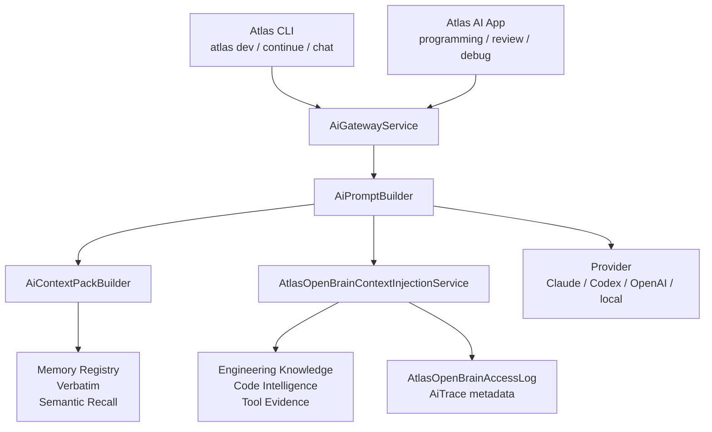

# Atlas Open Brain Context Injection

Este documento e a especificacao canonica para fazer o Atlas usar Open Brain
automaticamente nos fluxos de programacao. Ele existe para separar duas coisas
que nao podem ser confundidas:

- `Atlas Open Brain Workbench`: tela manual para buscar memoria, gerar context
  pack, copiar prompt e auditar exports.
- `Open Brain Context Injection`: camada core que injeta contexto
  automaticamente quando o Atlas CLI ou o Atlas AI App vao pedir codigo,
  review ou debug para um provider.

Status real desta especificacao: **implementada no backend, CLI e app runtime em
2026-05-03**. O Atlas ja injeta Open Brain automaticamente em fluxos de
codigo/review/debug, salva metadata compacta no trace, audita a injecao e mostra
status no CLI/app.

## Decisao Executiva

O Open Brain deve virar parte natural do runtime de IA do Atlas. O operador nao
deve precisar lembrar de abrir uma tela, copiar um context pack e colar em
Claude/Codex para que uma feature seja implementada com memoria real.

A regra final:

> Quando o Atlas pedir programacao, review ou debug, o Atlas deve montar e
> injetar um Open Brain Context Pack automaticamente, com budget, privacy,
> audit log e metadata de trace.

Isso vale principalmente para:

- `atlas dev`;
- `atlas continue`;
- `atlas chat --mode=dev`;
- `atlas chat --mode=debug`;
- `atlas chat --mode=review`;
- Atlas AI App em modo `programming`;
- Atlas AI App com tarefa `review`;
- Atlas AI App com tarefa `debug`.

## Escopo

Incluido nesta arquitetura:

- deteccao automatica de quando Open Brain deve entrar;
- service central de policy e composicao;
- contrato de `InjectionResult`;
- fluxo de CLI para `dev`, `continue` e `chat`;
- fluxo de app para programacao, review e debug;
- ponto correto de injecao no prompt;
- auditoria por `atlas_open_brain_access_logs` e metadata do trace;
- failure modes, budgets e opt-out/required mode;
- plano de implementacao faseado.

Fora do escopo desta fase:

- ChromaDB;
- vector search externo;
- embeddings externos novos;
- MCP remoto multiusuario com SSE/sessoes persistentes;
- tools MCP com escrita;
- sync remoto bidirecional;
- projection apply automatico;
- envio de segredos ou memoria nao provider-safe.

## Principio De Arquitetura

CLI e app nunca devem montar prompt manualmente com memoria. Eles devem declarar
intencao, workspace, task e policy. O `atlas-server` decide o que entra.



O service `AtlasOpenBrainContextInjectionService` e o unico ponto de regra. Ele
nao duplica `AiContextPackBuilder`; ele reutiliza o context pack ja montado pelo
prompt runtime e adiciona knowledge/code refs auditaveis. Ele deve:

1. receber uma `InjectionRequest`;
2. aplicar policy por surface/mode;
3. chamar ou reutilizar `AtlasOpenBrainService`/`AiContextPackBuilder`;
4. limitar tamanho e provider-safety;
5. registrar auditoria;
6. retornar um `InjectionResult` para o prompt e para o trace.

## Contrato `InjectionRequest`

Formato conceitual:

```json
{
  "surface": "cli_dev",
  "mode": "dev",
  "workspace": "/Users/vitorepf/Develop/atlas/atlas-server",
  "objective": "implementar feature X",
  "task_id": "optional-task-id",
  "thread_id": "optional-thread-id",
  "provider": "claude",
  "model": "optional-model",
  "policy": {
    "mode": "auto",
    "budget_chars": 20000,
    "refresh": false,
    "require": false,
    "provider_safe_only": true
  },
  "context": {
    "engineering_contract": {},
    "engineering_blueprint": {},
    "dev_plan": {},
    "repair_iteration": null
  }
}
```

Campos obrigatorios:

| Campo | Regra |
|---|---|
| `surface` | Origem operacional: `cli_dev`, `cli_continue`, `cli_chat`, `app_ai` |
| `mode` | Intencao: `dev`, `debug`, `review`, `programming`, `direct`, `plan` |
| `workspace` | Workspace real usado para docs, code intelligence e recall |
| `objective` | Texto curto que descreve a tarefa atual |
| `policy.mode` | `auto`, `off` ou `required` |
| `policy.provider_safe_only` | Sempre `true` para injecao automatica |

## Contrato `InjectionResult`

Formato conceitual:

```json
{
  "enabled": true,
  "status": "injected",
  "reason": "mode_requires_open_brain",
  "surface": "cli_dev",
  "mode": "dev",
  "workspace": "/Users/vitorepf/Develop/atlas/atlas-server",
  "context_pack_hash": "sha256",
  "audit_id": "uuid",
  "prompt_section": "# Atlas Open Brain Context\n...",
  "summary": {
    "memory_refs": 4,
    "knowledge_refs": 3,
    "code_refs": 8,
    "memory_quality": {
      "status": "ready",
      "score": 97,
      "active": 5,
      "provider_safe_active": 5,
      "trend": {
        "status": "stable",
        "current_delta_from_latest": 0,
        "latest_delta_from_previous": 0,
        "snapshot_count": 3
      }
    },
    "tool_refs": 2,
    "budget_chars": 20000,
    "used_chars": 3180
  },
  "warnings": [],
  "next_actions": [],
  "context_refs": []
}
```

Statuses permitidos:

| Status | Significado | Provider recebe prompt? |
|---|---|---|
| `injected` | Contexto Open Brain entrou no prompt | Sim |
| `skipped` | Policy determinou que nao deve entrar | Sim |
| `degraded` | Entrou parcialmente com warnings | Sim, salvo `required` |
| `failed_closed` | Falhou e policy exige Open Brain | Nao |
| `failed_open` | Falhou, mas policy permite continuar | Sim, com warning |

O `InjectionResult` interno contem `prompt_section` e `context_refs`, mas a
metadata persistida deve ser compacta. O trace/job/CLI JSON salvam somente hash,
status, audit id, summary, warnings e policy sanitizada.

O resultado compacto deve ser salvo em:

- metadata do `AiTrace`: `metadata.open_brain_injection`;
- audit log: `atlas_open_brain_access_logs`;
- saida JSON dos comandos CLI quando `--json` existir;
- status visual do app quando o trace retornar metadata.

## Policy De Ativacao

| Surface | Modo/tarefa | Default | Motivo |
|---|---|---|---|
| `atlas dev` | qualquer execucao | `auto` | fluxo de codigo precisa memoria, docs e code refs |
| `atlas dev --complete` | execucao completa | `required` recomendado | risco maior de finalizar tarefa sem contexto |
| `atlas continue` | resume de plano | `auto` com reuse | deve preservar hash anterior quando valido |
| `atlas chat --mode=dev` | dev | `auto` | usuario esta pedindo codigo |
| `atlas chat --mode=debug` | debug | `auto` | precisa lembrar arquitetura e falhas conhecidas |
| `atlas chat --mode=review` | review | `auto` | precisa contratos, gates e code intelligence |
| `atlas chat --mode=direct` | direct | `off` | conversa comum nao deve inflar prompt |
| App `programming` | dev | `auto` | promocao para programacao deve usar memoria |
| App task `debug` | debug | `auto` | debug deve ver contexto tecnico |
| App task `review` | review | `auto` | review deve ver DoD, contracts e refs |

Opt-out e strict mode:

- `--no-open-brain` ou payload `open_brain.mode=off` desativa.
- `--require-open-brain` ou payload `open_brain.mode=required` falha fechado.
- `--open-brain-refresh` ignora hash anterior e gera novo context pack.
- Direct/research so usa Open Brain quando solicitado explicitamente.

## Onde Injetar No Prompt

O prompt final deve manter esta ordem:

1. system/developer instructions internas do Atlas;
2. task request normalizada;
3. **Atlas Open Brain Context**;
4. **Memory Quality Gate** dentro do bloco Open Brain;
5. engineering contract/blueprint/dev plan;
6. operator request final;
7. output contract.

O Open Brain nao deve ser colado duas vezes. Como `AiPromptBuilder` ja usa
`AiContextPackBuilder`, a implementacao deve escolher uma destas estrategias:

1. Integrar a injecao dentro do proprio build do context pack, marcando os refs
   como `open_brain=true`.
2. Fazer o injector chamar o builder e devolver uma secao unica, enquanto o
   prompt builder evita renderizar o context pack antigo em duplicidade.

E proibido concatenar o `prompt_section` do Open Brain em cima de outro context
pack identico sem dedupe por `context_pack_hash`.

## Fluxo `atlas dev`

Ponto atual relevante:

- `AtlasCliDevCommand` resolve task, workspace, engineering contract e blueprint.
- O comando monta `$providerPrompt` via `AtlasCliDevWorkflowService`.
- Depois ele chama `atlas:ai:chat` para executar provider.

Fluxo implementado:

1. Resolver workspace, task, provider, model, contract e blueprint.
2. Gravar policy `operator_options.open_brain` no plano de dev.
3. Repassar flags/policy para `atlas:ai:chat`.
4. Se `status=failed_closed`, abortar antes de chamar provider.
5. `AiPromptBuilder` chama `AtlasOpenBrainContextInjectionService`.
6. Inserir a secao Open Brain no prompt final uma unica vez, com quality gate
   compacto quando `include_memory_quality=true`.
7. Salvar `context_pack_hash`, `audit_id` e `status` em metadata de trace/job.
8. Em `--plan-only`, montar uma previa compacta de Open Brain sem executar
   provider e sem persistir `prompt_section` ou `context_refs` brutos.

Saida JSON alvo:

```json
{
  "open_brain_preview": {
    "status": "injected",
    "context_ready": true,
    "provider_execution_allowed": true,
    "surface": "cli_dev",
    "context_pack_hash": "sha256",
    "audit_id": "uuid",
    "summary": {
      "memory_refs": 4,
      "knowledge_refs": 6,
      "code_refs": 8,
      "memory_quality": {
        "status": "ready",
        "score": 97
      }
    },
    "warnings": [],
    "policy": {
      "mode": "required"
    }
  }
}
```

## Fluxo `atlas continue`

`atlas continue` deve ser tratado como extensao do mesmo trabalho, nao como uma
nova tarefa sem memoria.

Fluxo implementado:

1. Encontrar plano resumivel.
2. Ler `operator_options.open_brain` salvo no plano anterior.
3. Aplicar overrides atuais (`--no-open-brain`, `--require-open-brain`,
   `--open-brain-refresh`, `--open-brain-budget`).
4. Passar policy para `atlas dev --resume`.
5. Deixar a injecao real acontecer uma unica vez no prompt runtime.

Futuro opcional:

- reutilizar hash anterior entre iteracoes longas quando isso reduzir prompt sem
  perder contexto recente;
- invalidar hash por workspace/docs/code drift de forma explicita.

Regra de stale:

- Mudanca de workspace invalida o hash.
- `atlas memory maintain` com docs/code drift antes da sessao pode exigir
  refresh.
- Reparos do mesmo plano devem preferir reuse para manter coerencia.

## Fluxo `atlas chat`

`atlas chat` deve usar Open Brain automaticamente quando a conversa virar
programacao, debug ou review.

Fluxo implementado:

1. `AiChatCommand` identifica `--mode`.
2. Opcoes enviadas ao gateway incluem:

```json
{
  "app_surface": "atlas_cli",
  "atlas_workflow_mode": "dev",
  "workspace": "/workspace",
  "open_brain": {
    "mode": "auto",
    "surface": "cli_chat"
  }
}
```

3. `AiPromptBuilder` chama o injector.
4. Trace recebe `metadata.open_brain_injection`.
5. Saida CLI mostra status curto quando nao estiver em `--json`.

Comportamento por modo:

- `--mode=dev`: injeta.
- `--mode=debug`: injeta.
- `--mode=review`: injeta.
- `--dev`: injeta como `mode=dev`.
- `--mode=direct`: nao injeta, salvo flag explicita.
- `--mode=research`: nao injeta por padrao, salvo se a task tocar codigo do
  Atlas ou usuario pedir Open Brain.

## Fluxo No Atlas AI App

O app nao deve virar compositor de prompt. Ele deve enviar routing e workspace
claros para o backend.

Ponto atual relevante:

- `AtlasAiSheet.submitText()` monta `routingSnapshot`.
- O app chama `createAiInteraction()`.
- Payload ja inclui `atlas_workflow_mode`, `routing_task`, `routing_domain`,
  provider solicitado, workspace e `task_type` em debug.
- `startDevelopment()` promove a conversa para `programming`.

Fluxo implementado:

1. Usuario pede programacao, review ou debug.
2. `AtlasAiSheet` envia `open_brain.mode=auto` no payload quando a rota pede
   programacao/review/debug; o backend ainda consegue inferir pelo routing.
3. Backend resolve policy com `surface=app_ai`.
4. Backend injeta Open Brain no prompt antes do provider.
5. Trace retorna metadata de injecao.
6. App mostra status compacto:
   - `Open Brain usado`;
   - hash curto;
   - contagem de refs;
   - warnings se houve degradacao.
7. Tela `Home > Atlas Open Brain` continua existindo como workbench manual para
   preview, copia, auditoria e manutencao.

Payload alvo do app:

```json
{
  "atlas_workflow_mode": "dev",
  "routing_task": "debug",
  "routing_domain": "programming",
  "workspace": "/Users/vitorepf/Develop/atlas/atlas-server",
  "open_brain": {
    "mode": "auto",
    "surface": "app_ai",
    "show_trace_status": true
  }
}
```

## Auditoria E Observabilidade

Cada injecao real deve produzir trilha auditavel.

Campos minimos no audit log:

| Campo | Conteudo |
|---|---|
| `surface` | `cli_dev`, `cli_continue`, `cli_chat`, `app_ai` |
| `action` | `context_injection` |
| `requester` | operador, app, CLI ou trace quando disponivel |
| `workspace` | workspace normalizado |
| `objective_hash` | hash do objetivo, nao prompt bruto longo |
| `context_pack_hash` | hash do pack final |
| `memory_refs_count` | numero de memory refs |
| `context_refs_count` | refs totais |
| `policy` | auto/off/required, budget, provider_safe_only |

Campos minimos no trace:

```json
{
  "open_brain_injection": {
    "status": "injected",
    "surface": "app_ai",
    "mode": "dev",
    "context_pack_hash": "sha256",
    "audit_id": "uuid",
    "summary": {
      "memory_refs": 4,
      "knowledge_refs": 3,
      "code_refs": 8
    },
    "warnings": []
  }
}
```

## Failure Modes

| Falha | Default | Motivo |
|---|---|---|
| tabelas de memoria ausentes | `failed_open` | ambiente parcial nao deve travar conversa simples |
| no provider-safe memory | `degraded` | pode haver docs/code refs uteis |
| code intelligence stale | `degraded` | avisar e sugerir `atlas memory maintain` |
| memory quality critical/empty/not migrated | `degraded` ou `failed_closed` quando required | provider nao deve confiar cegamente no recall |
| context pack acima do budget | `degraded` com truncamento | prompt pequeno e deterministico |
| privacy bloqueia memoria | `injected` sem a memoria bloqueada | privacy vence recall |
| exception no Open Brain | `failed_open` ou `failed_closed` | depende de policy |
| `--require-open-brain` falha | `failed_closed` | usuario pediu strict mode |

Para `atlas dev --complete` e tarefas marcadas como criticas, a policy deve
preferir `required` ou pelo menos elevar degradacao para warning visivel antes
de escrever codigo.

## Configuracao Implementada

| Config/env | Default | Papel |
|---|---|---|
| `ATLAS_OPEN_BRAIN_INJECTION_ENABLED` | `true` | Liga/desliga injecao automatica global |
| `ATLAS_OPEN_BRAIN_INJECTION_BUDGET_CHARS` | `20000` | Budget maximo da secao Open Brain |
| `ATLAS_OPEN_BRAIN_INJECTION_REQUIRED_FOR_COMPLETE` | `true` | `atlas dev --complete` falha fechado quando necessario |
| `ATLAS_OPEN_BRAIN_INJECTION_KNOWLEDGE_REF_LIMIT` | `6` | Limite de refs canonicos de Engineering Knowledge |
| `ATLAS_OPEN_BRAIN_INJECTION_CODE_REF_LIMIT` | `8` | Limite de refs de Code Intelligence |
| `ATLAS_OPEN_BRAIN_INJECTION_INCLUDE_MEMORY_QUALITY` | `true` | Inclui scorecard/snapshot compacto da qualidade da memoria no Open Brain |
| `ATLAS_PHP_BIN` | vazio; candidato preferido `/opt/homebrew/bin/php` | Binario PHP usado por comandos internos Artisan do Atlas |
| `ATLAS_PHP_BIN_CANDIDATES` | `/opt/homebrew/bin/php`, Homebrew PHP variants | Fallbacks para ambientes locais sem override explicito |

Contrato operacional: comandos internos gerados por `atlas dev`,
`atlas continue`, `atlas chat`, release/final, dogfood, scheduler e harness
gerenciado devem resolver o PHP por `App\Support\AtlasPhpBinary`. Em Mac local
com Homebrew, o esperado e `/opt/homebrew/bin/php`, mesmo quando o shell atual
exibe outro PHP no prompt.

Flags implementadas:

| Flag | Comandos | Papel |
|---|---|---|
| `--no-open-brain` | `atlas dev`, `atlas continue`, `atlas chat` | Desativa para a execucao |
| `--require-open-brain` | `atlas dev`, `atlas continue`, `atlas chat` | Falha se nao injetar |
| `--open-brain-refresh` | `atlas dev`, `atlas continue` | Regera contexto em vez de reutilizar hash |
| `--open-brain-budget=20000` | `atlas dev`, `atlas continue`, `atlas chat` | Ajusta budget da secao |

## Plano De Implementacao

Status real em 2026-05-03: fases A, B, C, D, E e F implementadas para runtime
local/provider-safe. A validacao visual em dispositivo pode ser repetida quando
o servidor/app estiverem rodando, mas o contrato de backend, CLI, payload do app
e badge de trace ja esta entregue.

### Fase A - Service E Contratos

Entregar:

- `AtlasOpenBrainContextInjectionService`;
- DTOs ou arrays normalizados para `InjectionRequest` e `InjectionResult`;
- policy por mode/surface;
- budgets e dedupe por hash;
- testes unitarios de policy e failure modes.

Status: implementada.

DoD:

- provider-safe sempre verdadeiro por padrao;
- `off`, `auto` e `required` cobertos por teste;
- exceptions viram status controlado, nao stack trace no prompt.

### Fase B - Integracao No Prompt Runtime

Entregar:

- chamada central no `AiPromptBuilder` ou no ponto imediatamente anterior;
- merge/dedupe com `AiContextPackBuilder`;
- metadata `open_brain_injection` no `AiPrompt`/trace;
- testes garantindo que o prompt contem uma unica secao Open Brain.

Status: implementada. A metadata persistida e sanitizada e nao carrega
`prompt_section` nem `context_refs` brutos.

DoD:

- `direct` nao injeta por padrao;
- `dev/debug/review` injeta;
- memoria bloqueada por privacy nao aparece;
- hash/audit entram na metadata.

### Fase C - CLI `atlas chat`

Entregar:

- flags `--no-open-brain`, `--require-open-brain`, `--open-brain-budget`;
- auto-injection para `--mode=dev|debug|review` e `--dev`;
- saida curta e saida JSON com `open_brain_injection`.

Status: implementada.

DoD:

- teste CLI para dev injeta;
- teste CLI para direct nao injeta;
- teste CLI para required falha fechado quando service falha.

### Fase D - CLI `atlas dev` E `atlas continue`

Entregar:

- auto-injection antes do provider prompt final;
- persistencia de hash/audit no dev plan/session;
- reuse em repair iterations;
- resume no `atlas continue`;
- `--open-brain-refresh`.

Status: implementada para passagem de policy, previa plan-only e injecao pelo
prompt runtime. O plano de dev armazena `operator_options.open_brain`;
`atlas dev --plan-only --json` retorna `open_brain_preview`; `atlas continue`
repassa ou sobrescreve essa policy.

DoD:

- `atlas dev --plan-only --json` mostra status/hash;
- `atlas dev` injeta uma unica vez por iteracao base;
- repair loop nao duplica contexto;
- `atlas continue` reutiliza ou regenera conforme policy.

### Fase E - Atlas AI App

Entregar:

- payload `open_brain` ou inferencia backend baseada em routing;
- status compacto na conversa/trace para programming/review/debug;
- sem composicao manual de prompt no app;
- link operacional para o Workbench quando usuario quiser inspecionar.

Status: implementada. `AtlasAiSheet` envia `payload.open_brain` em
programacao/review/debug e mostra status compacto por trace quando o backend
retorna `open_brain_injection`.

DoD:

- `programming` injeta;
- `debug` injeta;
- `review` injeta;
- conversa `direct` nao injeta;
- app mostra warning quando status e `degraded`.

### Fase F - Validacao, Docs E Maintain

Entregar:

- testes focados backend e front;
- runbook atualizado com comandos reais;
- documento mestre com fase marcada conforme status real;
- `atlas memory maintain` executado apos docs/codigo.

Status: implementada com testes focados PHP, `npm run typecheck`, smoke CLI e
docs atualizadas.

DoD:

- `/opt/homebrew/bin/php artisan test --filter=open_brain_context_injection`;
- `/opt/homebrew/bin/php artisan test --filter='AtlasPhpBinaryTest|AtlasTestCommandResolverTest|AtlasCliDevWorkflowServiceTest|AtlasCliDevCommandTest|AtlasCliContinueCommandTest'`;
- testes CLI focados;
- `npm run typecheck` quando app mudar;
- `git diff --check`;
- `./bin/atlas memory maintain --workspace=/Users/vitorepf/Develop/atlas/atlas-server --json`.

### Fase G - Memory Quality-Aware Injection

Entregar:

- `AtlasOpenBrainContextInjectionService` consulta `AtlasMemoryQualityService`
  quando a injecao automatica e montada;
- `InjectionResult.summary.memory_quality` inclui status, score, contagem ativa,
  contagem provider-safe, latest snapshot, tendencia e issues compactas;
- `context_pack_hash` usa o resumo compacto de qualidade e ignora timestamps
  volateis como `generated_at`;
- prompt section inclui `## Memory Quality Gate`;
- `required` falha fechado quando a memoria esta `critical`, `empty` ou
  `not_migrated`;
- warnings explicitos para `memory_quality_critical`,
  `memory_quality_no_provider_safe_memory`, `memory_quality_score_low` e
  similares;
- config `ATLAS_OPEN_BRAIN_INJECTION_INCLUDE_MEMORY_QUALITY`.

Status: implementada em 2026-05-03.

DoD:

- provider ve o quality gate antes de confiar no recall;
- direct/off continua sem inflar prompt;
- metadata compacta salva qualidade sem `prompt_section`;
- testes unitarios cobrem gate pronto e gate critico required.

### Fase H - Memory Quality Trend Guard

Entregar:

- `AtlasMemoryQualityService` deriva `trend` a partir de snapshots persistidos;
- `atlas memory quality` mostra `Trend` na saida humana e JSON;
- `atlas memory quality history` expoe `summary.trend_status`;
- `InjectionResult.summary.memory_quality.trend` inclui apenas campos
  compactos e deterministico o bastante para hash de contexto;
- prompt section inclui linha `trend` dentro de `## Memory Quality Gate`;
- warnings `memory_quality_trend_regressed` e
  `memory_quality_trend_watch_regressed` degradam a injecao em modo `auto`;
- tendencia sozinha nao entra na lista de fail-closed de `required`.

Status: implementada em 2026-05-03.

DoD:

- regressao aparece antes do provider confiar no recall;
- melhora/estabilidade ficam visiveis no scorecard e historico;
- recomendacoes apontam para `atlas memory quality history` quando ha queda;
- testes focados cobrem historico `improved`, scorecard `regressed` e warning
  de Open Brain sem fail-closed indevido.

### Fase I - Regression Diagnostics And App Trend View

Entregar:

- `trend.drivers` explica causas provaveis de regressao comparando scorecard
  atual com ultimo snapshot;
- drivers cobrem queda de componente, aumento de contadores problematicos,
  aumento de issues e queda direta de score;
- `Memory Quality Gate` inclui `trend_drivers` compacto no prompt quando
  houver regressao;
- `atlas memory quality` mostra drivers na saida humana;
- app `Atlas Open Brain` mostra score, provider-safe, tendencia, drivers e
  historico recente de snapshots;
- helpers TypeScript cobrem linhas de qualidade/historico/drivers;
- app usa endpoints existentes `/ai/memory/quality` e
  `/ai/memory/quality/history`.

Status: implementada em 2026-05-03.

DoD:

- operador consegue ver no app se a memoria esta pronta antes de usar recall;
- provider recebe causa compacta da regressao junto com o quality gate;
- CLI e app concordam com o mesmo scorecard;
- regressao continua sem fail-closed automatico quando qualidade atual ainda
  nao e `critical`, `empty` ou `not_migrated`.

## Criterio Final De Pronto

Esta capacidade so pode ser marcada como implementada quando:

- `atlas dev` usa Open Brain automaticamente;
- `atlas continue` preserva ou regenera o contexto corretamente;
- `atlas chat --mode=dev|debug|review` usa Open Brain automaticamente;
- Atlas AI App usa Open Brain automaticamente em programming/review/debug;
- app e CLI mostram status/audit hash;
- trace salva `open_brain_injection`;
- privacy/redaction continuam vencendo qualquer recall;
- nao existe duplicacao de context pack no prompt;
- testes focados passam;
- documentacao mestre lista arquivos alterados e validacoes reais.
