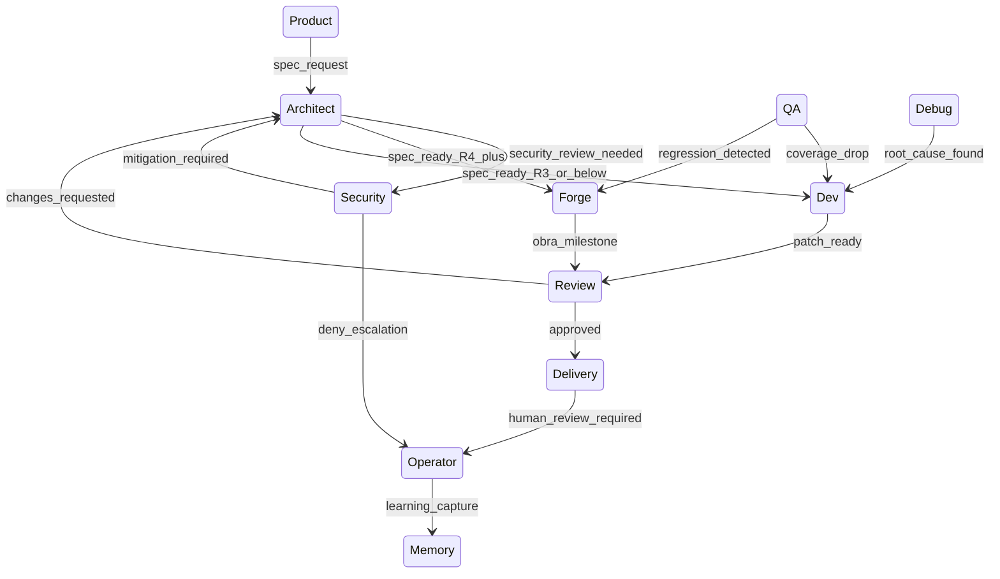

# Atlas AAEOS Cross-Department Choreography

## Resumo

State machine canonica entre 11 departamentos.

## Papel no Atlas

Garante coordenacao governada e bloqueia comunicacao ad-hoc.

## Onde Se Encaixa

```text
atlas-agentic-engineering-os-department-contract (define deptos)
  +-- atlas-aaeos-cross-department-choreography  (define coordenacao)
```

## Contratos

### Schema handoff (`atlas.aaeos.cross_dept.handoff.v1`)

```text
{
  "schema": "atlas.aaeos.cross_dept.handoff.v1",
  "handoff_id": "<uuid>",
  "from_department": "<id>",
  "to_department": "<id>",
  "intent_id": "<id>",
  "kind": "delegation|escalation|veto|repair|review_request",
  "payload_hash": "sha256:...",
  "evidence_hashes": ["sha256:..."],
  "deadline": "<iso8601>",
  "rationale": "<string>"
}
```

### Transicoes canonicas



### Regras de veto

- Security veto -> propaga para Dev/Forge/Delivery (todos pausam).
- Architect veto em spec -> volta a Product para clarification.
- Review veto em delivery -> volta a Dev/Forge para repair.
- Operator veto -> override final (sempre passa).

### Repair loop

- Max 3 iteracoes em qualquer ciclo (Dev<->Review, Forge<->Review).
- 4a iteracao escala automaticamente para Architect + Operator.

## Fluxo

Veja diagrama acima.

## Regras para IA

- Toda comunicacao entre depts via `atlas.aaeos.cross_dept.handoff.v1`.
- Veto upstream pausa downstream em <=10s.
- Repair loop registra cada iteracao.
- Operator override gera Operator Decision Receipt.

## Escopo de Implementacao

`AtlasCrossDepartmentChoreographyService`, `AtlasVetoPropagationWatchdog`, `AtlasRepairLoopGuard`.

## Dependencias

Department Contract (T1.2), Mission Control Cockpit (T1.5).

## Evidencias

Comando: `atlas:aaeos:choreography-status --intent=<id> --json`.

## Riscos

Veto perdido, repair loop infinito, handoff sem schema.

## O que este doc NAO e

Nao e contrato de departamento (T1.2); e coordenacao entre eles.

## Exemplos

Security detecta secret no patch -> emite `kind=veto` para Dev e Delivery -> ambos pausam -> Architect recebe escalation -> Architect ajusta spec -> Security re-review.

## Proximas Acoes

1. Implementar servicos.
2. Telemetria.
3. Integrar com cockpit.
