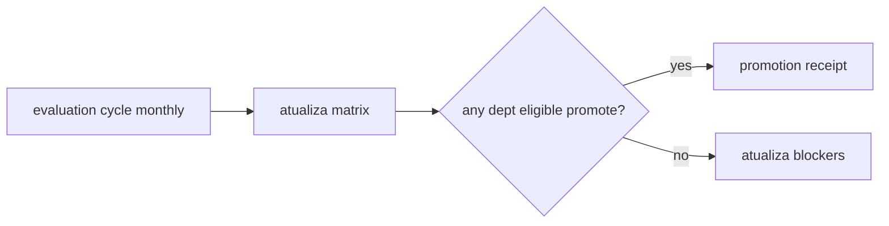

# Atlas AAEOS Department Maturity Matrix

## Resumo

Matriz canonica de maturidade dos 11 departamentos.

## Papel no Atlas

Provê snapshot de prontidão de cada departamento para roteamento e promocao.

## Onde Se Encaixa

```text
atlas-agentic-engineering-os
  +-- atlas-aaeos-department-maturity-matrix (este doc)
```

## Contratos

### Schema (`atlas.aaeos.department_maturity.v1`)

```text
{
  "schema": "atlas.aaeos.department_maturity.v1",
  "department_id": "<id>",
  "current_level": "L0|...|L7",
  "evidence": ["<hash_or_doc_path>"],
  "blockers_to_next": [{"id":"...","severity":"...","owner":"..."}],
  "last_evaluation": "<iso8601>",
  "next_evaluation_due": "<iso8601>",
  "owner": "<owner_id>"
}
```

### Matriz atual (snapshot 2026-05-26)

| Departamento | Nivel | Evidencia | Blockers para proximo | Owner | Last eval |
|--------------|-------|-----------|----------------------|-------|-----------|
| product | L3 | Mission Foundation runtime + 50 intents disambiguados | falta surface mobile completa para L4 | atlas-ai | 2026-05-26 |
| architect | L3 | Spec OS runtime + breaking change matrix | precisa Architect agent autonomo para L4 | atlas-ai | 2026-05-26 |
| research | L2 | Research Self-Improvement Runtime parcial | source-backed score baixo para L3 | atlas-ai | 2026-05-26 |
| dev | L1 | Atlas Dev fast-path A1; desde 2026-07-04: AcceptanceGate soberano + AtlasDevGateAdapter (b36244406c) e piso de spec SpecAdversary wired no AtlasDevFastPathOrchestrator (Obra #2, 335ac4b9ed..74b739d96c) | A2 Plan-Visible incompleto, HTTP path legado | atlas-ai | 2026-05-26 |
| debug | L2 | Atlas Debug Runtime + repro service | falta automated root-cause para L3 | atlas-ai | 2026-05-26 |
| review | L2 | Review checklist canonico + receipt | falta cross-review automatico R4+ | atlas-ai | 2026-05-26 |
| qa | L2 | Test pack schema + coverage gates | falta contract testing E2E | atlas-ai | 2026-05-26 |
| security | L3 | Programming Governance + secret scan + sovereignty | falta threat modeling automatico | atlas-ai | 2026-05-26 |
| forge | L4 | Forge Continuum + multi-provider drivers + long horizon; desde 2026-07-04/05: AtlasForgeGateAdapter soberano (17aa692c0e), piso de spec no ForgeObraCertificationService (Obra #2) e automerge sob juiz soberano fail-closed (a4a88b7fa3) | mecanismo de merge sob juiz soberano EXISTE (a4a88b7fa3; juiz de entrega ForgeObra observe-first 6f3c327dda); promocao R5 nao re-medida | atlas-ai | 2026-05-26 |
| delivery | L2 | Delivery pack assembly parcial | falta zero-downtime gate L3 | atlas-ai | 2026-05-26 |
| memory | L3 | ACOS 73 subsistemas + promotion gates | falta cross-session handoff pack L4 | atlas-ai | 2026-05-26 |

### Atualizacao 2026-07-05

Refresh factual (campanha Documentacao Canonica Verdadeira). O snapshot 2026-05-26 pre-data entregas ja commitadas na main que mudam FATOS de evidencia — nenhum nivel foi re-medido nem promovido:

- Obra #1 (2026-07-04, b36244406c): AcceptanceGate soberano + SovereignHonestyFloor em `app/Services/Ai/EngineeringKernel/`, com adapters AtlasDevGateAdapter (b36244406c), AtlasForgeGateAdapter (17aa692c0e) e AtlasAutonomosGateAdapter (3dee8f4a4f).
- Obra #2 (2026-07-04, 335ac4b9ed..74b739d96c): piso de spec — SpecAdversary + 22 classes em `app/Services/Ai/EngineeringKernel/Spec/` — wired no `AtlasDevFastPathOrchestrator` e no `ForgeObraCertificationService` (verificado por leitura direta dos dois arquivos em 2026-07-05).
- Obra #4 (2026-07-05): automerge sob juiz soberano fail-closed (a4a88b7fa3), RegressionLock (4d29d8725f), replay-proof (72a50f6e75), RepairBrain (e0f44ebda5), flywheel COMPOUND→Brain (181e17b5d7).
- Obra #5 (2026-07-05): CertifierClassificationLedger com 66 certifiers classificados — 2 A_DELIVERY / 35 B_STATE / 10 C_PARKED / 19 D_ISOLATED, recontados no arquivo em 2026-07-05 (60d436bba8) — e juizes de entrega Obra/ForgeObra sob o piso soberano em modo observe-first (92abe2bc52, 6f3c327dda; default `observe` confirmado no config do ForgeObraCertificationService).
- Limpeza-bruta 2026-07-05 (liquido -86.048 linhas): nenhuma classe listada em `repo_paths`/`evidence_refs` deste doc foi deletada — todas verificadas existentes em 2026-07-05.

NAO re-avaliado neste refresh: todos os niveis L0-L7 da matriz dependem de medicao runtime via `atlas:aeos:maturity`, que NAO foi re-rodada aqui — por isso a coluna "Last eval" continua 2026-05-26 e nenhuma celula de nivel mudou. Blockers das linhas product, architect, research, debug, review, qa, security, delivery e memory: nao re-avaliados. Pela propria regra deste doc (drift de evidencia >30 dias bloqueia roteamento), a matriz esta em drift desde 2026-06-25 ate a proxima evaluation.

## Fluxo



## Regras para IA

- Roteamento de intent R3+ exige depto com nivel >=L2.
- Promocao de departamento exige eliminar todos os blockers listados.
- Drift em evidencia (>30 dias sem update) bloqueia roteamento.

## Escopo de Implementacao

`AtlasAaeosDepartmentMaturityService`, comando `atlas:aeos:maturity --json`. Ambos existem (verificado 2026-07-05: `app/Services/Ai/Aaeos/AtlasAaeosDepartmentMaturityService.php` e `app/Console/Commands/AtlasAaeosMaturityCommand.php`; ha tambem `atlas:aeos:department-status` em `app/Console/Commands/AtlasAaeosDepartmentStatusCommand.php`).

## Dependencias

Department Contract (T1.2), Autonomy Ladder Runbook (T2.1).

## Evidencias

Doc canonico + comando + ledger de evaluations.

## Riscos

Self-evaluation tendenciosa, blockers stale, promocao prematura.

## O que este doc NAO e

Nao define quality bar (T3.3) nem promove autonomia (T2.1); registra estado.

## Exemplos

Forge esta L4: 5 Obras consecutivas verdes; promocao L5 bloqueada por merge review promotion R5.

> Nota 2026-07-05: o mecanismo de merge sob juiz soberano passou a existir — automerge fail-closed pelo AcceptanceGate (a4a88b7fa3, Obra #4 S0) e juiz de entrega ForgeObra observe-first (6f3c327dda, Obra #5 S1). A promocao R5/L5 em si NAO foi re-medida.

## Proximas Acoes

1. Rodar ciclo de re-avaliacao com `php artisan atlas:aeos:maturity --json` — o comando ja existe (verificado 2026-07-05, `app/Console/Commands/AtlasAaeosMaturityCommand.php`); os niveis nao sao re-medidos desde 2026-05-26.
2. Update mensal.
3. Integrar com cockpit.
