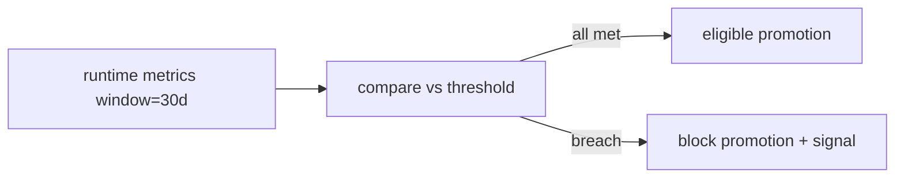

# Atlas AAEOS Department Quality Bar Matrix

## Resumo

Quality bar mensuravel por departamento por nivel.

## Papel no Atlas

T2.3 maturity matrix diz qual nivel; este doc diz **o que prova nivel**.

## Onde Se Encaixa

```text
atlas-agentic-engineering-os-department-contract (define depto)
  +-- atlas-aaeos-department-maturity-matrix (estado atual)
  +-- atlas-aaeos-department-quality-bar-matrix (este doc, thresholds)
```

## Contratos

### Quality bar por departamento por nivel (snapshot)

#### Dev

| Nivel | Latency p95 | Tests pass rate | Scope violation rate | Repair loop avg |
|-------|-------------|-----------------|---------------------|-----------------|
| L0-L1 | <=120s | >=0.85 | <=0.05 | <=2 |
| L2 | <=90s | >=0.92 | <=0.02 | <=1.5 |
| L3 | <=60s | >=0.96 | <=0.01 | <=1 |
| L4+ | <=45s | >=0.98 | 0 | <=0.5 |

#### Forge

| Nivel | Obra completion rate | Cert pass rate | Rollback rate | Multi-agent collision rate |
|-------|---------------------|----------------|---------------|----------------------------|
| L0-L2 | >=0.7 | >=0.85 | <=0.10 | <=0.05 |
| L3 | >=0.85 | >=0.93 | <=0.04 | <=0.02 |
| L4 | >=0.93 | >=0.97 | <=0.02 | <=0.01 |
| L5+ | >=0.97 | >=0.99 | <=0.005 | 0 |

#### Security

| Nivel | False positive rate | False negative count | Mean time to deny |
|-------|---------------------|----------------------|-------------------|
| L0-L2 | <=0.20 | <=2/mo | <=10s |
| L3 | <=0.10 | <=1/mo | <=5s |
| L4+ | <=0.05 | 0 | <=2s |

#### Review

| Nivel | Findings catch rate | Cycle time p95 | Veto false rate |
|-------|---------------------|----------------|-----------------|
| L0-L2 | >=0.7 | <=24h | <=0.1 |
| L3 | >=0.85 | <=8h | <=0.05 |
| L4+ | >=0.95 | <=2h | <=0.02 |

#### QA

| Nivel | Coverage p50 | Regression catch rate | Contract test count |
|-------|--------------|-----------------------|---------------------|
| L0-L2 | >=0.6 | >=0.7 | >=0 |
| L3 | >=0.75 | >=0.9 | >=10 |
| L4+ | >=0.85 | >=0.97 | >=30 |

#### Memory

| Nivel | Promotion accuracy | Quarantine rate | Retrieval latency p95 |
|-------|--------------------|------------------|------------------------|
| L0-L2 | >=0.75 | <=0.2 | <=2s |
| L3 | >=0.88 | <=0.1 | <=1s |
| L4+ | >=0.95 | <=0.05 | <=400ms |

(Demais departamentos com thresholds analogos; ver registro completo via comando.)

### Schema (`atlas.aaeos.quality_bar.v1`)

```text
{
  "schema": "atlas.aaeos.quality_bar.v1",
  "department_id": "<id>",
  "level": "L<n>",
  "thresholds": [
    {"metric": "<id>", "comparator": ">=|<=", "value": <number>, "unit": "<unit>"}
  ],
  "evaluated_window_days": 30,
  "evaluator_service": "<service_class>"
}
```

## Fluxo



## Regras para IA

- Promocao bloqueada se ANY metric breach.
- Threshold breach gera signal `dept_quality_bar_breach_count`.
- Re-eval mensal automatico.

## Escopo de Implementacao

`AtlasAaeosQualityBarService`, comando `atlas:aaeos:quality-bar --json`.

## Dependencias

Maturity Matrix (T2.3), Department Contract (T1.2).

## Evidencias

Comando + dashboards + ledger.

## Riscos

Threshold otimista, metrica nao instrumentada, breach silencioso.

## O que este doc NAO e

Nao registra estado (T2.3); define thresholds.

## Exemplos

Forge L4 requer obra_completion_rate >=0.93. Rate atual 0.91 -> bloqueia promocao L5.

## Proximas Acoes

1. Implementar comando.
2. Telemetria por departamento.
3. Integrar com cockpit.
