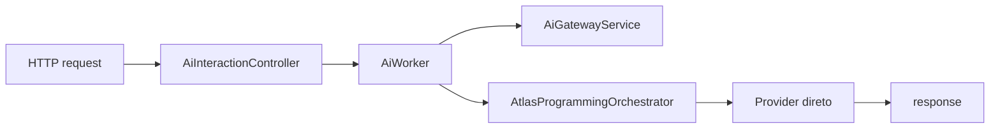
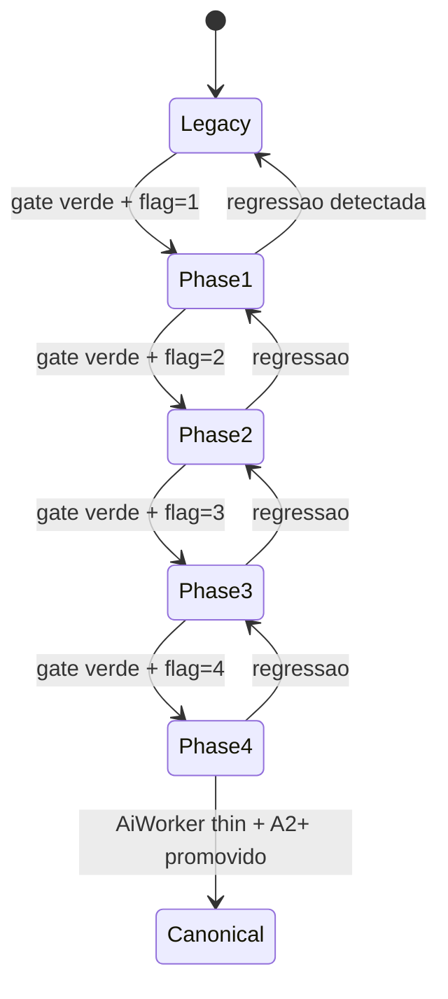

# Atlas AAEOS HTTP Path Integration Spec

## Resumo

Spec canonica para migrar o caminho HTTP produtivo do Atlas (`AiInteractionController -> AiWorker -> AtlasProgrammingOrchestrator legado`) para o Kernel canonico do AAEOS (`Mission Foundation -> AI Router -> AAWR -> Company Runtime -> Atlas Decide -> Dev/Forge -> Evidence -> Cert`). Migracao em quatro fases, cada uma com gate de regressao, feature flag e rollback. **Este doc destrava o single biggest unlock arquitetural** identificado pela auditoria do Atlas.

## Papel no Atlas

A doc-mae do AAEOS define o sistema. O runbook (T1.1) define as 17 fases canonicas. **O caminho HTTP produtivo hoje pula da fase 0 direto para a fase 10, ignorando 8 fases de governance**. Esta spec define o caminho canonico de fix em quatro etapas seguras, sem quebrar Atlas Dev A1 atual.

## Onde Se Encaixa

```text
atlas-agentic-engineering-os-runbook  (17 fases canonicas teoricas)
                |
                +--> atlas-aaeos-http-path-integration-spec  (este doc, fix concreto)
```

## Contratos

### Estado atual (legado, problematico)



Problemas:
- Mission Foundation nunca chamado.
- AI Router nunca chamado para classificar intent.
- Policy gate (Security) nao avaliado.
- AAWR nunca decide topologia multi-agente.
- Company Runtime nunca decide departamento.
- Atlas Decide nunca decide provider topology.
- Evidence Certification Runtime so toca pos-execucao parcial.
- Decision Receipt v2 emitido tardiamente.

### Estado-alvo (canonico)

```mermaid
flowchart LR
  Req[HTTP request] --> Ctrl[AiInteractionController]
  Ctrl --> Facade[AtlasAaeosHttpPathFacade]
  Facade --> Mission[Mission Foundation P1]
  Mission --> Place[Place Feature P2]
  Place --> Router[AI Router P3]
  Router --> Policy[Programming Governance P4]
  Policy --> Topology[AAWR + Decide P5]
  Topology --> Routing[Company Runtime P6]
  Routing --> Spec[Spec OS P7]
  Spec --> Tasks[Work Splitter P8]
  Tasks --> Receipt[Decision Receipt v2 P9]
  Receipt --> Exec[Dev fast-path ou Forge P10]
  Exec --> Gates[Universal Gates P11]
  Gates --> Evidence[Evidence Cert P12]
  Evidence --> Delivery[Delivery Pack P13]
  Delivery --> Resp[response + cockpit notify]
```



### Schema canonico de request envelope (`atlas.aaeos.http_request.v1`)

```text
{
  "schema": "atlas.aaeos.http_request.v1",
  "request_id": "<uuid>",
  "intent_text": "<string>",
  "operator_id": "<id>",
  "session_id": "<id>",
  "surface": "desktop|mobile|cli|api",
  "phase_hint": "<phase_name_or_null>",
  "phase_overrides": {"<phase>": "skip"},
  "feature_flags": {"http_path_phase": "1|2|3|4|legacy"}
}
```

### Schema canonico de response envelope (`atlas.aaeos.http_response.v1`)

```text
{
  "schema": "atlas.aaeos.http_response.v1",
  "request_id": "<uuid>",
  "intent_id": "<uuid>",
  "phases_executed": ["<phase_name>"],
  "current_phase": "<phase_name>",
  "next_phase": "<phase_name_or_null>",
  "evidence_hashes": ["sha256:..."],
  "blockers": [{"id": "...", "severity": "...", "owner": "..."}],
  "delivery_pack_hash": "<sha256_or_null>",
  "operator_action_required": "<action_or_null>",
  "phase_skip_reasons": [{"phase": "...", "receipt_id": "..."}]
}
```

## Fluxo

### Fases de migracao (4 etapas seguras)

| Fase | Escopo | Feature flag | Gate de regressao | Rollback |
|------|--------|--------------|-------------------|----------|
| 1 | Mission Foundation opcional + Place Feature obrigatorio | `http_path_phase=1` | 100% requests com placement_decision; latency p95 +<=20% vs legado | `flag=legacy` desabilita facade |
| 2 | AI Router + Policy gate obrigatorios | `http_path_phase=2` | 100% requests com `intent_classification.v1` e `policy_decision.v1`; security gate cobre 100% sensitive paths | `flag=1` reverte para fase 1 |
| 3 | AAWR + Decide obrigatorios para R3+ | `http_path_phase=3` | R3+ com `multi_agent.decision.v1`; R1-R2 ainda fast-path A1 | `flag=2` reverte |
| 4 | Company Runtime obrigatorio + AiWorker thin delegator + Decision Receipt v2 antes de execucao | `http_path_phase=4` | 100% requests com receipt assinado antes de provider call; AiWorker LOC >= -60% | `flag=3` reverte |

### Telemetria obrigatoria por fase

- `http_path_phase_active` (gauge): qual fase ativa
- `http_path_canonical_call_rate` (rate): percentual via facade vs legado
- `http_path_legacy_fallback_rate` (rate): fallbacks para legado
- `http_path_regression_count` (counter): falhas detectadas vs baseline
- `http_path_p95_latency_ms` (histogram): latency observada por fase

### Backward-compat com Atlas Dev fast-path A1

Atlas Dev A1 (Foundation) hoje funciona em 1-3 arquivos via AiWorker direto. Durante fases 1-3:
- Atlas Dev A1 continua funcionando para R1-R2.
- A partir da fase 3, R3+ atravessa AAWR/Decide.
- Fase 4 promove A1 para A2 Plan-Visible (atravessa Mission + Router + Policy mas mantem latencia baixa via cache de classificacao).

### Diagrama de transicao fase a fase



## Regras para IA

- Antes de tocar `AiWorker.php`, ler este doc inteiro.
- Nunca remover backward-compat antes de fase 4 declarar A1 deprecated com decision receipt.
- Cada PR de migracao toca UMA fase; PR multi-fase e bloqueado.
- Telemetria nova precisa estar em producao por 7 dias antes do gate da fase ser declarado verde.
- Rollback testado em ambiente de dev antes de qualquer rollout.

## Estado Vivo de Implementacao

- `AtlasAaeosHttpPathFacadeService` e o coordenador do HTTP path: resolve fase ativa, cacheia placement, bloqueia antes do provider quando gate falha, anexa metadata ao payload e registra telemetria.
- Retornos bloqueados e telemetry do facade passam por helpers internos unicos; nao duplicar shape de `blocker` ou `telemetry` em ramos de fase.
- `AaeosHttpPathEnvelopeFactory` e a unica fabrica de envelopes P0-P9 do facade. Nao adicionar novos `emit*` privados no facade; novas formas de envelope entram aqui ou em runtime canonico ja existente.
- `AaeosDeferredPhaseDispatcherService` estaciona envelopes R3+ marcados como `deferred` para P5-P9. O facade nao executa Spec OS, Work Splitter ou Decision Receipt v2 sincronicamente.
- `AtlasAaeosPhaseRouterService` decide `legacy|1|2|3|4`; nao criar outro router de phase flag.
- O payload `payload.aaeos_http_path` contem `schema`, `intent_id`, `phases_executed`, `phases_executed_count`, `placement_decision` e os envelopes.

## Escopo de Implementacao

Servicos afetados:
- `AiInteractionController` (entry point)
- `AiWorker` (sera reduzido a thin delegator na fase 4)
- `AiGatewayService` (continua, nao muda papel)
- `AtlasProgrammingOrchestratorService` (sera deprecated apos fase 4)
- Servicos vivos: `AtlasAaeosHttpPathFacadeService`, `AaeosHttpPathEnvelopeFactory`, `AaeosDeferredPhaseDispatcherService`, `AtlasAaeosPhaseRouterService`

## Dependencias

Ver frontmatter. Resumo: depende de AAEOS, runbook, multi-agent unified e Real Engineering Execution Kernel. Flui para Cross-Department Choreography e Department Maturity Matrix.

## Evidencias

- Doc canonico
- Comando esperado: `php artisan atlas:aaeos http-path-status --json` retorna fase ativa e telemetria atual.
- Suite de teste viva: `tests/Unit/Ai/AgenticEngineeringOs/AtlasAaeosHttpPathFacadeServiceTest.php` + `tests/Unit/Ai/Aaeos/AtlasAaeosPhaseRouterServiceTest.php`.

## Riscos

- **Risco critico**: quebrar Atlas Dev A1 durante migracao. Mitigacao: feature flag granular + suite de regressao por fase + rollback testado.
- **Risco alto**: latency aumentar com fases adicionais. Mitigacao: cache de classificacao, paralelismo de Mission+Router quando possivel, gate p95<=+20% vs baseline.
- **Risco medio**: AiWorker concentra logica residual mesmo apos fase 4. Mitigacao: gate `aiworker_loc_reduction_min_60_percent`.
- **Risco baixo**: drift telemetria vs realidade. Mitigacao: validacao trimestral cruzada com Evidence Ledger.

## O que este doc NAO e

- Nao e a doc-mae do AAEOS.
- Nao e o runbook E2E (T1.1).
- Nao e o multi-agent unified (T1.3).
- Nao executa migracao; e contrato declarativo do plano de fix.
- Nao substitui Architect review em cada fase.

## Exemplos

### Exemplo de envelope de request fase 4

```text
POST /api/ai/interaction
{
  "schema": "atlas.aaeos.http_request.v1",
  "request_id": "req-001",
  "intent_text": "corrige timezone do export Excel",
  "operator_id": "vitor",
  "session_id": "sess-2026-05-26",
  "surface": "desktop",
  "phase_hint": null,
  "phase_overrides": {},
  "feature_flags": {"http_path_phase": "4"}
}
```

### Exemplo de response fase 4 (intent R1 fluindo pelas 17 fases)

```text
{
  "schema": "atlas.aaeos.http_response.v1",
  "request_id": "req-001",
  "intent_id": "int-fix-tz-001",
  "phases_executed": ["P0","P1","P2","P3","P4","P5","P6","P7","P8","P9","P10","P11","P12","P13"],
  "current_phase": "P14",
  "next_phase": "P15",
  "evidence_hashes": ["sha256:abc...", "sha256:def..."],
  "blockers": [],
  "delivery_pack_hash": "sha256:pack-001",
  "operator_action_required": "review_delivery_pack",
  "phase_skip_reasons": []
}
```

## Proximas Acoes

1. Validar `php artisan atlas:aaeos http-path-status --json` sempre que `http_path_phase` mudar.
2. Antes de tocar `AiWorker`, provar se P9 deferred ja tem worker/receipt real suficiente; se nao tiver, escrever AP especifica de thin-delegator.
3. Nao criar `AtlasAaeosRequestEnvelopeBuilder` ou suite paralela de feature tests sem nova evidencia de lacuna; o contrato vivo atual esta em `AaeosHttpPathEnvelopeFactory` e `AtlasAaeosHttpPathFacadeServiceTest`.
4. Continuar compactacao por extracoes internas pequenas; o facade nao deve voltar a concentrar novas formas de envelope.
