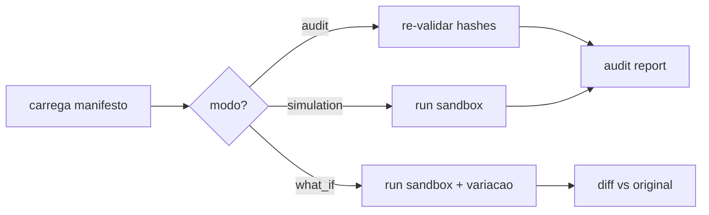

# Atlas AAEOS Obra Replay Spec

## Resumo

Replay determinístico de Obras inteiras com 3 modos.

## Papel no Atlas

Receipts isolados ja existem; falta replay end-to-end de Obra inteira.

## Onde Se Encaixa

```text
atlas-evidence-certification-runtime (receipts isolados)
  +-- atlas-aaeos-obra-replay-spec (replay E2E)
```

## Contratos

### Manifesto canonico (`atlas.obra.replay_manifest.v1`)

```text
{
  "schema": "atlas.obra.replay_manifest.v1",
  "obra_id": "<id>",
  "hash_chain_root": "sha256:...",
  "events_count": <int>,
  "phases_traversed": ["P0",...,"P16"],
  "agents": [{"agent_id":"...","provider":"..."}],
  "frozen_inputs": [{"key":"...","hash":"sha256:..."}],
  "evidence_pack_hash": "sha256:...",
  "decision_receipts": ["sha256:..."],
  "operator_signatures": ["sha256:..."],
  "started_at": "<iso8601>",
  "ended_at": "<iso8601>",
  "deterministic_seed": "<hex>"
}
```

### 3 modos de replay

| Modo | Side effects | Uso |
|------|--------------|-----|
| `audit` | zero | re-validar eventos sem mexer em nada |
| `simulation` | sandboxed | rodar replay em ambiente isolado para QA |
| `what_if` | sandboxed + variacao | mudar 1 input, ver outcome alternativo |

### Hash chain canonico

Cada evento da Obra inclui:
- `event_hash`
- `prev_event_hash`
- `obra_root_hash`

Chain quebrada bloqueia replay e dispara alerta.

## Fluxo



## Regras para IA

- Replay nunca toca producao.
- Replay registra novo `replay_run.v1` evento.
- What-if exige Operator Decision Receipt.

## Escopo de Implementacao

`AtlasObraReplayService`, `AtlasHashChainValidator`, `AtlasReplaySandboxRuntime`.

## Dependencias

Evidence Cert Runtime, Parallel Multi-Agent Spec (T2.2).

## Evidencias

Comando: `atlas:obra:replay --obra=<id> --mode=audit|simulation|what_if --json`.

## Riscos

Sandbox vaza para producao, hash chain quebrado nao detectado, what-if usado sem receipt.

## O que este doc NAO e

Nao e schema de receipt isolado (existe em Evidence Cert Runtime); e replay E2E.

## Exemplos

Obra de notif (5 dias, 18 eventos): replay audit re-valida 18 eventos em <30s; what-if substitui provider Claude por Codex e mostra diff de duration/quality.

## Proximas Acoes

1. Implementar `AtlasObraReplayService`.
2. Hash chain validator integrado a Evidence Ledger.
3. Sandbox isolado.
