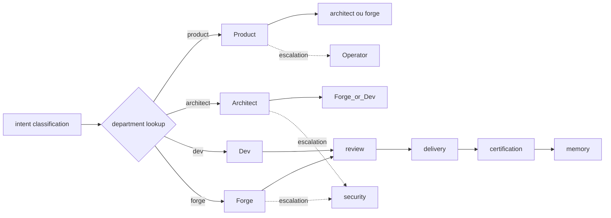

# Atlas Agentic Engineering OS Department Contract

## Resumo

Schema canonico universal `atlas.aaeos.department.v1` que todo departamento do AAEOS deve preencher para existir. Contem o schema formal, contratos preenchidos para 11 departamentos canonicos atuais e template para departamentos futuros.

## Papel no Atlas

A doc-mae define autoridade. Os contratos atuais (`atlas-agentic-engineering-os-contracts.md`) descrevem departamentos em prosa estruturada. **Este doc transforma essa descricao em schema executavel**, com 12 campos obrigatorios. Sem este doc, criar novo departamento e improvisacao; com este doc, e governanca.

## Onde Se Encaixa

```text
atlas-agentic-engineering-os
  +-- atlas-agentic-engineering-os-contracts        (prosa)
  +-- atlas-agentic-engineering-os-department-contract  (este doc, schema)
```

## Contratos

### Schema canonico `atlas.aaeos.department.v1`

12 campos obrigatorios. Departamento sem qualquer destes campos e blocker.

```text
{
  "schema": "atlas.aaeos.department.v1",
  "id": "<snake_case>",
  "human_name": "<string>",
  "scope": "<string descrevendo escopo unico e exclusivo>",
  "triggers": ["<intent_classification_target>"],
  "inputs": [{"name": "<key>", "schema": "<atlas.*.v1>"}],
  "outputs": [{"name": "<key>", "schema": "<atlas.*.v1>"}],
  "gates": ["<gate_id>"],
  "allowed_actions": ["<action_id>"],
  "forbidden_actions": ["<action_id>"],
  "escalation_to": ["<department_id>"],
  "evidence_required": ["<evidence_id>"],
  "persistence": {"primary_table": "<string>", "ledger": "<string>"},
  "observability_signals": ["<metric_id>"],
  "maturity_level": "L0|L1|L2|L3|L4|L5|L6|L7"
}
```

### Departamentos canonicos atuais (11)

#### 1. Product

```text
id: product
human_name: Product Department
scope: traduz intencao humana ambigua em engineering_goal disambiguado com criterios de aceitacao mensuraveis
triggers: ["intent_classification.target_department=product"]
inputs:
  - name: engineering_goal_raw
    schema: atlas.engineering_goal.v1
outputs:
  - name: engineering_goal_disambiguated
    schema: atlas.engineering_goal.disambiguated.v1
  - name: acceptance_criteria
    schema: atlas.acceptance_criteria.v1
gates: ["intent_clarity_score_min", "acceptance_criteria_min_3"]
allowed_actions: ["ask_clarifying_question", "propose_acceptance_criteria", "split_intent"]
forbidden_actions: ["write_code", "approve_release", "modify_security_policy"]
escalation_to: ["architect", "operator"]
evidence_required: ["clarification_log", "acceptance_criteria_pack"]
persistence:
  primary_table: aaeos_engineering_goals
  ledger: aaeos_clarification_ledger
observability_signals: ["product_clarity_score_avg", "product_loop_count_avg"]
maturity_level: L3
```

#### 2. Architect

```text
id: architect
human_name: Architect Department
scope: define spec_pack canonico, breaking_change_matrix e migration_plan antes de qualquer execucao
triggers: ["intent_classification.scope>=R3", "breaking_change_detected=true"]
inputs:
  - name: engineering_goal_disambiguated
    schema: atlas.engineering_goal.disambiguated.v1
outputs:
  - name: spec_pack
    schema: atlas.spec_pack.v1
  - name: migration_plan
    schema: atlas.migration_plan.v1
gates: ["spec_acceptance_criteria_complete", "breaking_change_documented", "rollback_per_slice"]
allowed_actions: ["draft_spec", "propose_migration_plan", "request_security_review", "veto_execution"]
forbidden_actions: ["write_code", "execute_migration", "approve_release"]
escalation_to: ["security", "operator"]
evidence_required: ["spec_pack_hash", "architect_decision_receipt"]
persistence:
  primary_table: aaeos_spec_packs
  ledger: aaeos_architect_decision_ledger
observability_signals: ["architect_spec_completeness_score", "architect_veto_count"]
maturity_level: L3
```

#### 3. Research

```text
id: research
human_name: Research Department
scope: produz state-of-the-art source-backed para suportar Architect e Self-Construction
triggers: ["self_construction.gap_detected=true", "architect.research_needed=true"]
inputs:
  - name: research_question
    schema: atlas.research_question.v1
outputs:
  - name: research_pack
    schema: atlas.research_pack.v1
gates: ["sources_min_3", "source_dates_recent", "no_hallucinated_links"]
allowed_actions: ["fetch_sources", "synthesize_findings", "propose_doc_promotion"]
forbidden_actions: ["write_code", "approve_release", "modify_security_policy"]
escalation_to: ["architect", "operator"]
evidence_required: ["sources_list_hash", "research_pack_hash"]
persistence:
  primary_table: aaeos_research_packs
  ledger: aaeos_source_ledger
observability_signals: ["research_source_freshness_avg", "research_hallucination_count"]
maturity_level: L2
```

#### 4. Dev

```text
id: dev
human_name: Dev Department
scope: executa fast-path para intents R1-R3 (1-5 arquivos, baixo-medio risco) com governance leve
triggers: ["intent_classification.target_department=dev", "scope<=R3"]
inputs:
  - name: spec_pack
    schema: atlas.spec_pack.v1
  - name: task_pack
    schema: atlas.task_pack.v1
outputs:
  - name: execution_log
    schema: atlas.execution_log.v1
  - name: patch_pack
    schema: atlas.patch_pack.v1
gates: ["lint_green", "typecheck_green", "tests_green", "scope_guard_ok"]
allowed_actions: ["edit_allowed_files", "run_tests", "request_provider_call"]
forbidden_actions: ["edit_security_policy", "modify_migrations_without_architect", "approve_release"]
escalation_to: ["architect", "review", "forge"]
evidence_required: ["patch_hash", "test_output_hash", "scope_guard_report"]
persistence:
  primary_table: aaeos_dev_runs
  ledger: aaeos_dev_evidence_ledger
observability_signals: ["dev_run_duration_p95", "dev_repair_loop_count", "dev_scope_violation_count"]
maturity_level: L1
```

#### 5. Debug

```text
id: debug
human_name: Debug Department
scope: investiga falhas runtime, gera hipoteses, reproduz, isola e propoe fix
triggers: ["incident_detected=true", "test_red_after_green=true", "production_alert=true"]
inputs:
  - name: failure_report
    schema: atlas.failure_report.v1
outputs:
  - name: root_cause_pack
    schema: atlas.root_cause_pack.v1
gates: ["reproduction_confirmed", "root_cause_evidence_present"]
allowed_actions: ["read_logs", "run_repro", "request_observability_query"]
forbidden_actions: ["modify_production_data", "deploy_fix_without_review"]
escalation_to: ["dev", "review", "security"]
evidence_required: ["repro_steps_hash", "logs_hash", "root_cause_pack_hash"]
persistence:
  primary_table: aaeos_debug_investigations
  ledger: aaeos_debug_ledger
observability_signals: ["debug_mttr_p95", "debug_repro_success_rate"]
maturity_level: L2
```

#### 6. Review

```text
id: review
human_name: Review Department
scope: revisa patches/specs/migrations/release_packs com checklist canonico antes de cert
triggers: ["delivery_pack_assembled=true", "spec_pack_drafted=true"]
inputs:
  - name: delivery_pack
    schema: atlas.delivery_pack.v1
outputs:
  - name: review_report
    schema: atlas.review_report.v1
gates: ["review_checklist_complete", "blockers_addressed", "evidence_traceable"]
allowed_actions: ["request_changes", "approve_for_cert", "veto_release"]
forbidden_actions: ["edit_code", "deploy_release", "modify_security_policy"]
escalation_to: ["architect", "security", "operator"]
evidence_required: ["review_report_hash", "checklist_completion_hash"]
persistence:
  primary_table: aaeos_review_reports
  ledger: aaeos_review_ledger
observability_signals: ["review_findings_severity_avg", "review_veto_count"]
maturity_level: L2
```

#### 7. QA

```text
id: qa
human_name: QA Department
scope: garante testabilidade, cobertura, regressao, contract tests e fixtures
triggers: ["task_pack_decomposed=true", "delivery_pack_assembled=true"]
inputs:
  - name: spec_pack
    schema: atlas.spec_pack.v1
  - name: patch_pack
    schema: atlas.patch_pack.v1
outputs:
  - name: test_pack
    schema: atlas.test_pack.v1
gates: ["coverage_min_threshold", "regression_tests_added", "fixtures_versioned"]
allowed_actions: ["write_tests", "request_test_data", "block_on_coverage_drop"]
forbidden_actions: ["modify_production_code_outside_tests", "approve_release"]
escalation_to: ["dev", "architect", "review"]
evidence_required: ["test_pack_hash", "coverage_report_hash"]
persistence:
  primary_table: aaeos_test_packs
  ledger: aaeos_qa_ledger
observability_signals: ["qa_coverage_p50", "qa_regression_catch_rate"]
maturity_level: L2
```

#### 8. Security

```text
id: security
human_name: Security Department
scope: enforce de policy, threat-modeling, secret scanning, dependency audit, sovereignty boundary
triggers: ["security_path_touched=true", "intent_class_in=[sensitive,secret,cyber]", "release_pack_drafted=true"]
inputs:
  - name: policy_request
    schema: atlas.policy_request.v1
outputs:
  - name: policy_decision
    schema: atlas.policy_decision.v1
gates: ["secret_scan_clean", "dependency_audit_clean", "threat_model_present", "sovereignty_boundary_respected"]
allowed_actions: ["allow", "deny", "request_mitigation", "escalate_to_operator"]
forbidden_actions: ["bypass_sovereignty", "approve_unaudited_dep", "ship_without_evidence"]
escalation_to: ["operator"]
evidence_required: ["policy_decision_hash", "secret_scan_report_hash", "dependency_audit_hash"]
persistence:
  primary_table: aaeos_policy_decisions
  ledger: aaeos_security_ledger
observability_signals: ["security_deny_count", "security_secret_finding_count"]
maturity_level: L3
```

#### 9. Forge

```text
id: forge
human_name: Forge Department
scope: executa Obras pesadas multi-modulo R3-R5 com paralelismo, durable reservation, multi-provider
triggers: ["intent_classification.target_department=forge", "scope>=R3", "multi_module_detected=true"]
inputs:
  - name: spec_pack
    schema: atlas.spec_pack.v1
  - name: topology_plan
    schema: atlas.topology_plan.v1
outputs:
  - name: obra_pack
    schema: atlas.obra_pack.v1
  - name: execution_log
    schema: atlas.execution_log.v1
gates: ["all-15-universal-gates", "long_horizon_state_persisted", "reservation_ledger_consistent", "merge_review_promotion_passed"]
allowed_actions: ["spawn_agents", "claim_reservations", "request_provider_topology", "merge_after_review"]
forbidden_actions: ["bypass_review", "modify_security_policy", "ship_without_cert"]
escalation_to: ["architect", "review", "security", "operator"]
evidence_required: ["obra_pack_hash", "execution_log_hash", "merge_review_evidence_hash"]
persistence:
  primary_table: aaeos_obra_runs
  ledger: aaeos_forge_evidence_ledger
observability_signals: ["forge_obra_duration_p95", "forge_parallel_agent_count", "forge_collision_count"]
maturity_level: L4
```

#### 10. Delivery

```text
id: delivery
human_name: Delivery Department
scope: monta delivery_pack canonico, valida completeness, encaminha para human review e cert
triggers: ["execution_complete=true", "evidence_pack_ready=true"]
inputs:
  - name: evidence_pack
    schema: atlas.evidence_pack.v1
outputs:
  - name: delivery_pack
    schema: atlas.delivery_pack.v1
gates: ["delivery_pack_completeness_min_0_95", "evidence_traceable", "rollback_plan_present"]
allowed_actions: ["assemble_delivery_pack", "sign_delivery_hash", "request_human_review"]
forbidden_actions: ["edit_code", "approve_release_without_review", "modify_security_policy"]
escalation_to: ["review", "operator"]
evidence_required: ["delivery_pack_hash", "completeness_report_hash"]
persistence:
  primary_table: aaeos_delivery_packs
  ledger: aaeos_delivery_ledger
observability_signals: ["delivery_completeness_avg", "delivery_review_loop_count"]
maturity_level: L2
```

#### 11. Memory

```text
id: memory
human_name: Memory Department
scope: persistencia governada de learnings, context packs, decisoes, falhas, cross-session continuity
triggers: ["learning_capsule_emitted=true", "session_handoff_requested=true", "context_pack_request=true"]
inputs:
  - name: learning_capsule
    schema: atlas.learning_capsule.v1
outputs:
  - name: memory_record
    schema: atlas.memory_record.v1
  - name: context_pack
    schema: atlas.context_pack.v1
gates: ["promotion_gate_passed", "noise_immunity_check_ok", "schema_versioned"]
allowed_actions: ["promote_to_memory", "quarantine_capsule", "emit_context_pack"]
forbidden_actions: ["bypass_promotion_gate", "modify_evidence_ledger", "expose_secrets"]
escalation_to: ["security", "operator"]
evidence_required: ["promotion_evidence_hash", "memory_record_hash"]
persistence:
  primary_table: aaeos_memory_records
  ledger: aaeos_memory_ledger
observability_signals: ["memory_promotion_rate", "memory_quarantine_count"]
maturity_level: L3
```

### Template formal para novo departamento

Antes de criar departamento (Cyber, Data, Mobile, Trading, Health, etc.) preencher integralmente:

```text
{
  "schema": "atlas.aaeos.department.v1",
  "id": "<snake_case_unique>",
  "human_name": "<string>",
  "scope": "<unico, exclusivo, sem sobreposicao>",
  "triggers": ["..."],
  "inputs": [{"name": "...", "schema": "atlas.<x>.v1"}],
  "outputs": [{"name": "...", "schema": "atlas.<x>.v1"}],
  "gates": ["..."],
  "allowed_actions": ["..."],
  "forbidden_actions": ["..."],
  "escalation_to": ["..."],
  "evidence_required": ["..."],
  "persistence": {"primary_table": "...", "ledger": "..."},
  "observability_signals": ["..."],
  "maturity_level": "L0"
}
```

Regras:
- `id` unico em todo AAEOS.
- `scope` nao deve sobrepor com departamento existente.
- `inputs` e `outputs` devem referenciar schemas `atlas.*.v1` ja registrados em T3.1 ou criados junto.
- `escalation_to` deve referenciar departamento existente.
- `maturity_level` inicial sempre `L0` ate evidencia provar promocao (T2.1).

## Fluxo



## Regras para IA

- Nunca rotear intent para departamento que nao tenha schema preenchido aqui.
- Se servico runtime existe sem schema correspondente, criar blocker em T2.3 e nao usar em producao.
- Quando criar novo departamento, preencher template ANTES de criar servico PHP.
- `escalation_to` cycles sao proibidos: se A escala para B, B nao pode escalar para A diretamente sem operator.
- Departamento com `maturity_level=L0` so opera com operator co-pilot obrigatorio.

## Escopo de Implementacao

Mudancas neste doc afetam todos os 11 departamentos canonicos atuais e qualquer departamento futuro. Atualizar junto: `atlas-aaeos-cross-department-choreography.md` (T2.4), `atlas-aaeos-department-maturity-matrix.md` (T2.3) e `atlas-aaeos-department-quality-bar-matrix.md` (T3.3).

## Dependencias

Declaradas em frontmatter. Resumo: depende de `atlas-agentic-engineering-os`, `atlas-agentic-engineering-os-contracts` e `atlas-agentic-engineering-os-runbook`. Flui para choreography, maturity matrix e quality bar matrix.

## Evidencias

- Doc canonico
- Comando esperado: `php artisan atlas:aaeos:department-status --json` lista todos os departamentos com schema preenchido vs servico runtime.

## Riscos

- **Departamento orfao no codigo**: servico criado sem schema. Mitigacao: gate `no-orphan-department-in-runtime`.
- **Escalation cycle**: A->B->A. Mitigacao: validador de DAG na carga do registry.
- **Drift schema vs runtime**: gates declarados aqui nao executam no runtime. Mitigacao: T3.3 quality bar matrix mede gate execution rate.

## O que este doc NAO e

- Nao e a doc-mae do AAEOS.
- Nao define fluxo end-to-end (T1.1 runbook).
- Nao define choreography entre departamentos (T2.4).
- Nao define quality bar (T3.3).
- Nao executa servicos; e contrato declarativo.

## Exemplos

Os 11 departamentos preenchidos acima sao os exemplos canonicos. Adicionar novo departamento Cyber exigira preencher template formal antes de servico ser criado.

## Proximas Acoes

1. Criar `AtlasAaeosDepartmentRegistryService` que carrega contratos deste doc.
2. Implementar `php artisan atlas:aaeos:department-status --json`.
3. Adicionar gate docs-health: `aaeos-department-schema-complete` que valida 12 campos por departamento.
4. Validar via T3.3 quality bar matrix que cada gate declarado em `gates:` tem execucao runtime.
