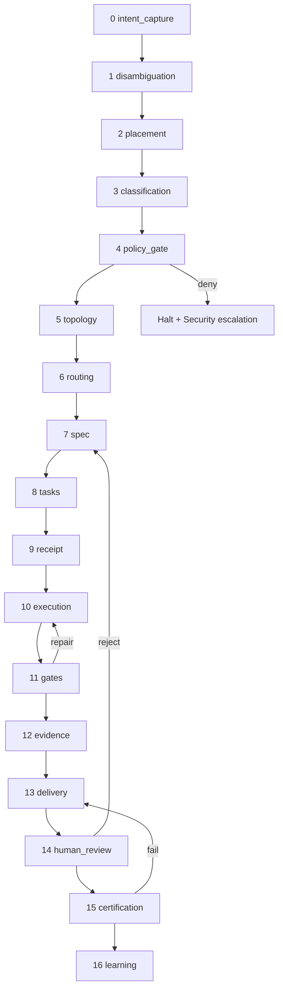

# Atlas Agentic Engineering OS Runbook

## Resumo

Runbook operacional canonico que descreve as 17 fases que transformam uma intencao humana ambigua em entrega certificada governada pelo AAEOS. Define schemas de handoff entre fases, mapping para servicos PHP, gates, evidencia esperada e tres fluxos exemplo verificaveis (bug fix, Obra de uma semana, refactor enterprise).

## Papel no Atlas

A doc-mae `atlas-agentic-engineering-os.md` define o que e o AAEOS e qual sua autoridade. Os contratos `atlas-agentic-engineering-os-contracts.md` definem os 9 departamentos. **Este runbook define COMO o AAEOS opera**: a sequencia canonica de fases, os contratos de handoff entre fases e o mapping entre fase e servico runtime. Sem este doc, o AAEOS e teoria; com este doc, virou estado-maquina executavel.

## Onde Se Encaixa

```text
+------------------------------------+
| atlas-agentic-engineering-os       |  (autoridade)
+------------------------------------+
            |
            +--> atlas-agentic-engineering-os-contracts (departamentos)
            +--> atlas-agentic-engineering-os-runbook   (este doc, fases)
            +--> atlas-agentic-engineering-os-department-contract (schema universal)
            +--> atlas-multi-agent-unified-architecture (multi-agente)
            +--> atlas-mission-control-cockpit-spec     (cabine humana)
```

## Contratos

### 17 fases canonicas (ordem nao-negociavel)

| # | Fase | Responsavel canonico | Output principal |
|---|------|----------------------|------------------|
| 0 | `intent_capture` | Surface (Desktop/Mobile/CLI) | `engineering_goal.v1` |
| 1 | `intent_disambiguation` | Mission Foundation | `engineering_goal.disambiguated.v1` |
| 2 | `placement` | Atlas Place Feature | `placement_decision.v1` |
| 3 | `intent_classification` | Atlas AI Router | `intent_classification.v1` |
| 4 | `policy_gate` | Atlas Programming Governance | `policy_decision.v1` |
| 5 | `topology_selection` | AAWR + Atlas Decide | `topology_plan.v1` |
| 6 | `department_routing` | Company Runtime | `department_route.v1` |
| 7 | `spec_drafting` | Spec Operating System | `spec_pack.v1` |
| 8 | `task_decomposition` | Forge Work Splitter / Dev Slice Planner | `task_pack.v1` |
| 9 | `decision_receipt_signing` | Operator + Atlas | `decision_receipt.v2` |
| 10 | `execution` | Dev fast-path / Forge Continuum | `execution_log.v1` |
| 11 | `gate_evaluation` | 15 gates universais | `gate_report.v1` |
| 12 | `evidence_capture` | Evidence Certification Runtime | `evidence_pack.v1` |
| 13 | `delivery_pack_assembly` | Delivery Department | `delivery_pack.v1` |
| 14 | `human_review` | Operator (Mission Control) | `operator_decision_receipt.v1` |
| 15 | `certification` | Enterprise Certification Runtime | `certification.v1` |
| 16 | `learning_capture` | ACOS + Compounding | `learning_capsule.v1` |

### Schema canonico de handoff (atlas.aaeos.phase.v1)

Toda transicao entre fases produz e consome este envelope:

```text
{
  "schema": "atlas.aaeos.phase.v1",
  "intent_id": "<uuid>",
  "phase_in": "<phase_name>",
  "phase_out": "<phase_name>",
  "actor": {"kind": "agent|operator|system", "id": "<id>", "provider": "<provider_id_or_null>"},
  "inputs": { "<key>": "<value_or_hash>" },
  "outputs": { "<key>": "<value_or_hash>" },
  "evidence_hashes": ["sha256:..."],
  "gates": {"required": ["..."], "passed": ["..."], "blocked": ["..."]},
  "blockers": [{"id": "...", "severity": "low|medium|high", "owner": "..."}],
  "operator_signature": "<sig_or_null>",
  "started_at": "<iso8601>",
  "ended_at": "<iso8601_or_null>",
  "next_phase": "<phase_name>",
  "skip_reason": "<receipt_id_if_skipped>"
}
```

### Gates por fase (resumo)

| Fase | Gate obrigatorio | Bloqueio se faltar |
|------|------------------|--------------------|
| 1 disambiguation | `intent_clarity_score` >= 0.8 | volta a 0 com perguntas |
| 2 placement | `placement_decision.feature_path` valido | volta a 1 |
| 3 classification | `intent_classification.target_department` declarado | volta a 1 |
| 4 policy | `policy_decision.allowed=true` | escalada Security |
| 5 topology | `topology_plan.providers` >= 1 disponivel | fallback Provider Topology |
| 6 routing | `department_route.owner` confirmado | volta a 3 |
| 7 spec | `spec_pack.acceptance_criteria` >= 3 | volta a 6 |
| 8 tasks | `task_pack.atomic` true para cada task | volta a 7 |
| 9 receipt | `decision_receipt.v2` assinado | bloqueia 10 |
| 10 execution | `execution_log` watchdog ok | repair loop |
| 11 gates | 15 gates universais verdes ou exception | repair loop |
| 12 evidence | `evidence_pack.completeness` >= 0.95 | volta a 11 |
| 13 delivery | `delivery_pack.hash` assinado | volta a 12 |
| 14 human review | `operator_decision_receipt` aprovado | volta a fase indicada |
| 15 cert | `certification.severity` <= aceitavel | volta a 13 |
| 16 learning | `learning_capsule` registrado em ACOS | warning, nao bloqueia |

## Fluxo

### Diagrama canonico das 17 fases



### Mapping fase-para-servico (canonico)

| Fase | Servico canonico (atual ou esperado) | Status |
|------|--------------------------------------|--------|
| 0 | `App\\Services\\Ai\\Surfaces\\*` | parcial: Desktop ok, Mobile parcial |
| 1 | `AtlasMissionFoundationService` | existe, integracao HTTP pendente (T1.4) |
| 2 | `AtlasPlaceFeatureService` | existe |
| 3 | `AtlasAiRouterService` | existe, nao chamado pelo HTTP path |
| 4 | `AtlasProgrammingGovernanceService` | existe |
| 5 | `AtlasAgenticWorkcellRuntime` + `AtlasDecideOrchestrator` | existem, integracao incompleta |
| 6 | `AtlasRealEngineeringCompanyRuntimeService` | existe |
| 7 | `AtlasSpecOperatingSystemService` | existe |
| 8 | `AtlasForgeWorkSplitter` ou `AtlasDevSlicePlanner` | existem |
| 9 | `AtlasDecisionReceiptService` | existe |
| 10 | `AtlasDevRuntimeService` ou `AtlasForgeContinuumService` | existem |
| 11 | `AtlasUniversalGatesEvaluator` | parcial, gates dispersos |
| 12 | `AtlasEvidenceCertificationRuntimeService` | existe |
| 13 | `AtlasDeliveryPackAssemblyService` | parcial |
| 14 | `AtlasMissionControlCockpitService` | nao existe (T1.5) |
| 15 | `AtlasEnterpriseCertificationService` | existe |
| 16 | `AtlasCompoundingEngineeringIntelligenceService` | existe |

Servicos marcados parcial ou nao existe sao blockers explicitos rastreados em `atlas-aaeos-department-maturity-matrix.md` (T2.3).

## Fluxos Exemplo

### Exemplo A: Bug fix curto (`"corrige timezone do export Excel"`)

```text
P0  Surface captura intent.
P1  Mission Foundation reduz ambiguidade: detecta export, timezone, escopo limitado.
P2  Place Feature -> caminho candidate: app/Services/Reports/ExcelExporter.php.
P3  Classification: target_department=Dev, risk=low, scope=R1, autonomy=L2.
P4  Policy: allowed=true, no security path touched.
P5  Topology: single_provider Claude Code, no parallel.
P6  Routing: Dev fast-path A1.
P7  Spec: 1 acceptance criterion (timezone correto em 3 locais), 0 surfaces extras.
P8  Tasks: 1 task atomica.
P9  Receipt v2 auto-assinado (autonomy L2 permite).
P10 Execution: Claude Code aplica fix em 1 arquivo.
P11 Gates: tests, lint, typecheck verdes.
P12 Evidence: diff hash, test output hash.
P13 Delivery: pack com 1 arquivo, 1 test ajustado.
P14 Operator review: aprovado em 30s no cockpit.
P15 Cert: low severity, sem rollback necessario.
P16 Learning: ACOS registra padrao timezone-export.
```

Tempo total esperado: ~3-7 minutos. Custo: 1 provider call.

### Exemplo B: Obra de uma semana (`"crie sistema de notificacoes multi-canal"`)

```text
P0  Surface captura intent.
P1  Mission Foundation pergunta: canais (email/sms/push/inapp)? volume? compliance?
    Operador responde: email + push + inapp, 100k/dia, LGPD.
P2  Place Feature -> novo dominio app/Services/Notifications/.
P3  Classification: target_department=Forge (multi-modulo), risk=medium, scope=R3, autonomy=L4.
P4  Policy: allowed mediante security review depois (LGPD touch).
P5  Topology: scout=Gemini, builder=Claude, reviewer=Codex, paralelismo=2 agentes.
P6  Routing: Forge Continuum + Architect Department para spec.
P7  Spec: 12 acceptance criteria, 4 surfaces (sender, queue, persistence, audit).
P8  Tasks: 18 tasks atomicas em 4 batches paralelos.
P9  Receipt v2 + operator signature obrigatoria (autonomy L4 + LGPD).
P10 Execution: 5 dias de Obra, 2 agentes paralelos via AAWR + Multi-Agent Scheduler.
P11 Gates: 15 universais + LGPD compliance + load test 100k.
P12 Evidence: 18 receipt hashes, 12 test reports, 1 load test report, 1 LGPD audit pack.
P13 Delivery: pack com 47 arquivos, 31 testes novos, migration, runbook.
P14 Operator review: 3 milestones aprovados ao longo da semana, final review 2h.
P15 Cert: medium severity, rollback plan validado, observability dashboards live.
P16 Learning: ACOS registra padroes (multi-channel orchestration, LGPD audit pack template).
```

Tempo total esperado: 5-8 dias. Custo: ~400 provider calls coordenadas.

### Exemplo C: Refactor enterprise multi-dominio (`"unifica auth e billing em modulo de identity"`)

```text
P0  Surface captura intent.
P1  Mission Foundation: escopo, breaking changes, downtime tolerado, prazo.
    Operador responde: zero downtime, 6 semanas, blue-green deploy.
P2  Place Feature -> reorganizacao app/Services/Auth + app/Services/Billing -> app/Services/Identity.
P3  Classification: target_department=Forge + Architect + Security + Review, risk=high, scope=R4, autonomy=L5.
P4  Policy: requires Architect Decision Receipt antes do Forge.
P5  Topology: AAWR debate-with-judge (3 architects + 1 judge) na fase de spec, depois swarm-review na execucao.
P6  Routing: Architect leads -> Forge executes -> Security gates -> Review enterprise cert.
P7  Spec: 47 acceptance criteria, breaking change matrix, migration plan, rollback per slice.
P8  Tasks: 89 tasks em 12 fatias com gates entre fatias.
P9  Receipt v2 + dual operator signature + Security signature.
P10 Execution: 6 semanas, 4 agentes paralelos, 1 architect agent permanente, durable reservation ledger.
P11 Gates: 15 universais + zero-downtime gate + breaking change gate + observability completeness.
P12 Evidence: 89 receipts, 200+ test reports, blue-green deploy logs, observability before/after.
P13 Delivery: pack com 234 arquivos, 18 migrations, 3 dashboards, 1 incident playbook.
P14 Operator review: 12 milestones, weekly cockpit reviews, final cert review 1 dia.
P15 Cert enterprise: high severity classe, full audit pack, replay determinístico testado.
P16 Learning: ACOS registra padrao identity-unification, breaking change playbook, blue-green template.
```

Tempo total esperado: 6-8 semanas. Custo: ~3000 provider calls coordenadas.

## Regras para IA

- Toda execucao de intent NOVA comeca em P0 e termina em P16.
- Skip de fase exige `decision_receipt.v2` com `skip_reason` declarado e operator signature.
- Cada handoff entre fases produz envelope `atlas.aaeos.phase.v1` com evidence_hashes.
- Antes de declarar fase concluida, validar `gates.passed` cobre `gates.required`.
- Repair loops (P11 -> P10, P14 -> P7, P15 -> P13) sao governados por receipts proprios.
- Dois ou mais agentes na mesma intent_id exigem coordenacao via Multi-Agent Unified Architecture (T1.3).
- Ne**nhum** servico runtime pode bypassar este runbook por atalho operacional sem registrar AP de excecao.

## Escopo de Implementacao

Mudancas neste doc afetam: Mission Foundation, AI Router, AAWR, Company Runtime, Atlas Decide, Dev, Forge, Spec OS, Evidence Certification Runtime, Mission Control Cockpit. Atualizacao demanda revisao cruzada com `atlas-aaeos-http-path-integration-spec.md` (T1.4) e `atlas-mission-control-cockpit-spec.md` (T1.5).

## Dependencias

Declaradas em frontmatter (`depends_on`). Resumo:

- `atlas-agentic-engineering-os` (autoridade-mae)
- `atlas-agentic-engineering-os-contracts` (departamentos)
- `atlas-ai-mission-foundation` (P1)
- `atlas-autonomous-software-company-runtime` (P6)
- `atlas-real-engineering-execution-kernel` (P10)
- `atlas-evidence-certification-runtime` (P12, P15)

## Evidencias

- Doc canonico: `docs/engineering-knowledge-base/atlas-agentic-engineering-os-runbook.md`
- Comandos esperados (next_actions): `php artisan atlas:aaeos:runbook --intent=<id> --json` e `php artisan atlas:aaeos:phase-handoff --intent=<id> --from=<n> --to=<m> --json`
- Hashes de fixture esperados em `tests/Fixtures/Aaeos/runbook-flow-A.json`, `runbook-flow-B.json`, `runbook-flow-C.json`

## Riscos

- **Drift mapping fase-para-servico**: codigo evolui, doc nao acompanha. Mitigacao: gate `phase-to-service-mapping-complete` no docs-health v2 (T5.2).
- **Skip silencioso de fase**: agente atalha sem receipt. Mitigacao: telemetria `aaeos_phase_skipped_count` por intent_id; alerta operacional se > 0 sem receipt.
- **Gate evaluation parcial**: 15 gates dispersos hoje. Mitigacao: T2.3 maturity matrix + futura consolidacao em `AtlasUniversalGatesEvaluator`.
- **Handoff sem schema**: agente passa dados livres entre fases. Mitigacao: validador de envelope `atlas.aaeos.phase.v1` em cada transicao.

## O que este doc NAO e

- Nao e a doc-mae do AAEOS; isso pertence a `atlas-agentic-engineering-os.md`.
- Nao e o contrato de departamento; isso pertence a `atlas-agentic-engineering-os-department-contract.md` (T1.2).
- Nao e o spec do HTTP path; isso pertence a `atlas-aaeos-http-path-integration-spec.md` (T1.4).
- Nao e o spec da cabine humana; isso pertence a `atlas-mission-control-cockpit-spec.md` (T1.5).
- Nao executa codigo sozinho; e contrato declarativo das fases.

## Exemplos

Os tres fluxos exemplo (A, B, C) acima sao fixtures vivas. Quando criados em `tests/Fixtures/Aaeos/`, viram base de regressao para qualquer mudanca futura no runbook.

## Proximas Acoes

1. Implementar `AaeosPhaseHandoffService` que emite e valida envelope `atlas.aaeos.phase.v1`.
2. Implementar comando `atlas:aaeos:runbook --intent=<id> --json` que retorna fase atual, evidencia, blockers, proxima fase esperada.
3. Implementar comando `atlas:aaeos:phase-skip --intent=<id> --phase=<n> --receipt=<id> --json` para skip governado.
4. Criar fixtures `runbook-flow-A.json`, `runbook-flow-B.json`, `runbook-flow-C.json` em `tests/Fixtures/Aaeos/`.
5. Adicionar `aaeos-runbook` no docs-health v2 como dependency obrigatoria de `atlas-agentic-engineering-os`.
