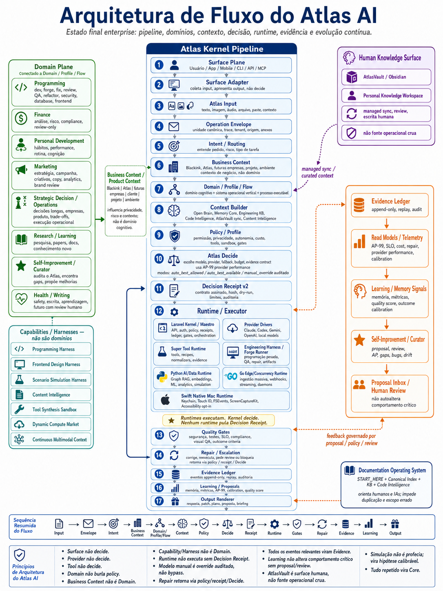
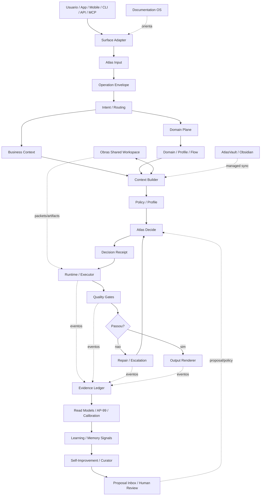

# Atlas AI Flow Visual Map

Este documento governa a imagem "Arquitetura de Fluxo do Atlas" para humano e
IA entenderem o mesmo fluxo antes de implementar.

## Asset Canonico

Imagem aprovada: `assets/fluxoatlasaiv3.png`.


Essa imagem representa o estado final enterprise do Atlas AI, nao apenas o
estado atual da implementacao. Se houver conflito entre imagem e texto, este
documento + `atlas-ai-pipeline.md` vencem.

## Fluxo Canonico V3

```text
Surface
-> Atlas Input
-> Operation Envelope Created
-> Intent / Routing
-> Business Context
-> Domain Plane
-> Domain Profile
-> Flow Profile
-> Context Builder
-> Policy / Profile
-> Atlas Decide
-> Decision Receipt
-> Runtime / Executor
-> Quality Gates
-> Repair / Escalation
-> Evidence Ledger
-> Learning / Proposals
-> Output Renderer
```

## Caixas Principais

| Zona | Texto recomendado | Regra |
|---|---|---|
| Surface Plane | Usuario / App / Mobile / CLI / API / MCP | Surface coleta input e mostra output; nao decide |
| Atlas Input | texto, imagem, audio, arquivo, paste, contexto | Preserva origem e anexos |
| Operation Envelope | unidade canonica, trace, tenant, origem | Tudo relevante vira envelope |
| Intent / Routing | pedido, risco, tipo de tarefa | Classifica sem executar |
| Business Context | Blackink, Atlas, empresa, projeto | Contexto de negocio, nao dominio |
| Domain Plane | Programming, Finance, Personal Development, Self-Improvement | Capacidade cognitiva/operacional |
| Domain/Profile/Flow | dominio + sistema operacional vertical + processo | Resolve antes do Decide |
| Context Builder | Open Brain, Memory, KB, Code Intelligence, AtlasVault sync | Contexto com hash, budget e privacy |
| Obras Shared Workspace | contratos, packets, artifact bus, status, integracao | Escritorio compartilhado; nao decide nem substitui Forge |
| Policy / Profile | permissao, privacidade, autonomia, custo, gates | Regras concretas da chamada |
| Atlas Decide | modelo, provider, fallback, evidence contract | Compila decisao; nao executa |
| Decision Receipt | contrato assinado, dry-run, limites, auditoria | Autoriza runtime |
| Runtime / Executor | providers, harness, workers, tools | Executa dentro do receipt |
| Quality Gates | seguranca, testes, SLO, compliance | Decide se passou com evidence |
| Repair / Escalation | corrigir, reexecutar, pedir review, bloquear | Retorna via policy/receipt/Decide |
| Evidence / Learning | ledger, AP-99, read models, proposals | Aprendizado sem auto-mutacao critica |
| Output Renderer | resposta, patch, plano, proposta | Surface apresenta ao operador |

## Domain Plane

Desenhe como dominios ready/current:

```text
Programming; Finance; Personal Development; Self-Improvement
```

Desenhe como scaffold/future, com etiqueta diferente:

```text
Marketing; Research; Operations / Strategic Decision; Health; Writing / Learning
```

Nao desenhar como dominio:

```text
Blackink; MiroFish; Frontend; Swift; Python; Go; AtlasVault; Super Tool Runtime; Scenario Simulation
```

Eles sao business context, source material/capability, specialist profile,
runtimes, human surface, tool runtime e harness.

## Runtime Plane

Divida `Runtime / Executor` em:

```text
Laravel Kernel / Maestro; Provider Drivers: Claude, Codex, Gemini, OpenAI, local; Super Tool Runtime; Engineering Harness / Forge Runner; Python AI/Data Runtime; Go Edge/Concurrency Runtime; Swift Native Mac Runtime
```

Regra: Python, Go e Swift executam capacidades especializadas; nao decidem
domain, modelo, policy, gate, repair ou learning.

## Capability / Harness Shelf

Se houver espaco, adicione prateleira abaixo de Runtime:

```text
Programming Harness
Frontend Design Harness
Scenario Simulation Harness
Content Intelligence
Tool Synthesis Sandbox
Dynamic Compute Market
```

Use status visual: `active`, `scaffold` ou `future`.

## Obras Shared Workspace

Para trabalho longo, pesado ou multi-provider, adicione uma caixa lateral:

```text
Obras Shared Workspace
contracts, packets, artifact bus, status, integration
```

Esse e o nome canonico do escritorio compartilhado. Em Programming, sua
especializacao e `Forge Workspace`. Ele alimenta Context Builder e Runtime com
artefatos governados, mas Kernel/Decide continuam sendo autoridade.

Quando o diagrama representar programacao pesada, use
`atlas-programming-forge-flow.md` como mapa da hierarquia completa. Forge
Workspace e o ambiente; nao e o fluxo inteiro nem o executor.

## Evidence And Learning

Lado direito laranja:

```text
Evidence Ledger
append-only, replay, audit
        |
Read Models / Telemetry
AP-99, SLO, cost, repair, provider performance, calibration
        |
Learning / Memory Signals
memoria, metricas, quality score, outcome calibration
        |
Self-Improvement / Curator
proposal, review, AP, gaps, bugs, drift
        |
Proposal Inbox / Human Review
nao autoaltera comportamento critico
```

Outcome calibration deve aparecer quando houver simulacao, marketing, produto,
programacao em producao ou decisao com resultado real.

## Human Knowledge Surface

Lado direito superior:

```text
Human Knowledge Surface
AtlasVault / Obsidian
Personal Knowledge Workspace
managed sync, review, escrita humana
nao fonte operacional crua
```

AtlasVault pode alimentar Context Builder por adapter governado e pode receber
notas gerenciadas. Eventos relevantes continuam indo para Evidence Ledger.

## Documentation OS

Inclua caixa pequena de governanca:

```text
Documentation Operating System
START_HERE + Canonical Index + KB + Code Intelligence
```

Ela orienta humanos/IAs; nao e etapa obrigatoria de toda request.

## Mermaid Canonico



## Principios De Rodape

1. Surface nao decide.
2. Provider nao decide.
3. Tool nao decide.
4. Domain nao burla policy.
5. Business Context nao e Domain.
6. Capability/Harness nao e Domain.
7. Runtime nao executa sem Decision Receipt.
8. Modelo manual e override auditado, nao bypass.
9. Repair retorna via policy/receipt/Decide.
10. Todos os eventos relevantes viram Evidence.
11. Learning nao altera comportamento critico sem proposal/review.
12. AtlasVault e surface humana, nao fonte operacional crua.
13. Simulacao nao e profecia; vira hipotese calibravel.
14. Tudo repetido vira Core.

## Checklist Da Imagem V3

1. Atlas Decide vem depois de Context Builder e Policy/Profile.
2. Business Context fica fora do Domain Plane; Domain/Profile/Flow e obrigatorio.
3. Runtime separa Laravel/Python/Go/Swift, providers e Forge sem tornar harness em dominio.
4. Evidence mostra AP-99, read models, calibration, learning e human review.
5. AtlasVault e Human Knowledge Surface; Documentation OS orienta; Obras Shared Workspace aparece como escritorio compartilhado quando ha trabalho longo ou multi-provider.

## Resumo

Especificacao canonica para diagramas visuais do fluxo Atlas AI, alinhando pipeline, dominios, business contexts, runtime, evidence, AtlasVault e learning.

## Papel no Atlas

Define a responsabilidade desta peca dentro da arquitetura Atlas.

## Onde Se Encaixa

Relaciona esta peca com seu sistema, camada, fluxo ou modulo pai.

## Contratos

Declara invariantes, entradas, saidas, limites e obrigacoes relevantes.

## Fluxo

Descreve o caminho operacional ou a sequencia de uso quando aplicavel.

## Regras para IA

Agentes devem respeitar escopo, evidencias, testes e proibicoes antes de alterar codigo.

## Escopo de Implementacao

Mudancas devem permanecer nos caminhos e limites declarados no frontmatter.

## Dependencias

Dependencias canonicas vivem em frontmatter e no corpo deste documento.

## Evidencias

Evidencias aceitas incluem docs, comandos, testes, receipts, reports e paths verificaveis.

## Riscos

Riscos principais devem ser tratados antes de promover status, runtime ou claims de prontidao.

## Exemplos

Exemplos concretos devem ser adicionados quando reduzirem ambiguidade para humanos ou IAs.

## Proximas Acoes

Proximas acoes devem ser concretas, verificaveis e ligadas a gates de qualidade.
