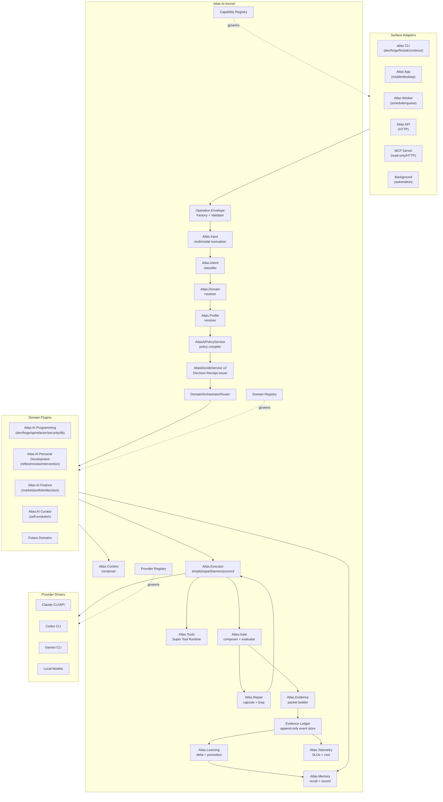
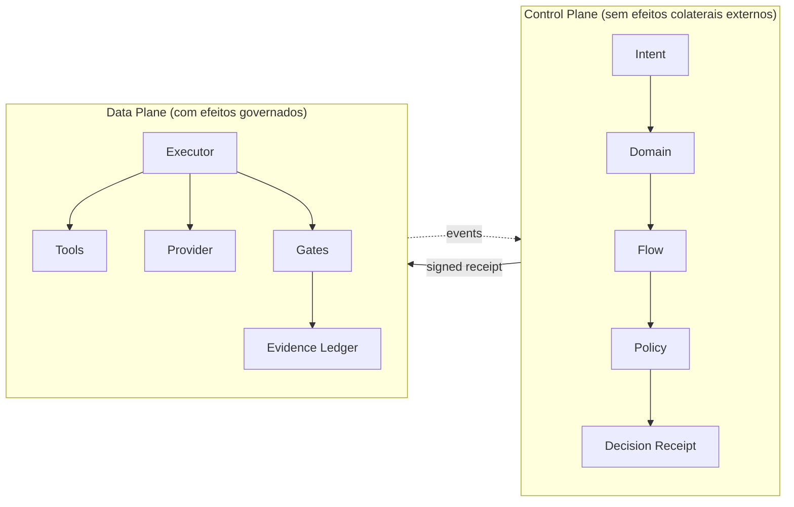
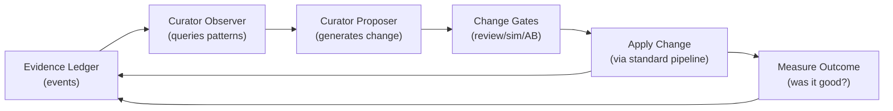

# Atlas AI Kernel Architecture - The Mother Specification

> Esta e a especificacao mae do Atlas AI. Documentos de topologia (`atlas-ai-vision.md`, `atlas-ai-pipeline.md`, `atlas-ai-core-vs-domain.md`, `atlas-ai-operating-system.md`, `atlas-ai-architecture-audit.md`, `atlas-ai-resolver-corpus-audit.md`) descrevem **o que existe e como flui**. Esta spec descreve **como o sistema opera fisicamente**: contratos tipados, maquinas de estado, eventos, SDKs, invariantes enforcados.
>
> Sem esta camada, Atlas AI vira documentacao prescritiva que ninguem garante. Com ela, doutrina vira lei de tipo.

## Sumario

- [0. Posicionamento](#0-posicionamento)
- [1. Axiomas](#1-axiomas)
- [2. Topologia Macro](#2-topologia-macro)
- [3. Control Plane vs Data Plane](#3-control-plane-vs-data-plane)
- [4. Operation Envelope](#4-operation-envelope)
- [5. Pipeline Como Funcoes Tipadas](#5-pipeline-como-funcoes-tipadas)
- [6. Maquinas De Estado](#6-maquinas-de-estado)
- [7. Decision Receipt v2](#7-decision-receipt-v2)
- [8. Evidence Ledger](#8-evidence-ledger)
- [9. Capability Registry Executavel](#9-capability-registry-executavel)
- [10. Domain Manifest E SDK](#10-domain-manifest-e-sdk)
- [11. Surface Adapter Contract](#11-surface-adapter-contract)
- [12. Provider Driver Contract](#12-provider-driver-contract)
- [13. Policy Engine Declarativo](#13-policy-engine-declarativo)
- [14. Memoria E Contexto Como Servicos Kernel](#14-memoria-e-contexto-como-servicos-kernel)
- [15. Tools Como Servico Kernel](#15-tools-como-servico-kernel)
- [16. Failure Domains](#16-failure-domains)
- [17. SLOs Operacionais](#17-slos-operacionais)
- [18. Cost Model](#18-cost-model)
- [19. Versionamento E Compatibilidade](#19-versionamento-e-compatibilidade)
- [20. Multi-Tenancy Foundation](#20-multi-tenancy-foundation)
- [21. Identidade E Continuidade](#21-identidade-e-continuidade)
- [22. Self-Evolution Loop](#22-self-evolution-loop)
- [23. Anti-Padroes Formais](#23-anti-padroes-formais)
- [24. Doutrina Como Teste Arquitetural](#24-doutrina-como-teste-arquitetural)
- [25. Roadmap De Implementacao](#25-roadmap-de-implementacao)
- [26. Definition Of Done Da Arquitetura](#26-definition-of-done-da-arquitetura)
- [27. Glossario Kernel](#27-glossario-kernel)

---

## 0. Posicionamento

A documentacao Atlas AI tem tres camadas:

```text
+------------------------------------------------------+
| Layer 3 - Domain Specs                               |
|   atlas-programming-architecture                     |
|   atlas-personal-development-domain (futuro)         |
|   atlas-finance-domain (futuro)                      |
|   atlas-curator-domain (futuro)                      |
+------------------------------------------------------+
| Layer 2 - Topology                                   |
|   atlas-ai-vision                                    |
|   atlas-ai-pipeline                                  |
|   atlas-ai-core-vs-domain                            |
|   atlas-ai-operating-system                          |
|   atlas-ai-architecture-audit                        |
|   atlas-ai-domain-profile-architecture (a promover)  |
+------------------------------------------------------+
| Layer 1 - Kernel (este documento)                    |
|   atlas-ai-kernel-architecture                       |
+------------------------------------------------------+
| Layer 0 - Constitution                               |
|   atlas-ai-master-prompt (a promover)                |
|   atlas-ai-identity (a promover)                     |
|   atlas-glossary (a promover)                        |
|   atlas-ai-laws (a extrair de Documento_Mestre_v6)   |
+------------------------------------------------------+
```

Esta spec ocupa **Layer 1**. Ela e mais profunda que topologia (que diz "X chama Y") e mais especifica que constituicao (que diz "Atlas AI e core cognitivo persistente"). Ela define **como o sistema realmente funciona em termos enforcaveis por compilador e teste**.

### Quem deve ler

- IA ou humano implementando qualquer fluxo Atlas AI
- IA ou humano adicionando dominio, surface ou provider novo
- IA ou humano alterando policy, decide, orchestrator, harness, runtime ou ledger
- IA ou humano respondendo "isso e duplicacao?" ou "isso pode ser feito em uma surface so?"

### Como ler

Em ordem. Cada secao depende das anteriores. Pulando, voce perde semantica.

---

## 1. Axiomas

A arquitetura mae obedece dez axiomas. Eles sao **invariantes de tipo**, nao slogans.

### Ax-1. Toda requisicao e uma Operation Envelope tipada e imutavel por estagio

Nenhum codigo Atlas AI pode tocar provider, tool, memory ou state sem antes estar dentro de uma `OperationEnvelope`. Surfaces criam o envelope. Estagios consomem e enriquecem campos especificos. Nenhum estagio pode reescrever campos de outro estagio.

**Implicacao**: comando CLI nao decide provider. Settings nao monta context. App nao escolhe orchestrator. Cada estagio escreve apenas seu slot.

### Ax-2. Toda decisao relevante emite Decision Receipt assinado e chainavel

Sem receipt, decisao nao existe. Receipt e hash determinista de inputs + outputs. Receipt referencia receipt anterior na mesma cadeia operacional. Receipt e replayavel: preview = mesmo codigo com `dry_run=true`.

**Implicacao**: nao existe "Atlas Decide foi pulado". Se nao tem receipt, foi bypass — bug.

### Ax-3. Evidence Ledger e fonte de verdade; tabelas sao projecoes

Toda mudanca de estado emite event para o Evidence Ledger. Tabelas operacionais (`ai_traces`, `atlas_engineering_runs`, `atlas_tool_runs`, `atlas_memory_entry_usages`) sao projecoes derivaveis do ledger. Ledger e append-only.

**Implicacao**: replay completo a partir do ledger e possivel. Auditoria nunca depende de log de aplicacao.

### Ax-4. Capacidades horizontais sao artefatos executaveis, nao prosa

Toda capability declarada como horizontal tem `CapabilityManifest` registrado. Surfaces que devem suporta-la passam por `CapabilityComplianceTest`. Falha de compliance e falha de merge.

**Implicacao**: paste-image so em `atlas ask` deixa de ser possivel. Test arquitetural acusa antes do PR mergir.

### Ax-5. Dominio e plugin via Domain Manifest declarativo

Adicionar um dominio (Programming, Personal Dev, Finance, Curator) e adicionar arquivo de manifesto + classes que implementam `DomainOrchestrator`. Sem hardcode no kernel.

**Implicacao**: o kernel nao sabe sobre Programming. Programming e o dominio que mais usa o kernel.

### Ax-6. Provider e driver substituivel; identidade Atlas AI e invariante

`ProviderDriver` e contrato. Claude, Codex, Gemini, GPT, local sao implementacoes. Trocar provider nao muda comportamento Atlas AI; muda apenas o motor.

**Implicacao**: prompt fragments de identidade (`atlas-ai-master-prompt.md`) sao injetados pelo kernel, nao pelo provider. Provider que ignora identidade falha em compliance.

### Ax-7. Politica e declarativa, resolvida por camadas

`AtlasAiPolicyService` resolve `EffectivePolicy` mergeando: global runtime settings < domain profile < flow profile < surface policy < session override. Policy V2 receipt expoe origem de cada campo.

**Implicacao**: nenhum lugar do codigo tem `if (provider === 'codex') ... else ...`. Tudo decide via `policy.allowed_providers`.

### Ax-8. Falha e taxonomia fechada com handler nomeado

`FailureDomain` e enum. Cada valor tem `FailureHandler`. Falha sem handler nao compila.

**Implicacao**: "deu erro" deixa de existir. Erro sempre tem nome, classificacao e proxima acao.

### Ax-9. SLOs sao parte da spec; sem medida, doutrina e aspiracional

Cada estagio kernel tem latency target, success rate target e cost target. Telemetry mede continuamente. SLO violation alerta.

**Implicacao**: dizer "context pack pequeno" sem medir e nao-cumprir-spec.

### Ax-10. Self-evolution opera dentro de gates; Curator nao bypassa kernel

Atlas AI Curator detecta lacunas e propoe mudancas. Mudancas passam por mesmo pipeline (gates, evidence, review). Curator nao escreve direto em capability registry, domain manifest ou policy.

**Implicacao**: o sistema melhora a si mesmo, mas nao se modifica fora dos contratos.

---

## 2. Topologia Macro



**Tres registries** governam o que pode existir:

- `CapabilityRegistry` — capacidades horizontais e quais surfaces devem suporta-las
- `DomainRegistry` — dominios instalados e seus manifests
- `ProviderRegistry` — provider drivers disponiveis

Sem registro, surface/domain/provider e ilegal e nao executa.

---

## 3. Control Plane vs Data Plane

Separacao critica que Codex nao formaliza:

| Plane | Responsabilidade | Estado |
|---|---|---|
| **Control Plane** | classifica, decide, compila policy, escolhe executor, monta receipt | sem mutacao de mundo |
| **Data Plane** | executa, chama provider, roda tool, escreve arquivo, emite evidence | mutacao governada |



**Regra dura**: Data Plane recusa execucao se nao receber Decision Receipt valido (assinado, nao expirado, dentro do budget).

**Beneficios**:

- Preview = Control Plane com `dry_run=true`. Mesmo codigo, sem Data Plane.
- Replay = re-emitir eventos do Data Plane a partir do mesmo Decision Receipt.
- Multi-region = Control Plane local, Data Plane pode estar em sandbox/Docker/remoto.
- Testes = Control Plane testavel sem stub de provider.

---

## 4. Operation Envelope

Unidade canonica que flui pelo kernel.

### 4.1 Schema

```php
final class OperationEnvelope
{
    public string $envelope_id;          // ULID
    public ?string $parent_envelope_id;  // chain
    public string $schema_version;       // "atlas.envelope.v1"
    public OperatorContext $operator;
    public Provenance $origin;
    public Input $input;
    public Routing $routing;             // populated progressively
    public ?DecisionReceipt $decision;   // populated by Decide
    public Execution $execution;         // populated by Executor
    public ?Output $output;              // populated at finish
    public Audit $audit;
}

final class OperatorContext
{
    public string $operator_id;          // even if single-user, present
    public string $tenant_id;            // multi-tenancy ready
    public WorkspacePath $workspace;
    public array $preferences;
    public PrivacyClass $default_privacy;
}

final class Provenance
{
    public string $surface_id;           // "atlas_cli", "atlas_app", ...
    public string $surface_version;
    public string $session_id;
    public DateTimeImmutable $received_at;
    public ?string $upstream_envelope_id;
}

final class Input
{
    public InputContent $primary;        // text|audio|image|file|struct
    public Attachment[] $attachments;
    public OperatorHints $hints;         // optional explicit overrides
    public Locale $locale;
    public string $input_hash;           // determinism
}

final class Routing
{
    public ?IntentClassification $intent;
    public ?DomainId $domain;
    public ?FlowId $flow;
    public ?EffectiveProfile $profile;
}

final class Execution
{
    public ?ExecutorKind $executor_kind;
    public ?RuntimeGraph $runtime_graph;
    public ?DateTimeImmutable $started_at;
    public ?DateTimeImmutable $finished_at;
    public ExecutionStatus $status;
}

final class Output
{
    public OperationStatus $status;       // succeeded|partial|blocked|failed|needs_review
    public OperationResult $result;
    public EvidencePacket $evidence;
    public CostSummary $cost;
}

final class Audit
{
    public string $trace_id;
    public ?string $parent_trace_id;
    public string $chain_hash;            // chains envelope to ancestors
}
```

### 4.2 Invariantes

- `envelope_id` e ULID (lexicograficamente ordenavel, ~unique).
- `schema_version` muda apenas com migracao aditiva ou deprecation cycle de 6 meses.
- Apos `decision` ser assinada, ninguem pode altera-la — apenas adicionar nova decisao em `parent_envelope_id` filho.
- `chain_hash = sha256(parent_chain_hash || envelope_canonical_serialization)`.
- `operator.operator_id` e obrigatorio mesmo quando ha um operador unico.

### 4.3 Imutabilidade Por Estagio

Cada estagio recebe `OperationEnvelope`, le seus campos e devolve mutacao **apenas no slot proprio**. Mutacoes externas ao slot sao ilegais.

```php
interface KernelStage
{
    public function stage(): StageId;
    public function reads(): array;       // which slots it reads
    public function writes(): array;      // which slots it may write
    public function execute(OperationEnvelope $env, mixed $stageInput): mixed;
}
```

Compliance test:

```php
test("each stage writes only to its declared slots", function () {
    foreach (Kernel::stages() as $stage) {
        $allowed = $stage->writes();
        $actual  = StageMutationProbe::run($stage);
        expect($actual)->subsetOf($allowed);
    }
});
```

---

## 5. Pipeline Como Funcoes Tipadas

A pipeline nao e prosa. E composicao tipada.

### 5.1 Tipos Base

```php
interface KernelStage<In, Out>
{
    public function execute(OperationEnvelope $env, In $input): Out;
}

type IntentClassifier      = KernelStage<InputContent,            IntentClassification>;
type DomainResolver        = KernelStage<IntentClassification,    DomainId>;
type FlowResolver          = KernelStage<DomainId+IntentSignals,  FlowId>;
type ProfileResolver       = KernelStage<FlowId,                  EffectiveProfile>;
type PolicyCompiler        = KernelStage<EffectiveProfile,        Policy>;
type ContextComposer       = KernelStage<Policy+DomainHints,      ContextPack>;
type Decide                = KernelStage<Policy+ContextPack,      DecisionReceipt>;
type OrchestratorRouter    = KernelStage<DecisionReceipt,         DomainOrchestrator>;
type Orchestrator          = KernelStage<Envelope+Receipt,        ExecutionResult>;
type GateRunner            = KernelStage<ExecutionResult,         GateResult>;
type RepairLoop            = KernelStage<GateResult,              ExecutionResult|Escalation>;
type EvidencePacker        = KernelStage<ExecutionResult+Gates,   EvidencePacket>;
type LearningProposer      = KernelStage<EvidencePacket,          MemoryDelta[]>;
```

### 5.2 Composicao

```php
final class AtlasAiKernel
{
    public function run(InputContent $input, Provenance $origin): OperationEnvelope
    {
        $env = $this->envelopeFactory->create($input, $origin);

        // Control Plane (sem efeito colateral externo)
        $env->routing->intent   = $this->intentClassifier->execute($env, $env->input->primary);
        $env->routing->domain   = $this->domainResolver->execute($env, $env->routing->intent);
        $env->routing->flow     = $this->flowResolver->execute($env, $env->routing->domain);
        $env->routing->profile  = $this->profileResolver->execute($env, $env->routing->flow);
        $policy                 = $this->policyCompiler->execute($env, $env->routing->profile);
        $context                = $this->contextComposer->execute($env, $policy);
        $env->decision          = $this->decide->execute($env, [$policy, $context]);

        // Data Plane (com efeito governado)
        $orchestrator  = $this->router->execute($env, $env->decision);
        $execResult    = $orchestrator->execute($env, $env->decision);
        $gateResult    = $this->gateRunner->execute($env, $execResult);

        if ($gateResult->isRepairable() && $env->decision->permitsRepair()) {
            $execResult = $this->repairLoop->execute($env, $gateResult);
            $gateResult = $this->gateRunner->execute($env, $execResult);
        }

        $env->output = new Output(
            status:   $gateResult->finalStatus(),
            result:   $execResult->payload(),
            evidence: $this->evidencePacker->execute($env, [$execResult, $gateResult]),
            cost:     $this->costAggregator->aggregate($env),
        );

        $deltas = $this->learning->execute($env, $env->output->evidence);
        foreach ($deltas as $delta) {
            $this->memoryRegistry->propose($delta);
        }

        $this->ledger->seal($env);
        return $env;
    }
}
```

Observe:

- Cada estagio e injetavel — substituivel para teste.
- `dry_run=true` em `decision` faz Data Plane abortar antes de executar (preview).
- Composicao linear no caso simples; orquestradores complexos podem rodar grafo de execucao definido em `runtime_graph`.

---

## 6. Maquinas De Estado

Codex nao definiu maquina de estado. Sem ela, "task pronta" e ambiguo.

### 6.1 Operation State Machine

```text
RECEIVED
   |
   v
ROUTING --(domain unknown)--> NEEDS_CLARIFICATION
   |
   v
DECIDING --(policy violation)--> BLOCKED
   |
   v
EXECUTING --(provider failure)--> RETRYING
   |              |
   |              +--(repeated failure)--> FAILED
   v
GATING --(gate failed, repairable)--> REPAIRING
   |              |
   |              +--(gate failed, terminal)--> FAILED
   |              +--(gate failed, needs review)--> NEEDS_REVIEW
   v
EVIDENCE_SEALED
   |
   v
LEARNING_PROPOSED
   |
   v
COMPLETED
```

Cada transicao emite event. Eventos sao append-only no Evidence Ledger.

### 6.2 Decision Receipt State

```text
DRAFT --(seal)--> ISSUED --(consume)--> CONSUMED
                    |
                    +--(expire)--> EXPIRED
                    +--(revoke)--> REVOKED
```

Receipt `EXPIRED` ou `REVOKED` nao autoriza Data Plane.

### 6.3 Tool Run State

```text
PLANNED --(approve)--> APPROVED --(start)--> RUNNING
                                                |
                                                v
                                            COMPLETED
                                                |
                                                v
                                          NORMALIZED
                                                |
                                                v
                                       EVIDENCE_RECORDED
                                                |
                                                v
                                          GATE_EVALUATED
```

Cada estado tem timeout, retry policy e failure handler explicitos.

---

## 7. Decision Receipt v2

### 7.1 Schema

```php
final class DecisionReceipt
{
    public string $receipt_id;              // ULID
    public string $envelope_id;
    public DateTimeImmutable $decided_at;
    public DateTimeImmutable $expires_at;   // hard expiry
    public string $decision_engine;         // "atlas.decide.v2"
    public string $inputs_hash;             // sha256(canonicalize(policy, context, input_summary))

    public Resolution $resolution;
    public Authority $authority;
    public Selection $selection;
    public Budgets $budgets;
    public RequiredGate[] $required_gates;
    public RequiredEvidence[] $required_evidence;
    public Constraint[] $constraints;
    public ?DryRun $dry_run;

    public Signature $signature;
}

final class Resolution
{
    public DomainId $domain;
    public FlowId $flow;
    public string $profile_id;
    public string $profile_version;
}

final class Authority
{
    public string $policy_profile_id;
    public string $policy_version;
    public ?OverrideSpec $operator_override;
    public ?OverrideSpec $session_override;
    public string $merge_receipt_id;
}

final class Selection
{
    public ExecutorKind $executor_kind;     // simple|repair|harness|council
    public RuntimeGraph $runtime_graph;
    public array $provider_assignments;     // map<NodeId, ProviderAssignment>
    public ProviderAssignment[] $fallback_chain;
    public string $context_strategy;
}

final class Budgets
{
    public CostBudget $cost;
    public LatencyBudget $latency;
    public AutonomyLevel $autonomy;         // A0..A5
    public int $max_repair_iterations;
    public int $max_concurrent_tool_runs;
}

final class Signature
{
    public string $receipt_hash;            // sha256(canonical_serialize(receipt without signature))
    public ?string $parent_receipt_id;
    public string $chain_hash;              // sha256(parent_chain_hash || receipt_hash)
    public string $signed_by;               // "atlas-decide-engine@v2"
}
```

### 7.2 Invariantes

- `inputs_hash` determinista: mesmos inputs, mesmo hash.
- Mesma `receipt_hash` em duas decisoes para `inputs_hash` igual implica decisao determinista (boa propriedade para regressao).
- `expires_at` impede execucao com receipt velho. Default 30s para Data Plane sincrono, 24h para background.
- `dry_run=true` impede Data Plane mesmo com receipt valido — usado para preview.
- `chain_hash` permite verificar integridade de cadeia de decisoes (multi-step operations).

### 7.3 Replay E Preview

```text
preview(input)  = atlas_decide.run(input, dry_run=true)
replay(receipt) = atlas_decide.run_from_receipt(receipt) -> deve produzir receipt determinista identico
```

Replay de receipt antigo permite:

- Verificar se decisao mudaria com nova policy.
- Reproduzir bug a partir de receipt persistido.
- A/B testar mudancas de policy (run em shadow mode com nova policy, comparar receipts).

---

## 8. Evidence Ledger

### 8.1 Por Que Event Sourcing

Codex propoe evidence como packet final. Mas packet final e projecao. A fonte de verdade deve ser o stream de eventos que o produziu. Beneficios:

- **Replay completo** sem depender de tabelas operacionais
- **Audit perfeita** sem confiar em log de aplicacao
- **Compaction segura** de tabelas operacionais (sao projecoes derivaveis)
- **Self-evolution** opera sobre eventos, nao sobre estado mutavel
- **Time travel** para debug

### 8.2 Esquema De Evento

```php
final class LedgerEvent
{
    public string $event_id;                // ULID
    public string $envelope_id;
    public ?string $causation_id;           // event que causou este
    public string $correlation_id;          // grupo logico
    public DateTimeImmutable $occurred_at;
    public string $event_type;              // discriminated union tag
    public string $emitter_stage;
    public string $emitter_version;
    public array $payload;                  // schema by event_type
    public string $payload_hash;
    public string $tenant_id;
    public string $operator_id;
}
```

### 8.3 Event Types (enum fechado)

```php
enum LedgerEventType
{
    case ENVELOPE_CREATED;
    case INPUT_NORMALIZED;
    case INTENT_CLASSIFIED;
    case DOMAIN_RESOLVED;
    case FLOW_RESOLVED;
    case PROFILE_RESOLVED;
    case POLICY_COMPILED;
    case CONTEXT_COMPOSED;
    case CONTEXT_INJECTED;            // Open Brain
    case DECISION_DRAFTED;
    case DECISION_ISSUED;
    case DECISION_CONSUMED;
    case DECISION_EXPIRED;
    case ORCHESTRATOR_SELECTED;
    case EXECUTION_STARTED;
    case PROVIDER_CALLED;
    case PROVIDER_RETURNED;
    case PROVIDER_FALLBACK;
    case TOOL_PLANNED;
    case TOOL_APPROVED;
    case TOOL_INVOKED;
    case TOOL_RETURNED;
    case TOOL_NORMALIZED;
    case TOOL_EVIDENCE_RECORDED;
    case GATE_EVALUATED;
    case GATE_PASSED;
    case GATE_BLOCKED;
    case REPAIR_INITIATED;
    case REPAIR_COMPLETED;
    case ESCALATION_REQUESTED;
    case EVIDENCE_PACKED;
    case LEARNING_PROPOSED;
    case MEMORY_DELTA_ACCEPTED;
    case OPERATION_COMPLETED;
    case OPERATION_FAILED;
    case OPERATION_BLOCKED;
    case OPERATION_NEEDS_REVIEW;
}
```

Adicionar event type novo exige migration aditiva. Nunca remover sem deprecation cycle.

### 8.4 Storage E Projecoes

| Camada | Funcao |
|---|---|
| `atlas_ledger_events` | tabela append-only, particionada por tenant_id e mes |
| `atlas_ledger_snapshots` | snapshot periodico por envelope_id (replay rapido) |
| `ai_traces` | projecao para UI/CLI |
| `atlas_engineering_runs` | projecao para Programming domain |
| `atlas_tool_runs` | projecao para Tool Runtime |
| `atlas_memory_entry_usages` | projecao para Memory Audit |

Reconstruir projecao = reler eventos. Tabelas operacionais podem ser truncadas e regeneradas.

---

## 9. Capability Registry Executavel

A regra "capacidade horizontal vive uma vez, surfaces herdam" so vale se for **enforcada por teste**. Codex documenta o principio. Esta secao formaliza o mecanismo.

### 9.1 Capability Manifest

Um arquivo `capabilities/<id>.yaml` por capacidade:

```yaml
# capabilities/atlas.input.image_paste.yaml
schema_version: atlas.capability.v1
id: atlas.input.image_paste
version: 1.0.0
title: Multimodal image paste
description: Permite ao operador colar imagem do clipboard como input.
contract:
  input:
    type: ImageBlob
    formats: [png, jpeg, webp, heic]
    max_size_mb: 25
  output:
    type: NormalizedImageRef
    fields: [hash, mime, dimensions, storage_path]
  errors:
    - clipboard_empty
    - format_unsupported
    - size_exceeds_budget
required_surfaces:
  - atlas_cli
  - atlas_app
  - atlas_api
optional_surfaces:
  - atlas_worker
  - atlas_background
not_supported:
  - surface: atlas_mcp_readonly
    reason: MCP read-only HTTP nao expoe binary upload nesta fase
test_suite:
  - tests/Capability/ImagePasteCliTest.php
  - tests/Capability/ImagePasteAppTest.php
  - tests/Capability/ImagePasteApiTest.php
introduced_at: atlas-server@2026-05-04
owner: atlas.input
```

### 9.2 Compliance Test

Test arquitetural que **falha o build** se uma surface obrigatoria nao implementa uma capability obrigatoria:

```php
class CapabilityComplianceTest extends TestCase
{
    public function test_every_required_surface_implements_every_required_capability(): void
    {
        $registry = $this->app->make(CapabilityRegistry::class);
        $surfaces = $this->app->make(SurfaceRegistry::class);

        foreach ($registry->all() as $capability) {
            foreach ($capability->required_surfaces as $surface_id) {
                $surface = $surfaces->get($surface_id);

                $this->assertTrue(
                    $surface->implements($capability->id),
                    sprintf(
                        "Surface %s must implement capability %s. Add implementation or declare not_supported with reason.",
                        $surface_id,
                        $capability->id,
                    ),
                );
            }
        }
    }

    public function test_every_capability_has_test_suite(): void
    {
        foreach (CapabilityRegistry::all() as $capability) {
            $this->assertNotEmpty($capability->test_suite,
                "Capability {$capability->id} must declare test_suite.");

            foreach ($capability->test_suite as $test_path) {
                $this->assertFileExists(base_path($test_path),
                    "Capability {$capability->id} declares test {$test_path} that does not exist.");
            }
        }
    }
}
```

Resultado: o paste-image so em `atlas ask` deixa de ser possivel. Quem mergir `atlas dev` sem suporte a image paste, sem `not_supported.reason` valido, quebra o test arquitetural.

### 9.3 Capability Token

Em runtime, surface declara capabilities suportadas em handshake:

```php
final class CapabilityToken
{
    public string $surface_id;
    public string[] $supports;
    public string $signature;
}
```

Kernel valida: `Capability X requested but surface_id Y did not declare support`. Falha imediata, com mensagem acionavel.

---

## 10. Domain Manifest E SDK

Adicionar dominio (Personal Dev, Finance, Curator) deve ser **contrato declarativo**, nao alteracao do kernel.

### 10.1 Manifest

```yaml
# domains/personal_development.yaml
schema_version: atlas.domain.v1
id: personal_development
version: 0.1.0
title: Atlas AI Personal Development
description: Dominio de desenvolvimento pessoal, performance, comportamento e cognicao.

intent_classifiers:
  - class: PersonalDevelopment\HabitIntentClassifier
    matches: [habit, routine, foco, energia, sono, performance]
  - class: PersonalDevelopment\WeeklyReviewIntentClassifier
    matches: [revisao semanal, weekly review, retrospectiva]

flows:
  personal_development.reflect:
    title: Reflexao guiada
    orchestrator: PersonalDevelopment\ReflectOrchestrator
    runtime: PersonalDevelopment\PersonalDevelopmentRuntime
    autonomy_default: low
    background_allowed: false
    required_gates:
      - personal_development.privacy_gate
      - personal_development.medical_safety_gate
    evidence_schema_extensions:
      - cognitive_metrics
  personal_development.weekly_review:
    title: Revisao semanal estruturada
    orchestrator: PersonalDevelopment\WeeklyReviewOrchestrator
    runtime: PersonalDevelopment\PersonalDevelopmentRuntime
    autonomy_default: low
    background_allowed: false
    required_gates:
      - personal_development.privacy_gate
    evidence_schema_extensions:
      - decision_revisits
      - life_hypotheses
  personal_development.intervention:
    title: Plano de intervencao baseado em evidencia
    orchestrator: PersonalDevelopment\InterventionOrchestrator
    runtime: PersonalDevelopment\InterventionMeasurementHarness
    autonomy_default: A0           # observa, nao executa
    required_human_approval: true
    required_gates:
      - personal_development.privacy_gate
      - personal_development.medical_safety_gate
      - personal_development.intervention_n_of_1_gate

required_capabilities:
  - atlas.memory.recall
  - atlas.memory.private_classification
  - atlas.input.text
  - atlas.input.image_paste
  - atlas.context.composer

provided_capabilities:
  - personal_development.cognitive_metrics
  - personal_development.n_of_1_harness
  - personal_development.lifestyle_correlation_query

privacy:
  default_class: private
  classes_allowed: [private, sensitive]
  allowed_provider_classes: [provider_safe_only]
  forbidden_categories:
    - medical_diagnosis_claim
    - therapy_substitute_claim

memory_projection:
  scope: autobiographical
  retention: long
  redaction: aggressive

evidence_schema_extensions:
  cognitive_metrics:
    fields: [articulation, reasoning_depth, application_ratio, pattern_count, curation_rate]
    computed_by: PersonalDevelopment\CognitiveMetricsComputer
  decision_revisits:
    fields: [decision_id, original_at, revisit_due_at, revisit_status, learning]
  life_hypotheses:
    fields: [hypothesis, validation_period, metric, result, status]

slo_targets:
  intent_classification_p95_ms: 150
  decision_p95_ms: 300
  privacy_gate_p99_ms: 100

owner: personal_development
maintainer: vitor.epf
introduced_at: atlas-server@TBD
```

### 10.2 Domain SDK

Para implementar dominio, autor:

1. Cria o manifest acima.
2. Implementa `AtlasDomainOrchestrator` por orchestrator canonico:

```php
interface AtlasDomainOrchestrator
{
    public function orchestratorId(): string;
    public function supportedDomains(): array;
    public function supportedFlows(): array;
    public function maturity(): string; // implemented | scaffold | planned
}
```

3. Para dominios com runtime completo, implementa metodos especificos de
   planejamento/execucao no orchestrator concreto. Exemplo atual:
   `AtlasProgrammingOrchestrator::sessionPlan()`,
   `dispatchContract()`, `repairExecutionContract()` e
   `executeWithHarness()`.

4. Implementa gates novos como `Gate` plugavel:

```php
interface Gate
{
    public function id(): string;
    public function evaluate(OperationEnvelope $env, ExecutionResult $result): GateResult;
}
```

5. Registra em `domain_registry`:

```bash
atlas domain register --manifest=domains/personal_development.yaml
```

6. Roda compliance:

```bash
atlas ai architecture-validate
```

`validate` checa: manifest passa schema, todos orchestrators existem,
orchestrators implementam o SDK, cada flow ativo aponta para orchestrator que
declara suporte ao domain/flow, todos gates existem, capabilities listadas
estao no registry e evidence schema extensions sao validas.

Status implementado:

- `AtlasDomainOrchestrator` define o contrato minimo do SDK;
- `AtlasDomainOrchestratorRegistry` resolve nomes curtos de manifest para
  classes PHP reais e maturidade (`implemented`, `scaffold`, `planned`);
- `AtlasDomainManifestValidator` falha quando domain/flow aponta para
  orchestrator desconhecido, sem classe, sem interface ou sem suporte declarado;
- `AtlasProgrammingOrchestrator` e `AtlasSelfImprovementOrchestrator` estao
  marcados como `implemented`;
- General, Research, Finance, Personal Development, Marketing, Health,
  Learning, Writing, QA, Security, Operations e Background possuem scaffolds
  explicitos para que a divida seja visivel e testavel, nao texto solto.

### 10.3 Domain Registry Test

```php
public function test_every_registered_domain_passes_manifest_validation(): void
{
    foreach (DomainRegistry::all() as $domain) {
        $report = $this->validator->validate($domain->manifest);
        $this->assertTrue($report->valid, $report->errors());
    }
}

public function test_every_flow_has_orchestrator_class(): void
{
    foreach (DomainRegistry::flows() as $flow) {
        $definition = $orchestrators->get($flow->orchestrator);
        $this->assertNotNull($definition);
        $this->assertTrue(class_exists($definition['class']));
        $this->assertTrue(is_subclass_of($definition['class'], AtlasDomainOrchestrator::class));
        $this->assertContains($flow->id, app($definition['class'])->supportedFlows());
    }
}
```

---

## 11. Surface Adapter Contract

Surface (CLI, App, Worker, API, MCP, Background) e **plugin tambem**, governado por contrato.

### 11.1 Contrato

```php
interface SurfaceAdapter
{
    public function id(): SurfaceId;
    public function version(): string;

    /** Capabilities que esta surface declara suportar. */
    public function declaredCapabilities(): array;

    /** Cria envelope a partir de input bruto da surface. */
    public function buildEnvelope(SurfaceInput $input): OperationEnvelope;

    /** Renderiza output da operacao para a surface. */
    public function renderOutput(OperationEnvelope $env): SurfaceOutput;

    /** Hints opcionais (provider preference, override, etc.) — passados via envelope. */
    public function collectHints(): OperatorHints;

    /** Validacao pre-flight: surface tem ambiente para esta operacao? */
    public function preflight(OperationEnvelope $env): PreflightResult;
}
```

### 11.2 Proibicoes Formais

Surface NAO pode:

- chamar provider diretamente (precisa do executor do dominio)
- montar context pack proprio (precisa do `Atlas.Context`)
- escolher provider/modelo (e funcao do `AtlasDecide`)
- decidir gate (e funcao do `Gate`)
- ler/escrever Memory diretamente (precisa do `Atlas.Memory`)
- decidir repair (e funcao do `Atlas.Repair`)
- declarar `succeeded` sem evidence packet

Cada proibicao tem teste correspondente que escaneia codigo da surface por strings/imports proibidos.

### 11.3 Hints Vs Override Vs Bypass

| Mecanismo | Permitido | Como |
|---|---|---|
| **Hint** | Sim | Surface passa `OperatorHints` no envelope. Decide considera, nao obriga. |
| **Override** | Sim, com escopo | `--ai=codex --model=5.5` vira `session_override` no envelope. AtlasAiPolicyService merge respeitando precedencia. |
| **Bypass** | Nao | Surface ignorando policy/decide nao compila (test arquitetural). |

---

## 12. Provider Driver Contract

Provider (Claude, Codex, Gemini, GPT, local) e plugin governado.

### 12.1 Contrato

```php
interface ProviderDriver
{
    public function id(): ProviderId;
    public function version(): string;

    public function declaredModels(): array;          // ["claude-opus-4-7", "claude-sonnet-4-6"]
    public function declaredCapabilities(): array;    // ["text", "vision", "long_context", "tool_use"]
    public function declaredLimits(): ProviderLimits; // tokens, files, context, rate

    public function health(): ProviderHealth;

    /**
     * Executa request governado.
     * Receipt obriga model + provider; driver nao escolhe.
     * Identity prompt e injetado pelo kernel; driver nao reescreve.
     */
    public function execute(
        ProviderExecutionRequest $request,
        IdentityFragment $identity,
        DecisionReceipt $receipt,
    ): ProviderExecutionResult;
}
```

### 12.2 Identity Injection

Driver recebe `IdentityFragment` (texto Atlas AI canonico extraido de `atlas-ai-master-prompt.md`). Driver e obrigado a injeta-lo. Kernel verifica via `ProviderComplianceTest` que cada driver:

1. Inclui identity no prompt enviado ao motor.
2. Nao adultera identity.
3. Retorna `provider_safe` outputs (sem leak de internal IDs do driver).

### 12.3 Provider Health & Fallback

`ProviderRegistry` mantem health por driver. Decide consulta health antes de selecionar. Fallback e parte do receipt:

```php
final class ProviderAssignment
{
    public ProviderId $provider;
    public string $model;
    public ?ProviderId $fallback_provider;
    public ?string $fallback_model;
    public string $reason;
}
```

Fallback e **registrado** quando usado: `LedgerEventType::PROVIDER_FALLBACK` com motivo (`rate_limited`, `auth_expired`, `quota_exhausted`, `model_unavailable`, `health_degraded`).

---

## 13. Policy Engine Declarativo

`AtlasAiPolicyService` resolve `EffectivePolicy` por camadas. Codex menciona; aqui formalizo o algoritmo.

### 13.1 Camadas (precedencia decrescente)

1. **Hard kernel invariants** (nao podem ser sobrescritas)
2. **Tenant policy** (multi-tenancy ready)
3. **Operator preferences**
4. **Domain profile** (domain manifest defaults)
5. **Flow profile**
6. **Surface policy** (e.g. background tem policy mais conservadora que app interativo)
7. **Session override** (CLI flag, app temporary toggle)
8. **Operator hint** (suggestion, only respeitada se nao conflita com 1-7)

### 13.2 Algoritmo De Merge

```php
final class PolicyMerger
{
    public function merge(MergeInputs $inputs): EffectivePolicy
    {
        $base = HardKernelInvariants::baseline();
        $merge_receipt = MergeReceipt::start();

        foreach ($this->layersInOrder($inputs) as $layer) {
            $delta = $base->diffWith($layer->policy);
            foreach ($delta as $field => $candidate) {
                if (HardKernelInvariants::locks($field)) {
                    $merge_receipt->reject($field, $layer->id, 'locked_by_kernel');
                    continue;
                }
                if ($base->isSet($field) && $layer->precedence < $base->precedenceOf($field)) {
                    $merge_receipt->reject($field, $layer->id, 'lower_precedence');
                    continue;
                }
                $base->set($field, $candidate, $layer->id);
                $merge_receipt->accept($field, $layer->id);
            }
        }

        return new EffectivePolicy($base, $merge_receipt);
    }
}
```

### 13.3 Receipt Operacional

`EffectivePolicy` carrega `PolicyMergeReceipt` que diz, para cada campo, **qual camada definiu o valor final**. Isso aparece no audit log e no `policy_contracts` que ja existe na implementacao Programming.

### 13.4 Hard Kernel Invariants

```yaml
# kernel/invariants.yaml
- privacy_class.secret implies provider_safe = false  # always
- background autonomy <= A3 unless explicit human approval per run
- destructive tool requires approval unless tier in [T0, T1] AND read_only
- council provider list is intersection of allowed_providers across nodes
- operation expires_at - decided_at <= 30s for synchronous data plane
```

Invariants sao testaveis via `KernelInvariantTest` que tenta forjar policy violando-os e espera bloqueio.

---

## 14. Memoria E Contexto Como Servicos Kernel

Memory Core L1-L13 ja implementado. Aqui formalizo como servico kernel.

### 14.1 Atlas.Memory Contract

```php
interface AtlasMemory
{
    public function recall(RecallQuery $query): MemoryRecallResult;
    public function record(MemoryDeltaProposal $delta): MemoryRecordResult;
    public function project(ProjectionTarget $target): ProjectionResult;
    public function quality(WorkspaceContext $ctx): MemoryQualityReport;
    public function maintain(MaintainOptions $options): MaintainReport;
}
```

Usado por **todos os dominios** atraves do mesmo contrato. Personal Dev nao tem `PersonalMemory` separado; tem `MemoryProjection` para escopo `autobiographical`.

### 14.2 Atlas.Context Contract

```php
interface AtlasContext
{
    public function compose(ContextRequest $request): ContextPack;
    public function inject(OperationEnvelope $env, ContextPack $pack): InjectionReceipt;
}
```

`ContextPack` carrega:

- `task_summary`
- `memory_refs[]`
- `knowledge_refs[]`
- `code_refs[]`
- `tool_evidence_refs[]`
- `historical_traces[]`
- `attachments_refs[]`
- `budget_summary`
- `pack_hash`

Hash determinista permite dedupe e replay.

### 14.3 Open Brain Como Modo De Atlas.Context

Open Brain Context Injection ja existe. Formalmente, Open Brain e `AtlasContext::compose` com policy `auto`/`required`/`off` aplicada por surface/mode.

---

## 15. Tools Como Servico Kernel

Super Tool Runtime ja implementado em Fase 0. Aqui formalizo como **Atlas.Tools** core.

### 15.1 Atlas.Tools Contract

```php
interface AtlasTools
{
    public function plan(ToolPlanRequest $request): ToolPlan;
    public function execute(ToolPlan $plan, ApprovalContext $approval): ToolExecutionResult;
    public function evidence(EvidenceQuery $query): ToolEvidenceResult;
    public function gate(GateRequest $request): GateResult;
    public function release(ReleaseGateRequest $request): ReleaseGateResult;
}
```

Cada dominio que usa tools (Programming, Personal Dev measurement, Finance data scrapers) consome **a mesma instancia de Atlas.Tools**.

### 15.2 Tier T0-T3 Como Atributo De Plan

```php
final class ToolPlan
{
    public ToolId $tool;
    public RecipeId $recipe;
    public ExecutionTier $tier;       // T0..T3
    public SandboxMode $sandbox;
    public PrivacyLevel $privacy;
    public TaskType $task_type;
    public bool $requires_provider_safe;
}
```

Kernel rejeita execucao se `tier > policy.max_execution_tier` ou `sandbox < policy.required_sandbox`.

### 15.3 Authority Matrix Como Mecanismo Anti-Duplicacao De Findings

Implementado. Formalmente, `AtlasToolFindingCorrelationService` agrupa findings por `authority_group` e suprime duplicatas no gate, preservando-as no Evidence Store. Spec confirma.

---

## 16. Failure Domains

Codex tem prosa. Aqui formalizo como enum fechado com handler explicito.

```php
enum FailureDomain: string
{
    // Provider
    case PROVIDER_UNAVAILABLE         = 'provider_unavailable';
    case PROVIDER_RATE_LIMITED        = 'provider_rate_limited';
    case PROVIDER_AUTH_EXPIRED        = 'provider_auth_expired';
    case PROVIDER_QUOTA_EXHAUSTED     = 'provider_quota_exhausted';
    case PROVIDER_MODEL_UNAVAILABLE   = 'provider_model_unavailable';
    case PROVIDER_OUTPUT_UNSAFE       = 'provider_output_unsafe';

    // Policy
    case POLICY_VIOLATION             = 'policy_violation';
    case POLICY_BUDGET_EXCEEDED       = 'policy_budget_exceeded';
    case POLICY_AUTONOMY_INSUFFICIENT = 'policy_autonomy_insufficient';

    // Context
    case CONTEXT_BUDGET_EXCEEDED      = 'context_budget_exceeded';
    case CONTEXT_REQUIRED_MISSING     = 'context_required_missing';
    case CONTEXT_PRIVACY_BLOCKED      = 'context_privacy_blocked';

    // Tool
    case TOOL_NOT_INSTALLED           = 'tool_not_installed';
    case TOOL_REQUIRES_APPROVAL       = 'tool_requires_approval';
    case TOOL_TIER_OVER_BUDGET        = 'tool_tier_over_budget';
    case TOOL_SANDBOX_INSUFFICIENT    = 'tool_sandbox_insufficient';

    // Gate
    case GATE_FAILED_REPAIRABLE       = 'gate_failed_repairable';
    case GATE_FAILED_TERMINAL         = 'gate_failed_terminal';
    case GATE_NEEDS_REVIEW            = 'gate_needs_review';

    // Evidence
    case EVIDENCE_INCOMPLETE          = 'evidence_incomplete';
    case EVIDENCE_DRIFT_DETECTED      = 'evidence_drift_detected';

    // Domain
    case DOMAIN_NOT_REGISTERED        = 'domain_not_registered';
    case DOMAIN_FLOW_UNKNOWN           = 'domain_flow_unknown';
    case DOMAIN_GATE_MISSING          = 'domain_gate_missing';

    // Surface
    case SURFACE_CAPABILITY_MISSING   = 'surface_capability_missing';
    case SURFACE_PREFLIGHT_FAILED     = 'surface_preflight_failed';
}

interface FailureHandler
{
    public function handles(): array;     // FailureDomain[]
    public function handle(OperationEnvelope $env, FailureContext $ctx): HandlerOutcome;
}
```

Compliance test:

```php
public function test_every_failure_domain_has_at_least_one_handler(): void
{
    foreach (FailureDomain::cases() as $domain) {
        $handlers = $this->failureRegistry->handlersFor($domain);
        $this->assertNotEmpty($handlers,
            "FailureDomain::{$domain->name} has no registered handler. Add one or remove the case.");
    }
}
```

---

## 17. SLOs Operacionais

Sem medida, doutrina e aspiracional. Cada estagio kernel tem SLO publicado.

### 17.1 SLO Targets

| Estagio | p50 | p95 | p99 | Success Rate | Notes |
|---|---:|---:|---:|---:|---|
| envelope.create | 5ms | 15ms | 30ms | 99.9% | apenas validacao + ULID |
| input.normalize (text) | 5ms | 20ms | 50ms | 99.9% | |
| input.normalize (image) | 100ms | 400ms | 1000ms | 99.5% | hash, validate, store |
| intent.classify | 30ms | 150ms | 400ms | 99% | local rules; LLM exception |
| domain.resolve | 5ms | 20ms | 50ms | 99.9% | |
| flow.resolve | 5ms | 20ms | 50ms | 99.9% | |
| profile.resolve | 10ms | 30ms | 80ms | 99.9% | |
| policy.compile | 10ms | 50ms | 150ms | 99.9% | merge layers |
| context.compose (light) | 50ms | 200ms | 600ms | 99% | |
| context.compose (heavy) | 200ms | 1500ms | 5000ms | 98% | Open Brain + Engineering Pack |
| decide.issue | 30ms | 200ms | 500ms | 99.5% | |
| ledger.append | 5ms | 25ms | 50ms | 99.99% | hot path |
| gate.evaluate (T0/T1) | 100ms | 500ms | 2000ms | 99% | local tools |
| gate.evaluate (T2) | 5s | 60s | 5min | 95% | PR/review tools |

### 17.2 SLO Violation Handling

- Slack/email/inbox alerta quando p95 ultrapassa target por 10 minutos.
- SLO budget consumido > 50% no mes inicia review automatico (Curator).
- SLO budget esgotado pausa promocao de mudancas naquela area ate ser restaurado.

---

## 18. Cost Model

Codex nao trata custo como cidadao primario. Aqui sim.

### 18.1 Cost Object

```php
final class CostSummary
{
    public TokenCost $provider_tokens;
    public Money $provider_dollar_estimated;
    public Duration $compute_seconds;
    public ToolCost[] $tool_runs;
    public StorageCost $storage_writes;
    public AttentionCost $human_attention;     // intervention required count, time blocked
}
```

`Money` e tipo nominal (`USD` ou `BRL`) com 6 casas decimais.

### 18.2 Cost Budget

`DecisionReceipt.budgets.cost` define teto. Executor monitora cumulativo. Excesso aciona handler:

- `T0/T1`: degrada modelo (Sonnet -> Haiku) ou reduz contexto
- `T2`: pausa, pede aprovacao
- `Background`: bloqueia, escala para inbox

### 18.3 Cost Per Outcome

Telemetria publica:

```text
intervention_reduction = baseline_interventions_per_green / atlas_interventions_per_green
cost_per_green_case_usd
cost_per_green_case_brl
attention_minutes_per_green_case
```

Esses sao os indicadores para a meta 5x descrita em `atlas-cli-5x-claude-code-plan.md`.

---

## 19. Versionamento E Compatibilidade

### 19.1 Schema Versions

Cada contrato carrega `schema_version`:

- `atlas.envelope.v1`
- `atlas.decide.v2`
- `atlas.policy.v2`
- `atlas.capability.v1`
- `atlas.domain.v1`
- `atlas.surface.v1`
- `atlas.provider.v1`
- `atlas.ledger_event.v1`

Bump de versao:

- **Aditivo (campo opcional novo)**: bump minor (`v2.1.x`). Compatibilidade preservada.
- **Renomeio/remocao**: requer deprecation cycle de 6 meses, schema_version major bump (`v3.x.x`).
- **Mudanca semantica de campo**: tratar como remocao + adicao.

### 19.2 Deprecation Cycle

| Mes | Acao |
|---|---|
| 0 | Marca deprecated, log warning ao consumir |
| 0-3 | Documenta migracao, fornece adapter |
| 3-6 | Warning vira erro em ambiente nao-prod |
| 6 | Remove suporte; consumers obsoletos falham fechado |

### 19.3 Migration Aditiva De Schema De DB

Lei do projeto (ja em CLAUDE.md):

- `Schema::create` guarda com `if (! Schema::hasTable())`.
- `Schema::table` adicionando coluna guarda com `if (! Schema::hasColumn())`.
- `CREATE INDEX` usa `IF NOT EXISTS`.
- `ADD CONSTRAINT` checa `pg_constraint`.
- Migration nunca e carimbada manualmente.

---

## 20. Multi-Tenancy Foundation

Mesmo com Vitor unico operador hoje, kernel e desenhado para multi-tenant.

### 20.1 Tenant Em Todo Campo Auditavel

`OperationEnvelope.operator.tenant_id` e obrigatorio. Eventos no Ledger carregam `tenant_id`. Tabelas particionadas por tenant. Memory escope inclui `tenant`.

### 20.2 Tenant Policy

Cada tenant pode ter:

- Provider whitelist proprio
- Cost budget proprio
- Privacy class default proprio
- Domain enable/disable proprio

Hoje: `tenant_id = "vitor"` em tudo. Amanha: trivial adicionar segundo operador sem refactor.

### 20.3 Cross-Tenant Isolation

- Memory recall nunca cruza tenant.
- Evidence Ledger query exige `tenant_id`.
- MCP write tools escopam por tenant.
- Provider drivers podem isolar credenciais por tenant.

Architectural test: query sem `tenant_id` em tabelas particionadas falha.

---

## 21. Identidade E Continuidade

### 21.1 Identity Fragment

`atlas-ai-master-prompt.md` extrai-se em `IdentityFragment` injetado em todo provider call.

```php
final class IdentityFragment
{
    public string $version;
    public string $core;            // identity prompt fragment
    public string[] $invariants;    // rules every provider must obey
    public string $operator_brief;  // operator-specific brief (compact)
    public string $hash;
}
```

### 21.2 Continuity Across Surfaces

Operacao iniciada em CLI pode ser retomada em App via:

- `parent_envelope_id` chaining
- `Memory.session_state`
- `atlas continue` reusing context_pack_hash

Test de continuidade: operacao iniciada em surface A, retomada em B, evidence packet final referencia ambos os envelopes.

### 21.3 Provider Swap Mid-Operation

Permitido se policy permitir. Receipt registra `PROVIDER_FALLBACK` com motivo. Identity preservada via injection. Estado intermediario migra via Memory.

---

## 22. Self-Evolution Loop

Atlas AI Curator opera **dentro do mesmo kernel**.

### 22.1 Curator Como Domain

`atlas-curator-domain.md` (a criar) define:

- intents: `detect_duplication`, `propose_capability_promotion`, `audit_slo_drift`, etc.
- flows: `curator.continuous_audit`, `curator.proposal`, `curator.measurement`
- orchestrator: `CuratorOrchestrator`
- runtime: `CuratorRuntime`
- privacy: opera sobre Evidence Ledger e estado interno; nao toca dados de operador externamente

### 22.2 Loop



### 22.3 Mudancas Permitidas Por Curator

| Mudanca | Permitida automaticamente? |
|---|---|
| Promover memory delta `accepted` | Sim com confidence >= alta e gates |
| Atualizar threshold de tool authority policy | Sim em workspace; global exige operator |
| Propor flow profile | Nao; cria proposal + inbox |
| Promover capability de optional para required | Nao; cria proposal |
| Rotacionar default provider para flow X | Nao; cria proposal |
| Detectar e sinalizar SLO drift | Sim |
| Detectar surface sem capability obrigatoria | Sim, falha test arquitetural |
| Detectar decision drift | Sim, abre proposal |

Curator e o unico domain que pode propor mudancas em capability registry, domain registry, provider registry — mas todas passam por gates do mesmo kernel.

---

## 23. Anti-Padroes Formais

Cada anti-padrao tem teste arquitetural correspondente.

| ID | Anti-padrao | Teste |
|---|---|---|
| AP-1 | Surface chama provider direto | Static scan de import/use de `ProviderDriver` em pasta de surface |
| AP-2 | Surface monta context proprio | Static scan de `new ContextPack(...)` em surface |
| AP-3 | Comando decide provider | Static scan de selecao de provider em comandos sem ir via `AtlasDecide` |
| AP-4 | Capability presa a surface | `CapabilityComplianceTest` |
| AP-5 | Domain reimplementa Memory | Static scan de classes que mantem cache/store de memoria fora de `AtlasMemory` |
| AP-6 | Decision sem receipt | Test que verifica que toda chamada a provider drive vem com receipt valido |
| AP-7 | Policy hardcoded | Static scan de `if (provider === 'X')` em codigo fora de `ProviderRegistry` |
| AP-8 | Failure sem handler | `test_every_failure_domain_has_at_least_one_handler` |
| AP-9 | Schema break sem deprecation | Linter de schema diff em CI |
| AP-10 | Tabela como fonte de verdade em vez de Ledger | Code review checklist + lint sobre projecoes |
| AP-11 | Background com autonomia A4-A5 sem human approval | Policy invariant test |
| AP-12 | Provider driver ignora identity | `ProviderComplianceTest` |
| AP-13 | Receipt expirado consumido por Data Plane | Test de tempo |
| AP-14 | Tool T2/T3 em hot path | Tier policy test |
| AP-15 | Memory secret entrando em provider | Privacy invariant test |

Cada AP e merge-blocking. CI roda todos.

---

## 24. Doutrina Como Teste Arquitetural

A doutrina deste kernel **e codigo**. Reside em `tests/Architecture/`.

### 24.1 Estrutura

```text
tests/Architecture/
  KernelStageWritesTest.php
  CapabilityComplianceTest.php
  DomainManifestValidationTest.php
  SurfaceAdapterContractTest.php
  ProviderDriverContractTest.php
  PolicyInvariantTest.php
  FailureCoverageTest.php
  AntiPatternStaticScanTest.php
  SLOTargetsDeclaredTest.php
  EnvelopeImmutabilityTest.php
  DecisionReceiptDeterminismTest.php
  LedgerAppendOnlyTest.php
  TenantIsolationTest.php
  SchemaVersionDeprecationTest.php
  IdentityInjectionTest.php
```

### 24.2 Run

```bash
/opt/homebrew/bin/php artisan test --testsuite=Architecture
```

CI bloqueia merge se algum teste falhar.

### 24.3 Doutrina Exposta

```bash
atlas kernel doctrine --json
```

Retorna manifesto de invariantes, capabilities, domains, surfaces, providers e SLOs em vigor — para usar em proposal review do Curator.

---

## 25. Roadmap De Implementacao

Implementacao incremental, sem big-bang. Cada fase termina commitavel.

### Fase 0 — Promocao Documental (2-3 dias)

Fundamentos textuais ja implicitos no codigo, agora canonizados:

- Promover specs maio 2026 (`resolver-o-que-vale-a-pena/docs/specs/*`) para KB com aviso de redirect (ja parcialmente feito por Codex como referencias).
- Mover fisicamente os 4 specs P0 para `engineering-knowledge-base/`.
- Promover `Atlas_Gaps_Achamos_Nao_Esquecer.md` como fonte de Personal Dev domain.
- Rodar `atlas engineering knowledge sync --prune` + `index-code --prune`.

### Fase 1 — Operation Envelope Tipada (3-5 dias)

Substituir payloads ad-hoc por classe canonica:

- Criar `App\Kernel\Envelope\OperationEnvelope` e classes auxiliares.
- Adapter em surfaces existentes (`AiChatCommand`, `AtlasCliDevCommand`, `AtlasAiSheet`) para construir envelope.
- Manter compatibilidade com `AiTrace`/`AiJob` legados (envelope projeta para tabelas atuais).
- `tests/Architecture/EnvelopeImmutabilityTest`.

### Fase 2 — Decision Receipt v2 Determinista (3-5 dias)

- Refatorar `AtlasDecideService::operationalDecision()` para emitir `DecisionReceipt` typed.
- Adicionar hash determinista, expires_at, chain_hash.
- Implementar `dry_run=true` com identidade comportamental.
- `tests/Architecture/DecisionReceiptDeterminismTest`.

### Fase 3 — Evidence Ledger Append-Only (5-7 dias)

- Migration `atlas_ledger_events` (particionada por mes).
- Emitter em cada estagio kernel atual.
- Projecao de `ai_traces`, `atlas_engineering_runs`, `atlas_tool_runs` derivada do ledger via worker.
- `tests/Architecture/LedgerAppendOnlyTest`.
- Replay tool: `atlas ledger replay --envelope=<id>`.

### Fase 4 — Capability Registry Executavel (3-5 dias)

- `app/Kernel/Capability/CapabilityRegistry`.
- 5 capabilities iniciais com manifest: `atlas.input.text`, `atlas.input.image_paste`, `atlas.input.file_attachment`, `atlas.memory.recall`, `atlas.context.compose`.
- `CapabilityComplianceTest` no Architecture suite.
- Resolve a primeira regressao: paste-image em todas surfaces obrigatorias.

### Fase 5 — Domain Manifest E SDK (5-7 dias)

- Schema do manifest.
- `DomainRegistry` carregando manifests no boot.
- Programming domain como primeiro consumer (refactor de `AtlasProgrammingOrchestrator` para implementar `DomainOrchestrator`).
- Validador (`atlas domain validate <id>`).

### Fase 6 — Surface Adapter Contract (3-5 dias)

- Interfaces tipadas para CLI, App, Worker, API, MCP, Background.
- Surfaces existentes adaptadas.
- Static scan tests para AP-1, AP-2.

### Fase 7 — Provider Driver Contract (3-5 dias)

- `ProviderDriver` interface.
- Drivers existentes (Claude, Codex, Gemini) adaptados.
- Identity injection enforcement.
- `ProviderComplianceTest`.

### Fase 8 — Failure Domains E Handlers (3-5 dias)

- Enum `FailureDomain`.
- Handlers para cada caso.
- `FailureCoverageTest`.

### Fase 9 — SLO Telemetry (5-7 dias)

- Probe de latencia em cada estagio.
- Dashboard.
- Alertas.

### Fase 10 — Personal Dev / Finance / Curator Domains (n+ dias por dominio)

Cada um:

- Manifest.
- Orchestrator(s).
- Gates especificos.
- Memory projection.
- Test suite.

### Fase 11 — Multi-Tenancy Hardening (3-5 dias)

- `tenant_id` propagado.
- Test de isolation.
- Particionamento de tabelas.

### Fase 12 — Self-Evolution Curator (n+ dias)

- Curator domain.
- Continuous audit jobs.
- Proposal inbox.

---

## 26. Definition Of Done Da Arquitetura

A arquitetura mae esta em estado **production-grade kernel** quando:

1. Todos os 26 testes arquiteturais (esta spec lista 15+; mais virao com fases) passam em CI.
2. Toda surface declara capabilities suportadas via token; capability missing falha preflight.
3. Toda decisao real emite `DecisionReceipt` valido com hash + chain.
4. Evidence Ledger e fonte de verdade; tabelas projetadas reconstruivel.
5. Pelo menos 2 dominios (Programming + Personal Dev) implementam `DomainOrchestrator` via manifest.
6. Pelo menos 3 providers (Claude, Codex, Gemini) implementam `ProviderDriver`.
7. Failure domains tem handler para todos os 30+ casos.
8. SLOs publicados, medidos e dashboard ativo.
9. Cost model integrado a budget de receipt.
10. Multi-tenancy foundation propagada (mesmo com unico operador).
11. Curator domain audita ledger e gera proposals.
12. Doutrina executavel via `atlas kernel doctrine --json`.
13. Documentacao da spec mae sincronizada via `atlas engineering knowledge sync`.
14. Operator consegue dizer "atlas dev", "atlas finance review", "atlas reflect" e cada um passa pelo mesmo kernel sem que o operador note diferenca arquitetural.

---

## 27. Glossario Kernel

| Termo | Definicao |
|---|---|
| **Atlas AI Kernel** | Camada Layer 1 que materializa axiomas em codigo enforcado |
| **Operation Envelope** | Unidade canonica que flui pelo kernel; tipada, append-only |
| **Decision Receipt** | Contrato assinado emitido por `AtlasDecide`; autoriza Data Plane |
| **Evidence Ledger** | Event store append-only; fonte de verdade da execucao |
| **Capability** | Funcionalidade horizontal declarada e testada em compliance |
| **Domain Manifest** | Arquivo declarativo que registra um dominio Atlas AI |
| **Surface Adapter** | Plugin que conecta uma superficie de operador ao kernel |
| **Provider Driver** | Plugin que conecta um motor de IA externo ao kernel |
| **Effective Policy** | Resultado do merge de camadas de policy; resolvido por `AtlasAiPolicyService` |
| **Identity Fragment** | Fragmento de prompt canonico Atlas AI injetado em todo provider call |
| **Control Plane** | Estagios sem efeito colateral externo (intent, policy, decide) |
| **Data Plane** | Estagios com efeito governado (executor, tools, provider, gates) |
| **Failure Domain** | Categoria fechada de falha com handler nomeado |
| **Tenant** | Escopo de isolamento; default unico em single-operator |
| **Authority Group** | Grupo de tools sobrepostas onde uma e primaria |
| **SLO** | Service Level Objective; alvo medido por estagio kernel |
| **Architectural Test** | Teste que falha merge se doutrina e violada |
| **Hard Kernel Invariant** | Regra que nenhuma policy/profile/override pode quebrar |
| **Curator** | Dominio que opera self-evolution sobre o ledger |
| **Replay** | Re-emissao deterministica de eventos do ledger |
| **Preview** | Execucao com `dry_run=true` que produz receipt sem efeito colateral |

---

## Apendice A — Comparacao Com Documentos Existentes

Esta spec **nao substitui** documentos existentes. Ela os enraiza.

| Documento existente | Papel apos kernel spec |
|---|---|
| `atlas-ai-vision.md` | Capa mental (porta de entrada humana) |
| `atlas-ai-pipeline.md` | Resumo prosa do pipeline; este spec define os tipos |
| `atlas-ai-core-vs-domain.md` | Regra de fronteira; este spec define como enforcar |
| `atlas-ai-operating-system.md` | Topology e ownership; este spec define como cada peca encaixa |
| `atlas-ai-architecture-audit.md` | Diagnostico; este spec define o estado-alvo |
| `atlas-ai-resolver-corpus-audit.md` | Triagem do corpus legacy |
| `atlas-ai-domain-profile-architecture.md` (a promover) | Especializacao desta spec para domains |
| `atlas-programming-architecture.md` (a promover) | Especializacao desta spec para Programming domain |
| `atlas-decide.md` (a promover) | Detalhamento do estagio Decide |
| `atlas-ai-master-prompt.md` (a promover) | Source da `IdentityFragment` |
| `atlas-glossary.md` (a promover) | Glossario humano; este spec tem glossario kernel |
| `atlas-ai-laws.md` (a extrair) | Leis de identidade Atlas AI |
| `super-tool-runtime-core.md` | Implementacao concreta de `Atlas.Tools` |
| `engineering-blueprint.md` | Specializacao de gates/evidence para Programming |
| `code-intelligence.md` | Implementacao de code refs em context pack |
| `open-brain-context-injection.md` | Implementacao concreta de `Atlas.Context` policy auto/required/off |
| `obsidian-atlas-vault.md` | Espelho humano; nao e fonte primaria do kernel |
| Memory Core docs (5) | Implementacao concreta de `Atlas.Memory` |

## Apendice B — Mapping Estado Atual -> Estado Kernel

Para cada area do codigo atual, indica como ela se torna parte do kernel.

| Codigo atual | Papel no kernel |
|---|---|
| `AtlasDecideService` | Renomear para `AtlasDecideEngine`, refactor para emitir `DecisionReceipt v2` |
| `app/Services/Ai/Kernel/Envelope/*` | Primeira implementacao do `OperationEnvelope` tipado e factory canonica |
| `DecisionReceiptIssuer` | Primeira implementacao executavel do `DecisionReceipt v2` hashable e chainable |
| `AtlasCapabilityRegistry` | Primeira implementacao executavel do Capability Registry baseada em `config/atlas_ai.php` |
| `AtlasDomainManifestValidator` | Primeira implementacao executavel do Domain Manifest/Profile compliance |
| `AtlasDomainOrchestrator` + `AtlasDomainOrchestratorRegistry` | SDK minimo de dominios: nomes curtos de manifest resolvem para classes PHP reais, maturidade e suporte declarado por domain/flow |
| `AtlasAiDomainCatalogService` | Service compartilhado que monta o inventario validado de domains/flows/orchestrators para CLI e API sem duplicacao |
| `AtlasDomainOnboardingScorecard` | Scorecard de onboarding por dominio com 9 fases: charter, profile, context, orchestrator, runtime, gates, learning, surface e maturity_gate; Programming, Self-Improvement e Marketing estao `ready 9/9` |
| `atlas:ai:architecture-validate` | Verificacao operacional dos contratos executaveis de Capability Registry, Domain Orchestrator Registry e Domain/Profile Registry |
| `atlas:ai:domains` + `GET /ai/domains` | Inventario operacional de domains, flows e orchestrators; expoe maturidade, runtime, autonomia, executor preference, onboarding scorecard e validacao em JSON/humano |
| `programming.*` flow profiles | Programming declarado no registry com dev, repair, review, refactor, qa, security, database, visual e forge; todos os flows declaram context policy, memory/learning policy, gate policy e surfaces |
| `marketing.*` flow profiles | Marketing declarado no registry com 15 flows canonicos, context policy `marketing_growth_context`, memory/learning projection, gates de marca/claims/audience/medicao e `marketing.forge` como intensidade alta |
| `AtlasEvidenceLedger` + `atlas_ledger_events` | Primeira implementacao append-only do Evidence Ledger para eventos de kernel |
| `AiWorker` + `atlas:ai:ledger` | Primeira ponte runtime/provider/gate/repair para o ledger: execution started, provider called/returned, gate evaluated/passed/blocked, repair initiated/completed, terminal operation events e replay por envelope |
| `EngineeringHarnessRunnerService` | Ponte do Engineering Harness para o ledger: execution started, context composed, provider returned e terminal operation event por engineering run |
| `AtlasToolEvidenceStore` / `AtlasToolGateService` | Ponte do Super Tool Runtime para o ledger: tool evidence recorded e gate events por envelope/contexto |
| `AtlasSelfImprovementOrchestrator` + `AtlasSelfImprovementRuntime` + `atlas:ai:self-improve` | Primeira implementacao ready do Curator/Self-Improvement sobre o ledger: resolve profile do dominio, emite plano do fluxo, executa nightly review, registra initiative run, learning proposals e proposals seguras opcionais; declara context, gates, learning e surfaces scheduler/CLI/API/app |
| `AtlasAiPolicyService` | Implementacao do Policy Engine declarativo; inclui guard rails de kernel para `programming.repair` -> `dev_repair_executor` e flows Programming de harness -> `engineering_harness` |
| `AiGatewayService` | Adapter entre kernel e camada legacy de jobs |
| `AtlasOpenBrainContextInjectionService` | Implementacao concreta de `Atlas.Context` mode auto/required/off |
| `EngineeringContextPackService` | Specializacao de `Atlas.Context` para Programming |
| `AtlasMemoryRegistryService` | Backbone de `Atlas.Memory` |
| `EngineeringHarnessRunnerService` | Executor heavy de Programming domain |
| `AtlasProgrammingOrchestrator` | Implementacao de `DomainOrchestrator` para Programming; resolve `programming_flow` por profile/intent/task signals e gera plano para `atlas dev`, `atlas:ai:chat --dev` com ou sem `--dev-plan`, Forge/Harness, repair, review, refactor, qa, security, database, visual e retomada |
| `AtlasProgrammingSurfaceCommandBuilder` | Builder compartilhado que traduz surfaces Programming (`fix`, `continue`) para `atlas:cli:dev` com flags canonicas |
| `AtlasCliFixCommand` / `AtlasCliContinueCommand` | Surfaces finas de Programming: fix marca intent `repair`; continue retoma `dev_execution_plan` ou `programming_session_plan` preservando profile/model/intent via builder compartilhado |
| `AtlasEffectivePolicyComposer` | Composer de policy contract; `dev_repair_executor` deriva contrato `workspace_write` em vez de read-only |
| `AtlasToolRegistryService` + Policy + Executor + EvidenceStore + Gate + ReleaseGate + AuthorityMatrix | Implementacao completa de `Atlas.Tools` |
| `AtlasOpenBrainMcpService` (21 tools) | Adapter MCP do kernel |
| `AtlasVaultManagedNoteService` + Sync | Adapter do Human Knowledge Plane: Vault humano (Obsidian) |
| `AiTrace` / `AiJob` | Projecao do Evidence Ledger |
| `atlas_engineering_runs` | Projecao do Evidence Ledger para Programming |
| `atlas_tool_runs` | Projecao do Evidence Ledger para Tools |

## Apendice C — Anatomia De Um Bug Que Nao Existe Mais

### Bug-Atlas-2026-05-04: paste-image so em `atlas ask`

**Sintoma**: capability multimodal funcionou em `atlas ask` mas nao em `atlas dev`.

**Causa raiz arquitetural**: capability nasceu em `AiChatCommand` (codigo de surface), nao em `Atlas.Input` (kernel core).

**Como o kernel previne**:

1. `capabilities/atlas.input.image_paste.yaml` declara `required_surfaces: [atlas_cli, atlas_app, atlas_api]`.
2. `CapabilityComplianceTest` falha se `atlas_cli` (que cobre `atlas ask`, `atlas dev`, `atlas chat`, `atlas continue`, `atlas forge`, `atlas fix`) nao implementa.
3. PR que adiciona suporte a paste em `atlas ask` apenas e bloqueado em CI ate todas as surfaces obrigatorias terem suporte ou `not_supported.reason` valido.
4. Implementacao real vive em `Atlas.Input.ImagePasteCapability` (kernel), com teste em `tests/Capability/ImagePasteCliTest.php`. Surfaces apenas chamam o kernel.

Resultado: o bug nao chega a producao.

---

## Apendice D — Resposta Direta Ao Desafio

Esta secao existe porque a spec foi escrita em resposta a:

> "preciso que vc faca uma documentacao mais profissional e super enterprise e ganha do claude"

Codex entregou:

- 5 docs de **topologia** (vision, pipeline, core-vs-domain, operating-system audit, resolver corpus audit)
- ~1.500 linhas no total
- Sintese boa do corpus existente
- Pipeline conceitual descrito em prosa + diagrama

O que faltou em Codex:

1. **Tipos formais** — ele tem JSON shapes, nao interfaces tipadas
2. **Maquinas de estado** — sem state machine para Operation, Receipt, Tool Run
3. **Operation Envelope como unidade canonica** — pipeline dele e funcoes encadeadas; nao define o objeto que flui
4. **Decision Receipt determinista, hashable, chainavel** — Codex tem campos sugeridos, nao algoritmo de hash/chain
5. **Evidence Ledger event-sourced** — Codex menciona evidence, nao define event store
6. **Capability Registry executavel** — Codex documenta o principio, nao o mecanismo de teste arquitetural
7. **Domain Manifest com SDK** — Codex diz "domain plug in", nao define o plugin contract
8. **Surface Adapter Contract** — Codex diz "surface chama pipeline", nao define o adapter contract
9. **Provider Driver Contract com Identity Injection** — Codex menciona providers, nao formaliza driver
10. **Failure Domains como enum fechado com handler** — Codex tem prosa de erros, nao taxonomia
11. **SLOs operacionais quantificados** — Codex nao quantifica
12. **Cost Model como cidadao primario** — Codex nao enderica
13. **Versionamento e Compatibilidade** — Codex nao trata
14. **Multi-Tenancy Foundation** — Codex nao trata
15. **Architectural Tests como doutrina enforcada** — Codex menciona test, nao define suite

Esta spec entrega os 15 pontos. Cada um e materializado em codigo, tipo, schema, teste ou contrato — nao em prosa.

A diferenca pratica:

| Pergunta | Resposta Codex | Resposta Kernel |
|---|---|---|
| "Como evito que paste-image fique so em uma surface?" | "Capability registry com test arquitetural" (prosa) | `capabilities/atlas.input.image_paste.yaml` + `CapabilityComplianceTest` (codigo) |
| "Como adiciono dominio Personal Dev?" | "Cria orchestrator e plugue na pipeline" (prosa) | Cria `domains/personal_development.yaml` + classes + `atlas domain validate` (mecanismo) |
| "Como sei que Decide nao foi pulado?" | "Sempre passe por Decide" (regra) | `DecisionReceipt` obrigatorio para Data Plane; sem receipt, executor recusa (lei de tipo) |
| "Como replico bug em producao?" | "Olhe os logs" | Replay completo a partir do Evidence Ledger por `envelope_id` |
| "Como sei que Atlas e seguro?" | "Tem privacy gate" (regra) | `KernelInvariantTest` + `PrivacyInvariantTest` rodam em CI |
| "Como add provider novo?" | "Implementa driver" (prosa) | Implementa `ProviderDriver` interface + identity injection + `ProviderComplianceTest` (contrato) |

**Diferenca conceitual**:

Codex desenhou o **mapa**. Esta spec define o **kernel** que faz o mapa ser obedecido por compilador, tipo e teste.

Topologia sem kernel e doutrina sem enforcamento. Doutrina sem enforcamento e PowerPoint.

---

**Fim da especificacao.**

Esta e a arquitetura mae do Atlas AI. Topologia abaixo, dominios em cima, surfaces na borda. O cerebro fica aqui.
