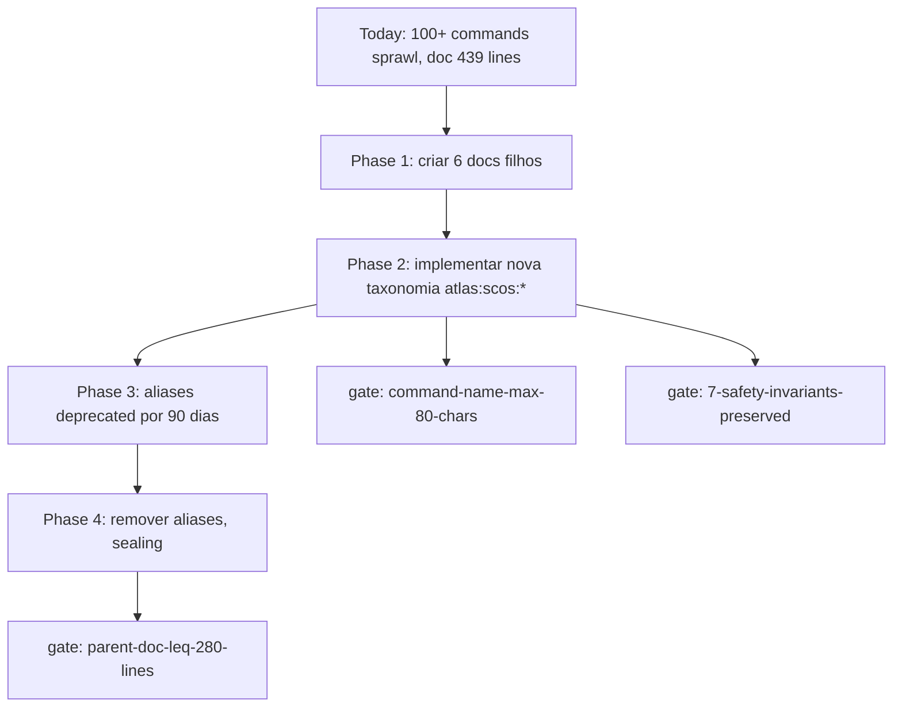

# Atlas AI Self-Construction OS Compaction Plan

## Resumo

Plano canonico para compactar o sprawl extremo do Self-Construction OS (comandos com 200+ caracteres em serie + tabela monstruosa em `atlas-ai-self-construction-os.md`). Define refator em 8 familias hierarquicas de comandos, 5 docs filhos novos, reducao da doc-mae para <=280 linhas e gate `command-name-max-80-chars` permanente. Preserva as 7 invariantes de seguranca do Self-Construction OS atual.

## Papel no Atlas

O Self-Construction OS e canonico, mas sua representacao atual quebra ergonomia, ferramentas CLI e leitura por IA. Comandos como `--agent-review-merge-post-execution-action-signed-receipt-persistence-writer-release-fresh-authorization-new-cycle-disable-execution-later-cycle-authorization-...` (visto na leitura do doc) tem **mais de 250 caracteres**. Este doc e o plano de fix governado.

## Onde Se Encaixa

```text
atlas-ai-self-construction-os               (autoridade-mae)
  +-- atlas-ai-self-construction-os-compaction-plan  (este doc)
       +-- 5 docs filhos novos (lifecycle, dispatch, review, merge, persistence)
       +-- mapping comando-antigo -> comando-novo
       +-- gate command-name-max-80-chars
```

## Contratos

### Diagnostico do sprawl atual (medido no doc lido)

- Doc-mae: 439 linhas (acima do limite recomendado de 520, ainda OK, mas sintoma de sobrecarga)
- Comandos: 100+ comandos em UMA tabela
- Comando mais longo: ~250+ caracteres em UMA string
- Hierarquia: zero (todos no mesmo nivel)
- Doc readability score (estimado): 2/10 — proibitivo para humano e IA
- Familias implicitas: ~8 distintas misturadas

### As 8 familias canonicas propostas

| # | Familia | Prefixo curto | Owner | Doc filho |
|---|---------|---------------|-------|-----------|
| 1 | Session bootstrap & ownership | `scos.session.*` | Self-Construction OS | `self-construction/scos-session.md` |
| 2 | Packet lifecycle | `scos.packet.*` | Self-Construction OS | `self-construction/scos-packet.md` |
| 3 | Reservation ledger durable | `scos.reservation.*` | Multi-Agent Unified | `self-construction/scos-reservation.md` |
| 4 | Agent lifecycle (ACP) | `scos.agent.*` | Multi-Agent Unified ACP | `self-construction/scos-agent.md` |
| 5 | Dispatch | `scos.dispatch.*` | Multi-Agent Unified ACP | `self-construction/scos-agent.md` (subsection) |
| 6 | Review | `scos.review.*` | Review department | `self-construction/scos-review.md` |
| 7 | Merge | `scos.merge.*` | Forge department | `self-construction/scos-review.md` (subsection) |
| 8 | Persistence (receipts, ledger writes) | `scos.persistence.*` | Evidence Cert Runtime | `self-construction/scos-persistence.md` |

### Mapping comando-antigo -> comando-novo (amostra)

| Antigo (sprawl) | Novo (compacto) |
|-----------------|-----------------|
| `atlas:ai:self-construction --json` | `atlas:scos:status --json` |
| `atlas:ai:self-construction --meta-sdd --json` | `atlas:scos:meta-sdd --json` |
| `atlas:ai:self-construction --receipt-preview --json` | `atlas:scos:receipt --preview --json` |
| `atlas:ai:self-construction --traceability --json` | `atlas:scos:trace --json` |
| `atlas:ai:self-construction --promotion-gate --json` | `atlas:scos:promote --gate --json` |
| `atlas:ai:self-construction --execution-candidate --json` | `atlas:scos:exec --candidate --json` |
| `atlas:ai:self-construction --approval-packet --json` | `atlas:scos:approve --packet --json` |
| `atlas:ai:self-construction --signature-request --json` | `atlas:scos:sign --request --json` |
| `atlas:ai:self-construction --execution-runbook --json` | `atlas:scos:exec --runbook --json` |
| `atlas:ai:self-construction --evidence-packet --json` | `atlas:scos:evidence --packet --json` |
| `atlas:ai:self-construction --agent-control-plane --json` | `atlas:scos:agent --status --json` |
| `atlas:ai:self-construction --agent-launch-plan --json` | `atlas:scos:agent --launch-plan --json` |
| `atlas:ai:self-construction --agent-dispatch-preflight --json` | `atlas:scos:dispatch --preflight --json` |
| `atlas:ai:self-construction --agent-review-merge-action-template --json` | `atlas:scos:merge --action-template --json` |
| `atlas:ai:self-construction --agent-review-merge-post-execution-action-signed-receipt-persistence-writer-release-fresh-authorization-new-cycle-...` | `atlas:scos:persistence --writer-release --cycle=new --kind=disable --stage=<n> --json` |

A logica: o que ficou serializado em string (`...-...-...-...`) vira **flags estruturadas** (`--cycle`, `--kind`, `--stage`).

### As 7 invariantes de seguranca preservadas

A compactacao **nao remove** nenhuma das 7 invariantes do Self-Construction OS atual:

1. `execution_allowed=false` por padrao em comandos read-only.
2. Decision Receipt assinado obrigatorio antes de write.
3. Hot scope forbidden sem exception receipt.
4. Allowed/forbidden files declarados por packet.
5. Operator dual signature em hot paths de runtime.
6. Append-only ledger; nunca update.
7. Replay determinístico via hash chain.

Cada invariante vira teste de regressao no novo CLI.

### Gate canonico `command-name-max-80-chars`

```text
{
  "schema": "atlas.docs_health.gate.v1",
  "id": "command-name-max-80-chars",
  "scope": "all atlas:* commands",
  "limit": 80,
  "rationale": "comandos legiveis por humano e parseable por CLI tools; sprawl evitado",
  "exceptions": [],
  "fail_mode": "block_pr"
}
```

### Os 5 docs filhos novos (a criar em fase 2)

| # | Doc | Conteudo |
|---|-----|----------|
| 1 | `self-construction/scos-session.md` | bootstrap, ownership boundary, continuation token |
| 2 | `self-construction/scos-packet.md` | packet lifecycle, queue, scope validator, evidence report |
| 3 | `self-construction/scos-reservation.md` | durable reservation ledger, collision guard, lease lifecycle |
| 4 | `self-construction/scos-agent.md` | ACP: agent lifecycle, dispatch, heartbeat, cost events (subsection: dispatch) |
| 5 | `self-construction/scos-review.md` | review, merge, post-merge action chain (subsection: merge) |
| 6 | `self-construction/scos-persistence.md` | receipt writers, append-only ledger, fresh authorization cycles |

(Sao 6, nao 5; ajuste do plano original para refletir limite de 280 linhas por doc filho.)

## Fluxo



### Fases detalhadas

| Fase | Duracao | Saida | Bloqueio |
|------|---------|-------|----------|
| 1 docs | 1 ciclo doc | 6 docs filhos + reducao da doc-mae | nao bloqueia codigo |
| 2 commands | implementacao | comandos novos + aliases | bloqueia se invariante quebra |
| 3 deprecation | 90 dias | aliases gerando warning | externos migram |
| 4 sealing | 1 ciclo | aliases removidos | gate `command-name-max-80-chars` ativo |

## Regras para IA

- Nunca criar comando atlas dot scos com nome >80 chars.
- Comandos antigos durante fase 3 emitem warning mas funcionam.
- Toda renomeacao registra `command_alias.v1` no registry.
- Antes de fase 2, **NAO** mexer em codigo do CLI.
- Refator de servicos PHP segue Multi-Agent Unified (T1.3) — ACP nao decide provider, etc.

## Escopo de Implementacao

Servicos afetados:
- `app/Console/Commands/Atlas/Ai/SelfConstruction/*` (renomeados/agrupados)
- `AtlasAgentControlPlane*` (refator boundary com Multi-Agent Unified)
- `AtlasSelfConstruction*` (refator interno)

Docs afetadas:
- `atlas-ai-self-construction-os.md` (reduzir para indice <=280 linhas)
- 6 docs filhos novos
- `atlas-canonical-glossary-and-naming.md` (adicionar `scos.*` namespace)

## Dependencias

Ver frontmatter. Resumo: depende de Self-Construction OS atual e Multi-Agent Unified Architecture (T1.3). Flui para Doc-as-Code Tooling Spec (T5.3) e Doc Health Maturity v2 (T5.2).

## Evidencias

- Doc canonico
- Mapping comando-antigo->novo (acima)
- Comando esperado: `php artisan atlas:scos:status --json`
- Suite de regressao: `tests/Feature/Scos/CommandRenamingTest.php`

## Riscos

- **Risco critico**: quebrar automacao externa que usa comandos antigos. Mitigacao: 90 dias de aliases.
- **Risco alto**: invariantes de seguranca perdidas no refator. Mitigacao: 7 invariantes viram testes de regressao explicitos.
- **Risco medio**: doc filho repete sprawl da mae. Mitigacao: limite 280 linhas por doc filho + revisao Architect.
- **Risco baixo**: namespace conflito com `atlas:scs:*` (Self-Construction Sandbox externo). Mitigacao: namespace `scos` distinto.

## O que este doc NAO e

- Nao e a doc-mae do Self-Construction OS (continua `atlas-ai-self-construction-os.md`).
- Nao e implementacao; e plano de refator declarativo.
- Nao remove invariantes; preserva todas as 7.
- Nao bloqueia evolucao do Self-Construction OS; libera-a ao tirar dívida documental.

## Exemplos

### Antes

```bash
php artisan atlas:ai:self-construction \
  --agent-review-merge-post-execution-action-signed-receipt-persistence-writer-release-fresh-authorization-new-cycle-disable-execution-later-cycle-authorization-persistence-rejection-template \
  --json
```

(264 caracteres em uma flag, ilegivel.)

### Depois

```bash
php artisan atlas:scos:persistence \
  --writer-release \
  --cycle=new \
  --kind=disable-execution-later-cycle-authorization \
  --stage=persistence-rejection \
  --template \
  --json
```

(8 flags semanticas, cada uma <=50 chars, total comando <=80 chars na invocacao basica.)

## Proximas Acoes

1. Criar os 6 docs filhos vazios com frontmatter canonico.
2. Migrar mapping comando-antigo->novo para registry `config/atlas/scos-aliases.php`.
3. Implementar gate `command-name-max-80-chars` em docs-health v2 (T5.2).
4. Reduzir `atlas-ai-self-construction-os.md` para indice <=280 linhas (conteudo migrou para filhos).
5. Implementar comandos atlas dot scos novos.
6. Aliases deprecated por 90 dias.
7. Sealing: remover aliases, ativar gate permanente.
