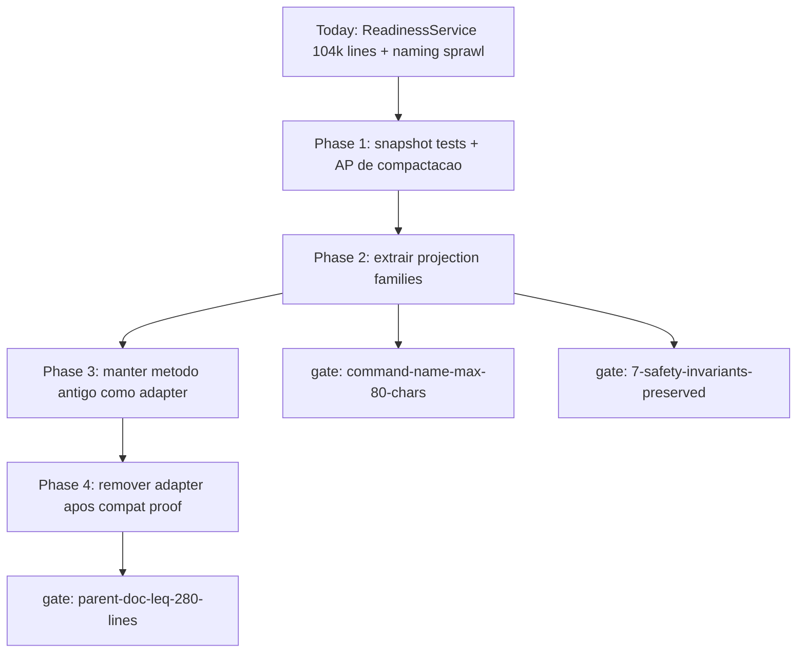

# Atlas AI Self-Construction OS Compaction Plan

## Resumo

Plano canonico para compactar o sprawl extremo do Self-Construction OS. O
diagnostico original mirava comandos gigantes; a realidade atual mudou: o
`AtlasAiSelfConstructionCommand` ja virou wrapper curto, enquanto
`AtlasSelfConstructionReadinessService.php` concentra **104.222 linhas** de
readiness/projection/template logic apos extrair `ReadinessCatalog`,
`ReadinessPathPolicy`, `ReadinessDocumentProbe`, `ReadinessCommandSurface`,
`ReadinessHash`, `ReadinessJsonInput` e `ReadinessCompletionClaimAuthority`, adicionar o wrapper de compatibilidade
`atlasSelfConstructionRuntimeGapMatrix` e extrair a surface CLI AP-816 publicada
para `AtlasSelfConstructionMotherCommandSurface`. Este plano agora governa a compactacao desse runtime
monolitico, a naming policy para novos services e a preservacao das 7
invariantes de seguranca.

## Papel no Atlas

O Self-Construction OS e canonico, mas sua representacao atual ainda quebra
ergonomia e leitura por IA. O command sprawl foi parcialmente absorvido por
subcommands/wrappers; o problema que permanece e a classe de readiness
monolitica e as familias de services com nomes muito longos. Este doc e o plano
de fix governado para isso.

## Onde Se Encaixa

```text
atlas-ai-self-construction-os                     (autoridade-mae)
  +-- atlas-self-construction-catalog              (inventario + naming)
  +-- atlas-ai-self-construction-os-compaction-plan (este doc)
       +-- compactacao do ReadinessService
       +-- aliases/compatibilidade quando houver comando antigo
       +-- gates command-name-max-80 + service-name-max-50
```

## Contratos

### Diagnostico atual

- `AtlasAiSelfConstructionCommand.php`: 44 linhas em contagem local; nao e mais o gargalo principal.
- `AtlasAiSelfConstructionMotherCommand.php`: 1.592 linhas em 2026-06-09; ainda grande, mas a surface AP-816 publicada agora fica em `AtlasSelfConstructionMotherCommandSurface` (254 linhas) em vez de ser anexada diretamente ao mapa historico do comando-mae. O audit de completion tambem le os docs split `agent-control-plane-contract-part-*` e esse helper, evitando falso negativo de wiring terminal-loop.
- `AtlasSelfConstructionReadinessService.php`: 104.222 linhas em 2026-06-09; gargalo principal de leitura, revisao e risco. Fatias extraidas: `ReadinessCatalog` com required docs, receipt allowed files e hot forbidden files; `ReadinessPathPolicy` com changed files, scope classification e hot-scope detection; `ReadinessDocumentProbe` com status/conteudo de docs; `ReadinessCommandSurface` com command/provider surface puro; `ReadinessHash` com hashing e ordenacao canonica preservados; `ReadinessJsonInput` com leitura JSON/canonical submission read-only; `ReadinessCompletionClaimAuthority` com aliases/policy hash de claim externo de completion. A mesma fatia fechou drift entre comandos publicados por readiness payloads e opcoes aceitas pela mother command.
- `app/Services/Ai/SelfConstruction/`: 292 arquivos PHP em contagem local.
- Naming sprawl historico: baseline anterior mostrou 193 arquivos acima de 50 chars.
- Self-Directed Evolution deve reutilizar `AtlasSelfConstructionSubsystemBuilderService`; nao criar detector/proposal paralelo.

### Familias canonicas propostas para extrair do ReadinessService

| # | Familia | Owner | Regra |
|---|---------|-------|-------|
| 1 | Readiness Status | Self-Construction OS | read-only, schema snapshot first |
| 2 | Packet Projection | Self-Construction OS | preserve packet hashes |
| 3 | Reservation Projection | Multi-Agent Unified | no ledger write |
| 4 | Agent Projection | Agent Control Plane | no provider start |
| 5 | Dispatch Projection | Agent Control Plane | no dispatch |
| 6 | Review/Merge Projection | Review/Forge | no approval |
| 7 | Persistence Projection | Evidence Runtime | no ledger write |
| 8 | Proposal Primitives | Subsystem Builder | reuse existing detect/propose/approve |

### Mapping legado -> destino atual

| Legado/monolito | Destino |
|-----------------|-----------------|
| `AtlasSelfConstructionReadinessService::snapshot` family | `ReadinessStatusProjection` / `ReadinessCatalog` / `ReadinessPathPolicy` / `ReadinessDocumentProbe` / `ReadinessCommandSurface` / `ReadinessHash` / `ReadinessJsonInput` / `ReadinessCompletionClaimAuthority` para catalogos, scope policy, probes documentais, command/provider surface, hashing, JSON input e claim-authority aliases |
| packet/meta-SDD/receipt methods | `PacketProjection` |
| reservation/collision/lease methods | `ReservationProjection` |
| agent control plane/liveness/work product methods | `AgentProjection` |
| dispatch/release/start packet methods | `DispatchProjection` |
| review/merge/signature methods | `ReviewMergeProjection` |
| receipt persistence/fresh authorization chains | `PersistenceProjection` |
| subsystem detect/propose/approve | keep in `AtlasSelfConstructionSubsystemBuilderService` |

A logica: o que ficou serializado em uma classe de 104k linhas vira projection
services pequenos, com metodo antigo preservado ate teste de compatibilidade
provar equivalencia.

### As 7 invariantes de seguranca preservadas

A compactacao **nao remove** nenhuma das 7 invariantes do Self-Construction OS atual:

1. `execution_allowed=false` por padrao em comandos read-only.
2. Decision Receipt assinado obrigatorio antes de write.
3. Hot scope forbidden sem exception receipt.
4. Allowed/forbidden files declarados por packet.
5. Operator dual signature em hot paths de runtime.
6. Append-only ledger; nunca update.
7. Replay determinístico via hash chain.

Cada invariante vira teste de regressao no novo CLI.

### Gate canonico `command-name-max-80-chars`

```text
{
  "schema": "atlas.docs_health.gate.v1",
  "id": "command-name-max-80-chars",
  "scope": "all atlas:* commands",
  "limit": 80,
  "rationale": "comandos legiveis por humano e parseable por CLI tools; sprawl evitado",
  "exceptions": [],
  "fail_mode": "block_pr"
}
```

### Docs filhos/sections

| # | Doc | Conteudo |
|---|-----|----------|
| 1 | `self-construction/scos-session.md` | bootstrap, ownership boundary, continuation token |
| 2 | `self-construction/scos-packet.md` | packet lifecycle, queue, scope validator, evidence report |
| 3 | `self-construction/scos-reservation.md` | durable reservation ledger, collision guard, lease lifecycle |
| 4 | `self-construction/scos-agent.md` | ACP: agent lifecycle, dispatch, heartbeat, cost events (subsection: dispatch) |
| 5 | `self-construction/scos-review.md` | review, merge, post-merge action chain (subsection: merge) |
| 6 | `self-construction/scos-persistence.md` | receipt writers, append-only ledger, fresh authorization cycles |

Esses docs continuam uteis como split documental. O codigo, porem, deve mirar
primeiro a compactacao do `AtlasSelfConstructionReadinessService.php`. A
primeiras fatias ja removeram catalogos estaticos, policy de paths, command/provider
surface, hashing, JSON input e probes de
documentos do monolito para `ReadinessCatalog`, `ReadinessPathPolicy` e
`ReadinessDocumentProbe`/`ReadinessCommandSurface`/`ReadinessHash`/`ReadinessJsonInput`/`ReadinessCompletionClaimAuthority`; a surface CLI AP-816 publicada agora fica em
`AtlasSelfConstructionMotherCommandSurface`. As proximas fatias devem
extrair projection logic, nao duplicar esses helpers.

## Fluxo



### Fases detalhadas

| Fase | Duracao | Saida | Bloqueio |
|------|---------|-------|----------|
| 1 AP/snapshots | 1 ciclo | AP + fixtures de equivalencia dos metodos publicos | bloqueia extracao sem snapshot |
| 2 projections | implementacao | services menores por familia | bloqueia se schema/hash mudar |
| 3 adapters | transicao | metodo antigo delega para service novo | comandos continuam funcionando |
| 4 sealing | 1 ciclo | adapter removido quando reachability/testes permitirem | gate de naming ativo |

## Regras para IA

- Nunca criar comando Atlas com nome >80 chars.
- Nunca criar service novo em `SelfConstruction/**` com classe >50 chars.
- Metodo antigo extraido deve delegar para service novo ate prova de compatibilidade.
- Antes de fase 2, **NAO** mexer em codigo sem AP + snapshot tests.
- Refator de servicos PHP segue Multi-Agent Unified (T1.3) — ACP nao decide provider, etc.
- Self-Directed Evolution deve reusar Subsystem Builder; compactacao nao autoriza detector paralelo.

## Escopo de Implementacao

Servicos afetados:
- `app/Services/Ai/SelfConstruction/AtlasSelfConstructionReadinessService.php`
- `app/Services/Ai/SelfConstruction/AtlasSelfConstructionSubsystemBuilderService.php` (somente como dependency/reuse, nao refator inicial)
- `AtlasAgentControlPlane*` (quando projection family tocar ACP)
- `AtlasSelfConstruction*` (refator interno com snapshots)

Docs afetadas:
- `atlas-ai-self-construction-os.md` (reduzir para indice <=280 linhas)
- 6 docs filhos novos
- `atlas-canonical-glossary-and-naming.md` (adicionar `scos.*` namespace)

## Dependencias

Ver frontmatter. Resumo: depende de Self-Construction OS atual e Multi-Agent Unified Architecture (T1.3). Flui para Doc-as-Code Tooling Spec (T5.3) e Doc Health Maturity v2 (T5.2).

## Evidencias

- Doc canonico
- Mapping comando-antigo->novo (acima)
- Comando esperado: `php artisan atlas:scos:status --json`
- Suite de regressao: `tests/Feature/Scos/CommandRenamingTest.php`

## Riscos

- **Risco critico**: quebrar automacao externa que usa comandos antigos. Mitigacao: 90 dias de aliases.
- **Risco alto**: invariantes de seguranca perdidas no refator. Mitigacao: 7 invariantes viram testes de regressao explicitos.
- **Risco medio**: doc filho repete sprawl da mae. Mitigacao: limite 280 linhas por doc filho + revisao Architect.
- **Risco baixo**: namespace conflito com `atlas:scs:*` (Self-Construction Sandbox externo). Mitigacao: namespace `scos` distinto.

## O que este doc NAO e

- Nao e a doc-mae do Self-Construction OS (continua `atlas-ai-self-construction-os.md`).
- Nao e implementacao; e plano de refator declarativo.
- Nao remove invariantes; preserva todas as 7.
- Nao bloqueia evolucao do Self-Construction OS; libera-a ao tirar dívida documental.

## Exemplos

### Antes

```bash
php artisan atlas:ai:self-construction \
  --agent-review-merge-post-execution-action-signed-receipt-persistence-writer-release-fresh-authorization-new-cycle-disable-execution-later-cycle-authorization-persistence-rejection-template \
  --json
```

(264 caracteres em uma flag, ilegivel.)

### Depois

```bash
php artisan atlas:scos:persistence \
  --writer-release \
  --cycle=new \
  --kind=disable-execution-later-cycle-authorization \
  --stage=persistence-rejection \
  --template \
  --json
```

(8 flags semanticas, cada uma <=50 chars, total comando <=80 chars na invocacao basica.)

## Proximas Acoes

1. Criar os 6 docs filhos vazios com frontmatter canonico.
2. Migrar mapping comando-antigo->novo para registry `config/atlas/scos-aliases.php`.
3. Implementar gate `command-name-max-80-chars` em docs-health v2 (T5.2).
4. Reduzir `atlas-ai-self-construction-os.md` para indice <=280 linhas (conteudo migrou para filhos).
5. Implementar comandos atlas dot scos novos.
6. Aliases deprecated por 90 dias.
7. Sealing: remover aliases, ativar gate permanente.
