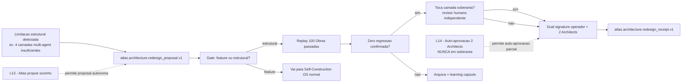
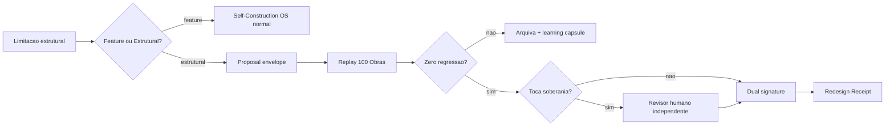

# Atlas Architecture Evolution Proposal Runtime

## Resumo

Sub-runbook canonico do Self-Construction OS que governa o caso especial em que o proprio Atlas detecta limitacao ESTRUTURAL na propria arquitetura e propoe redesign. Distingue redesign estrutural de mudanca incremental de feature. Sem este runbook, IA poderia (em tese) reescrever camadas canonicas como se fosse feature comum, quebrando AAEOS, multi-agent unified architecture, evidence runtime ou autonomy ladder.

## Papel no Atlas

Runbook (`graph_kind: runbook`) sob `atlas-ai-self-construction-os` que se especializa para mudancas estruturais. Flui para autonomy ladder (regras L13+) e para sovereign-os quando soberania for tocada.

## Onde Se Encaixa



## Contratos

- Mudanca arquitetural ESTRUTURAL exige este runbook; mudanca incremental de feature segue Self-Construction OS normal.
- Proposal envelope obrigatorio: `atlas.architecture.redesign_proposal.v1`.
- Promotion receipt obrigatorio: `atlas.architecture.redesign_receipt.v1` registrado em Evidence Ledger + Trust Ledger.
- Replay deterministico de >= 100 Obras passadas confirmando zero regressao em metricas canonicas AAEOS.
- Dual signature: operador + 2 Architect agents independentes (a partir L13).
- Auto-aprovacao via 2 Architects sem operador permitida apenas L14+ e NUNCA em camada de soberania.
- Camadas de soberania (lista canonica abaixo) exigem revisor humano independente da implementacao.
- Proposal arquivada exige learning capsule canonica registrada no Trust Ledger.

## Fluxo



## Distincao Feature x Estrutural

Esta distincao e canonica. Sem ela, IA confunde os dois e usa este runbook para mudancas pequenas (desperdicio) ou Self-Construction OS normal para mudancas grandes (perigo).

| Criterio | Feature change | Structural redesign |
|----------|---------------|---------------------|
| Altera schema canonico raiz (ex. `atlas.aaeos.phase.v1`)? | nao | **sim** |
| Altera quantidade ou identidade de camadas/fases/departamentos canonicos? | nao | **sim** |
| Altera contrato de promocao de autonomy ladder? | nao | **sim** |
| Altera autoridade canonica de um OS-mae? | nao | **sim** |
| Adiciona feature dentro de boundary existente? | sim | nao |
| Otimiza performance sem mudar contrato? | sim | nao |
| Refactor interno de classe sem mudar contrato? | sim | nao |

Se QUALQUER linha da coluna "structural" e sim, vai por este runbook.

## Schema Canonico do Proposal Envelope

```text
{
  "schema": "atlas.architecture.redesign_proposal.v1",
  "proposal_id": "<uuid>",
  "title": "<string>",
  "structural_changes": [
    {
      "target_doc": "<canonical doc id>",
      "current_state_snapshot_hash": "sha256:*",
      "proposed_state_description": "<string>",
      "schema_changes": ["<schema_id_before -> schema_id_after>"],
      "layer_count_before": <n>,
      "layer_count_after": <n>
    }
  ],
  "motivating_evidence": [
    { "obra_id": "<id>", "limitation_observed": "<string>", "frequency": <n> }
  ],
  "expected_metrics_delta": {
    "throughput": "<expected delta>",
    "reliability": "<expected delta>",
    "operator_friction": "<expected delta>"
  },
  "touches_sovereignty_layer": <bool>,
  "sovereignty_layers_touched": ["sovereign-os|epistemic-os|evidence-certification|trust-ledger"],
  "safety_sovereignty_block_applied": <bool>,
  "proposed_by_actor": { "kind": "agent|operator", "id": "<id>", "autonomy_level": "L<n>" },
  "proposed_at": "<iso8601>"
}
```

## Schema Canonico do Redesign Receipt

```text
{
  "schema": "atlas.architecture.redesign_receipt.v1",
  "receipt_id": "<uuid>",
  "proposal_id": "<uuid>",
  "decision": "promoted|archived|deferred",
  "decided_at": "<iso8601>",
  "operator_signature": "<sig|null if auto-approved L14+>",
  "architect_signatures": ["<sig>", "<sig>"],
  "replay_evidence": {
    "obras_replayed_count": <n>,
    "regression_observed_count": <n>,
    "metrics_delta_observed": { ... }
  },
  "sovereignty_layer_review": {
    "applicable": <bool>,
    "independent_reviewer_id": "<id|null>",
    "reviewer_signature": "<sig|null>"
  },
  "evidence_pack_refs": ["<sha256:*>"],
  "trust_ledger_entry_id": "<id>",
  "learning_capsule_id": "<id|null>"
}
```

## Camadas de Soberania (lista canonica)

Mudancas que tocam qualquer destes parents exigem bloco safety/sovereignty + revisor humano independente da implementacao + zero auto-aprovacao mesmo em L14+:

```text
- atlas-sovereign-operating-system
- atlas-epistemic-operating-system
- atlas-evidence-certification-runtime
- atlas-trust-ledger-canonical
- atlas-cartography-nomenclature-contract
- atlas-canonical-glossary-and-naming
- atlas-cognition-operating-system
- atlas-ai-knowledge-governance-system
```

## Criterios de Promocao

```text
gate_architecture_redesign_promotion:
  distincao_estrutural_confirmada: required
  envelope_valido: required
  motivating_evidence_min_obras: 5
  replay_obras_count_min: 100
  replay_regression_observed_count_max: 0
  metrics_delta_observed_within_expected_band: required
  dual_signature: required (a partir L13)
  architect_signatures_count: 2
  operator_signature_required_unless_l14_non_sovereign: true
  sovereignty_layer_independent_reviewer: required_if_applicable
  evidence_pack_complete: required
  trust_ledger_entry_emitted: required
  learning_capsule_id_emitted: required_if_archived
```

## Bloco Obrigatorio Safety / Sovereignty (para camada de soberania)

```text
sovereignty_class: secret  (toda mudanca em camada de soberania e secret por default)
operation_mode: governed_redesign_only
independent_human_reviewer_required: true   (independente da implementacao)
no_auto_approval_even_at_l14: true
jurisdiction_check_required: true
audit_trail_complete_required: true
rollback_plan_documented: required
rollback_test_executed_in_sandbox: required

forbidden_actions:
  - Promover redesign de soberania sem revisor humano independente.
  - Auto-aprovacao L14 em camada de soberania.
  - Implementar mudanca antes do receipt emitido.
  - Reduzir contagem de replay abaixo de 100 mesmo com justificativa.
```

## Regras para IA

- Antes de propor, classificar feature vs estrutural usando tabela canonica.
- Se feature, abandonar este runbook e seguir Self-Construction OS normal.
- Se estrutural, abrir envelope completo; envelope incompleto e proposal invalida.
- Replay de Obras passadas deve usar Obras reais selecionadas para cobrir diversidade de tipo, severidade e dominio.
- Em camada de soberania, NUNCA aplicar auto-aprovacao L14; sempre dual signature + revisor humano independente.
- Receipt deve ser emitido antes da implementacao comecar; codigo escrito sem receipt e ilegal.

## O que este runbook NAO e

- NAO substitui Self-Construction OS para features incrementais.
- NAO autoriza redesign autonomo abaixo de L13.
- NAO permite auto-aprovacao em camada de soberania mesmo a L14+.
- NAO substitui Architect review humano em mudancas de soberania.

## Escopo de Implementacao

- `AtlasArchitectureEvolutionProposalService` (novo) em `App\Services\Ai\SelfConstruction\Architecture`.
- Schemas `atlas.architecture.redesign_proposal.v1` e `atlas.architecture.redesign_receipt.v1` registrados em `atlas-contract-schema-registry`.
- CLI: `php artisan atlas:architecture:propose --json`, `atlas:architecture:promote --json`, `atlas:architecture:archive --json`, `atlas:architecture:status --json`.
- Cross-link runtime com `atlas-autonomy-ladder-promotion-runbook` adicionando regras especificas L13 e L14.
- Cross-link runtime com `atlas-ai-self-construction-os` adicionando hook "structural change detected -> route here".
- Zona "Architecture Evolution" adicionada ao Mission Control Cockpit (14a zona).

## Dependencias

Dependencias canonicas declaradas em `depends_on`. Resumo:

- `atlas-ai-self-construction-os` (parent canonico).
- `atlas-evidence-certification-runtime` (registra redesign receipts).
- `atlas-trust-ledger-canonical` (registra learning capsules).
- `atlas-sovereign-operating-system` e `atlas-epistemic-operating-system` (camadas de soberania protegidas).
- `atlas-cartography-nomenclature-contract` e `atlas-canonical-glossary-and-naming` (preservacao de nomenclatura quando schema raiz muda).
- `atlas-ai-self-construction-os` (owner canonico; este runbook nao depende de Genesis).

## Evidencias

- Este doc canonico.
- Schemas `atlas.architecture.redesign_proposal.v1` e `atlas.architecture.redesign_receipt.v1` quando registrados.
- Comando `php artisan atlas:architecture:status --json` listando proposals abertas, replays em curso, receipts emitidos.
- Trust Ledger eventos `architecture_redesign_proposed`, `architecture_redesign_promoted`, `architecture_redesign_archived`, `sovereignty_layer_redesign_review_completed`.
- Receipts armazenados em `evidence/architecture-redesign/<receipt_id>.json`.
- Replay snapshots arquivados em `evidence/architecture-redesign/replay/<proposal_id>.json`.

## Exemplos

### Exemplo 1: 4 camadas multi-agent viram 6

- Atlas L13 detecta que 73 Obras nos ultimos 90 dias mostraram fricao na camada 3 multi-agent unified.
- Proposal preenchido: layer_count_before=4, layer_count_after=6, motivating_evidence aponta as 73 Obras.
- Replay de 100 Obras passadas executado em sandbox isolado.
- Zero regressao em metricas AAEOS canonicas (throughput, reliability, operator_friction, replay determinism).
- Dual signature: operador + 2 Architects.
- Sem touch em camada de soberania, sem revisor adicional.
- Receipt emitido, Trust Ledger registra, implementacao autorizada.

### Exemplo 2: Atlas propoe redesign do Trust Ledger (camada de soberania)

- Atlas L14 detecta limitacao no trust-ledger schema.
- Proposal toca camada de soberania (`trust-ledger-canonical`).
- Bloco safety/sovereignty aplicado: independent_human_reviewer_required.
- Auto-aprovacao L14 BLOQUEADA por regra de soberania.
- Exige operador + 2 Architects + revisor humano independente (auditor externo).
- Rollback plan documentado + rollback test executado em sandbox.
- Replay 100 Obras + zero regressao.
- Receipt emitido com reviewer signature, Trust Ledger registra.

### Exemplo 3: Proposal arquivada

- IA propoe reduzir 17 fases AAEOS para 14.
- Replay de 100 Obras: 8 mostram regressao em metrica `reality_anchored_outcome_score`.
- Proposal arquivada (decision=archived), learning capsule emitida descrevendo "consolidacao de fases nao reduz friction operador; aumenta drift de evidence".
- Receipt registra archived + learning_capsule_id.
- Trust Ledger entrega learning para futuros agentes.

## Riscos

- **Critico**: redesign estrutural promovido via Self-Construction OS normal. Mitigacao: gate `distincao-feature-vs-estrutural-respeitada` + validator no docs-health.
- **Critico**: camada de soberania alterada sem revisor humano independente. Mitigacao: enforcement no `AtlasArchitectureEvolutionProposalService` + receipt obrigatorio.
- **Critico**: auto-aprovacao L14 aplicada em camada de soberania. Mitigacao: enforcement hard + alerta cockpit.
- **Alto**: replay com Obras sinteticas escondendo regressao. Mitigacao: validator de provenance.
- **Alto**: implementacao iniciada antes do receipt. Mitigacao: enforcement no Self-Construction OS hot scope.
- **Medio**: proposal arquivada sem learning capsule. Mitigacao: schema enforcement `learning_capsule_id_emitted: required_if_archived`.

## Proximas Acoes

1. Implementar `AtlasArchitectureEvolutionProposalService` no namespace `App\Services\Ai\SelfConstruction\Architecture`.
2. Registrar `atlas.architecture.redesign_proposal.v1` e `atlas.architecture.redesign_receipt.v1` no Contract Schema Registry.
3. CLI: `php artisan atlas:architecture:propose --json`, `atlas:architecture:promote --json`, `atlas:architecture:archive --json`.
4. Cross-link com `atlas-autonomy-ladder-promotion-runbook` adicionando regras especificas L13 (proposal autonoma permitida) e L14 (auto-aprovacao parcial, exceto soberania).
5. Cross-link com `atlas-ai-self-construction-os.md` adicionando secao "Mudanca Estrutural -> ver este runbook".
6. Adicionar zona "Architecture Evolution" ao Mission Control Cockpit como 14a zona.
