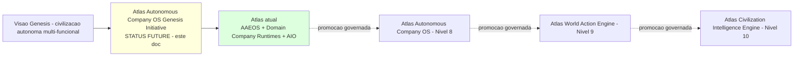
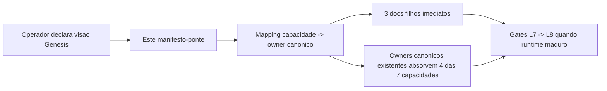

# Atlas Autonomous Company OS Genesis Initiative

## Resumo

Esta iniciativa documental existe para puxar o Atlas, gravitacionalmente e de forma governada, do estado atual (AAEOS como company runtime de engenharia + Domain Company Runtimes plugaveis + Mission Mode + Evidence Ledger + Autonomous Intelligence OS multi-dominio) para o proximo nivel canonizado da linha evolutiva: **Autonomous Company OS (Nivel 8)** e, em horizonte mais longo, **World Action Engine (Nivel 9)** e **Civilization Intelligence Engine (Nivel 10)**.

"Genesis" e codinome da iniciativa, nao novo sistema operacional. O OS-mae permanece sendo `atlas-autonomous-intelligence-operating-system`.

Este manifesto:

1. Reconhece que o salto desejado nao exige criar nomes/siglas paralelas (AGOS, ACSL, ASRL).
2. Mapeia sete capacidades de horizonte longo para owners canonicos existentes.
3. Abre apenas tres docs filhos novos imediatos com valor real e nao-redundante.
4. Estabelece bloco obrigatorio de safety/sovereignty para qualquer doc que toque dominio sensivel.
5. Define gates de promocao L7 -> L8 que respeitam a linha evolutiva canonica.

## Papel no Atlas

Manifesto-ponte (`graph_kind: initiative_manifest`) com `status: future`. Nao executa, nao roteia trafego, nao serve como autoridade canonica de runtime. Funciona como mapa estrategico declarativo entre a visao do operador e os documentos canonicos que ja governam cada peca.



## Onde Se Encaixa

Esta iniciativa se posiciona acima do estado atual (AAEOS + Domain Company Runtimes + Atlas Autonomous Intelligence OS) e abaixo do alvo proximo Autonomous Company OS (Nivel 8 da linha evolutiva canonica). Funciona como manifesto-ponte conectando visao Genesis aos owners canonicos existentes, sem criar novo OS-mae.

## Onde Se Encaixa na Linha Evolutiva Canonica

A linha evolutiva canonica (definida em `atlas-ai-evolution-lineage-and-target-state.md`) e:

```text
Nivel 1: Persistent Context Runtime
Nivel 2: Outcome Learning Intelligence OS
Nivel 3: Intelligence Factory OS
Nivel 4: AAEOS - Agentic Engineering OS  (company runtime de engenharia, estado atual em consolidacao)
Nivel 5: Domain Company Runtimes plugaveis (estado atual em consolidacao)
Nivel 6: Atlas Autonomous Intelligence OS multi-dominio (estado atual em consolidacao)
Nivel 7: Swarm Company Runtime
Nivel 8: Atlas Autonomous Company OS                        <- alvo proximo desta iniciativa
Nivel 9: Atlas World Action Engine                          <- alvo medio
Nivel 10: Atlas Civilization Intelligence Engine            <- north-star
```

Esta iniciativa NAO introduz nivel novo. NAO renomeia niveis existentes. Apenas declara que sete capacidades faltam para o Atlas chegar limpo no Nivel 8.

## Mapping de Capacidades para Owners Canonicos

| # | Capacidade Genesis | Owner canonico responsavel | Doc novo necessario? | Status |
|---|--------------------|---------------------------|----------------------|--------|
| 1 | Autopoietic Specification Runtime (Atlas escreve spec canonica sozinho com curacao humana) | `atlas-ai-self-construction-os` + `atlas-epistemic-operating-system` + `atlas-sovereign-operating-system` | Nao - absorvido como sub-runbook do Self-Construction OS | future |
| 2 | Department / Domain Proposal Gate (novo dept ou domain nasce com governanca) | `atlas-domain-company-runtimes` + `atlas-agentic-engineering-os-department-contract` | **Sim** - `atlas-domain-runtime-creation-gate.md` | future |
| 3 | Multi-Functional Substitution (operador opera 8+ funcoes simultaneas) | `atlas-domain-company-runtimes` (ja governa) | Nao - ja existe | active em consolidacao |
| 4 | Counterfactual Reality Engine (simula N futuros antes de executar Obra) | `atlas-strategic-reality-engine` + futura `RealitySandbox` | Nao imediato - sub-runbook do ASRE quando ASRE evoluir; documentado como capacidade aqui | future |
| 5 | Sovereign Federation Protocol (rede de Atlas soberanos compartilha learnings sem dados) | `atlas-sovereign-operating-system` + `atlas-epistemic-operating-system` | Nao imediato - futuro Federation Protocol abre quando Sovereign OS chegar em runtime | future distante |
| 6 | Architecture Evolution Proposal Runtime (Atlas propoe redesign estrutural de si proprio) | `atlas-ai-self-construction-os` | **Sim** - `atlas-architecture-evolution-proposal-runtime.md` | future |
| 7 | Reality Anchored Governance (gates de impacto real, nao apenas tecnico) | `atlas-evidence-certification-runtime` + `atlas-strategic-reality-engine` + `atlas-agentic-engineering-os-runbook` | **Sim** - `atlas-reality-outcome-gates.md` | future, mas com runtime parcial implementavel ja |

Total de docs novos abertos por esta iniciativa: **3** (nao 9, nao 7).

## Tres Docs Filhos Imediatos

### 1. `atlas-reality-outcome-gates.md`

15 reality gates complementando os 15 universal gates AAEOS. Mede impacto no mundo real (revenue, retention, security posture observada, regret-minimization, compounding intelligence delta) e nao apenas verde tecnico (lint, tests, scope). Parent: `atlas-evidence-certification-runtime`.

### 2. `atlas-domain-runtime-creation-gate.md`

Governa nascimento de novo domain runtime ou novo departamento AAEOS. Define proposal envelope, sandbox, criterios de promocao L0 -> L1, dual signature operador, replay against historical intents. Parent: `atlas-domain-company-runtimes`.

### 3. `atlas-architecture-evolution-proposal-runtime.md`

Sub-runbook de `atlas-ai-self-construction-os` que governa o caso especial em que o Atlas propoe redesign estrutural do proprio AAEOS template (ex. virar 4 camadas multi-agente em 6, virar 17 fases em 23). Requer dual signature operador + dois Architect agents independentes + replay deterministico de cem Obras passadas confirmando zero regressao.

## Bloco Obrigatorio de Safety / Sovereignty para Dominios Sensiveis

Qualquer doc Genesis (ou doc filho desta iniciativa, ou doc downstream que invoque esta visao) que mencione substituicao funcional em dominios legal, healthcare, finance, trading ou cyber DEVE incluir, copy-paste, o bloco abaixo. Sem ele, doc nao pode declarar substituicao operacional.

```text
# Sovereignty And Safety Lock For Sensitive Domains

sovereignty_class: sensitive | secret | cyber  (conforme aplicavel)
operation_mode: assistive | research | draft | analysis only
no_autonomous_professional_advice: true
licensed_human_review_required: true   (onde regulacao exigir)
jurisdiction_check_required: true
consent_chain_verified_required: true
audit_trail_complete_required: true
liability_carrier_documented_required: true
policy_gate_passed_required: true

forbidden_actions:
  - Emitir opiniao juridica vinculante sem revisor licenciado.
  - Emitir diagnostico ou prescricao medica sem profissional habilitado.
  - Executar ordem financeira/trading sem dual signature operador + risk officer humano.
  - Acao ofensiva de cyber security fora de escopo autorizado e ambiente isolado.
  - Compartilhar dados sensitive/secret/cyber em federation cross-Atlas.
```

Este bloco e canonico. Doc Genesis sem ele para dominio sensivel falha em docs-health gate `sensitive-domains-have-safety-block`.

## Contratos

Esta iniciativa declara os seguintes contratos canonicos:

- Genesis e codinome de iniciativa, nunca sistema operacional canonico.
- Apenas tres docs filhos novos sao abertos: Reality Outcome Gates, Domain Runtime Creation Gate, Architecture Evolution Proposal Runtime.
- Capacidade Genesis listada na tabela de mapping deve ter owner canonico ja declarado; nao se cria autoridade nova aqui.
- Dominio sensivel exige bloco safety/sovereignty copy-paste declarado neste manifesto.
- Promocao L7 -> L8 segue gates canonicos listados em "Gates Canonicos de Promocao L7 ... para L8".
- Cartography Nomenclature Contract e respeitado: nada de patamar decorativo (0.71, 1.5, etc.).

## Fluxo



## Escopo de Implementacao

Esta iniciativa nao gera codigo diretamente. O escopo de implementacao decorrente vive nos owners canonicos:

- Os tres docs filhos imediatos geram services proprios (ver "Proximas Acoes").
- As quatro capacidades absorvidas (1, 3, 4, 5) seguem o escopo dos owners canonicos correspondentes.
- Promocao L7 -> L8 requer implementacao integrada de Reality Outcome Gates + Domain Runtime Creation Gate + Architecture Evolution Proposal Runtime no Mission Control Cockpit.

## Dependencias

Dependencias canonicas vivem em frontmatter `depends_on`. Resumo:

- `atlas-autonomous-intelligence-operating-system` (OS-mae do qual esta iniciativa e roadmap).
- `atlas-ai-evolution-lineage-and-target-state` (linha evolutiva canonica respeitada).
- `atlas-domain-company-runtimes` (parent canonico de domain runtime substitution).
- `atlas-agentic-engineering-os` (fundacao operacional).
- `atlas-cartography-nomenclature-contract` (nomenclatura respeitada).
- `atlas-canonical-glossary-and-naming` (sem siglas paralelas).

## Evidencias

- Este manifesto-ponte com `status: future`.
- Os tres docs filhos imediatos referenciados em `patamar_next`.
- Updates no `atlas-ai-canonical-architecture-index.md` e `canonical-index/authority-map.md`.
- Receipts futuros de promocao L7 -> L8 quando emitidos.

## Exemplos

### Exemplo 1: novo doc-filho proposto fora dos tres autorizados

IA detecta gap e quer criar `atlas-sovereign-federation-protocol.md` (federacao cross-Atlas) como doc filho desta iniciativa.

Resultado correto: BLOQUEAR. Este manifesto autoriza apenas tres docs filhos imediatos (Reality Outcome Gates, Domain Runtime Creation Gate, Architecture Evolution Proposal Runtime). Federation Protocol pertence ao roadmap de `atlas-sovereign-operating-system.md`, nao desta iniciativa. Ampliar este manifesto antes de abrir novo doc filho.

### Exemplo 2: dominio sensivel sem bloco safety/sovereignty

Doc filho proposto menciona "trading domain" sem bloco safety/sovereignty.

Resultado correto: BLOQUEAR via gate `sensitive-domains-have-safety-block`. Aplicar bloco copy-paste declarado nesta iniciativa antes de aceitar doc.

### Exemplo 3: promocao L7 -> L8

Operador solicita promocao do Atlas para Nivel 8 Autonomous Company OS.

Gate canonico exige: dual signature + 2 Architects + replay 100 Obras + reality gate pass rate >= 0.90 em 30d + os tres docs filhos com runtime implementado + control plane integrado. Sem todos, promocao bloqueia.

## Equacao Conceitual da Iniciativa

A iniciativa Genesis nao introduz equacao nova canonica. Reafirma e estende a equacao N x M ja canonizada em `atlas-cognitive-antifragility-equation.md`:

```text
Atlas_total(t) = ( sum_i Domain_Runtime_i(t) ) * Antifragility_multiplier(t)

onde Antifragility_multiplier(t) inclui as sete capacidades Genesis
quando promovidas para active:
  - autopoietic_spec_score
  - department_proposal_governance_score
  - multi_functional_coverage_score
  - counterfactual_quality_score
  - federation_intelligence_score   (futuro distante)
  - architecture_evolution_score
  - reality_anchored_outcome_score

Capacidade Genesis em `status: future` contribui 0 ao multiplier
ate que owner canonico promova para `status: active`.
```

## Gates Canonicos de Promocao L7 (AAEOS atual) para L8 (Autonomous Company OS)

```text
gate_promocao_l7_to_l8:
  dual_signature_operator: required
  architect_agents_independent_review: 2
  replay_deterministico_obras_passadas: 100
  replay_zero_regressao: required
  evidence_pack_completo: required
  reality_outcome_gates_pass_rate_min: 0.90
  domain_runtime_creation_gate_implemented: required
  architecture_evolution_proposal_runtime_implemented: required
  sovereignty_safety_lock_enforced_for_sensitive_domains: required
  documentation_inventory_sync_pass: required
  docs_health_pass: required
  control_plane_integration_proven: required
```

## Regras para IA

- NAO criar sigla de OS novo (AGOS, ACSL, ASRL ou qualquer outra) baseando-se nesta iniciativa.
- NAO promover esta doc de `status: future` para `status: active` sem aprovacao explicita do operador.
- NAO abrir doc filho fora dos tres listados em `Tres Docs Filhos Imediatos` sem ampliar este manifesto antes.
- SEMPRE incluir o bloco safety/sovereignty quando dominio sensivel aparecer.
- SEMPRE referenciar owner canonico ja existente para capacidades absorvidas (1, 3, 4, 5) em vez de criar autoridade nova.
- SEMPRE respeitar `atlas-cartography-nomenclature-contract`: nada de patamar decorativo (0.71, 1.5, etc.).

## O que esta iniciativa NAO e

- NAO e novo sistema operacional canonico.
- NAO substitui `atlas-autonomous-intelligence-operating-system`.
- NAO substitui `atlas-domain-company-runtimes`.
- NAO substitui `atlas-agentic-engineering-os`.
- NAO inventa patamar decorativo.
- NAO declara autonomia profissional plena em dominios sensiveis.
- NAO e runtime; e manifesto-ponte com `status: future`.

## Riscos

- **Critico**: implementador trata Genesis como OS canonico e cria classes paralelas. Mitigacao: gate `genesis-not-promoted-to-os` + revisao de glossary.
- **Critico**: doc filho aberto fora dos tres autorizados, criando naming sprawl. Mitigacao: gate `three-child-docs-only`.
- **Alto**: dominio sensivel mencionado sem bloco safety/sovereignty. Mitigacao: gate `sensitive-domains-have-safety-block`.
- **Medio**: drift entre mapping aqui e owner real. Mitigacao: maintenance regra obrigatoria + docs-health cross-link.
- **Medio**: capacidade promovida para active sem runtime + evidence comprovados. Mitigacao: maintenance regra + receipt obrigatorio.

## Proximas Acoes

1. Criar `atlas-reality-outcome-gates.md` (doc filho 1/3).
2. Criar `atlas-domain-runtime-creation-gate.md` (doc filho 2/3).
3. Criar `atlas-architecture-evolution-proposal-runtime.md` (doc filho 3/3).
4. Atualizar `atlas-ai-canonical-architecture-index.md` registrando esta iniciativa como manifesto-ponte.
5. Atualizar `canonical-index/authority-map.md` adicionando os 4 docs (este + tres filhos).
6. Rodar `php artisan atlas:engineering:knowledge docs-health --json` e `sync --prune --json` para validar consistencia.
7. Quando capacidade Genesis virar runtime real, anexar receipt de promocao nesta doc e atualizar `atlas-ai-evolution-lineage-and-target-state.md`.
