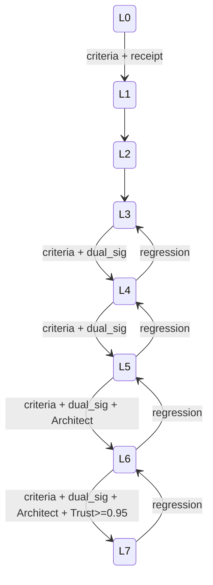

# Atlas Autonomy Ladder Promotion Runbook

## Resumo

Runbook canonico com criterios executaveis para promover entre os 8 niveis da Autonomy Ladder. Cada nivel: entry criteria, exit criteria mensuraveis, evidencia, dual signature, demote automatico.

## Papel no Atlas

A doc-mae lista L0-L7 como conceito. Este runbook **transforma conceito em criterio executavel** que `AtlasAutonomyLadderRuntimeService` consulta antes de aprovar promocao.

## Onde Se Encaixa

```text
atlas-agentic-engineering-os
  +-- atlas-autonomy-ladder-promotion-runbook (este doc)
  +-- atlas-trust-ledger-canonical (historico)
```

## Contratos

### Os 8 niveis canonicos com criterios

| Nivel | Nome | Entry criteria (mensuraveis) | Exit / promotion criteria |
|-------|------|------------------------------|---------------------------|
| L0 | Assist | operador faz tudo, IA so completa codigo | 50 sessoes assist com >=80% acceptance, 0 hallucination grave |
| L1 | Slice Co-Pilot | IA edita 1-3 arquivos com escopo declarado | 20 slices consecutivos verdes, scope_violation_count=0, repair_loop_count<=1 |
| L2 | Multi-Slice Pair | 3-10 arquivos, pair com reviewer | 30 obras pair verdes, regression_catch_rate>=0.9 |
| L3 | Feature Owner | feature completa R3 com gates universais | 15 features cert verde, blocker_in_review<=1 por feature |
| L4 | Obra Owner | obra de uma semana R4 com paralelismo | 5 Obras consecutivas cert verde, 0 rollback no cert phase, dual_signature_count=5 |
| L5 | Department Owner | depto inteiro autonomo (ex.: dev autocontido) | 90 dias sem intervention humana fora de gestures, depto.maturity>=L4 |
| L6 | Multi-Department Conductor | conduz 3+ departamentos simultaneamente | 30 dias com 3+ depts ativos, cross_dept_blocker_resolution_p95<=2h |
| L7 | Self-Evolving | propoe e implementa proprio refator (com gate) | 10 self-construction propostas aprovadas, 0 invariante quebrada, Trust Ledger score >=0.95 |

### Schema canonico (`atlas.autonomy.promotion_request.v1`)

```text
{
  "schema": "atlas.autonomy.promotion_request.v1",
  "request_id": "<uuid>",
  "from_level": "L<n>",
  "to_level": "L<n+1>",
  "evidence": {
    "metric_id": "<value>",
    "obras_count": <int>,
    "regression_count": <int>,
    "blocker_resolution_p95_hours": <float>
  },
  "trust_ledger_score": <float>,
  "operator_signature": "<sig>",
  "architect_signature": "<sig_or_null>",
  "rationale": "<string>",
  "rollback_window_seconds": <int>
}
```

### Demote automatico

Trigger: 2 ciclos consecutivos com qualquer metrica de exit_criteria abaixo de threshold. Acao: demote L<n> -> L<n-1> + Operator notification + receipt automatico.

## Fluxo



## Regras para IA

- Promocao L<=3 com single operator signature.
- Promocao L4+ com dual signature (Operador + Architect agent).
- Promocao L6+ adicional Architect human review obrigatorio.
- Demote nunca exige signature; e automatico via metrica.
- Toda promocao registra entry no Trust Ledger.

## Escopo de Implementacao

`AtlasAutonomyLadderRuntimeService`, `AtlasAutonomyMetricsAggregator`, `AtlasAutonomyDemoteWatchdog`.

## Dependencias

Trust Ledger (T4.2), Department Maturity Matrix (T2.3), Mission Control Cockpit (T1.5).

## Evidencias

Comando esperado: `php artisan atlas:autonomy:status --json`. Suite: `tests/Feature/Autonomy/`.

## Riscos

Promocao prematura, demote false-positive, drift entre metrica observada e aplicada.

## O que este doc NAO e

Nao define os 8 niveis em conceito (isso e `atlas-agentic-engineering-os.md`); define **como promover** entre niveis.

## Exemplos

Promocao L3 -> L4 envia `promotion_request.v1` com 15 features cert verde + dual signature; runtime valida e atualiza estado.

## Proximas Acoes

1. Implementar `AtlasAutonomyLadderRuntimeService`.
2. Implementar telemetria por criterio.
3. Implementar demote watchdog.
