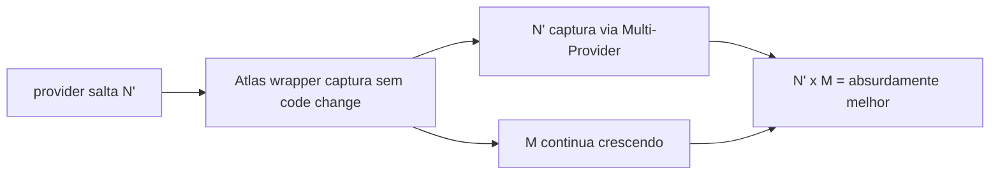

# Atlas Cognitive Antifragility Equation

## Resumo

Tese formal: Atlas total = N (provider capacity) x M (Atlas wrapper multiplier).

## Papel no Atlas

CLAUDE.md menciona "antifragilidade composta". Este doc formaliza com metricas.

## Onde Se Encaixa

```text
atlas-agentic-engineering-os
  +-- atlas-cognitive-antifragility-equation (este doc)
  +-- atlas-comparative-architecture-atlas (medicao N de externos)
```

## Contratos

### Equacao

```text
Atlas_total(t) = N(provider, t) x M(atlas, t)

onde:
  N(provider, t) = soma ponderada das capacities atuais dos providers externos
  M(atlas, t)    = soma ponderada dos multiplicadores Atlas
```

### Componentes de M (Atlas multiplier)

| Componente | Peso | Metrica | Range |
|------------|------|---------|-------|
| Memory governed (ACOS) | 0.20 | retention_quality_score | 0-1 |
| Evidence + receipts | 0.15 | replay_success_rate | 0-1 |
| Compounding learning | 0.15 | obras_quality_trend | -1 a +1 (positivo = melhora) |
| Self-construction | 0.10 | self_improvements_approved_per_quarter | 0-N |
| Multi-agent topology | 0.10 | parallel_efficiency_factor | 1-8 |
| Multi-provider portfolio | 0.10 | provider_diversity_score | 0-1 |
| Sovereignty / local-first | 0.10 | local_run_rate | 0-1 |
| Governance gates | 0.10 | gate_pass_rate | 0-1 |

```text
M = sum(weight_i x metric_i)
```

### N (provider capacity)

Mensurada via `atlas-comparative-architecture-atlas`. Para `claude_code` no snapshot atual: N=8.5 (UX e tactical).

### Antifragility window

- Quando provider salta (ex.: Claude shipa modelo 100x melhor), N salta.
- Atlas captura via wrapper sem mudar codigo (Multi-Provider Profile + Atlas Decide).
- M continua crescendo independentemente (mais evidence, mais learning, mais self-construction).
- Total = N salto x M crescimento. Atlas nunca para de melhorar.

### Antifrag scenarios

| Cenario | N | M | Total |
|---------|---|---|-------|
| Sem Atlas, Claude Code direto | 8.5 | 1 | 8.5 |
| Atlas hoje (snapshot) | 8.5 | 1.4 | 11.9 |
| Atlas em 6 meses (Mission Control + HTTP path canonical) | 8.5 | 2.0 | 17.0 |
| Atlas + Claude 5x salto provider | 42.5 | 2.0 | 85.0 |
| Atlas + Claude 5x + Atlas multiplier 3x | 42.5 | 3.0 | 127.5 |

### Schema (`atlas.antifragility.measurement.v1`)

```text
{
  "schema": "atlas.antifragility.measurement.v1",
  "measured_at": "<iso8601>",
  "n": {"value": <float>, "providers": [{"id":"...","score":<float>}]},
  "m": {"value": <float>, "components": [{"id":"...","weight":<float>,"metric":<float>}]},
  "total": <float>,
  "trend_30d": <float>
}
```

## Fluxo



## Regras para IA

- Toda proposta nova passa pelo filtro: aumenta M? aumenta capacidade de capturar N? Se nao, nao multiplica.
- Mesa nivelada: N is exogenous; M is endogenous. Foco operacional em M.

## Escopo de Implementacao

`AtlasAntifragilityMeasurementService`, comando `atlas:antifragility:status --json`.

## Dependencias

ACOS (memory), Evidence Cert Runtime, Comparative Architecture (T3.5), Compounding Engineering Intelligence.

## Evidencias

Comando + dashboards + ledger trimestral.

## Riscos

Vies de auto-medicao, M inflado sem evidence, baseline N stale.

## O que este doc NAO e

Nao substitui Comparative Architecture (T3.5); usa-a como fonte de N.

## Exemplos

Snapshot 2026-Q2: N=8.5, M=1.4, Total=11.9. Trend 30d=+0.05 (M crescendo via more receipts + more learnings).

## Proximas Acoes

1. Implementar comando.
2. Telemetria por componente de M.
3. Dashboard cockpit zona 10.
