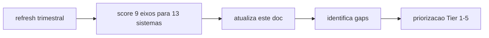

# Atlas Comparative Architecture Atlas

## Resumo

Comparativo Atlas vs 12 externos por 9 eixos.

## Papel no Atlas

Define "absurdamente melhor" mensuravel.

## Onde Se Encaixa

```text
atlas-agentic-engineering-os
  +-- atlas-comparative-architecture-atlas (este doc)
```

## Contratos

### 9 eixos canonicos

1. Multi-agent topology
2. Multi-provider orchestration
3. Cross-session memory
4. Evidence + replay determinístico
5. Governance / gates
6. Self-improvement
7. Local sovereignty
8. UX terminal pair-programming
9. Onboarding / out-of-box

### Matriz comparativa (snapshot 2026-05-26, escala 0-10)

| Sistema | E1 | E2 | E3 | E4 | E5 | E6 | E7 | E8 | E9 | Media |
|---------|----|----|----|----|----|----|----|----|----|-------|
| **Atlas AAEOS** | 8 | 9 | 9.5 | 9 | 9 | 7 | 10 | 6 | 4 | 7.9 |
| Devin | 6 | 3 | 5 | 3 | 4 | 2 | 3 | 8 | 9 | 4.8 |
| Claude Code | 0 | 0 | 0 | 0 | 1 | 0 | 5 | 9 | 9 | 2.7 |
| Codex CLI | 0 | 0 | 0 | 0 | 1 | 0 | 5 | 9 | 9 | 2.7 |
| Cursor | 1 | 1 | 2 | 0 | 1 | 0 | 4 | 9 | 9 | 3.0 |
| Aider | 0 | 1 | 1 | 0 | 1 | 0 | 7 | 8 | 8 | 2.9 |
| OpenHands | 4 | 3 | 3 | 2 | 3 | 1 | 6 | 7 | 7 | 4.0 |
| Factory.ai | 5 | 4 | 4 | 3 | 4 | 1 | 4 | 7 | 7 | 4.3 |
| MetaGPT | 6 | 1 | 2 | 1 | 4 | 0 | 5 | 4 | 5 | 3.1 |
| ChatDev | 6 | 1 | 1 | 0 | 3 | 0 | 5 | 4 | 5 | 2.8 |
| AutoGen | 7 | 3 | 2 | 1 | 3 | 0 | 6 | 4 | 5 | 3.4 |
| CrewAI | 7 | 4 | 3 | 1 | 3 | 0 | 6 | 5 | 6 | 3.9 |
| LangGraph | 6 | 3 | 4 | 2 | 3 | 0 | 6 | 4 | 5 | 3.7 |
| SWE-Agent | 4 | 1 | 2 | 1 | 2 | 0 | 6 | 6 | 7 | 3.2 |

### Onde Atlas claramente vence

- E2 (multi-provider): unica plataforma com profile + fallback chain canonico.
- E3 (cross-session memory): ACOS 62 subsistemas vs sessao isolada nos competidores.
- E4 (evidence + replay): unica com decision receipt v2 + hash chain + replay determinístico.
- E5 (governance): unica com 15 gates universais + 8 ladder + 11 deptos.
- E7 (sovereignty): unico local-first MBP soberano.

### Onde Atlas perde

- E8 (UX terminal): Claude Code/Codex tem 9 vs Atlas 6 (HTTP path legado, A1 patamar).
- E9 (onboarding): tradeoff por governance; alvo mover para 6 com Mission Control polido.

### Antipadrao retorico

- "Atlas e melhor": vazio. Use eixo + delta numerico.
- "Atlas concorre com Claude Code": Atlas usa Claude Code como engine, nao concorre.
- "Atlas substitui Devin": para tactico Devin >; para strategic Atlas >.

## Fluxo



## Regras para IA

- Citar este doc com data de snapshot ao comparar.
- Nao trate externo como autoridade canonica.
- Refresh: Q1, Q2, Q3, Q4.

## Escopo de Implementacao

`AtlasComparativeArchitectureService`, dashboards, refresh process.

## Dependencias

Manual + research dept.

## Evidencias

Doc canonico + sources_list por sistema.

## Riscos

Stale, eixo subjetivo, viés.

## O que este doc NAO e

Nao decide arquitetura; informa.

## Exemplos

E5 governance score Atlas 9 vs Devin 4: porque Atlas tem 15 gates universais + Programming Governance + Security policy gate + Evidence Cert Runtime; Devin tem checklist interno.

## Proximas Acoes

1. Refresh Q3 2026.
2. Adicionar Goose, Replit Ghost, Sweep AI no proximo refresh.
3. Sources list separado para audit.
