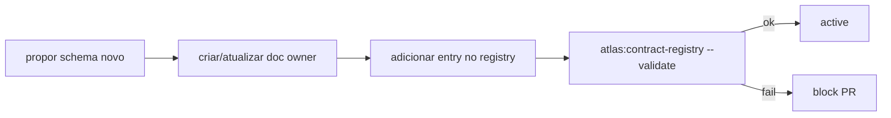

# Atlas Contract Schema Registry

## Resumo

Indice unificado de schemas atlas dot * dot v1 com owner, doc, versao e breaking-change policy.

## Papel no Atlas

Hoje schemas vivem dispersos em ~80+ docs. Sem registry, ha duplicacao silenciosa e drift. Este doc e a fonte de verdade.

## Onde Se Encaixa

```text
atlas-canonical-glossary-and-naming
  +-- atlas-contract-schema-registry (este doc)
```

## Contratos

### Schema entry (`atlas.schema_registry.entry.v1`)

```text
{
  "schema": "atlas.schema_registry.entry.v1",
  "schema_id": "atlas.<namespace>.<name>.v<int>",
  "current_version": "v<int>",
  "owner": "<doc_id>",
  "canonical_doc": "<doc_path>",
  "introduced_at": "<iso8601>",
  "breaking_changes": [
    {"from_version": "v<n>", "to_version": "v<n+1>", "receipt_id": "...", "deprecation_window_days": <int>}
  ],
  "deprecated": <bool>,
  "deprecated_at": "<iso8601_or_null>",
  "fields_summary": "<short string>"
}
```

### Registry inicial (snapshot 2026-05-26)

| Schema | Versao | Owner | Doc canonico |
|--------|--------|-------|--------------|
| atlas.aaeos.phase.v1 | v1 | atlas-agentic-engineering-os-runbook | atlas-agentic-engineering-os-runbook.md |
| atlas.aaeos.department.v1 | v1 | atlas-agentic-engineering-os-department-contract | atlas-agentic-engineering-os-department-contract.md |
| atlas.aaeos.http_request.v1 | v1 | atlas-aaeos-http-path-integration-spec | atlas-aaeos-http-path-integration-spec.md |
| atlas.aaeos.http_response.v1 | v1 | atlas-aaeos-http-path-integration-spec | atlas-aaeos-http-path-integration-spec.md |
| atlas.aaeos.cross_dept.handoff.v1 | v1 | atlas-aaeos-cross-department-choreography | atlas-aaeos-cross-department-choreography.md |
| atlas.aaeos.department_maturity.v1 | v1 | atlas-aaeos-department-maturity-matrix | atlas-aaeos-department-maturity-matrix.md |
| atlas.multi_agent.decision.v1 | v1 | atlas-multi-agent-unified-architecture | atlas-multi-agent-unified-architecture.md |
| atlas.reservation.entry.v1 | v1 | atlas-parallel-multi-agent-execution-spec | atlas-parallel-multi-agent-execution-spec.md |
| atlas.worktree.v1 | v1 | atlas-parallel-multi-agent-execution-spec | atlas-parallel-multi-agent-execution-spec.md |
| atlas.scope.guard.v1 | v1 | atlas-parallel-multi-agent-execution-spec | atlas-parallel-multi-agent-execution-spec.md |
| atlas.collision.report.v1 | v1 | atlas-parallel-multi-agent-execution-spec | atlas-parallel-multi-agent-execution-spec.md |
| atlas.merge.review.v1 | v1 | atlas-parallel-multi-agent-execution-spec | atlas-parallel-multi-agent-execution-spec.md |
| atlas.mission_control.view.v1 | v1 | atlas-mission-control-cockpit-spec | atlas-mission-control-cockpit-spec.md |
| atlas.operator.decision_receipt.v1 | v1 | atlas-mission-control-cockpit-spec | atlas-mission-control-cockpit-spec.md |
| atlas.autonomy.promotion_request.v1 | v1 | atlas-autonomy-ladder-promotion-runbook | atlas-autonomy-ladder-promotion-runbook.md |
| atlas.obra.replay_manifest.v1 | v1 | atlas-aaeos-obra-replay-spec | atlas-aaeos-obra-replay-spec.md |
| atlas.dev.run.v1 | v1 | atlas-dev-patamares-runbook | atlas-dev-patamares-runbook.md |
| atlas.dev.plan_stream.v1 | v1 | atlas-dev-patamares-runbook | atlas-dev-patamares-runbook.md |
| atlas.dev.scope_guard.v1 | v1 | atlas-dev-patamares-runbook | atlas-dev-patamares-runbook.md |
| atlas.dev.repair_loop.v1 | v1 | atlas-dev-patamares-runbook | atlas-dev-patamares-runbook.md |
| atlas.dev.surface.v1 | v1 | atlas-dev-patamares-runbook | atlas-dev-patamares-runbook.md |
| atlas.dev.parallel_slice.v1 | v1 | atlas-dev-patamares-runbook | atlas-dev-patamares-runbook.md |
| atlas.dev.self_improvement.v1 | v1 | atlas-dev-patamares-runbook | atlas-dev-patamares-runbook.md |
| atlas.schema_registry.entry.v1 | v1 | atlas-contract-schema-registry | atlas-contract-schema-registry.md |
| atlas.failure_mode.entry.v1 | v1 | atlas-universal-failure-mode-catalog | atlas-universal-failure-mode-catalog.md |
| atlas.docs_health.gate.v1 | v1 | atlas-documentation-health-maturity-v2-spec | atlas-documentation-health-maturity-v2-spec.md |
| atlas.engineering_goal.v1 | v1 | atlas-ai-mission-foundation | atlas-ai-mission-foundation.md |
| atlas.engineering_goal.disambiguated.v1 | v1 | atlas-ai-mission-foundation | atlas-ai-mission-foundation.md |
| atlas.spec_pack.v1 | v1 | atlas-ai-spec-operating-system | atlas-ai-spec-operating-system.md |
| atlas.task_pack.v1 | v1 | atlas-forge-continuum-os | atlas-forge-continuum-os.md |
| atlas.decision_receipt.v2 | v2 | atlas-evidence-certification-runtime | atlas-evidence-certification-runtime.md |
| atlas.evidence_pack.v1 | v1 | atlas-evidence-certification-runtime | atlas-evidence-certification-runtime.md |
| atlas.delivery_pack.v1 | v1 | atlas-aaeos-runbook | atlas-aaeos-runbook (Delivery dept) |
| atlas.certification.v1 | v1 | atlas-code-enterprise-certification | atlas-code-enterprise-certification.md |
| atlas.learning_capsule.v1 | v1 | atlas-cognition-operating-system | atlas-cognition-operating-system.md |
| atlas.policy_decision.v1 | v1 | atlas-programming-governance-system | atlas-programming-governance-system.md |
| atlas.policy_request.v1 | v1 | atlas-programming-governance-system | atlas-programming-governance-system.md |
| atlas.intent_classification.v1 | v1 | atlas-ai-router | atlas-ai-router (sera promovido) |
| atlas.placement_decision.v1 | v1 | atlas-place-feature | atlas-place-feature (sera promovido) |
| atlas.topology_plan.v1 | v1 | atlas-multi-agent-unified-architecture | atlas-multi-agent-unified-architecture.md |
| atlas.department_route.v1 | v1 | atlas-autonomous-software-company-runtime | atlas-autonomous-software-company-runtime.md |

(Lista vai crescer; treat as living index.)

### Breaking change policy

Breaking change = remover campo, mudar tipo, renomear sem alias.

Exigencias:
1. Decision receipt com rationale.
2. Deprecation lane minima 60 dias.
3. Versao bump (`v1` -> `v2`); ambas coexistem na lane.
4. Tooling: `atlas:contract-registry --diff --from=v1 --to=v2 --json`.

### Antipadroes

- Schema sem doc canonico.
- Schema com mesmo nome em dois docs (duplicacao).
- Versao bumping sem receipt.
- Deprecation < 60 dias.

## Fluxo



## Regras para IA

- Antes de usar schema, validar registro aqui.
- Schema sem entry e tratado como nao-existente.
- Bumping versao exige receipt + lane.

## Escopo de Implementacao

`AtlasContractSchemaRegistryService`, comando `atlas:contract-registry --json`.

## Dependencias

`atlas-canonical-glossary-and-naming`. Flui para Doc Health Maturity v2.

## Evidencias

Comando + suite cross-doc validation.

## Riscos

Drift entre doc e registry, schema duplicado, versao sem receipt.

## O que este doc NAO e

Nao define schemas; **registra** os existentes.

## Exemplos

`atlas.spec_pack.v1` registrado: owner `atlas-ai-spec-operating-system`, doc canonico `atlas-ai-spec-operating-system.md`, sem breaking changes.

## Proximas Acoes

1. Implementar comando registry.
2. Gate cross-doc consistency.
3. Sync mensal entre registry e docs.
