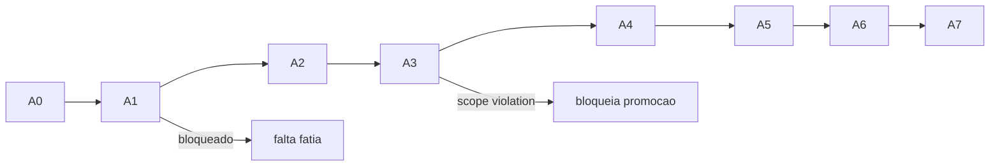

# Atlas Dev Patamares Runbook

## Resumo

Runbook detalhado por patamar A0-A7.

## Papel no Atlas

`atlas-dev-patamares.md` define os 8 patamares. Este doc define COMO promover entre eles.

## Onde Se Encaixa

```text
atlas-dev-index
  +-- atlas-dev-patamares (conceito)
  +-- atlas-dev-patamares-runbook (este doc, runbook)
```

## Contratos

### 8 patamares com fatias canonicas

| Patamar | Nome | Fatias atomicas | DTO principal | Gate promocao |
|---------|------|-----------------|---------------|---------------|
| A0 | Pre-Foundation | esquema dos schemas | n/a | schemas declarados |
| A1 | Foundation | discovery + prompt projection + telemetry + persistence | `atlas.dev.run.v1` | 50 runs verdes A1 |
| A2 | Plan-Visible | desktop SSE + plan stream + receipt visible | `atlas.dev.plan_stream.v1` | 30 sessions plan-visible |
| A3 | Provider-Verified | scope guard runtime + verification receipt + provider attestation | `atlas.dev.scope_guard.v1` | 20 scope_violation=0 |
| A4 | Self-Healing | repair loop runtime + retry policy + drift detection | `atlas.dev.repair_loop.v1` | 15 self-healing recoveries |
| A5 | Surface-Parity | desktop + cli + app + api parity | `atlas.dev.surface.v1` | 4 surfaces feature-equal |
| A6 | Multi-Slice Coordination | parallel slices durable + collision guard local | `atlas.dev.parallel_slice.v1` | 10 multi-slice obras |
| A7 | Self-Improving Dev | propoe own optimization, gates aprovam | `atlas.dev.self_improvement.v1` | 5 self-improvements aprovados |

### DTO principal A1 (`atlas.dev.run.v1`)

```text
{
  "schema": "atlas.dev.run.v1",
  "run_id": "<uuid>",
  "intent_id": "<id>",
  "scope": {"paths": ["..."], "max_files": <int>},
  "discovery": {"context_pack_hash": "sha256:..."},
  "prompt_projection": {"hash": "sha256:..."},
  "telemetry": {"latency_ms_p95": <int>, "tokens_used": <int>},
  "persistence": {"primary_table": "atlas_dev_runs", "evidence_ledger": "..."}
}
```

### DTO A3 (`atlas.dev.scope_guard.v1`)

```text
{
  "schema": "atlas.dev.scope_guard.v1",
  "guard_id": "<uuid>",
  "run_id": "<id>",
  "allowed_paths": ["..."],
  "violations": [{"path":"...","reason":"..."}],
  "verification_receipt_hash": "sha256:..."
}
```

## Fluxo



## Regras para IA

- Atlas Dev fast-path atual e A1; A2 em construcao.
- Promover patamar exige TODAS as fatias verdes do anterior.
- HTTP path integration spec (T1.4) destrava A2 plan-visible.

## Escopo de Implementacao

`AtlasDevRuntimeService`, `AtlasDevPatamarPromotionWatchdog`.

## Dependencias

`atlas-dev-patamares`, HTTP Path Integration Spec (T1.4).

## Evidencias

Comando: `atlas:dev:patamar-status --json`.

## Riscos

Promover prematuramente, fatias mal definidas, DTO drift.

## O que este doc NAO e

Nao e definicao conceitual de patamares (`atlas-dev-patamares.md`); e runbook executavel.

## Exemplos

A1 -> A2: 50 runs A1 verdes registrados, plan stream pronto, desktop SSE pronto. Promocao receipt assinado.

## Proximas Acoes

1. Implementar promotion watchdog.
2. Telemetria por patamar.
3. Integrar com cockpit.
