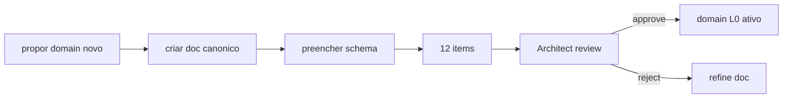

# Atlas Domain Expansion Spec

## Resumo

Como criar novo domain do zero respeitando contratos canonicos.

## Papel no Atlas

15 domains "ready" (programming, self-improvement, finance, etc.). Falta runbook para criar 16o.

## Onde Se Encaixa

```text
atlas-agentic-engineering-os
  +-- atlas-domain-expansion-spec (este doc)
       +-- novos domains seguem template
```

## Contratos

### Schema (`atlas.domain.v1`)

```text
{
  "schema": "atlas.domain.v1",
  "id": "<snake_case>",
  "human_name": "<string>",
  "scope": "<unique no-overlap>",
  "intents_supported": ["..."],
  "departments_touched": ["product","architect","dev","forge","..."],
  "sovereignty_class": "ok_to_share|sensitive|secret|cyber",
  "data_sources": [{"id":"...","kind":"..."}],
  "skills_required": ["atlas.skill.*"],
  "evidence_required": ["..."],
  "gates": ["..."],
  "maturity_level": "L0|...|L7"
}
```

### Checklist obrigatorio (12 items)

1. Doc canonico criado em `docs/engineering-knowledge-base/domains/<id>.md`.
2. Schema `atlas.domain.v1` preenchido.
3. `scope` confirmado sem overlap com 15 atuais.
4. `intents_supported` declarados.
5. `departments_touched` mapeados (minimo 3).
6. `sovereignty_class` declarado.
7. `data_sources` listados com sovereignty class.
8. `skills_required` referenciam Skill Pack Canonical (T4.3).
9. `evidence_required` minimo 3 evidence kinds.
10. `gates` minimo 5 gates (3 universais + 2 domain-specific).
11. `maturity_level=L0` inicial.
12. Architect review approval registrado.

### Cross-dept dependencies obrigatorias

| Domain kind | Depts minimos |
|-------------|---------------|
| programming | product, architect, dev, forge, review, qa, security, delivery, memory |
| finance | product, architect, security, review, qa, delivery, memory |
| marketing | product, research, dev, review, qa, delivery, memory |
| trading | architect, security, qa, delivery, memory + Cyber se novo |
| health | architect, security, qa, delivery, memory (HIPAA-class sovereignty) |

## Fluxo



## Regras para IA

- Domain sem doc canonico nao recebe roteamento.
- Sovereignty sensitive/secret/cyber exige Security dept gate adicional.
- Promote L0 -> L1 segue Department Quality Bar Matrix.

## Escopo de Implementacao

Template doc + `AtlasDomainRegistryService`.

## Dependencias

Department Contract (T1.2), Skill Pack (T4.3), Quality Bar Matrix (T3.3).

## Evidencias

Comando: `atlas:domain:list --json`.

## Riscos

Overlap silencioso, sovereignty mismatch, gate insuficiente.

## O que este doc NAO e

Nao registra domains existentes; e como criar novos.

## Exemplos

Criar domain `cyber`: doc novo, schema preenchido, scope=defense+threat-intel, depts=architect+security+memory, sovereignty=cyber, gates=secret_scan+sandbox_only+no_external_call.

## Proximas Acoes

1. Criar template doc.
2. `AtlasDomainRegistryService`.
3. Validar 15 domains atuais batem schema.
