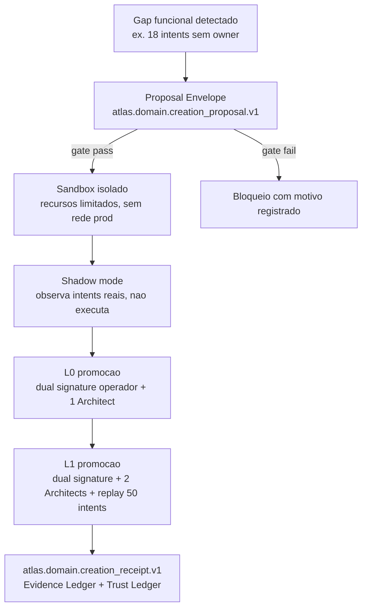
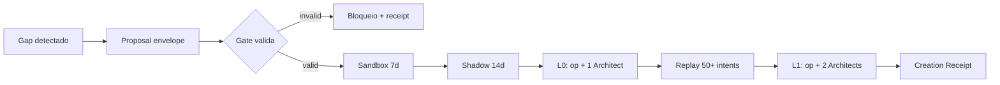

# Atlas Domain Runtime Creation Gate

## Resumo

Gate canonico de governanca que controla o nascimento de qualquer area autonoma nova do Atlas:

- **Domain Runtime novo** (ex. trading, healthcare, design_strategy quando exposto como company runtime externo).
- **Departamento AAEOS novo** (ex. novo departamento dentro do company runtime de engenharia).

Substitui criacao ad-hoc por processo governado com envelope canonico, sandbox isolado, shadow mode observado, dual signature operador e replay deterministico contra intents historicas relevantes.

## Papel no Atlas

Gate (`graph_kind: gate`) sob `atlas-domain-company-runtimes` que se aplica tambem a departamentos AAEOS via cross-flow para `atlas-agentic-engineering-os-department-contract`. Flui para `atlas-aaeos-department-maturity-matrix` e `atlas-autonomy-ladder-promotion-runbook`.

## Onde Se Encaixa



## Contratos

- Nenhum Domain Runtime nem Departamento AAEOS pode nascer sem passar por este gate.
- Proposal envelope obrigatorio: `atlas.domain.creation_proposal.v1`.
- Creation receipt obrigatorio: `atlas.domain.creation_receipt.v1` registrado em Evidence Ledger + Trust Ledger.
- Sequencia obrigatoria: Sandbox (>=7 dias) -> Shadow (>=14 dias) -> L0 -> L1.
- Promocao L0: dual signature operador + 1 Architect.
- Promocao L1: dual signature operador + 2 Architects + replay deterministico >=50 intents historicas com confirmed_rate >=0.95.
- Dominio sensivel exige bloco safety/sovereignty + revisor humano licenciado + threshold elevado de replay (>=100).
- Aplica-se igualmente a departamentos AAEOS internos e Domain Runtimes externos.

## Fluxo Canonico

```text
1. Gap detectado
   Pode ser: emergent (IA detecta padrao de intents sem owner),
   estrategico (operador declara nova funcao a substituir),
   ou regulatorio (compliance obriga area nova).

2. Proposal envelope criado (atlas.domain.creation_proposal.v1)
   IA ou operador preenche envelope com:
     - human_name, canonical_name, technical_name
     - intent_pattern_evidence (intents historicas que motivam criacao)
     - sovereignty_class
     - proposed_gates, proposed_departments, proposed_evidence_sources
     - safety_sovereignty_block (se sensivel)

3. Gate avalia envelope
   - Schema valido?
   - Nome ja existe ou colide com glossary canonico?
   - Dominio sensivel tem bloco safety/sovereignty?
   - Patamar/versao/camada respeitam cartography contract?

4. Sandbox isolado (minimo 7 dias)
   - Recursos limitados (cpu, ram, sem rede producao).
   - Pode executar contra intents sinteticas e replay de intents historicas.
   - Toda saida vai para Evidence Ledger; nada toca producao.

5. Shadow mode (minimo 14 dias)
   - Recebe intents reais mas NAO executa: apenas registra o que faria.
   - Operador + Architect comparam shadow decisions contra atual handler.
   - Drift > threshold canonico bloqueia.

6. Promocao L0 (limited)
   - Dual signature: operador + 1 Architect agent independente.
   - Executa apenas intents marcadas L0-safe pelo gate.
   - Janela observada minimo 14 dias.

7. Promocao L1 (active)
   - Dual signature: operador + 2 Architects independentes.
   - Replay deterministico de >= 50 intents historicas relevantes
     confirmando comportamento esperado.
   - Reality outcome gates avaliados.
   - Receipt canonico atlas.domain.creation_receipt.v1 emitido.

8. Pos-L1: ladder normal
   Promocao L2+ segue atlas-autonomy-ladder-promotion-runbook.
```

## Schema Canonico do Proposal Envelope

```text
{
  "schema": "atlas.domain.creation_proposal.v1",
  "proposal_id": "<uuid>",
  "kind": "domain_runtime|department",
  "human_name": "<string>",
  "canonical_name": "<string>",
  "technical_name": "<snake_case>",
  "acronym": "<string|null>",
  "owner_role": "<role>",
  "sovereignty_class": "ok_to_share|sensitive|secret|cyber",
  "intent_pattern_evidence": [
    { "intent_id": "<id>", "sample_count": <n>, "first_seen": "<iso8601>" }
  ],
  "proposed_gates": ["<gate_id>"],
  "proposed_departments": ["<dept_id>"],
  "proposed_evidence_sources": ["<source>"],
  "proposed_universal_gates_inherited": ["<gate_id>"],
  "proposed_reality_gates_applicable": ["<gate_id>"],
  "safety_sovereignty_block": { ... },
  "proposed_by_actor": { "kind": "agent|operator", "id": "<id>" },
  "proposed_at": "<iso8601>"
}
```

## Schema Canonico do Creation Receipt

```text
{
  "schema": "atlas.domain.creation_receipt.v1",
  "receipt_id": "<uuid>",
  "proposal_id": "<uuid>",
  "promotion_level": "L0|L1",
  "promoted_at": "<iso8601>",
  "operator_signature": "<sig>",
  "architect_signatures": ["<sig>", "<sig>"],
  "replay_evidence": {
    "intents_replayed_count": <n>,
    "expected_behavior_confirmed_count": <n>,
    "drift_observed_count": <n>
  },
  "sandbox_duration_days": <n>,
  "shadow_duration_days": <n>,
  "reality_gate_baseline_status": "green|yellow|red",
  "evidence_pack_refs": ["<sha256:*>"],
  "trust_ledger_entry_id": "<id>"
}
```

## Criterios de Promocao

### Para L0 (limited)

```text
gate_l0_promotion:
  proposal_envelope_valid: required
  sandbox_completed_min_days: 7
  shadow_completed_min_days: 14
  operator_signature: required
  architect_signature_count: 1
  safety_sovereignty_block_if_sensitive: required
  no_name_collision_with_glossary: required
  cartography_nomenclature_respected: required
```

### Para L1 (active)

```text
gate_l1_promotion:
  l0_promoted_min_days: 14
  operator_signature: required
  architect_signature_count: 2
  replay_intents_count_min: 50
  replay_expected_behavior_confirmed_min_rate: 0.95
  reality_gate_baseline_status_not_red: required
  evidence_pack_complete: required
  trust_ledger_entry_emitted: required
```

## Bloco Obrigatorio Safety / Sovereignty

Aplicado quando `sovereignty_class in {sensitive, secret, cyber}` ou quando dominio esta em {legal, healthcare, finance, trading, cyber}:

```text
sovereignty_class: sensitive | secret | cyber
operation_mode: assistive | research | draft | analysis only
no_autonomous_professional_advice: true
licensed_human_review_required: true
jurisdiction_check_required: true
consent_chain_verified_required: true
audit_trail_complete_required: true
liability_carrier_documented_required: true
policy_gate_passed_required: true

forbidden_actions:
  - Promocao L0 sem revisor humano licenciado revisando shadow output.
  - Promocao L1 sem dual signature + licensed reviewer + replay >= 100 intents (acima do baseline 50).
  - Federation cross-Atlas envolvendo este dominio.
  - Acao autonoma profissional vinculante sem signature humana.
```

## Regras para IA

- IA NAO pode criar classes/services para um dominio novo antes do receipt L0 emitido.
- Proposal envelope sem `intent_pattern_evidence` minimo (>= 5 intents distintas em janela 30 dias) e invalido.
- Nome canonico proposto deve passar por checagem em `atlas-canonical-glossary-and-naming.md` para evitar colisao.
- Patamar/versao/camada propostos devem respeitar `atlas-cartography-nomenclature-contract.md`.
- Replay deterministico para L1 deve usar intents historicas reais, nao sinteticas.
- Bloco safety/sovereignty e obrigatorio em dominios sensiveis sem excecao.

## O que este gate NAO e

- NAO autoriza criacao livre de departamento; e gate restritivo.
- NAO substitui `atlas-aaeos-department-maturity-matrix`; complementa para o caso de nascimento.
- NAO se aplica a sub-modules dentro de departamento ja promovido (esses seguem ladder normal).
- NAO se aplica a renomeacao de departamento existente (esse caso vai por glossary update).

## Fluxo



## Escopo de Implementacao

- Extensao de runtime deve compor `DomainManifestRegistryService`, `DomainRuntimeSelectionService`, `DomainMaturityAssessmentService` e `DepartmentContractRuntime`; nao criar authority paralela.
- Schemas `atlas.domain.creation_proposal.v1` e `atlas.domain.creation_receipt.v1` registrados em `atlas-contract-schema-registry`.
- CLI futura deve preferir extender `atlas:ai:domain-runtime` e comandos AAEOS existentes antes de criar namespace novo.
- Cross-link runtime com `atlas-aaeos-department-maturity-matrix` para departamento e `atlas-autonomy-ladder-promotion-runbook` para domain runtime.
- Sandbox runtime usa container isolado sem rede producao; shadow usa intent stream real em modo dry-run.

## Dependencias

Dependencias canonicas declaradas em `depends_on`. Resumo:

- `atlas-domain-company-runtimes` (parent canonico).
- `atlas-agentic-engineering-os-department-contract` (parent paralelo para departamento).
- `atlas-evidence-certification-runtime` (registra creation receipts).
- `atlas-trust-ledger-canonical` (registra learning capsules da proposal).
- `atlas-canonical-glossary-and-naming` (validador de colisao de nome).
- `atlas-cartography-nomenclature-contract` (respeito patamar/versao/camada).
- `domains/domain-routing-governance.md` (Domain Creation Gate canonico existente).

## Evidencias

- Este doc canonico.
- Schemas `atlas.domain.creation_proposal.v1` e `atlas.domain.creation_receipt.v1` quando registrados.
- Comando `php artisan atlas:domain:status --json` listando domains/departamentos em proposal/sandbox/shadow/L0/L1.
- Trust Ledger eventos `domain_proposal_submitted`, `domain_promoted_l0`, `domain_promoted_l1`, `domain_proposal_archived`.
- Receipts armazenados em `evidence/domain-creation/<receipt_id>.json`.

## Exemplos

### Exemplo 1: Departamento `design_strategy` nasce

- IA detecta 18 intents distintos em 30 dias tocando design system end-to-end.
- Nenhum departamento AAEOS cobre.
- IA cria `atlas.domain.creation_proposal.v1` para departamento `design_strategy`, sovereignty_class=ok_to_share.
- Gate valida envelope, sem colisao no glossary.
- Sandbox 7 dias, shadow 14 dias.
- Promocao L0 com signature operador + 1 Architect.
- Apos 14 dias L0, replay de 50 intents historicas confirma comportamento.
- Promocao L1 com dual signature + 2 Architects.
- Receipt emitido, Trust Ledger registra.

### Exemplo 2: Domain Runtime `trading` nasce (sensivel)

- Operador declara intent estrategico de criar trading domain.
- Proposal envelope criado com sovereignty_class=secret + bloco safety/sovereignty completo.
- Gate exige licensed reviewer humano (corretora certificada) revisar shadow output.
- Sandbox 7 dias com market data sintetica.
- Shadow 14 dias com market data real mas zero ordem real.
- L0 promovido com revisor licenciado + dual signature.
- Para L1: replay >= 100 intents historicas (threshold elevado por ser sensivel) + revisor + dual signature.
- Receipt emitido com licensed_human_review_required=true.

## Riscos

- **Critico**: IA bypassa gate criando classes para domain antes de receipt. Mitigacao: validator no docs-health + Architect review.
- **Critico**: dominio sensivel promovido sem licensed reviewer. Mitigacao: enforcement no gate L0/L1 com receipt obrigatorio.
- **Alto**: replay com intents sinteticas escondendo comportamento real. Mitigacao: validator de provenance em `replay_evidence`.
- **Medio**: drift entre proposal envelope e implementacao real apos L1. Mitigacao: docs-health diff entre proposal e runtime.

## Proximas Acoes

1. Implementar `AtlasDomainRuntimeCreationGateService`.
2. Registrar `atlas.domain.creation_proposal.v1` e `atlas.domain.creation_receipt.v1` no Contract Schema Registry.
3. CLI: `php artisan atlas:domain:proposal --json`, `atlas:domain:promote --to=L0|L1 --json`.
4. Cross-link com `atlas-aaeos-department-maturity-matrix` para o caso departamento.
5. Cross-link com `atlas-autonomy-ladder-promotion-runbook` para o caso domain runtime.
