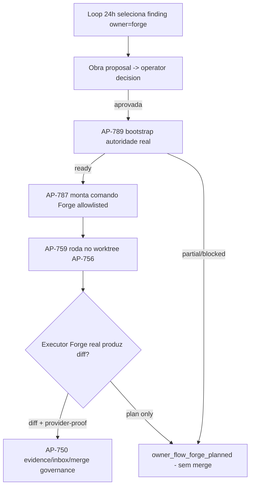

# Atlas Forge Real Autonomous Authority · Build Plan

> Status: `future` (plan-only). Este doc NAO autoriza implementacao. Cada slice
> exige seu proprio AP + place-feature + session-bootstrap antes de codigo.
> Build GRANDE: nao finja que e pequeno. Honra as leis da sessao
> (provider-proof, no-final-scaffold, diff-scoped PHP quality gate).

## 1. Objetivo e Escopo

Hoje o loop 24h executa merges REAIS apenas via `owner=atlas_dev` (senior-loop
MiniMax). `owner=forge` e honestamente **plan-only**: termina em
`owner_flow_forge_planned` sem nunca chegar a merge
(`Ap786OwnerFlowExecutor::execute()` linhas 322-358). O objetivo deste plano e
permitir que o loop dispare uma **Obra Forge real e autonoma** com autoridade
**derivada do real**, sem jamais fabricar Obra, topology, decisao ou prontidao
de workspace. Fora de escopo: trocar o owner=atlas_dev; alterar quality gates;
qualquer bypass do provider router.

## 2. Estado Atual (o que JA existe, com evidencia)

- AP-787 — `ForgeOwnerRuntimeDispatchBridge.php`: monta comando Forge allowlisted
  (`atlas:forge:runtime-dispatch`) governado, nunca o provider router
  (`provider_router_used=false`, linha 166). Bloqueia honesto sem Obra/topology/
  decisao (linhas 59-75). `runtime-dispatch` e `plan_only=true` (linhas 44, 97).
- AP-788 — flags de injecao de autoridade no CLI (`--forge-obra`,
  `--forge-live-topology-json`, `--forge-live-decision-json`, etc.).
- AP-789 — `ForgeLiveAuthorityBootstrapService.php`: DERIVA autoridade do real via
  4 ports; `status=ready` so com topology + decisao viva + AWIS reais
  (linhas 149-153). Nunca fabrica Obra/decisao (linhas 82-123, 271-280).
- Ports REAIS bindados em `AppServiceProvider.php` linhas 116-119:
  `ForgeProviderTopologyPort -> AtlasForgeProviderTopologyService`,
  `ForgeLiveDecideReceiptPort -> AtlasDecideService`,
  `AwisExecutionGatePort -> AtlasWorkspaceIntelligenceExecutionGateService`,
  `AwisHandoffPackPort -> AtlasWorkspaceHandoffPackService`.
- CLI `--bootstrap-forge-authority` injeta `forge_inputs` quando ready
  (`AtlasSoftwareCompanyReliable24hLoopCommand.php` linhas 86-99;
  `AtlasSoftwareCompanyAutonomousEvolutionSessionCommand.php` linhas 77-91).
- Comandos Forge existem: `AtlasForgeRuntimeDispatchCommand.php`,
  `AtlasForgeProviderInvokeCommand.php`, `AtlasForgeParallelDurableCommand.php`.

## 3. O que FALTA para execucao Forge autonoma real

1. **Obra real autonoma**: nenhum caminho cria/seleciona uma `AtlasProject`
   (Obra) dentro do loop. `grep AtlasProject::create` em SoftwareCompanyStewardship
   retorna vazio. Hoje o `--forge-obra` e suprido pelo operador.
2. **Caminho de execucao mutativo Forge**: `AtlasForgeRuntimeDispatchService` e
   READ-MODEL (linha 16: "never mutates Obra state", `external_provider_call=false`
   linha 537). `runtime-dispatch` so produz `dispatch_planned` — zero changed
   files. Logo, owner=forge nunca pode completar (linha 354 do executor exige
   `changed_files !== []`). Falta um executor Forge real que produza diff
   (multi-agente / parallel-durable / provider-invoke governado) dentro do
   worktree AP-756, com provider-proof.
3. **Decision Receipt vivo end-to-end**: AP-789 deriva receipt do Atlas Decide,
   mas depende de topology viva (`runtime_dispatch_allowed=true`), hoje fechada
   por capacidade esgotada (provider constraint 2026-05; topology service linhas
   188-202). Falta orquestrar a producao de um fast-path/decision real quando
   capacidade existe.
4. **AWIS pronto autonomamente**: gate + handoff pack reais existem mas precisam
   que o workspace esteja certificado; falta o passo que conduz a certificacao
   AWIS dentro do loop (hoje bloqueia com `awis_execution_gate_blocked` /
   `workspace_handoff_pack_blocked`).
5. **Fechamento do ciclo Forge**: AP-750/evidence/inbox/merge governance para um
   resultado Forge real (nao plan) ainda nao foi exercitado com diff real.

## 4. Pecas que DEVEM permanecer operator/governance-gated (anti-falsa-execucao)

NAO auto-fabricar. Por design, cada uma exige autoridade humana/governanca:

- **Criacao/selecao de Obra**: uma Obra governada e autorizacao de trabalho. O
  loop pode PROPOR, nunca materializar sem decisao do operador.
- **Operator actor / authorization**: `forge_operator_actor_required`
  (`ForgeLiveAuthorityBootstrapService` linhas 239-244) — nunca fabricado.
- **Decision Receipt vivo**: `live_decide_receipt_required` (linhas 271-280) —
  nunca simulado; deriva do Atlas Decide real ou bloqueia.
- **Provider execution + budget**: `forge_provider_authorization_required` /
  `forge_budget_approval_required` (AP-787 linhas 130-135) para
  `provider-invoke --mode=execute`.
- **Certificacao AWIS**: prontidao de workspace e gate de seguranca, nao um flag.

Regra-mae: `status=ready` jamais vem de shape sintetico (AP-789 claim_policy
`ready_from_synthetic_shape=false`, linha 588). Mocks/Fakes so em teste.

## 5. Arquitetura alvo (fluxo end-to-end)

A diferenca chave vs hoje: o ramo `F -> diff real` ainda nao existe; tudo cai em
`H`. Slices 3-5 constroem `F` com provider-proof e gates.

## 6. Decomposicao em slices ordenados (cada um com aceite + guarda)

| Slice | Entrega | Aceite | Guarda de autoridade/seguranca |
|---|---|---|---|
| S1 | **Forge Obra Proposal (read/proposal-only)** — loop emite proposta de Obra a partir do finding; nao cria AtlasProject | Proposta com finding_hash + spec_seed; `created_obra=false`; receipt de proposta | NAO cria Obra; exige decisao operador para materializar |
| S2 | **Operator Obra Decision -> real Obra id** — superficie de decisao que, se aprovada pelo operador, retorna `forge_obra` real para o loop | accept gera obra_id real via fluxo Forge existente; reject/defer nao executam | Obra so nasce de decisao explicita; `auto_decided=false` |
| S3 | **Forge Real Execution Adapter** — substitui plan-only por executor que roda parallel-durable/provider-invoke governado no worktree AP-756 e captura diff | Run produz `changed_files` dentro de allowed scope + `owner_cli_provider_calls>0` | provider-proof obrigatorio; sem provider real = blocked, nunca scaffold |
| S4 | **Live Decision + AWIS readiness orchestration** — conduz producao de Decision Receipt vivo e certificacao AWIS quando capacidade existe | AP-789 retorna `ready` com refs reais (topology id, decide receipt id, awis ready) | nunca simula receipt; nunca auto-certifica AWIS sem o fluxo real |
| S5 | **Forge cycle close + merge governance** — AP-750 + FinalDeliveryQualityGate + diff-scoped PHP gate para diff Forge real | merge so com `completed` (linha 351-355); plan continua `partial` | no-final-scaffold + provider-proof + pre-merge inbox gate |
| S6 | **Loop24h certification + receipt integrity** — estende AP-791/Loop24hCertificationHarness para o caminho Forge real | ciclo Forge real auditavel; planned != completed | receipt honesto; `merge_not_performed` impossivel de mascarar |

## 7. Contratos e schemas

- Reusar `atlas.software_company_stewardship.ap789_forge_live_authority_bootstrap.v1`
  e `...ap787_forge_owner_runtime_dispatch.v1` (nao duplicar).
- Novos (por slice): `...forge_obra_proposal.v1` (S1),
  `...forge_obra_operator_decision_receipt.v1` (S2),
  `...forge_real_execution_result.v1` (S3). Espelhar shape AP-724/AP-765.
- Manter `provider_router_used=false`, `fabricated_obra=false`,
  `claim_policy` hardcoded (sem benchmark/rivals/superiority/external_rivals).

## 8. Riscos e mitigacoes

- **Risco: falsa execucao** (reportar completed sem trabalho real). Mitigacao:
  manter regra das linhas 343-358 do executor (provider-proof + changed_files);
  FinalDeliveryQualityGate bloqueia step-N-of-M/mock/TODO.
- **Risco: capacidade de provider esgotada** (constraint 2026-05). Mitigacao:
  topology fail-closed ja existe; slices degradam para `partial/blocked`, nunca
  fabricam topology viva.
- **Risco: drift multi-agente** (outro Claude no mesmo tree). Mitigacao: commit
  em `main`, checkout -B nao-destrutivo, nao reescrever owners existentes.
- **Risco: Obra fantasma**. Mitigacao: `isValidObraId` rejeita fake/placeholder/
  zero (AP-787 linhas 190-201; AP-789 linhas 601-611).

## 9. Estrategia de testes

- Unit por slice com Fakes dos 4 ports (permitido SO em teste); runtime usa os
  reais de `AppServiceProvider`.
- Provider-proof: teste que prova que diff Forge sem provider call = blocked.
- Honestidade: teste que `ready` nunca emerge de shape sintetico.
- Regressao: suites AP-786/787/789, Reliable24hLoop, AutonomousEvolutionSession.
- Diff-scoped PHP tier (`ShellCyclePhpTierRunner`) em todo diff novo.

## 10. Sequenciamento e dependencias

S1 -> S2 (proposta antes de decisao) -> S3 (precisa de Obra real) e em paralelo
S4 (autoridade) -> S5 (precisa de S3 diff + S4 ready) -> S6 (certifica o todo).
S3 e o slice mais pesado (executor mutativo real) e o de maior risco; nao iniciar
antes de S1/S2 estabilizados. Nenhum slice e "pequeno".

## 11. Definicao de pronto (DoD do programa)

Um ciclo do loop 24h: seleciona finding owner=forge -> proposta -> decisao do
operador -> Obra real -> AP-789 ready (topology+decide+AWIS reais) -> AP-787
comando -> AP-759 executor Forge real produz diff com provider-proof -> AP-750
evidence/inbox -> merge governado. Tudo auditavel; planned != completed; zero
fabricacao; zero scaffold.

## 12. Confianca e lacunas (perguntas ao operador/SME)

- **Alta confianca**: AP-787/788/789 existem, ports reais bindados, owner=forge e
  honestamente plan-only hoje (evidencia citada).
- **Lacuna**: nao confirmei o fluxo canonico de criacao de Obra governada
  (AtlasProject) — qual comando/superficie o operador usa hoje? (necessario p/ S2)
- **Lacuna**: se `parallel-durable` ou `provider-invoke --mode=execute` ja produz
  diff real no worktree, ou se precisa de novo adapter (S3).
- **Lacuna**: criterio operacional de "capacidade existe" para destravar S4 sob a
  constraint de provider de 2026-05.
- **Pergunta de governanca**: o operador aceita que o loop PROPONHA Obras
  automaticamente (S1) desde que a materializacao continue gated (S2)?
