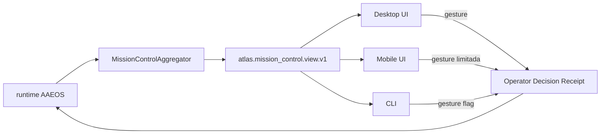

# Atlas Mission Control Cockpit Spec

## Resumo

Spec canonica da cabine unica que o gestor humano usa para operar 9+ departamentos do AAEOS em tempo real. Define wireframe, schema da view, surface adapters, Operator Decision Receipt e gestures de autonomia. **Sem esta cabine, o AAEOS opera como prompt-IDE; com a cabine, vira organizacao governavel.**

## Papel no Atlas

Hoje existem peças isoladas:
- `atlas-code-obra-command-center-v1.md` (foco em Obras)
- `atlas-code-attention-control-plane.md` (foco em atencao do operador)
- `atlas-code-forge-ux-orchestrator.md` (foco em UX do Forge)
- `atlas-code-long-session-programming-cockpit.md` (foco em sessao longa)

Nenhuma e a cabine que mostra os 9 departamentos AAEOS simultaneamente. **Este doc define essa cabine canonica como composicao governada das peças existentes**.

## Onde Se Encaixa

```text
atlas-agentic-engineering-os
  +-- atlas-agentic-engineering-os-runbook         (17 fases)
  +-- atlas-agentic-engineering-os-department-contract (11 deptos)
  +-- atlas-mission-control-cockpit-spec           (este doc, cabine)
       +-- compoe: ObraCommandCenter, AttentionControlPlane, ForgeUxOrchestrator, LongSessionCockpit
```

## Contratos

### Wireframe canonico (12 zonas)

```text
+-------------------------------------------------------------------+
| ZONE 1: header                                                    |
| operator | session | autonomy_level | open_obras | blockers       |
+-------------------------------------------------------------------+
| ZONE 2: department status grid (9-11 cards, sempre visiveis)      |
| product | architect | research | dev | debug | review |           |
| qa     | security  | forge    | delivery | memory                |
+-------------------------------------------------------------------+
| ZONE 3: active phase tracker                                      |
| (P0 -> P16 com fase atual e proxima)                              |
+-------------------------------------------------------------------+
| ZONE 4: queue / blockers                                          |
| (intents aguardando, blockers por severidade)                     |
+-------------------------------------------------------------------+
| ZONE 5: pending decision receipts                                 |
| (recibos aguardando assinatura do operador)                       |
+-------------------------------------------------------------------+
| ZONE 6: evidence ledger live                                      |
| (eventos append-only recentes com hash + replay link)             |
+-------------------------------------------------------------------+
| ZONE 7: cartografia ativa                                         |
| (mapa visual de servicos/dominios tocados pela Obra atual)        |
+-------------------------------------------------------------------+
| ZONE 8: autonomy ladder atual + proxima promocao                  |
+-------------------------------------------------------------------+
| ZONE 9: provider topology (mix ativo, fallback chain, custo)      |
+-------------------------------------------------------------------+
| ZONE 10: anti-fragility metrics                                   |
| (N x M atual, baseline provider, multiplier Atlas)                |
+-------------------------------------------------------------------+
| ZONE 11: operator gestures bar                                    |
| approve_milestone | veto_dept | pause_obra | promote_ladder |     |
| force_replay | force_handoff | sign_receipt                       |
+-------------------------------------------------------------------+
| ZONE 12: footer                                                   |
| trust ledger score | acos health | docs-health | last drift       |
+-------------------------------------------------------------------+
```

### Schema canonico da view (`atlas.mission_control.view.v1`)

```text
{
  "schema": "atlas.mission_control.view.v1",
  "operator_id": "<id>",
  "session_id": "<id>",
  "as_of": "<iso8601>",
  "header": {
    "autonomy_level": "L0|...|L7",
    "open_obras_count": <int>,
    "open_blockers_count": <int>
  },
  "departments": [
    {"id": "<dept_id>", "status": "idle|busy|blocked|escalated",
     "active_intent_id": "<id_or_null>",
     "current_phase": "<phase_or_null>",
     "blockers": [{"id": "...", "severity": "..."}],
     "maturity_level": "L0|...|L7"}
  ],
  "active_phase_tracker": {
    "intent_id": "<id_or_null>",
    "current_phase": "<phase>",
    "next_phase": "<phase>",
    "blockers": [{"id": "...", "severity": "..."}]
  },
  "queue": [{"intent_id": "...", "priority": "...", "since": "..."}],
  "pending_receipts": [{"receipt_id": "...", "kind": "...", "intent_id": "...", "deadline": "..."}],
  "evidence_recent": [{"hash": "sha256:...", "kind": "...", "timestamp": "..."}],
  "cartography_active": {"obra_id": "<id_or_null>", "domains_touched": ["..."], "services_touched": ["..."]},
  "autonomy": {"current": "L<n>", "next_eligible": "L<m>", "blockers_to_promote": ["..."]},
  "provider_topology": {"profile": "<profile_id>", "active_providers": ["..."], "fallback_chain": ["..."], "cost_so_far_usd": <float>},
  "antifragility": {"baseline_provider_score": <float>, "atlas_multiplier": <float>, "current_n_times_m": <float>},
  "trust_ledger_score": <float>,
  "acos_health": "ok|degraded|down",
  "docs_health": "ok|warn|fail",
  "last_drift_detected_at": "<iso8601_or_null>"
}
```

### Surface adapters

| Surface | Papel | Capacidades minimas | Limites |
|---------|-------|---------------------|---------|
| Desktop Mac | primaria | todas as 12 zonas, todas as gestures, replay E2E | requires local Atlas runtime |
| Mobile (iOS) | secundaria | zonas 1, 2, 3, 4, 5, 11 (subset gestures: approve/veto/pause/sign) | nao replay, nao force_handoff |
| CLI | debug + replay | `atlas:mission-control:view --json`, `atlas:mission-control:replay <obra_id>`, todas as gestures via flags | nao tem visualizacao rica |
| API (futuro headless) | integracao | snapshot da view, stream de eventos | nao executa gestures |

### Operator Decision Receipt schema (`atlas.operator.decision_receipt.v1`)

Distinto do `decision_receipt.v2` emitido por agentes. Aqui o operador humano e o ator.

```text
{
  "schema": "atlas.operator.decision_receipt.v1",
  "receipt_id": "<uuid>",
  "operator_id": "<id>",
  "session_id": "<id>",
  "gesture": "approve_milestone|veto_dept|pause_obra|promote_ladder|force_replay|force_handoff|sign_intent_receipt",
  "target": {
    "kind": "obra|department|intent|ladder",
    "id": "<id>"
  },
  "context_hash": "sha256:<view_snapshot_at_decision>",
  "evidence_hashes_seen": ["sha256:..."],
  "rationale": "<string>",
  "constraints_added": [{"id": "...", "value": "..."}],
  "rollback_window_seconds": <int>,
  "operator_signature": "<sig>",
  "signed_at": "<iso8601>"
}
```

### Gestures canonicas

| Gesture | Pre-req | Effect | Receipt obrigatorio |
|---------|---------|--------|---------------------|
| `approve_milestone` | milestone aguardando + evidence_hashes assinaveis | libera proxima fase | sim |
| `veto_dept` | departamento ativo + rationale | pausa departamento, escalada Architect | sim |
| `pause_obra` | obra ativa | freeze runtime, preserva state | sim |
| `promote_ladder` | autonomy.next_eligible verde | promove L<n> -> L<n+1> | sim, dual signature se L4+ |
| `force_replay` | obra completa com evidence intact | dispara replay determinístico | sim |
| `force_handoff` | sessao ativa + handoff pack pronto | exporta Session Handoff Pack | sim |
| `sign_intent_receipt` | pending receipt aguardando | aplica `decision_receipt.v2` ao intent | sim |

## Fluxo



## Regras para IA

- Toda gesture exige Operator Decision Receipt assinado; agente nunca emite gesture.
- A view e somente-leitura para qualquer agente; mutacao via gesture e canonica.
- View atualiza-se em <=2 segundos; drift maior que 2s vira alerta `cockpit_drift_detected_count`.
- 12 zonas sao obrigatorias; zona oculta exige decision receipt do operador para a sessao.
- Operator Decision Receipt assinado nunca e revogado; correcao gera novo receipt.

## Escopo de Implementacao

Servicos canonicos esperados:
- `AtlasMissionControlCockpitService` (compoe view)
- `AtlasMissionControlAggregatorService` (agrega de 9+ departamentos)
- `AtlasOperatorDecisionReceiptService` (emite receipts)
- `AtlasMissionControlEventStreamService` (stream para Desktop/Mobile)

Reutilizar:
- `ObraCommandCenter` (zona 7 cartografia)
- `AttentionControlPlane` (zona 4 queue/blockers)
- `ForgeUxOrchestrator` (zona 9 provider topology)
- `LongSessionProgrammingCockpit` (zona 8 autonomy)

## Dependencias

Ver frontmatter. Resumo: depende de AAEOS, runbook, department contract. Flui para Cross-Department Choreography (T2.4) e Autonomy Ladder Promotion Runbook (T2.1).

## Evidencias

- Doc canonico
- Comando esperado: `php artisan atlas:mission-control:view --json` retorna view atual.
- Comando esperado: `php artisan atlas:mission-control:gesture --kind=<g> --target=<id> --json` emite Operator Decision Receipt.

## Riscos

- **Drift cockpit vs runtime**: estado real diverge da view. Mitigacao: heartbeat 1s + reconciliation hash.
- **Gesture sem evidence**: operador aprova sem ver hashes. Mitigacao: schema obriga `evidence_hashes_seen`.
- **Autonomy promotion prematura**: L4+ promovido sem dual signature. Mitigacao: gate `autonomy-gesture-blocks-without-receipt`.
- **Surface fragmentada**: Mobile faz mais que deveria. Mitigacao: tabela de capacidades minimas e limites e canonica.

## O que este doc NAO e

- Nao e a doc-mae do AAEOS.
- Nao e o ObraCommandCenter (continua sendo doc proprio).
- Nao e implementacao UI; e contrato declarativo da view e gestures.
- Nao substitui Architect review nas gestures L4+; complementa com receipt formal.

## Exemplos

### Exemplo de gesture: `approve_milestone`

```text
{
  "schema": "atlas.operator.decision_receipt.v1",
  "receipt_id": "rcpt-001",
  "operator_id": "vitor",
  "session_id": "sess-2026-05-26",
  "gesture": "approve_milestone",
  "target": {"kind": "obra", "id": "obra-notif-001"},
  "context_hash": "sha256:view-snapshot-001",
  "evidence_hashes_seen": ["sha256:abc...", "sha256:def..."],
  "rationale": "milestone P11 verde, 12 acceptance criteria atendidos, load test 100k passou",
  "constraints_added": [],
  "rollback_window_seconds": 600,
  "operator_signature": "ed25519:...",
  "signed_at": "2026-05-26T18:42:00Z"
}
```

## Proximas Acoes

1. Implementar `AtlasMissionControlCockpitService.buildView()` que retorna `atlas.mission_control.view.v1`.
2. Implementar `AtlasOperatorDecisionReceiptService.emit($gesture, $target, $context)` com validacao de schema.
3. Implementar `php artisan atlas:mission-control:view --json` e `atlas:mission-control:gesture --json`.
4. Spec separada de Desktop UI (fora do escopo deste doc; este doc define contrato, nao implementacao UI).
5. Adicionar gates docs-health: `mission-control-9-departments-visible` e `mission-control-gestures-have-receipt-schema`.
