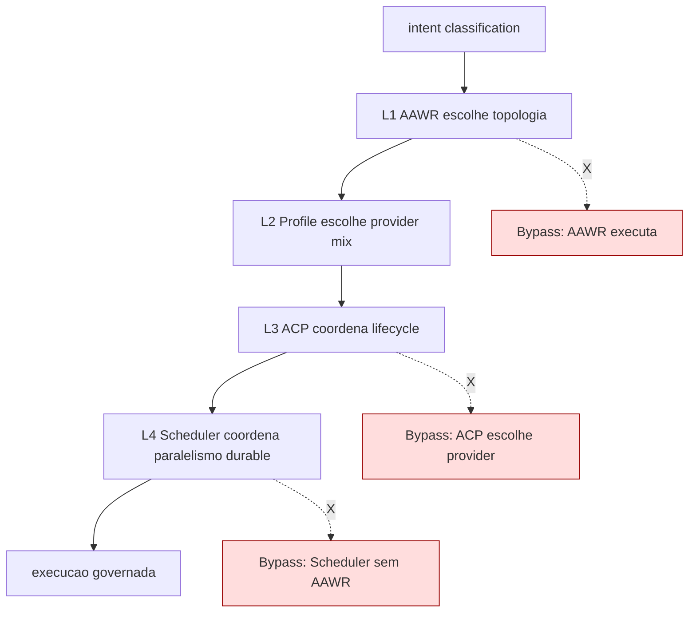

# Atlas Multi-Agent Unified Architecture

## Resumo

Doc canonica que consolida em uma unica autoridade as quatro camadas multi-agente do Atlas: AAWR (topologia organizacional), Multi-Provider Agent Orchestration Profiles (selecao de mix), Agent Control Plane (lifecycle execucao) e Forge Multi-Agent Scheduler (paralelismo durable). Define boundary explicita, matriz de decisao e antipadrao contra quinta camada.

## Papel no Atlas

Hoje multi-agente vive em quatro docs separados sem doc-mae unificada. Consequencia: o Self-Construction OS Agent Control Plane explodiu em 292 services com nomes de 200+ chars (visto em `atlas-ai-self-construction-os.md`). **Esta doc e o substrato canonico** que evita repetir o sprawl em Forge ou em qualquer extensao futura.

## Onde Se Encaixa

```text
atlas-agentic-engineering-os
  +-- atlas-multi-agent-unified-architecture (este doc)
        +-- camada 1: AAWR
        +-- camada 2: Multi-Provider Profiles
        +-- camada 3: Agent Control Plane
        +-- camada 4: Forge Multi-Agent Scheduler
```

## Contratos

### As 4 camadas canonicas

| # | Camada | Decide | Doc owner | Servico canonico |
|---|--------|--------|-----------|------------------|
| 1 | AAWR (Agentic Workcell Runtime) | **topologia organizacional** entre agentes (single, pair, debate, swarm, etc.) | `atlas-agentic-workcell-runtime.md` | `AtlasAgenticWorkcellRuntime*` |
| 2 | Multi-Provider Profiles | **mix de providers** (scout, builder, reviewer, judge) por intent_class | `self-construction/multi-provider-agent-orchestration-contract.md` | `AtlasDecideOrchestrator + AtlasMultiProviderProfileService` |
| 3 | Agent Control Plane (ACP) | **lifecycle de execucao** (start, heartbeat, dispatch, claim, release, merge) | `self-construction/agent-control-plane-contract.md` | `AtlasAgentControlPlane*` |
| 4 | Forge Multi-Agent Scheduler | **paralelismo durable** (reservation ledger, worktree, collision guard, merge review) | `atlas-forge-continuum-os.md` | `AtlasForgeMultiAgentScheduler*` |

### Boundary canonica (o que NAO atravessa)

- **AAWR nao escolhe provider**. Topologia decide quantos agentes e em que padrao; quem sao os providers vem da camada 2.
- **Profiles nao executam**. Profile escolhe mix; execucao vem da camada 3.
- **ACP nao decide topologia nem provider**. Recebe decisoes das camadas 1+2 e governa lifecycle.
- **Scheduler nao decide topologia nem provider nem lifecycle individual**. Coordena paralelismo entre execucoes ja governadas pelas camadas 1+2+3.

### Schema canonico de decisao multi-agente (`atlas.multi_agent.decision.v1`)

```text
{
  "schema": "atlas.multi_agent.decision.v1",
  "intent_id": "<uuid>",
  "topology": {
    "kind": "single|pair|trio|debate|swarm|debate_with_judge|swarm_review|chain_of_specialists",
    "size": <int>,
    "rationale": "<string>"
  },
  "provider_profile": {
    "scout": "<provider_id_or_null>",
    "builder": "<provider_id>",
    "reviewer": "<provider_id_or_null>",
    "judge": "<provider_id_or_null>",
    "fallback_chain": ["<provider_id>"]
  },
  "lifecycle": {
    "agents": [{"agent_id": "<id>", "role": "<role>", "provider": "<id>", "scope_hash": "<sha256>"}],
    "heartbeat_interval_seconds": <int>,
    "dispatch_strategy": "sequential|parallel|conditional"
  },
  "scheduler": {
    "parallelism_mode": "single|parallel_durable",
    "max_parallel_agents": <int>,
    "reservation_strategy": "exclusive|sharded|read_only",
    "merge_strategy": "auto|review_required|architect_approval"
  },
  "evidence_hashes": ["sha256:..."]
}
```

### 8 topologias canonicas (camada 1)

1. `single` — 1 agente, sem paralelismo. Default para R1.
2. `pair` — builder + reviewer sequencial. R2.
3. `trio` — scout + builder + reviewer. R2-R3.
4. `debate` — 2-3 agentes argumentam, sem judge. Architect spec.
5. `debate_with_judge` — debate + judge desempata. Spec critico R4+.
6. `swarm` — N agentes paralelos sem coordenacao tight. Forge R3-R4.
7. `swarm_review` — swarm + review final cruzado. Forge R4-R5.
8. `chain_of_specialists` — sequencia de roles especializados (research -> spec -> impl -> review -> security). Enterprise.

### 5 provider profiles canonicos (camada 2)

1. `claude_solo` — Claude Code para tudo. Default tactico.
2. `codex_solo` — Codex para tudo. Default headless.
3. `claude_codex_pair` — Claude builder + Codex reviewer. R2-R3.
4. `gemini_scout_claude_builder_codex_reviewer` — trio cross-provider. R3-R4.
5. `cursor_local_anchor` — Cursor CLI ancora local + provider externo. Operator-led.

### Matriz de decisao (intent -> camadas)

| Intent class | Topologia | Profile | Scheduler |
|--------------|-----------|---------|-----------|
| R1 typo/fix | `single` | `claude_solo` | `single` |
| R2 bug medio | `pair` | `claude_codex_pair` | `single` |
| R3 feature | `trio` | `gemini_scout_claude_builder_codex_reviewer` | `single` ou `parallel_durable` se 2+ modulos |
| R4 obra week | `swarm_review` | `gemini_scout_claude_builder_codex_reviewer` | `parallel_durable` (max 4) |
| R5 enterprise | `chain_of_specialists` ou `debate_with_judge` para spec | profile custom + Cursor anchor | `parallel_durable` (max 6) |

## Fluxo



## Antipadroes (o que esta arquitetura PROIBE)

1. **Quinta camada multi-agente** sem decision receipt assinado e revisao Architect.
2. **Servico que cruza boundary** (ex.: ACP que tambem escolhe provider) — refatorar em DOIS servicos antes de merge.
3. **Bypass de camada** (ex.: Forge Scheduler chamado direto sem AAWR ter rodado) — bloquear no scope guard.
4. **Sprawl de naming** (`agent-review-merge-post-execution-action-signed-receipt-persistence-writer-release-fresh-authorization-...`) — sintoma de UMA camada absorvendo responsabilidades de TRES. Refatoracao em T3.4.
5. **Topologia decidida em prompt em vez de schema** — toda decisao sai como `atlas.multi_agent.decision.v1`.

## Regras para IA

- Antes de criar servico em `app/Services/Ai/` que envolva mais de 1 agente, declarar a camada canonica (1, 2, 3 ou 4).
- Se o servico decide DUAS coisas, refatorar em DOIS servicos.
- Cada agente em execucao tem registro em `atlas.multi_agent.decision.v1.lifecycle.agents` com `scope_hash` distinto.
- Bypass de camada exige decision receipt + escalation para Architect.

## Escopo de Implementacao

Mudancas neste doc afetam: `AtlasAgenticWorkcell*`, `AtlasDecide*`, `AtlasAgentControlPlane*`, `AtlasForgeMultiAgentScheduler*`. Atualizar junto: T2.2 `atlas-parallel-multi-agent-execution-spec.md` (paralelismo durable) e T3.4 Self-Construction Compaction (refator do Agent Control Plane sprawl).

## Dependencias

Ver frontmatter. Resumo: depende de AAEOS e AAWR; flui para Parallel Multi-Agent Execution Spec, Choreography e Self-Construction Compaction.

## Evidencias

- Doc canonico
- Comando esperado: `php artisan atlas:multi-agent:layer-status --json` mapeia cada servico para sua camada e detecta cross-layer calls.

## Riscos

- **Sprawl repete em Forge**: Forge Scheduler hoje esta em 5-7 services; sem boundary clara repete o pattern do ACP. Mitigacao: gate de arquitetura T3.4.
- **Cross-layer calls**: dependencia circular entre camadas. Mitigacao: telemetria `amua_cross_layer_call_count`.
- **Decisao implicita**: agente decide mix sem emitir schema. Mitigacao: validador obrigatorio no entry point das camadas 3 e 4.

## O que este doc NAO e

- Nao e a doc-mae do AAWR (essa continua sendo `atlas-agentic-workcell-runtime.md`).
- Nao e o spec de paralelismo durable (T2.2).
- Nao e o spec de compaction do Self-Construction OS (T3.4).
- Nao executa codigo; e contrato declarativo de boundary.

## Exemplos

### Exemplo 1: Bug fix R1

```text
{
  "schema": "atlas.multi_agent.decision.v1",
  "intent_id": "abc123",
  "topology": {"kind": "single", "size": 1, "rationale": "R1 fix em 1 arquivo"},
  "provider_profile": {"builder": "claude_code", "fallback_chain": ["codex_cli"]},
  "lifecycle": {"agents": [{"agent_id": "a1", "role": "builder", "provider": "claude_code", "scope_hash": "sha256:..."}], "heartbeat_interval_seconds": 30, "dispatch_strategy": "sequential"},
  "scheduler": {"parallelism_mode": "single", "max_parallel_agents": 1, "reservation_strategy": "exclusive", "merge_strategy": "auto"}
}
```

### Exemplo 2: Obra de uma semana R4

```text
{
  "schema": "atlas.multi_agent.decision.v1",
  "intent_id": "obra-notif-001",
  "topology": {"kind": "swarm_review", "size": 3, "rationale": "R4 multi-modulo notif"},
  "provider_profile": {"scout": "gemini_cli", "builder": "claude_code", "reviewer": "codex_cli", "fallback_chain": ["claude_code"]},
  "lifecycle": {"agents": [
    {"agent_id": "a1", "role": "scout", "provider": "gemini_cli", "scope_hash": "..."},
    {"agent_id": "a2", "role": "builder", "provider": "claude_code", "scope_hash": "..."},
    {"agent_id": "a3", "role": "reviewer", "provider": "codex_cli", "scope_hash": "..."}
  ], "heartbeat_interval_seconds": 60, "dispatch_strategy": "parallel"},
  "scheduler": {"parallelism_mode": "parallel_durable", "max_parallel_agents": 4, "reservation_strategy": "sharded", "merge_strategy": "review_required"}
}
```

## Proximas Acoes

1. Implementar `AtlasMultiAgentLayerRegistryService` que carrega mapping servico->camada deste doc.
2. Implementar `php artisan atlas:multi-agent:layer-status --json` que detecta servicos sem mapping.
3. Adicionar gate `four-layers-have-clear-boundary` no docs-health v2.
4. Refatorar Self-Construction Agent Control Plane para respeitar boundary (governado por T3.4).
