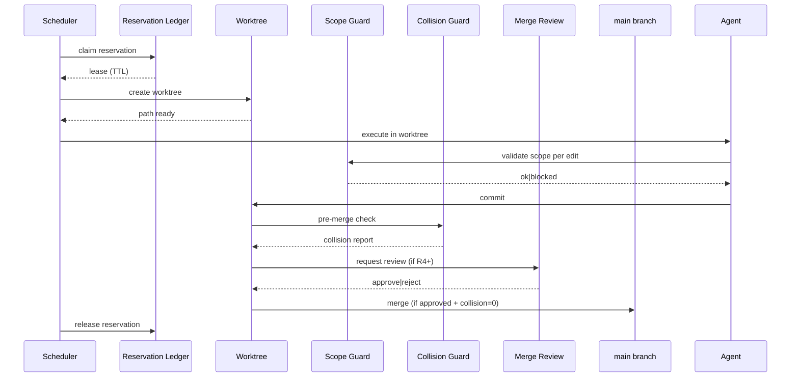

# Atlas Parallel Multi-Agent Execution Spec

## Resumo

Consolida em UM runbook as 5 invariantes do paralelismo multi-agente seguro: durable reservation ledger, worktree-per-agent, scope validator, collision guard, merge review promotion.

## Papel no Atlas

`self-construction/` tem ~30 contratos parts (durable-reservation-*, collision-guard-*, lease-lifecycle-*, merge-review-*). Sao corretos individualmente mas nao formam autoridade unica. **Este doc e a autoridade unica**.

## Onde Se Encaixa

```text
atlas-multi-agent-unified-architecture (4 camadas)
  +-- camada 4 Forge Multi-Agent Scheduler
       +-- atlas-parallel-multi-agent-execution-spec (este doc)
            +-- 5 invariantes
```

## Contratos

### As 5 invariantes simultaneas

| # | Invariante | Schema | Failure se faltar |
|---|------------|--------|-------------------|
| 1 | Durable Reservation Ledger | `atlas.reservation.entry.v1` | dois agentes editam mesmo arquivo simultaneamente |
| 2 | Worktree-per-agent (R3+) | `atlas.worktree.v1` | cross-pollution de mudancas WIP |
| 3 | Scope Validator (per packet) | `atlas.scope.guard.v1` | agente edita fora do scope |
| 4 | Collision Guard | `atlas.collision.report.v1` | merge produz conflito silencioso |
| 5 | Merge Review Promotion | `atlas.merge.review.v1` | merge sem review humano/architect em R4+ |

### Reservation Ledger entry schema

```text
{
  "schema": "atlas.reservation.entry.v1",
  "reservation_id": "<uuid>",
  "agent_id": "<id>",
  "intent_id": "<id>",
  "scope": {"paths": ["..."], "operations": ["read","write","delete"]},
  "lease": {
    "acquired_at": "<iso8601>",
    "ttl_seconds": <int>,
    "renew_at": "<iso8601>",
    "released_at": "<iso8601_or_null>"
  },
  "state": "active|expired|released|preempted",
  "evidence_hash": "sha256:..."
}
```

Append-only: nunca update, sempre new entry com `state` transition.

### Worktree schema

```text
{
  "schema": "atlas.worktree.v1",
  "worktree_id": "<id>",
  "agent_id": "<id>",
  "base_branch": "main",
  "worktree_branch": "atlas/parallel/agent-<agent_id>/<intent_id>",
  "path": "/var/atlas/worktrees/<id>",
  "created_at": "<iso8601>",
  "merged_at": "<iso8601_or_null>",
  "deleted_at": "<iso8601_or_null>"
}
```

### Collision Guard

Pre-merge check obrigatorio. Detecta:
- Dois worktrees mexeram no mesmo arquivo? -> collision_kind=path
- Mesma funcao/classe? -> collision_kind=symbol
- Mesma migration index? -> collision_kind=migration

```text
{
  "schema": "atlas.collision.report.v1",
  "report_id": "<uuid>",
  "checked_worktrees": ["<id>"],
  "collisions": [{"kind": "path|symbol|migration", "ref": "<file_or_symbol>", "agents": ["<id>"]}],
  "auto_resolvable": <bool>,
  "blocking": <bool>,
  "checked_at": "<iso8601>"
}
```

### Merge Review Promotion

R3 e abaixo: auto-merge se collision=0 e gates verdes.
R4 e acima: review humano ou architect agent obrigatorio antes de merge.

```text
{
  "schema": "atlas.merge.review.v1",
  "review_id": "<uuid>",
  "worktree_id": "<id>",
  "intent_id": "<id>",
  "reviewer": {"kind": "human|architect_agent", "id": "<id>"},
  "decision": "approve|reject|request_changes",
  "evidence_hashes_seen": ["sha256:..."],
  "rationale": "<string>",
  "signed_at": "<iso8601>"
}
```

## Fluxo



## Regras para IA

- Antes de iniciar paralelismo, declarar `topology` + `parallelism_mode=parallel_durable` em `atlas.multi_agent.decision.v1`.
- Cada agente recebe UMA reservation; subleasing proibido.
- TTL default 30min; renew obrigatorio antes de expirar.
- Collision detectada bloqueia merge ate resolver.
- R4+ sempre review.

## Escopo de Implementacao

`AtlasReservationLedgerService`, `AtlasWorktreeIsolationService`, `AtlasScopeValidatorService`, `AtlasCollisionGuardService`, `AtlasMergeReviewPromotionService`. Cada um implementa UMA invariante.

## Dependencias

Multi-Agent Unified (T1.3), Forge Continuum OS.

## Evidencias

Comandos esperados: `atlas:parallel:reservations --json`, `atlas:parallel:collision-check --json`, `atlas:parallel:merge-review --json`.

## Riscos

Lease leak (TTL nao renovado), worktree zombie, collision falso-negativo. Mitigacoes: watchdog, GC, regressao test suite.

## O que este doc NAO e

Nao e topologia (T1.3 camada 1) nem provider profile (T1.3 camada 2). E exclusivamente camada 4 paralelismo durable.

## Exemplos

3 agentes paralelos em Obra R4: 3 reservations distintas, 3 worktrees, 0 collision, 3 review approvals, 3 merges sequenciados.

## Proximas Acoes

1. Implementar 5 servicos.
2. Telemetria.
3. Suite paralelismo regressao.
