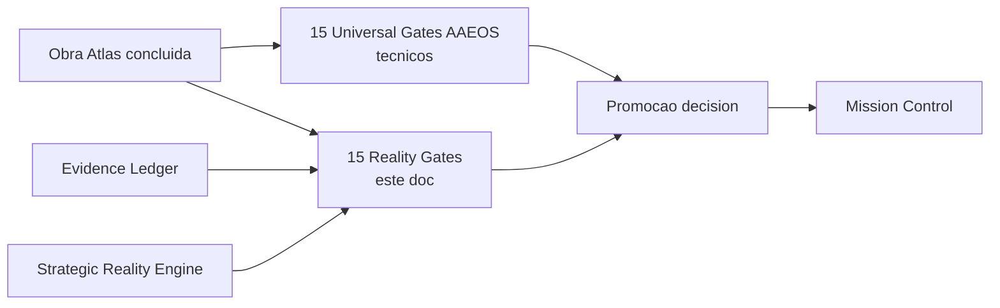
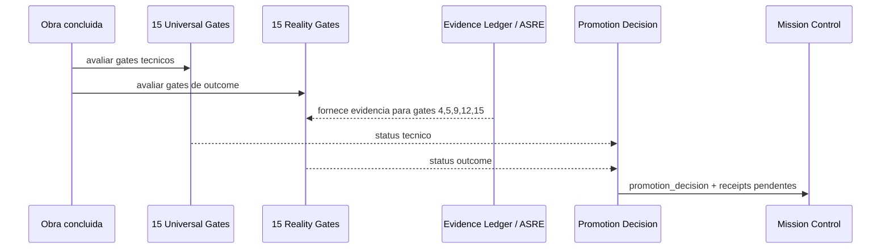

# Atlas Reality Outcome Gates

## Resumo

15 reality gates canonicos que medem se uma Obra do Atlas entregou impacto real no mundo. Complementam, sem substituir, os 15 universal gates AAEOS (que sao tecnicos: lint, tests, scope, schema, etc.).

A regra mestre e simples:

```text
universal_verde + reality_verde  -> promove livremente
universal_verde + reality_vermelho -> bloqueia ate Operator Decision Receipt
universal_vermelho + reality_verde -> bloqueia (gate tecnico tem veto)
universal_vermelho + reality_vermelho -> bloqueia duplo, alerta critico
```

## Papel no Atlas

Esta doc e contrato canonico (`graph_kind: contract`) sob `atlas-evidence-certification-runtime` (parent canonico de evidence) e flui para Mission Control Cockpit, Autonomy Ladder Promotion e Autonomous Software Company Runtime.

## Onde Se Encaixa



## Contratos

- Reality gate sempre complementa universal gate; nunca substitui.
- Cada gate tem severity (critical|high|medium|low) e threshold canonico mensuravel declarados nas tabelas.
- Reality gate consome apenas evidence ja registrada (Evidence Ledger ou ASRE); nunca dado cru de fora.
- Skip de reality gate exige `atlas.reality.gate_skip_receipt.v1` valido com operator signature.
- Reality gate vermelho em dominio sensivel NUNCA pode ser skipped via Operator Decision Receipt unilateral; exige dual signature + revisor humano licenciado.
- Schema canonico do report e `atlas.reality.gate_report.v1`; do skip receipt e `atlas.reality.gate_skip_receipt.v1`.
- Promocao L7 -> L8 exige reality pass rate >= 0.90 em janela mavel de 30 dias.

## Fluxo



## Catalogo dos 15 Reality Gates

Cada gate tem: `id`, `severity` (critical | high | medium | low), `threshold` canonico, `evidence_source`, `owner_doc`, `applies_to_sensitive_domains`.

### Familia A - Outcome Funcional (gates 1-4)

| # | Gate ID | Severity | Threshold | Evidence Source | Owner |
|---|---------|----------|-----------|-----------------|-------|
| 1 | `business_outcome_realized` | critical | hipotese de valor declarada na Obra confirmada por metrica observada | ASRE outcome signal | strategic-reality-engine |
| 2 | `user_satisfaction_delta` | high | satisfaction delta nao-negativo em 7d apos release | telemetria runtime | strategic-reality-engine |
| 3 | `adoption_realized` | high | uso real >= 50% da projecao Obra em 30d | telemetria runtime | strategic-reality-engine |
| 4 | `regression_in_production_zero` | critical | zero regressao critica em producao em 7d apos release | evidence ledger + ops telemetry | evidence-certification-runtime |

### Familia B - Outcome de Confianca e Seguranca (gates 5-8)

| # | Gate ID | Severity | Threshold | Evidence Source | Owner |
|---|---------|----------|-----------|-----------------|-------|
| 5 | `security_posture_observed` | critical | zero incidente classificado high+ em 30d; zero CVE critica nao mitigada | security telemetry + cyber receipts | sovereign-os + governance |
| 6 | `adversarial_resilience_score` | high | sobreviveu a red-team adversarial run sem breach > medium | self-adversarial engine | self-construction-os |
| 7 | `privacy_sovereignty_preserved` | critical | zero vazamento sovereignty class sensitive/secret/cyber em 30d | sovereign-os audit | sovereign-os |
| 8 | `consent_chain_complete` | high | 100% das acoes em dominio sensivel tem consent chain rastreavel | trust ledger | trust-ledger-canonical |

### Familia C - Outcome Financeiro e Custo (gates 9-11)

| # | Gate ID | Severity | Threshold | Evidence Source | Owner |
|---|---------|----------|-----------|-----------------|-------|
| 9 | `financial_outcome_signed` | high | custo real <= 120% do custo projetado da Obra | finance receipts | governance |
| 10 | `cost_per_outcome_unit_acceptable` | medium | cost-per-outcome dentro de baseline canonico | finance + ASRE | strategic-reality-engine |
| 11 | `roi_positive_or_acceptable` | medium | ROI positivo OU justificado por strategic intent receipt | finance + ASRE | strategic-reality-engine |

### Familia D - Outcome Cognitivo e Compounding (gates 12-15)

| # | Gate ID | Severity | Threshold | Evidence Source | Owner |
|---|---------|----------|-----------|-----------------|-------|
| 12 | `regret_minimization_score` | high | janela 90d: decisao mantida sem reverter; replay contrafactual nao mostra alternativa estritamente dominante | counterfactual runtime + trust ledger | strategic-reality-engine |
| 13 | `compounding_intelligence_delta` | high | sistema ficou mais inteligente apos a Obra: capability score Atlas total cresceu (nao zerado nem regrediu) | ACOS metric + trust ledger | cognition-operating-system |
| 14 | `learning_capsule_extracted` | medium | Obra produziu learning capsule canonica registrada no trust ledger | trust ledger | trust-ledger-canonical |
| 15 | `antifragility_multiplier_grew_or_held` | high | Antifragility_multiplier(t+1) >= Antifragility_multiplier(t) | antifragility equation runtime | cognitive-antifragility-equation |

## Schema Canonico do Reality Gate Report

```text
{
  "schema": "atlas.reality.gate_report.v1",
  "obra_id": "<obra_id>",
  "evaluated_at": "<iso8601>",
  "evaluator": "AtlasRealityOutcomeGatesEvaluatorService",
  "gate_results": [
    {
      "gate_id": "<one of the 15>",
      "severity": "critical|high|medium|low",
      "status": "green|yellow|red|skipped",
      "threshold": "<canonical>",
      "observed_value": "<observed>",
      "evidence_refs": ["<sha256:*>"],
      "skip_receipt_id": "<receipt_id if skipped>"
    }
  ],
  "overall_status": "green|yellow|red",
  "promotion_decision": "promote|hold|block",
  "operator_decision_receipt_required": <bool>,
  "sensitive_domain_safety_block_applied": <bool>
}
```

## Schema Canonico de Excecao (Skip Receipt)

```text
{
  "schema": "atlas.reality.gate_skip_receipt.v1",
  "receipt_id": "<uuid>",
  "obra_id": "<obra_id>",
  "gate_id": "<gate_id>",
  "reason": "<human-readable, >= 80 chars>",
  "operator_signature": "<sig>",
  "evidence_refs": ["<sha256:*>"],
  "expires_at": "<iso8601>"
}
```

Skip sem signature operator + evidence refs e invalido.

## Mapping Reality <-> Universal Gates

| Reality gate | Universal gate complementado | Relacao |
|--------------|------------------------------|---------|
| `regression_in_production_zero` | `tests-pass` | reality observa producao; universal observa CI |
| `security_posture_observed` | `secrets-policy` | reality observa incidente real; universal verifica policy estatica |
| `privacy_sovereignty_preserved` | `sovereignty-class-respected` | reality observa vazamento; universal verifica classificacao no envelope |
| `financial_outcome_signed` | `cost-budget-respected` | reality observa custo real; universal observa previsao |
| `compounding_intelligence_delta` | `learning-attached` | reality mede salto cognitivo; universal verifica capsule attached |

Mappings completos vivem em `atlas-universal-failure-mode-catalog.md` cross-reference.

## Bloco Obrigatorio Safety / Sovereignty para Dominios Sensiveis

Aplicado antes de qualquer reality gate avaliar Obra em dominio legal, healthcare, finance, trading ou cyber:

```text
sovereignty_class: sensitive | secret | cyber
operation_mode: assistive | research | draft | analysis only
no_autonomous_professional_advice: true
licensed_human_review_required: true   (onde aplicavel)
jurisdiction_check_required: true
consent_chain_verified_required: true
audit_trail_complete_required: true
liability_carrier_documented_required: true

# Em dominio sensivel, reality gate vermelho NUNCA pode ser
# skipped via Operator Decision Receipt unilateral. Exige
# dual signature operator + revisor humano licenciado +
# evidence pack auditavel anexado.
```

## Regras de Composicao Reality x Universal

```text
1. universal_verde + reality_verde
   -> promote
2. universal_verde + reality_yellow
   -> promote com warning anexado, observability alarm
3. universal_verde + reality_red (nao-sensivel)
   -> block; exige Operator Decision Receipt para override
4. universal_verde + reality_red (sensivel)
   -> block hard; exige dual signature + licensed reviewer
5. universal_yellow/red
   -> block sem opcao de override; corrige tecnico antes
6. reality_skipped sem skip_receipt valido
   -> equivale a reality_red
```

## Regras para IA

- Reality gate NUNCA mede dado cru de fora; consome apenas Evidence Ledger ou ASRE.
- Reality gate em dominio sensivel exige bloco safety/sovereignty aplicado antes da avaliacao.
- Skip de reality gate exige `atlas.reality.gate_skip_receipt.v1` valido com signature operador.
- Reality gate vermelho em dominio sensivel nao pode ser skipped unilateralmente; exige dual signature + revisor humano.
- IA NAO pode renomear gate, alterar severity nem threshold sem update desta doc + sync `atlas-evidence-certification-runtime`.

## O que este doc NAO e

- NAO substitui universal gates AAEOS.
- NAO e dashboard de KPI generico; gates tem schema, severity, threshold e evidence_source canonicos.
- NAO mede sucesso de feature isolada; mede outcome de Obra completa.
- NAO permite Obra sensivel ignorar reality vermelho.

## Escopo de Implementacao

- `AtlasRealityOutcomeGatesEvaluatorService` (novo) carrega `atlas.reality.signals.v1`, avalia os 15 gates e emite `atlas.reality.gate_report.v1`.
- Schemas `atlas.reality.gate_report.v1` e `atlas.reality.gate_skip_receipt.v1` registrados em `atlas-contract-schema-registry`.
- Zona "Reality Outcome" adicionada ao Mission Control Cockpit como 13a zona.
- Gate de promocao L7 -> L8 dependente de reality pass rate >= 0.90 em janela 30 dias.
- Cross-link com `atlas-universal-failure-mode-catalog` adicionando coluna `reality_gate_relacionado`.
- Implementacao em hot scope sob `App\Services\Ai\AgenticEngineeringOs\RealityOutcomeGates` (a criar).

## Dependencias

Dependencias canonicas declaradas em `depends_on`. Resumo:

- `atlas-evidence-certification-runtime` (parent canonico, source de evidencia).
- `atlas-strategic-reality-engine` (source de outcome signals).
- `atlas-trust-ledger-canonical` (registra learning capsules emitidas pelos gates).
- `atlas-agentic-engineering-os-runbook` (consome reality gates no decision de promocao).
- `atlas-autonomous-company-os-genesis-initiative` (manifesto que abre este doc).

## Evidencias

- Este doc canonico.
- Schemas `atlas.reality.gate_report.v1` e `atlas.reality.gate_skip_receipt.v1` quando registrados.
- Comando esperado `php artisan atlas:reality:gates --obra=<id> --json` retornando gate_report.
- Trust Ledger eventos `kind` = `reality_gate_passed`, `reality_gate_failed`, `reality_gate_skipped`.
- Mission Control zona "Reality Outcome" snapshot.

## Exemplos

### Exemplo 1: Obra de feature de pagamento

- 15 universal: 14 verde, 1 yellow (cobertura test 78% < 80%).
- 15 reality: gates 4 e 9 verde, gate 5 yellow (1 incidente medium-level), gate 10 verde, gate 11 medium (ROI just-positive).
- Decisao: bloqueia ate universal yellow virar verde (regra 5); reality nao consegue override gate tecnico.

### Exemplo 2: Obra de funcao em dominio legal

- 15 universal: tudo verde.
- 15 reality: gate 7 (privacy sovereignty) red — vazamento sensitive detectado.
- Decisao: block hard. Exige dual signature operador + advogado licenciado. Reality gate skipped via skip receipt unilateral seria invalido aqui por aplicar-se bloco safety/sovereignty.

## Riscos

- **Critico**: Obra promovida em dominio sensivel ignorando reality red. Mitigacao: gate `reality-gate-red-in-sensitive-domain-count` observado pelo cockpit + alerta.
- **Critico**: threshold de gate ajustado sem baseline ASRE. Mitigacao: maintenance regra obrigatoria.
- **Alto**: reality gate medindo dado cru fora do Evidence Ledger. Mitigacao: validator no `AtlasRealityOutcomeGatesEvaluatorService`.
- **Medio**: drift entre reality gate e universal gate mapeado. Mitigacao: docs-health cross-link.

## Proximas Acoes

1. Implementar `AtlasRealityOutcomeGatesEvaluatorService`.
2. Registrar `atlas.reality.gate_report.v1` e `atlas.reality.gate_skip_receipt.v1` no Contract Schema Registry.
3. Adicionar zona "Reality Outcome" ao Mission Control Cockpit como 13a zona.
4. Implementar gate de promocao L7 -> L8 dependente de reality pass rate >= 0.90 em janela 30 dias.
5. Cross-link com `atlas-universal-failure-mode-catalog.md` adicionando coluna reality_gate_relacionado.
6. Cross-link com `atlas-autonomy-ladder-promotion-runbook.md` adicionando regra de reality pass rate por nivel L.
