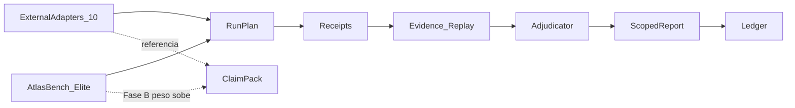

# Atlas Rivals — Structure Contract v1

## PÉTRO — Curriculum ladder / anti-ceiling fallacy

**Canon:** `docs/engineering-knowledge-base/atlas-rivals-curriculum-ladder-and-anti-ceiling-fallacy.md`

- **80–100% num teste = aprovação de NÍVEL escolar**, nunca teto do modelo, do Atlas, nem “inteligência suprema”.
- Suite saturada → **S_sanity** (regressão/paridade). Multiplicador e claim forte → só em **S_frontier** não saturado.
- Raw ou Atlas dominou o frontier → **promover L_{k+1}** (próximo livro). **Proibido** dizer “50× / N×M impossível para sempre porque já faz 80%”.
- **2026 ≠ 2030 ≠ 2040 ≠ 2050**; o currículo **sobe**. Atlas 80% em teste medíocre = **inútil como meta final** — elevar o nível.
- Essência Rivals: medir com/sem Atlas e **sempre melhorar o Atlas no frontier**, não congelar tabuada.

## Resumo

Como o Rivals se estrutura no tempo: comecar pelos adapters externos prontos, emitir relatorio rico e escopado, e ir internalizando o corpus que realmente diferencia — no espirito CursorBench, sem media como verdade.

## Papel no Atlas

Contrato operacional entre produto (o que e) e suites/corpus/claims (como mede).

## Onde Se Encaixa

Entre `atlas-rivals-product-v1` e os docs de suites / internal / claims / runbook.

## Contratos

### Tres camadas

1. **Suites (os 10)** — fontes de tarefa via adapters. Nao sao o juiz. Nao se "altera o benchmark externo" para melhorar score; clona pinado + smoke + ingest honesto.
2. **Matriz de medicao** — cada run responde uma pergunta escopada:
   - suite
   - task_type
   - model
   - runtime (`bare` | `atlas_dev` | `forge` | `loop` | `autonomous`)
   - budget / repetitions / environment / judge_config?
3. **Relatorio** — painel multi-eixo, nao um numero unico. Media global dos 10 = **dashboard opcional non-claim**.

### Fase A — Adapters + relatorio (agora)

1. Manter registry em `config/atlas_rivals.php` (`benchmarks.repos`, N=10; `suite_id = repo_id`).
2. Smoke real por repo (`atlas:rivals benchmark-smoke`); blocked ate verde.
3. Rodar baterias / ingest por suite (ou packs por pergunta).
4. Emitir `report` / `report-all` com eixos: resolucao, custo, custo/tarefa, tokens, tempo, estabilidade; claims so escopados.
5. Uplift quando `runtime_commands` estiverem setados; senao `uplift_supported=false`.
6. Separar readiness: `pipeline_valid` prova integridade; claims internos/publicos
   exigem tiers e gates adicionais. Harness/fixture nunca promove.

**Estado operacional (receipt vivo):** `storage/atlas/rivals/fase_a_closure_receipt.json`.
- L1 harness + L2 adapters 10/10 + L3 smoke 10/10: **verde** (no Mac do operador; não evidenciado em todo clone).
- L3 native batteries 10/10 + L4 uplift/claims: **ainda nao**.
- `runtime_commands.atlas_dev` **tem default** em `config/atlas_rivals.php` (`scripts/rivals-atlas-dev-bridge.php`); o blocker real no Mac é bridge/`atlas:cli:dev` + Hermes+Verboo funcionando — não "unset" no config.
- Relatório empresarial: `atlas:rivals report-enterprise` (schema `atlas.rivals2.enterprise_report.v1`); closure exige `enterprise_report_present`.
- Declarar "Fase A 100%" so quando `fase_a_100_percent_authorized=true` no receipt.
- O receipt agora e machine-generated/anti-tamper: registry/smoke 10/10,
  native bundles 10/10, uplifts 5/5, enterprise report, tests/docs, semantic ledger, workspace e
  prerequisites. `closure --verify` recalcula o hash; edicao manual invalida.

### Fase B — Internalizar (caminho CursorBench)

1. AtlasBench / Elite Reality Suite mineram trabalho real (git commits → cases frescos).
2. O que **diferencia** modelos e alinha com uso real Atlas sobe de peso no claim-pack interno.
3. O que e puzzle, saturado ou ruidoso **desce de peso** ou sai do claim-pack (pode permanecer como adapter de referencia).
4. Refresh periodico do corpus interno (ContaminationGuard / idade maxima de case).

### Roteamento suite × pergunta (Fase A)

| Pergunta | Suites tipicas |
|---|---|
| Obra longa / ultra-horizon | swe_marathon, hal_harness, senior_swe_bench |
| Patch / issue fix | swe_bench_live, atlas_bench (interno) |
| Terminal agent | terminal_bench |
| Tool / function calling | bfcl, tau2_bench, inspect_evals |
| Coding multi-lang | aider_polyglot, live_code_bench |
| Atlas multiplica? | qualquer suite × bare vs atlas_* |

## Fluxo

## Regras para IA

- Nao propor "media dos 10 = score Rivals".
- Nao editar clones em `tools/rivals/benchmarks/` para facilitar pass rate.
- Preferir claims por (suite, task_type, model, runtime) com N reps e custo presente.
- Ao internalizar, exigir freshness + dificuldade honesta (DifficultyCalibrator).

## Escopo de Implementacao

Docs deste pacote + `config/atlas_rivals.php` + adapters/core em `app/Services/Ai/Rivals/`.

## Dependencias

`atlas-rivals-product-v1`.

## Evidencias

`atlas:rivals benchmarks --json` (total = count(repos)); reports com claim_scope; AtlasBench mine receipts.

## Riscos

Colapsar Fase A em ranking unico; pular Fase B e ficar refem de benches saturados; Goodhart no corpus interno.

## Exemplos

Fase A claim valido: "claude_opus_4_8@bare em swe_marathon / long_horizon_engineering, 3 reps, budget X — claim_allowed apos gates".
Fase A non-claim: "media simples dos 10 suites = 0.42" (dashboard only).

## Proximas Acoes

Ver external-suites (catalogo), internal-corpus (Fase B), claims-and-reporting (gates), operator-runbook (CLI).
