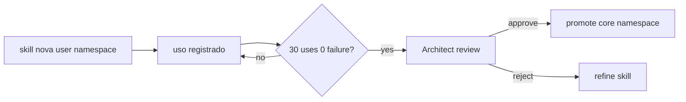

# Atlas Skill Pack Canonical

## Resumo

Schema canonico de Skill Pack local-first do Atlas.

## Papel no Atlas

`AiSkillStoreService.php` (32 KB) tem skills implementadas mas sem contrato formal. Este doc fornece.

## Onde Se Encaixa

```text
atlas-agentic-engineering-os
  +-- atlas-skill-pack-canonical (este doc)
```

## Contratos

### Schema (`atlas.skill_pack.v1`)

```text
{
  "schema": "atlas.skill_pack.v1",
  "skill_id": "atlas.skill.<core|user>.<name>",
  "version": "v<int>",
  "namespace": "core|user",
  "human_name": "<string>",
  "purpose": "<string>",
  "inputs": [{"name":"...","type":"..."}],
  "outputs": [{"name":"...","type":"..."}],
  "code_path": "<service_class_or_path>",
  "evidence_required": ["..."],
  "promotion": {
    "current_namespace": "user|core",
    "uses_count": <int>,
    "failure_count": <int>,
    "last_promoted_at": "<iso8601_or_null>"
  },
  "tags": ["..."],
  "sovereignty_class": "ok_to_share|sensitive|secret|cyber"
}
```

### Promotion gate user -> core

- 30 uses consecutivos sem failure.
- Sovereignty class != sensitive/secret/cyber.
- Architect review.
- 0 incident registrado.

### Marketplace pessoal

- 100% local. Nenhum upload externo.
- Index visivel em `php artisan atlas:skill:list --json`.
- Versioning via git por baixo.

## Fluxo



## Regras para IA

- Criar skill nova em `atlas.skill.user.*`.
- Promocao exige threshold + Architect review.
- Sovereignty sensitive/secret/cyber NUNCA promove para core.

## Escopo de Implementacao

`AtlasSkillPackService` (refator de AiSkillStore para schema novo).

## Dependencias

Sovereignty OS, Architect dept.

## Evidencias

Comando + ledger uso.

## Riscos

Promocao prematura, drift namespace, share cruzando sovereignty.

## O que este doc NAO e

Nao implementa skills; define contrato.

## Exemplos

Skill `atlas.skill.user.expense_categorizer` com 45 usos 0 failure, Architect aprova -> vira `atlas.skill.core.expense_categorizer.v1`.

## Proximas Acoes

1. Refator AiSkillStore para schema novo.
2. Implementar promotion gate.
3. Marketplace local index.
