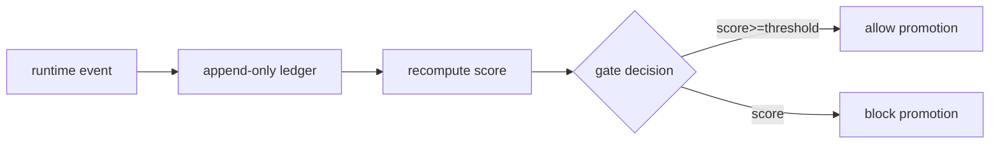

# Atlas Trust Ledger Canonical

## Resumo

Trust Ledger append-only para gating de autonomia.

## Papel no Atlas

Self-Improvement Ladder cita Trust Ledger; este doc o canoniza.

## Onde Se Encaixa

```text
atlas-evidence-certification-runtime (receipts)
  +-- atlas-trust-ledger-canonical (este doc, score history)
       +-- atlas-autonomy-ladder-promotion-runbook (uses score)
```

## Contratos

### Event schema (`atlas.trust_ledger.event.v1`)

```text
{
  "schema": "atlas.trust_ledger.event.v1",
  "event_id": "<uuid>",
  "kind": "promotion|demote|cert_pass|cert_fail|self_construction_approved|signature_breach|gate_pass|gate_fail|incident_resolved|drift_detected",
  "actor": {"kind":"agent|operator|system","id":"..."},
  "target": {"kind":"obra|department|intent|ladder","id":"..."},
  "weight": <float>,
  "evidence_hashes": ["sha256:..."],
  "at": "<iso8601>"
}
```

### Score formula

```text
score(t) = sigmoid( sum( weight_i * sign_i for i in events_window(90d)) / norm)

onde:
  sign_i = +1 para success kinds, -1 para failure kinds
  weight_i da tabela de pesos
  norm = sum(|weight_i|)
```

### Tabela de pesos

| Kind | Weight | Sign |
|------|--------|------|
| cert_pass | 1.0 | + |
| cert_fail | 1.5 | - |
| promotion | 0.5 | + |
| demote | 1.0 | - |
| self_construction_approved | 1.5 | + |
| signature_breach | 3.0 | - |
| gate_pass | 0.2 | + |
| gate_fail | 0.5 | - |
| incident_resolved | 0.8 | + |
| drift_detected | 0.5 | - |

### Thresholds

| Score | Effect |
|-------|--------|
| >=0.95 | L7 elegivel |
| >=0.90 | L6 elegivel |
| >=0.80 | L5 elegivel |
| >=0.70 | L4 elegivel |
| 0.50-0.70 | L3 max |
| <0.50 | freeze runtime + Architect review |

## Fluxo



## Regras para IA

- Ledger NUNCA update; sempre append.
- Score recomputado a cada evento + 1x dia agendado.
- Promote L4+ exige score do dia.

## Escopo de Implementacao

`AtlasTrustLedgerService` com `append()` e `score()`. Banco append-only.

## Dependencias

Evidence Cert Runtime, Autonomy Ladder Runbook (T2.1).

## Evidencias

Comando: `atlas:trust:status --json`. Replay determinístico.

## Riscos

Update silencioso (mitigacao: hash chain), score volatilidade (mitigacao: rolling 90d).

## O que este doc NAO e

Nao e Decision Receipt v2 (eventos individuais); e historico agregado.

## Exemplos

3 cert_fail em 7 dias -> score cai de 0.85 para 0.72 -> L4 ainda elegivel mas L5 promocao bloqueada.

## Proximas Acoes

1. Implementar service.
2. Hash chain integrado.
3. Dashboard cockpit zona 12.
