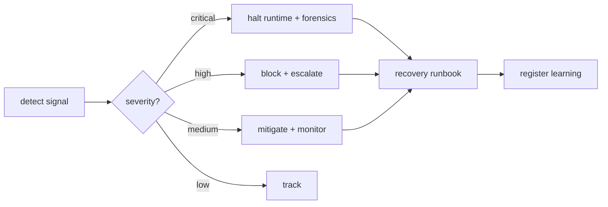

# Atlas Universal Failure Mode Catalog

## Resumo

Catalogo unificado com runbook de recovery.

## Papel no Atlas

Cada doc declara `failure_modes`. Este doc consolida.

## Onde Se Encaixa

```text
atlas-agentic-engineering-os
  +-- atlas-universal-failure-mode-catalog (este doc)
```

## Contratos

### Schema (`atlas.failure_mode.entry.v1`)

```text
{
  "schema": "atlas.failure_mode.entry.v1",
  "id": "<snake_case>",
  "doc_owner": "<doc_id>",
  "severity": "low|medium|high|critical",
  "blast_radius": "single_intent|single_obra|department|aaeos_global",
  "detection": ["<signal>", "<test>", "<heuristic>"],
  "mitigation": ["<action>"],
  "recovery": ["<step>"],
  "learning": "<string>",
  "last_seen": "<iso8601_or_null>",
  "recurrence_count": <int>
}
```

### Catalogo (snapshot 2026-05-26)

| ID | Doc | Severity | Blast | Detection | Recovery |
|----|-----|----------|-------|-----------|----------|
| phase_skipped_no_receipt | aaeos-runbook | high | single_intent | aaeos_phase_skipped_count > 0 | rollback fase + receipt forensico |
| handoff_without_schema | aaeos-runbook | medium | single_intent | validator envelope | repair handoff + emit envelope |
| http_path_legacy_fallback | http-path-spec | medium | aaeos_global | http_path_legacy_fallback_rate > 0.05 | revert flag para fase anterior |
| layer_violation_multi_agent | multi-agent-unified | high | aaeos_global | amua_layer_violation_count > 0 | block PR + Architect review |
| sprawl_command_name | self-construction-compaction | medium | aaeos_global | scos_command_max_name_length > 80 | block release + refactor |
| reservation_lease_leak | parallel-multi-agent | high | single_obra | parallel_lease_expired_count > N | force_release + GC worktree |
| collision_silent | parallel-multi-agent | critical | single_obra | merge produces unmerged conflict | abort merge + force review |
| autonomy_promote_premature | autonomy-ladder-runbook | high | aaeos_global | autonomy_demote_count > 0 within 7d | demote + freeze ladder |
| dual_signature_bypass | mission-control-cockpit | critical | aaeos_global | gesture L4+ sem dual sig | revoke gesture + audit |
| schema_breaking_no_receipt | contract-registry | high | aaeos_global | bump v1->v2 sem receipt | block PR |
| dept_blocker_stale | dept-maturity-matrix | low | department | last_evaluation > 30d | force re-eval |
| obra_replay_determinism_violation | obra-replay | critical | aaeos_global | replay_determinism_violation_count > 0 | freeze replay + audit hash chain |
| repair_loop_infinite | cross-dept-choreography | critical | single_intent | repair_loop_iterations > 3 | escalate operator + freeze intent |
| veto_propagation_lost | cross-dept-choreography | high | aaeos_global | downstream nao pausa em veto | block runtime + audit |
| docs_health_drift | docs-health-v2 | medium | aaeos_global | docs-health fail | block sync + manual review |
| trust_ledger_score_drop | trust-ledger | high | aaeos_global | score < 0.7 sustained | freeze L4+ promotions |
| acos_health_degraded | acos | high | aaeos_global | acos_health=degraded | fail-safe to L0 + alert |
| evidence_ledger_hash_mismatch | evidence-cert-runtime | critical | aaeos_global | hash chain inconsistency | freeze writes + forensics |

### Severity policy

- `critical`: corrompe estado canonico (replay, ledger, dual sig). Halt runtime.
- `high`: bloqueia operacao mas estado preservado. Block + escalate.
- `medium`: degrada qualidade. Mitigate + monitor.
- `low`: notice. Track + atualizar.

## Fluxo



## Regras para IA

- Failure detectada -> consultar catalog -> aplicar recovery -> registrar learning.
- Recurrence > 3 em 7 dias -> escalate Architect.
- Critical sem recovery testado -> bloqueia runtime.

## Escopo de Implementacao

`AtlasFailureCatalogService`, watchdogs por modo, learning persistence.

## Dependencias

ACOS (learning), Evidence Cert Runtime.

## Evidencias

Comando: `atlas:failure-catalog --json`.

## Riscos

Modo nao catalogado, recovery nao testado, recurrence ignorada.

## O que este doc NAO e

Nao substitui `failure_modes` em cada doc; consolida.

## Exemplos

`reservation_lease_leak` detectado: GC worktree expirado, force_release no ledger, learning registra TTL renew window.

## Proximas Acoes

1. Implementar comando.
2. Watchdogs por modo critical/high.
3. Sync com `failure_modes` de cada doc.
