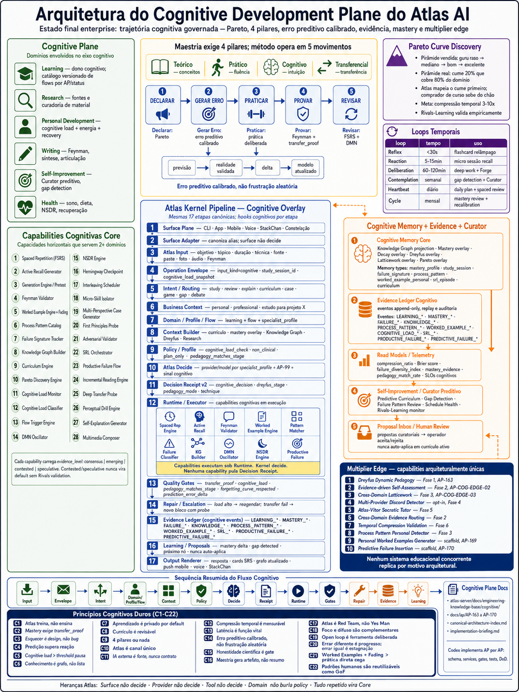

# Atlas AI Cognitive Plane Visual Map

Este documento governa a imagem visual do **Cognitive Development Plane** para
humano e IA entenderem a mesma arquitetura antes de implementar AP, capability,
surface, memory artifact ou Curator flow.

## Asset Canonico

Imagem aprovada: `../assets/cognitive-plane-visual-map-v1.png`.



Se houver conflito entre imagem e texto, vencem, nesta ordem:

1. `cognitive/principles.md`
2. `cognitive/pipeline-overlay.md`
3. AP especifico em `docs/ap/AP-###-cognitive-*.md`
4. este documento
5. a imagem

## Regras Visuais Obrigatorias

1. Mostrar Cognitive Plane como sub-arquitetura, nao produto paralelo.
2. Mostrar 4 pilares: teorico, pratico, cognitivo, transferencial.
3. Mostrar 5 movimentos: declarar, gerar erro, praticar, provar, revisar.
4. Explicitar erro preditivo calibrado, nao frustracao aleatoria.
5. Usar o pipeline canonico de 17 etapas como overlay cognitivo.
6. Separar domains envolvidos de capabilities cognitivas horizontais.
7. Mostrar Evidence Ledger, Read Models, Learning Signals, Curator e Human Review.
8. Marcar que learning nao autoaltera comportamento critico sem proposal/review.
9. Mostrar Multiplier Edge como capacidades arquiteturalmente unicas do Atlas.
10. Incluir docs de referencia: `cognitive/`, `docs/ap/AP-163..170` e `canonical-architecture-index.md`.

## Texto De Referencia

Titulo recomendado:

```text
Arquitetura do Cognitive Development Plane do Atlas AI
```

Subtitulo recomendado:

```text
Estado final enterprise: trajetoria cognitiva governada — Pareto, 4 pilares,
erro preditivo calibrado, evidencia, mastery e multiplier edge
```

Rodape obrigatorio:

```text
Surface nao decide · Provider nao decide · Tool nao decide · Domain nao burla policy · Tudo repetido vira Core
```

## Nao Fazer

1. Nao desenhar Cognitive Plane como app de estudo isolado.
2. Nao trocar evidence/mastery por resumo passivo.
3. Nao esconder Human Review quando houver mudanca de curriculo ativo.
4. Nao colocar gurus, IA externa ou conteudo bruto como fonte canonica.
5. Nao remover APs, status ou docs de referencia do visual.
