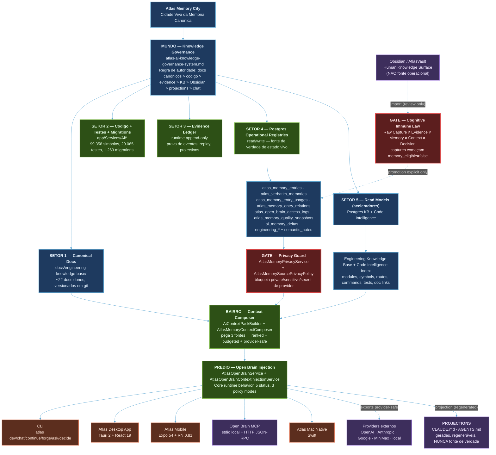
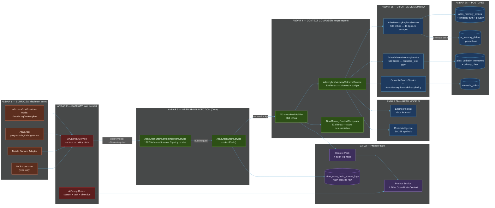
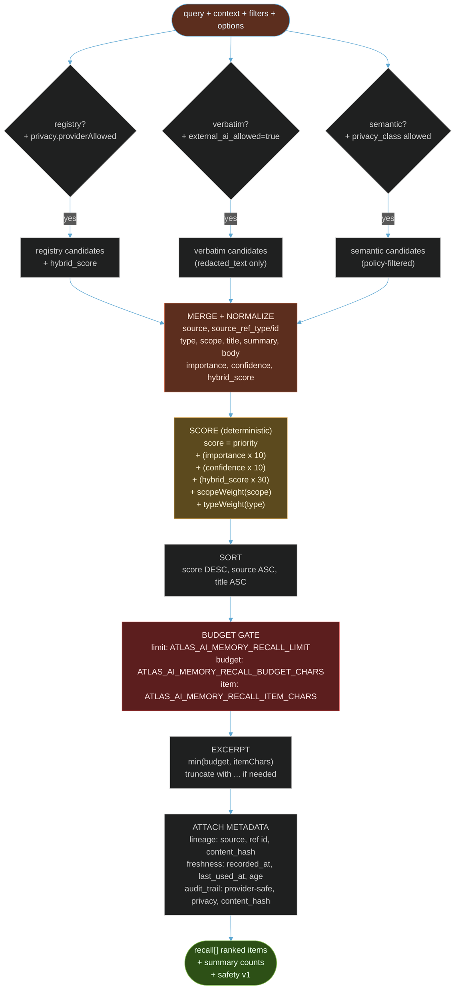
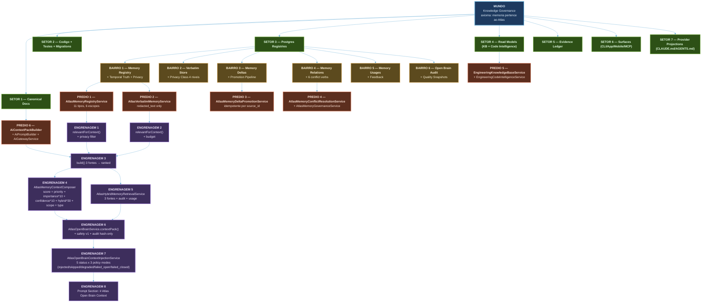
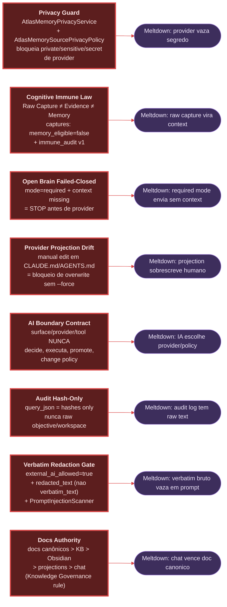

# Atlas Memory Architecture — AURC + Mermaid

> Visual canonico do sistema de **memoria, contexto, recall, Open Brain, governance e privacy** do Atlas. Cada node aponta para o doc/servico/migration dono. O mapa **nao** e fonte de verdade — ele e a superficie visual da verdade canonica.

Metafora central (do `atlas-cartographic-knowledge-os.md`): **cidade viva** com 5 andares (Mundo → Setor → Bairro → Predio → Engrenagem) e 7 camadas de inspecao por node (Essencial, Fluxo, Relacoes, Evolucao, Patamares, Versoes, Prova e Seguranca).

---

## 1. Vista Panoramica (Mundo → Setor) — Mermaid



---

## 2. Vista do Predio — Open Brain (5 andares detalhados)



---

## 3. Engrenagem do Composer (zoom no mecanismo de ranking)



---

## 4. Fluxo de Promocao (raw → memory canonica)

```mermaid
%%{init: {'theme': 'dark', 'themeVariables': {'primaryColor': '#0f1e2e', 'lineColor': '#5fa8d3'}}}%%
flowchart LR
    classDef raw fill:#5c1e1e,stroke:#d94545,color:#ffe6e6
    classDef gate fill:#5c4a1e,stroke:#d9a857,color:#fff4d9
    classDef quasi fill:#5c2e1e,stroke:#d97757,color:#ffe6d9
    classDef canon fill:#2d5016,stroke:#7ab348,color:#e6ffe6

    RAW["Raw Capture<br/>chat · Obsidian · voice · CLI prompt<br/>file · vault item"]:::raw
    CAPTURE["Capture Pipeline<br/>+ cognitive_quarantine metadata<br/>flags: memory_eligible=false<br/>embedding_allowed=false"]:::raw

    DELTA_PENDING["ai_memory_deltas<br/>status: pending"]:::quasi
    REVIEW["Review (human or governed)<br/>receipt: atlas.memory_delta.review_receipt.v1<br/>accept | reject"]:::gate

    DELTA_ACC["ai_memory_deltas<br/>status: accepted"]:::quasi
    PROMOTE["AtlasMemoryDeltaPromotionService<br/>+ types mapping<br/>+ idempotente (source_id)"]:::gate

    MEMORY["atlas_memory_entries<br/>canal: decision / preference /<br/>issue / technical_context /<br/>resolution / harness_learning /<br/>benchmark_observation /<br/>anti_memory / strategic_insight"]:::canon
    VERBATIM["atlas_verbatim_memories<br/>canal: decision / command /<br/>evidence / quote / requirement /<br/>review / failure"]:::canon

    USAGE["Usage tracking<br/>atlas_memory_entry_usages<br/>+ feedback by trace"]:::canon
    GOV["Governance<br/>AtlasMemoryGovernanceService<br/>+ AtlasMemoryConflictResolutionService<br/>(6 conflict verbs)"]:::canon

    RAW --> CAPTURE
    CAPTURE --> DELTA_PENDING
    DELTA_PENDING --> REVIEW
    REVIEW -->|accept| DELTA_ACC
    REVIEW -->|reject| X(["REJECTED — not eligible"]):::raw

    DELTA_ACC --> PROMOTE
    PROMOTE --> MEMORY
    PROMOTE --> VERBATIM

    MEMORY --> USAGE
    VERBATIM --> USAGE
    USAGE --> GOV
    GOV -->|"duplicate/conflict<br/>(visible verdicts)"| MEMORY
```



---

## 5. AURC — 7 Camadas de Inspecao (por node)

Cada node do mapa tem 7 camadas canonicas. Para inspecionar qualquer node do diagrama:

| # | Camada | Pergunta canonica | Onde olhar |
|---|---|---|---|
| 1 | **Essencial** | O que e? Quem e o owner? | doc dono `atlas-ai-*` + frontmatter `owner:` |
| 2 | **Fluxo** | De onde vem? Para onde vai? Quando executa? | `flowchart` acima + `runtime_rule` no doc |
| 3 | **Relacoes** | Com quem conversa? Quais contratos? | `related_paths:` no frontmatter + `depends_on`/`flows_to` |
| 4 | **Evolucao** | Quando mudou? Qual fase? | `git log` + secoes `### Fase N` no doc-mãe |
| 5 | **Patamares** | Em que nivel de maturidade esta? (L1..L8) | tabela "Modelo de Maturidade" no doc-mãe |
| 6 | **Versoes** | Qual schema version? Qual API version? | `schema_version` em JSON payloads + `routes/api.php` |
| 7 | **Prova e Seguranca** | Como sei que funciona? Quais gates? | `evidence_refs` + `quality_gates` + `required_tests` + `failure_modes` |

---

## 6. Glossario de Nodes (source_path canonico)

### Predio: BACKBONE

| Node | source_path | owner |
|---|---|---|
| Knowledge Governance | `docs/engineering-knowledge-base/atlas-ai-knowledge-governance-system.md` | `knowledge-governance` |
| Session Bootstrap | `docs/engineering-knowledge-base/atlas-ai-session-bootstrap.md` | `onboarding` |
| Documentation OS | `docs/engineering-knowledge-base/atlas-ai-documentation-operating-system.md` | `documentation` |

### Predio: REGISTRIES (Postgres)

| Node | Tabela / Servico | source_path |
|---|---|---|
| Memory Registry | `atlas_memory_entries` | `database/migrations/2026_05_02_000000_create_atlas_memory_entries_table.php` |
| Verbatim Store | `atlas_verbatim_memories` | `database/migrations/2026_05_02_004000_create_atlas_verbatim_memories_table.php` |
| Memory Usages | `atlas_memory_entry_usages` | `database/migrations/2026_05_02_001000_*` |
| Memory Relations | `atlas_memory_entry_relations` + Temporal Truth (2026_05_25) | `database/migrations/2026_05_02_003000_*` + `2026_05_25_030500_add_conflict_verbs_*` |
| Open Brain Audit | `atlas_open_brain_access_logs` | `database/migrations/2026_05_03_130000_*` |
| Quality Snapshots | `atlas_memory_quality_snapshots` | `database/migrations/2026_05_03_190000_*` |
| Memory Deltas | `ai_memory_deltas` (existente) | (pre-existente) |
| Temporal Truth fields | (additive) | `database/migrations/2026_05_18_080100_add_temporal_truth_to_atlas_memory_entries.php` |
| Privacy columns | (additive) | `database/migrations/2026_05_02_005000_add_privacy_columns_*` |
| Supersede by id | (additive) | `database/migrations/2026_05_04_010000_add_superseded_by_*` |
| Provider Projection Audits | `atlas_memory_provider_projection_audits` | `database/migrations/2026_05_02_008000_*` |

### Predio: SERVICES (PHP)

| Node | Servico | source_path | LOC |
|---|---|---|---|
| Memory Registry Svc | `AtlasMemoryRegistryService` | `app/Services/Ai/AtlasMemoryRegistryService.php` | 505 |
| Verbatim Svc | `AtlasVerbatimMemoryService` | `app/Services/Ai/AtlasVerbatimMemoryService.php` | 560 |
| Privacy Svc | `AtlasMemoryPrivacyService` | `app/Services/Ai/AtlasMemoryPrivacyService.php` | - |
| Source Privacy Policy | `AtlasMemorySourcePrivacyPolicy` | `app/Services/Ai/AtlasMemorySourcePrivacyPolicy.php` | - |
| Context Composer | `AtlasMemoryContextComposer` | `app/Services/Ai/AtlasMemoryContextComposer.php` | 333 |
| Hybrid Retrieval | `AtlasHybridMemoryRetrievalService` | `app/Services/Ai/AtlasHybridMemoryRetrievalService.php` | 316 |
| Context Pack Builder | `AiContextPackBuilder` | `app/Services/Ai/AiContextPackBuilder.php` | 584 |
| Open Brain Svc | `AtlasOpenBrainService` | `app/Services/Ai/AtlasOpenBrainService.php` | 181 |
| Open Brain Injection | `AtlasOpenBrainContextInjectionService` | `app/Services/Ai/AtlasOpenBrainContextInjectionService.php` | 1262 |
| Open Brain MCP | `AtlasOpenBrainMcpService` | `app/Services/Ai/AtlasOpenBrainMcpService.php` | - |
| Governance | `AtlasMemoryGovernanceService` | `app/Services/Ai/AtlasMemoryGovernanceService.php` | 520 |
| Usage | `AtlasMemoryUsageService` | `app/Services/Ai/AtlasMemoryUsageService.php` | 285 |
| Quality | `AtlasMemoryQualityService` | `app/Services/Ai/AtlasMemoryQualityService.php` | 1020 |
| Review Queue | `AtlasMemoryReviewQueueService` | `app/Services/Ai/AtlasMemoryReviewQueueService.php` | - |
| Delta Promotion | `AtlasMemoryDeltaPromotionService` | `app/Services/Ai/AtlasMemoryDeltaPromotionService.php` | - |
| Provider Projection | `AtlasProviderProjectionService` | `app/Services/Ai/AtlasProviderProjectionService.php` | - |
| Maintenance | `AtlasMemoryMaintenanceService` | `app/Services/Ai/AtlasMemoryMaintenanceService.php` | - |
| Conflict Resolution | `AtlasMemoryConflictResolutionService` | `app/Services/Ai/Memory/AtlasMemoryConflictResolutionService.php` | 480 |

### Predio: SURFACES

| Node | Stack | source_path |
|---|---|---|
| Atlas CLI | bash + PHP | `bin/atlas` |
| Atlas Desktop | Tauri 2 + React 19 + Rust | `atlas-desktop/` |
| Atlas App (mobile) | Expo 54 + RN 0.81 | `atlas-app/` |
| Atlas Mac Native | Swift | `atlas-mac-native/` |
| Open Brain MCP | stdio local + HTTP JSON-RPC | `app/Http/Controllers/AtlasOpenBrainMcpController.php` |

### Predio: CONTRACT DOCS

| Node | source_path |
|---|---|
| Memory Core Runbook | `docs/engineering-knowledge-base/memory-core-runbook.md` |
| Memory Contracts (focused) | `docs/engineering-knowledge-base/memory/contracts.md` |
| Retrieval & Context | `docs/engineering-knowledge-base/memory/retrieval-and-context.md` |
| Open Brain MCP & API | `docs/engineering-knowledge-base/memory/open-brain-mcp.md` |
| Open Brain Context Injection | `docs/engineering-knowledge-base/open-brain-context-injection.md` |
| Cognitive Immune Learning Kernel | `docs/engineering-knowledge-base/memory/cognitive-immune-learning-kernel.md` |
| Foundation Map | `docs/engineering-knowledge-base/memory/foundation-map.md` |
| Doc-mae (full) | `docs/engineering-knowledge-base/archive/source-material/atlas-ai-memory-context-core-open-brain-full-2026-05-08.md` (4023 linhas) |

---

## 7. Vista 2: 5 Andares da Cidade (de cima)



---

## 8. Gates Criticos (visualizados)



---

## 9. Como Renderizar / Usar Este Mapa

### Visualização
- **GitHub / Obsidian / VSCode** — Mermaid renderiza nativo em preview Markdown
- **Atlas Desktop / Mobile** — eventual superficie visual AURC consume este doc como `graph_id`
- **Cartography runtime** — `app/Services/Engineering/AtlasUniversalRealityCartographyService.php` pode indexar este arquivo via `php artisan atlas:engineering:knowledge index-code --prune`

### Próximas cenas a derivar deste mapa
1. Cena por **engrenagem** (Composer, Open Brain Injection, Conflict Resolution, etc) com 7 camadas
2. Cena por **surface** (CLI, App, Mobile, MCP) mostrando injeção
3. Cena por **caso de uso** (recall, promote, review, project, conflict)
4. Cena por **patamar** (P1..P5 do `atlas-ai-qualitative-levels-roadmap.md`)

### Manutenção
- Quando `atlas-ai-knowledge-governance-system.md` mudar autoridade → atualizar camada 1 (Essencial) de todos os nodes
- Quando tabela nova for criada → adicionar em §6 Glossario + atualizar §1 Vista Panoramica
- Quando novo servico for entregue → adicionar em §6 Glossario + criar nova engrenagem em §2 Vista do Predio
- Quando gate novo for adicionado → adicionar em §8 Gates Criticos

### Validação
```bash
# Confirmar que este doc nao quebrou health
php artisan atlas:engineering:knowledge docs-health --json
# Re-indexar para surfaces (se aplicavel)
./bin/atlas engineering knowledge sync --prune
```

---

## 10. Leitura Minima para uma Sessão Nova

1. Este arquivo (mapa visual)
2. `memory-core-runbook.md` (operacional)
3. `atlas-ai-knowledge-governance-system.md` (autoridade)
4. `atlas-ai-session-bootstrap.md` (bootstrap)
5. Doc dono do assunto especifico (apontado em cada node)
