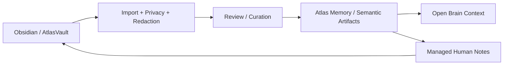

# Atlas Obsidian And AtlasVault Architecture

This parent doc defines the non-negotiable boundary. It is intentionally short
so a new AI session understands the Vault role before implementing anything.

## Executive Rule

```txt
Obsidian / AtlasVault
  = human writing, research, reflection, review, navigation and managed mirrors

Atlas repo docs + Postgres + Memory Registry + Evidence/Audits + Open Brain
  = operational, testable, provider-safe source of truth
```

Obsidian is powerful because it becomes the human workspace around Atlas. It is
dangerous if treated as raw operational memory. Every import must pass
classification, redaction, dedupe, audit and review before it can affect runtime.

## Read Order

| Need | Read |
|---|---|
| Vault authority, frontmatter, links, note types, privacy, conflicts | `vault/contracts.md` |
| CLI/API operations, smoke checks and phase validation | `vault/runbook.md` |
| Memory/API/provider projection boundary | `memory/contracts.md` |
| Historical implementation detail | `archive/source-material/obsidian-atlas-vault-full-2026-05-08.md` |

## Layer Roles

| Layer | Role | Primary source? |
|---|---|---|
| `docs/engineering-knowledge-base` | Architecture, ADRs, contracts, runbooks and DoD | Yes for engineering knowledge |
| Postgres | Memory, semantic notes, traces, runs, audits, indexed docs/code | Yes for runtime |
| Open Brain | Provider-safe recall and prompt context | No; composes primary sources |
| `AGENTS.md` / `CLAUDE.md` | Provider bootstrap projections | No |
| Obsidian / AtlasVault | Human knowledge surface and personal workspace | No |

The Kernel surface adapter is `atlas_vault`. It exposes text/files/human
workspace/projection capabilities. It must not bypass Kernel policy, memory
promotion, provider-safety or Decision Receipt rules.

## Allowed Uses

- long-form personal notes;
- research references;
- draft decisions;
- journaling and reflection;
- project notes for human reading;
- review of candidate memories;
- backlinks between Atlas entities;
- managed provider-safe mirrors of reviewed Atlas artifacts;
- weekly/project/status notes for human navigation.

## Forbidden Uses

- raw source for `atlas dev`, `atlas continue` or Open Brain;
- replacement for repo docs, migrations, services, tests or Memory Registry;
- only place for final architecture decisions;
- direct Claude/Codex context without privacy/redaction/review;
- storage for secrets, tokens, cookies or credentials;
- remote multiuser sync without a dedicated AP and DoD.

## Directional Flow



## Promotion Rule

Vault notes may become:

- `semantic_notes`;
- curation proposals;
- managed human projections;
- reviewed `atlas_memory_entries`.

They must not become high-impact operational memory automatically. Promotion
requires scope, type, privacy, redaction, duplicate/conflict handling and audit.

## Open Brain Rule

Open Brain consumes:

- indexed `semantic_notes`;
- reviewed `atlas_memory_entries`;
- canonical repo docs;
- code intelligence;
- allowed traces/runs/audits.

Open Brain must not read arbitrary vault markdown directly in runtime.

## Current Status

Implemented foundations include:

- managed note frontmatter, links and safe path confinement;
- local status/note/import/export/sync/conflicts/resolve commands;
- local authenticated vault APIs;
- persistent `atlas_vault_sync_items`;
- conflict-safe dry-run/write behavior;
- semantic note import and curation proposal creation;
- managed export of semantic notes to the vault.

See `vault/runbook.md` for current commands and validation.

## Final Rule For IAs

Before implementing anything about Obsidian, AtlasVault, semantic vault, markdown
import/export or bidirectional sync, read this file and `vault/contracts.md`.
If the change turns a loose note into operational memory without privacy,
review and audit, the implementation is wrong.

## Resumo

Compact canonical boundary for Atlas using Obsidian/AtlasVault as Human Knowledge Surface and Personal Knowledge Workspace.

## Papel no Atlas

Define a responsabilidade desta peca dentro da arquitetura Atlas.

## Onde Se Encaixa

Relaciona esta peca com seu sistema, camada, fluxo ou modulo pai.

## Contratos

Declara invariantes, entradas, saidas, limites e obrigacoes relevantes.

## Fluxo

Descreve o caminho operacional ou a sequencia de uso quando aplicavel.

## Regras para IA

Agentes devem respeitar escopo, evidencias, testes e proibicoes antes de alterar codigo.

## Escopo de Implementacao

Mudancas devem permanecer nos caminhos e limites declarados no frontmatter.

## Dependencias

Dependencias canonicas vivem em frontmatter e no corpo deste documento.

## Evidencias

Evidencias aceitas incluem docs, comandos, testes, receipts, reports e paths verificaveis.

## Riscos

Riscos principais devem ser tratados antes de promover status, runtime ou claims de prontidao.

## Exemplos

Exemplos concretos devem ser adicionados quando reduzirem ambiguidade para humanos ou IAs.

## Proximas Acoes

Proximas acoes devem ser concretas, verificaveis e ligadas a gates de qualidade.
