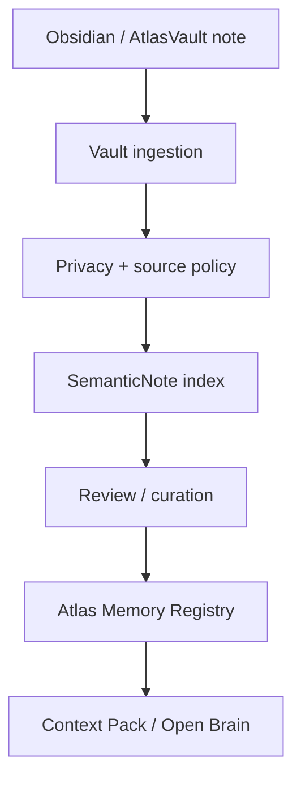
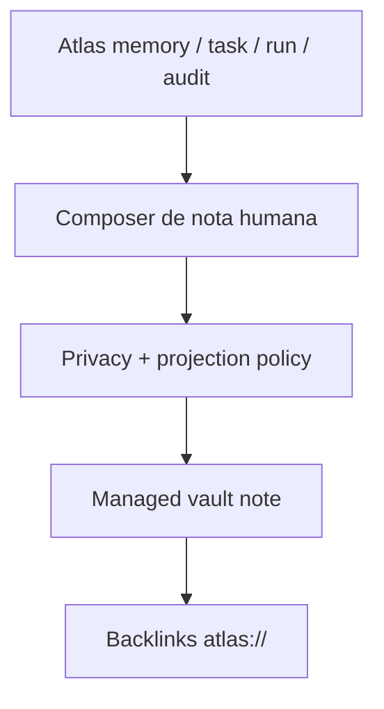

# Atlas Obsidian And AtlasVault Architecture

Este documento define como Obsidian e AtlasVault entram no sistema de memoria do
Atlas. Ele e regra canonica para humanos e IAs: nenhuma implementacao deve
transformar Obsidian em fonte primaria da memoria operacional.

## Decisao Executiva

Obsidian/AtlasVault e o Human Knowledge Plane do Atlas: o core da camada humana
de conhecimento pessoal, pesquisa, revisao, identidade e navegacao. Atlas
Memory, Postgres, docs canonicos, Evidence Ledger, Code Intelligence e Open
Brain sao o core operacional da IA e do sistema.

Regra:

```txt
Obsidian / AtlasVault
  = escrita humana, pesquisa, notas longas, revisao, navegacao, espelho rico

atlas-server/docs + Postgres + audits
  = fonte operacional, testavel, versionada, consultavel e provider-safe
```

O Atlas pode usar Obsidian em duas direcoes:

```txt
Obsidian -> Atlas
Atlas importa notas permitidas, classifica, redige, indexa e sugere/promove
memorias estruturadas.

Atlas -> Obsidian
Atlas cria notas humanas gerenciadas, resumos, backlinks, indices e paginas de
revisao para facilitar leitura e curadoria.
```

## Papeis Por Camada

| Camada | Papel | Fonte primaria? |
|---|---|---|
| `atlas-server/docs/engineering-knowledge-base` | Arquitetura, ADRs, runbooks, contratos e DoD versionados | Sim, para conhecimento de engenharia |
| Postgres | Memoria operacional, traces, runs, audits, docs indexados, code intelligence | Sim, para runtime |
| Open Brain | Recall provider-safe e injecao automatica em CLI/app | Nao; compoe fontes primarias |
| `CLAUDE.md` / `AGENTS.md` | Projections para providers | Nao |
| Obsidian / AtlasVault | Leitura humana, rascunhos, pesquisa, notas e espelho gerenciado | Nao |

## O Que Obsidian Deve Ser

Obsidian deve ser usado para:

- notas longas pessoais;
- pesquisa e referencias;
- rascunhos de decisoes;
- journaling e reflexoes;
- mapas mentais;
- notas de projeto para leitura humana;
- revisao de memorias candidatas;
- navegacao por backlinks entre entidades Atlas;
- espelho provider-safe de memoria ja classificada;
- notas geradas pelo Atlas para acompanhamento humano.

## O Que Obsidian Nao Deve Ser

Obsidian nao deve ser usado como:

- fonte primaria obrigatoria para `atlas dev`, `atlas continue` ou Open Brain;
- substituto de migrations, models, services, controllers, commands ou testes;
- substituto de `atlas_memory_entries`;
- substituto de docs canonicos versionados;
- lugar unico para decisoes arquiteturais finais;
- fonte direta para Claude/Codex sem privacy/redaction/review;
- local para segredos, tokens, cookies ou credenciais;
- mecanismo de sync remoto multiusuario sem fase propria e DoD.

## Fluxo Obsidian Para Atlas



Passos esperados:

1. Nota markdown existe no vault configurado por `ATLAS_VAULT_PATH`.
2. `SemanticNoteIndexer` indexa frontmatter e corpo em `semantic_notes`.
3. `AtlasMemorySourcePrivacyPolicy` calcula provider-safety.
4. Nota pode virar candidata de curadoria, nunca memoria canonica automatica de alto impacto.
5. Promocao para `atlas_memory_entries` exige classificacao, escopo, tipo, redaction e auditabilidade.
6. Open Brain usa somente a versao provider-safe/indexada/promovida.

## Fluxo Atlas Para Obsidian



O Atlas pode criar notas para:

- memoria aprovada;
- decisoes;
- resolucoes de bugs;
- aprendizados do Harness;
- status de projeto;
- tasks importantes;
- summaries semanais;
- auditorias Open Brain relevantes;
- indices de entidades.

Notas criadas pelo Atlas devem ser projections humanas gerenciadas. Se uma nota
for editada manualmente, o Atlas deve preservar a edicao ou exigir `adopt/force`
explicito em fase futura. O padrao e nunca sobrescrever conteudo humano
silenciosamente.

## Frontmatter Padrao

Notas gerenciadas ou importaveis devem usar frontmatter explicito:

```yaml
---
atlas_id: mem_123
atlas_type: memory_entry
atlas_managed: true
sync_status: managed
source: atlas
source_type: atlas_memory_entry
source_id: mem_123
privacy_class: normal
provider_safe: true
redaction_status: clean
canonical: false
created_by: atlas
updated_at: 2026-05-03T00:00:00Z
---
```

Campos:

| Campo | Papel |
|---|---|
| `atlas_id` | ID estavel da entidade Atlas relacionada |
| `atlas_type` | `memory_entry`, `task`, `project`, `engineering_run`, `open_brain_audit`, `semantic_note`, `decision`, `index` |
| `atlas_managed` | Se o Atlas pode tratar a nota como gerenciada |
| `sync_status` | `draft`, `imported`, `candidate`, `managed`, `archived`, `conflict` |
| `source_type` / `source_id` | Origem operacional |
| `privacy_class` | `normal`, `private`, `sensitive`, `secret` |
| `provider_safe` | Se pode influenciar contexto externo |
| `redaction_status` | `clean`, `redacted`, `blocked`, `needs_review` |
| `canonical` | `true` apenas para docs que sao fonte canonica; normalmente `false` |

## Links Atlas

Notas humanas podem conter links estaveis para entidades Atlas:

```md
## Links Atlas

- Memory: atlas://memory/mem_123
- Task: atlas://task/task_456
- Project: atlas://project/proj_789
- Engineering Run: atlas://engineering-run/run_123
- Open Brain Audit: atlas://open-brain/audit/audit_123
- Canonical Doc: docs/engineering-knowledge-base/open-brain-context-injection.md
```

Contratos de URI:

| URI | Entidade |
|---|---|
| `atlas://memory/{id}` | `atlas_memory_entries` |
| `atlas://verbatim-memory/{id}` | `atlas_verbatim_memories` |
| `atlas://semantic-note/{id}` | `semantic_notes` |
| `atlas://task/{id}` | `atlas_tasks` |
| `atlas://project/{id}` | projeto Atlas |
| `atlas://engineering-run/{id}` | run do Harness |
| `atlas://open-brain/audit/{id}` | `atlas_open_brain_access_logs` |
| `atlas://trace/{id}` | `ai_traces` |

Esses links sao para navegacao humana e automacao local. Eles nao devem ser
enviados a provider como substituto de contexto; o Context Pack deve carregar
refs compactas provider-safe.

## Tipos De Nota

| Tipo | Path recomendado | Origem |
|---|---|---|
| Memory note | `Atlas/Memory/{type}/{slug}.md` | Atlas -> Vault |
| Task note | `Atlas/Tasks/{status}/{task-slug}.md` | Atlas -> Vault |
| Project note | `Atlas/Projects/{project-slug}/README.md` | Atlas -> Vault |
| Run note | `Atlas/Engineering/Runs/{run-id}.md` | Atlas -> Vault |
| Decision note | `Atlas/Decisions/{yyyy-mm-dd}-{slug}.md` | Humano ou Atlas |
| Research note | `Research/{topic}/{slug}.md` | Humano -> Atlas |
| Daily/weekly note | `Journal/{yyyy}/{yyyy-mm-dd}.md` | Humano ou Atlas |
| Index note | `Atlas/Indexes/{entity}.md` | Atlas -> Vault |

Paths exatos podem evoluir, mas precisam ser deterministicos, seguros e
normalizados por `VaultFileStore`.

## Promocao Para Memoria

Uma nota pode virar memoria Atlas quando:

- tem conteudo claro e reutilizavel;
- possui escopo definido;
- possui tipo de memoria definido;
- foi classificada por privacy;
- nao contem segredo;
- tem redaction quando necessario;
- nao conflita com memoria ativa sem relacao explicita;
- possui fonte rastreavel para a nota original.

Mapeamento recomendado:

| Nota | Memoria |
|---|---|
| decisao final | `decision` |
| preferencia recorrente | `preference` |
| bug e causa | `issue` |
| correcao validada | `resolution` |
| contexto tecnico | `technical_context` |
| observacao de benchmark | `benchmark_observation` |
| aprendizado de harness | `harness_learning` |

## Escrita Pelo Atlas

Quando o Atlas criar nota no vault:

- escrever frontmatter completo;
- incluir bloco `Links Atlas`;
- incluir `source_type` e `source_id`;
- preservar uma area manual quando existir;
- nao sobrescrever nota humana sem detectar conflito;
- registrar metadata suficiente para auditoria;
- manter conteudo provider-safe se `provider_safe=true`;
- marcar `sync_status=conflict` se houver drift.

Modelo de bloco gerenciado:

```md
<!-- ATLAS:MANAGED:START -->
Conteudo gerado pelo Atlas.
<!-- ATLAS:MANAGED:END -->

## Manual Notes

Espaco humano preservado.
```

## Privacy E Provider Safety

Regras:

- `secret` nunca entra em provider, nota gerenciada provider-safe ou projection;
- `sensitive` e `private` exigem review/redaction antes de qualquer uso externo;
- notas vindas de Obsidian entram como `semantic_vault`/`semantic_note` na policy de fonte;
- prompt injection em nota deve bloquear excerpt provider-safe;
- sync nao pode copiar segredos de Obsidian para docs canonicos;
- export para Obsidian deve respeitar privacy da entidade original.

## Conflitos

Conflito ocorre quando:

- nota gerenciada foi alterada fora do bloco manual;
- frontmatter perdeu `atlas_id` ou mudou `source_id`;
- entidade Atlas foi arquivada mas nota continua ativa;
- nota humana contradiz memoria ativa;
- duas notas apontam para o mesmo `atlas_id` com conteudo divergente.

Comportamento esperado:

- nunca sobrescrever silenciosamente;
- marcar `sync_status=conflict`;
- gerar item de review/maintain;
- exigir acao explicita de operador para `adopt`, `archive`, `merge` ou `regenerate`.

## Comandos Existentes

Ja existem blocos basicos de vault/semantic memory:

```bash
/opt/homebrew/bin/php artisan atlas:semantic:bootstrap-vault
/opt/homebrew/bin/php artisan atlas:semantic:index
/opt/homebrew/bin/php artisan atlas:semantic:govern
```

Fase 1 do AtlasVault Sync adicionou a CLI minima de notas gerenciadas:

```bash
/opt/homebrew/bin/php artisan atlas:vault status --json
/opt/homebrew/bin/php artisan atlas:vault note --type=memory_entry --id=<id> --title="..." --dry-run --json
/opt/homebrew/bin/php artisan atlas:vault note --type=memory_entry --id=<id> --title="..." --write --json
/opt/homebrew/bin/php artisan atlas:vault note --type=memory_entry --id=<id> --title="..." --canonical-doc=docs/engineering-knowledge-base/open-brain-context-injection.md --link=Task=atlas://task/task_456 --dry-run --json
```

Contrato entregue:

- `status` retorna path do vault, existencia, escrita, contagem de notas
  gerenciadas, contagem de conflitos, contagem de notas gerenciadas invalidas,
  total de markdowns inspecionados, ultimo indice semantico quando disponivel e
  status de seguranca, incluindo tipos de nota e links suportados;
- `status` e read-only: ele reporta vault ausente sem criar diretorio ou
  arquivos;
- sem `--json`, `status` e `note` renderizam um resumo humano curto; com
  `--json`, preservam o payload auditavel completo;
- `note --dry-run` retorna path, markdown, frontmatter, links e metadata sem
  escrever arquivo nem criar diretorio de vault ausente;
- `note --write` cria arquivo novo dentro do vault ou atualiza nota ja
  gerenciada quando nao ha conflito; se o vault configurado ainda nao existe, a
  criacao do diretorio raiz ocorre apenas nesse caminho de escrita segura;
- `note --content="..."` permite trocar o conteudo gerado dentro do bloco
  `ATLAS:MANAGED` sem usar o espaco manual como input operacional;
- `note --content` nao pode conter os markers reservados
  `ATLAS:MANAGED:START` ou `ATLAS:MANAGED:END`, para impedir criacao de nota ja
  invalida;
- titulo recebido pela CLI/composer e normalizado para uma linha no H1 da nota;
- `note --privacy-class=secret --provider-safe=0 --redaction-status=blocked`
  e valores equivalentes validos sao aceitos no dry-run/write seguro, sem
  promover a nota para memoria operacional;
- `note --provider-safe=<bool>` aceita apenas booleanos explicitos (`1`, `0`,
  `true`, `false`, `yes`, `no`, `on`, `off`) e rejeita valores ambiguos;
- `privacy_class=secret` exige `provider_safe=false`; o composer rejeita
  combinacoes secret/provider-safe para impedir projection insegura;
- `redaction_status=blocked` ou `redaction_status=needs_review` tambem exigem
  `provider_safe=false`; somente `clean` e `redacted` podem ser provider-safe;
- `updated_at` precisa ser timestamp ISO-8601 com timezone explicito, como
  `2026-05-03T00:00:00Z` ou `2026-05-03T00:00:00+00:00`;
- `note --canonical-doc=<path>` adiciona path canonico relativo ao bloco
  `## Links Atlas`;
- `note --link=Label=atlas://type/id` adiciona links Atlas extras, mantendo
  validacao de URI e ID;
- labels de links extras sao normalizados para uma linha, precisam ser nao
  vazios e nao podem conter caracteres de markdown que criem alvo ambigua;
- arquivo existente sem `atlas_managed=true` nao e sobrescrito;
- drift fora do bloco gerenciado e de `## Manual Notes` gera conflito e bloqueia
  overwrite;
- frontmatter invalido, campos obrigatorios faltando ou markers gerenciados
  ausentes geram conflito auditavel;
- flags booleanos de frontmatter (`atlas_managed`, `provider_safe`,
  `canonical`) precisam parsear como booleanos reais; strings ambiguas sao
  invalidas e nao sofrem cast silencioso;
- `privacy_class=secret` com `provider_safe=true` e invalido tanto em input
  novo quanto em nota existente inspecionada;
- `redaction_status=blocked|needs_review` com `provider_safe=true` e invalido
  tanto em input novo quanto em nota existente inspecionada;
- `updated_at` ausente ou invalido torna nota gerenciada invalida/conflitante;
- markers `ATLAS:MANAGED` duplicados ou fora de ordem geram conflito auditavel;
- nota ja marcada com `sync_status=conflict` nao e sobrescrita por `--write`;
- drift manual em frontmatter estavel (`source`, `source_type`, `source_id`,
  `privacy_class`, `provider_safe`, `redaction_status`, `canonical`,
  `created_by`, `atlas_id`, `atlas_type`) bloqueia overwrite;
- payload de dry-run/write inclui `operation`, hashes de conteudo existente e
  proposto, alem de motivo de bloqueio quando conflito impede escrita;
- tipos de nota aceitos nesta fase: `memory_entry`, `verbatim_memory`,
  `semantic_note`, `task`, `project`, `engineering_run`, `open_brain_audit` e
  `trace`;
- IDs de entidade usados em path e `atlas://` precisam ser segmentos seguros:
  sem `/`, `\`, `..`, espacos ou caracteres fora de `A-Za-z0-9._:-`;
- links extras internos passados ao composer tambem sao validados: URI `atlas://`
  precisa parsear pelo contrato suportado e path canonico precisa ser relativo,
  sem traversal; entradas malformadas nao sao ignoradas silenciosamente;
- path manual opcional precisa ser explicitamente relativo ao vault, nao pode
  ser absoluto, precisa terminar em `.md` e passar pelo confinamento de
  `VaultFileStore`; o confinamento compara limite de diretorio, nao apenas
  prefixo textual.

Rotina geral depois de alterar docs/codigo de memoria:

```bash
/opt/homebrew/bin/php artisan atlas:memory:maintain \
  --workspace=/Users/vitorepf/Develop/atlas/atlas-server \
  --json
```

## Comandos Futuros Recomendados

Nao implementar sem fase propria, testes e DoD:

```bash
atlas vault import --path=<note>
atlas vault export-memory --memory=<id> --dry-run
atlas vault sync --dry-run
atlas vault conflicts
atlas vault link --memory=<id> --note=<path>
atlas vault daily-summary --date=<yyyy-mm-dd> --dry-run
```

## APIs Futuras Recomendadas

Nao implementar sem fase propria:

- `GET /api/atlas/vault/status`
- `POST /api/atlas/vault/import`
- `POST /api/atlas/vault/export`
- `POST /api/atlas/vault/sync`
- `GET /api/atlas/vault/conflicts`

Todas devem ser locais/autenticadas, provider-safe por padrao e auditaveis.

## Status Da Fase 1 - Vault Link & Managed Notes Foundation

Atualizado em 3 de maio de 2026.

Status: **implementada no `atlas-server` como fundacao local sem UI e sem sync
remoto**.

Arquivos criados:

- `app/Services/Semantic/AtlasVaultFrontmatterService.php`
- `app/Services/Semantic/AtlasVaultLinkService.php`
- `app/Services/Semantic/AtlasVaultManagedNoteService.php`
- `app/Services/Semantic/ValueObjects/AtlasVaultNote.php`
- `app/Console/Commands/AtlasVaultCommand.php`
- `tests/Unit/AtlasVaultFileStoreTest.php`
- `tests/Unit/AtlasVaultFrontmatterServiceTest.php`
- `tests/Unit/AtlasVaultLinkServiceTest.php`
- `tests/Unit/AtlasVaultManagedNoteServiceTest.php`
- `tests/Feature/AtlasVaultCommandTest.php`

Arquivos integrados:

- `bootstrap/app.php`
- `docs/engineering-knowledge-base/obsidian-atlas-vault.md`
- `docs/engineering-knowledge-base/memory-core-contracts.md`

Capacidades entregues:

- frontmatter gerenciado com campos minimos obrigatorios;
- parser estrito para booleanos de frontmatter e CLI;
- invariavel de privacidade `secret => provider_safe=false`;
- invariavel de redaction `blocked|needs_review => provider_safe=false`;
- validacao de `updated_at` como timestamp ISO-8601 auditavel;
- parse de frontmatter gerenciado;
- geracao e parse de links `atlas://`;
- bloco markdown `## Links Atlas`;
- composicao de nota gerenciada com bloco `ATLAS:MANAGED` e `## Manual Notes`;
- path deterministico para notas gerenciadas e path manual confinado ao vault;
- confinamento direto de `VaultFileStore::absolutePath()` com cobertura para
  dry-run sem criacao de root, traversal, diretorio symlinkado para fora do
  vault e arquivo symlinkado diretamente para fora do vault;
- validacao de IDs, URIs `atlas://` e paths canonicos relativos antes de compor
  markdown;
- validacao de labels de backlinks e rejeicao de links extras malformados antes
  de compor markdown;
- dry-run auditavel;
- dry-run sem efeito colateral sobre vault ausente;
- escrita segura dentro do vault com troca atomica por arquivo temporario e
  limpeza do temporario em falha;
- update preservando `## Manual Notes`;
- conflito simples para drift fora do bloco manual/gerenciado;
- conflito simples para frontmatter invalido, flags booleanos malformados,
  markers gerenciados ausentes, duplicados ou fora de ordem;
- bloqueio de overwrite para `sync_status=conflict` existente;
- bloqueio de overwrite para drift em frontmatter estavel;
- bloqueio de overwrite em arquivo nao gerenciado;
- payload de conflito com `sync_status=conflict`, `write_blocked_reason` e
  `conflict_marked_in_payload` sem sobrescrever a nota humana;
- CLI minima `atlas:vault status|note`;
- `atlas:vault status` nao cria o vault quando o diretorio configurado ainda
  nao existe;
- CLI opcional para links extras e canonical docs no bloco `## Links Atlas`;
- testes focados de frontmatter, links, path safety, dry-run, write, conflito e
  CLI.

Validacao executada durante a implementacao:

```bash
/opt/homebrew/bin/php artisan test --filter=AtlasVault # 110 tests, 371 assertions
/opt/homebrew/bin/php artisan test --filter=Semantic
/opt/homebrew/bin/php artisan atlas:vault status --json
/opt/homebrew/bin/php artisan atlas:vault note --type=memory_entry --id=test-memory --title="Teste AtlasVault" --summary="Dry-run de nota gerenciada" --dry-run --json
git diff --check
/opt/homebrew/bin/php artisan atlas:memory:projection review --target=all --workspace=/Users/vitorepf/Develop/atlas/atlas-server --json
/opt/homebrew/bin/php artisan atlas:memory:projection apply --target=all --workspace=/Users/vitorepf/Develop/atlas/atlas-server --yes --json
/opt/homebrew/bin/php artisan atlas:memory:maintain --workspace=/Users/vitorepf/Develop/atlas/atlas-server --json
```

Observacao: o primeiro `atlas:memory:maintain` terminou em
`needs_projection_review` porque as provider projections gerenciadas estavam
stale. A projection foi revisada sem `manual_drift`, aplicada com `--yes`, e a
validacao final de maintain terminou com `status=ready`.

Conclusao da Fase 1: **completa**. A fundacao local de Vault Link & Managed
Notes esta implementada, testada e documentada. Qualquer continuidade deve ser
aberta como Fase 2 com escopo proprio.

## Status Da Fase 2 - Local Sync, Review Queue And Audit

Atualizado em 3 de maio de 2026.

Status: **implementada e validada** como sync local auditavel. Esta fase
transforma a fundacao da Fase 1 em operacoes locais de import/export/sync com
fila persistente de revisao. Ela nao muda a fronteira canonica: Postgres, docs
versionados, audits e Open Brain continuam sendo a fonte operacional.

Escopo desta fase:

- importar nota individual do vault para `semantic_notes` e proposta de
  curadoria, quando privacy/redaction permitirem;
- exportar `semantic_notes` para nota gerenciada humana no vault;
- rodar sync local em dry-run ou write, sem provider externo;
- isolar falha previsivel de arquivo individual durante sync como
  `sync_file_error`, sem abortar a varredura completa; em `--write`, o bloqueio
  e registrado na fila persistente e em audit;
- registrar cada operacao em fila persistente e `audit_events`;
- listar conflitos e itens pendentes;
- filtrar a fila local por `status`, `direction` e `operation`;
- consultar detalhe read-only de um item da fila/conflito por ID;
- expor status operacional do vault com resumo da fila local de sync;
- resolver itens da fila por acao explicita de operador (`adopt`, `archive`,
  `merge`, `regenerate`, `force`, `dismiss`) sem sobrescrever conteudo humano
  silenciosamente.
- registrar justificativa opcional de operador em resolucoes, preservada em
  metadata/audit como `resolution_reason`;
- `regenerate` reexecuta export seguro apenas para itens
  `atlas_to_vault/export_semantic_note`; para import ou outros tipos, a
  tentativa fica bloqueada como conflito auditavel.

Fora desta fase:

- UI;
- sync remoto multiusuario;
- MCP tools com escrita;
- promocao automatica de nota para `atlas_memory_entries`;
- embeddings externos, ChromaDB ou vector DB remoto;
- resolucao destrutiva automatica de conflitos.

Arquivos criados/integrados:

- `database/migrations/2026_05_03_230000_create_atlas_vault_sync_items_table.php`
- `app/Models/AtlasVaultSyncItem.php`
- `app/Services/Semantic/AtlasVaultSyncService.php`
- `app/Console/Commands/AtlasVaultCommand.php`
- `app/Http/Controllers/AtlasVaultController.php`
- `app/Http/Requests/AtlasVaultImportRequest.php`
- `app/Http/Requests/AtlasVaultExportSemanticRequest.php`
- `app/Http/Requests/AtlasVaultSyncRequest.php`
- `app/Http/Requests/AtlasVaultResolveRequest.php`
- `routes/api.php`
- `tests/Feature/AtlasVaultApiTest.php`
- `tests/Feature/AtlasVaultCommandTest.php`
- `docs/engineering-knowledge-base/memory-core-contracts.md`

Comandos de Fase 2:

```bash
/opt/homebrew/bin/php artisan atlas:vault import --path=<note.md> --dry-run --json
/opt/homebrew/bin/php artisan atlas:vault import --path=<note.md> --write --json
/opt/homebrew/bin/php artisan atlas:vault export-semantic --semantic-note=<id> --dry-run --json
/opt/homebrew/bin/php artisan atlas:vault export-semantic --semantic-note=<id> --write --json
/opt/homebrew/bin/php artisan atlas:vault sync --dry-run --limit=200 --json
/opt/homebrew/bin/php artisan atlas:vault sync --write --limit=200 --json
/opt/homebrew/bin/php artisan atlas:vault conflicts --json
/opt/homebrew/bin/php artisan atlas:vault conflicts --status=conflict --direction=atlas_to_vault --operation=export_semantic_note --json
/opt/homebrew/bin/php artisan atlas:vault item --item=<sync-item-id> --json
/opt/homebrew/bin/php artisan atlas:vault resolve --item=<sync-item-id> --resolution=archive --json
/opt/homebrew/bin/php artisan atlas:vault resolve --item=<sync-item-id> --resolution=dismiss --reason="Duplicado revisado no vault" --json
/opt/homebrew/bin/php artisan atlas:vault resolve --item=<sync-item-id> --resolution=regenerate --json
```

`atlas:vault status --json` inclui `vault.sync_queue` quando a migration
`atlas_vault_sync_items` esta presente: `total`, `open`, `blocked`,
`conflicts`, `historical_conflicts`, `reviewed`, `resolved`, `by_status`,
`by_direction` e `last_activity_at`. `conflicts` conta apenas conflitos abertos
em status de review; `historical_conflicts` inclui itens ja resolvidos que ainda
mantem `conflict_type` para auditoria.

APIs locais autenticadas por `X-Atlas-Token`:

```txt
GET  /ai/vault/status
POST /ai/vault/import
POST /ai/vault/export-semantic
POST /ai/vault/sync
GET  /ai/vault/conflicts
GET  /ai/vault/conflicts/{item}
POST /ai/vault/conflicts/{item}/resolve
```

Essas APIs sao superficie local para app/backend. Elas nao sao sync remoto
multiusuario e nao permitem MCP write tools.

`GET /ai/vault/conflicts` aceita filtros query-string equivalentes ao CLI:
`status`, `direction`, `operation` e `limit`. `status` pode ser uma lista
separada por virgula. Valores fora do allowlist sao recusados pelo service; a
API responde `422` com payload JSON `{ok:false,error}`.

`POST /ai/vault/import`, `POST /ai/vault/export-semantic` e
`POST /ai/vault/sync` traduzem erros previsiveis de path, vault e filesystem em
`422` com payload JSON `{ok:false,error}`. `export-semantic` com
`semantic_note_id` inexistente retorna `404` com payload JSON
`{ok:false,error}`. Modo ambiguo ou ausente (`dry_run`/`write`) tambem retorna
`422` com payload JSON `{ok:false,error}`.

Na CLI com `--json`, os mesmos casos retornam exit code `1` e payload
`{ok:false,error}` estavel: arquivo do vault ausente, path inseguro,
`semantic_note` inexistente, item de fila inexistente em `item` ou `resolve`,
filtros invalidos e modo de execucao ambiguo.

`atlas:vault item --item=<sync-item-id> --json` e
`GET /ai/vault/conflicts/{item}` retornam detalhe read-only do item persistente,
incluindo metadata auditavel e a lista de `allowed_resolution_actions`. Item
inexistente ou ID malformado na API retorna `404` com payload JSON
`{ok:false,error}` antes de consultar a coluna UUID no banco. Quando
`atlas_vault_sync_items` ainda nao esta migrada, detalhe e resolucao retornam
`422` com payload JSON `{ok:false,error}` em vez de erro interno.

`resolve` aceita `reason` opcional no CLI/API. O valor e normalizado para uma
linha, limitado a 1000 caracteres e gravado em `metadata.resolution_reason` e
no evidence do audit event. `reason` nao muda semantica de resolucao nem
autoriza overwrite. Item inexistente em `resolve` tambem retorna `404` com
payload JSON `{ok:false,error}`.

Validacao executada:

```bash
/opt/homebrew/bin/php artisan migrate --force
/opt/homebrew/bin/php artisan test --filter=AtlasVault # 110 tests, 371 assertions
/opt/homebrew/bin/php artisan test --filter=Semantic
/opt/homebrew/bin/php artisan atlas:vault sync --dry-run --limit=5 --json
/opt/homebrew/bin/php artisan atlas:vault conflicts --json
git diff --check
```

Fica para fases posteriores:

- import/export completo em massa e orquestracao incremental avancada;
- UI;
- sync remoto multiusuario;
- promocao automatica de nota para `atlas_memory_entries`;
- MCP tools com escrita;
- embeddings externos, ChromaDB ou vector DB remoto.

## Uso Em Open Brain

Open Brain nao deve ler Obsidian direto em runtime. Ele deve consumir:

- `semantic_notes` indexadas;
- `atlas_memory_entries` promovidas;
- docs canonicos versionados;
- code intelligence;
- audits/runs/traces permitidos.

Se uma nota Obsidian ainda nao foi indexada/classificada, ela nao deve entrar em
context pack automatico. O operador pode pedir import/reindex primeiro.

## Definition Of Done Para Uma Fase De Sync

Uma implementacao de Obsidian/AtlasVault sync so pode ser marcada como pronta
quando:

- paths sao normalizados e confinados ao vault;
- frontmatter e preservado;
- links `atlas://` sao gerados e parseados;
- import cria semantic note ou candidato de memoria, nao memoria canonica sem review;
- export cria nota gerenciada com bloco manual preservado;
- conflito nao sobrescreve conteudo humano;
- privacy/redaction bloqueia provider quando necessario;
- auditoria registra import/export/sync;
- testes cobrem import, export, conflito, privacy e paths inseguros;
- docs e `START_HERE.md` foram atualizados;
- `atlas memory maintain` passa.

## Limites Preservados

Fora do escopo deste contrato atual:

- sync remoto multiusuario;
- Obsidian como fonte primaria;
- escrita destrutiva sem review;
- MCP tools com escrita;
- embeddings externos automaticos;
- ChromaDB ou vector DB remoto;
- resolver conflitos automaticamente sem operador.

## Regra Final Para IAs

Antes de implementar qualquer coisa sobre Obsidian, AtlasVault, semantic vault,
notas humanas, import/export de markdown ou sync bidirecional, leia este
documento. Se a mudanca transformar uma nota solta em memoria operacional sem
privacy, review e audit, a implementacao esta errada.
