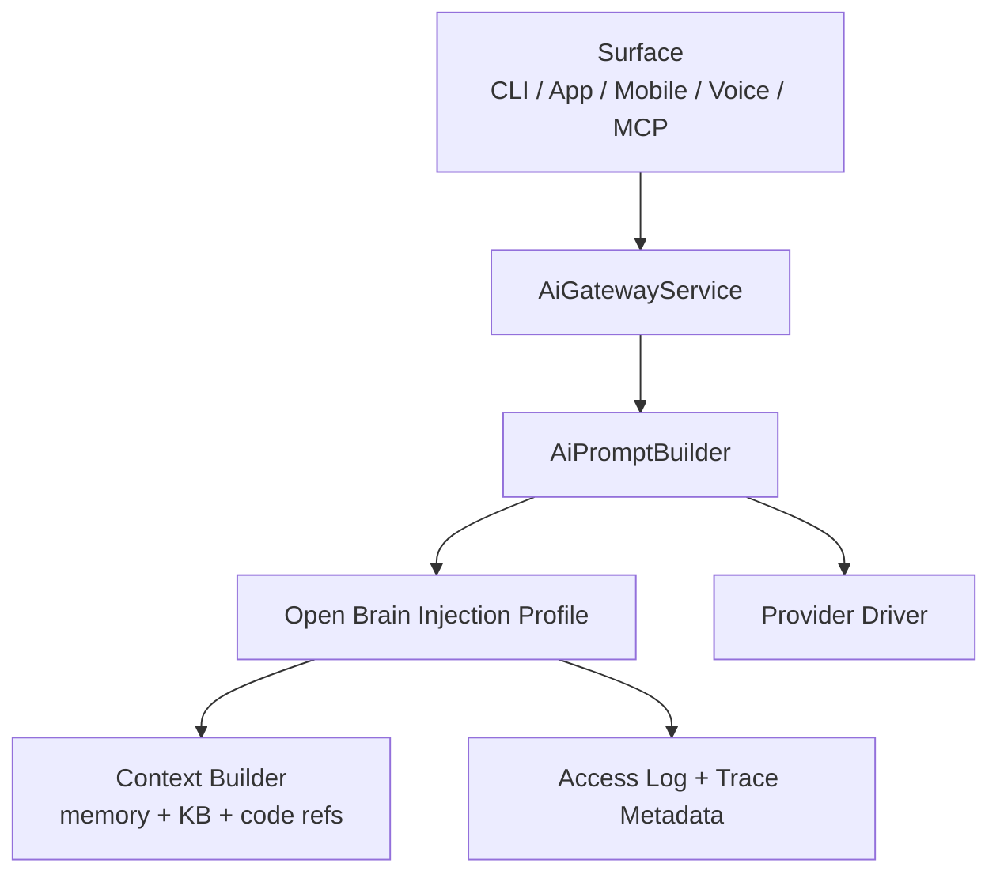

# Atlas Open Brain Context Injection

This is the active runtime profile for automatic Open Brain injection. It is
kept compact on purpose so a fresh AI session can understand the rule in one
pass. The full 2026-05-03 implementation narrative is preserved at
`archive/source-material/open-brain-context-injection-full-2026-05-08.md`.

## Authority

| Concern | Canonical owner |
|---|---|
| Injection activation, prompt placement and failure semantics | This file |
| MCP/API/HTTP export boundary | `memory/open-brain-mcp.md` |
| Context refs, ranking, budget and provider-safe retrieval | `memory/retrieval-and-context.md` |
| Memory schemas, projections and privacy contracts | `memory/contracts.md` |
| Historical implementation notes | `archive/source-material/open-brain-context-injection-full-2026-05-08.md` |

## Runtime Rule

Open Brain injection is Core behavior. CLI, app, mobile, voice or MCP surfaces
must not manually paste memory into prompts. They submit task metadata and
policy hints to `atlas-server`; the backend composes a provider-safe context
packet, audits it, attaches trace metadata and injects one prompt section.



## Supported Surfaces

| Surface | Default policy | Notes |
|---|---|---|
| `atlas dev` | `auto` | Inject for programming tasks when context is available. |
| `atlas dev --complete` | `required` recommended | Heavy programming should fail closed when required context is missing. |
| `atlas continue` | `auto` | Reuse previous thread/task refs when safe; refresh when requested. |
| `atlas chat --mode=dev` | `auto` | Programming chat uses the same injection path as dev. |
| `atlas chat --mode=debug` | `auto` | Prioritize code refs, recent failures and relevant traces. |
| `atlas chat --mode=review` | `auto` | Prioritize contracts, changed files, gates and prior decisions. |
| Atlas App programming/review/debug | `auto` | App declares mode; backend owns context composition. |
| Mobile/voice realtime | `auto` through Surface Adapter | Never bypass Kernel or Decision Receipt. |

## Policy Modes

| Mode | Behavior |
|---|---|
| `off` | Skip injection intentionally and record the reason in trace metadata. |
| `auto` | Inject when useful and provider-safe; degrade gracefully if context is unavailable. |
| `required` | Missing/unsafe context fails closed before provider execution. |

Supported hints:

- `budget_chars`: maximum prompt budget for the Open Brain section.
- `refresh`: rebuild context instead of reusing recent safe context.
- `require`: convert unavailable context into `failed_closed`.
- `provider_safe_only`: always `true` for automatic injection.

## Injection Request

Minimum conceptual shape:

```json
{
  "surface": "cli_dev",
  "mode": "dev",
  "workspace": "/absolute/workspace",
  "objective": "short task objective",
  "task_id": "optional",
  "thread_id": "optional",
  "provider": "claude|codex|openai|gemini|local",
  "model": "optional",
  "policy": {
    "mode": "auto",
    "budget_chars": 20000,
    "refresh": false,
    "require": false,
    "provider_safe_only": true
  }
}
```

Required fields: `surface`, `mode`, `workspace`, `objective`,
`policy.mode`, `policy.provider_safe_only`.

## Injection Result

Minimum conceptual shape:

```json
{
  "enabled": true,
  "status": "injected",
  "reason": "mode_requires_open_brain",
  "context_pack_hash": "sha256",
  "audit_id": "uuid",
  "prompt_section": "# Atlas Open Brain Context\n...",
  "summary": {
    "memory_refs": 4,
    "knowledge_refs": 3,
    "code_refs": 8,
    "budget_chars": 20000,
    "provider_safe": true
  },
  "safety": {
    "schema_version": "atlas.open_brain.context_pack_safety.v1",
    "provider_safe_only": true,
    "raw_content_exposed": false,
    "raw_content_persisted": false,
    "audit_persisted": true
  },
  "warnings": []
}
```

## Prompt Placement

The prompt must contain exactly one Open Brain section:

1. system and Atlas identity;
2. execution instructions and safety/policy;
3. task contract and user objective;
4. `# Atlas Open Brain Context`;
5. user request or generated development plan.

The injection service must deduplicate existing context pack content. Repeated
context belongs in Core retrieval/cache logic, not in surface-specific prompts.

## Audit And Evidence

Every injection attempt writes or updates trace metadata with:

- surface, mode, workspace and objective hash;
- policy mode, budget and provider-safe flag;
- status, reason and warnings;
- context pack hash and prompt section hash;
- memory/knowledge/code ref counts;
- audit id from `AtlasOpenBrainAccessLog` when persisted.

Important context injection events are evidence. They can feed read models and
Self-Improvement proposals, but they cannot silently promote memory or mutate
critical behavior.

## Failure Semantics

| Status | Meaning | Runtime behavior |
|---|---|---|
| `injected` | Context was attached successfully. | Continue provider execution. |
| `skipped` | Policy or mode intentionally disabled injection. | Continue and record reason. |
| `degraded` | Partial safe context was attached. | Continue with warning. |
| `failed_open` | Non-required context failed. | Continue without injection and record warning. |
| `failed_closed` | Required context failed or was unsafe. | Stop before provider execution. |

## Forbidden

- Surface-specific memory prompt assembly.
- Provider-owned memory merge.
- Secrets or non-provider-safe memory in automatic context.
- MCP write tools in this path.
- ChromaDB, external vector search or new embedding stores without AP approval.
- Remote multiuser sync/SSE as part of this injection profile.
- Automatic projection apply from context usage alone.

## Validation

Run after changing injection policy, prompt placement, request/result metadata
or Open Brain runtime integration:

```bash
php artisan test tests/Unit/Ai tests/Feature/Ai
php artisan atlas:ai:architecture-validate --json
atlas engineering knowledge docs-health
atlas engineering knowledge sync --prune
atlas engineering knowledge index-code --prune
```

## Definition Of Done

- All supported surfaces enter through the same backend injection profile.
- `required` mode fails closed before provider execution.
- Automatic context remains provider-safe and budgeted.
- Prompt contains one deduplicated Open Brain section.
- Trace/audit metadata can explain why context was injected, skipped or failed.
- No surface, provider or tool decides memory, provider, policy or promotion.
