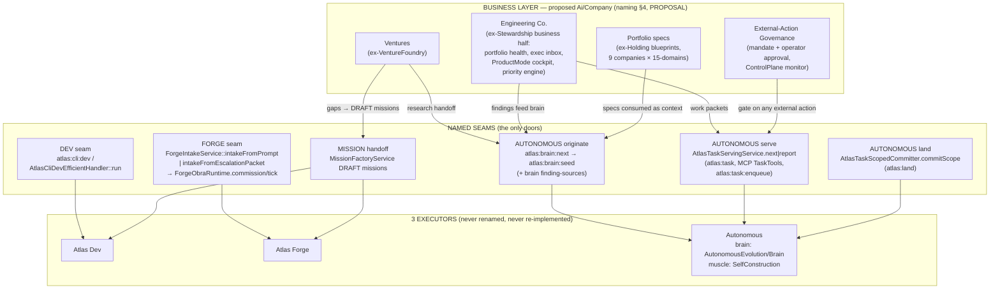

# ARCHITECT VERDICT — Enterprise/Executor Unification

**Status: draft-v1 (needs adversarial verify before execution)**
**Obra:** GOD-DEBULK · **Date:** 2026-07-22 · **Author:** Chief architect (Claude)
**Scope:** Holding · VentureFoundry+Foundry+IntelligenceFactory · SoftwareCompanyStewardship(+SoftwareCompany, EngineeringCompany) · ExecutorSeams
**Rule applied:** Atlas has EXACTLY 3 executors (Dev, Forge, Autonomous). Everything else is a business layer that CONSUMES them via named seams. A business module carrying its own provider calls / queue / lease / merge / spawn / "autonomous cycle" is duplication to fuse or kill.
**Spot-verified in code before judging** (2026-07-22): Holding in-process artisan cycle (:1481-1520), Holding paper flow queue (`external_execution_allowed => false`), Stewardship `invokeProvider` via Forge driver router (:5188-5218), Reliable24hLoopRunnerService = 3,974 LOC, Rsi `git apply` (:98-112), Frontier direct `provider->run` (:104-127), `app/Services/Ai/Obra/` parallel spine (19 files).

---

## 1. Target architecture



Canonical consumption patterns (already proven in-repo, canonize as THE way):

| Pattern | Model citizen | Evidence |
|---|---|---|
| Thin artisan wrapper | `AtlasCliFixCommand` → `atlas:cli:dev` | app/Console/Commands/AtlasCliFixCommand.php:24 |
| Escalation-packet handoff | `DevToForgePromotionService::promote` → `ForgeIntakeService::intakeFromEscalationPacket` | app/Services/AtlasCode/DevToForgePromotionService.php:332 |
| Same-service MCP wrapper | OpenBrainMcp TaskTools over the SAME `AtlasTaskServingService` | app/Services/Ai/OpenBrainMcp/TaskTools.php:28-45 |
| DRAFT-mission bridge (never auto-executes) | `VentureExecutionBridgeService` → `MissionFactoryService` | app/Services/Ai/VentureFoundry/VentureExecutionBridgeService.php:24-28 |
| Serving-disk enqueue | `atlas:task:enqueue` → `AtlasTaskServingStack` | app/Console/Commands/AtlasTaskEnqueueCommand.php:26 |

Anti-pattern (found live, banned by this blueprint): business module calls Forge's provider driver router or spawns Process/git directly.

---

## 2. Per-module verdicts

### 2.1 app/Services/Ai/Holding — verdict: **SPLIT** (keep 3 kernels, kill ~90% paper machinery)

**What it IS:** a 9-company "autonomous holding" that is overwhelmingly fixture presenting itself as runtime. Zero provider calls, zero shell, zero HTTP in the entire module. Runtime records are self-persisted COMPLETED by the same service that reads them back as coverage (EnterpriseFlowFixtureActionRuntimeService.php:5068 → 6294-6309 → 6465); metrics are constants (`policy_compliance => 1.0` :5059); every terminal state is a variant of `*_external_execution_blocked` — it can never do anything by construction (ExternalActionMandateRegistryService.php:17508-17513).

**Keep (genuine business logic) and WHERE it lives:**
1. **9-company portfolio blueprints** (org roles, flows, per-vertical gates — e.g. finance blocked-capital-actions at EnterpriseFlowFixtureActionRuntimeService.php:4998-5019) → compact specs under the business layer (`Company/Portfolio`), consumed by the Autonomous brain as origination context. Specs, not 44k LOC of array literals.
2. **External-action governance contract** — mandate register/preflight/operator approval with second reviewer (ExternalActionMandateRegistryService.php:280-521 + AiHoldingExternalActionMandate + AiOperatorApproval). This is LIVE and load-bearing: ControlPlane alarms if any row flips execution on (AtlasAiControlPlaneService.php:2509-2554). → slim governance module (`Company/Governance`); becomes the gate any business module must pass before `atlas:task:enqueue` of an external-effect task.
3. **Promotion-ladder taxonomy** (fixture → probe → supervised → operator-signed cutover) → one doc/spec the executors enforce.

**Kill/quarantine:** operating-cycle mini-orchestrator, paper flow-run queue + DLQ + cutover work orders, self-certifying fixture runtime, readiness "target-9" score, ~150-action command surface. See duplication table §3 rows H1-H2.

### 2.2 VentureFoundry + Foundry + IntelligenceFactory — verdict: **KEEP / SPLIT / QUARANTINE** respectively

**VentureFoundry — KEEP as business layer (the group's model citizen).** Dormant (0 rows in all ai_venture* tables, 22/07) but architecturally correct: S0→S5 gates evaluate ONLY persisted records; ReconciledCashEventStore as revenue truth; fail-closed action dispatch (irreversible ⇒ operator mandate); execution seam already right — gaps become DRAFT missions via MissionFactoryService, research via DomainHandoffService. Its two direct provider calls (VentureIdeaGenerationService.php:35, VentureStrategistAnalysisService.php:42) go through the canonical AiProviderManager pipe — acceptable provider-plumbing, not a re-implemented executor. Lives at `Company/Ventures` after naming approval.

**Foundry — SPLIT.**
- **Quarantine Frontier (~5.1k):** it is a second origination brain (AP-B gate → AP-C generate → 6-gate armor → curation inbox, FrontierGenerationOrchestratorService.php:52-130) duplicating `atlas:brain:next` + `atlas:brain:seed`, with direct provider wiring bypassing AiProviderManager (FrontierGenerateCommand.php:129-137). Never ran for real: frontier_mode default false (config/atlas.php:4403), no drop-reason/prior-proposal ledgers on disk, real generator + all judge seats hard-block by design. QUARANTINE confirmed by ledger re-verification.
- **Port the honesty-gate IP into brain:seed:** harvest-real-anchors → verify-or-drop → cite-verified-anchors → operator receipt → measure-or-revert. That ladder IS what the seed-gate should be; keep as the Autonomous brain's gate stack, not a parallel pipeline.
- **Keep Rsi/EarnedAutonomy** (invariant registry, trust ledger, kill authority) — live safety logic consumed by Stewardship AreaFocusLoop. EXCEPT the `git apply` actuator (§3 row F2): execution machinery inside a governance module → quarantine or route through the SelfConstruction materializer.
- **Evidence harvest/verify (AP-A/B)** — read-only, honest; keep, re-pointed at the brain.

**IntelligenceFactory — QUARANTINE, reduce to a policy page.** No machinery duplication (claimPolicy honestly declares provider_invoked:false, confirmed :481-491), but fixture-grade advice: canned simulate() (:177-196), substring classifier (:501-524), 70 rows written this week that nothing consumes (0 capabilities ever registered). Live sidecar call-sites (Hyperflow :602-605, AEMOR, PersistentContext, RealitySandbox, Skills) tolerate null constructors — degrade to null, quarantine the service. The keepable idea (build/buy/borrow with required controls per risk class) → one page in the brain's origination context. Prior FUSE→Foundry verdict is WRONG TARGET; do not fuse.

### 2.3 SoftwareCompanyStewardship (+SoftwareCompany, EngineeringCompany) — verdict: **SPLIT** (largest duplication in the corpus; LIVE-engine lane, sequenced LAST)

**What it IS:** a complete second autonomous engineering company: scan→rank→select→worktree→provider→validate→diff-gate→commit→merge-train, wrapped by its own 24/7 runner + dedicated queue. It HAS run for real (26 merges Jun 1; 59 cycles / 0 merges Jul 16). Its merge-based landing **contradicts the pétreo Autonomous rule** (scoped commit on main, NEVER merge).

**Fuse into Autonomous (see §3 rows S1-S4):** the whole AreaFocusLoop cycle engine, the Reliable24h runner + SoftwareCompanyLoopRunJob, the merge queue/lease/governor, and both provider routing tables.

**Keep as business layer (`Company/Engineering`):** PortfolioStewardship health model + operator inbox; AutonomousExecutive decision inbox; ProductMode cockpit read models (routes/api.php:978-981 — aligned with terminal-first review focus); AreaStewardship/SelfExpanding growth playbook; StewardshipPriorityEngineService (codified prioritization rule); **AreaFocusDeepFindingEngineService** — re-pointed as a finding SOURCE for `atlas:brain:next`, incl. the AP-806 honest-stop (AutonomousEvolutionSessionService.php:1532-1558).

**Port to executors as governance (not business):** providerDiffQualityGate (:5261), ZeroProviderPreflightGate + review-lock threshold (Ap786OwnerFlowExecutor:60-77), repair learning registry, autonomy envelope.

**Re-home the ForgeAuthority ports** (AwisExecutionGatePort etc., bound at AppServiceProvider.php:736-737, consumed by Dev/Forge/Autonomous): interfaces load-bearing for all 3 executors currently homed in a business module — move to a neutral namespace; today the executors depend on the business layer, inverting the whole thesis.

**StewardshipEvolution is the pattern done right** (DevForgeRuntimeExecutionBridgeService imports the real Dev/Forge runtimes :7-9; AP-759 sandbox runs only allowlisted owner CLIs under operator receipt) — keep, promote as reference.

**EngineeringCompany — QUARANTINE:** record theater (statuses default 'passed' via options — AtlasRealEngineeringCompanyRuntimeService.php:80-83, :202; derived pass at :88-89). Receipts over declared, not measured, outcomes.

**SoftwareCompany — KEEP:** single read-only Desktop projection, executes nothing.

**Also quarantine:** the fixture-workspace demo path inside the production runner (StewardshipOwnerSandboxRuntimeRunnerService.php:485-514, :667-697) and the certification-of-the-loop tail (it certifies machinery this blueprint retires).

### 2.4 ExecutorSeams — verdict: **KEEP (canonical)**, with 2 flagged items

The seam map in §1 is drawn from this census entry and is the contract. Flagged:
1. **app/Services/Ai/Obra/ (~4.8k) = second obra runtime beside Forge** (AtlasObraDeliverCommand.php:112 commissions via AtlasObraService/AtlasObraExecutor, not ForgeIntakeService/ForgeObraRuntime). Mitigating: its only provider seam delegates to the proven AtlasLiveCodeDeliveryService (ProviderObraNodeDelivery.php:12-25). FUSE target = ForgeObraRuntime, but **blocked pending keep-list check**: AutonomousEvolution adapters (AtlasLoopObraExecutionAdapter) consume it and may be on the 26-class AtlasLoop* keep-list — verify against `docs/engineering-knowledge-base/atlas-autonomos-live-system.md` + `rg --no-ignore -w` before any move.
2. **Forge CLI drivers spawn Process directly** (AtlasForgeBaseCliInvocationDriver.php:257) — internal Forge plumbing with a prior keep-separate verdict (forge-driver-unification-audit). NO ACTION in this obra.
3. Legacy Dev preflight branch is default-dead (AtlasCliDevCommand.php:107-113, `--legacy` only) — cleanup candidate, out of this obra's scope.

---

## 3. Duplication table — executor machinery living outside the 3 executors

| # | Machinery | Evidence (file:line) | Duplicates | Fuse target / action |
|---|---|---|---|---|
| H1 | Holding daily "operating cycle": in-process Artisan orchestration over hardcoded routine catalog | app/Services/Ai/Holding/AutonomousHoldingOperatingCycleService.php:1481-1520 (Artisan::all + $command->run), catalog :1525-1541; fabricated flow evals :1440-1457 | Autonomous 24/7 cycle | KILL. If a daily status digest is wanted, it is a read-only report the brain consumes — not an orchestrator |
| H2 | Holding paper task queue + DLQ + "external worker" dispatch + cutover work orders with self-minted receipts | ExternalActionMandateRegistryService.php:17456-17557 (priority_score serving :17493-17497, DLQ :17526, exec blocked :17508-17513), :2120-2310, :3068-3330 (receipt from own payload :3261-3297) | Autonomous serving (atlas:task) | KILL the queue. External-effect work is enqueued via `atlas:task:enqueue`; the mandate/approval contract (:280-521) survives as the GATE on that enqueue |
| S1 | Stewardship full autonomous cycle: scan→select→provider→validate→commit→revert, raw git spawner | AutonomousEvolutionSessionService.php:1448 (runCycle), :5188-5218 (invokeProvider via Forge driver router — verified), :5224-5248 (Process validation), :5572-5585 (git add/commit), :4916-4934 (checkout+revert), :6521-6553, :6804 | Autonomous (brain+muscle) | FUSE: deep-finding engine → brain finding source; execution → atlas:task serving; landing → AtlasTaskScopedCommitter |
| S2 | Second 24/7 runtime: reliable runner (lock/kill-switch/pause/ledger) + dedicated Laravel queue | Reliable24hLoopRunnerService.php (3,974 LOC — verified; ledger :321-427); app/Jobs/SoftwareCompanyLoopRunJob.php (queue `software_company_loop`) | Autonomous master runtime | RETIRE. One 24/7 runtime: the Autonomous master switch |
| S3 | Branch+merge landing plane: merge train, durable repo lease, retry queue, ff-only governor | StewardshipMergeQueueService.php:12; StewardshipRepoMergeLeaseService.php:13; LoopMergeRetryQueueService.php:278 (Process git merge --ff-only); StewardshipBranchMergeGovernorService.php:692 | Autonomous landing (scoped commit on main, NEVER merge — pétrea) | KILL. Landing = AtlasTaskScopedCommitter.commitScope; merge-based machinery contradicts the pétreo rule |
| S4 | Two parallel provider-tier routing tables; godfile borrows Forge's driver router directly | AreaFocusLoop/LoopProviderRoutingService.php:101-115; AgentExecution/LaneProviderRoutingService.php; direct router calls AutonomousEvolutionSessionService.php:257, :5207 | Provider-plumbing (meta-provider / Atlas Decide / Forge Topology) | FUSE routing policy into Atlas Decide / Forge Provider Topology; ban direct driver-router calls from business code |
| F1 | Frontier origination pipeline with direct provider wiring + own limit-fallback router | AtlasClaudeCliFrontierGeneratorService.php:104-127 (own AiJob + provider->run — verified); FrontierGenerateCommand.php:129-137 (container-wired CLI providers); FrontierGenerationOrchestratorService.php:52-130 | Autonomous brain (brain:next + seed-gate) | QUARANTINE pipeline; PORT the 6-gate armor + verify-or-drop discipline into brain:seed |
| F2 | Rsi git-apply actuator ("ACDE lever S2" lineage) | RsiSelfImprovementApplyActuatorService.php:98-112 (git apply --check + apply — verified; flag default-OFF :65) | Autonomous muscle apply path (SelfConstruction materializer) | QUARANTINE actuator (keep the 5-barrier gate logic); any real apply goes through SelfConstruction |
| F3 | Mini execute-measure-revert cycle: git revert creates commits; arbitrary measure shell with deny-list only | RealGitRevertPort.php:47; RealMeasureCommandPort.php:60 (deny-list :78) | Autonomous landing/outcome | MOVE measure-or-revert under the executor that landed the change (scoped-commit path); no sibling module creates commits |
| O1 | Second obra runtime beside Forge | AtlasObraDeliverCommand.php:112 → Ai/Obra/AtlasObraService + AtlasObraExecutor; ProviderObraNodeDelivery.php:45-69 (own decomposer/model/timeout/spend) | Forge (ForgeObraRuntime) | FUSE into ForgeObraRuntime — AFTER keep-list check on AtlasLoopObraExecutionAdapter (§2.4) |
| V1 | Business-layer provider calls (sanctioned pipe) | VentureIdeaGenerationService.php:35; VentureStrategistAnalysisService.php:42 | Provider-plumbing (mitigated: AiProviderManager, batch-only, schema+grounding) | ACCEPT for now; optional later move behind a Dev/brain seam. Not blocking |
| X1 | Forge CLI drivers spawn Process directly | AtlasForgeBaseCliInvocationDriver.php:257 | Internal Forge plumbing | NO ACTION — prior keep-separate verdict (forge-driver-unification-audit) |

Not-duplication (recorded to prevent false positives in the verify pass): Holding has ZERO real provider/shell machinery (vocabulary-only duplication); IntelligenceFactory has zero machinery; StewardshipEvolution and the AP-759 owner sandbox runner are correct consumption; AtlasCliDevCommand's own Process/provider calls ARE the Dev executor.

---

## 4. Naming — PROPOSAL (needs operator approval; nothing renamed yet)

Operator verdict on "AutonomousHolding": horrível, fora do padrão. Proposal: **one coherent namespace for the whole business layer**:

```
app/Services/Ai/Company/
├── Portfolio/      # ex-Holding blueprints → compact 9-company/15-domain specs
├── Governance/     # ex-Holding mandate+approval contract (+ ControlPlane monitor hookup)
├── Ventures/       # ex-VentureFoundry (structure already correct; move only)
└── Engineering/    # ex-Stewardship business half (portfolio health, exec inbox,
                    #   ProductMode cockpit, priority engine, area growth playbook)
```

- Alternative name if `Company` collides conceptually: `Ai/Business/`. Single namespace either way — the point is ONE front door for "Atlas runs companies", all of it consuming the §1 seams.
- The 3 executors are NOT renamed. `Foundry` disappears as a name (Frontier quarantined, honesty gates absorbed by the brain, Rsi safety block re-homed with its consumer or into governance). `IntelligenceFactory`, `AutonomousHolding`, `EngineeringCompany` disappear.
- ForgeAuthority ports re-home to a neutral executor-support namespace (e.g. `app/Services/Ai/ExecutionAuthority/`) — also PROPOSAL.

---

## 5. Execution plan — ordered, reversible, golden-first

Standing constraints (pétreo): branch local `main` ONLY; scoped commits (`git add -- <files>`), one step = one commit = independently revertible; NEVER delete by `AtlasLoop*` prefix — 26 keep-list classes (`rg --no-ignore -w <Class>` must be > 0 before ANY removal); AAEL/Stewardship-Loop/TerminalLoop product names untouched; **sequencing rule: no namespace fusion in a lane whose concurrent engine is live**.

1. **Freeze + golden (no behavior change).** Holding already has 2 golden suites. ADD golden characterization for the untested surfaces this plan touches: Stewardship HTTP read models (routes/api.php:978-981), EngineeringCompany run() output, Ai/Obra deliver output. Commit per suite.
2. **Re-home ForgeAuthority port interfaces** out of SoftwareCompanyStewardship (pure interface move + binding update at AppServiceProvider.php:736-737 + import rewrites in the 5 executor call-sites). Zero behavior change, unblocks every later Stewardship step, and removes executors-depend-on-business inversion. Note: touches the live lane but is not fusion — interfaces only; full test suite after.
3. **Quarantine the provably-dead components** (by connected component → `archive/`, per established GOD-DEBULK mechanics):
   a. Foundry/Frontier 5.1k (flag default-false, never ran — config/atlas.php:4403; no runtime ledgers).
   b. IntelligenceFactory 2 files + its 4 commands, degrading the 6 sidecar call-sites to null (constructors already nullable — verify each with a failing-then-passing test).
   c. EngineeringCompany record-theater runtime + command.
   d. Stewardship fixture-workspace demo path (:485-514, :667-697) out of the production runner.
   Each with its `rg --no-ignore -w` keep-list proof attached to the commit.
4. **Holding split** (engine is paper, no live-engine risk, but ControlPlane dependency is real):
   a. Extract mandate/approval governance (models + :280-521 lifecycle) into the slim governance module; keep ControlPlane monitor (AtlasAiControlPlaneService.php:2509-2554) green the whole time — it reads models, so models keep their table names in step 1 of the split.
   b. Snapshot the 9 blueprints as compact specs (data/docs), goldens proving spec == generator output.
   c. Quarantine the paper machinery (operating cycle, flow queue, cutover, readiness, ~150-action command), retiring its golden suites in the same commit with an explicit note (they certify the corpse, not the survivors).
5. **Stewardship split — LAST (live concurrent engine).** Preconditions before ANY fusion commit in this lane: scheduler entry confirmed default-off (routes/console.php:11-20), no worker on queue `software_company_loop`, no Reliable24h lock held, operator ACK that the Jul 16 run was not an active bet.
   a. Port priority engine + deep-finding engine (with AP-806 honest-stop) as brain finding sources (additive; loop untouched).
   b. Port diff-quality gate / zero-provider preflight / review-lock into the executor paths (additive).
   c. Retire cycle engine + 24/7 runner + queue job + merge train/lease/governor (quarantine, not delete — reversal = restore from archive/).
   d. Keep business read models + cockpit + StewardshipEvolution bridge in place.
6. **Naming move to `Ai/Company`** — only after operator approves §4 AND step 5c landed (sequencing rule satisfied: no engine live in the lane being renamed). Pure `git mv` + namespace rewrite, one connected component per commit, goldens green after each.
7. **Ai/Obra → Forge fusion** — separate mini-obra after the keep-list question (§6 Q3) is answered; not blocking anything above.

Every step reversible by single-commit revert; goldens are the measure after each.

---

## 6. OPEN QUESTIONS (census could not prove — resolve before/at adversarial verify)

1. **Operator intent on the Stewardship loop.** Jul 16 produced a real 59-cycle run (0 merges). Was that a deliberate live bet on this engine or a test? Step 5 is gated on the answer.
2. **ControlPlane monitor semantics.** It counts AiHolding* rows where execution flags flip true (:2509-2554). Does it require populated tables, or is empty-table fine? Determines how much of the Holding data plane must survive the split.
3. **Keep-list status of AtlasLoopObraExecutionAdapter** (and any other Ai/Obra consumer with the AtlasLoop prefix). Must be checked against the 26-class keep-list in `atlas-autonomos-live-system.md` before O1 fusion.
4. **IF row consumers.** Census says the 70 gap/decision rows written 14-21/07 are consumed by nothing except ControlPlane dashboards. Needs one execution-time grep + DB check before degrading sidecars (step 3b).
5. **Where the external-action mandate contract lives long-term** — business governance module vs ControlPlane itself. Both consume it; this blueprint parks it in `Company/Governance` provisionally.
6. **VentureFoundry activation.** Dormant-by-data, correct-by-design. Keep dormant or wire the first real venture? Product/operator decision, not architecture — but affects whether its provider calls (V1) deserve a seam move.
7. **Fate of Holding's 12k golden-test LOC** — retire with the corpse vs distill into the compact-spec goldens of step 4b. Blueprint assumes retire+distill; verify pass should confirm nothing else pins those snapshots.
8. **Undeclared scope**: Holding's `EnterpriseBuildout/` subdir (1,581 LOC) was outside the original census scope declaration — connected-component quarantine must include it explicitly.
