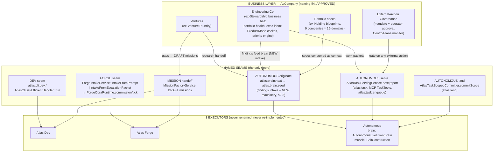

# ARCHITECT VERDICT — Enterprise/Executor Unification

**Status: draft-v2 (SOBREVIVEU ao verify adversarial; emendas incorporadas)**
**Obra:** GOD-DEBULK · **Date:** 2026-07-22 (v2: 2026-07-23) · **Author:** Chief architect (Claude)
**Scope:** Holding (incl. `MandateRegistry/` 22 sections ≈23.2k LOC + `EnterpriseBuildout/` 9 files = 9,943 LOC — both explicitly in scope) · VentureFoundry+Foundry+IntelligenceFactory · SoftwareCompanyStewardship(+SoftwareCompany, EngineeringCompany) · ExecutorSeams
**Rule applied:** Atlas has EXACTLY 3 executors (Dev, Forge, Autonomous). Everything else is a business layer that CONSUMES them via named seams. A business module carrying its own provider calls / queue / lease / merge / spawn / "autonomous cycle" is duplication to fuse or kill.
**Adversarial verify (3 lentes, 2026-07-23):** kill-safety, fuse-feasibility, business-value-loss — todas = SOBREVIVE_COM_EMENDAS. Every amendment is incorporated inline below (marked **[v2]**); refuted line-citations re-anchored.
**Re-anchoring note [v2]:** a concurrent GOD-DEBULK obra debulked the Holding god-file in the working tree: `ExternalActionMandateRegistryService.php` is now a **926-LOC delegating facade**; the mandate/approval lifecycle lives in `app/Services/Ai/Holding/MandateRegistry/MandateApprovalSection.php` (register :32, preflight :76, requestApproval :123), flow queue in `MandateRegistry/FlowRunQueueSection.php` (:53-88), cutover in `MandateRegistry/CutoverWorkOrderSection.php` + `CutoverCloseoutSection.php`. All Holding citations below use the post-debulk anchors; re-verify anchors again at execution time.

**Operator decisions (2026-07-23) [v2]:**
1. **Naming `Ai/Company` — APPROVED** (§4 is no longer a proposal).
2. **Stewardship Jul-16 run was a TEST**, not an active bet → **retirement APPROVED**; the step-5 operator-ACK precondition is satisfied (Q1 resolved).
3. **VentureFoundry → ACTIVATE the first real venture after the obra** (new step 8; product wiring; keep dormant until then). Q6 resolved.

---

## 1. Target architecture



**[v2] S3 honesty note:** the brain has **NO code-findings intake today**. `AtlasLoopOriginationPipeline::produce()` (app/Services/Ai/AutonomousEvolution/AtlasLoopOriginationPipeline.php:57) takes no findings parameter; the only external-candidate intake is `AtlasBrainFrontierSourceRegistry` (research-candidate schema title/url/summary/source — trendshift/github/arxiv), consumed only inside `scopeSignalsFor()` (AtlasBrainNextCommand.php:273), gated by `atlas.brain.scope_signal_digest_enabled` **default FALSE** (:266), and appended to the EMITTED payload only — context for the external actor, never an input to the deterministic origination pipeline. Any "findings feed brain" arrow is NEW machinery (see §2.3 and step 5a).

Canonical consumption patterns (already proven in-repo, canonize as THE way):

| Pattern | Model citizen | Evidence |
|---|---|---|
| Thin artisan wrapper | `AtlasCliFixCommand` → `atlas:cli:dev` | app/Console/Commands/AtlasCliFixCommand.php:24 |
| Escalation-packet handoff | `DevToForgePromotionService::promote` → `ForgeIntakeService::intakeFromEscalationPacket` | app/Services/AtlasCode/DevToForgePromotionService.php:332 |
| Same-service MCP wrapper | OpenBrainMcp TaskTools over the SAME `AtlasTaskServingService` | app/Services/Ai/OpenBrainMcp/TaskTools.php:28-45 |
| DRAFT-mission bridge (never auto-executes) | `VentureExecutionBridgeService` → `MissionFactoryService` | app/Services/Ai/VentureFoundry/VentureExecutionBridgeService.php:24-28 |
| Serving-disk enqueue | `atlas:task:enqueue` → `AtlasTaskServingStack::orchestrator()` | app/Console/Commands/AtlasTaskEnqueueCommand.php:42 |

Anti-pattern (found live, banned by this blueprint): business module calls Forge's provider driver router or spawns Process/git directly.

---

## 2. Per-module verdicts

### 2.1 app/Services/Ai/Holding — verdict: **SPLIT** (keep 3 kernels + ControlPlane data plane, kill the paper machinery)

**What it IS:** a 9-company "autonomous holding" that is overwhelmingly fixture presenting itself as runtime. Zero provider calls, zero shell, zero HTTP in the entire module. Runtime records are self-persisted COMPLETED by the same service that reads them back as coverage; metrics are constants; every terminal state is a variant of `*_external_execution_blocked` — it can never do anything by construction (post-debulk anchor: `MandateRegistry/FlowRunQueueSection.php:53-88` — `external_execution_allowed => false`, DLQ replay gated on operator review).

**Keep (genuine business logic) and WHERE it lives:**
1. **9-company portfolio blueprints** → compact specs under `Company/Portfolio`, consumed by the Autonomous brain as origination context. Specs, not tens of thousands of LOC of array literals. **[v2] The compact spec MUST enumerate the curated per-vertical blocks that today sit INSIDE kill zones** (they are `match($domainId)` literals, not filler): `domainPlaybookForCompany` (EnterpriseFlowFixtureActionRuntimeService.php:6192+ — enterprise plays, decision lenses, workflows, checks, operator questions per vertical), `domainSolutionSourceCatalog` (EnterpriseBuildout/EnterpriseBuildoutSupport.php:38 — real external-API catalogs per vertical), `domainOperatingDepthProfile` (:130 — value chains/skills/controls), `premiumAgentTemplates` (:202 — 90 curated templates), `domainWorkloadSkills/Subagents` (:513-576), `blueprints()` flow_specs core (:719+), `customerSegments`/`positioningClaim` (CommercialCustomerSection.php:170-198), `verticalSolutionSuites` (DomainSolutionSection.php:469). Mechanic: **snapshot the FULL companyPacket as data BEFORE quarantining `EnterpriseBuildout/`** — the spec distills from the snapshot, nothing curated is lost.
2. **External-action governance contract** — mandate register/preflight/operator approval with second reviewer (**[v2] re-anchored:** lifecycle in `MandateRegistry/MandateApprovalSection.php` :32/:76/:123; facade `ExternalActionMandateRegistryService.php` now 926 LOC; models `AiHoldingExternalActionMandate` + `AiOperatorApproval`). This is LIVE and load-bearing: ControlPlane alarms if any row flips execution on. **[v2] The ControlPlane monitor consumes FOUR model families, not two:** AtlasAiControlPlaneService.php:16-18 imports `AiHoldingExternalCutoverRuntimeInvocation/WorkItem/WorkOrder`; :2470-2477 requires all four tables to EXIST for non-`missing` status; :2518-2562 queries and alarms over `external_execution_allowed` on the three CUTOVER tables. → slim governance module (`Company/Governance`) keeps **mandate+approval AND the 3 `AiHoldingExternalCutover*` models + tables** (or the monitor + `tests/Feature/Ai/ControlPlane/AtlasAiControlPlaneServiceTest.php:333-376` are amended in the SAME commit as the H2 kill — that kept test inserts rows into all three cutover tables and asserts `ready`/`receipt_binding_count=1`). Becomes the gate any business module must pass before `atlas:task:enqueue` of an external-effect task (**new wiring — see H2**).
3. **Promotion-ladder taxonomy** (fixture → probe → supervised → operator-signed cutover) → one doc/spec the executors enforce.

**Kill/quarantine:** operating-cycle mini-orchestrator, paper flow-run queue + DLQ + cutover work orders (models/tables excepted per keep #2), self-certifying fixture runtime, readiness "target-9" score, ~150-action command surface, `EnterpriseBuildout/` (9 files, **9,943 LOC — not 1,581 as v1 stated**) after the keep-#1 snapshot, `MandateRegistry/` sections minus the mandate/approval lifecycle. See §3 rows H1-H2.

**[v2] Kill-safety correction — the fixture runtime is NOT module-internal:** `EnterpriseFlowFixtureActionRuntimeService` + `AutonomousHoldingEnterpriseBuildoutService` are handle-time dependencies of **NINE 15-Domains commands outside the module**: AtlasAiCyberDomainCommand, AtlasAiResearchDomainCommand, AtlasAiOperationsDomainCommand (method-injects buildout :26, `app()`s fixture runtime :33, routes actions through `supports()/run()` :36-40), AtlasAiAutomationDomainCommand, AtlasAiMarketingDomainCommand, AtlasAiPersonalDevelopmentDomainCommand, AtlasAiFinanceDomainCommand, AtlasAiStrategyDomainCommand, AtlasAiEngineeringCompanyCommand. **These nine commands JOIN the Holding fixture-runtime connected component** (quarantined together), or — if the domain commands' non-fixture actions must keep working — the fixture runtime gets a shim stub with `supports() => false` in the same commit.

### 2.2 VentureFoundry + Foundry + IntelligenceFactory — verdict: **KEEP(+ACTIVATE) / SPLIT / QUARANTINE** respectively

**VentureFoundry — KEEP as business layer (the group's model citizen), then ACTIVATE.** Dormant (0 rows in all ai_venture* tables, 22/07) but architecturally correct: S0→S5 gates evaluate ONLY persisted records; ReconciledCashEventStore as revenue truth; fail-closed action dispatch (irreversible ⇒ operator mandate); execution seam already right — gaps become DRAFT missions via MissionFactoryService, research via DomainHandoffService. Its two direct provider calls (VentureIdeaGenerationService.php:35, VentureStrategistAnalysisService.php:42) go through the canonical AiProviderManager pipe — acceptable provider-plumbing, not a re-implemented executor. Lives at `Company/Ventures`. **[v2] Operator decision: wire the FIRST REAL VENTURE after the obra lands (step 8); keep dormant until then.**

**Foundry — SPLIT.**
- **Quarantine Frontier (~5.1k):** a second origination brain (AP-B gate → AP-C generate → 6-gate armor → curation inbox, FrontierGenerationOrchestratorService.php:52-130) duplicating `atlas:brain:next` + `atlas:brain:seed`, with direct provider wiring bypassing AiProviderManager (FrontierGenerateCommand.php:129-137). Never ran for real: frontier_mode default false (config/atlas.php:4403), no drop-reason/prior-proposal ledgers on disk, real generator + all judge seats hard-block by design. QUARANTINE confirmed by ledger re-verification.
- **[v2] `FoundryExhaustionRarityGateService` + `AtlasFoundryExhaustionGateCommand` JOIN the Frontier quarantine (step 3a).** The gate sits at Foundry ROOT (not Frontier/), ctor-requires the S2 retire-target `Reliable24hLoopRunnerService` (FoundryExhaustionRarityGateService.php:73, reads its ledger :427), and is lazily consumed ONLY by the Stewardship engine (AutonomousEvolutionSessionService.php:392-395, called at :1568). It bridges the two lanes: quarantined nowhere in v1, it would crash the loop if killed at 3a with the loop live, or dangle at 5c. With the operator's Jul-16-was-a-TEST decision the loop is confirmed off → quarantine it at 3a with Frontier, retiring `tests/Feature/Ai/Foundry/FoundryExhaustionRarityGateServiceTest.php` + `tests/Unit/Ai/Foundry/FoundryExhaustionRarityFailClosedTest.php` in the same commit.
- **[v2] Honesty-gate IP → brain:seed is a RE-IMPLEMENTATION, not a port.** The seed gate is a fixed composition over `AtlasTaskPacketQualityInspector` with const fatal lists and no extension point (AtlasBrainSeedQualityGate.php:30-53, contract "pure — no enqueue, no mutation"); Frontier gates bind to `evolution_proposal.v1` with provider-seat judge panels — schema- and contract-incompatible. Amended plan: **re-implement the verify-or-drop / cite-verified-anchors discipline as new deterministic predicates** in AtlasBrainSeedQualityGate / AtlasTaskPacketQualityInspector. **Dropped from the seed ladder:** "operator receipt" (judge-panel/provider seats violate the seed gate's pure contract) and "measure-or-revert" (post-landing concern — belongs to F3's landed-executor path, where this blueprint already routes it).
- **Keep Rsi/EarnedAutonomy** (invariant registry, trust ledger, kill authority) — live safety logic consumed by Stewardship AreaFocusLoop. EXCEPT the `git apply` actuator (§3 row F2): execution machinery inside a governance module → quarantine (kill-safe: no invoker outside its own unit test; sacred-path reference degrades to `missing` sentinel by design). **[v2] Retire `tests/Unit/Ai/Foundry/Rsi/RsiSelfImprovementApplyActuatorServiceTest.php` in the same commit.**
- **Evidence harvest/verify (AP-A/B)** — read-only, honest; keep, re-pointed at the brain.

**IntelligenceFactory — QUARANTINE, reduce to a policy page.** No machinery duplication (claimPolicy honestly declares provider_invoked:false, confirmed :481-491), but fixture-grade advice: canned simulate() (:177-196), substring classifier (:501-524), 70 gap + 70 decision rows written 14-21/07 with 0 capabilities ever registered — DB-confirmed garbage intake ("sleep 8 && pwd", chat fragments). The keepable idea (build/buy/borrow with required controls per risk class, :563-578) → one page in the brain's origination context. Prior FUSE→Foundry verdict is WRONG TARGET; do not fuse.
**[v2] Sidecar degradation is NOT uniformly nullable — same-commit fixes required:**
- Hyperflow, PersistentContext, RealitySandbox DO degrade gracefully (try/catch→null / null-check — confirmed).
- **Skills sidecar is NOT nullable:** `AtlasSkillEvolutionRuntimeService.php:24` ctor-requires the IF runtime service non-nullable → breaks `AtlasSkillEvolutionCommand` at resolution. Make it nullable in the quarantine commit.
- **AEMOR has no nullable ctor at all:** `AtlasAemorRuntimeService.php:487` resolves via `app()`, and the catch block at **:500 itself evaluates `AtlasIntelligenceFactoryRuntimeService::EVOLUTION_SCHEMA`** — with the class unloadable the catch throws a fresh uncaught Error on the outcome-close path (:176). Inline the schema string (or hoist a local constant) in the same commit.
- **Path-pins (7th consumer):** update `AtlasAiProductCertificationService.php` :116/:118 (IF source-path constants) + the checklist entries at :734-735, `ControlPlaneRuntimeCertification.php:266` (reads the runtime-service SOURCE from disk), and `EngineeringKernel/Adapters/CertifierClassificationLedger.php:106` — **in the SAME commit as the quarantine**, or product certification goes red.
- ControlPlane's IF section survives as scoped: fully table-guarded, reads only the 7 model classes, which stay.

### 2.3 SoftwareCompanyStewardship (+SoftwareCompany, EngineeringCompany) — verdict: **SPLIT** (largest duplication in the corpus; LIVE-engine lane, sequenced LAST)

**What it IS:** a complete second autonomous engineering company: scan→rank→select→worktree→provider→validate→diff-gate→commit→merge-train, wrapped by its own 24/7 runner + dedicated queue. It HAS run for real (26 merges Jun 1; 59 cycles / 0 merges Jul 16 — **[v2] operator confirms Jul 16 was a TEST**). Its merge-based landing **contradicts the pétreo Autonomous rule** (scoped commit on main, NEVER merge).

**Fuse into Autonomous (see §3 rows S1-S4):** the whole AreaFocusLoop cycle engine, the Reliable24h runner + SoftwareCompanyLoopRunJob, the merge queue/lease/governor, and both provider routing tables.

**Keep as business layer (`Company/Engineering`):** PortfolioStewardship health model + operator inbox; AutonomousExecutive decision inbox; ProductMode cockpit read models (routes/api.php:979-982 — aligned with terminal-first review focus); AreaStewardship/SelfExpanding growth playbook; StewardshipPriorityEngineService (codified prioritization rule); **AreaFocusDeepFindingEngineService** as a finding SOURCE for the brain, incl. the AP-806 honest-stop (AutonomousEvolutionSessionService.php:1532-1558).

**[v2] Deep-finding port = NEW brain machinery, budgeted honestly (was understated in v1).** The brain has no code-findings intake (§1 S3 note): porting requires (a) a findings intake — a findings NDJSON registry mirroring `AtlasBrainFrontierSourceRegistry`, or a new `produce()` input on the origination pipeline; (b) a decision whether findings are **context-only** (emitted payload — safer, keeps the pétreo brain path byte-identical when the flag is off) or **deterministic origination candidates** (a pipeline change on the pétreo brain path — bigger blast radius); (c) turning ON `atlas.brain.scope_signal_digest_enabled` (default false — its OFF⇒byte-identical contract currently protects the brain payload); and (d) un-hardwiring the engine from its single area (`DEFAULT_AREA_ID = 'agentic_engineering_os'` at AreaFocusDeepFindingEngineService.php:80; any other area blocked as `unsupported_area` :286-288). This is step 5a and it is NEW machinery, not a re-point.

**[v2] Keep/kill couplings that must be handled in the SAME commit as their retirements (step 5c):**
- **`AreaFocusLoopCommandController` write surface retires WITH the runner.** The kept mobile Loop Command Surface is glued to the retired engine: ctor-requires `Reliable24hLoopRunnerService` (AreaFocusLoopCommandController.php:58) and dispatches `SoftwareCompanyLoopRunJob` (:582) from POST `/loop/{area}/start-run` (routes/api.php:999; write POSTs :998-1002+). Split the read-model GETs (:991-997) from the write surface FIRST, then retire the POSTs + ctor dependency in the same commit as the Reliable24h/job retirement — otherwise every kept `/loop/*` route 500s and the mobile buttons go dead.
- **`StewardshipFirstLiveBranchProofService` breaks with the merge governor:** ctor-requires `StewardshipBranchMergeGovernorService` (:39; interface bound at AppServiceProvider.php:715), and `tests/Unit/Ai/Rsi/RsiMetaMeasuredOrRevertedE2ETest.php:245` mocks that interface. Rewire or retire both (plus the binding) before/with the governor kill.

**Port to executors as governance (not business):** providerDiffQualityGate (:5261), ZeroProviderPreflightGate + review-lock threshold (Ap786OwnerFlowExecutor:60-77), repair learning registry, autonomy envelope.

**Re-home the ForgeAuthority ports** (4 port interfaces under `AreaFocusLoop/ForgeAuthority/`, consumed by Dev/Forge/Autonomous): interfaces load-bearing for all 3 executors currently homed in a business module — move to a neutral namespace; today the executors depend on the business layer, inverting the whole thesis. **[v2] Honest rewrite surface (v1 said "5 call-sites"):** the namespace is referenced across **~24-27 app/ files + ~13-14 test files** (verify pass measured 27+13; fresh count 24+14 — drifts with the concurrent debulk; re-run `rg -l 'ForgeAuthority' app/ tests/` at execution time) including the Dev HTTP pipeline (~10 files under app/Http/Controllers/AtlasDev/Support/PipelineRun/), `SelfConstruction/AtlasTaskServingService.php`, `Programming/AtlasForgeGovernedPromotionService.php`, `AtlasDevRunWorkerCommand.php`. Bindings are **4 lines at AppServiceProvider.php:735-738** (ForgeProviderTopologyPort:735, ForgeLiveDecideReceiptPort:736, AwisExecutionGatePort:737, AwisHandoffPackPort:738). Zero path-literal references found — still a safe mechanical move, just budget it honestly.

**StewardshipEvolution is the pattern done right** (DevForgeRuntimeExecutionBridgeService imports the real Dev/Forge runtimes :7-9; AP-759 sandbox runs only allowlisted owner CLIs under operator receipt) — keep, promote as reference (minus the FirstLiveBranchProof coupling above).

**EngineeringCompany — [v2] SPLIT, not quarantine.** The record theater is real ONLY in the `run()`+command surface (statuses default 'passed' via options — AtlasRealEngineeringCompanyRuntimeService.php:80-83, :202; derived pass :88-89). But the service itself is **load-bearing for the LIVE mutative path of all 3 executors**: `EliteExecutorKernel.php:553` routes `adjudicateMutativeCandidate` (the 22-role court) through it and `:1007` calls `createEngagement`/`createCycle` on every mutative order; EliteExecutorKernel is resolved by the live Autonomos landing seam (`AtlasTaskScopedCommitter.php:333`) and by the Dev/Forge adapters (EliteExecutorKernelDevAdapter, ForgeIntakeService.php:60). Load-time constant deps in the KEEP zone: `EngineeringRoleRoster.php:12` (`OFFICIAL_ROLES = AtlasRealEngineeringCompanyRuntimeService::QUALITY_ROLES` — canonical 22-role roster, genuine business knowledge; Error on class load if removed), `EngineeringQualityCourt.php:426/:436` + `KernelEvidenceAuthority.php:112` (QUALITY_ROLE_PRODUCER in HMAC evidence seals), `AtlasRealEngineeringExecutionKernelService` ROLE_SCHEMA at 8+ sites, live route `routes/api.php:851` (POST /work/company). **Verdict: quarantine ONLY `AtlasAiEngineeringCompanyCommand` + the theater `run()` surface (after detaching); treat the runtime service as EngineeringKernel infrastructure** — candidate for the same neutral re-home as the ForgeAuthority ports. Path pins `AtlasAiProductCertificationService.php:106-110` (service + 2 test paths) and `ControlPlaneRuntimeCertification.php:223` update in the same commit.

**SoftwareCompany — KEEP:** single read-only Desktop projection, executes nothing.

**Also quarantine:** the fixture-workspace demo path inside the production runner (StewardshipOwnerSandboxRuntimeRunnerService.php:485-514, :667-697 — kill-safe: flag-gated, AtlasDevSeniorLoopRunCommand has its own independent fixture creation) **[v2] retiring the demo-path cases of `StewardshipOwnerSandboxRuntimeRunnerServiceTest` in the same commit**, and the certification-of-the-loop tail (it certifies machinery this blueprint retires).

### 2.4 ExecutorSeams — verdict: **KEEP (canonical)**, with 2 flagged items

The seam map in §1 is drawn from this census entry and is the contract. Flagged:
1. **app/Services/Ai/Obra/ (~4.8k) = second obra runtime beside Forge** (AtlasObraDeliverCommand.php:112 commissions via AtlasObraService/AtlasObraExecutor, not ForgeIntakeService/ForgeObraRuntime). Mitigating: its only provider seam delegates to the proven AtlasLiveCodeDeliveryService (ProviderObraNodeDelivery.php:12-25). **[v2] Keep-list question RESOLVED (was Q3): `AtlasLoopObraExecutionAdapter` is NOT on the 26-class keep-list** (docs/engineering-knowledge-base/atlas-autonomos-live-system.md:213-238) — it and its consumers (AtlasLoopTaskGrinder) are ACDE-dead; the keep-list was never the real blocker. **The real preconditions:** (1) a **consumer inventory** — ~20 live consumers of the `Ai\Obra` namespace outside the module and outside the dead adapter (AtlasOpenBrainContextPackService, AtlasOpenBrainSessionCaptureService, AtlasAobgWorkspaceOnboardingService, Organism/AtlasOrganismMissionService, AtlasBriefCommand, AtlasBlastRadiusCommand, AtlasSpecCritiqueCommand, EngineeringKernel adapters, AtlasForgeMultiNodeL410ProofService, …); (2) the **path-literal mapping at AtlasLoopBroaderRegressionGate.php:63-64** (`'app/Services/Ai/Obra' => tests/Feature/Ai/Obra`) that survives namespace-only greps. **And the fusion is honestly a REWRITE, not a move:** ForgeObraRuntime (587 LOC) is a cycle/lease/tick runtime with ZERO node/decomposer concepts (`rg 'decompos|node'` = 0 matches), while Ai/Obra is a node-graph runtime (19 files: DeterministicObraDecomposer, WaveScheduler, NodeDelivery, Certification). **REVISED verdict: keep Ai/Obra as THE node-graph obra runtime, thin it, and unify only the provider seam it already delegates (AtlasLiveCodeDeliveryService); full fusion only as a dedicated rewrite-scale obra with the consumer inventory done first.** See row O1 + step 7.
2. **Forge CLI drivers spawn Process directly** (AtlasForgeBaseCliInvocationDriver.php:257) — internal Forge plumbing with a prior keep-separate verdict (forge-driver-unification-audit). NO ACTION in this obra.
3. Legacy Dev preflight branch is default-dead (AtlasCliDevCommand.php:107-113, `--legacy` only) — cleanup candidate, out of this obra's scope.

---

## 3. Duplication table — executor machinery living outside the 3 executors

| # | Machinery | Evidence (file:line) | Duplicates | Fuse target / action |
|---|---|---|---|---|
| H1 | Holding daily "operating cycle": in-process Artisan orchestration over hardcoded routine catalog | AutonomousHoldingOperatingCycleService.php:1481-1488 (Artisan::all + $command->run — re-verified post-debulk), catalog :1525-1541 | Autonomous 24/7 cycle | KILL. Only caller is its own command; no scheduler entry. If a daily status digest is wanted, it is a read-only report the brain consumes — not an orchestrator |
| H2 | Holding paper task queue + DLQ + "external worker" dispatch + cutover work orders with self-minted receipts | **[v2] re-anchored:** MandateRegistry/FlowRunQueueSection.php:53-88 (priority_score serving :70, DLQ :88, exec blocked :80-86); MandateRegistry/CutoverWorkOrderSection.php + CutoverCloseoutSection.php | Autonomous serving (atlas:task) | KILL the queue. External-effect work is enqueued via `atlas:task:enqueue`; the mandate/approval contract (MandateApprovalSection.php:32-260) survives as the GATE on that enqueue. **[v2]** (a) wiring that gate at the `AtlasTaskServingStack::orchestrator()` boundary is **NEW wiring** — the gate composition in brain:seed/enqueue is hardcoded per-command, not pluggable; small but not zero; (b) the 3 `AiHoldingExternalCutover*` models + tables are EXEMPT from this kill (ControlPlane monitor — §2.1 keep #2) |
| S1 | Stewardship full autonomous cycle: scan→select→provider→validate→commit→revert, raw git spawner | AutonomousEvolutionSessionService.php:1448 (runCycle), :5188-5218 (invokeProvider via Forge driver router — verified), :5224-5248 (Process validation), :5572-5585 (git add/commit), :4916-4934 (checkout+revert), :6521-6553, :6804 | Autonomous (brain+muscle) | FUSE: deep-finding engine → brain finding source (**[v2] via NEW intake machinery, §2.3**); execution → atlas:task serving (adapter over proven seams — feasibility confirmed); landing → AtlasTaskScopedCommitter |
| S2 | Second 24/7 runtime: reliable runner (lock/kill-switch/pause/ledger) + dedicated Laravel queue | Reliable24hLoopRunnerService.php (3,974 LOC — verified; ledger :321-427); app/Jobs/SoftwareCompanyLoopRunJob.php (queue `software_company_loop`) | Autonomous master runtime | RETIRE. One 24/7 runtime: the Autonomous master switch. **[v2]** AreaFocusLoopCommandController write surface (ctor :58, dispatch :582, POST routes/api.php:999) retires in the SAME commit (§2.3) |
| S3 | Branch+merge landing plane: merge train, durable repo lease, retry queue, ff-only governor | StewardshipMergeQueueService.php:12; StewardshipRepoMergeLeaseService.php:13; LoopMergeRetryQueueService.php:278 (Process git merge --ff-only); StewardshipBranchMergeGovernorService.php:692 | Autonomous landing (scoped commit on main, NEVER merge — pétrea) | KILL. Landing = AtlasTaskScopedCommitter.commitScope. **[v2]** StewardshipFirstLiveBranchProofService:39 + binding AppServiceProvider.php:715 + RsiMetaMeasuredOrRevertedE2ETest.php:245 rewired/retired with the governor (§2.3) |
| S4 | Two parallel provider-tier routing tables; godfile borrows Forge's driver router directly | AreaFocusLoop/LoopProviderRoutingService.php:88-115 (static LANE_TIER + TIER_PROVIDER_CHAIN); AgentExecution/LaneProviderRoutingService.php; direct router calls AutonomousEvolutionSessionService.php:257, :5207 | Provider-plumbing (meta-provider / Atlas Decide / Forge Topology) | FUSE the STATIC half into Atlas Decide / Forge Provider Topology (receiving surfaces confirmed: AtlasDecideService.candidateProvider `?array $policy` :127; Topology topology/defaultRoles/defaultFallbackChain/defaultProviderCapacity). **[v2] Fate of the DYNAMIC half declared:** the ProviderReliabilityLayerService coupling + error-hash/timeout escalation (LoopProviderRoutingService.php:122 ERROR_ESCALATION_THRESHOLD, :125 TIMEOUT_FALLBACK_THRESHOLD, ctor :128; applied :257/:267/:373) has NO receiving slot in Decide/Topology → **port it as Decide reliability SIGNALS (preferred) or explicitly DROP it with the loop**; decision at step 5b, not silently lost. Ban direct driver-router calls from business code |
| F1 | Frontier origination pipeline with direct provider wiring + own limit-fallback router | AtlasClaudeCliFrontierGeneratorService.php:104-127 (own AiJob + provider->run — verified); FrontierGenerateCommand.php:129-137; FrontierGenerationOrchestratorService.php:52-130 | Autonomous brain (brain:next + seed-gate) | QUARANTINE pipeline; **[v2] RE-IMPLEMENT** (not port) verify-or-drop / cite-verified-anchors as new deterministic predicates in the seed gate; operator-receipt + measure-or-revert dropped from the seed ladder (§2.2) |
| F2 | Rsi git-apply actuator ("ACDE lever S2" lineage) | RsiSelfImprovementApplyActuatorService.php:98-112 (git apply --check + apply — verified; flag default-OFF :65) | Autonomous muscle apply path (SelfConstruction materializer) | QUARANTINE actuator (keep the 5-barrier gate logic); any real apply goes through SelfConstruction. **[v2]** retire RsiSelfImprovementApplyActuatorServiceTest.php with it |
| F3 | Mini execute-measure-revert cycle: git revert creates commits; arbitrary measure shell with deny-list only | RealGitRevertPort.php:47; RealMeasureCommandPort.php:60 (deny-list :78) | Autonomous landing/outcome | MOVE measure-or-revert under the executor that landed the change (scoped-commit path); no sibling module creates commits |
| **F4 [v2]** | Foundry-root exhaustion/rarity gate wired into BOTH lanes: ctor-requires the S2 runner, consumed by the S1 engine | FoundryExhaustionRarityGateService.php:73 (ctor Reliable24hLoopRunnerService; ledger read :427); AutonomousEvolutionSessionService.php:392-395 (lazy resolve), :1568 (decide() call) | Cross-lane bridge (no executor equivalent) | QUARANTINE with Frontier at step 3a (its only live-capable consumer is the loop, confirmed off by operator decision); + AtlasFoundryExhaustionGateCommand + its 2 test suites |
| O1 | Second obra runtime beside Forge | AtlasObraDeliverCommand.php:112 → Ai/Obra/AtlasObraService + AtlasObraExecutor; ProviderObraNodeDelivery.php:45-69 (own decomposer/model/timeout/spend) | Forge (ForgeObraRuntime) | **[v2] REVISED:** keep-list gate resolved (adapter ACDE-dead, not on 26-list). Real preconditions = consumer inventory (~20 live `Ai\Obra` consumers) + path-literal AtlasLoopBroaderRegressionGate.php:63-64. Full fusion = REWRITE-scale (ForgeObraRuntime has no node/decomposer/wave seam — 0 matches in 587 LOC) → default path: keep Ai/Obra as the node-graph runtime, thin it, unify the provider seam only (§2.4, step 7) |
| V1 | Business-layer provider calls (sanctioned pipe) | VentureIdeaGenerationService.php:35; VentureStrategistAnalysisService.php:42 | Provider-plumbing (mitigated: AiProviderManager, batch-only, schema+grounding) | ACCEPT for now; optional later move behind a Dev/brain seam. Not blocking. Revisit at step 8 activation |
| X1 | Forge CLI drivers spawn Process directly | AtlasForgeBaseCliInvocationDriver.php:257 | Internal Forge plumbing | NO ACTION — prior keep-separate verdict (forge-driver-unification-audit) |

Not-duplication (recorded to prevent false positives in the verify pass): Holding has ZERO real provider/shell machinery (vocabulary-only duplication; only in-process Artisan); IntelligenceFactory has zero machinery; StewardshipEvolution and the AP-759 owner sandbox runner are correct consumption; AtlasCliDevCommand's own Process/provider calls ARE the Dev executor. **[v2]** No keep-list AtlasLoop* class is LOCATED in any kill zone — all 26 live under AutonomousEvolution/; kill zones only CONSUME keep-list classes (e.g. LoopMergeRetryQueueService.php:113 → AtlasLoopAutoMergeService), and killing callers does not violate the keep-list.

---

## 4. Naming — **APPROVED by operator (2026-07-23)**

Operator verdict on "AutonomousHolding": horrível, fora do padrão. **Approved namespace** for the whole business layer:

```
app/Services/Ai/Company/
├── Portfolio/      # ex-Holding blueprints → compact 9-company/15-domain specs
├── Governance/     # ex-Holding mandate+approval contract + 3 cutover models
│                   #   (+ ControlPlane monitor hookup)
├── Ventures/       # ex-VentureFoundry (structure already correct; move only;
│                   #   first real venture activates at step 8)
└── Engineering/    # ex-Stewardship business half (portfolio health, exec inbox,
                    #   ProductMode cockpit, priority engine, area growth playbook)
```

- The 3 executors are NOT renamed. `Foundry` disappears as a name (Frontier + exhaustion gate quarantined, honesty-gate discipline re-implemented in the brain, Rsi safety block re-homed with its consumer or into governance). `IntelligenceFactory`, `AutonomousHolding`, `EngineeringCompany` disappear as namespaces (**[v2]** the EngineeringCompany runtime SERVICE survives as EngineeringKernel infrastructure — §2.3).
- ForgeAuthority ports re-home to a neutral executor-support namespace (e.g. `app/Services/Ai/ExecutionAuthority/`) — still PROPOSAL for the exact name; the move itself is step 2.

---

## 5. Execution plan — ordered, reversible, golden-first

Standing constraints (pétreo): branch local `main` ONLY; scoped commits (`git add -- <files>`), one step = one commit = independently revertible; NEVER delete by `AtlasLoop*` prefix — 26 keep-list classes (`rg --no-ignore -w <Class>` must be > 0 before ANY removal); AAEL/Stewardship-Loop/TerminalLoop product names untouched; **sequencing rule: no namespace fusion in a lane whose concurrent engine is live**. **[v2] Pre-execution: re-verify all Holding anchors against the working tree (concurrent debulk moved them once already — §Re-anchoring note).**

1. **Freeze + golden (no behavior change).** Holding already has 2 golden suites (**[v2]** Q7 verified: the 12,170 test-LOC goldens are self-contained hash-constants, no external snapshot files — nothing else pins them; retire+distill is safe). ADD golden characterization for the untested surfaces this plan touches: Stewardship HTTP read models (routes/api.php:979-982 + loop GETs :991-997), EngineeringCompany run() output, Ai/Obra deliver output. Commit per suite.
2. **Re-home ForgeAuthority port interfaces** out of SoftwareCompanyStewardship. **[v2] Honest budget:** pure interface move + 4 binding updates (AppServiceProvider.php:735-738) + import rewrites across ~24-27 app files and ~13-14 test files (§2.3; re-count at execution). Zero path-literals → mechanically safe; zero behavior change; unblocks every later Stewardship step and removes the executors-depend-on-business inversion. Touches the live lane but is not fusion — interfaces only; full test suite after.
3. **Quarantine the provably-dead components** (by connected component → `archive/`, per established GOD-DEBULK mechanics):
   a. Foundry/Frontier 5.1k (flag default-false, never ran — config/atlas.php:4403; no runtime ledgers) **[v2] + FoundryExhaustionRarityGateService + AtlasFoundryExhaustionGateCommand** (row F4; loop confirmed off by operator decision) **+ their test suites** (tests/Feature/Foundry/Frontier/*, FoundryExhaustionRarityGateServiceTest, FoundryExhaustionRarityFailClosedTest) in the same commits.
   b. IntelligenceFactory 2 files + its 4 commands. **[v2] Same commit MUST include:** AtlasSkillEvolutionRuntimeService.php:24 → nullable; AtlasAemorRuntimeService.php:487/:500 → inline EVOLUTION_SCHEMA in the catch; path-pin updates AtlasAiProductCertificationService.php:116/:118/:734-735 + ControlPlaneRuntimeCertification.php:266 + CertifierClassificationLedger.php:106. Hyperflow/PersistentContext/RealitySandbox already degrade gracefully (verified). Each sidecar with a failing-then-passing test.
   c. **[v2] EngineeringCompany = SPLIT (was quarantine):** quarantine ONLY AtlasAiEngineeringCompanyCommand + the theater run() surface after detaching; the runtime service stays (EngineeringKernel infrastructure — §2.3; load-bearing for EliteExecutorKernel:553/:1007, EngineeringRoleRoster:12, EngineeringQualityCourt:426/:436, KernelEvidenceAuthority:112, RealExecution ROLE_SCHEMA, route api.php:851). Path pins AtlasAiProductCertificationService.php:106-110 + ControlPlaneRuntimeCertification.php:223 in the same commit.
   d. Stewardship fixture-workspace demo path (:485-514, :667-697) out of the production runner **[v2]** + the demo-path cases of its unit test in the same commit.
   Each with its `rg --no-ignore -w` keep-list proof attached to the commit.
4. **Holding split** (engine is paper, no live-engine risk, but ControlPlane dependency is real):
   a. Extract mandate/approval governance (models + MandateApprovalSection.php:32-260 lifecycle) into the slim governance module. **[v2] Keep the 3 AiHoldingExternalCutover* models AND their tables** (ControlPlane monitor AtlasAiControlPlaneService.php:16-18/:2470-2477/:2518-2562 + kept test AtlasAiControlPlaneServiceTest.php:333-376) — or amend monitor+test in the same commit as the H2 kill. Q2 answered: empty tables are fine (`ready` with zero counts); MISSING tables → status `missing` (monitor never hard-crashes, but the kept tests fail). Models keep their table names.
   b. Snapshot the 9 blueprints as compact specs (data/docs), goldens proving spec == generator output. **[v2]** (i) snapshot the FULL companyPacket BEFORE quarantining EnterpriseBuildout/, explicitly covering the curated per-vertical blocks enumerated in §2.1 keep #1; (ii) **finance golden caveat:** the finance company packet depends transitively on the LIVE `FinanceEnterpriseAnalysisService->packet('AAPL')` (injected at AutonomousHoldingEnterpriseBuildoutService.php:48→:50, called at EnterpriseBuildout/EnterpriseBuildoutSupport.php:777-790) — **pin the packet output in the golden** or document that Finance-kernel evolution legitimately breaks `spec == generator`.
   c. Quarantine the paper machinery (operating cycle, flow queue, cutover MACHINERY minus models/tables, readiness, ~150-action command, EnterpriseBuildout/ 9,943 LOC, MandateRegistry/ sections minus the approval lifecycle), retiring its golden suites in the same commit with an explicit note (they certify the corpse, not the survivors). **[v2] The connected component INCLUDES the nine 15-Domains commands** (§2.1) — quarantine them with it, or ship the `supports() => false` shim in the same commit so their non-fixture actions keep working.
5. **Stewardship split — LAST (live concurrent engine).** Preconditions before ANY fusion commit in this lane: scheduler entry confirmed default-off (routes/console.php:11-20 — verified), no worker on queue `software_company_loop`, no Reliable24h lock held, ~~operator ACK~~ **[v2] operator CONFIRMED: Jul-16 run was a TEST → precondition satisfied.**
   a. Port priority engine + deep-finding engine (with AP-806 honest-stop) as brain finding sources. **[v2] Honest scope: this is NEW brain intake machinery** (findings registry or produce() input + context-only vs candidate decision + scope_signal_digest flag ON + un-hardwire DEFAULT_AREA_ID — §2.3). Additive; loop untouched; the pétreo brain path stays byte-identical while the flag is off.
   b. Port diff-quality gate / zero-provider preflight / review-lock into the executor paths (additive). **[v2]** + decide the LoopProviderRoutingService dynamic half: port reliability/error-hash escalation as Decide signals, or explicitly drop (row S4).
   c. Retire cycle engine + 24/7 runner + queue job + merge train/lease/governor (quarantine, not delete — reversal = restore from archive/). **[v2] Same-commit couplings:** AreaFocusLoopCommandController write surface (POSTs + ctor dep) retires with the runner (read GETs split first — §2.3); StewardshipFirstLiveBranchProofService + AppServiceProvider.php:715 binding + RsiMetaMeasuredOrRevertedE2ETest rewired/retired with the governor.
   d. Keep business read models + cockpit (GET routes only) + StewardshipEvolution bridge in place.
6. **Naming move to `Ai/Company`** — **[v2] operator APPROVED §4**; gate remaining: step 5c landed (sequencing rule satisfied: no engine live in the lane being renamed). Pure `git mv` + namespace rewrite, one connected component per commit, goldens green after each.
7. **Ai/Obra provider-seam unification** — **[v2] REVISED (was "Forge fusion"):** default path = keep Ai/Obra as the node-graph runtime, thin it, unify only the provider seam (already delegates to AtlasLiveCodeDeliveryService). Full ForgeObraRuntime fusion only as a dedicated rewrite-scale obra, gated on the ~20-consumer inventory + the AtlasLoopBroaderRegressionGate.php:63-64 path-literal (§2.4). Not blocking anything above.
8. **[v2] VentureFoundry activation (operator decision 2026-07-23):** after steps 1-6 land, wire the FIRST REAL VENTURE through `Company/Ventures` — product wiring (operator-facing), not architecture; revisit V1 provider-seam placement then. Keep dormant until this step.

Every step reversible by single-commit revert; goldens are the measure after each.

---

## 6. OPEN QUESTIONS — status after verify + operator decisions

1. ~~Operator intent on the Stewardship loop~~ — **RESOLVED (operator, 2026-07-23): Jul-16 run was a TEST; retirement approved; step-5 precondition satisfied.**
2. ~~ControlPlane monitor semantics~~ — **ANSWERED (kill-safety lens):** empty tables → `ready` with zero counts; missing tables → `missing` status, no system blocker; unloadable model classes → `degraded` via catch. The monitor never hard-crashes — but the kept test suite (AtlasAiControlPlaneServiceTest.php:333-376) needs the 3 cutover tables populated → keep models+tables (step 4a) or amend test+monitor in the same commit.
3. ~~Keep-list status of AtlasLoopObraExecutionAdapter~~ — **RESOLVED NEGATIVE:** not on the 26-class keep-list (atlas-autonomos-live-system.md:213-238); ACDE-dead, as are its consumers. O1 unblocked on this criterion; real preconditions now = consumer inventory + path-literal (§2.4).
4. ~~IF row consumers~~ — **ANSWERED in the DB:** 70 gaps + 70 decisions + 0 capabilities (all 14-21/07); gap rows are raw-intake garbage classified by substring. Degrading sidecars loses no business learning data. Step 3b proceeds (with the [v2] nullable/path-pin fixes).
5. **Where the external-action mandate contract lives long-term** — business governance module vs ControlPlane itself. Both consume it; this blueprint parks it in `Company/Governance` provisionally. **STILL OPEN.**
6. ~~VentureFoundry activation~~ — **RESOLVED (operator, 2026-07-23): activate first real venture AFTER the obra (step 8); dormant until then.**
7. ~~Fate of Holding's 12k golden-test LOC~~ — **ANSWERED:** goldens are self-contained hash-constants, no external snapshot files, nothing else pins them → retire+distill (step 4b/4c) is safe.
8. ~~Undeclared scope: EnterpriseBuildout/~~ — **RESOLVED, corrected:** `EnterpriseBuildout/` = 9 files, **9,943 LOC** (not 1,581); `MandateRegistry/` = 22 sections, ~23.2k LOC. Both declared in scope (header) and inside the step-4 connected components.
9. **[v2] NEW — findings intake design:** context-only (emitted payload, flag-gated, pétreo-safe) vs deterministic origination candidates (pipeline change on the pétreo brain path). Decide at step 5a before building the intake.
10. **[v2] NEW — dynamic routing fate:** LoopProviderRoutingService reliability/escalation half → Decide signals or dropped (row S4). Decide at step 5b.
