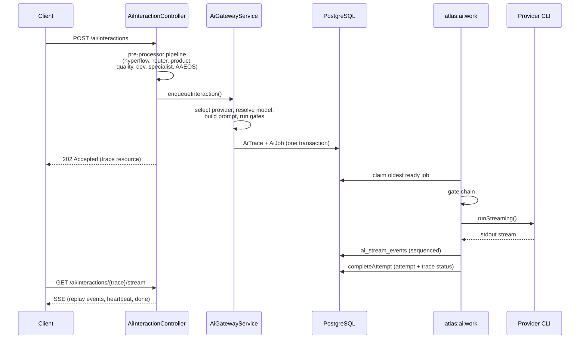

# AI Gateway API

The AI Gateway API is the HTTP surface through which the app and CLI create AI interactions, poll job status, manage threads, check provider health, and access the Open Brain (memory recall, context packs, MCP). All endpoints are protected by the `X-Atlas-Token` middleware. The gateway never calls models directly: an interaction creates a trace and a job, a local worker runs the provider CLI, and the result is streamed back. See [AI Gateway](../systems/ai-gateway/index.md) for the interaction lifecycle and the worker.

## Authentication

All `ai/*` routes sit behind the `atlas.token` middleware and require the `X-Atlas-Token` header set to the `ATLAS_TOKEN` environment variable. There is no public `ai/*` endpoint.

```bash
curl -H "X-Atlas-Token: $ATLAS_TOKEN" http://localhost:3737/api/ai/interactions
```

## The 202 Accepted pattern

Interaction creation is asynchronous. `POST /ai/interactions` runs the controller pre-processor pipeline, calls `AiGatewayService::enqueueInteraction`, persists one `AiTrace` and one or more `AiJob` rows in a single transaction, and returns `202 Accepted` with the trace resource. The client then polls `GET /ai/interactions/{trace}` or opens the SSE stream to read the result. The 202 means "accepted and queued," not "done."

## The SSE streaming pattern

`GET /ai/interactions/{trace}/stream` returns a `text/event-stream` response. The server replays persisted `ai_stream_events` by sequence number (so a reconnect can resume from the last seen id), sends a `heartbeat` event every 10 seconds, and ends with a `done` event when the trace reaches a terminal status (`succeeded`, `failed`, `cancelled`). A `timeout` event is sent if the stream exceeds its time budget. Each event carries an `id` (the sequence number), an `event` type (lifecycle, token, permission, policy, error, heartbeat, done, timeout), and a JSON `data` payload.

## The pause-for-choice pattern

A job can pause with status `awaiting_user_choice` when the worker hits a condition that needs an operator decision (for example, a provider login is required, or a model downgrade is possible). The `AiProviderChoiceResolver` builds operator options (switch_provider, downgrade_model, wait, retry_same, fail, cancel). The operator resolves the choice with `POST /ai/jobs/{job}/resume-choice`, which returns 422 with `AI_JOB_NOT_AWAITING_CHOICE` or `AI_JOB_CHOICE_NOT_FOUND` if the job is not paused or the option id is invalid.

## Interactions

| Method | Path | Purpose | Response |
|--------|------|---------|----------|
| GET | `/ai/interactions` | List traces (filter by `thread_id`, `status`, `agent`, `client_id`; `limit` max 200) | 200 |
| POST | `/ai/interactions` | Create an interaction. Ingests attachments (images, documents, chunked uploads), runs the pre-processor pipeline, enqueues the trace and job. | 202 |
| GET | `/ai/interactions/{trace}` | Show a single trace with its jobs and attempts. | 200 |
| GET | `/ai/interactions/{trace}/stream` | SSE stream of the interaction result. Replays `ai_stream_events` by sequence, heartbeats every 10s, ends on terminal status. | 200 (text/event-stream) |
| POST | `/ai/interactions/{trace}/feedback` | Submit feedback on an interaction (outcome attribution, score, recompute metrics). | 200 |
| GET | `/ai/interactions/{trace}/flow-status` | Read-model flow status for the trace (router and specialist-flow state). | 200 |
| GET | `/ai/interactions/{trace}/attachments/{attachment}/content` | Download an attachment's file content. | 200 (file) |
| GET | `/ai/interactions/{trace}/attachments/{attachment}/pages/{page}` | Download a single page of a paginated attachment (PDF). | 200 (file) |
| POST | `/ai/interactions/sync` | Chat sync envelope (the `AtlasChatSyncController`). | 200 |

## Threads

| Method | Path | Purpose | Response |
|--------|------|---------|----------|
| GET | `/ai/threads` | List threads (filter by `status`, `surface`, `workspace`; `limit` max 100; `light=1` omits heavy relations; `include_messages=1` includes recent messages). | 200 |
| POST | `/ai/threads` | Create a thread. | 200 |
| GET | `/ai/threads/{thread}` | Show a single thread with active session, state, latest compaction, latest handoff, last trace. | 200 |
| GET | `/ai/threads/{thread}/state` | Thread session state (objective, phase, decisions, open loops, next steps). | 200 |
| GET | `/ai/threads/{thread}/messages` | Thread messages ordered by position. | 200 |
| GET | `/ai/threads/{thread}/snapshots` | Thread context snapshots. | 200 |
| POST | `/ai/threads/{thread}/compact` | Run session compaction (long conversations). | 200 |
| POST | `/ai/threads/{thread}/switch-provider` | Switch the thread's provider (generates a handoff brief). | 200 |
| PATCH | `/ai/threads/{thread}` | Update a thread. | 200 |
| DELETE | `/ai/threads/{thread}` | Delete a thread (cascading deletion via `AiThreadDeletionService`). | 200 |

## Jobs

| Method | Path | Purpose | Response |
|--------|------|---------|----------|
| GET | `/ai/jobs` | List jobs (filter by `status`, `provider`; `limit` max 200). | 200 |
| GET | `/ai/jobs/{job}` | Show a single job with its trace, thread, session, and attempt history. | 200 |
| POST | `/ai/jobs/{job}/retry` | Retry a failed or cancelled job. Returns 422 with `AI_JOB_NOT_RETRYABLE` if the job is not in a retryable state. Resets the job and trace to `queued`. | 200 or 422 |
| POST | `/ai/jobs/{job}/cancel` | Cancel a queued or processing job. For council jobs, cancels all sibling jobs and syncs the council. | 200 |
| POST | `/ai/jobs/{job}/resume-choice` | Resolve an `awaiting_user_choice` pause. Requires `option_id`. Returns 422 with `AI_JOB_NOT_AWAITING_CHOICE` or `AI_JOB_CHOICE_NOT_FOUND` on error. | 200 or 422 |

## Providers

| Method | Path | Purpose | Response |
|--------|------|---------|----------|
| GET | `/ai/providers/status` | Provider dashboard: runtime settings, provider choice catalog, default provider/model, model policy, budget, queue depth, worker rows, provider health rows, 24h usage, active jobs (including `awaiting_user_choice` count), recent worker events. | 200 |
| PATCH | `/ai/providers/settings` | Update provider settings (DB-backed override of config: default provider, selection mode, council allow-auto). | 200 |
| POST | `/ai/providers/check` | Run a live provider health check across all providers (`AiProviderHealthService::checkAll`). | 200 |

## Memory and Open Brain

These routes expose the Open Brain and the canonical memory system. They sit under the same `atlas.token` middleware. See [Open Brain](../systems/open-brain/index.md) for the full memory and context-pack architecture.

| Method | Path | Purpose | Response |
|--------|------|---------|----------|
| POST | `/ai/memory/recall` | Semantic memory recall (the `AtlasMemoryRecallController` invokable controller). | 200 |
| GET | `/ai/memory` | List memory entries. | 200 |
| POST | `/ai/memory` | Store a memory entry. | 200 |
| GET | `/ai/memory/{memoryEntry}` | Show a single memory entry. | 200 |
| PATCH | `/ai/memory/{memoryEntry}` | Update a memory entry. | 200 |
| GET | `/ai/memory/{memoryEntry}/governance` | Governance state for a memory entry. | 200 |
| POST | `/ai/memory/{memoryEntry}/privacy` | Review privacy for a memory entry. | 200 |
| GET | `/ai/memory/audit/traces/{trace}` | Audit the memory traces for an AI trace. | 200 |
| POST | `/ai/memory/maintain` | Run memory maintenance (the `AtlasMemoryMaintenanceController` invokable controller). | 200 |
| GET | `/ai/memory/deltas` | List memory deltas. | 200 |
| GET | `/ai/memory/deltas/{delta}` | Show a single memory delta. | 200 |
| POST | `/ai/memory/deltas/{delta}/review` | Review a memory delta. | 200 |
| POST | `/ai/memory/deltas/{delta}/promote` | Promote a memory delta. | 200 |
| POST | `/ai/memory/governance/scan` | Run a governance scan over memory. | 200 |
| POST | `/ai/memory/privacy/scan` | Run a privacy scan over memory. | 200 |
| GET | `/ai/memory/review-queue` | Memory review queue. | 200 |
| GET | `/ai/memory/relations` | List memory relations. | 200 |
| POST | `/ai/memory/relations/{relation}/review` | Review a memory relation. | 200 |
| GET | `/ai/memory/quality` | Memory quality summary. | 200 |
| GET | `/ai/memory/quality/history` | Memory quality history. | 200 |
| POST | `/ai/memory/quality/snapshots` | Take a memory quality snapshot. | 200 |
| GET | `/ai/memory/verbatim` | List verbatim memories. | 200 |
| POST | `/ai/memory/verbatim` | Store a verbatim memory. | 200 |
| GET | `/ai/memory/verbatim/{verbatimMemory}` | Show a verbatim memory. | 200 |
| PATCH | `/ai/memory/verbatim/{verbatimMemory}` | Update a verbatim memory. | 200 |
| POST | `/ai/memory/verbatim/{verbatimMemory}/review` | Review a verbatim memory. | 200 |
| POST | `/ai/memory/usages/{usage}/feedback` | Feedback on a memory usage. | 200 |
| GET | `/ai/memory/provider-projection/status` | Provider projection status (CLAUDE.md / AGENTS.md generation). | 200 |
| GET | `/ai/memory/provider-projection/review` | Provider projection review queue. | 200 |
| GET | `/ai/memory/provider-projection/audits` | Provider projection audits. | 200 |
| GET | `/ai/memory/provider-projection/audits/summary` | Provider projection audit summary. | 200 |
| POST | `/ai/memory/provider-projection/audits/purge` | Purge provider projection audits. | 200 |
| POST | `/ai/memory/provider-projection/apply` | Apply a provider projection. | 200 |

## Open Brain

| Method | Path | Purpose | Response |
|--------|------|---------|----------|
| POST | `/ai/open-brain/context-pack` | Request an Open Brain context pack for a task (code-graph + reality graph + semantic memory, provider-safe, read-only). | 200 |
| GET | `/ai/open-brain/audits` | List Open Brain audits. | 200 |
| GET, POST | `/ai/open-brain/mcp` | The MCP HTTP surface (GET describes the server, POST handles MCP requests). | 200 |

## How an interaction flows over HTTP



## Integration points

- **Routes.** All `ai/*` routes are defined in `routes/api.php` inside the `atlas.token` middleware group.
- **Controllers.** `app/Http/Controllers/AiInteractionController.php` (interactions, stream, feedback, attachments), `app/Http/Controllers/AiThreadController.php` (threads), `app/Http/Controllers/AiJobController.php` (jobs), `app/Http/Controllers/AiProviderController.php` (providers), `app/Http/Controllers/AtlasMemoryController.php` (memory), `app/Http/Controllers/AtlasOpenBrainController.php` (open-brain context pack and audits), `app/Http/Controllers/AtlasOpenBrainMcpController.php` (MCP HTTP surface).
- **The worker.** The worker that actually runs the provider CLIs is `atlas:ai:work`, not an HTTP endpoint. See [The local worker](../systems/ai-gateway/the-local-worker.md).
- **Resources.** `app/Http/Resources/AiTraceResource.php`, `AiJobResource.php`, `AiThreadResource.php`, `AiProviderHealthResource.php`, `AiWorkerEventResource.php`, and the session, message, compaction, handoff, snapshot, and state resources.
- **Open Brain.** The memory and open-brain routes expose the Open Brain. See [Open Brain](../systems/open-brain/index.md).
- **Voice.** The `/ai/voice/*` routes are a separate realtime voice surface (`AtlasAiVoiceRealtimeController`), not part of the interaction spine.

## Key source files

| Path | Role |
|------|------|
| `routes/api.php` | All `ai/*` route definitions inside the `atlas.token` middleware group |
| `app/Http/Controllers/AiInteractionController.php` | Interactions: index, store (202), show, stream (SSE), feedback, flow-status, attachments |
| `app/Http/Controllers/AiThreadController.php` | Threads: CRUD, state, messages, snapshots, compact, switch-provider |
| `app/Http/Controllers/AiJobController.php` | Jobs: index, show, retry, cancel, resume-choice |
| `app/Http/Controllers/AiProviderController.php` | Providers: status, check, updateSettings |
| `app/Http/Controllers/AtlasMemoryController.php` | Memory entries, deltas, governance, privacy, quality, verbatim, provider projections |
| `app/Http/Controllers/AtlasOpenBrainController.php` | Open Brain context pack and audits |
| `app/Http/Controllers/AtlasOpenBrainMcpController.php` | MCP HTTP surface |
| `app/Services/Ai/AiGatewayService.php` | The enqueue engine behind `POST /ai/interactions` |
| `app/Services/Ai/AiProviderChoiceResolver.php` | The `awaiting_user_choice` pause and resolve logic |
| `app/Http/Resources/AiTraceResource.php` | The trace resource returned by store and show |

## Related pages

- [API](index.md) — the two API surfaces
- [REST endpoints](rest-endpoints.md) — the capture and ingestion REST endpoints
- [AI Gateway](../systems/ai-gateway/index.md) — the gateway overview
- [Interaction lifecycle](../systems/ai-gateway/interaction-lifecycle.md) — the HTTP entry through the pre-processor pipeline
- [The local worker](../systems/ai-gateway/the-local-worker.md) — the `atlas:ai:work` worker that runs the provider CLIs
- [Sessions, threads and streaming](../systems/ai-gateway/sessions-threads-streaming.md) — thread, session, handoff, and SSE detail
- [Provider selection and routing](../systems/ai-gateway/provider-selection-and-routing.md) — AtlasDecide, fair mode, council
- [Quality, budget and health](../systems/ai-gateway/quality-budget-health.md) — the provider status dashboard
- [Open Brain](../systems/open-brain/index.md) — the memory and context-pack endpoints
- [Security](../security.md) — auth and the `X-Atlas-Token` middleware
