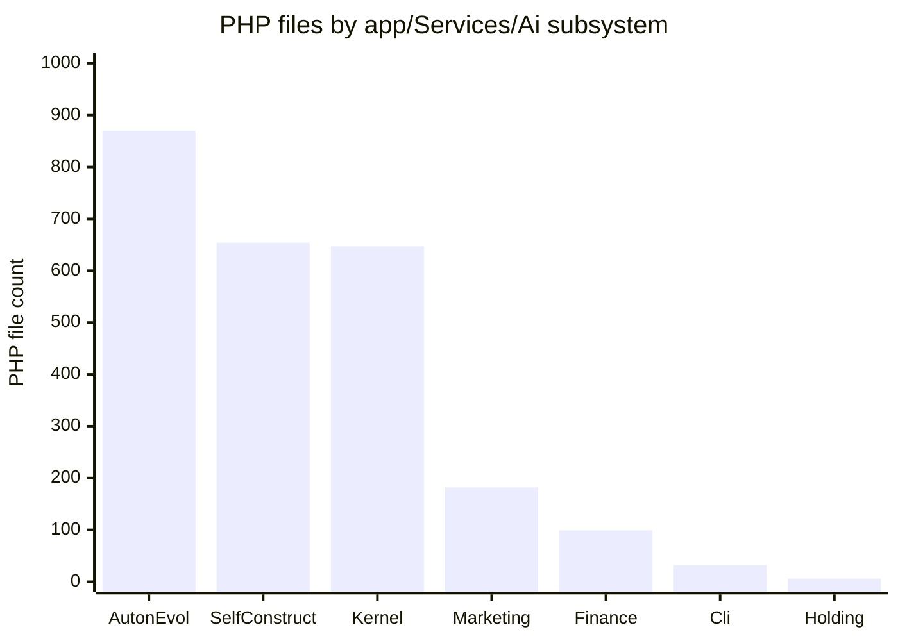

# By the numbers

Data collected on 2026-06-29.

A quantitative snapshot of the Atlas Server codebase at `/Users/vitorepf/develop/Atlas/atlas-server` on the `main` branch (HEAD `2d630458a`). All counts come from the commands listed in the [survey notes](#how-these-numbers-were-collected) at the bottom of this page.

## Size

| Metric | Count |
|---|---|
| PHP files in `app/` | 7,116 |
| Lines of PHP in `app/` | 1,727,234 |
| Test files in `tests/` | 5,039 |
| Lines of test code | 1,005,462 |
| Artisan commands (`app/Console/Commands`) | 1,227 |
| Eloquent models (`app/Models`) | 404 |
| Database migrations | 330 |
| Markdown docs under `docs/` | 1,866 |
| Config files | 22 |

Roughly 1.73M lines of application code and just over 1M lines of tests, written in about two months. The test-to-app LOC ratio is near 0.58:1. The `app/Services/Ai/` tree alone holds 4,924 of the 7,116 app PHP files (69%), which is where almost all of the growth concentrates.

### File count by `app/Services/Ai/` subsystem

The chart below counts PHP files in the largest `app/Services/Ai/` subdirectories. Autonomous Evolution, Self-Construction, and the Kernel dominate; together they account for 2,171 files.

For context, the non-`Ai` half of `app/Services/` holds 214 files, and the rest of `app/` breaks down as: `app/Console/Commands` 1,227, `app/Models` 404, `app/Http` 316, `app/Jobs` 12, `app/Providers` 3.

## Activity

3,471 commits total, from the first commit on 2026-04-27 to the last on 2026-06-28.

| Month | Commits |
|---|---|
| 2026-04 | 11 |
| 2026-05 | 799 |
| 2026-06 | 2,661 |

The commit cadence accelerated by a factor of roughly 73 from April to June. The single most touched file in the last 90 days is `config/atlas.php` (264 touches), followed by `docs/loop-evolution-journal/brain-24h.md` (229) and `app/Services/Ai/SoftwareCompanyStewardship/AreaFocusLoop/AutonomousEvolutionSessionService.php` (148). The full churn hotspot list is in the [complexity](#complexity) section below.

The shape of this growth, and why so much of it is machine-authored, is covered in [Lore](lore.md).

## Bot-attributed commits

| Author identity | Commits |
|---|---|
| `Vitor Freire` (operator) | 3,245 |
| `atlas-loop` | 223 |
| `atlas` | 2 |
| `Atlas` | 1 |

226 of 3,471 commits (about 6.5%) name a bot or loop identity as the author. **This is a lower bound.** Many AI-authored changes are committed under the operator's identity because the autonomous loop drives external provider CLIs (Claude, Codex) that produce diffs which the operator's tooling then commits. The `atlas loop auto-merge:` commit prefix, visible throughout June, marks loop-produced work merged into `main` by the loop's own merge service, and those merges frequently land under the operator name. The real machine-authored fraction is meaningfully higher than 6.5%; the exact number is not recoverable from git metadata alone.

Per-individual contributor statistics are intentionally omitted. See [Lore](lore.md) for the narrative and [Fun facts](fun-facts.md) for the self-building angle.

## Complexity

### Largest PHP files

| Lines | File |
|---|---|
| 52,717 | `app/Services/Ai/SelfConstruction/AtlasSelfConstructionReadinessService.php` |
| 22,989 | `app/Services/Ai/Holding/ExternalActionMandateRegistryService.php` |
| 19,333 | `app/Services/Ai/Kernel/Architecture/KernelArchitectureStaticScanner.php` |
| 18,787 | `app/Services/Ai/SelfConstruction/ReadinessProjectionCodexReviewMergeSection.php` |
| 14,169 | `app/Services/Ai/SelfConstruction/ReadinessProjectionAgentReviewMergeSection.php` |
| 13,729 | `app/Services/Ai/SelfConstruction/ReadinessProjectionAgentCodexSection.php` |
| 10,408 | `app/Services/Ai/Holding/AutonomousHoldingEnterpriseBuildoutService.php` |
| 8,758 | `app/Services/Ai/Holding/EnterpriseFlowFixtureActionRuntimeService.php` |
| 6,820 | `app/Services/Ai/SoftwareCompanyStewardship/AreaFocusLoop/AutonomousEvolutionSessionService.php` |
| 5,900 | `app/Services/Engineering/EngineeringBenchmarkService.php` |
| 5,689 | `app/Services/Engineering/AtlasCodeRealityUsageIntelligenceService.php` |
| 5,515 | `app/Services/Ai/Publishing/BlogEditorialContextService.php` |
| 4,997 | `app/Services/Ai/AtlasOpenBrainMcpService.php` |
| 4,875 | `app/Services/Ai/WorkspaceIntelligence/AtlasWorkspaceIntelligenceRuntimeService.php` |
| 4,822 | `app/Console/Commands/AiChatCommand.php` |

The top file, `AtlasSelfConstructionReadinessService.php`, is a single 52,717-line PHP file, larger than many entire applications. Five of the top six files live under `app/Services/Ai/SelfConstruction/`. See [Fun facts](fun-facts.md) for more on the giant file.

### File counts by directory

| Directory | PHP files |
|---|---|
| `app/Services/Ai/` | 4,924 |
| `app/Console/Commands/` | 1,227 |
| `app/Services/` (non-Ai) | 214 |
| `app/Models/` | 404 |
| `app/Http/` | 316 |
| `app/Jobs/` | 12 |
| `app/Providers/` | 3 |

Inside `app/Services/Ai/`:

| Subdirectory | PHP files |
|---|---|
| `AutonomousEvolution/` | 870 |
| `SelfConstruction/` | 654 |
| `Kernel/` | 647 |
| `MarketingDomain/` | 182 |
| `Finance/` | 99 |
| `Cli/` | 32 |
| `Holding/` | 6 |

### TODO / FIXME / HACK

33 PHP files under `app/` contain a `TODO`, `FIXME`, or `HACK` marker. That is a low count relative to 7,116 files, though it likely reflects a codebase where work is tracked in the Open Brain and loop journals rather than in inline markers.

### Churn hotspots (last 90 days)

Files most touched by commits in the 90 days before 2026-06-29:

| Touches | File |
|---|---|
| 264 | `config/atlas.php` |
| 229 | `docs/loop-evolution-journal/brain-24h.md` |
| 148 | `app/Services/Ai/SoftwareCompanyStewardship/AreaFocusLoop/AutonomousEvolutionSessionService.php` |
| 110 | `app/Services/Ai/AutonomousEvolution/AtlasLoopHarnessGuard.php` |
| 108 | `app/Providers/AppServiceProvider.php` |
| 91 | `tests/Unit/Ai/SoftwareCompanyStewardship/AreaFocusLoop/AutonomousEvolutionSessionServiceTest.php` |
| 84 | `docs/conversion-os-state.md` |
| 82 | `routes/api.php` |
| 80 | `app/Services/Ai/SoftwareCompanyStewardship/AreaFocusLoop/Reliable24hLoopRunnerService.php` |
| 69 | `bootstrap/app.php` |
| 64 | `tests/Unit/Ai/SoftwareCompanyStewardship/AreaFocusLoop/Reliable24hLoopRunnerServiceTest.php` |
| 60 | `app/Services/Ai/SelfConstruction/AtlasSelfConstructionReadinessService.php` |
| 57 | `app/Services/Ai/AutonomousEvolution/Discovery/AtlasLoopQueueRefiller.php` |
| 52 | `app/Services/Ai/SoftwareCompanyStewardship/AreaFocusLoop/OwnerFlow/Ap786OwnerFlowExecutor.php` |
| 47 | `app/Services/Ai/AtlasOpenBrainMcpService.php` |
| 46 | `tests/Feature/Ai/AtlasOpenBrainMcpServiceTest.php` |
| 42 | `tests/Unit/Ai/SoftwareCompanyStewardship/AreaFocusLoop/OwnerFlow/Ap786OwnerFlowExecutorTest.php` |
| 42 | `docs/engineering-knowledge-base/atlas-ai-canonical-architecture-index.md` |
| 42 | `docs/engineering-knowledge-base/README.md` |
| 41 | `docs/engineering-knowledge-base/self-construction/agent-control-plane-contract.md` |

The hotspot list is dominated by the loop's own runtime (`AutonomousEvolutionSessionService`, `AtlasLoopHarnessGuard`, `Reliable24hLoopRunnerService`, `AtlasLoopQueueRefiller`), the central switchboard `config/atlas.php`, and the loop's living journal `docs/loop-evolution-journal/brain-24h.md`. This is consistent with a codebase being modified by the loop as it runs.

## How these numbers were collected

All counts were produced from the repo root with:

- `find app -name "*.php" | wc -l` and `find app -name "*.php" -exec cat {} + | wc -l`
- `find tests -name "*.php" | wc -l` and `find tests -name "*.php" -exec cat {} + 2>/dev/null | wc -l`
- `find app/Console/Commands -name "*.php" | wc -l`, `find database/migrations -name "*.php" | wc -l`, `find app/Models -name "*.php" | wc -l`, `find docs -name "*.md" | wc -l`
- `git rev-list --count HEAD`
- `git log --format="%ad" --date=format:"%Y-%m" | sort | uniq -c`
- `git log --format="%an" | sort | uniq -c` for authorship (bot attribution uses author-name matching against `atlas-loop` / `atlas` / `Atlas`)
- `find app -name "*.php" -exec wc -l {} + | sort -rn | head -16`
- `grep -rIl "TODO\|FIXME\|HACK" app --include="*.php" | wc -l`
- `git log --since="90 days ago" --name-only --format="" | sort | uniq -c | sort -rn | head -20`

Counts reflect the working tree at HEAD on 2026-06-29 and will drift as the loop keeps running.

See also: [Lore](lore.md), [Fun facts](fun-facts.md), [Architecture](overview/architecture.md), [Glossary](overview/glossary.md).
