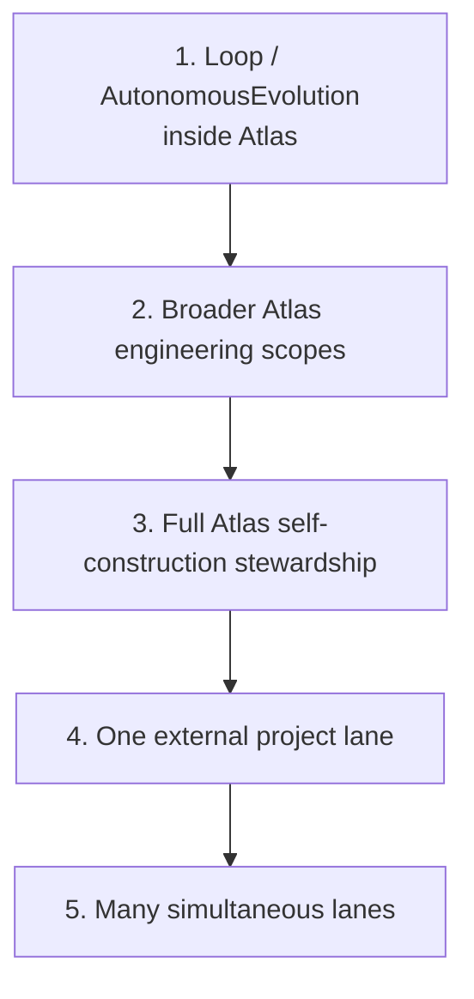

# Earned autonomy

No scope gets 24/7 authority by ambition. A scope earns autonomy through receipts, server-side gates, rollback capability, low waste, and real value. This is the earned autonomy doctrine, and it is the structural defense against a self-improving system granting itself power it never proved it could handle.

Autonomy is not a right. It is a track record. The system proves it can run a scope safely before it is allowed to run that scope unsupervised.

## The Scope Ladder

Autonomy is earned in stages. A scope does not jump from "off" to "full 24/7." It climbs the Scope Ladder:

Each rung requires evidence from the rung below. The Loop started as the first bounded scope on the ladder. It proved it could evolve a scope through the 8-phase cycle with frozen judging, anti-Goodhart gates, and fail-closed merge. Only after that proof could it expand to broader Atlas engineering scopes.

The autonomy admission service (`app/Services/Ai/Kernel/AtlasAutonomyAdmissionService.php`) is the gate that admits a scope to an autonomy level. It checks receipts, server-side gate history, rollback capability, waste metrics, and real value before granting the next rung.

## Fail-closed master switches

Three master switches control the autonomous systems, and all default to OFF:

| Switch | Controls | Default |
|--------|----------|---------|
| `ATLAS_LOOP_MASTER_ENABLED` | The autonomous evolution loop | OFF |
| `ATLAS_BRAIN_MASTER_ENABLED` | The brain perception/origination cycle | OFF |
| `ATLAS_FLEET_ENABLED` | The fleet control plane (agent reconciler) | OFF |

These switches are fail-closed. They are read from `.env` directly, not from the config cache, so they remain robust under `config:cache`. They are operator-only: only the operator can turn them on by editing `.env`. The loop can never re-enable itself.

The master switch service (`app/Services/Ai/AutonomousEvolution/AtlasLoopMasterSwitch.php`) is a FORBIDDEN self-target. The loop cannot edit the switch that controls it. This is the pétreo (stone) principle: the immutable organs that govern the loop are carved in stone.

## The fleet control plane

The fleet control plane (`app/Services/Ai/AgentGovernance/`) is Kubernetes-style declarative control. The operator sets a desired state (default OFF). The reconciler (`AtlasAgentReconciler`, called "the babá" or nanny) converges real processes toward that desired state.

The reconciler is asymmetric by design:

- **STOP always runs.** If a process is not desired but alive, the reconciler stops it.
- **START is hard-gated.** If a process is desired but dead, the reconciler starts it only behind a per-agent hard gate (default OFF).

This asymmetry means a tapped app or a stale database row can never respawn an agent. Authority comes from what the operator launched (`desiredStore->authorizesCampaign`), never from a `status=running` database row.

## FREIO: the safety brake

FREIO (Portuguese for "brake") is the desired-state safety brake. Each agent's desired state can carry:

- `ttl_expires_at` — an auto-OFF timestamp. When it passes, the agent turns off automatically.
- `budget_limit_usd` — a USD spending cap. When it trips, the agent turns off and stops.

These are guardrails for unattended operation. If the operator enables an agent and walks away, the FREIO ensures it cannot run forever or spend without limit.

## The operator is kept out of the normal flow

The Operator Interface is visibility and emergency-stop only. There is deliberately no turn-ON HTTP endpoint. The agent governance API (`/api/agents/*`) exposes read endpoints (active, status, history) and write endpoints that only turn agents OFF (per-agent off, off-all panic). A tapped app can only reduce spend, never increase it.

The 100%-autonomy completion gate states that Self-Construction is "complete" only when Atlas originates, decomposes, schedules, executes, verifies, merges, learns, and resyncs docs with the operator removed from ordinary queue maintenance. Until then, the operator remains in the loop for scope admission and emergency control.

## Related pages

- [Constitution and earned autonomy](../systems/self-construction-government/constitution-and-earned-autonomy.md) — the full constitution, trust ladder, and autonomy admission
- [Watchdogs and master switch](../systems/cli-operator/watchdogs-and-master-switch.md) — the shell watchdogs and fail-closed switches
- [Evidence and receipts](evidence-and-receipts.md) — receipts are the evidence that earns autonomy
- [Anti-Goodhart and no-proxy](anti-goodhart.md) — real value, not proxy metrics, is what earns the next rung
- [Glossary](../overview/glossary.md) — earned autonomy, Scope Ladder, babá, FREIO, pétreo, master switch
