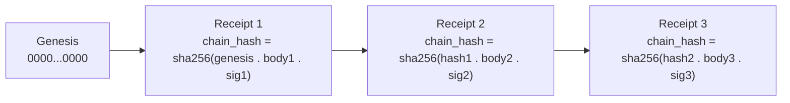

# Evidence and receipts

Atlas proves what actually ran. It does not ask the agent whether the work succeeded, because the agent would say yes. It does not trust a status field in a database, because a crashed process leaves stale rows. Instead, it records append-only, tamper-evident, signed receipt chains that cryptographically link each event to the previous one. A receipt proves an event happened. It never overrides a canonical spec.

## The receipt chain

Receipts form a hash chain. Each receipt contains a body, a signature, and a chain hash:

```
chain_hash = sha256(prev_hash . body_sha . signature)
```

The genesis hash is 64 zeros. Each new receipt incorporates the previous receipt's hash, so tampering with any receipt breaks the chain for all subsequent receipts. Verification is fail-closed: if the chain does not verify, the entire chain is suspect.



The signing service (`app/Services/Ai/AutonomousEvolution/Receipts/AtlasLoopCycleReceiptSigner.php`) signs each receipt. The cycle receipt ledger (`Receipts/AtlasLoopCycleReceiptLedger.php`) appends signed receipts as JSONL files under `storage/app/atlas/loop/`.

## merged_sha: proof of close-on-main

The strongest evidence in the system is `merged_sha`. This is the commit hash proving that close-on-main actually merged the change to the main branch. Its presence means the cycle completed. Its absence means the cycle aborted.

The 8-phase cycle is only "completed" with a real, non-null `merged_sha`. There is no "completed-but-no-merge" proxy success. If the merge did not happen, the cycle is aborted, regardless of how well the earlier phases went. This closes the loophole where an agent declares success without delivering the merge.

## What receipts prove

The Loop records receipts at multiple levels:

| Ledger | What it proves |
|--------|---------------|
| `AtlasLoopCycleReceiptLedger` | The full cycle outcome (phase, status, merged_sha) |
| `AtlasLoopUnifiedReceiptChain` | Per-phase receipts the conductor records |
| `AtlasLoopGoodhartReceiptLedger` | Anti-Goodhart gate decisions and refusals |
| `AtlasLoopAutoMergeReceiptLedger` | Merge decisions (merge, abort, rollback) |
| `AtlasLoopLeapReceiptLedger` | Ambition leap proposals and outcomes |
| `AtlasLoopImpactReceiptService` | Measured impact of a change |
| `AtlasLoopDeliveryContractRecorder` | Delivery contracts and their fulfillment |

## The Evidence Ledger as runtime truth

The Evidence Ledger is the runtime truth of the system. It records what actually happened at runtime: which jobs ran, which gates passed, which merges succeeded, which rollbacks fired. It has high authority for events. If the Evidence Ledger says a merge happened on Tuesday at 3pm, that is the truth of what happened.

But the Evidence Ledger does not override canonical specs. If the ledger says "the loop ran 50 cycles" and a canonical doc says "the loop should run at most 10 cycles per day," the ledger proves the event, and the doc defines the constraint. The ledger does not make the constraint disappear.

## Receipts are not learning

A receipt records that something happened. It does not, by itself, become a lesson. The Learning Transfer organ in the Self-Construction Government promotes proven lessons into future context only after evidence. A receipt is the evidence; the promotion is a separate governed step. No narrative memory without proof.

## How to inspect receipts

The Loop exposes receipt inspection through artisan commands:

```bash
atlas:loop:audit              # audit the receipt chain
atlas:loop:delivery-dossier   # delivery contracts and receipts
atlas:loop:overview           # cycle overview with receipt status
```

The receipt ledger files live under `storage/app/atlas/loop/` as JSONL. Each line is a signed receipt with its chain hash.

## Related pages

- [Receipts and evidence](../systems/evolution-loop/receipts-and-evidence.md) — the full receipt ledger subsystem
- [Anti-Goodhart and no-proxy](anti-goodhart.md) — the Goodhart receipt ledger records refusals
- [Knowledge governance](knowledge-governance.md) — the Evidence Ledger's place in the authority hierarchy
- [Quality gates and certification](../systems/evolution-loop/quality-gates-and-certification.md) — how the frozen judge produces verdicts that receipts record
- [Glossary](../overview/glossary.md) — receipt, merged_sha, Evidence Ledger, chain_hash
