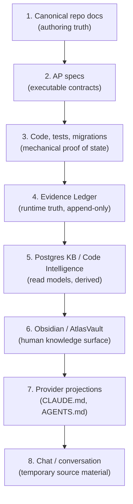

# Knowledge governance

When repo docs, code, the Evidence Ledger, Postgres KB, Obsidian, provider projections, and chat disagree, which one wins? Knowledge governance answers this with an explicit authority hierarchy. Without it, a session-new AI would trust stale Postgres rows, outdated provider projections, or its own training memory over the canonical decision that already exists in the repo.

The canonical source is `docs/engineering-knowledge-base/atlas-ai-knowledge-governance-system.md`. This page summarizes the hierarchy and cross-links to the systems that enforce it.

## The authority hierarchy

In a conflict, use this order:



| Layer | Role | Authority |
|-------|------|-----------|
| Canonical repo docs | Authoring source of engineering truth | High |
| AP specs | Executable contracts per phase/capability | High |
| Code, tests, migrations | Mechanical proof of implementation state | High for real state |
| Evidence Ledger | Append-only runtime truth | High for events |
| Postgres KB / Code Intelligence | Live index for recall and context packs | Read model |
| Obsidian / AtlasVault | Human knowledge surface, personal workspace | Input/promotion |
| AGENTS.md / CLAUDE.md | Compact provider-safe bootstrap | Projection |
| Chat / conversation | Temporary source material | Low |

## Read models are derived, not authoring

Postgres KB and Code Intelligence are read models. They are rebuilt from the authoring source (repo docs and code). They accelerate recall and context pack assembly, but they are not the place to edit architecture. After a relevant change, the sync commands rebuild them:

```bash
atlas engineering knowledge sync --prune
atlas engineering knowledge index-code --prune
atlas engineering knowledge docs-health
```

An AI should distrust a read model that lacks `indexed_at`, `content_hash`, or a status compatible with the current file. A read model is a cache, and caches go stale.

## Repo docs are authoring truth

Canonical docs under `docs/engineering-knowledge-base/` are the authoring source. They carry frontmatter (id, type, status, priority, owner, related_paths) that makes them machine-readable. A doc with `status: active` and `requires_evidence: true` is a contract, not a suggestion. The Documentation Reality system (ADRS) reconciles these docs against code and proves drift and duplication.

## Provider projections are low authority

`AGENTS.md` and `CLAUDE.md` are generated projections. They are compact, provider-safe bootstraps that help external AI tools orient quickly. They point to the canonical governance doc and summarize provider-safe rules. They can never introduce a decision that does not exist in the canonical docs.

If a provider projection diverges from a canonical doc, the canonical doc wins. The fix is to update the canonical doc first, then regenerate the projection:

```bash
php artisan atlas:memory:projection write --target=all --workspace=<workspace> --force --json
```

## The bootstrap protocol

Before structural work, any AI must orient through the governance commands:

1. `php artisan atlas:ai:session-bootstrap --task="<task>" --json` — returns the docs split plan filtered for the task
2. `php artisan atlas:ai:place-feature "<feature>" --json` — places a new feature in the correct layer (Core, Domain, Surface, Runtime, Evidence, Learning, AP, Archive)

If `docs-authority-audit` returns `blocked`, the AI must resolve the conflict or declare a supersede/reuse before creating any new documentation or runtime.

## Obsidian is a human surface, not a runtime source

AtlasVault (Obsidian) is where the operator thinks, curates, and writes. A note in the vault governs runtime only after promotion to one of: a canonical doc in the repo, an executable AP, a governed memory item, or an evidence/read model. Obsidian can be an inbox and a mirror. It is not the operational source of truth.

## Related pages

- [Open Brain](../systems/open-brain/index.md) — the context pack and canonical memory that serve governed knowledge
- [Documentation reality](../systems/engineering/documentation-reality.md) — the ADRS system that reconciles docs against code
- [Provider safety](provider-safety.md) — provider projections are redacted by construction
- [Evidence and receipts](evidence-and-receipts.md) — the Evidence Ledger's authority for runtime events
- [Glossary](../overview/glossary.md) — read model, provider projection, authority hierarchy
