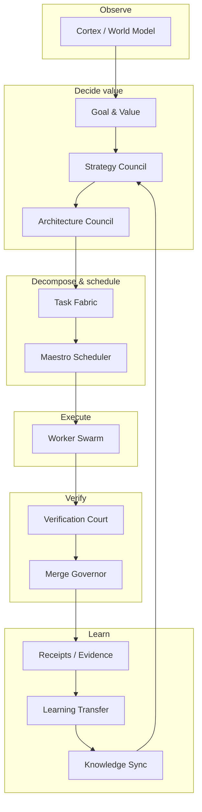

# Separation of powers

No single agent originates, implements, judges, merges, and promotes its own work. This is the separation of powers doctrine, and it is the structural defense against self-dealing in a system that evolves itself. If the same agent that writes a change also judges it, the agent will approve its own work. If it also merges and promotes, nothing constrains it. Separation of powers prevents this by assigning each role to a distinct organ that cannot be spanned by one agent.

## The author-judge principle

The simplest form of the doctrine is the author-judge principle: the agent or model that writes a change never judges it. In the Loop, the writer model produces a projection, and a separate critic model refutes it. The frozen judge that certifies the change is out-of-process and FORBIDDEN (the loop can never edit it). Cross-model triangulation excludes the writer from its own judging panel by construction.

The architect phase (`app/Services/Ai/AutonomousEvolution/AtlasLoopProjectionEngine.php`) runs a writer-critic convergence loop. The writer proposes; the critic bites on real caller edges and raises obligations. If the pair oscillates without converging, the target is parked, not forced through.

## The 16-organ government

The Self-Construction Government expands the author-judge principle into a full organ map. Each organ has a narrow responsibility and explicit non-responsibilities:

The authority and non-authority of each organ is explicit:

| Organ | Does | Does not |
|-------|------|----------|
| Cortex / World Model | Reads code, docs, memory, evidence, graph | Decide, promote learning |
| Goal & Value | Defines real value, rejects proxy | Create executable packets |
| Strategy Council | Ranks leverage, picks direction | Create packets, merge |
| Architecture Council | Produces criticized contracts, invariants, boundaries | Schedule, merge |
| Task Fabric | Compiles architecture into self-sufficient packets | Set final priority, verify merit |
| Maestro | Serves, leases, retries with scheduling policies | Rewrite architecture, relax gates |
| Worker Swarm | Edits only allowed_files on shared mainline | Approve, merge, widen scope, self-certify |
| Verification Court | Re-runs gates server-side, detects false-green | Author the candidate |
| Merge Governor | Controls integration, rollback, canary, blast-radius | Trust worker self-report |
| Learning Transfer | Promotes proven lessons into future context | Create narrative memory without proof |

The same agent never spans originate through promote. A worker that edits code cannot merge it. A merge governor that integrates cannot have authored the change. A verification court that re-runs gates cannot have written the candidate.

## How it manifests in the Loop

The 8-phase cycle enforces separation at each phase boundary:

1. **orient** (CampaignSupervisor) fixes scope and budget but never proposes work
2. **comprehend** (ScopeComprehensionModelBuilder) builds a grounded model but does not decide leverage
3. **decide-leverage** (NextWorkDecider) picks the highest-leverage work as a fact, not a score
4. **architect** (ProjectionEngine) runs writer-critic with the writer excluded from judging
5. **decompose** (TaskGrinder) splits into committable packets but does not implement
6. **implement** (ImplementPhaseRunner) delegates to Maestro and returns artifacts only, never a self-score
7. **certify** (FrozenJudge) re-runs acceptance out-of-process, with the implementer excluded
8. **close-on-main** (ClosePhaseRunner) merges only if certify passed, with the implementer excluded from the merge decision

The `author_judge_overlap_gate_enabled` config flag (default ON) enforces this at the judging stage.

## Related pages

- [Separation of powers](../systems/self-construction-government/separation-of-powers.md) — the full organ map with authority tables
- [Quality gates and certification](../systems/evolution-loop/quality-gates-and-certification.md) — the frozen judge and cross-model judging
- [Anti-Goodhart and no-proxy](anti-goodhart.md) — the author-judge principle is also an anti-Goodhart mechanism
- [Earned autonomy](earned-autonomy.md) — autonomy is granted by the constitution, not self-awarded
- [Glossary](../overview/glossary.md) — separation of powers, Verification Court, Merge Governor
