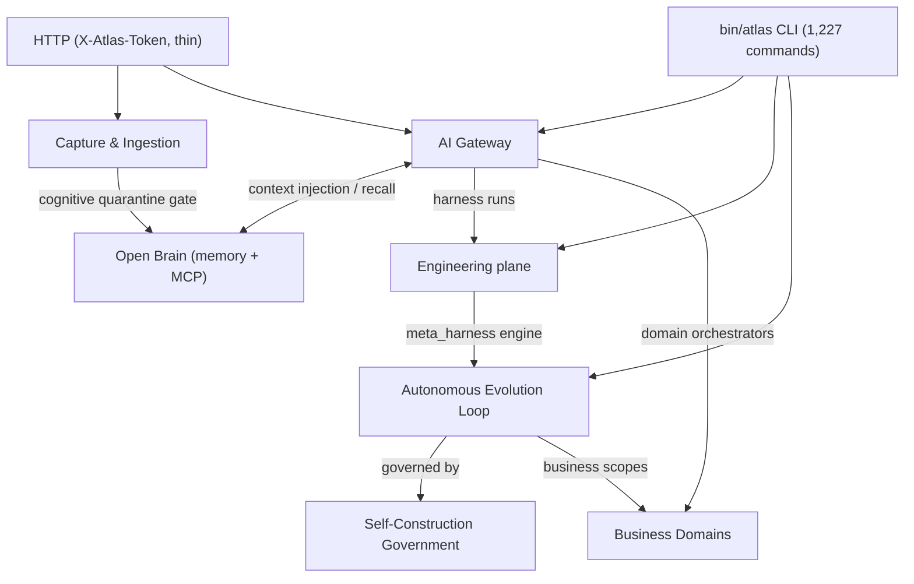
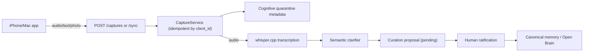
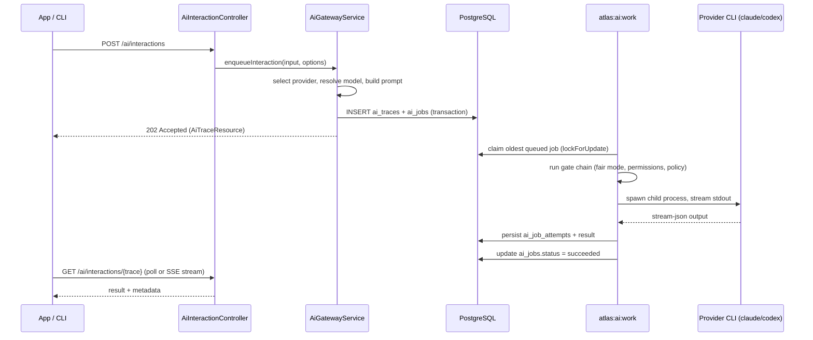
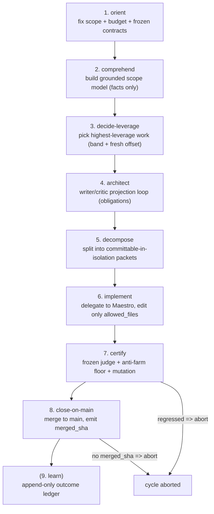
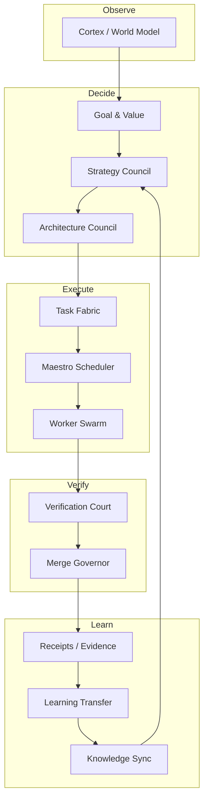

# Architecture

Atlas Server is a single Laravel application. The HTTP layer is thin (`routes/api.php`, protected by a static `X-Atlas-Token`); the real surface is 1,227 artisan commands dispatched by the `bin/atlas` bash launcher, which injects the caller's working directory as `--workspace`. The intelligence lives under `app/Services/`, overwhelmingly `app/Services/Ai/` (112 subdirectories).

## Layering

The system has eight conceptual layers. Each one is a wiki page set under [systems/](../systems/index.md):

## Data flow: capture to knowledge

A raw capture enters through the HTTP API, is stored with cognitive quarantine metadata, and can only become memory or context after human ratification:

## Data flow: AI interaction lifecycle

The app never calls models directly. An interaction creates a trace and a job; a local worker runs the provider CLI:

## The 8-phase evolution cycle

The Autonomous Evolution Loop runs a strict sequential cycle. Any phase failure aborts the cycle. Close-on-main is only "completed" with a real non-null `merged_sha`:

## Separation of powers

The Self-Construction Government enforces that no single agent spans originate, implement, judge, merge, and promote. Each role is a distinct organ:

## Language breakdown

The codebase is almost entirely PHP:

| Language | Files | Approximate LOC |
|----------|-------|-----------------|
| PHP (app) | ~7,100 | ~1.73M |
| PHP (tests) | ~5,000 | ~1.0M |
| Bash (bin/, scripts/) | ~30 | ~3,000 |
| Markdown (docs/) | ~1,866 | ~large |
| YAML (config, CI) | ~25 | ~1,000 |

See [by the numbers](../by-the-numbers.md) for the full statistics snapshot.
