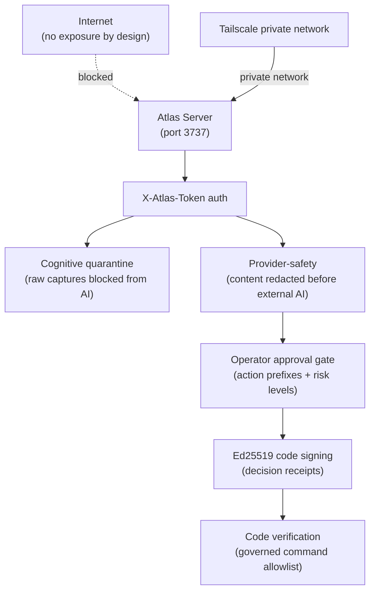

# Security

Atlas Server is a single-tenant system deployed on a private network. It handles personal data (captures, health signals, digital activity) and controls autonomous AI agents that can merge code to main. Security is layered: authentication, network isolation, cognitive quarantine, provider-safety, operator approval, code signing, code verification, and database-level constraints.

## Trust boundaries



## Authentication: X-Atlas-Token

All protected endpoints require the `X-Atlas-Token` header, set to the `ATLAS_TOKEN` environment variable. The middleware `AuthenticateAtlasToken` (registered as `atlas.token` in `bootstrap/app.php`) validates the header on every request. The only public endpoint is `GET /health`.

The mobile API (`/api/v1/mobile/*`) uses a separate bearer token middleware (`atlas.mobile.bearer`) for paired devices, with a pairing flow that confirms device identity before issuing the token.

There is no user/session authentication. The system is single-tenant: one operator, one token.

## Tailscale private network

The server runs behind Tailscale on a private network. There is no public internet exposure by design. The operator's iPhone and Mac connect over the Tailscale mesh. This is the first layer of defense: the server is not reachable from the public internet at all.

## Cognitive quarantine

A raw capture (text, audio, photo) is not memory, context, decision, or learning signal. It is blocked from embedding, provider-export, and the Open Brain until a human ratifies a curation proposal. This prevents unprocessed personal data from entering the AI pipeline. See [cognitive quarantine and privacy](../systems/capture-ingestion/cognitive-quarantine-and-privacy.md).

## Provider-safety

Every byte that can cross to an external AI (Claude, Codex, Gemini, Cursor) is redacted by construction. `AtlasMemoryPrivacyService` filters memory by privacy level. `AtlasOpenBrainGuardService` enforces redaction on outbound brain content. The AURG provider floor excludes sensitive nodes structurally at query time. No raw sensitive or secret bodies cross the boundary. See [provider safety](../concepts/provider-safety.md).

## Operator approval gate

Consequential actions pass through the Operator Approval Gate (`app/Services/Ai/OperatorApproval/OperatorApprovalGateService.php`). The gate decides per action prefix and risk level:

| Mode | Behavior |
|------|----------|
| `allow_auto` | Execute without confirmation |
| `require_confirmation` | Pause and ask the operator |
| `require_review` | Pause and require human review |
| `block` | Refuse the action |
| `escalate_to_forge` | Route to the forge for max-power handling |

Action prefixes include `mission.*`, `tool.destructive`, `finance.trade`, `cyber.exploit`, and `forge.obra`. Risk levels range from low to critical. The gate modes, risk levels, and action prefixes are canonical enums in `OperatorApprovalCanon.php`.

There is deliberately no turn-ON HTTP endpoint for agents. The agent governance API exposes read endpoints and write endpoints that only turn agents OFF. A tapped app can only reduce spend.

## Code signing: Ed25519 decision receipts

Human/operator decisions are signed with Ed25519 (`config/atlas_code_signing.php`). The keypair is a 128-byte sodium sign keypair, base64-encoded in `ATLAS_DECISION_SIGNING_KEYPAIR_BASE64`. When the keypair is absent, the signer reports `signing_status: 'unavailable'` honestly. Atlas never silently signs with a synthetic keypair.

Decision receipts are persisted to `storage/app/atlas-code/decision-receipts.jsonl`. Generate a keypair locally:

```bash
php -r "echo base64_encode(sodium_crypto_sign_keypair()).PHP_EOL;"
```

## Code verification: governed command allowlist

After an observed session imports its result, Atlas can run verification commands on behalf of the operator. This is governed by `config/atlas_code_verification.php`:

- **Regex allowlist** — only matched commands run (pnpm test, npm run test, composer test, php artisan test, cargo test, go test, pytest, and variants).
- **Default dry_run** — no execution until the operator opts in.
- **Execute requires** — a signed Ed25519 receipt plus an operator override token (`ATLAS_VERIFICATION_OPERATOR_TOKEN`).
- **Per-run timeout** — subprocess is killed after the timeout.
- **Hard kill switch** — `ATLAS_VERIFICATION_EXECUTE_ENABLED` defaults to false. When false, every call returns dry_run regardless of override or signed receipt.

## DB-level CHECK constraints

The database enforces integrity at the schema level, not just in the ORM. CHECK constraints validate enums (kind, domain, state, category_class, status). Foreign keys enforce referential integrity. The `set_updated_at()` trigger maintains timestamps. UUID primary keys prevent enumeration. These constraints mean a bug in application code cannot write invalid enum values or break referential integrity. See [patterns and conventions](../how-to-contribute/patterns-and-conventions.md).

## Master switches

The autonomous systems are controlled by fail-closed `.env` master switches, all defaulting to OFF:

| Switch | Default | Controls |
|--------|---------|----------|
| `ATLAS_LOOP_MASTER_ENABLED` | OFF | The autonomous evolution loop |
| `ATLAS_BRAIN_MASTER_ENABLED` | OFF | The brain perception cycle |
| `ATLAS_FLEET_ENABLED` | OFF | The fleet control plane |
| `ATLAS_AGENTS_RECONCILER_ENABLED` | OFF | The fleet reconciler (babá) |

These are read from `.env` directly, not from the config cache, so they remain robust under `config:cache`. They are operator-only. The loop can never re-enable itself. See [earned autonomy](../concepts/earned-autonomy.md).

## Single-tenant design

The system is single-tenant by design. There is one operator, one token, one database, one server. There is no multi-tenancy, no tenant isolation layer, no per-user auth. This simplifies the trust model: the operator owns everything, and the only external boundary is the provider-safety gate to external AI.

## Related pages

- [Provider safety](../concepts/provider-safety.md) — the full provider-safety model
- [Cognitive quarantine and privacy](../systems/capture-ingestion/cognitive-quarantine-and-privacy.md) — capture-side quarantine
- [Earned autonomy](../concepts/earned-autonomy.md) — master switches and fail-closed design
- [CLI and operator surface](../systems/cli-operator/index.md) — operator mode and approval gate
- [API](../api/index.md) — the two API surfaces
- [Deployment](deployment.md) — Docker, launchd, and the deployment model
