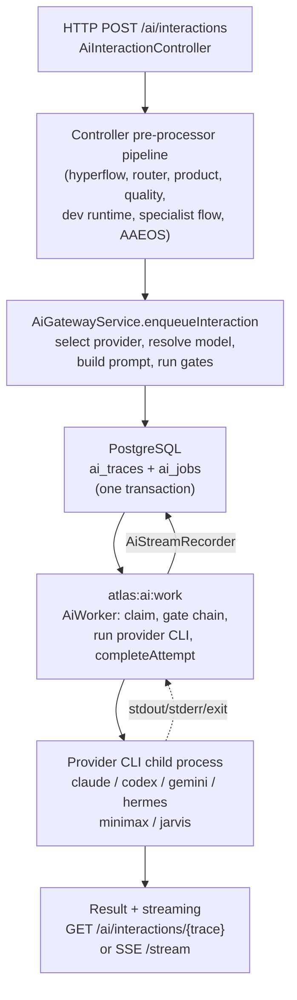

# AI Gateway

The AI Gateway is the single mediated path by which the Atlas app reaches a frontier model. It is built on one hard invariant: **the app never calls Claude, Codex, Gemini, or any other model API directly**. Instead an HTTP request creates an *interaction*; the server persists an `ai_traces` row (the operator-facing record of intent) and one or more `ai_jobs` rows (the executable unit of work) into PostgreSQL; and a **local worker** running on the Mac polls that queue, claims a job, and runs the corresponding already-authenticated **CLI binary** as a child process, streaming the result back.

The gateway exists because Atlas delegates real engineering work to autonomous AI agents 24/7. That only stays safe if every model call is observable, gated, redacted, budgeted, and replayable. Routing all model access through a queue of CLI invocations gives the system a single place to enforce permissions, decision receipts, provider-safety redaction, budget limits, quality scoring, health checks, and an append-only evidence ledger. A direct API call would skip all of it.

## The interaction spine

One interaction moves through five stages. Each stage is a separate page in this wiki set:



1. **HTTP entry** ([Interaction lifecycle](interaction-lifecycle.md)) — `AiInteractionController::store` ingests attachments and runs an ordered pre-processor pipeline that enriches the payload before the gateway is called.
2. **Gateway enqueue** — `AiGatewayService::enqueueInteraction` normalizes options, selects a provider ([Provider selection and routing](provider-selection-and-routing.md)), resolves the thread and session ([Sessions, threads and streaming](sessions-threads-streaming.md)), builds the prompt, runs the budget gate, and writes one `AiTrace` plus one `AiJob` in a single DB transaction. Returns `202 Accepted`.
3. **Local worker** ([The local worker](the-local-worker.md)) — `atlas:ai:work` polls `ai_jobs`, claims the oldest ready job under `lockForUpdate`, runs the gate chain, calls the provider, and finalizes the attempt.
4. **Provider CLI** ([Providers and the CLI driver model](providers.md)) — a driver implementing `AiProvider` assembles the CLI argv, spawns the child process through the shared `RunsCliProcesses` trait, streams stdout, and returns an `AiProviderResult`.
5. **Result and quality** ([Quality, budget and health](quality-budget-health.md)) — `completeAttempt` persists the attempt, scores quality, attributes feedback, and updates the trace. The client reads the final answer or streams it live over SSE.

## Directory layout

The gateway core lives directly under `app/Services/Ai/`. Provider CLI drivers sit alongside it. The HTTP entry points are in `app/Http/Controllers/`, and the worker is an artisan command.

```
app/Services/Ai/
  AiGatewayService.php          interaction -> trace + job factory (the front door)
  AiWorker.php                  job claim + provider execution + completion state machine
  AiProvider.php                the contract every provider implements
  AiProviderManager.php         provider registry + ADML consultation + decorators
  AiProviderModelResolver.php   provider -> model / tier / alias resolution
  AiProviderHandoffService.php  context brief on provider switch
  AiProviderHealthService.php   health snapshots + pain score
  AiProviderChoiceResolver.php  awaiting_user_choice pause/resolve
  AiThreadResolver.php          thread resolution / continuation
  AiSessionManager.php          session lifecycle (idle / resume)
  AiStreamRecorder.php          sequenced streaming event persistence
  AiCouncilCoordinator.php      multi-provider council aggregation
  AiQualityEvaluator.php        post-run heuristic quality scoring
  AiQualityActionService.php    quality verdict -> remediation actions
  AiRuntimeBudgetService.php    token / cost budget gate
  AtlasDecideService.php        sealed advisor: operational provider/model decision
  FairClaudePolicy.php          provider/model lock policy ("fair mode")
  AtlasAiRuntimeSettings.php    effective runtime settings + DB override
  AiPromptBuilder.php           assembles the final provider prompt
  AiPrompt.php                  immutable prompt DTO
  AiIntentRouter.php            keyword -> agent / intent classifier
  ClaudeCliProvider.php         claude CLI driver (stream-json)
  CodexCliProvider.php          codex exec CLI driver
  GeminiCliProvider.php         gemini CLI driver
  HermesCliProvider.php         Hermes executive runtime (ACP / CLI dual transport)
  MinimaxM27CliProvider.php     MiniMax-M3 via governed Python adapter
  JarvisMlxProvider.php         local MLX model via python cli.py
  Concerns/
    RunsCliProcesses.php        shared trait: spawn / stream / timeout / health
app/Http/Controllers/
  AiInteractionController.php   POST /ai/interactions + stream + feedback
  AiJobController.php           job retry / cancel / resume-choice
  AiProviderController.php      /ai/providers/status + check + settings
  AiThreadController.php        thread CRUD + state + compact + switch-provider
app/Console/Commands/
  AiWorkCommand.php             atlas:ai:work (the local worker process)
```

## Key abstractions

| Path | Role |
|---|---|
| `app/Services/Ai/AiGatewayService.php` | Interaction to trace+job factory; the gateway front door |
| `app/Services/Ai/AiWorker.php` | Job claim, gate chain, provider execution, completion state machine |
| `app/Services/Ai/AiProvider.php` | Provider contract: `key()`, `run()`, `runStreaming()`, `health()` |
| `app/Services/Ai/Concerns/RunsCliProcesses.php` | Shared CLI process runner, streamer, timeout, and health checks |
| `app/Services/Ai/AiProviderManager.php` | Provider registry, ADML learned-route consultation, cache/compression decorators |
| `app/Services/Ai/AiProviderModelResolver.php` | Provider to model, tier, and alias resolution |
| `app/Services/Ai/AtlasDecideService.php` | Sealed advisor producing the operational provider/model decision |
| `app/Services/Ai/FairClaudePolicy.php` | Provider/model lock that disables handoff, switch, and downgrade |
| `app/Services/Ai/AiProviderHealthService.php` | Health snapshots and operational pain score |
| `app/Services/Ai/AiStreamRecorder.php` | Sequenced streaming events (the SSE substrate) |
| `app/Services/Ai/AiCouncilCoordinator.php` | Multi-provider council aggregation |
| `app/Services/Ai/AiQualityEvaluator.php` | Post-run heuristic quality scoring |
| `app/Services/Ai/AiRuntimeBudgetService.php` | Token/cost budget gate |
| `app/Http/Controllers/AiInteractionController.php` | HTTP entry plus the pre-processor pipeline |
| `app/Console/Commands/AiWorkCommand.php` | The worker process (`atlas:ai:work`) |
| `app/Models/AiTrace.php`, `AiJob.php`, `AiJobAttempt.php` | The three core persisted entities |
| `config/atlas.php` (`atlas.ai`) | Provider and runtime configuration source of truth |

## How the pieces fit

The gateway is opt-in and fail-open at every layer. The legacy single-provider path keeps working when newer features (ADML learned routing, mesh fan-out, compression, response cache, cognitive function decomposition, preflight) are off. Each newer seam is wired by `AppServiceProvider` as a nullable dependency, so a unit test can construct the gateway without the optional stack and the default behavior stays byte-identical.

The job queue is **custom and DB-backed**, not Laravel's queue worker. `ai_jobs` is polled by `atlas:ai:work` under `lockForUpdate`, ordered by `priority` then `created_at`. Laravel's queue is used only for side jobs such as rendering attachment visuals (`ProcessAiAttachmentVisuals` on the `attachments` queue).

## Integration points

- **HTTP** — all `ai/*` routes in `routes/api.php` behind the `atlas.token` middleware. See [the HTTP API reference](../../api/ai-gateway-api.md).
- **Open Brain** — `AiPromptBuilder` injects brain context (recall + context pack) into the prompt. See [Open Brain](../open-brain/index.md).
- **Engineering plane** — the harness runs provider calls through this gateway. See [Engineering](../engineering/index.md).
- **Autonomous Evolution Loop** — the loop uses the gateway as its execution engine for implementing changes. See [Evolution Loop](../evolution-loop/index.md).
- **CLI operator surface** — `bin/atlas` is the local human surface on top of the gateway. See [CLI operator](../cli-operator/index.md).
- **Separation of powers** — the provider that writes a change never judges it. See [Separation of powers](../../concepts/separation-of-powers.md).

## Pages in this set

- [Interaction lifecycle](interaction-lifecycle.md) — HTTP entry through the controller pre-processor pipeline to the persisted trace and job
- [The local worker](the-local-worker.md) — `AiWorker` claim loop, gate chain, attempt execution, stale recovery
- [Providers and the CLI driver model](providers.md) — the `AiProvider` contract, `RunsCliProcesses`, per-provider drivers, registry
- [Provider selection and routing](provider-selection-and-routing.md) — AtlasDecide, fair mode, ADML, fallbacks, council
- [Sessions, threads and streaming](sessions-threads-streaming.md) — thread resolution, session lifecycle, handoffs, SSE
- [Quality, budget and health](quality-budget-health.md) — quality evaluation, budget gate, health snapshots, dashboard

## Key source files

| File | What to read |
|---|---|
| `app/Services/Ai/AiGatewayService.php` | `enqueueInteraction()` — the full enqueue flow |
| `app/Services/Ai/AiWorker.php` | `runNextMatching()`, `claimJob()`, `completeAttempt()` |
| `app/Services/Ai/AiProvider.php` | The four-method provider contract |
| `app/Services/Ai/Concerns/RunsCliProcesses.php` | `runProcessStreaming()`, `checkCliRuntimeContract()` |
| `app/Http/Controllers/AiInteractionController.php` | `store()` — the pre-processor pipeline |
| `app/Console/Commands/AiWorkCommand.php` | The worker loop signature and options |
| `config/atlas.php` | The `atlas.ai.*` configuration block |
| `database/migrations/2026_04_28_060000_create_ai_gateway_tables.php` | Core table DDL |
