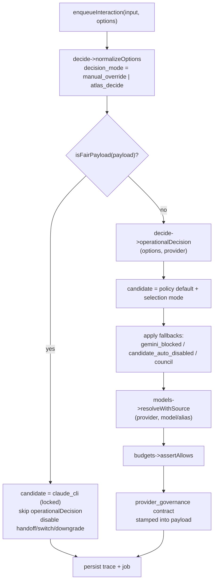

# Provider selection and routing

Every interaction gets a provider and a model. Atlas does not leave that choice to a single hard-coded default. A sealed advisor (`AtlasDecideService`) produces the operational decision, a lock policy (`FairClaudePolicy`) can pin the provider and model, a learned-route advisor (ADML) can override the default from observed outcomes, and a set of fallbacks re-routes when the candidate cannot serve the request. This page covers the decision, fair mode, ADML, fallbacks, the governance contract, and the council, the deliberate multi-provider exception.

## Key abstractions

| Path | Role |
|---|---|
| `app/Services/Ai/AtlasDecideService.php` | Sealed advisor: `normalizeOptions()`, `operationalDecision()`, decision receipts |
| `app/Services/Ai/AtlasAiPolicyService.php` | Composes the effective policy profile (capability, permission, execution) |
| `app/Services/Ai/AiProviderModelResolver.php` | Resolves `(provider, model/alias) -> {model, source, label, tier, allow_auto/manual}` |
| `app/Services/Ai/FairClaudePolicy.php` | Provider/model lock ("fair mode"); disables handoff, switch, downgrade |
| `app/Services/Ai/AtlasAiRuntimeSettings.php` | Effective runtime settings: `defaultProvider()`, `defaultProviderSelection()`, DB-backed override |
| `app/Services/Ai/AtlasDecide/AtlasDecideGatewayConsultationService.php` | ADML consultation; `VERDICT_FOLLOW_LEARNED` learned route |
| `app/Services/Ai/AtlasDecide/AtlasDecideMetaLearningService.php` | ADML meta-learning backend |
| `app/Services/Ai/AtlasDecide/AtlasDecideLiveOutcomeFeedbackService.php` | Records provider-call outcomes for the learned route |
| `app/Services/Ai/Hermes/HermesRuntimeRouter.php` | Hermes runtime router receipt |
| `app/Services/Ai/Hermes/Mesh/HermesMeshRoutingAdvisor.php` | Advises whether a mission should fan out as a mesh |
| `app/Services/Ai/AiCouncilCoordinator.php` | Aggregates council (claude + codex) child jobs into one trace |
| `app/Services/Ai/AiProviderHandoffService.php` | Context brief on provider switch |
| `app/Services/Ai/AiProviderChoiceResolver.php` | Resolves an `awaiting_user_choice` operator decision |

## How it works

### The default

The default provider is `config('atlas.ai.default_provider')`, which is `hermes_cli`. `AtlasAiRuntimeSettings::defaultProvider()` reads the effective setting (config plus any DB-backed operator override via `update()`). The default selection mode (`default_provider_selection`, default `fixed`) controls whether automatic selection is allowed. The operator can change both at runtime through `PATCH /ai/providers/settings`.

### AtlasDecide

`AtlasDecideService` is the sealed advisor that produces the operational decision. It is the single authority for "which provider, which model, which execution graph, with what fallback reason".

`normalizeOptions($options)` is the first step in `enqueueInteraction`. It normalizes legacy app/CLI payloads into the AtlasDecide contract. It reads `payload.decision_mode`, `payload.operator_requested_provider`, `payload.requested_provider`, and the top-level `provider`. If a manual override is derivable from those parts, it sets `decision_mode='manual_override'` and pins `options['provider']`. Otherwise it sets `decision_mode='atlas_decide'`, records `operator_requested_provider` (defaulting to `auto`), and clears the explicit provider so the advisor decides.

`operationalDecision($options, $selectedProvider)` then produces an `OperationalDecision` value object. The flow:

1. Compose the effective policy profile (`AtlasAiPolicyService::effectiveProfile`).
2. Determine the manual override provider; if present, selection mode is `manual_override`.
3. Pick the candidate provider from the policy default + selection mode (`candidateProvider`).
4. If no selected provider was passed, default it to the candidate, then apply fallback rules:
   - If the manual override is `claude_codex`, route to the council.
   - If the manual override is a known provider, use it.
   - If the candidate is `gemini_cli` but Gemini is blocked for this invocation (dev-like task), fall back to the policy's fallback provider with reason `gemini_blocked_for_dev_like_task`.
   - If the call is automatic and the candidate does not allow auto (`providerAllowsAuto`), fall back with reason `candidate_auto_disabled`.
5. If a selected provider was passed and differs from the candidate, compute the fallback reason.
6. Resolve the model (`AiProviderModelResolver::resolveWithSource`) handling aliases `auto` / `default` / `premium` / `fallback`.
7. Build the decision plan (`execution_graph`), the selection explanation (with Hermes runtime router receipt when Hermes is involved, mesh routing advice, and a rivals advisory), and the kernel contract receipts.
8. Issue the decision receipt (v2) stamped onto the trace.

The gateway stores `atlas_decide` metadata on the trace and job: `decision_id`, `policy_profile_id`, `policy_version`, `candidate_provider`, `selected_provider`, `fallback_provider`, `fallback_reason`, `planned_graph`, `runtime_graph`.

### Fair mode

`FairClaudePolicy` is a provider/model lock used for controlled comparison runs (the "Rivals" battery). When a payload is fair (`fair_mode`, `claude_only`, `single_provider`, `no_decide`, or `fallback_disabled` flags), the gateway takes a completely different decision path: `candidateProvider` is pinned to `claude_cli`, the model is pinned to the locked model (default `opus`, with `sonnet` allowed via the `MODEL_LOCK_ALLOWLIST`), `operationalDecision` is skipped, and the decision payload is a `fair_mode_disabled` plan. Fair mode also disables provider handoffs, provider switching, and model downgrade at the worker and in `AiProviderChoiceResolver`. The worker enforces this at runtime via `fairModeRuntimeViolation`.

### ADML learned route

`AiProviderManager::getRecommended($taskCategory, $role, $framework, $privacyClass, $actor)` is the ADML (AtlasDecide Meta-Learning) consultation path. It asks `AtlasDecideGatewayConsultationService::consult()` for the active learned route. The provider is only changed when:

- consultation is wired (otherwise the default is returned),
- the verdict is `VERDICT_FOLLOW_LEARNED`, and
- the route's `active_route.provider` is a known key.

Otherwise it falls back to the default. ADML is advisory, not authoritative, and never throws on consultation errors (the verdict becomes `consultation_error`). The [worker](the-local-worker.md) records the outcome of every provider call to `AtlasDecideLiveOutcomeFeedbackService` (success, failure, or timeout, with latency, quality score, cost, and tokens), which feeds the learned route.

### Fallbacks

Beyond the AtlasDecide fallback reasons, the gateway has several helpers that re-route when the requested provider cannot serve the request:

- **Image attachments** — when the payload carries images and the requested provider cannot handle them, a viable provider is chosen.
- **Gemini blocked for dev-like tasks** — `gemini_blocked_for_dev_like_task` falls back to the policy fallback (typically `claude_cli`).
- **Candidate auto-disabled** — `candidate_auto_disabled` falls back when an automatic call targets a provider with `allow_auto=false`.
- **Gemini to Claude (runtime)** — in the worker, `shouldFallbackGeminiToClaude` does a budget-aware fallback when Gemini fails in a way Claude can cover.
- **Swarm auto-failover** — an opt-in Patamar-4 seam where a failed primary triggers a K=2 swarm dispatch and the winning arm replaces the failure.

The `fallback_provider` is declared per provider in `config('atlas.ai.providers.{key}.fallback_provider')`.

### The governance contract

`providerGovernanceContract()` builds a `provider_governance` block stamped into the payload. It records the candidate vs selected provider, the fallback reason, and the policy profile so the worker and any reviewer can see exactly why a given provider was chosen and what would have run instead. This is part of the [evidence and receipts](../../concepts/evidence-and-receipts.md) doctrine: the decision is auditable after the fact.

### Council (the deliberate exception)

The default is one provider per interaction. Council is the deliberate exception: a single trace fans out to multiple providers for deliberation, not auto-execution. When `shouldRunCouncil` is true, `enqueueCouncilInteraction` creates one `AiJob` per council provider (`claude_cli` + `codex_cli`, kind `council`). The trace's provider is `claude_codex` and metadata carries `execution_policy: dual_review` plus the council progress counters.

Each council job gets a role: `primary_planner` (claude) or `critical_reviewer` (codex). The [worker](the-local-worker.md) runs each child job normally, and after each completion calls `AiCouncilCoordinator::sync($trace)`. `sync` locks the trace, counts job statuses, and:

- keeps the trace `processing` while any job is queued or processing,
- marks `cancelled` if all jobs were cancelled with no successes,
- marks `failed` if no job succeeded,
- marks `succeeded` with a `combinedResponse` and `provider='claude_codex'` when at least one succeeded.

Council is governed: it respects the budget gate per provider, the decision receipt, and fair mode (fair mode disables council).

### Pause for choice

When a provider call fails in a way that needs an operator decision (for example, a provider login is required), the worker can set the job to `awaiting_user_choice`. `AiProviderChoiceBuilder` constructs the option set (`switch_provider`, `downgrade_model`, `wait`, `retry_same`, `fail`, `cancel`), stamped into `job.metadata.choice_options`. The operator resolves via `POST /ai/jobs/{job}/resume-choice`, handled by `AiProviderChoiceResolver::resolve`, which applies the chosen action and requeues or fails the job. Fair mode blocks `switch_provider` and `downgrade_model`.

## How selection flows

## Integration points

- **Gateway** — `AiGatewayService::enqueueInteraction` is the only caller of `operationalDecision`. See [Interaction lifecycle](interaction-lifecycle.md).
- **Worker** — `AiWorker` enforces fair mode at runtime and records ADML outcomes. See [The local worker](the-local-worker.md).
- **Providers** — `AiProviderManager::getRecommended` consults ADML; `get` resolves the driver. See [Providers and the CLI driver model](providers.md).
- **Handoffs** — `AiProviderHandoffService` writes a context brief when the provider switches. See [Sessions, threads and streaming](sessions-threads-streaming.md).
- **Configuration** — `config('atlas.ai.default_provider')`, `config('atlas.ai.providers.{key}.allow_auto')`, `config('atlas.ai.providers.{key}.fallback_provider')`, `config/atlas_code_provider_governance.php`.
- **Separation of powers** — the provider that writes a change is never the one that judges it (council's `critical_reviewer` is a different provider from `primary_planner`). See [Separation of powers](../../concepts/separation-of-powers.md).

## Key source files

| File | What to read |
|---|---|
| `app/Services/Ai/AtlasDecideService.php` | `normalizeOptions()`, `operationalDecision()`, `candidateProvider()` |
| `app/Services/Ai/FairClaudePolicy.php` | `isEnabled()`, `normalizeFlags()`, `validate()`, `PROVIDER_LOCK`, `MODEL_LOCK` |
| `app/Services/Ai/AiProviderManager.php` | `getRecommended()` and the ADML consultation |
| `app/Services/Ai/AtlasDecide/AtlasDecideGatewayConsultationService.php` | `consult()` and `VERDICT_FOLLOW_LEARNED` |
| `app/Services/Ai/AtlasDecide/AtlasDecideLiveOutcomeFeedbackService.php` | `record()` — the outcome feedback ledger |
| `app/Services/Ai/AiProviderModelResolver.php` | `resolveWithSource()` — alias/tier resolution |
| `app/Services/Ai/AtlasAiRuntimeSettings.php` | `defaultProvider()`, `defaultProviderSelection()`, `effective()` |
| `app/Services/Ai/AiCouncilCoordinator.php` | `sync()` — council aggregation |
| `app/Services/Ai/AiProviderChoiceBuilder.php` | The `awaiting_user_choice` option builder |
| `app/Services/Ai/AiProviderChoiceResolver.php` | `resolve()` — operator choice resolution |
| `app/Services/Ai/Hermes/HermesRuntimeRouter.php` | `buildReceipt()` |
| `config/atlas_code_provider_governance.php` | `claude_programmatic_policy`, `allow_*` switches |
