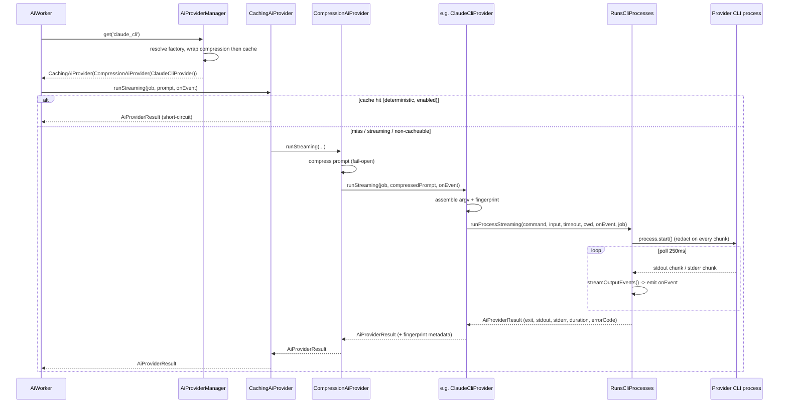

# Providers and the CLI driver model

Atlas reaches every frontier model through an already-authenticated CLI binary running as a local child process. There is no SDK, no HTTP API client, no shared key material in the app. Each provider is a driver class implementing the `AiProvider` contract and sharing one trait, `RunsCliProcesses`, that handles process spawning, streaming, timeouts, error classification, and health checks. This page covers the contract, the shared trait, every built-in driver, and the registry that ties them together.

## Key abstractions

| Path | Role |
|---|---|
| `app/Services/Ai/AiProvider.php` | The four-method provider contract |
| `app/Services/Ai/AiProviderResult.php` | Immutable result DTO (`ok`, `output`, `command`, `exitCode`, `durationMs`, `stdout`, `stderr`, `errorCode`, `errorMessage`, `metadata`) |
| `app/Services/Ai/AiProviderHealthCheck.php` | Immutable health DTO (`provider`, `status`, `message`, `metadata`) |
| `app/Services/Ai/Concerns/RunsCliProcesses.php` | Shared trait: spawn, stream, timeout, cancel, error classify, health |
| `app/Services/Ai/Concerns/RateLimitParser.php` | Parses provider rate-limit signals |
| `app/Services/Ai/AiProviderManager.php` | Registry, ADML consultation, cache/compression decorators |
| `app/Services/Ai/AtlasAiRuntimeSettings.php` | `providerConfig($key)` reads `config('atlas.ai.providers.{key}')` |
| `app/Services/Ai/Caching/CachingAiProvider.php` | Response-cache decorator (config-gated, fail-open) |
| `app/Services/Ai/Compression/CompressionAiProvider.php` | Prompt-compression decorator (config-gated, fail-open) |
| `app/Services/Ai/Provider/Drivers/` | Pluggable driver classes registered via config |

## The contract

`AiProvider` is four methods:

```php
interface AiProvider
{
    public function key(): string;
    public function run(AiJob $job, string $prompt): AiProviderResult;
    public function runStreaming(AiJob $job, string $prompt, ?callable $onEvent = null): AiProviderResult;
    public function health(): AiProviderHealthCheck;
}
```

`run()` is a convenience that every built-in driver delegates to `runStreaming()` with no event callback. `runStreaming()` is what the [worker](the-local-worker.md) actually calls: it returns an `AiProviderResult` and, along the way, invokes `$onEvent` with stream chunks so the worker can persist them and forward to SSE. `health()` returns an `AiProviderHealthCheck` used by [health checks](quality-budget-health.md).

## The shared trait

`RunsCliProcesses` is where the mechanics live. Every CLI provider `use`s it. The core method is `runProcessStreaming()`:

1. Resolve the binary path (`resolveCommandBinary`, falls back to `ExecutableFinder`).
2. Build a `Symfony\Component\Process\Process` with the command, working directory (`config('atlas.ai.workdir')` or a per-job workspace), and a sanitized environment.
3. `process->start()` with a callback that buffers stdout/stderr, runs every chunk through `AtlasSecurity::redactString`, and parses stream events via `streamOutputEvents()`.
4. Poll every 250ms: `checkTimeout()`, detect early CLI failures, and check whether the job was cancelled (`jobWasCancelled`).
5. On early error or cancellation, reap the process and return a failed `AiProviderResult` with the classified error code.
6. On normal completion, classify the error (`classifyCliError`: `rate_limited`, `policy_violation`, `auth_required`, `provider_timeout`, etc.), redact, and return the result.

The trait also provides:

- `checkBinary($providerKey, $binary)` — verifies the binary exists on PATH.
- `checkCliRuntimeContract(...)` — runs `<binary> --help` and asserts a set of required tokens (flags/keywords) are present, returning `online` / `degraded` / `offline`. Each provider declares its own contract name and required tokens.
- `computeEffortContractForJob()` — reads the compute-effort contract from the job payload.
- `cliInvocationFingerprint()` — a hash of command + prompt + timeout + cwd + provider-specific fields, stamped into the attempt metadata for audit.
- `sanitizeConfiguredArgs()`, `withArgValue()`, `withRepeatedArgValues()`, `withAtlasRuntimeArgs()` — argv assembly helpers.
- `workdirForJob()` — picks the working directory for a job (per-job workspace or the configured default).
- Attachment helpers: `withImageAttachmentInstructions`, `withFileAttachmentInstructions`, `fileAttachmentAccessPaths`, `attachmentDirectories`.

Stream parsing is per-provider: each driver overrides `streamOutputEvents()` and `extractOutput()` to handle its CLI's output format (Claude's stream-json, raw stdout chunks, etc.).

## Built-in drivers

| Provider key | Driver | Binary | Transport | Key features |
|---|---|---|---|---|
| `claude_cli` | `app/Services/Ai/ClaudeCliProvider.php` | `claude` | CLI, `--output-format stream-json` | Reference driver; parses stream-json text + thinking deltas; `--model`, `--effort`, `--permission-mode`, `--add-dir`, `--no-session-persistence`; attachment instructions in prompt; contract `claude_cli_provider.v1` |
| `codex_cli` | `app/Services/Ai/CodexCliProvider.php` | `codex` | CLI, `codex exec` | `--sandbox` (default `read-only`), `--skip-git-repo-check`, `model_reasoning_effort` via `-c`, `--output-last-message` to a temp file, `--add-dir` for file attachments; reads the last message file as the final output |
| `gemini_cli` | `app/Services/Ai/GeminiCliProvider.php` | `gemini` | CLI, `--output-format stream-json` | Model selection via `GeminiModelCatalog` (flash/pro aliases); `--approval-mode=yolo`, `--skip-trust`, `--include-directories` for attachments; fail-closed model policy with `fallback_provider` (default `claude_cli`) |
| `hermes_cli` | `app/Services/Ai/HermesCliProvider.php` | `hermes` | Dual: persistent ACP (JSON-RPC) with CLI fallback | The default executive provider; capability registry/manifest, MCP adapter, mission factory, mesh fan-out, memory/schedule/procedure/hook adapters; records `lastAcpFallbackReason` on every attempt |
| `minimax_m27_cli` | `app/Services/Ai/MinimaxM27CliProvider.php` | governed Python adapter | Adapter (`AtlasMinimaxM27CliRuntimeExecutor`) | Executor-only scope contract; builds a manifest and calls the runtime executor; health checks the adapter configuration; reports input/output tokens |
| `jarvis_mlx` | `app/Services/Ai/JarvisMlxProvider.php` | `python3 cli.py` | Local MLX script | Runs a local MLX model via `../dissecar/huw-prosser/jarvis-mlx/repo/cli.py`; `--model`; contract `jarvis_mlx_provider.v1` |

### Claude CLI (the reference driver)

`ClaudeCliProvider::runStreaming` reads `providerConfig('claude_cli')`, sanitizes the configured args (default `['-p']`), appends `--model`, `--effort` (from the compute-effort contract), and the Atlas runtime args (`--permission-mode`, `--add-dir`, `--output-format stream-json`, `--no-session-persistence`). It computes an invocation fingerprint, calls `runProcessStreaming`, and returns the result with the fingerprint in metadata. `streamOutputEvents` parses Claude's stream-json frames (text and thinking deltas) into `token` events. `health()` asserts the `claude_cli_provider.v1` contract: `--model`, `--effort`, `--permission-mode`, `--add-dir`, `--output-format`, `stream-json`, `--no-session-persistence`.

### Codex CLI

`CodexCliProvider` runs `codex exec`. It writes the final assistant message to a temp file via `--output-last-message`, reads it back, redacts it, emits a `codex_last_message` response event, and uses that as the output. Sandbox mode comes from `tool_permissions.codex_sandbox` or the provider config (default `read-only`). File attachments become `--add-dir` entries plus prompt instructions.

### Gemini CLI

`GeminiCliProvider` resolves the model through `GeminiModelCatalog::resolveForJob`, which can fail closed (returns a failed result with `fallback_provider`) when no allowed model is selected. It uses `--approval-mode=yolo` and `--skip-trust`, prepares an attachment workspace for `--include-directories`, and validates the model policy on the result. `health()` reports the model catalog and allowed models.

### Hermes (the default executive runtime)

`HermesCliProvider` is the default (`config('atlas.ai.default_provider') = 'hermes_cli'`). It is the most complex driver because Hermes is Atlas's executive runtime, not just a model wrapper. It uses **dual transport**: a persistent ACP (JSON-RPC) session via `AtlasHermesAcpRuntime` / `HermesAcpSessionPool` / `HermesAcpTransport`, with a CLI fallback. It builds an executive mission (`HermesExecutiveMissionFactory`), applies a capability manifest from `HermesCapabilityRegistry`, and wires memory, schedule, procedure, MCP, delegation, and hook adapters. Every attempt records `lastAcpFallbackReason` so the audit trail shows why a given attempt used the transport it used. When AtlasDecide routes a mission as a mesh, the worker calls `HermesMeshJobRunner` instead of the provider directly.

### MiniMax and Jarvis (adapter / local)

`MinimaxM27CliProvider` does not spawn a binary directly. It builds a manifest and calls `AtlasMinimaxM27CliRuntimeExecutor::execute`, a governed Python adapter with an executor-only scope contract. Health checks the adapter configuration and lists blockers when it is not configured. `JarvisMlxProvider` runs a local MLX model through `python3 ../dissecar/huw-prosser/jarvis-mlx/repo/cli.py` and asserts the `jarvis_mlx_provider.v1` contract.

## The registry and decorators

`AiProviderManager` is the open provider registry. Its constructor seeds six built-in drivers (`claude_cli`, `codex_cli`, `gemini_cli`, `jarvis_mlx`, `hermes_cli`, `minimax_m27_cli`), each as a `Closure(): AiProvider` resolved lazily, then extends itself from `config('atlas.ai.provider_drivers')`. A new provider is onboarded by registration (a config entry plus a driver class implementing `AiProvider`), never by editing the manager. Built-in keys are never overridden by config. `registerDriver()` also accepts an already-resolved instance, a Closure, or an FQCN string for runtime/test wiring.

`get($providerKey)` resolves the factory, asserts it returns an `AiProvider`, then wraps it with two optional decorators, both config-gated and fail-open:

- **Compression (innermost)** — `CompressionAiProvider` transforms the prompt the real provider sees. Only when `atlas.compression_layer.enabled` is true and the pipeline is wired. Fail-open: on any error the original prompt is forwarded.
- **Response cache (outermost)** — `CachingAiProvider` keys on the logical prompt and short-circuits before any provider call. Only when `atlas.ai.cache.enabled` is true (or a cost guard is configured) and the dependencies are wired. Byte-identical to the inner provider on every miss, non-cacheable, or streaming path.

`getRecommended($taskCategory, $role, ...)` is the ADML consultation path. It asks `AtlasDecideGatewayConsultationService` for a learned route and returns the learned provider only when the verdict is `VERDICT_FOLLOW_LEARNED` and the route's provider is a known key. Otherwise it falls back to the default. ADML is advisory and never throws on consultation errors. See [Provider selection and routing](provider-selection-and-routing.md).

`keys()` returns all registered provider keys, used by health checks and the provider dashboard.

## How a call flows



## Integration points

- **Worker** — `AiWorker` calls `providers->get($key)->runStreaming()`. See [The local worker](the-local-worker.md).
- **Selection** — `AiProviderManager::getRecommended` consults ADML; `AiGatewayService` picks the provider at enqueue. See [Provider selection and routing](provider-selection-and-routing.md).
- **Health** — `AiProviderHealthService::checkAll` calls each provider's `health()`. See [Quality, budget and health](quality-budget-health.md).
- **Hermes mesh** — `HermesMeshJobRunner` fans out AtlasDecide-routed mesh missions.
- **Configuration** — `config('atlas.ai.providers.{key}')` holds binary, model, model_label, tier, allow_auto, args, sandbox, fallback_provider per provider; `config('atlas.ai.provider_drivers')` holds the open registry.
- **CLI operator** — the operator surface exposes provider strategy and model catalog services. See [CLI operator](../cli-operator/index.md).

## Key source files

| File | What to read |
|---|---|
| `app/Services/Ai/AiProvider.php` | The four-method contract |
| `app/Services/Ai/AiProviderResult.php` | The result DTO fields |
| `app/Services/Ai/Concerns/RunsCliProcesses.php` | `runProcessStreaming()`, `checkCliRuntimeContract()`, `classifyCliError()`, `cliInvocationFingerprint()` |
| `app/Services/Ai/AiProviderManager.php` | The registry, `get()`, `getRecommended()`, decorator wrapping |
| `app/Services/Ai/ClaudeCliProvider.php` | The reference stream-json driver |
| `app/Services/Ai/CodexCliProvider.php` | `codex exec` + `--output-last-message` |
| `app/Services/Ai/GeminiCliProvider.php` | Model-catalog-driven driver with fail-closed policy |
| `app/Services/Ai/HermesCliProvider.php` | Dual-transport executive runtime |
| `app/Services/Ai/MinimaxM27CliProvider.php` | Governed Python adapter driver |
| `app/Services/Ai/JarvisMlxProvider.php` | Local MLX driver |
| `app/Services/Ai/GeminiModelCatalog.php` | Gemini alias to model/tier resolution |
| `config/atlas.php` | `atlas.ai.providers.*` and `atlas.ai.provider_drivers` |
